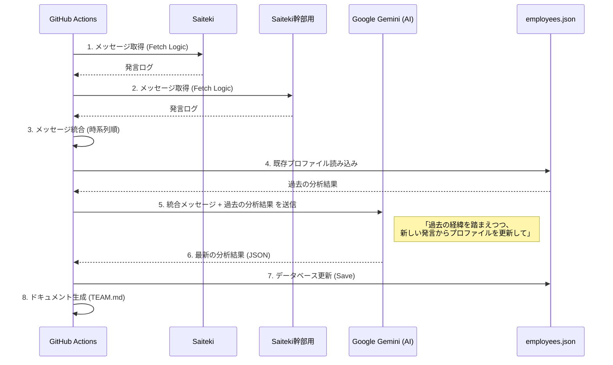

# Saiteki Employee Management

## プロジェクト概要
このプロジェクトは、社内のSlackでのコミュニケーションデータを活用し、AIを用いて社員の「人柄」や「強み」を自動的に分析・可視化するシステムです。
日々の何気ない会話から、各メンバーの個性やチーム内での役割（ムードメーカー、論理的思考の持ち主など）を発見し、組織作りやチームビルディングに役立てることを目的としています。

👉 **[社員プロフィール図鑑 (TEAM.md) はこちら](docs/TEAM.md)** - AIが生成した最新の社員分析結果をご覧いただけます。

## 主な機能：Slack同期とAI分析

このシステムの核となるのが、Slackの会話履歴を定期的に収集し、AIで分析する機能です。

### 🤖 何ができるのか？
1.  **自動収集**: 毎週月曜日の朝に、指定されたSlackチャンネルから過去1週間の発言*を自動で集めます。
    * （*手動実行時は過去のログも取得可能）
2.  **AI分析 (Saiteki Custom Model)**:
    単なる一般的なAI分析ではありません。**「Saitekiが考えるS級人材」の基準を学習させたカスタムチューニングモデル**を使用しています。
    -   **独自基準での評価**: 通常は人間（経営層や人事）が行う定性的な評価を、Saitekiの価値観を深く理解したAIが代替・補完します。
    -   **精度と客観性**: 「Saitekiらしさ」の解像度を高めたモデルにより、一般的・平均的な評価ではなく、Saitekiのカルチャーに真にマッチするかどうかを多角的に分析します。
    
    分析項目:
    -   **性格傾向**: 開放性、誠実性、協調性などの心理学的指標
    -   **仕事スタイル**: 問題解決のアプローチや強み
    -   **コミュニケーション**: 発言の特徴やクセ
    -   **価値観**: 仕事において大切にしていること
    -   **現在の状態**: 直近のモチベーションや業務負荷
3.  **プロファイル更新**: 分析結果をもとに、社員プロフィール図鑑（`docs/TEAM.md`）を自動更新します。

### 🔄 複数ワークスペースへの対応
本システムは、以下の2つのワークスペースのデータも統合して分析できます。
-   **Saiteki**: 全社員が参加するコミュニケーション用のワークスペース
-   **Saiteki幹部用**: 幹部が参加するワーク用のワークスペース

-   **統合分析**: 複数の場所での発言を時系列順に並べ、一人の人物として総合的に分析します。
-   **継続的な学習**: 過去の分析結果（「強み」や「性格」など変わりにくい部分）をAIに「記憶」として渡し、新しい発言（「現在の状態」など直近の変化）と組み合わせて分析することで、長期的な変化と短期的な状態の両方を捉えます。

## 技術スタック

このシステムは以下の技術で構築されています。

-   **Runtime**: Node.js (JavaScript)
-   **CI/CD**: GitHub Actions (定期実行および手動実行の自動化)
-   **AI Model**: Google Gemini 2.5 flash (Vertex AI経由)
-   **Source Data**: Slack API
-   **Database**: JSONファイル (`data/employees.json`) - シンプルで管理しやすいテキストベースのデータベース

## データフロー

データの流れは以下の通りです。

