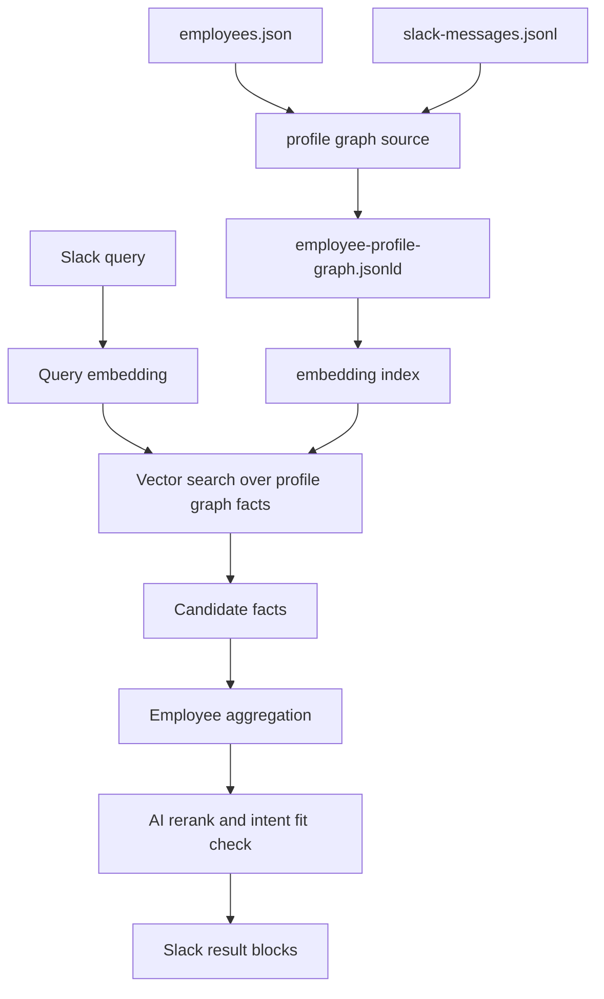

# Slack社員検索 ベクトルRAG精度改善計画

## 目的

Slack社員検索で、`QAエンジニア`、`AWS運用に詳しい人`、`ポケモンが好きな人` のような自然文に対して、文字列ルールではなく意味ベースで候補社員を返せるようにする。

現在の検索は、プロフィールグラフと検索facetを使って根拠つきで表示できる段階まで進んでいる。一方で、`QAエンジニア` のような職種・経験検索では、`エンジニア`、`AI`、`品質追求` などの周辺語に引っ張られ、期待より広い候補が出る。

この計画では、検索の中核を **AIによる意味表現とベクトル検索** に移し、ルール判定は安全弁と後方互換に限定する。

## 結論

- Slack上のカテゴリは増やさない
- 検索時の主判定は、正規表現ではなくembeddingによるベクトル検索にする
- プロフィールグラフのノード・エッジ・根拠を検索単位としてembedding化する
- 検索結果は社員単位ではなく、まず根拠単位で近傍検索し、最後に社員へ集約する
- 上位候補だけAI再ランキングし、「この検索意図に対して本当に近いか」を判定する
- 表示にはスコアだけでなく、話しかけるための具体的な接点と根拠引用を出す

## 対象外

v1では以下をやらない。

- Slackモーダルのカテゴリを細かく増やす
- Neo4jなど外部グラフDBを必須化する
- 検索結果をLLMの自由回答だけで作る
- 根拠のない推測で社員を候補に出す
- `苦手`、`嫌い` のようなネガティブ属性を検索対象にする

## 現状の課題

### 1. カテゴリ粒度が検索意図と合わない

UIカテゴリは `仕事・相談` と `興味・人柄` の2つでよい。ただし、`仕事・相談` の内部には職種、技術、業務経験、強み、仕事観が混ざっている。

そのため、`QAエンジニア` で検索したときに、QA経験者だけでなく、AI駆動開発、影響力、戦略的思考などの強みfacetも上がってくる。

### 2. 正規表現の自動判定では意味の近さを扱えない

`QA` と `品質保証`、`テスト設計`、`総合テスト`、`検証` は近い概念だが、正規表現だけでは表記揺れと文脈を十分に拾えない。

逆に、`品質追求` のような抽象的な強みはQAに近そうに見えるが、職種検索の結果としては弱い。

### 3. 引用が選出理由と完全には対応していない

引用が出るようになったことは前進だが、社員に関係する引用が表示されるだけでは不十分。`QAエンジニア` で選ばれたなら、QA、テスト、品質保証に関係する引用を優先して表示する必要がある。

## 目指す検索体験

### QAエンジニア

期待する結果:

- 開米 敦則: QAエンジニアリング、品質保証、AIを使ったQA改善の文脈
- 上原基臣: 長期のサーバ運用・テスト業務、総合テストの経験
- その他: 明確なQA、テスト、品質保証の根拠がある場合のみ表示

表示例:

```text
「QAエンジニア」に近い社員が 2名 見つかりました。

@開米 敦則
選出理由:
・QAエンジニアリングの経験
・テストプロセス改善への関心
話しかけるきっかけ:
・QA業務でAIをどう使うか
・テストプロセス改善や品質保証の進め方
根拠引用:
「...QA...」

@上原基臣
選出理由:
・約10年間のサーバ運用・テスト業務
・総合テストの担当経験
話しかけるきっかけ:
・テスト業務や総合テストの経験
・運用とテストの両方を踏まえた現場感
根拠引用:
「...約10年間サーバ運用・テスト業務...」
```

## アーキテクチャ



## データ設計

### 検索単位

検索対象は社員単位の長文ではなく、プロフィールグラフ上の根拠単位にする。

- Person node
- Topic node
- Person -> Topic edge
- ProfileFact
- SlackMessage quote

1つの検索単位には以下を持たせる。

```json
{
  "id": "search-unit:edge:auto:...",
  "personId": "person:開米 敦則",
  "personName": "開米 敦則",
  "edgeId": "edge:auto:...",
  "factId": "fact:auto:...",
  "uiCategory": "仕事・相談",
  "semanticType": "role_experience",
  "relation": "KNOWS_ABOUT",
  "topicLabel": "QAエンジニアリングの専門知識と長年の経験",
  "searchText": "QAエンジニアリング 品質保証 テストプロセス 改善 ...",
  "evidenceText": "QAエンジニアとしての経験に基づき...",
  "quotes": [
    {
      "text": "...",
      "channelId": "C...",
      "messageTs": "..."
    }
  ],
  "embedding": [0.01, -0.02]
}
```

### semanticType

Slack UIには出さないが、検索と再ランキングのために内部型を持つ。

| semanticType | 用途 | 例 |
| --- | --- | --- |
| `role_experience` | 職種・担当経験 | QAエンジニア、PM、人事、総務 |
| `technical_skill` | 技術・ツール・開発経験 | AWS、React、RAG、テスト設計 |
| `business_domain` | 業務領域 | 採用、営業、経理、オンボーディング |
| `work_strength` | 強み | 整理力、巻き込み力、戦略的思考 |
| `work_style` | 仕事の進め方 | 丁寧な説明、壁打ち、推進力 |
| `interest` | 趣味・好きなこと | ポケモン、ガンダム、音楽 |
| `personal_value` | 価値観 | 学習意欲、家族、挑戦 |

`semanticType` は検索時にユーザーへ選ばせない。AI抽出またはビルド時の分類で付与し、検索時のフィルタ・重み付け・再ランキングに使う。

## AIの使い方

### 1. データ生成時

Slack原文と社員プロフィールから、検索単位を作る。

- 話題・経験・趣味の抽出
- ノードとエッジの正規化
- `semanticType` 付与
- 具体メモの箇条書き化
- 根拠引用との紐づけ
- embedding生成

ここではAIを積極的に使う。生成結果はJSON/JSON-LDとして保存し、レビュー可能にする。

### 2. 検索時

検索時は、まずクエリをembedding化する。正規表現でカテゴリを決めるのではなく、クエリembeddingと検索単位embeddingの近さで候補を出す。

その後、上位候補だけAI再ランキングする。

再ランキングで見る観点:

- クエリの意図に直接答えているか
- 根拠が具体的か
- 職種・技術・趣味など、検索意図に対して型が合っているか
- 引用が選出理由と対応しているか

### 3. 表示時

表示文の自由生成は最小限にする。

- 選出理由は検索単位のlabelと具体メモから作る
- 引用は保存済みの原文を使う
- AI再ランキング結果は、並び順と採否判断に使う
- 根拠のない補完説明は出さない

## ベクトル検索設計

### v1: JSONファイル内ベクトル検索

まずは外部ベクトルDBを使わず、生成済みindexをWorkerで読む。

候補:

- `data/profile-search-index.json`
- `data/profile-search-index.jsonl`

内容:

- 検索単位のmetadata
- embedding vector
- root edge/factへの参照

メリット:

- 現在のGitHub Pages / raw JSON配信の延長で運用できる
- PR差分で中身をレビューできる
- Cloudflare Workerだけで実行できる

懸念:

- ファイルサイズが大きくなる
- Workerでの全件cosine計算に限界がある

v1の件数ではJSONベクトル検索から始めてよい。サイズや速度が問題になったらv2で外部indexに移す。

### v2: ベクトルDB移行

候補:

- Cloudflare Vectorize
- Supabase pgvector
- Vertex AI Vector Search

移行条件:

- 検索単位が数万件を超える
- Worker上の全件スキャンが体感で遅い
- embedding indexのPR差分が大きすぎる
- 検索ログから多段検索やフィルタが必要になった

## 検索フロー

1. Slackで自然文クエリを受け取る
2. クエリをembedding化する
3. `profile-search-index` から近傍検索する
4. 上位N件の検索単位を社員ごとに集約する
5. 社員ごとに代表根拠を選ぶ
6. 上位候補をAI再ランキングする
7. 採用ラインを超えた社員だけ表示する
8. 各社員に、選出理由・具体メモ・根拠引用・話しかけるきっかけを添える

## 採用ライン

単純なスコア閾値だけではなく、以下を合わせて判定する。

- ベクトル類似度
- `semanticType` と検索意図の一致
- 根拠引用の有無
- 具体メモの有無
- 同一社員内で複数根拠があるか
- AI再ランキングの `intentFit`

例:

```json
{
  "employeeName": "開米 敦則",
  "intentFit": "direct",
  "confidence": 0.92,
  "reason": "QAエンジニアリングとテストプロセス改善の根拠があり、検索意図に直接一致する"
}
```

`intentFit` は以下にする。

- `direct`: 検索意図に直接合う
- `adjacent`: 近いが、主目的からは少し外れる
- `weak`: 関連はあるが候補として弱い
- `reject`: 表示しない

Slack表示は `direct` を基本とし、結果が少ない場合のみ `adjacent` を補助候補として出す。

## クエリ別の期待結果テスト

最初に以下の評価クエリを固定する。

| クエリ | 期待する挙動 |
| --- | --- |
| `QAエンジニア` | 開米敦則、上原基臣を中心に表示。AI駆動開発や影響力だけの候補は落とす |
| `テスト設計に詳しい人` | QA、テスト、品質保証に直接関係する根拠を優先 |
| `AWS運用に詳しい人` | 真栄城則明を上位表示。AWS以外の一般的な経験は落とす |
| `Reactに詳しい人` | React/フロントエンド根拠がある人だけ表示 |
| `採用について相談できる人` | 人事・採用・オンボーディング文脈を優先 |
| `ポケモンが好きな人` | ポケカ、ゲーム、グッズなど具体的接点を表示 |
| `ガンダムが好きな人` | ガンダム・ロボット作品の具体的接点を表示 |

テストでは、表示すべき社員だけでなく、混ざってほしくない社員も明示する。

## 実装ステップ

### Phase 1: 計画と評価セット

GO条件:

- 本計画書を合意する
- 評価クエリを固定する
- `QAエンジニア` の期待結果と除外例を決める

成果物:

- `docs/SLACK_PEOPLE_FINDER_VECTOR_RAG_PLAN.md`
- 評価クエリ一覧

### Phase 2: 検索単位indexの生成

GO条件:

- `employee-profile-graph.jsonld` から検索単位を生成できる
- 各検索単位に `semanticType`、`searchText`、根拠参照がある
- embedding生成前でもmetadataだけで検証できる

成果物:

- `scripts/build-profile-search-index.js`
- `data/profile-search-index.json`
- index構造テスト

### Phase 3: embedding生成

GO条件:

- 検索単位ごとにembeddingを生成できる
- 再実行しても同じ入力は再embeddingしない
- APIキーがない環境ではテスト用fixtureに切り替えられる

成果物:

- `scripts/embed-profile-search-index.js`
- `data/profile-search-index.embedded.json`
- embedding cache

### Phase 4: ローカルベクトル検索

GO条件:

- CLIで `QAエンジニア` を検索できる
- ルールではなくembedding類似度で候補が出る
- 評価クエリの期待結果に近づく

成果物:

- `scripts/people-finder-vector-search.js`
- `npm run test:people-finder-vector`

### Phase 5: AI再ランキング

GO条件:

- 上位候補だけをAIに渡す
- `direct` / `adjacent` / `weak` / `reject` で判定できる
- `QAエンジニア` で周辺ノイズを落とせる

成果物:

- `scripts/rerank-people-finder-results.js`
- 再ランキングfixture
- 評価テスト

### Phase 6: Cloudflare Worker反映

GO条件:

- Workerがクエリembeddingを取得できる
- Workerがprofile search indexを読み込める
- Slack上の検索結果がローカル検索と同じ傾向になる

成果物:

- `workers/slack-people-finder/src/index.js` の検索差し替え
- 必要な環境変数のREADME追記
- Cloudflare Worker再デプロイ

## ブランチ・PR戦略

- base branch: `main`
- working branch: `codex/vector-rag-precision-plan-20260527`
- PRサイズ予算: 計画書PRは小さく保つ。実装PRは1PRあたり300行前後を目安にする
- split criteria:
  - PR1: 計画書と評価クエリ
  - PR2: 検索単位index生成
  - PR3: embedding生成とローカルベクトル検索
  - PR4: AI再ランキング
  - PR5: Worker反映とデプロイ手順
- PR作成タイミング: 本計画書を追加した時点でPRを作成し、合意後に実装PRへ進む

## 残リスク

- embedding APIのコストとレイテンシが増える
- Workerから外部AI APIを呼ぶため、障害時のfallbackが必要
- AI再ランキングは安定性が課題になるため、fixtureと評価クエリで回帰を検知する必要がある
- Slack原文の構造化品質が低いと、ベクトル検索しても具体的な話しかけ材料が弱くなる
- embedding indexをJSONで持つv1は、データ量が増えるとサイズと速度の問題が出る

## 完了条件

- `QAエンジニア` の検索で、開米敦則と上原基臣が中心に出る
- `QAエンジニア` の検索で、AI駆動開発や影響力だけの候補が落ちる
- `ポケモン` の検索で、ポケカ、ゲーム、グッズなど具体的接点が出る
- 検索結果の引用が選出理由と対応している
- Slack Appの表示で、ユーザーが「この人に何を話せばよいか」まで分かる
