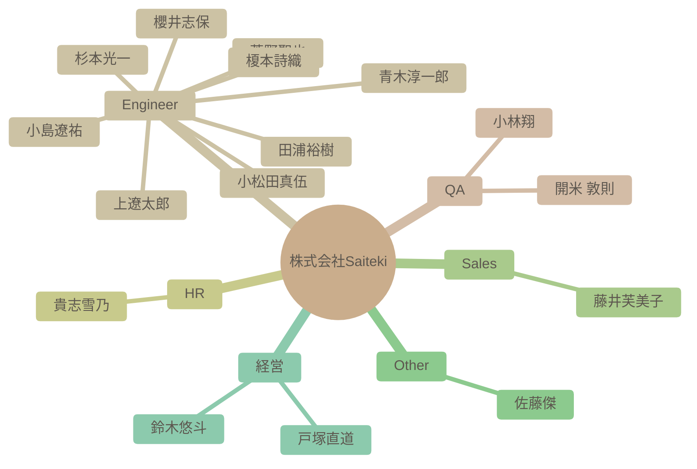

# チーム構成図

自動生成された組織図です。IssueおよびSlack連携による高度なAI分析結果が反映されます。

### 組織マップ

## 社員一覧サマリー

| 名前 | 職種 | 性格傾向 (概略) | 現在の状態 |
| --- | --- | --- | --- |
| [杉本光一](#%E6%9D%89%E6%9C%AC%E5%85%89%E4%B8%80) | Engineer | 開放性、協調性、外向性、真面目さが高く、学習と貢献への意欲が旺盛です。他者への共感性も際立っています。 | AI技術の探求とチームのプロセス改善に非常に意欲的で、多角的に貢献している。家族との時間を大切にしながら、仕事に前向きに取り組む多忙な時期にある。 |
| [青木淳一郎](#%E9%9D%92%E6%9C%A8%E6%B7%B3%E4%B8%80%E9%83%8E) | Engineer | 協調性が高く、新しい知識や経験に対して積極的に挑戦する姿勢を持つ。楽観的で社交的な性格で、周囲とのコミュニケーションを積極的に行い、親睦を深めようとする。 | 年末年始を通じてSaitekiメンバーとの出会いを喜び、高い業務負荷の中でも自己成長への意欲を失わず、来る年への期待に満ちている。自身のスキルアップと組織への貢献を強く意識している。 |
| [小林翔](#%E5%B0%8F%E6%9E%97%E7%BF%94) | QA | 開放性と協調性が特に高く、新しい経験や人との交流を楽しみ、チームワークを重視する傾向がある。責任感も強く、ポジティブな姿勢を保つ。 | 新しい職場への入社を控え、非常に前向きで期待に満ちた状態。積極的に自己開示し、様々な趣味や経験を通じて周囲との共通点を見つけることで、良好な人間関係を築こうと行動している。 |
| [櫻井志保](#%E6%AB%BB%E4%BA%95%E5%BF%97%E4%BF%9D) | Engineer | 自己認識が高く、協調性があり、学習意欲も高い。新しい環境への適応力も期待できる。謙虚で丁寧な印象を与える。 | 入社を控えており、新しい環境に対する高い期待感と意欲に満ち溢れている。自身のスキルを活かしつつ、さらなる専門性向上とチームへの貢献を目指している。 |
| [田浦裕樹](#%E7%94%B0%E6%B5%A6%E8%A3%95%E6%A8%B9) | Engineer | 非常に協調性が高く、誠実で、周囲への配慮を忘れない。新しい知識や経験への探求心が旺盛で、ユーモアを交えながら積極的に他者と関わる。 | Android TVアプリ開発チームで複数のPoC立ち上げフェーズに注力しており、クライアントとの要件定義、タスク分解、計画策定、そして認識合わせに多くの時間を費やしている。AI駆動開発の標準化に向けた活動にも引き続き深く関与し、自身の経験や知見を積極的にチームに共有している。家庭では子供の体調不良などがあったが、柔軟に業務を調整している。 |
| [開米 敦則](#%E9%96%8B%E7%B1%B3%20%E6%95%A6%E5%89%87) | QA | 協調性が高く、学習意欲旺盛で、多岐にわたる趣味を持つ。新しい環境にも積極的に適応し、責任感を持って業務に取り組む。 | 入社直後であり、新しい職場環境への適応に前向きに取り組んでいる。QAにおけるAI活用に非常に意欲的で、具体的なツール選定やプロンプトの最適化を検討中。チームへの貢献意識も高く、周囲とのコミュニケーションを積極的に図っている。 |
| [貴志雪乃](#%E8%B2%B4%E5%BF%97%E9%9B%AA%E4%B9%83) | HR | 協調性が高く、周囲への気配りができるだけでなく、自ら積極的に行動し周囲を巻き込む力を持ったバランスの取れた人物です。新しい情報に対する関心も高く、ポジティブで明るい印象を与えます。 | 積極的に新しい情報を共有し、自身が企画したイベントを継続的に実行するなど、非常に意欲的で貢献意欲も高いポジティブな状態にある。採用担当としても積極的に業務に取り組み、新入社員との良好な関係構築に努めている。 |
| [上遼太郎](#%E4%B8%8A%E9%81%BC%E5%A4%AA%E9%83%8E) | Engineer | 協調性と社交性が高く、新しい技術や知識への探求心が非常に旺盛。真面目で責任感があり、困難にも前向きに取り組む姿勢が見られます。 | 積極的に業務に取り組む意欲が高く、最新の技術動向や開発プロセス改善への関心も継続しています。チームメンバーとの対話を通じた情報共有や課題解決に前向きです。 |
| [小松田真伍](#%E5%B0%8F%E6%9D%BE%E7%94%B0%E7%9C%9F%E4%BC%8D) | Engineer | 新しい技術や知識の習得に極めて積極的で、それを組織に還元しようとする意識が非常に高い。協調性を重んじ、周囲とのコミュニケーションも円滑に行う。自身の経験に基づいた問題意識を持ち、それを解決するための行動を厭わない。 | 入社前の段階から、組織への圧倒的な貢献意欲と実行力を見せている。AI駆動開発の知見を深め、その情報を積極的に共有し、ナレッジDB構築を主導するなど、複数のプロジェクトに深く関与している。既存の業界慣習に対する強い問題意識を表明し、会社と共に変革を志す。 |
| [小島遼祐](#%E5%B0%8F%E5%B3%B6%E9%81%BC%E7%A5%90) | Engineer | 協調性が高く、新しい知識や経験に対する好奇心が旺盛。謙虚で、周囲への感謝を忘れないだけでなく、自ら積極的に行動し、他者との関係を深めようとする。 | 新しい職場環境に非常に積極的に適応し、持ち前の社交性と学習意欲で周囲との良好な関係を築きつつある。既に業務への貢献目標を具体的に持ち、意欲的に取り組んでいる。 |
| [藤井芙美子](#%E8%97%A4%E4%BA%95%E8%8A%99%E7%BE%8E%E5%AD%90) | Sales | 共感力が高く、親しみやすい人柄に加え、探求心と責任感、そして自ら積極的に行動する推進力を持つ。 | 新しい職場環境に非常に前向きに適応しようとしており、持ち前の社交性で同僚とのコミュニケーションを楽しんでいる。プライベートでは子育てに奮闘しつつも、仕事とバランスを取りながら充実した日々を送っている様子が伺える。 |
| [菅野聖也](#%E8%8F%85%E9%87%8E%E8%81%96%E4%B9%9F) | Engineer | 新しい技術や知識の吸収に意欲的で、協調性と社交性を持ち合わせる。自身の強みをユーモアを交えて表現し、感情も安定している。 | 入社を控え、開発者としての復帰に非常に前向きで、チームとの協働を楽しみにしている。AI技術への関心が高く、読書を通じて多角的な知識を吸収し、仕事に活かそうとしている。 |
| [佐藤傑](#%E4%BD%90%E8%97%A4%E5%82%91) | Other | 非常に開放的で誠実、外向的で協調性も高い。常に前向きで、新しい挑戦や学びを楽しむ探求心と行動力を兼ね備えている。 | 海外での活動を継続しつつ、来年には帰国を予定している。最新のAI技術トレンド（特に小型高性能モデル）に高い関心を持ち、具体的な情報共有を通じて実践的な活用を模索している。 |
| [鈴木悠斗](#%E9%88%B4%E6%9C%A8%E6%82%A0%E6%96%97) | 経営 | 社交的で協調性が高く、強い責任感と好奇心を持つ。新しい知識や技術の習得に積極的で、ポジティブかつ安定した精神状態を保ちながら周囲を巻き込む力がある。 | COOとして組織の成長とリスク管理に深くコミットしており、責任感を持って業務に取り組んでいる。最新の技術トレンド、特に生成AIへの関心が高く、積極的に業務への応用を試みている。メンバーとの交流を楽しみ、良好な人間関係を築いている。 |
| [戸塚直道](#%E6%88%B8%E5%A1%9A%E7%9B%B4%E9%81%93) | 経営 | 非常に外向的で協調性が高く、誠実かつ開放的な人物。組織の成長とメンバーの成功に深くコミットし、困難な状況にも冷静かつユーモアを交えて対処する。 | 複数のプロジェクト（資金調達、採用、営業、組織運営、勉強会企画）を同時並行で進め、非常に多忙な状況だが、高いモチベーションを維持している。採用活動も活発で、多くの新メンバーを迎え入れている。AI駆動開発やSIerとしての変革、受託開発強化など、会社の将来を左右する重要な戦略的テーマに深く関心を持ち、積極的に議論をリードしている。 |
| [榎本詩織](#%E6%A6%8E%E6%9C%AC%E8%A9%A9%E7%B9%94) | Engineer | 非常に開放的で協調性があり、新しい知識を積極的に取り入れようとする姿勢が見られる。親しみやすく、ユーモアのセンスも持ち合わせている。 | 入社を間近に控え、期待と意欲に満ち溢れている。積極的にコミュニケーションを取り、周囲との関係構築に努めており、社内での新しい経験と学習を楽しみにしている。 |

---

## 詳細プロフィール

各社員の詳細な分析結果です。クリックして展開できます。

### 杉本光一 (Engineer)

> **総合サマリー**: 杉本さんは、AI技術と組織プロセス改善への深い熱意を持ち、チームの成長と効率化に貢献する協調性溢れるエンジニアです。

<b>🛠 性格傾向</b>

**要約**: 開放性、協調性、外向性、真面目さが高く、学習と貢献への意欲が旺盛です。他者への共感性も際立っています。

| 項目 | スコア | 根拠・エピソード |
| --- | --- | --- |
| 開放性 | 9/10 | Gemini 3やAntigravity、RAG、Cursor、Stagewiseといった最新のAI技術やIDEに強い関心を示し、積極的にその特性を深掘り、チームに共有する。Nextjs16のMCPサーバーやローカルAI推論処理、LLM as a Judgeなど、新しい技術動向を常にキャッチアップし、業務への応用を模索している。 |
| 誠実性 | 9/10 | AI開発ガイドラインの策定、タスク管理システムの構築（Notion DB活用）、プロジェクトWikiや意見箱の設置など、組織的な課題解決と効率化に非常に意欲的で、具体的な仕組み作りを推進する。会議の調整や進捗確認も丁寧に行い、責任感を持って業務に取り組む様子が伺える。 |
| 外向性 | 9/10 | 新しいメンバーに積極的に挨拶し、共通の話題を見つけて会話を広げる。雑談会を提案したり、自身の家族のことや趣味（ゲーム、漫画）を共有するなど、オープンにコミュニケーションを図り、親睦を深めようとする。 |
| 協調性 | 9/10 | 丁寧な言葉遣いを常に心がけ、相手の状況（体調、家庭の事情）を気遣う発言が多い。感謝や労いの言葉を頻繁に使い、相手の意見を尊重し、建設的な議論を促す。自身の提案に対しても率直なフィードバックを求める謙虚さがある。 |
| 神経症的傾向 | 3/10 | 家族の体調不良でミーティングをリスケする際も、前向きな姿勢と丁寧な言葉で状況を伝え、チームへの配慮を忘れない。全体的にポジティブで冷静な対応が目立ち、ストレスに強い傾向が見られる。 |

<b>💪 仕事スタイルと強み</b>

**要約**: AI技術を活用した業務プロセス改善とナレッジ共有に重点を置く。チームの生産性向上に貢献するため、戦略的な思考と具体的な行動を伴う。

**問題解決スタイル**: AI技術に関する課題に対し、深掘りした情報収集（技術記事、ドキュメント）を行い、具体的なツールの選定や活用方法を提案する。AIを単なるツールとしてではなく、効率的な開発プロセスや情報管理の仕組みに組み込む戦略的な視点を持つ。問題解決のためには、具体的なワークフローの検討や、人間とAIの協業領域の明確化まで踏み込む。

**主要な強み**: AI技術への深い理解と応用力, プロセス改善とシステム構築能力, チームの生産性向上への貢献意欲, 丁寧なコミュニケーションと調整力

**証拠エピソード**:
- AI開発のガイドラインを作成し、非エンジニアを含む全社員向けの資料化を進め、AIに対する認識合わせを図ろうとする。
- 書籍購入補助制度のAIによる書籍推薦機能について、RAG技術の裏側まで説明し、データ蓄積の重要性を説く。
- Notionを用いたタスク管理DBの運用を提案し、チームメンバーからの意見を募りながら改善を試みる。
- AIツール（Antigravity, Cursorなど）の具体的な活用メリットや限界について、詳細なフィードバックをチームに共有する。
- 開発プロジェクトにおいて、ドキュメント作成をリリースよりも優先する方針を提案し、長期的な視点での価値創出を重視する。

<b>💎 価値観とモチベーター</b>

**要約**: チームワーク、自己成長、技術革新を深く重視し、特にAI技術を通じた組織全体の効率化と貢献に大きなモチベーションを感じる。

**コアバリュー**: チームワークと協調性, 自己成長と学習, 技術革新と効率化, 組織への貢献, 家族とのバランス

**モチベーショントリガー**: 新しいAI技術の発見と探求, チームメンバーとの交流と協力, 自身が構築したプロセスやシステムが機能すること, 会社の成長と成功への貢献, 家族との充実した時間

**証拠エピソード**:
- SaitekiでのAIへの取り組みに「めちゃくちゃわくわくしている」と述べ、会社の成功と自身による貢献への強い意欲を表明する。
- 書籍購入補助制度を利用して自己成長を促すだけでなく、その制度がAI技術（RAG）によってさらに賢くなる仕組みを解説し、データ共有を促す。
- AIツール選定において、無料期間や移行の柔軟性まで考慮するなど、コスト効率と将来性を見据えた提案を行う。
- 家族の写真を共有したり、子供との時間を大切にしている発言が多く、仕事と家庭生活の調和を重視していることが伺える。
- チームのMTGスケジュールを組む際に、メンバーの稼働状況や家庭の事情（子供のインフルエンザなど）を考慮し、リスケ提案を自ら行う。

<b>📈 現在の状態</b>

**要約**: AI技術の探求とチームのプロセス改善に非常に意欲的で、多角的に貢献している。家族との時間を大切にしながら、仕事に前向きに取り組む多忙な時期にある。

- **感情レベル**: positive
- **業務負荷状況**: 複数のAI関連プロジェクト（ガイドライン策定、ツール検証、タスク管理システム構築）を推進しており、非常に多忙である。家族の体調不良やプライベートな予定によりMTGのリスケを依頼するなど、仕事と家庭のバランスをとりつつ業務を進めている。しかし、その状況を透明に共有し、タスクの進捗管理を徹底することで、全体的に効率的に業務を遂行しようと努めている。
- **最近の関心トピック**: 最新AIモデル（Gemini 3）の性能評価, AI開発ガイドラインの具体的な策定と社内展開, RAG技術と書籍推薦システムへの応用, AI搭載IDE (Antigravity, Cursor, Stagewise) の比較と導入, チームのタスク管理とNotionを活用した情報共有効率化, 家族との時間や趣味（ゲーム、漫画、ボードゲーム）

---

### 青木淳一郎 (Engineer)

> **総合サマリー**: AWS基盤エンジニアとして高い専門性を持ちながら、新しい技術や知識の習得に意欲的。家族を大切にし、社交的で協調性が高く、Saitekiへの貢献を積極的に目指す人物。

<b>🛠 性格傾向</b>

**要約**: 協調性が高く、新しい知識や経験に対して積極的に挑戦する姿勢を持つ。楽観的で社交的な性格で、周囲とのコミュニケーションを積極的に行い、親睦を深めようとする。

| 項目 | スコア | 根拠・エピソード |
| --- | --- | --- |
| 開放性 | 8/10 | AWS以外の技術（Azure、Google Cloud、AI）にも強い関心を持ち、未経験のBIツールにも積極的に挑戦し、スキルの幅を広げようとしている。 |
| 誠実性 | 7/10 | 納品が近い時期にはイベントへの参加を見送るなど、業務に対する責任感が強い。未経験のBIツールに苦戦しながらも、スキルの幅を広げるために意欲的に取り組んでいる。 |
| 外向性 | 8/10 | 入社時に丁寧な自己紹介を行い、共通の趣味を持つメンバーには積極的にパパ会を提案するなど、社交性が高く交流を深めようとする。福岡での交流機会が少ない中でも、オンラインでのコミュニケーションを重視している。 |
| 協調性 | 9/10 | 相手の発言に対して積極的に共感を示し、感謝の言葉を述べる。共通の話題を通じて親睦を深め、チームや地域の一体感を醸成しようとする協調性が非常に高い。 |
| 神経症的傾向 | 3/10 | ネガティブな感情表現は少なく、近所のサル出没に驚きと恐怖を表明する程度。困難な状況（BIツールの苦戦、高い業務負荷）においても、前向きな姿勢を保っている。 |

<b>💪 仕事スタイルと強み</b>

**要約**: AWS基盤のインフラ設計・構築に高い専門性を持ち、未経験領域や新しい技術への学習意欲が非常に高い。チームワークを重視し、責任感と向上心を持って業務に取り組む。

**問題解決スタイル**: 未経験領域のBIツールにも積極的に挑戦し、苦労しながらもスキルの幅を広げる機会と捉え、前向きに解決策を模索する。

**主要な強み**: インフラ設計・構築スキル, 学習意欲, コミュニケーション能力, 責任感

**証拠エピソード**:
- AWS基盤のインフラ設計・構築の経験を自己紹介で明言している。
- Azure、Google Cloud、AI、BIツールなど、新しい技術の学習に非常に意欲的であり、実際に未経験のBIツールに取り組んでいる。
- 納品が近い時期には、興味のあるイベントであっても業務を優先し参加を見送るなど、責任感が強い。
- Slackでの積極的なコミュニケーションを通じて、チームメンバーとの関係構築を図り、パパ会を提案するなど交流を深めようとしている。

<b>💎 価値観とモチベーター</b>

**要約**: 家族との時間を最優先に考え、仕事においては新しい技術の習得と自己成長を追求する。チームや組織への貢献意欲も非常に高く、Saitekiの一員としての責任感と誇りを持っている。

**コアバリュー**: 家族, 成長, 貢献, 責任

**モチベーショントリガー**: 新しい技術の習得, チームへの貢献, 自己成長, 人との交流

**証拠エピソード**:
- 休日の過ごし方として家族とのドライブや子どもとの時間を大切にしていることを自己紹介で明かしている。
- AzureやGoogle Cloud、AIといった未経験領域への挑戦や、BIツールの学習を通じてスキルの幅を広げたいという意欲を繰り返し示している。
- Saitekiの輪を広げていきたいという入社時の発言や、2025年を「最高の年」と振り返り、2026年を「飛躍の年」にしたいと意気込むなど、組織への貢献意欲が強い。
- 共通の趣味を持つメンバーにパパ会を提案したり、西日本勢を盛り上げようとするなど、人との交流や一体感を重視している。

<b>📈 現在の状態</b>

**要約**: 年末年始を通じてSaitekiメンバーとの出会いを喜び、高い業務負荷の中でも自己成長への意欲を失わず、来る年への期待に満ちている。自身のスキルアップと組織への貢献を強く意識している。

- **感情レベル**: positive
- **業務負荷状況**: 納品が近い時期には、イベント参加を見送るほど業務負荷が高い。
- **最近の関心トピック**: Saitekiメンバーの入社経緯, 京都旅行, 2025年の振り返りと2026年への期待

---

### 小林翔 (QA)

> **総合サマリー**: 協調性が高く、新しい環境への適応能力に優れる人物。多岐にわたる趣味と豊富な経験を持ち、周囲との積極的な交流を通じて、共に成長することを重視する。

<b>🛠 性格傾向</b>

**要約**: 開放性と協調性が特に高く、新しい経験や人との交流を楽しみ、チームワークを重視する傾向がある。責任感も強く、ポジティブな姿勢を保つ。

| 項目 | スコア | 根拠・エピソード |
| --- | --- | --- |
| 開放性 | 9/10 | 旅行での名物探索、神社仏閣巡り、アニメの舞台巡り、そしてローグライクゲームへの深い熱中（プレイ時間100時間超えもしばしば）から、新しい経験や知識への強い探求心、好奇心、多様な興味関心がうかがえる。他のゲームタイトルへの関心も示している。 |
| 誠実性 | 7/10 | 前職で13年間のテスターおよび進行管理の経験があることから、責任感、計画性、細部への注意深さを持ち合わせていると考えられる。メダルゲームの大当たり状況を詳細に説明できる点も、観察力や記憶力の高さを伺わせる。 |
| 外向性 | 7/10 | 自己紹介で年齢の近い人が多いことに触れ、親睦を深めたい意欲を明確に示している。また、ゲーム部創設への積極的な参加意欲や、他者の話題に共感し自身の経験を交えて会話を広げる姿勢から、他人との交流を好む傾向が強く見られる。 |
| 協調性 | 9/10 | 丁寧な自己紹介と、他者の趣味や好みに積極的に共感する発言（メダルゲーム、Balatro、北海道グルメ、ニシンの塩焼きへの反応）から、協調性が高く、周囲との調和を大切にする。ゲーム部創設への参加意欲や「一緒に成長できたら嬉しい」という言葉も、集団への貢献意欲と友好的な姿勢を示している。 |
| 神経症的傾向 | 3/10 | 全体的にポジティブで友好的な発言が多く、ネガティブな感情を露わにすることは少ない。「なかなか大変でした(笑)」といった表現も、ユーモアを交えたポジティブな自己開示である。 |

<b>💪 仕事スタイルと強み</b>

**要約**: 長年のテスター経験に裏打ちされた問題発見能力と、高いコミュニケーション能力が強み。新しい情報や知識の吸収にも積極的で、協調性を持ちながら業務に取り組む。

**問題解決スタイル**: 13年間のテスター経験を通じて培われた、細部に目を配り潜在的な問題点を見つけ出す能力を持つ。過去の経験や知識を活用し、論理的に課題を整理する傾向がある。

**主要な強み**: テスト・品質管理経験, コミュニケーション能力, 情報収集力, 状況説明能力

**証拠エピソード**:
- 13年間のテスターおよび進行管理の経験から、プロジェクトの品質向上や効率的な進行に貢献できる。
- 他の社員の話題（ゲーム、グルメ）に積極的に共感し、関連する自身の経験や関心事を話すことで、円滑なコミュニケーションを促進する。
- 小樽のグルメ情報に対して感謝を示し、積極的に情報を取り入れようとする姿勢が見られる。
- メダルゲームでの大当たり体験を詳細かつ具体的に説明する能力は、状況把握力と情報伝達能力の高さを示唆する。

<b>💎 価値観とモチベーター</b>

**要約**: 成長、繋がり、楽しさ、そして経験を重視する。新しい知識やスキルの習得、他人との良好な関係構築、そして充実した楽しい経験がモチベーションの源泉となる。

**コアバリュー**: 成長, 協調, 楽しさ, 探求

**モチベーショントリガー**: 新しい知識やスキルの習得, チームへの貢献と協業, 楽しい経験や趣味の追求, 共通の興味を持つ人々との交流

**証拠エピソード**:
- 自己紹介で「仲良くしながら一緒に成長できたら嬉しい」と述べており、自己成長と他者との協調を重視している。
- ゲーム部創設に対して「ぜひお声掛けください！」と積極的に参加意欲を示しており、チームやコミュニティへの貢献、楽しい活動への参加に意欲的である。
- メダルゲームやローグライクゲームへの深い熱中、旅行での多様な体験への意欲から、楽しい経験や趣味が大きなモチベーションとなっている。

<b>📈 現在の状態</b>

**要約**: 新しい職場への入社を控え、非常に前向きで期待に満ちた状態。積極的に自己開示し、様々な趣味や経験を通じて周囲との共通点を見つけることで、良好な人間関係を築こうと行動している。

- **感情レベル**: positive
- **業務負荷状況**: 入社前であり、業務負荷は低いと考えられる。
- **最近の関心トピック**: ゲーム（メダルゲーム、ローグライク、Balatro, Slay the Spire, CloverPit）, 旅行（特に北海道グルメ、神社仏閣、アニメ舞台）, 海鮮料理, 新しい職場の人間関係

---

### 櫻井志保 (Engineer)

> **総合サマリー**: 櫻井志保さんは、データ分析スキルと高い学習意欲を持ち、協調性をもってチームに貢献しようと意欲的な人物です。

<b>🛠 性格傾向</b>

**要約**: 自己認識が高く、協調性があり、学習意欲も高い。新しい環境への適応力も期待できる。謙虚で丁寧な印象を与える。

| 項目 | スコア | 根拠・エピソード |
| --- | --- | --- |
| 開放性 | 8/10 | Power BIを使ったデータ分析の経験があり、資格取得やデータベース構築といった専門分野への挑戦意欲を示している。 |
| 誠実性 | 7/10 | 自己紹介が非常に丁寧かつ詳細で、自身の業務経験や今後の展望を明確に記述しており、責任感や計画性が伺える。 |
| 外向性 | 6/10 | 「Slack等を通じて積極的にコミュニケーションを取っていければ」と、自ら進んで他者との交流を求める姿勢が見られる。 |
| 協調性 | 9/10 | 「よろしくお願いいたします」「まだまだ至らない点も多いかと思いますが、何卒よろしくお願いいたします」といった謙虚で丁寧な言葉遣いから、協調性や相手への配慮が強く感じられる。 |
| 神経症的傾向 | 3/10 | 自己紹介の内容全体から、新しい環境への期待感と前向きな姿勢が感じられ、不安や心配を示唆する要素は見当たらない。 |

<b>💪 仕事スタイルと強み</b>

**要約**: データに基づいた分析力と高い学習意欲を持ち、自ら専門性を深めようと努力する。チームでのコミュニケーションを重視し、協調的に仕事を進めるタイプ。

**問題解決スタイル**: データ分析スキルを活かし、論理的な思考で問題解決に取り組むアプローチを取る。

**主要な強み**: データ分析, 学習意欲, コミュニケーション

**証拠エピソード**:
- Power BIを用いたデータ分析・加工の経験がある
- 資格取得を目指し、データベース構築などより専門的な分野への挑戦を考えている
- Slackを通じた積極的なコミュニケーションに意欲的である

<b>💎 価値観とモチベーター</b>

**要約**: 自身の成長と専門性向上を重視し、新しい知識やスキルを習得することに喜びを感じる。チームワークを大切にし、周囲との良好な関係を築きながら貢献することにモチベーションを感じる。

**コアバリュー**: 成長, 貢献, 協調性

**モチベーショントリガー**: 新しい知識やスキルの習得, 専門性の向上, チームへの貢献

**証拠エピソード**:
- 資格取得を目指し、データベース構築など専門分野への挑戦意欲を表明している
- Slackを通じて積極的にコミュニケーションを取りたいと述べている

<b>📈 現在の状態</b>

**要約**: 入社を控えており、新しい環境に対する高い期待感と意欲に満ち溢れている。自身のスキルを活かしつつ、さらなる専門性向上とチームへの貢献を目指している。

- **感情レベル**: positive
- **業務負荷状況**: 新規入社のため、現在の業務負荷は不明
- **最近の関心トピック**: データ分析, データベース構築, 資格取得, Slackを通じたコミュニケーション

---

### 田浦裕樹 (Engineer)

> **総合サマリー**: 豊富な経験と卓越した技術力を持ち、AI駆動開発とチームへの貢献に情熱を注ぐエンジニア。論理的思考と温かい人間性を兼ね備え、知識共有と協調性を重んじる。

<b>🛠 性格傾向</b>

**要約**: 非常に協調性が高く、誠実で、周囲への配慮を忘れない。新しい知識や経験への探求心が旺盛で、ユーモアを交えながら積極的に他者と関わる。

| 項目 | スコア | 根拠・エピソード |
| --- | --- | --- |
| 開放性 | 10/10 | AI技術の学習に深くコミットし、関連書籍を読み込み、ChatGPTと壁打ちして実生活に応用するなど、知的好奇心が非常に高い。ゴッホ展に足を運び、多様な音楽を愛し、長年の憧れだったチェロを始めるなど、芸術や文化への関心も深い。 |
| 誠実性 | 9/10 | PoCの立ち上げフェーズでタスク分解、優先順位付け、計画策定を詳細に行い、進捗を具体的なポイントと共に共有する。AI駆動開発の標準化に尽力し、IPAの要件定義ガイドラインなどを積極的に共有するなど、責任感と計画性が非常に高い。 |
| 外向性 | 8/10 | 新メンバーには積極的に自己紹介し、自身のプライベートな情報（出身地、家族、趣味）をオープンに共有することで親近感を醸成する。絵文字を多用し、勉強会では活発に発言や改善提案を行うなど、他者との交流を積極的に楽しむ。 |
| 協調性 | 9/10 | 他者の意見を尊重し、感謝の意を頻繁に伝える。荒天時のメンバーの安否を気遣い、子供が凶を引いた際には励ますなど、周囲への配慮や思いやりが非常に強い。顧客を安心させることを商談の最優先事項と捉え実践する。 |
| 神経症的傾向 | 3/10 | 業務負荷が高い状況や家庭の事情（子供の体調不良）にも冷静かつ柔軟に対応し、業務を調整する。突然のテレワークにもスムーズに対応するなど、精神的な安定性とストレス耐性が高い。 |

<b>💪 仕事スタイルと強み</b>

**要約**: AI技術を活用した開発全般に強みを持ち、特に要件定義から実装までの開発プロセス全体への深い知見と標準化への貢献意欲が高い。アジャイルなプロジェクト推進と顧客視点での問題解決に長ける。

**問題解決スタイル**: PoCにおいては、最初に全てを決め切らず、仮説を立て、クライアントとの密なすり合わせを通じて要件や計画を段階的にアップデートしていくアジャイルなアプローチを重視する。

**主要な強み**: 開発プロセス全体（要件定義〜実装）への深い知見と標準化への貢献, AI駆動開発の実践と知識共有, アジャイルなプロジェクト推進と問題解決, 顧客視点での課題解決と安心感の提供, チーム立ち上げ・品質改善

**証拠エピソード**:
- PoCの進捗状況を詳細に共有し、進め方のポイントを解説することで、チーム全体のレベルアップに貢献しようとしている。
- IPAの要件定義ガイドラインを共有し、要件定義における「翻訳」の重要性を指摘するなど、開発プロセスの基礎的な知識を惜しみなく共有する。
- ChatGPTを用いて飲食店の利益設計を分析するなど、技術を実生活やビジネスに応用する高い洞察力と好奇心を持つ。
- 自身の経験から「お客様を安心させる」ことを商談の最優先事項と考え、具体的なヒアリングで実践している。
- 勉強会への建設的なフィードバックを通じて、より質の高い学習機会を創出しようと働きかける。

<b>💎 価値観とモチベーター</b>

**要約**: Saitekiへの強い信頼とコミットメントを背景に、自身の豊富な経験と知識をチームに惜しみなく共有することで、組織全体の成長と顧客の成功に貢献することに大きな価値を見出している。家族との時間も大切にする。

**コアバリュー**: チームワーク, 継続的な学習と技術革新への挑戦, 顧客満足と貢献, 誠実さ, 知識共有, 家族

**モチベーショントリガー**: チームメンバーからの感謝と成長の実感, 自身の知識共有がチームに貢献できたという実感, 新しい技術（特にAI）の習得と実践, 顧客からの肯定的なフィードバックとプロジェクトの成功, SaitekiのMVVへの共感と貢献

**証拠エピソード**:
- 「この人のために汗をかきたい」という強い想いからSaitekiへの参画を決めるなど、戸塚さんへの信頼と会社への貢献意欲が高い。
- 勉強会のフィードバックに「胸アツ」と反応し、自身の知識や経験がチームに貢献できたことを喜び、さらに共有を続けると表明している。
- 「僕の大事な役割だと自覚しているので、やっていきます！！」と、自身の経験値を社内にシェアすることへの強いコミットメントを示す。
- 子供の行事に参加したり、家族で旅行や外食を楽しんだりするなど、家族との時間を非常に大切にしている。

<b>📈 現在の状態</b>

**要約**: Android TVアプリ開発チームで複数のPoC立ち上げフェーズに注力しており、クライアントとの要件定義、タスク分解、計画策定、そして認識合わせに多くの時間を費やしている。AI駆動開発の標準化に向けた活動にも引き続き深く関与し、自身の経験や知見を積極的にチームに共有している。家庭では子供の体調不良などがあったが、柔軟に業務を調整している。

- **感情レベル**: positive
- **業務負荷状況**: やや高め。複数のPoCを並行して推進し、クライアントとの複雑な要件定義やタスク整理、技術的な深掘り、そしてチームへの情報共有といった多岐にわたる業務をこなしている。家庭の事情もありながら、効率的かつ柔軟に業務に対応している。
- **最近の関心トピック**: PoC (Proof of Concept), 要件定義と開発プロセス標準化, AI駆動開発と技術応用, Android TVアプリ開発, 顧客との商談・クライアントワーク, 音楽（特にチェロ、羊文学）, ゴッホ展

---

### 開米 敦則 (QA)

> **総合サマリー**: 開米敦則氏は、QAエンジニアとしての深い経験とAI技術への探求心を持ち、新しい環境でも積極的に貢献しようとする誠実な人物です。多趣味で、協調性を重んじ、学習意欲も旺盛です。

<b>🛠 性格傾向</b>

**要約**: 協調性が高く、学習意欲旺盛で、多岐にわたる趣味を持つ。新しい環境にも積極的に適応し、責任感を持って業務に取り組む。

| 項目 | スコア | 根拠・エピソード |
| --- | --- | --- |
| 開放性 | 9/10 | 「AIを活用した新しいテストの形にもチャレンジしたい」と意欲を示し、社外セミナーへの積極的な参加や情報収集、社内展開を表明している。Google AI Proなどの新しいAIツールも積極的に試そうとする。ガンプラ、ペット飼育、城巡り、スポーツ観戦と非常に幅広い趣味を持つ。 |
| 誠実性 | 8/10 | 「早くチームの一員としてお役に立てるよう、精一杯努めてまいります」と貢献意欲を示す。作業履歴ページを作成し更新箇所を明示、さらにフィードバックを求めるなど、責任感と改善意欲が高い。会議中の機材トラブルに対し、すぐに状況を説明し、再接続を試み、謝罪するなど、真摯な姿勢が見られる。 |
| 外向性 | 5/10 | 詳細な自己紹介を自ら行い、趣味について語り、共通の話題を見つけて他のメンバーとの交流に意欲的。「お好きな方とぜひご一緒したいです！」「インコについてはお話大歓迎です！」と交流を促す。AIについても「ぜひ意見交換させていただきたいです！」と積極的に働きかける。 |
| 協調性 | 9/10 | 他のメンバーのコメントに対して頻繁に「ありがとうございます！」と感謝を伝える。同僚の体調不良の際には「お大事にしてください！！」と気遣う言葉を述べるなど、他者への配慮と共感性が高い。自身の作業履歴ページへのフィードバックも積極的に求める。 |
| 神経症的傾向 | 4/10 | 会議でのミュート解除トラブル時、「なんで解除できないんですかね。。。」と戸惑いつつも、すぐに「すみません。繋ぎ直しても良いですか」「再起動します」と状況を説明し、解決策を試みる。土曜日のMTG時間調整も、自身の予定を伝えた上で調整に協力的であり、几帳面だが過度に心配性ではない。 |

<b>💪 仕事スタイルと強み</b>

**要約**: QAエンジニアとしての経験を活かし、AI技術を積極的に業務に取り入れ、効率的な問題解決を目指す。情報共有にも熱心で、自律的にタスクを遂行できる。

**問題解決スタイル**: AI技術の特性を深く理解し、各フェーズに最適なツールを検討することで、効率的な問題解決を目指す。Chat GPTやGeminiでの経験からプロンプトのフォーマットの重要性を指摘するなど、仮説検証のアプローチを重視する。

**主要な強み**: QAエンジニアリングの知識, AI技術の知識と適用能力, 問題解決能力, 情報共有とドキュメンテーション能力, テスト自動化ツールの選定と比較検討

**証拠エピソード**:
- 「AIを活用した新しいテストの形にもチャレンジしたい」と意欲を表明している。
- 複数のテスト自動化ツール（Autify, MagicPod, TFACT, Mabl, Cursor, TestScape, Testsigma, BrowserStack Test Management）について、選定基準を具体的に説明し、それぞれの特性を理解している。
- Chat GPTとGeminiを用いたテスト計画の経験から、プロンプトのフォーマットの重要性を指摘し、仮説検証のアプローチを取っている。
- テストフェーズ（上流、実行、管理・分析）ごとに最適なAIツールを具体的に組み合わせる提案をしている。
- 作業履歴ページを作成し、更新箇所を明確にすることで、関係者への情報共有と連携を円滑にしている。

<b>💎 価値観とモチベーター</b>

**要約**: 新しい技術への挑戦、業務効率の改善、チームへの貢献、そして自己のスキルアップに強いモチベーションを感じる。学習と協調性を重視する。

**コアバリュー**: 効率性, 学習・成長, 貢献, 協調性

**モチベーショントリガー**: 新しい技術への挑戦と実践, 業務効率の改善, チームへの貢献と協業, 人との意見交換を通じたスキルアップ

**証拠エピソード**:
- 自己紹介で「AIを活用した新しいテストの形にもチャレンジしていきたい」と語り、新しい技術への挑戦意欲を示す。
- 「社外セミナーにも積極的に参加し、情報収集し、社内にも展開していきたい」と、自己成長とチームへの貢献を両立させる意欲がある。
- 「色々な方と意見交換してさらにスキルアップしていきたいです」と、人との交流を通じた学習意欲を表明している。
- 「早くチームの一員としてお役に立てるよう、精一杯努めてまいります」と、チーム貢献への高い意識を示す。
- 「AIツールの選定は、プロセスのどこで使うのかで得意不得意が出てくると思います」と、効率を重視した技術選定の考え方を述べている。

<b>📈 現在の状態</b>

**要約**: 入社直後であり、新しい職場環境への適応に前向きに取り組んでいる。QAにおけるAI活用に非常に意欲的で、具体的なツール選定やプロンプトの最適化を検討中。チームへの貢献意識も高く、周囲とのコミュニケーションを積極的に図っている。

- **感情レベル**: positive
- **業務負荷状況**: 標準的な業務負荷。自律的にタスクをこなし、情報共有のためのドキュメンテーション作成にも積極的。会議時間外での対応も柔軟に検討する姿勢が見られる。
- **最近の関心トピック**: QAにおけるAIツールの選定と活用, プロンプトエンジニアリングの最適化, テスト自動化ツールの比較と適用フェーズ, 情報共有とドキュメンテーションの改善

---

### 貴志雪乃 (HR)

> **総合サマリー**: 貴志雪乃さんは、協調性があり、丁寧なコミュニケーションを心がける人物です。組織への貢献意欲が高く、自ら率先してコミュニティ形成や情報共有を行う、活動的なリーダーシップを発揮しています。

<b>🛠 性格傾向</b>

**要約**: 協調性が高く、周囲への気配りができるだけでなく、自ら積極的に行動し周囲を巻き込む力を持ったバランスの取れた人物です。新しい情報に対する関心も高く、ポジティブで明るい印象を与えます。

| 項目 | スコア | 根拠・エピソード |
| --- | --- | --- |
| 開放性 | 9/10 | 上場企業の社長との対談動画や生成AIに関するレポートを共有するなど、情報感度が高い。自身が企画・準備に携わった勉強会のレポートを共有し、内容をまとめている。映画鑑賞が趣味で、多様なジャンルに興味を持ち、感想を共有する。カスタムスタンプ機能について知り、面白がるといった新しい情報や機能への好奇心がある。 |
| 誠実性 | 9/10 | 勉強会の企画・準備に積極的に参加し、レポート作成も行うなど、組織のために貢献しようとする姿勢が見られる。オンライン飲み会の企画を主導し、参加者への配慮（Uber Eats提供など）まで細かく計画している。参加登録の催促やレポートの公開など、タスクのフォローアップも確実に行う。 |
| 外向性 | 8/10 | 自己紹介を丁寧に行い、オンライン飲み会やオンライン部活の企画を積極的に行うなど、周囲との交流を重視している。新入社員への挨拶では共通点を見つけて話題を広げようと努める。カスタムスタンプや性格診断の結果について、自らの感想を交えて周囲と活発にやり取りする。 |
| 協調性 | 9/10 | 初対面の人に対して丁寧な挨拶を心がけている。返信が遅れた際には丁寧に謝罪し、温かい言葉への感謝を述べる。勉強会の企画に協力したメンバーへの感謝を具体的に述べるなど、周囲への配慮や感謝の気持ちが非常に強い。相手の投稿に共感し、ポジティブなコメントを返している。 |
| 神経症的傾向 | 3/10 | 全体的にポジティブな発言が多く、ストレスを感じている様子は見られない。落ち着いており、感情の起伏が少ない。映画を観て複雑な気持ちになったことを述べているが、感情を適切に処理し、他者に共有する健全さがある。 |

<b>💪 仕事スタイルと強み</b>

**要約**: 積極的に情報収集・共有し、自らイベントを企画・主導することで周囲を巻き込みながら組織を活性化させるタイプです。丁寧で細やかな仕事ぶりで、周囲からの信頼も厚く、採用担当としても貢献しています。

**問題解決スタイル**: 情報収集と共有を重視し、周囲の意見を参考にしながら解決策を探る。勉強会を開催し、参加者の意見を収集・反映させている。オンライン部活の企画では投票制を導入し、参加者のニーズを汲み取っている。

**主要な強み**: 情報収集・共有力, 企画・実行力, コミュニケーション力, コミュニティ形成力

**証拠エピソード**:
- 勉強会のレポートを作成し、内容をわかりやすくまとめている。
- オンライン飲み会やオンライン部活の企画を立案し、参加を促し、実際に開催している。
- 新着YouTube動画（上場企業社長対談）やAIレポートを共有し、メンバーに新しい情報を提供している。
- 採用担当として、新入社員に積極的に挨拶し、オンボーディングを支援している。

<b>💎 価値観とモチベーター</b>

**要約**: 組織への貢献、新しい知識の習得、周囲との良好な関係構築を重視している。自身の成長と組織の成長を重ねて考えており、メンバーの貢献を認め、感謝の気持ちを伝えることを大切にしている。また、メンバー間の交流を促進し、一体感を醸成することにも高い価値を置いている。

**コアバリュー**: 貢献, 成長, 協調, コミュニティ

**モチベーショントリガー**: 新しい知識や技術の習得, 組織への貢献, 周囲からの感謝, メンバー間の交流促進

**証拠エピソード**:
- 勉強会レポートの作成を通して、組織に貢献しようとしている。
- 新着YouTube動画やAIレポートの共有を通して、メンバーに新しい情報を提供しようとしている。
- オンライン飲み会やオンライン部活の企画を通して、メンバー間の交流を促進しようとしている。
- 採用担当として、新入社員のオンボーディングに貢献している。
- 勉強会の企画・実施に際して、協力してくれたメンバーへの感謝を具体的に伝えている。

<b>📈 現在の状態</b>

**要約**: 積極的に新しい情報を共有し、自身が企画したイベントを継続的に実行するなど、非常に意欲的で貢献意欲も高いポジティブな状態にある。採用担当としても積極的に業務に取り組み、新入社員との良好な関係構築に努めている。

- **感情レベル**: positive
- **業務負荷状況**: 複数の企画・実行（勉強会レポート作成、オンラインイベント開催、情報共有）を同時並行でこなしており、能動的に業務に取り組んでいるため、やや高めの業務負荷を自律的に引き受けている状態。
- **最近の関心トピック**: 生成AI, YouTube動画（ビジネス・経営論）, オンラインイベント企画・運営, 採用活動, 映画鑑賞（ドキュメンタリー含む）, 子育て, ご当地スーパー

---

### 上遼太郎 (Engineer)

> **総合サマリー**: 上遼太郎さんは、多様な職務経験を持つ学習意欲の非常に高い人物。新しい技術、特にAI駆動開発への関心が強く、実践を通して知識を深め、成果物の品質向上や開発プロセスの効率化に貢献しようと試行錯誤する。協調性と社交性を兼ね備え、周囲の意見を尊重し、積極的にコミュニケーションを取りながらチームに貢献する意欲が強いです。

<b>🛠 性格傾向</b>

**要約**: 協調性と社交性が高く、新しい技術や知識への探求心が非常に旺盛。真面目で責任感があり、困難にも前向きに取り組む姿勢が見られます。

| 項目 | スコア | 根拠・エピソード |
| --- | --- | --- |
| 開放性 | 9/10 | AI駆動開発に向けた調査を行い「新しい技術に触れる度ワクワクしています」と明言。StagewiseやGemini CLIといった具体的なAI開発ツールの使用経験を共有し、新しいNotion MCPサーバの使用にも意欲的。フリーレンやAIアート、ビリヤード、海外旅行など多様な話題に関心を示しています。 |
| 誠実性 | 9/10 | AIが理解しやすい設計書作成に非常に力を入れており、Markdown形式での詳細な仕様書やスタイルシートの分離、成果物の粒度など、品質と効率を追求して試行錯誤しています。進捗報告を怠った際には「申し訳ありません」と責任感を示し、技術的な問題にも粘り強く対応しています。 |
| 外向性 | 8/10 | 自己紹介で飲み会やビリヤード好きをアピールし、共通の話題で積極的に交流を呼びかけています。鹿児島出身の社員や新入社員にもフレンドリーに話しかけ、ミーティングでは画面共有での対話を希望するなど、社交的でオープンなコミュニケーションを好む傾向があります。 |
| 協調性 | 9/10 | 多くの発言で「ありがとうございます」「よろしくお願いします」といった丁寧な言葉遣いをしています。他者の貢献やスキル（営業力、要件伝達スキル）を具体的に称賛し、自身の学びとして吸収しようとするなど、協調的で尊敬の念を示す姿勢が顕著です。 |
| 神経症的傾向 | 3/10 | 業務が立て込んでいる際も「申し訳ありません」と謝罪しつつ、解決策や今後の見通しを提示するなど、冷静かつ前向きな対応が見られます。難しい課題に対しても「覚悟とAIを片手に持って呼んでみます」と、ポジティブな姿勢で取り組んでいます。 |

<b>💪 仕事スタイルと強み</b>

**要約**: AI技術を実践的に活用し、設計書の品質向上と開発プロセスの効率化に積極的に取り組む。他者からの学びを自身のスキルアップに繋げ、体系的なアプローチで問題解決を図る。

**問題解決スタイル**: 自ら手を動かして新しい技術（AI開発ツール）を試用し、その結果や課題を詳細に分析・共有する。他者からのフィードバックやノウハウを積極的に吸収し、設計書の構造化やタスク管理の改善を通じて、より効率的で網羅的な問題解決を試みます。

**主要な強み**: 学習意欲, 実践的AI活用, 設計・構造化能力, 協調性, 情報共有

**証拠エピソード**:
- AI駆動開発に向けた調査を自ら行い、StagewiseやGemini CLIの使用感を詳細に報告している。
- AIが理解しやすい設計書を目指し、Markdown形式でHeader ComponentやSearchFormの詳細な仕様を試行錯誤しながら作成している。
- 戸塚さんや鈴木さんの営業力、田浦さんの要件伝達スキルを具体的に称賛し、自身の学びとして吸収しようとしている。
- Notionでの成果物管理方法や、成果物の粒度を細分化する提案を通じて、進捗管理の改善に貢献しようとしている。

<b>💎 価値観とモチベーター</b>

**要約**: 新しい技術への挑戦と実践を通じた自己成長に大きな価値を見出す。チームへの早期貢献を強く志向し、効率的な開発プロセスや高品質な成果物を通じて、チーム全体の生産性向上に貢献することにやりがいを感じる。

**コアバリュー**: 挑戦, 成長, 貢献, 効率性, 協調

**モチベーショントリガー**: 新しい技術の習得と実践, スキルアップと自己成長, チームへの具体的な貢献, 技術的な課題解決, 他者との交流と学び

**証拠エピソード**:
- 「AI駆動開発に向けた調査を行っているのですが、新しい技術に触れる度ワクワクしています」と技術への強い探求心と挑戦意欲を示している。
- 「入社後はどんどん新しいことに挑戦していきたいと思っています」と成長志向が明確。
- 「早く貢献したいという気持ちでいっぱいです」とチームへの強い貢献意欲を表明。
- AIが理解しやすい設計書を作成し、開発プロセスの効率化を図るなど、実践的な改善活動に意欲的に取り組んでいる。
- 戸塚さんの長文作成術や、営業スキル、要件伝達スキルなど、他者の優れた点から積極的に学びを得ようとしている。

<b>📈 現在の状態</b>

**要約**: 積極的に業務に取り組む意欲が高く、最新の技術動向や開発プロセス改善への関心も継続しています。チームメンバーとの対話を通じた情報共有や課題解決に前向きです。

- **感情レベル**: positive
- **業務負荷状況**: 過去に「あまり時間が取れなかった」旨の発言はあったものの、直近のログでは「稼働しています！」「いつでも可能です」と柔軟に対応できることを示しており、業務負荷は適切に管理されているか、調整可能な状態にあると推測されます。多くの詳細な設計書の共有やコメントから、意欲的に業務に取り組んでいる様子が伺えます。
- **最近の関心トピック**: AIを活用した開発・設計（Gemini, Stagewise）, 設計書の品質と効率化, チーム内での情報共有と協力, 自身のスキルアップと学習, ラーメン・つけ麺など食に関する話題

---

### 小松田真伍 (Engineer)

> **総合サマリー**: 小松田真伍は、技術への探求心と学習意欲が非常に高く、積極的に情報共有を行う人物。組織貢献への意欲も強く、周囲との協調を重視する。既存の業界課題にも深い問題意識を持ち、変革を志向する強い実行力と主体性を兼ね備えている。

<b>🛠 性格傾向</b>

**要約**: 新しい技術や知識の習得に極めて積極的で、それを組織に還元しようとする意識が非常に高い。協調性を重んじ、周囲とのコミュニケーションも円滑に行う。自身の経験に基づいた問題意識を持ち、それを解決するための行動を厭わない。

| 項目 | スコア | 根拠・エピソード |
| --- | --- | --- |
| 開放性 | 10/10 | AI駆動開発講習の内容を詳細に共有し、自身の考察や課題意識を明確に示している。NotionやRAGといった新しいツールや概念にも抵抗なく取り組み、その実用化を迅速に進めようとしている。 |
| 誠実性 | 9/10 | AI講習の情報を体系的にまとめ、ナレッジDBの叩き台作成、Q&Aリストの整備を率先して行うなど、責任感と計画性が非常に高い。スケジュール調整においても自身の状況を透明に共有し、丁寧なコミュニケーションを心がけている。 |
| 外向性 | 8/10 | 自己紹介において自身の多様な経験や趣味を積極的に開示し、他のメンバーの自己紹介にも関心を示す。未経験者へのサポートを申し出たり、勉強会の「実況スレ」を提案するなど、他者との交流や場を活性化させようとする姿勢が顕著である。 |
| 協調性 | 9/10 | 相手への感謝の言葉を頻繁に述べたり、他のメンバーの意見を尊重し、建設的な議論を心がける。自身の知識不足を謙遜しつつも、成長意欲を前面に出し、周囲との協調を重視する姿勢が見られる。 |
| 神経症的傾向 | 4/10 | 感情的な起伏は少なく、冷静に意見を述べることが多い。知識が浅いことを謙遜する発言もあるが、それを成長の機会と捉え、積極的に学習しキャッチアップしようと努めるなど、安定した精神状態を示している。 |

<b>💪 仕事スタイルと強み</b>

**要約**: 現状の問題点を深く把握し、既存の枠組みにとらわれずに変革的な改善策を提案・実行する。チームや組織全体をより良くしようとする意識が非常に高く、新しい技術を積極的に試し、効率化と品質向上に繋げようとする。

**問題解決スタイル**: 業界や社会構造への深い洞察に基づき、既存の評価軸や慣習に疑問を呈し、変革的なアプローチを模索する。新たな技術の導入においては、単なる利用に留まらず、その効果と課題を多角的に分析し、実践的な解決策を導き出す。

**主要な強み**: 問題解決, 協調性, 貢献意欲, 学習意欲, 変革志向, 実行力

**証拠エピソード**:
- AI駆動開発講習の情報を詳細に共有し、自身の考察や課題意識を明確に示した上で、ナレッジ化の意欲と実用化への意欲を示した。
- SIerの評価軸に対する問題提起と、会社の理念への強い共感から「世論と戦い、破壊する」という変革への意欲を表明した。
- ナレッジDBの叩き台作成やプロパティ設計にAI壁打ちを取り入れ、迅速な実用化と効果検証を目指す実行力と効率重視の姿勢を示した。
- 勉強会の「実況スレ」を提案し、参加者の理解度向上とアウトプット練習、社内議論の活性化を図ろうとした。

<b>💎 価値観とモチベーター</b>

**要約**: 組織への貢献意欲が非常に強く、自身の成長を通じて組織をより良くしたいと考えている。業界や社会の構造的な問題に対する深い問題意識を持ち、所属する組織を通してその変革に貢献することを強く志向している。個人の成長だけでなく、周囲や社会全体を巻き込み、良い方向へ導くことに大きなモチベーションを感じる。

**コアバリュー**: 貢献, 成長, 変革, 効率化, 公正性, 影響力

**モチベーショントリガー**: 組織の成長, 自己成長, 現状打破, 技術革新, 社会課題解決, 業界変革

**証拠エピソード**:
- 地域活性化への強い関心と事業推進の経験を自己紹介で語り、社会貢献への志向を示した。
- SIerの評価軸に関する議論で、業界の課題を指摘し、会社の理念が「世論と戦い、破壊する」ことだと表現するなど、現状打破と変革への強い意欲を示した。
- AI駆動開発に関する深い探求と情報共有、そしてそれをナレッジベース構築や業務効率化に繋げようとする姿勢は、技術革新と貢献への強いモチベーションの表れである。
- 未経験者へのサポートの申し出や、勉強会実況スレの提案は、自身の経験を活かして組織や仲間の成長に貢献しようとする姿勢を示している。

<b>📈 現在の状態</b>

**要約**: 入社前の段階から、組織への圧倒的な貢献意欲と実行力を見せている。AI駆動開発の知見を深め、その情報を積極的に共有し、ナレッジDB構築を主導するなど、複数のプロジェクトに深く関与している。既存の業界慣習に対する強い問題意識を表明し、会社と共に変革を志す。

- **感情レベル**: positive
- **業務負荷状況**: 入社前の段階で、複数の勉強会やイベントに積極的に参加しており非常に多忙な状況。自身の時間管理を透過的に共有しつつ、効率的な業務遂行を心がけている。
- **最近の関心トピック**: AI駆動開発, ナレッジDB, QA, SIerの評価軸と業界変革

---

### 小島遼祐 (Engineer)

> **総合サマリー**: 協調性が高く、学習意欲旺盛で、周囲との関係構築に非常に積極的。多様な興味を持ち、謙虚に学びながらチームへの貢献を強く志向する人物。

<b>🛠 性格傾向</b>

**要約**: 協調性が高く、新しい知識や経験に対する好奇心が旺盛。謙虚で、周囲への感謝を忘れないだけでなく、自ら積極的に行動し、他者との関係を深めようとする。

| 項目 | スコア | 根拠・エピソード |
| --- | --- | --- |
| 開放性 | 9/10 | 非常に多岐にわたる趣味（将棋、アニメ、ポケモン、音楽）を詳細に語り、他者の趣味にも積極的に興味を示す。また、自己啓発のためにビジネス書の推薦を求めるなど、新しい知識や情報への強い探求心が見られる。 |
| 誠実性 | 8/10 | 学生時代にアルバイトで責任者を務め、各種委員長を歴任した経験がある。社会人経験が浅いながらも「積極的に学び、早く追いつき、尽力する」と繰り返し強い意欲と責任感を表明している。 |
| 外向性 | 9/10 | 非常に詳細な自己紹介で積極的に自身の情報を開示する。初対面の相手に対しても、共通の趣味や出身地を見つけて熱心に対話し、関係性を深めようと努力する。自らギフトの提供を申し出るなど、社交的で親しみやすい。 |
| 協調性 | 9/10 | 丁寧な言葉遣いを常に心がけ、「ありがとうございます」「よろしくお願いします」などの挨拶を頻繁に使用。相手の意見や経験を尊重し、共通の話題を通じて親睦を深めようとする配慮が見られる。ギフトを贈る提案からも他者への好意が伺える。 |
| 神経症的傾向 | 3/10 | 社会人経験の不足を謙虚に認識しつつも、それを不安視するよりも「積極的に学び、尽力する」という前向きな姿勢を強調している。全体的に一貫して明るく意欲的なトーンを保っており、精神的な安定性が高いと評価できる。 |

<b>💪 仕事スタイルと強み</b>

**要約**: 非常に高い学習意欲と自己成長へのコミットメントを持ち、それを組織貢献に繋げようと努力する。協調性を重んじ、周囲との良好な関係構築を通じて円滑なチームワークを促進する。人の意見をまとめる能力も高い。

**問題解決スタイル**: 新しい知識や情報の積極的な収集（ビジネス書の推薦を求めるなど）と、周囲の経験豊富なメンバーからの学びを重視する。学生時代のリーダー経験から、多様な意見をまとめ、調整しながら課題解決に進む傾向がある。

**主要な強み**: コミュニケーション能力, 学習意欲, 協調性, 貢献意欲, 責任感

**証拠エピソード**:
- 入社予定の挨拶で、自身の詳細なプロフィール（出身、経歴、趣味）を積極的に開示し、親近感を持たせようとしている。
- 先輩社員に対し「学べることは全て学び、早く追いつき、その先に進めるように尽力する」と、強い成長意欲と貢献への決意を表明している。
- 特定の共通の趣味（アニメ、ポケモン、ラーメン、出身地）を持つ社員に対し、積極的に話しかけ、具体的な話題で関係を深めようとしている。
- 「いい案件提案できるよう頑張る」と、具体的な業務での貢献意欲を示している。

<b>💎 価値観とモチベーター</b>

**要約**: 人間関係の調和と周囲への貢献を非常に重視し、そのために自身の成長を強く志向する。新しい知識や経験への飽くなき探究心があり、チームの一員として認められ、役に立つことに大きな喜びを感じる。

**コアバリュー**: 協調性, 成長, 貢献, 責任

**モチベーショントリガー**: 周囲からの感謝, 新しい知識の習得, チームへの貢献と成功, 共通の関心事を通じた良好な人間関係

**証拠エピソード**:
- 初対面のメンバーに対し、出身地や共通の趣味（ラーメン、ポケモン、アニメなど）を通じて積極的に親近感を築き、関係性の構築を試みている。
- 「先輩方から学べることは全て学び、早く追いつき、その先に進んでいけるように尽力する」と、自己成長と組織貢献への強い意欲と責任感を表明している。
- 「読書が趣味なんですね。かっこいいです！オススメのビジネス本あったら教えて下さい！」と、具体的な知識習得への意欲を示している。

<b>📈 現在の状態</b>

**要約**: 新しい職場環境に非常に積極的に適応し、持ち前の社交性と学習意欲で周囲との良好な関係を築きつつある。既に業務への貢献目標を具体的に持ち、意欲的に取り組んでいる。

- **感情レベル**: positive
- **業務負荷状況**: 新しい環境への適応と知識習得に重点を置いている段階と推測されるが、既に業務への具体的な貢献意欲を示しており、前向きな姿勢で業務に取り組む準備が整っている。
- **最近の関心トピック**: ビジネス書（特に推薦を求めるもの）, アニメ（葬送のフリーレンなど）, 将棋, ポケモン（ゲーム・カード）, 新しい人間関係

---

### 藤井芙美子 (Sales)

> **総合サマリー**: 新しい環境に積極的に適応し、持ち前の社交性と協調性で迅速に人間関係を構築する人物。学習意欲と貢献意欲が高く、周囲への細やかな気配りも忘れない。

<b>🛠 性格傾向</b>

**要約**: 共感力が高く、親しみやすい人柄に加え、探求心と責任感、そして自ら積極的に行動する推進力を持つ。

| 項目 | スコア | 根拠・エピソード |
| --- | --- | --- |
| 開放性 | 8/10 | ゴールデンカムイの漫画・アニメ・実写版を全て視聴するほど熱中したり、USJのフライングダイナソーを楽しむなど、新しいエンターテイメントや体験に積極的。道の駅やご当地スーパーでの買い物、デパ地下巡りといった、日常の中の新しい発見も楽しむ。過去の流行りについても話題にできる。 |
| 誠実性 | 9/10 | 「お役に立てるよう、早く業務に慣れたい」と責任感と貢献意欲を示す。同僚への書類持参に感謝を伝え、交通機関の遅延情報を周囲に共有して注意を促すなど、周囲への配慮と丁寧な対応が見られる。他者の良い行動を見習い、自己成長に繋げようとする真面目さも伺える。 |
| 外向性 | 8/10 | 入社早々に積極的に自己紹介し、共通の話題を持つ同僚には「デパ地下トークしましょう」「色々お話しましょう」と具体的な交流を提案。コーヒーに誘ったり、イベントへの途中参加を表明したりと、自らコミュニケーションの機会を創出している。 |
| 協調性 | 9/10 | 同僚への感謝の気持ちや、新しい職場での出会いへの喜びを率直に表現し、良好な人間関係を積極的に構築しようとする。子供の年齢が近い同僚には自身の育児経験を共有するなど、共感性も非常に高い。他者の良い点を見つけて称賛し、見習おうとする姿勢からもその特性が伺える。 |
| 神経症的傾向 | 3/10 | 交通機関の遅延について、状況を冷静に伝えつつ注意を促す。子供の反抗期への懸念をユーモアを交えて共有するなど、困難や不安な状況に対しても過度に落ち込むことなく、前向きで現実的な対応が見られる。 |

<b>💪 仕事スタイルと強み</b>

**要約**: 新しい環境への高い適応力と、周囲を観察し良い点を吸収して成長しようとする学習意欲が強み。チームワークを重視し、丁寧で親切な対応で人間関係を円滑に進める。

**問題解決スタイル**: 状況を正確に把握し、周囲と積極的に連携しながら最適な解決策や行動を模索する。他者への情報共有や具体的な提案を通じて、チーム全体の円滑な運営に貢献しようとする。

**主要な強み**: 適応力, 学習意欲, 協調性, 貢献意欲, 人間関係構築力

**証拠エピソード**:
- 過去の多様な職務経験から、新しい環境や役割への高い適応力が伺える。
- 「お役に立てるよう、早く業務に慣れたい」と発言し、組織への貢献意欲と自己成長への強い意欲を示す。
- 同僚のさりげない親切な対応を具体的に挙げ、「素敵でしたよね」「見習って私も頑張ります」と、他者からの学びを自身の成長に繋げようとする。
- 共通の趣味を持つ同僚に積極的に話しかけ、「デパ地下トークしましょう」「色々お話しましょう」と関係構築に努める。

<b>💎 価値観とモチベーター</b>

**要約**: 他者との良好な関係構築と相互の成長、そして組織への貢献を重視する。家族との時間を大切にし、仕事とプライベートの充実を求める。周囲からの感謝や共感が大きなモチベーションとなる。

**コアバリュー**: 協調性, 成長, 貢献, 感謝, 家族

**モチベーショントリガー**: 自己成長の機会, 他者との共感・交流, 組織への貢献実感, 良好な人間関係, 感謝の言葉

**証拠エピソード**:
- 「皆さんの素敵なところを見習って、私ももっと頑張ります」と自己成長への強い意欲と、他者からの学びを重視する姿勢を示す。
- 「お役に立てるよう、早く業務に慣れたい」という発言から、組織への貢献意欲の高さが伺える。
- 「道の駅、ご当地スーパー好きに同意の声が多くて嬉しい」と、共通の話題や共感がモチベーションに繋がる様子。
- 休日の過ごし方として子供中心の生活を挙げ、家族を大切にする価値観が伺える。

<b>📈 現在の状態</b>

**要約**: 新しい職場環境に非常に前向きに適応しようとしており、持ち前の社交性で同僚とのコミュニケーションを楽しんでいる。プライベートでは子育てに奮闘しつつも、仕事とバランスを取りながら充実した日々を送っている様子が伺える。

- **感情レベル**: positive
- **業務負荷状況**: 2月入社で業務に慣れる期間ではあるものの、「早く業務に慣れたい」という意欲が強く、イベントへの参加や同僚との交流を積極的に行う余裕があることから、業務負荷は高くなく、新しい役割への適応に注力している段階と推測される。
- **最近の関心トピック**: ゴールデンカムイ, USJのアトラクション, 道の駅、ご当地スーパー、デパ地下, 子供の成長と育児, 交通機関の状況, 職場での同僚の行動

---

### 菅野聖也 (Engineer)

> **総合サマリー**: 協調性が高く、知的好奇心旺盛で学習意欲のある技術者。AI活用に積極的で、丁寧なコミュニケーションとチームへの貢献を重視する。

<b>🛠 性格傾向</b>

**要約**: 新しい技術や知識の吸収に意欲的で、協調性と社交性を持ち合わせる。自身の強みをユーモアを交えて表現し、感情も安定している。

| 項目 | スコア | 根拠・エピソード |
| --- | --- | --- |
| 開放性 | 9/10 | AI技術を旅行計画、献立、コード生成に活用している。ビジネス書に加え『コーヒーの化学』や『君は戦略を立てることができるか』を読むなど、幅広い分野への知的好奇心と学習意欲が高い。 |
| 誠実性 | 7/10 | 自ら『丁寧の菅野』と称するように、業務への丁寧さや責任感が見られる。過去のシステム開発や品質管理、データ入力といった職務経歴からも着実さがうかがえる。 |
| 外向性 | 7/10 | 『初対面でも話しやすかった』と言われることや、面接後にランチを共にするなど、社交性があり、他者との交流を積極的に楽しむ姿勢がある。 |
| 協調性 | 8/10 | 初対面の挨拶で丁寧な言葉遣いをし、『嬉しい限りです』『よろしくお願いします』など感謝や協調の意を頻繁に表している。相手のメッセージに対しポジティブに応答する姿勢から、友好的な関係構築を重視していることが伺える。 |
| 神経症的傾向 | 4/10 | 『現場を離れていた期間が長い』ことを認識しつつも、『開発者としてのカンを取り戻しつつ、皆様とシステム開発をする日を楽しみにしています』と前向きに捉えている。自己肯定感が高く、感情の安定が見られる。 |

<b>💪 仕事スタイルと強み</b>

**要約**: システム開発、品質管理の経験に加え、AI技術活用に長けている。工夫を凝らしたコーディングを好み、学習した知識を応用する柔軟な問題解決能力を持つ。

**問題解決スタイル**: IT企業でのシステム開発経験から論理的思考力を持ち、AIに質問することで多角的な視点や効率的な解決策を模索する。読書で得た多様な知識を業務に応用しようとする姿勢も見られる。

**主要な強み**: 技術的なスキル（VB.Net, JAVA）, 品質管理の経験と視点, AI活用スキルと探求心, 旺盛な学習意欲と知識応用力

**証拠エピソード**:
- VB.NetやJAVAを用いたシステム開発、機能追加、改修の経験がある
- 倉庫業での品質管理の仕事を担当した経験がある
- AIを旅行計画やコード生成に活用し、その便利さを実感している
- 『工夫してコードを書くの面白いですよね』と発言し、能動的に課題に取り組む姿勢がある
- 『開発者としてのカンを取り戻しつつ』と意欲を示し、自身の成長にコミットしている

<b>💎 価値観とモチベーター</b>

**要約**: 新しい技術の習得と自身の成長を強く志向し、チームの一員として貢献することに価値を見出している。AI技術の可能性を信じ、その活用を通じて業務改善や効率化を目指している。

**コアバリュー**: 技術的成長とスキル向上, チームワークと貢献, 新しい知識の探求と学習, AI技術の積極的活用

**モチベーショントリガー**: 開発者としての能力回復と向上, チームメンバーとの協働によるシステム開発, AIを活用した新しい働き方や効率化の実現, 読書などによる知的好奇心の充足と知識の獲得

**証拠エピソード**:
- 『開発者としてのカンを取り戻しつつ、皆様とシステム開発をする日を楽しみにしています』と発言している
- 『これからもご期待に添えられるよう精進してまいります！』と周囲への貢献意欲を表明している
- 『AIと共にいき、AIと共に死ぬ時代が来たのかもしれません』とAI技術への深い関心と未来への期待を示している
- 『読書は新しい発見や心の安定を得られたり、とてもよい影響を受けてきました』と読書の価値を語っている

<b>📈 現在の状態</b>

**要約**: 入社を控え、開発者としての復帰に非常に前向きで、チームとの協働を楽しみにしている。AI技術への関心が高く、読書を通じて多角的な知識を吸収し、仕事に活かそうとしている。

- **感情レベル**: positive
- **業務負荷状況**: 入社前であり、業務負荷は低いと推測されるが、積極的に情報収集や自己研鑽に励んでいる。
- **最近の関心トピック**: AI技術の活用（旅行、献立、コード生成）, 読書（『コーヒーの化学』、『君は戦略を立てることができるか』）, コードの書き方や工夫, チームメンバーとの交流と協力

---

### 佐藤傑 (Other)

> **総合サマリー**: グローバルな視点と実践的なAI知識を持ち、起業家精神と旺盛な行動力でコミュニティ形成や共創を推進する人物。アウトプットを重視し、常に成長を追求している。

<b>🛠 性格傾向</b>

**要約**: 非常に開放的で誠実、外向的で協調性も高い。常に前向きで、新しい挑戦や学びを楽しむ探求心と行動力を兼ね備えている。

| 項目 | スコア | 根拠・エピソード |
| --- | --- | --- |
| 開放性 | 10/10 | 世界中を旅し、多様な文化や人々との交流を積極的に楽しんでいる。海外のハッカソンにも意欲的に参加し、最新のAI技術トレンドにも深い関心と知識を示している。 |
| 誠実性 | 9/10 | 株式会社Uravationを創業し、生成AI研修やAI顧問など複数の事業を計画的に推進している。アウトプットを非常に重視し、ハッカソンへの積極的な参加や具体的なAI実装の提案を行っている。 |
| 外向性 | 9/10 | 半年間海外に滞在し、現地の人との会話を楽しむ。国際的なチーム開発に参加し、積極的にコミュニケーションを取り、自身の知識を共有し、他者からの質問を歓迎するオープンな姿勢を見せている。 |
| 協調性 | 8/10 | SaitekiメンバーとのAI実装の共創に強い意欲を示し、他のメンバーからの質問を積極的に受け付けるなど、協力的な姿勢が明確である。 |
| 神経症的傾向 | 3/10 | 海外での多忙な活動や複数の事業推進にもかかわらず、発言からはネガティブな感情やストレスは見受けられず、常に前向きで楽しんでいる様子が伺える。 |

<b>💪 仕事スタイルと強み</b>

**要約**: グローバルな視点と実践的なAI知識を強みとし、起業家精神と行動力で事業を推進する。アウトプットを重視し、多様なチームとの共創を通じて成果を最大化する。

**問題解決スタイル**: 最新のAI技術を深く理解し、その実践的な活用方法を提案することで、現場の課題解決に貢献する。共創を重視し、多様なメンバーと協働しながら具体的なアウトプットを生み出すことに注力する。

**主要な強み**: 起業家精神, AI知識, グローバルな視点, アウトプット志向, 実践力

**証拠エピソード**:
- 株式会社Uravationを創業し、生成AI研修やAI顧問、海外AIスタートアップとの連携事業などを推進している。
- ChatGPT研究所の運営や早稲田AI研究会の立ち上げを通じて、AIコミュニティとビジネスの両面で活動してきた。
- 海外のハッカソンに積極的に参加し、アウトプットを増やすことに高いモチベーションを感じている。
- ウクライナ、イタリア、トルコなど多様な国籍のメンバーとの国際的なチーム開発を経験している。

<b>💎 価値観とモチベーター</b>

**要約**: 新しい技術の探求とその実践的な活用を通じて社会に貢献することに価値を見出す。アウトプットと共創を重視し、常に自己成長と具体的な成果を追求する。

**コアバリュー**: 成長, 貢献, 共創, アウトプット, 実践

**モチベーショントリガー**: 新しい技術の習得, 海外での多様な経験, チームとの共創, 具体的なアウトプットの創出

**証拠エピソード**:
- 半年間海外に滞在し、現地の人との会話やローカルフードの探索を通じて多様な文化に触れることを楽しんでいる。
- ハッカソンへの参加を好み、「アウトプットが増えるほどテンションが上がる」と発言するなど、具体的な成果創出が大きなモチベーション源である。
- SaitekiのメンバーとのAI実装の成功事例を共創することに強い意欲を示し、現場で役立つAIの形を共に追求しようとしている。

<b>📈 現在の状態</b>

**要約**: 海外での活動を継続しつつ、来年には帰国を予定している。最新のAI技術トレンド（特に小型高性能モデル）に高い関心を持ち、具体的な情報共有を通じて実践的な活用を模索している。

- **感情レベル**: positive
- **業務負荷状況**: 株式会社Uravationの事業推進や海外での活動、ハッカソン参加など多忙な状況にあると推測されるが、常に高いモチベーションを維持し、積極的に情報共有やコミュニケーションを行っている。
- **最近の関心トピック**: 海外AIスタートアップ, グローバルなチーム開発, 小型高性能モデルの動向と実用性, Mac環境でのAI活用

---

### 鈴木悠斗 (経営)

> **総合サマリー**: 社交的で親しみやすく、周囲との協調性を重視する人物。COOとして組織の成長とリスク管理に強くコミットし、最新技術の活用にも意欲的。チームメンバーの貢献を積極的に評価し、経営視点から全体をより良くしようと行動する。

<b>🛠 性格傾向</b>

**要約**: 社交的で協調性が高く、強い責任感と好奇心を持つ。新しい知識や技術の習得に積極的で、ポジティブかつ安定した精神状態を保ちながら周囲を巻き込む力がある。

| 項目 | スコア | 根拠・エピソード |
| --- | --- | --- |
| 開放性 | 9/10 | 生成AIの進化に感動し、毎日Geminiと会話すると発言。動物占いのアルゴリズムに職業病として関心を示すなど、技術的な探求心と新しいものへの好奇心が非常に高い。アニメや漫画などの趣味も多様。 |
| 誠実性 | 8/10 | ビジネスメール詐欺に関する詳細な注意喚起を行い、組織のリスク管理に努める。リファラル採用を積極的に呼びかけ、組織の成長に貢献しようとする。勉強会の改善点を具体的に提案するなど、責任感が強く、物事をより良くしようとする意欲が高い。 |
| 外向性 | 9/10 | 自己紹介で自身の豊富な経験や趣味を積極的に共有し、親近感を持たせる。多数の新規メンバーを温かく歓迎し、相手の発言内容に触れて共通の話題を見つけるなど、積極的にコミュニケーションを図る。ダジャレを交えるなどユーモアもある。 |
| 協調性 | 9/10 | チームメンバーの貢献や技術を高く評価し、具体的に称賛の言葉を伝える。自身の体調不良時にも他者を気遣う発言が見られる。感謝の気持ちを伝えることを重視し、協調的で友好的な関係を築いている。 |
| 神経症的傾向 | 3/10 | 動物占いの結果に「恥ずかしくなりました」と内省的な一面を覗かせるものの、全体的にはポジティブな発言が多く、自身の体調が優れない時でも周囲を気遣う余裕があるなど、感情の安定性が高い。 |

<b>💪 仕事スタイルと強み</b>

**要約**: 経営者視点から組織全体のリスク管理と成長を推進する。新しい技術を積極的に業務に取り入れ、効率化を図る。チームメンバーの強みを理解し、評価することで、組織全体のパフォーマンス向上に貢献する。

**問題解決スタイル**: 潜在的なリスクに対して早期に注意喚起を行い、具体的な対策を提示する。課題に対しては「良かった点」と「改善点」を具体的に分析し、建設的な解決策を提案する。技術的な視点から本質を理解し、実務への応用を考える。

**主要な強み**: リスク管理と危機意識, 組織の成長推進とリーダーシップ, 最新技術の活用と業務改善, メンバーの能力評価と育成支援

**証拠エピソード**:
- ビジネスメール詐欺に関する詳細な注意喚起と具体的な対策方法を提示し、組織全体のリスク意識向上に貢献した。
- 勉強会に関して、参加者の特性に応じた改善点（プロフィール共有、ディスプレイ増設）や資料内容の調整を提案し、学習効果の向上に努めた。
- 生成AIを営業初心者向けマニュアル作成に活用するなど、積極的に新しい技術を業務に取り入れ、効率化と質の向上を図っている。
- 資金調達成功への労いと共に、COOとして会社の成長への強い決意と責任を表明し、リーダーシップを発揮した。

<b>💎 価値観とモチベーター</b>

**要約**: 自己と会社の成長を強く重視し、組織への貢献とチームワークを大切にする。新しい挑戦と技術革新に喜びを感じ、組織全体の安全とメンバーの幸福を追求することが行動の原動力となっている。

**コアバリュー**: 自己と組織の成長, 貢献と責任, チームワークと協調, 技術革新と活用

**モチベーショントリガー**: 会社の目標達成と拡大, 新しい技術や知識の習得と応用, チームメンバーの成功と評価, 課題解決と組織の改善

**証拠エピソード**:
- 自己紹介で「会社と共に私も成長していきます」「皆さんが幸せになれるよう、全力で事業に取り組みます」と宣言し、自己成長と貢献意欲を示す。
- リファラル採用を呼びかけ、会社のカルチャーを理解したメンバーを増やすことで、組織の健全な成長を促そうとする。
- 資金調達の成功に対して、経営陣への労いと共に、社員、クライアント、投資家からの期待を自らも背負い、会社を大きくしていく決意を述べる。
- 生成AIの進化に感動し、その活用方法を模索することで、新しい価値創造へのモチベーションを示している。

<b>📈 現在の状態</b>

**要約**: COOとして組織の成長とリスク管理に深くコミットしており、責任感を持って業務に取り組んでいる。最新の技術トレンド、特に生成AIへの関心が高く、積極的に業務への応用を試みている。メンバーとの交流を楽しみ、良好な人間関係を築いている。

- **感情レベル**: positive
- **業務負荷状況**: 通常（高い責任感を伴う業務を順調に遂行している様子）
- **最近の関心トピック**: 生成AIの活用と進化, ビジネスメール詐欺への注意喚起とセキュリティ, リファラル採用と組織の拡大, 動物占い（アルゴリズム分析）, メンバーとの親睦を深める話題（日本酒、趣味、家族）

---

### 戸塚直道 (経営)

> **総合サマリー**: 起業家精神、リーダーシップ、業界変革への強い情熱を持つ。高い学習意欲と技術への深い関心で組織を牽引。メンバーの成長と協調を重視し、事業の加速に全身全霊を注ぐ。

<b>🛠 性格傾向</b>

**要約**: 非常に外向的で協調性が高く、誠実かつ開放的な人物。組織の成長とメンバーの成功に深くコミットし、困難な状況にも冷静かつユーモアを交えて対処する。

| 項目 | スコア | 根拠・エピソード |
| --- | --- | --- |
| 開放性 | 9/10 | AI駆動開発、SaaSの動向、SIerの役割といった最新の技術トレンドやビジネスモデルに関する記事を頻繁に共有し、自身の深い考察を述べる。受託開発営業のコミュニティで得た知見を自社のワークショップに活かせないかと積極的に提案するなど、新しい知識や外部の視点を取り入れることに非常に意欲的。 |
| 誠実性 | 9/10 | 資金調達のリリース日を「遠足」と表現し、入念な準備と計画性をもって目標達成に臨む。社内勉強会の企画から運営、終了後の反省点と改善策の共有までPDCAサイクルを回し、組織的な学びの質を高めようとする。自身の自己紹介でも、厳しい営業経験や会社設立への「人生を捧げる覚悟」を語るなど、仕事への強い責任感と実行力を持つ。 |
| 外向性 | 10/10 | 新入社員一人ひとりに対して丁寧な歓迎メッセージを送り、その人物の個性や興味に合わせた話題で積極的にコミュニケーションを取る。スポーツ観戦イベントやゲーム部、オンライン飲み会などを自ら企画提案し、社内交流を促進しようとする姿勢が顕著。自身の趣味（トライアスロン、筋トレ、仕事）や日常のエピソード（帽子が飛んだ話、ラーメンの替え玉エピソード）もオープンに共有する。 |
| 協調性 | 9/10 | 資金調達成功時に、営業担当やエンジニアチーム、入社を決めたメンバーへの感謝を具体的に述べる。新入社員の面接時の発言や個性を覚えており、彼らの成長や活躍を期待する言葉をかける。勉強会の運営改善点を共有し、参加者からの意見を積極的に求めるなど、他者の意見を尊重し、共感を示す。 |
| 神経症的傾向 | 4/10 | 資金調達の交渉中に「気持ちがちぎれそうな思いを数回経験し、6時間しか眠れぬ夜を過ごした」と述べるが、それを乗り越え「最高の仲間に恵まれている」と前向きな姿勢を見せる。業務量が多い中でも、趣味や日常のユーモラスなエピソードを共有し、感情の波をコントロールしている様子が伺える。退職代行サービスの件でも、冷静に分析し、建設的な意見を述べる。 |

<b>💪 仕事スタイルと強み</b>

**要約**: 日本のIT産業の構造変革を志向し、経営者視点で戦略的な意思決定を行う。問題解決能力が高く、社内外の関係者を巻き込みながら目標達成を推進。リーダーシップと実行力に優れ、情報共有を通じて透明性の高い組織運営を実践する。

**問題解決スタイル**: 課題発生時には、関連する専門知識（AI、営業戦略、QAなど）を積極的に収集・分析し、社内外の関係者を巻き込みながら解決策を模索する。リスクや責任を明確に認識し、組織全体の最適解を追求する。外部コミュニティでの学びを自社のワークショップに展開するなど、外部知見の導入にも積極的。

**主要な強み**: リーダーシップ, 戦略的思考, 問題解決能力, 組織牽引力, 実行力

**証拠エピソード**:
- SES業界の非効率性からIT産業構造の変革を志し、自身の会社を設立した経緯を語る。
- 資金調達のプレスリリースを単なる報告に留めず、採用強化のための戦略的なツールとして活用する。
- 勉強会を企画し、その運営で得られた知見や反省点を具体的に共有し、次回の改善に繋げるPDCAサイクルを回す。
- 「Letter of T」を通じて、経営層の意思決定の背景や事業の進捗、営業戦略の詳細などを定期的に全社員に開示し、組織全体の理解と参画を促す。

<b>💎 価値観とモチベーター</b>

**要約**: 日本のIT産業構造の変革と、エンジニアの経済的・待遇的環境の改善に強い使命感を抱いている。組織全体の成長とメンバー一人ひとりの活躍を何よりも重視し、そのために自身の全人生を捧げる覚悟を持つ。新しい知識や技術の習得に貪欲で、常に学びと実践を繰り返すことを自身のモチベーションとしている。

**コアバリュー**: 業界変革, エンジニアの待遇改善, 組織の成長, メンバーの成功, 貢献, 透明性

**モチベーショントリガー**: 明確なビジョンの達成, 社員の成長と活躍, 資金調達による事業加速, 新しい技術やビジネスモデルの探求と実践, 社会への影響力拡大

**証拠エピソード**:
- 「日本のIT産業の構造を変革するようなビジネスがしたい！」「エンジニアの経済環境・待遇を改善するべく、人生を捧げる覚悟で事業に取り組んでいます！」と自己紹介で語る。
- 資金調達の成功を「当社に入社してよかった、と皆さんに思っていただけるように引き続き全身全霊で事業に取り組んでいきます」とメンバーへの感謝と決意に繋げる。
- 定期的に「Letter of T」を共有し、会社の現在地、経営の意思決定、営業戦略などを透明性高く開示することで、メンバー全員を事業の当事者として巻き込み、モチベーションを高めようとする。
- SIerの役割やAI駆動開発に関する深い考察を共有し、「私がこれから先、何年かけても取り組みたいテーマの一つです」と業界変革への揺るぎない情熱を示す。

<b>📈 現在の状態</b>

**要約**: 複数のプロジェクト（資金調達、採用、営業、組織運営、勉強会企画）を同時並行で進め、非常に多忙な状況だが、高いモチベーションを維持している。採用活動も活発で、多くの新メンバーを迎え入れている。AI駆動開発やSIerとしての変革、受託開発強化など、会社の将来を左右する重要な戦略的テーマに深く関心を持ち、積極的に議論をリードしている。

- **感情レベル**: positive
- **業務負荷状況**: 非常に高い。資金調達のクロージング、複数のメンバーの採用、定期的な情報共有「Letter of T」の作成、社内勉強会や部活動の企画・運営、技術トレンドのリサーチと考察、営業活動など、多岐にわたる業務を精力的にこなしている。
- **最近の関心トピック**: AI駆動開発の現実と可能性, SIerの未来と役割, 大規模案件獲得戦略, 自治体案件への参入, 受託開発営業の強化, メンバー採用と組織拡大, 経営層とメンバー間の情報透明性

---

### 榎本詩織 (Engineer)

> **総合サマリー**: 社交的で学習意欲が高く、チームへの貢献意欲が強い。多様な趣味を持ち、ユーモアを交えながら社内コミュニケーションを大切にする人物。

<b>🛠 性格傾向</b>

**要約**: 非常に開放的で協調性があり、新しい知識を積極的に取り入れようとする姿勢が見られる。親しみやすく、ユーモアのセンスも持ち合わせている。

| 項目 | スコア | 根拠・エピソード |
| --- | --- | --- |
| 開放性 | 9/10 | 自身の出身地や多様な職務経験、趣味について率直に語り、新しい日本酒の銘柄にも興味を示し試してみようとする姿勢が見られる。また、積極的に色々なことを学んでいきたいという意欲を明確に表明している。 |
| 誠実性 | 7/10 | 高校で調理師免許を取得し、事務、飲食業、ネットワーク監視・運用保守など多様な職務を経験している。経験が浅い点を認識しつつも、積極的に学び成長していこうとする真面目な姿勢が伺える。 |
| 外向性 | 8/10 | Slackでの活発なコミュニケーションに魅力を感じ、入社前から積極的に自己紹介と他者への返信を行っている。オンライン飲み会への参加意欲も高く、社内での交流を重視していることが明確である。 |
| 協調性 | 9/10 | 丁寧な言葉遣いを心がけ、周囲への配慮や感謝の気持ちを常に示している。自己紹介でも謙虚な姿勢を見せ、相手のコメントに対して共感を示しながら親しみやすく応答している。 |
| 神経症的傾向 | 4/10 | 経験が浅いことを気にかけつつも、それをポジティブな学習意欲に変えている。クレーンゲームに熱中しすぎる傾向を「ゴトン病」とユーモラスに表現しつつ、自重していると語るなど、自己制御と客観視ができる。 |

<b>💪 仕事スタイルと強み</b>

**要約**: 多様な経験を活かし、変化への柔軟な対応力と極めて高い学習意欲で業務に取り組む。コミュニケーション能力も高く、チームワークを重視した協調的な働き方を志向する。

**問題解決スタイル**: 自身の多様な経験を基盤としつつ、未知の分野や課題に対しては積極的に知識を吸収し、周囲との連携を図りながら解決策を見出すアプローチを取る。

**主要な強み**: 学習意欲, コミュニケーション能力, 適応力, 協調性

**証拠エピソード**:
- 様々な職種を経験しており、環境変化への高い適応力と柔軟性を持っていると考えられる。
- 「積極的に色々なことを学んでいきたい」と明言し、未経験分野への学習意欲が非常に高い。
- 入社前からSlackで活発にコミュニケーションを取り、社内でのつながりを大切にしていることから、チームワークを重視する傾向が見られる。
- 新しい日本酒の銘柄に興味を持ち、試してみようとする知的好奇心の高さが伺える。

<b>💎 価値観とモチベーター</b>

**要約**: チームワークと自己成長を強く重視し、新しい知識やスキルを積極的に習得することに意欲的。特に社内のつながりを大切にし、共に働くことを楽しみにしている。

**コアバリュー**: チームワーク, 自己成長, 社内のつながり, 多様な経験

**モチベーショントリガー**: 新しい知識やスキルを習得すること, チームに貢献すること, 社内の人々と交流し、共に働くこと, 自身の成長を実感できること

**証拠エピソード**:
- 「SESだけどちゃんと社内のつながりがあるっていいなと感じました」という発言から、組織内の一体感や連携を非常に重視していることが伺える。
- 「積極的に色々なことを学んでいきたい」という言葉や、多様な職務経験から、自己成長と新しいスキルの習得が大きなモチベーションとなっている。
- オンライン飲み会への参加意欲や、他の社員との積極的なやり取りから、社内の交流を大切にし、共に働くことを楽しみにしている様子がうかがえる。

<b>📈 現在の状態</b>

**要約**: 入社を間近に控え、期待と意欲に満ち溢れている。積極的にコミュニケーションを取り、周囲との関係構築に努めており、社内での新しい経験と学習を楽しみにしている。

- **感情レベル**: positive
- **業務負荷状況**: 不明（入社前）
- **最近の関心トピック**: 社内コミュニケーション, チームワーク, 日本酒, クレーンゲーム

---

