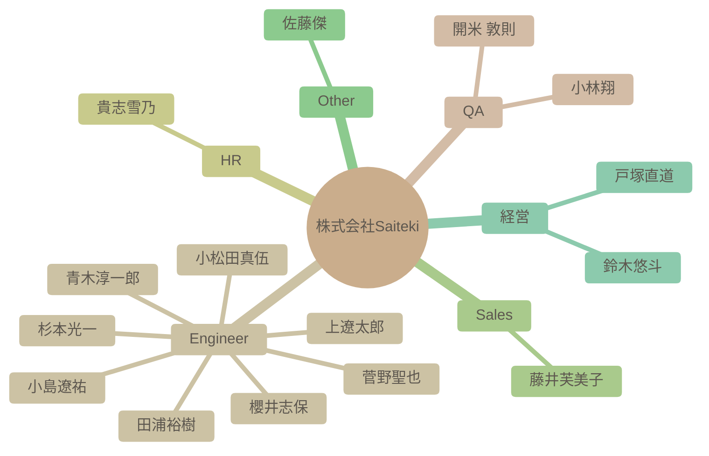

# チーム構成図

自動生成された組織図です。IssueおよびSlack連携による更新が反映されます。

## 詳細リスト

| 名前 | 職種 | 性格傾向 (Personality) | 強み/スタイル (Strengths) | 価値観 (Values) | 最近の状態 (Current) |
| --- | --- | --- | --- | --- | --- |
| 杉本光一 | Engineer | 開放性が高く、協調性があり、誠実な性格。新しい経験やアイデアに対して積極的で、周囲の人々との良好な関係を築くことを重視する。 | 新しい技術を積極的に学び、業務に取り入れようとする姿勢が強い。問題解決においては、情報を収集・分析し、論理的に解決策を検討する。チームでの協調を重視し、ナレッジ共有にも積極的。 | チームへの貢献、自己成長、家族との時間を大切にしている。新しい技術や情報に触れること、自身のスキルアップがモチベーションにつながる。 | 新しいAI技術への関心が高く、それを業務に活かそうとしている。家族との時間を大切にしながらも、仕事にも意欲的に取り組んでいる様子がうかがえる。 |
| 青木淳一郎 | Engineer | 協調性が高く、開放的で、新しいことへの学習意欲が高い。安定性も高く、落ち着いた人物。 | インフラ設計・構築の経験があり、学習意欲が高く、新しい技術にも積極的に挑戦する姿勢を持つ。周囲と協力しながら業務を進めることを重視する。 | 家族との時間を大切にし、技術的なスキル向上と周囲との良好な関係構築を重視する。 | 年末年始を挟み、新年への期待感と仕事への意欲を感じられる。業務多忙な時期でもあり、自己啓発への意欲も高い。 |
| 小林翔 | QA | 全体的に開放的で協調性が高く、新しい環境にも適応しやすい性格。 | テスターとしての経験から、問題解決能力と管理能力に長けている。ゲームに関する知識も豊富。 | 成長、人とのつながり、新しい経験を重視する。趣味や興味を通じて、モチベーションを高める。 | 入社前で、新しい職場環境に期待と興味を持っている。ゲームや趣味の話で積極的にコミュニケーションを取ろうとしている。 |
| 櫻井志保 | Engineer | 全体的に、誠実で協調性があり、新しい知識を積極的に学ぼうとする意欲的な性格が窺えます。 | データ分析スキルを持ち、学習意欲が高く、自ら課題を見つけて改善に取り組むことができる。 | 成長と貢献を重視し、新しい知識やスキルを習得すること、チームに貢献することにモチベーションを感じる。 | 入社を控えており、新しい環境への期待と若干の不安を感じている。 |
| 田浦裕樹 | Engineer | 非常にオープンで協調性が高く、誠実な人物。新しい知識を吸収することに意欲的で、チームメンバーとの良好な関係を築くことを重視する。 | アジャイル開発を得意とし、チーム立ち上げや品質改善に貢献できる。経験豊富で、得た知識や経験を共有することに意欲的。 | 技術に裏打ちされた温かみのある仕事を目指し、チームや会社への貢献を重視する。自身の経験や知識を共有することで、若手の育成にも貢献したいと考えている。 | 新しいPoCプロジェクトに積極的に取り組み、チームに貢献しようとしている。技術的な知識共有だけでなく、ビジネス的な視点も取り入れようと努めている。 |
| 開米 敦則 | QA | 社交的で好奇心旺盛、新しい環境にも積極的に適応しようとする姿勢が見られる。協調性も高く、チームワークを重視する。 | QAエンジニアとしての経験を活かし、チームワークを重視しながら新しい技術を取り入れることを目指す。情報収集能力と問題解決能力が高い。 | チームワーク、自己成長、新しい技術への挑戦を重視する。自身の経験を活かし、組織に貢献することに意欲を持つ。 | 新しい職場への期待と意欲に満ちている。AI技術への関心が高く、積極的に情報収集を行おうとしている。 |
| 貴志雪乃 | HR | 協調性が高く、誠実で、新しいことにも興味を持つ。感情の安定性も高く、周囲への配慮を忘れない。 | 丁寧で正確な仕事ぶりで、人事・採用担当として、勉強会の企画・運営などにも積極的に関わる。チームワークを重視し、貢献意欲も高い。 | 家族との時間を大切にし、仕事を通じて社会に貢献したいと考えている。また、個人の成長やチームの成功にも高い関心を持つ。 | 直近のログから、業務と育児を両立しながら、人事担当として様々な業務に意欲的に取り組んでいる様子が窺える。新しい技術や情報にも関心を持ち、積極的に学ぼうとしている。 |
| 上遼太郎 | Engineer | 全体的に開放的で社交性があり、協調性も高く、安定した精神状態がうかがえる。新しい経験や知識に好奇心旺盛で、周囲とのコミュニケーションを大切にする。 | 学習意欲が高く、新しい技術や知識の習得に意欲的。また、過去の経験から、様々な分野の知識を持っている。周囲と協力しながら仕事を進めることを重視する。 | 成長、貢献、協調性を重視し、新しい知識や技術の習得、チームへの貢献、周囲との良好な関係構築にモチベーションを感じる。 | 入社を控え、新しい環境への期待感と貢献意欲に満ち溢れている。AI技術への関心が高く、学習意欲も旺盛。 |
| 小松田真伍 | Engineer | 協調性が高く、新しい知識の習得に意欲的。また、責任感と向上心を持ち合わせている。 | 新しい技術への適応力が高く、学習意欲が旺盛。問題解決能力も高く、積極的に情報共有を行う。 | 地域活性化への貢献意欲が高く、エンジニアとしてのスキルを社会に還元したいと考えている。また、成長意欲が強く、新しい技術を積極的に学び、自身のスキルアップを目指している。 | 新しい環境に馴染もうと積極的に行動し、業務を通じて貢献したいという意欲が高い。最新技術にも強い関心を持っている。 |
| 小島遼祐 | Engineer | 社交的で外向性が高く、協調性があり、新しい環境への適応力も高い。自己肯定感が高く、楽観的な傾向が見られる。 | 学習意欲が高く、周囲から学ぶ姿勢が強い。チームワークを重視し、貢献意欲が高い。過去の経験からリーダーシップの素質も伺える。 | 成長と貢献を重視し、チームの一員として認められることをモチベーションとしている。人との繋がりを大切にし、感謝の気持ちを忘れない。 | 新しい環境に期待と不安を感じつつも、積極的にコミュニケーションを取り、周囲との関係構築に努めている。学習意欲が高く、貢献意欲も高い。 |
| 藤井芙美子 | Sales | 社交的で好奇心旺盛、共感性が高く、周囲との調和を重視する傾向があります。 | 協調性を重視し、周囲と協力しながら業務を進めることを得意とする。多様な経験を活かし、柔軟に対応できる。 | 家族との時間を大切にし、周囲との良好な人間関係を築くことを重視する。新しい知識や経験を得ることに意欲的。 | 新しい職場環境に積極的に適応しようとしており、周囲とのコミュニケーションを楽しんでいる。業務負荷は不明。 |
| 菅野聖也 | Engineer | 全体的に開放的で協調性が高く、真面目な性格。 | 技術的な知識に加え、品質管理の経験もあり、多角的な視点を持っている。学習意欲が高く、新しい技術の習得にも積極的。 | 自己成長、新しい知識の習得、技術的なスキル向上に価値を置いている。周囲からの期待に応えること、チームへの貢献もモチベーションに繋がっている。 | 新しい職場への期待感と、自己成長への意欲に満ち溢れている。 |
| 佐藤傑 | Other | 開放性が高く、外向的で、知的好奇心が旺盛。新しい経験を積極的に求める傾向がある。 | AIに関する専門知識を持ち、グローバルな視点でのチーム開発を推進できる。学習意欲が高く、アウトプットを重視する。 | AI技術の発展と社会への実装に貢献することに価値を置き、新しい知識の習得や成果のアウトプットに強いモチベーションを感じる。 | 海外を拠点に活動しており、AI技術の進歩に高い関心を持っている。新しいプロジェクトや協力に意欲的。 |
| 鈴木悠斗 | 経営 | 社交的で協調性があり、新しいことへの好奇心も旺盛。一方で、感情が表に出やすい一面も持つ。 | 営業経験が豊富で、新しい技術を積極的に取り入れる。チームワークを重視し、メンバーの成長をサポートする。 | 会社の成長と、メンバーの幸せを重視している。新しい技術を積極的に取り入れ、事業を推進することにモチベーションを感じる。 | 新しい技術（生成AI）の活用に強い関心を持ち、業務効率化や創造的な活動に役立てようとしている。また、チームメンバーとの交流も楽しんでいる。 |
| 戸塚直道 | 経営 | 戸塚直道は、外向性が高く、新しいことへの好奇心旺盛で、誠実で共感性の高い人物である。ストレスを感じやすい一面もあるが、それを乗り越える強さも持ち合わせている。 | 戸塚直道は、目標達成意欲が高く、常に新しい情報を取り入れながら、事業を推進する。課題解決能力が高く、創造的な発想力も持ち合わせている。 | 戸塚直道は、会社の成長と従業員の幸福を最も大切にしている。困難な課題に挑戦し、それを乗り越えることに強いモチベーションを感じる。 | 直近では新規エンジニアの採用成功や事業の進捗に満足しており、引き続き会社の成長と組織作り、そしてメンバーの成長に注力している様子が見受けられる。 |
