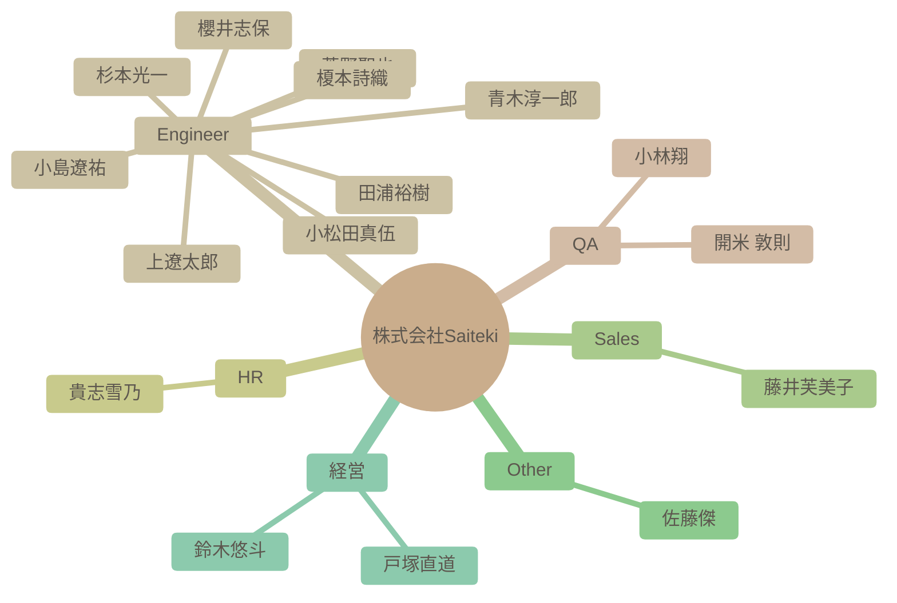

# チーム構成図

自動生成された組織図です。IssueおよびSlack連携による高度なAI分析結果が反映されます。

### 組織マップ

## 社員一覧サマリー

| 名前 | 職種 | 性格傾向 (概略) | 現在の状態 |
| --- | --- | --- | --- |
| [杉本光一](#%E6%9D%89%E6%9C%AC%E5%85%89%E4%B8%80) | Engineer | 開放性が非常に高く、協調性があり、外向的な傾向が強い。責任感も高く、学習意欲も旺盛。神経質傾向は低い。 | AI技術を活用した業務効率化に積極的に取り組んでおり、チームの生産性向上に貢献しようとしている。多忙ながらも、チームメンバーとのコミュニケーションを大切にしている。 |
| [青木淳一郎](#%E9%9D%92%E6%9C%A8%E6%B7%B3%E4%B8%80%E9%83%8E) | Engineer | 協調性が高く、新しい知識や経験に対して積極的な姿勢を持つ。楽観的で社交的な性格。 | 現在は業務負荷が高く、イベントへの参加を見送っているものの、全体的にポジティブな状況である。Saitekiのメンバーとの出会いを喜び、来年への期待を抱いている。 |
| [小林翔](#%E5%B0%8F%E6%9E%97%E7%BF%94) | QA | 開放性が高く、協調性があり、外向性も比較的高い。新しい経験や人々との交流を積極的に求めている。 | 新しい職場に期待を抱いており、周囲との良好な関係を築こうと積極的に行動している。 |
| [櫻井志保](#%E6%AB%BB%E4%BA%95%E5%BF%97%E4%BF%9D) | Engineer | 自己認識が高く、協調性があり、学習意欲も高い。新しい環境への適応力も期待できる。 | 入社を控えており、新しい環境への期待感と意欲に満ち溢れている。チームの一員として貢献したいという気持ちが強い。 |
| [田浦裕樹](#%E7%94%B0%E6%B5%A6%E8%A3%95%E6%A8%B9) | Engineer | 協調性が高く、学習意欲が旺盛で、責任感と誠実さを兼ね備えた人物。 | 現在はAI駆動開発のワークフロー構築やAI翻訳システムの開発に注力しており、業務負荷は高いものの、計画的にタスクを進めている様子。チームメンバーとの連携も良好。 |
| [開米 敦則](#%E9%96%8B%E7%B1%B3%20%E6%95%A6%E5%89%87) | QA | 協調性が高く、学習意欲旺盛で責任感が強い。技術探求心が強く、丁寧なコミュニケーションを心がける。 | 新しい技術の導入に意欲的で、業務に貢献しようとしている。リモートワーク環境にも慣れており、柔軟に対応できる。技術的な問題への対応能力も高い。 |
| [貴志雪乃](#%E8%B2%B4%E5%BF%97%E9%9B%AA%E4%B9%83) | HR | 協調性が高く、新しいことへの好奇心も旺盛です。周囲への気配りもできる、バランスの取れた人物と言えます。 | 新しい情報を積極的に共有し、組織への貢献意欲も高く、全体的にポジティブな状態にある。新しい役割である採用担当にも前向きに取り組んでいる。 |
| [上遼太郎](#%E4%B8%8A%E9%81%BC%E5%A4%AA%E9%83%8E) | Engineer | 協調性が高く、学習意欲旺盛で、責任感があり、几帳面な性格。 | 新しい技術を積極的に習得し、AIを活用した業務効率化に意欲的に取り組んでいる。チームへの貢献意識も高く、積極的に情報共有を行っている。 |
| [小松田真伍](#%E5%B0%8F%E6%9D%BE%E7%94%B0%E7%9C%9F%E4%BC%8D) | Engineer | 学習意欲が旺盛で、新しい知識や技術を積極的に習得しようとする。責任感が強く、与えられたタスクを確実にこなそうとする。協調性があり、周囲と協力して目標達成を目指す。 | 多忙ながらも、新しい業務に意欲的に取り組み、組織に貢献しようとしている。特にナレッジマネジメントに関心が高い。 |
| [小島遼祐](#%E5%B0%8F%E5%B3%B6%E9%81%BC%E7%A5%90) | Engineer | 協調性が高く、新しい知識や経験に対する好奇心が旺盛。社交性も持ち合わせているが、内向的な一面もある。 | 新しい職場環境に積極的に馴染もうとしており、良好な人間関係を築きながら、仕事に貢献しようと意欲的に取り組んでいる。 |
| [藤井芙美子](#%E8%97%A4%E4%BA%95%E8%8A%99%E7%BE%8E%E5%AD%90) | Sales | 社交的で共感性が高く、真面目な性格。 | 困難な状況下でも周囲を気遣い、前向きな姿勢を保っている。 |
| [菅野聖也](#%E8%8F%85%E9%87%8E%E8%81%96%E4%B9%9F) | Engineer | 好奇心旺盛で、協調性があり、新しい技術や知識の吸収に積極的な傾向が見られる。 | 入社を控え、開発者としての勘を取り戻しつつ、チームに貢献できることを楽しみにしている。 |
| [佐藤傑](#%E4%BD%90%E8%97%A4%E5%82%91) | Other | 知的好奇心旺盛で、新しい技術トレンドに敏感。他者への共感性も高く、協力的。 | 新しい技術トレンドに興味を持ち、積極的に情報収集・共有を行っている。 |
| [鈴木悠斗](#%E9%88%B4%E6%9C%A8%E6%82%A0%E6%96%97) | 経営 | 几帳面で責任感が強く、周囲との連携を重視する傾向がある。自己のタスクをきちんとこなし、チームに貢献しようとする意識が高い。 | 期日内にタスクを完了させようと努力しており、チームに貢献しようとする意欲が高い。 |
| [戸塚直道](#%E6%88%B8%E5%A1%9A%E7%9B%B4%E9%81%93) | 経営 | 協調性が高く、外向的な性格。チームメンバーをサポートし、組織全体の目標達成に貢献することに意欲を持つ。 | 引き続き良好な状態を維持している。複数のプロジェクトに関わっており、多忙ではあるものの、高いモチベーションを維持している。チームメンバーのサポートや組織運営にも積極的に関わっている。 |
| [榎本詩織](#%E6%A6%8E%E6%9C%AC%E8%A9%A9%E7%B9%94) | Engineer | 開放的で協調性があり、新しいことに積極的に取り組む姿勢が見られる。安定志向も持ち合わせている。 | 入社を前に期待と意欲に満ち溢れている。 |

---

## 詳細プロフィール

各社員の詳細な分析結果です。クリックして展開できます。

### 杉本光一 (Engineer)

> **総合サマリー**: 杉本さんは、AI技術への深い関心と積極的な学習意欲を持ち、チームでの協調や他者へのサポートを重視する人物。

<b>🛠 性格傾向 (Personality Traits)</b>

**要約**: 開放性が非常に高く、協調性があり、外向的な傾向が強い。責任感も高く、学習意欲も旺盛。神経質傾向は低い。

| 項目 | スコア | 根拠・エピソード |
| --- | --- | --- |
| 開放性 (Openness) | 9/10 | Next.js16やMCPサーバーなどの最新技術に興味を持ち、AI関連の書籍や記事を積極的に共有する。新しいツールや技術を試すことに意欲的。 |
| 誠実性 (Conscientiousness) | 8/10 | タスクの見積もりや進捗確認を丁寧に行い、チームの作業効率向上に貢献しようとする。期日を守ることや、タスクの完了に責任感を持っている。 |
| 外向性 (Extraversion) | 8/10 | チームメンバーへのメンションや質問を積極的に行い、コミュニケーションを円滑に進めようとする。MTGの企画や参加も積極的。 |
| 協調性 (Agreeableness) | 9/10 | 丁寧な言葉遣いを心がけ、「〜いただけるとうれしい」「〜していただけますでしょうか」など、相手への配慮を示す。感謝の言葉を頻繁に伝える。 |
| 神経症的傾向 (Neuroticism) | 3/10 | 発言全体を通して、不安や心配を感じさせる要素はほとんど見当たらない。困難な状況でも前向きな姿勢を保っている。 |

<b>💪 仕事タイルと強み (Work Styles & Strengths)</b>

**要約**: AI技術を活用した業務効率化に意欲的で、チームワークを重視する。問題解決に向けて情報収集と提案を積極的に行う。

**問題解決スタイル**: AI技術に関する深い知識と情報収集力を活かし、具体的な解決策を提案する。既存のInterfaceやUnitTestの流用など、現実的なアプローチを重視。

**主要な強み**: AI技術の知識, コミュニケーション能力, 問題解決能力

**証拠エピソード**:
- AIを活用したコード生成やテスト工程の効率化を提案
- Notionのワークスペース変更をスムーズに行うための手順を丁寧に説明
- チームメンバーのタスク進捗を把握し、必要に応じてサポートやアドバイスを行う

<b>💎 価値観とモチベーター (Values & Motivators)</b>

**要約**: チームワーク、自己成長、技術革新を重視する。他者との交流や新しい発見からモチベーションを得る。

**コアバリュー**: チームワーク, 自己成長, 技術革新

**モチベーショントリガー**: 他者との交流, 新しい発見, 自己成長の機会

**証拠エピソード**:
- チームビルディングに関する課題意識を持ち、書籍や情報収集を通じて解決を図る
- AIに関する知識を積極的に共有し、チーム全体のスキルアップに貢献しようとする
- 新しい技術やツールを試し、その結果をチームに共有することで、業務効率化に貢献する

<b>📈 現在の状態 (Current State)</b>

**要約**: AI技術を活用した業務効率化に積極的に取り組んでおり、チームの生産性向上に貢献しようとしている。多忙ながらも、チームメンバーとのコミュニケーションを大切にしている。

- **感情レベル**: positive
- **業務負荷状況**: 多忙
- **最近の関心トピック**: Next.js16, MCPサーバー, AIを活用した開発手法

---

### 青木淳一郎 (Engineer)

> **総合サマリー**: 佐賀県出身で福岡在住のAWS基盤エンジニア。多趣味で家族を大切にし、学習意欲も高い。周囲との協調性を重視する社交的な人物。

<b>🛠 性格傾向 (Personality Traits)</b>

**要約**: 協調性が高く、新しい知識や経験に対して積極的な姿勢を持つ。楽観的で社交的な性格。

| 項目 | スコア | 根拠・エピソード |
| --- | --- | --- |
| 開放性 (Openness) | 8/10 | 新しい技術（Azure、Google Cloud、AI）への学習意欲が高く、未経験領域にも積極的に挑戦しようとしている。 |
| 誠実性 (Conscientiousness) | 7/10 | 仕事に対して真面目に取り組む姿勢が見られる。納品が近い際にイベント参加を控えるなど、責任感も強い。 |
| 外向性 (Extraversion) | 8/10 | 自己紹介や挨拶を丁寧に行い、積極的にコミュニケーションを取ろうとしている。共通の趣味を持つ人との交流も楽しんでいる。 |
| 協調性 (Agreeableness) | 9/10 | 周囲への感謝の気持ちを頻繁に表現し、協力的な姿勢を示す。他のメンバーの発言にも肯定的な反応が多い。 |
| 神経症的傾向 (Neuroticism) | 3/10 | ネガティブな感情表現は少なく、全体的にポジティブな発言が多い。近所にサルが出没した際の驚きを述べているものの、深刻な不安は感じられない。 |

<b>💪 仕事タイルと強み (Work Styles & Strengths)</b>

**要約**: インフラ設計・構築の経験があり、新しい技術への学習意欲も高い。チームワークを重視し、協力的な姿勢で業務に取り組む。

**問題解決スタイル**: 現状を把握し、必要な情報を収集しながら解決策を模索する。BIツールの使用で苦戦していることを共有し、協力を仰ぐ姿勢も見られる。

**主要な強み**: インフラ設計・構築スキル, 学習意欲, コミュニケーション能力

**証拠エピソード**:
- AWS基盤のインフラ設計・構築の経験を持つ。
- AIやBIツールなど、新しい技術の学習に意欲的である。
- Slackでの積極的なコミュニケーションを通じて、チームメンバーとの関係構築を図っている。

<b>💎 価値観とモチベーター (Values & Motivators)</b>

**要約**: 家族との時間を大切にし、仕事を通じてスキルアップを目指している。チームへの貢献意欲も高く、組織の一員としての意識も強い。

**コアバリュー**: 家族, 成長, 貢献

**モチベーショントリガー**: 新しい技術の習得, チームへの貢献, 自己成長

**証拠エピソード**:
- 休日の過ごし方として家族との時間を大切にしている。
- 未経験領域への挑戦を通じてスキルの幅を広げたいと考えている。
- Saitekiの輪を広げていきたいという発言から、組織への貢献意欲が伺える。

<b>📈 現在の状態 (Current State)</b>

**要約**: 現在は業務負荷が高く、イベントへの参加を見送っているものの、全体的にポジティブな状況である。Saitekiのメンバーとの出会いを喜び、来年への期待を抱いている。

- **感情レベル**: positive
- **業務負荷状況**: 納品が近いこともあり、業務負荷が高い。
- **最近の関心トピック**: Saitekiメンバーの入社経緯, 京都旅行

---

### 小林翔 (QA)

> **総合サマリー**: 小林翔さんは、新しい職場に積極的に溶け込もうとする姿勢があり、趣味や嗜好も多岐にわたるため、周囲との共通点を見つけやすく、協調性を重視する人物である。

<b>🛠 性格傾向 (Personality Traits)</b>

**要約**: 開放性が高く、協調性があり、外向性も比較的高い。新しい経験や人々との交流を積極的に求めている。

| 項目 | スコア | 根拠・エピソード |
| --- | --- | --- |
| 開放性 (Openness) | 8/10 | 新しい職場への期待感や、旅行やゲームなど多様な趣味を持っていることから、新しい経験やアイデアに対して積極的な姿勢がうかがえる。特にローグライクゲームへの深いハマり込みは、探求心の強さを示している。 |
| 誠実性 (Conscientiousness) | 7/10 | 前職で13年間テスターおよび進行管理の経験があることから、責任感があり、計画性を持って業務に取り組むことができると考えられる。入社時の丁寧な自己紹介からも、几帳面な一面が窺える。 |
| 外向性 (Extraversion) | 6/10 | 自己紹介で年齢の近い人が多いことに触れ、仲良くしながら一緒に成長したいと述べていることから、他人との交流を好み、積極的にコミュニケーションを取ろうとする傾向が見られる。 |
| 協調性 (Agreeableness) | 8/10 | 自己紹介の丁寧さや、他の社員の趣味や好みに共感する発言、お互いを尊重する姿勢が見られることから、協調性が高く、周囲との調和を大切にすると考えられる。ゲーム部の創設に意欲を示す点も、集団への貢献意欲を示している。 |
| 神経症的傾向 (Neuroticism) | 3/10 | 全体的にポジティブな発言が多く、ネガティブな感情を表に出すことは少ない。自己紹介も丁寧で、周囲に好印象を与えようとする姿勢が見られる。 |

<b>💪 仕事タイルと強み (Work Styles & Strengths)</b>

**要約**: 協調性があり、コミュニケーション能力が高く、長年のテスター経験から注意深く問題点を見つけることができる。新しい知識を吸収することにも積極的である。

**問題解決スタイル**: 過去の経験から得た知識や情報を活用し、論理的に問題を解決する。テスターとしての経験から、細かい部分にも注意を払い、潜在的なリスクを早期に発見することができる。

**主要な強み**: テスト経験, コミュニケーション能力, 情報収集力

**証拠エピソード**:
- 13年間のテスター経験から、問題点を見つけ出す能力が高いと考えられる。
- 他の社員の趣味や好みに共感する発言が多く、コミュニケーション能力が高いと考えられる。
- 北海道のグルメ情報に興味を示し、積極的に情報収集を行っている。

<b>💎 価値観とモチベーター (Values & Motivators)</b>

**要約**: 成長、繋がり、楽しさ、経験を重視する。新しい知識やスキルを習得すること、他人との良好な関係を築くこと、そして楽しい経験をすることがモチベーションの源泉となる。

**コアバリュー**: 成長, 協調, 楽しさ

**モチベーショントリガー**: 新しい知識の習得, チームへの貢献, 楽しい経験

**証拠エピソード**:
- 自己紹介で「一緒に成長できたら嬉しい」と述べていることから、成長意欲が高いことがわかる。
- ゲーム部の創設に意欲を示すことから、チームへの貢献意欲が高いことがわかる。
- 趣味の話題を楽しそうに語っていることから、楽しい経験がモチベーションにつながることがわかる。

<b>📈 現在の状態 (Current State)</b>

**要約**: 新しい職場に期待を抱いており、周囲との良好な関係を築こうと積極的に行動している。

- **感情レベル**: positive
- **業務負荷状況**: 入社前であり、業務負荷は低いと考えられる。
- **最近の関心トピック**: ゲーム, 北海道グルメ

---

### 櫻井志保 (Engineer)

> **総合サマリー**: 櫻井志保さんは、データ分析経験があり、学習意欲の高い、コミュニケーションを重視する人物です。柔軟性があり、新しい環境への適応力も期待できます。

<b>🛠 性格傾向 (Personality Traits)</b>

**要約**: 自己認識が高く、協調性があり、学習意欲も高い。新しい環境への適応力も期待できる。

| 項目 | スコア | 根拠・エピソード |
| --- | --- | --- |
| 開放性 (Openness) | 8/10 | データ分析など専門分野への挑戦意欲や、資格取得を目指す姿勢から、新しい知識や経験に対して積極的であることが伺えます。 |
| 誠実性 (Conscientiousness) | 7/10 | 自己紹介で業務内容や趣味について丁寧に記述しており、責任感と几帳面さが見られます。データ集計業務の経験からも計画性と正確性が推測できます。 |
| 外向性 (Extraversion) | 6/10 | Slackを通じた積極的なコミュニケーションを希望しており、周囲との連携を重視する姿勢が見られます。自己紹介も丁寧で、相手に良い印象を与えようという意識が感じられます。 |
| 協調性 (Agreeableness) | 9/10 | 自己紹介で丁寧な言葉遣いを心掛けており、協調性を重視する姿勢が伺えます。謙虚な姿勢も見られ、周囲との良好な関係を築こうとする意識が感じられます。 |
| 神経症的傾向 (Neuroticism) | 3/10 | 自己紹介の内容から、不安や心配を感じやすいといった傾向は見られません。むしろ、新しい環境への期待感や前向きな姿勢が感じられます。 |

<b>💪 仕事タイルと強み (Work Styles & Strengths)</b>

**要約**: データ分析スキルを持ち、学習意欲が高く、自ら課題を見つけて改善に取り組むタイプ。コミュニケーション能力も高く、チームワークを重視する。

**問題解決スタイル**: データに基づいた分析と、論理的な思考で問題を解決するアプローチを取る。

**主要な強み**: データ分析, コミュニケーション, 学習意欲

**証拠エピソード**:
- Power BIを用いたデータ分析・加工の経験
- データベース構築などより専門的な分野への挑戦意欲
- Slackを通じた積極的なコミュニケーションへの意欲

<b>💎 価値観とモチベーター (Values & Motivators)</b>

**要約**: 成長と貢献を重視し、新しい知識やスキルを習得することに喜びを感じる。チームワークを重視し、周囲との協調関係を築くことを大切にする。

**コアバリュー**: 成長, 貢献, 協調性

**モチベーショントリガー**: 新しい知識やスキルの習得, 専門性の向上, チームへの貢献

**証拠エピソード**:
- 資格取得を目指す姿勢
- データベース構築など専門分野への挑戦意欲
- Slackを通じた積極的なコミュニケーションへの意欲

<b>📈 現在の状態 (Current State)</b>

**要約**: 入社を控えており、新しい環境への期待感と意欲に満ち溢れている。チームの一員として貢献したいという気持ちが強い。

- **感情レベル**: positive
- **業務負荷状況**: 新規入社のため、業務負荷は不明
- **最近の関心トピック**: データ分析, データベース構築, 資格取得

---

### 田浦裕樹 (Engineer)

> **総合サマリー**: 田浦裕樹は、AI技術に深い関心を持ち、チームと協力して技術を共有し、積極的にプロジェクトを推進するエンジニアである。

<b>🛠 性格傾向 (Personality Traits)</b>

**要約**: 協調性が高く、学習意欲が旺盛で、責任感と誠実さを兼ね備えた人物。

| 項目 | スコア | 根拠・エピソード |
| --- | --- | --- |
| 開放性 (Openness) | 9/10 | AI技術に関する書籍や記事を積極的に共有し、新しい技術の導入に意欲的である。要件定義に関するガイドラインなど、有益な情報をチームに共有する。 |
| 誠実性 (Conscientiousness) | 8/10 | AI駆動開発のワークフロー構築や、AI翻訳システムの開発に計画的に取り組んでいる。タスクの進捗や課題を共有し、期日を守ろうとする意識が見られる。 |
| 外向性 (Extraversion) | 7/10 | チームメンバーとのコミュニケーションを重視し、積極的に意見交換や情報共有を行っている。会議の開催可否や日程調整など、チーム運営にも積極的に関わる。 |
| 協調性 (Agreeableness) | 9/10 | 他者の意見を尊重し、感謝の意を伝えることが多い。チームメンバーの状況を気遣い、体調不良時には休養を勧めるなど、思いやりがある。 |
| 神経症的傾向 (Neuroticism) | 4/10 | 業務負荷が高い状況でも冷静に対応し、計画的にタスクを進めている。突発的な事態（子供の発熱など）にも、柔軟に対応しようとする姿勢が見られる。 |

<b>💪 仕事タイルと強み (Work Styles & Strengths)</b>

**要約**: AI技術を活用した開発に強みを持ち、チームを円滑に動かすための調整能力にも長けている。

**問題解決スタイル**: AI技術の導入による効率化を追求し、具体的な作業ログのテンプレートを作成するなど、実践的なアプローチで問題解決に取り組む。

**主要な強み**: AI技術を活用した開発, チームコミュニケーション, 要件定義・整理

**証拠エピソード**:
- AIを活用した開発のベストプラクティスやアンチパターンを共有し、チーム全体のレベルアップに貢献しようとしている。
- 要件定義の際に必要なインプットやプロンプトをAIに生成させ、その精度に驚きを示している。

<b>💎 価値観とモチベーター (Values & Motivators)</b>

**要約**: チームへの貢献、技術的な成長、顧客の成功を重視する。自身の知識や経験を共有することで、チーム全体のレベルアップに貢献したいと考えている。

**コアバリュー**: チームワーク, 継続的な学習, 顧客満足

**モチベーショントリガー**: チームメンバーからの感謝, プロジェクトの成功, 新しい技術の習得

**証拠エピソード**:
- AI技術に関する情報を共有することで、チーム全体の知識レベル向上に貢献しようとしている。
- 自身の知識や経験を活かしてチームを支援し、プロジェクトの成功に貢献することに喜びを感じている。

<b>📈 現在の状態 (Current State)</b>

**要約**: 現在はAI駆動開発のワークフロー構築やAI翻訳システムの開発に注力しており、業務負荷は高いものの、計画的にタスクを進めている様子。チームメンバーとの連携も良好。

- **感情レベル**: positive
- **業務負荷状況**: やや高め。AI駆動開発のプロジェクトで、計画作成やドキュメント作成に追われている様子。
- **最近の関心トピック**: AI駆動開発, 要件定義, AIエージェント

---

### 開米 敦則 (QA)

> **総合サマリー**: 開米敦則氏は、AI技術に精通し、学習意欲が高く、協調性を重んじるプロフェッショナル。問題解決能力に優れ、チームへの貢献意欲も高い。

<b>🛠 性格傾向 (Personality Traits)</b>

**要約**: 協調性が高く、学習意欲旺盛で責任感が強い。技術探求心が強く、丁寧なコミュニケーションを心がける。

| 項目 | スコア | 根拠・エピソード |
| --- | --- | --- |
| 開放性 (Openness) | 9/10 | 新しいAIツールや技術（Google AI Proなど）への興味を示し、積極的に試そうとする姿勢が見られる。噂や評判を参考にツールを選定するなど、情報収集にも熱心。 |
| 誠実性 (Conscientiousness) | 8/10 | 作業履歴ページを作成し、アップデート箇所を明示するなど、情報共有に対する責任感の強さがうかがえる。会議に遅れないよう時間を確認したり、ミュート解除のトラブルに丁寧に謝罪したりする。 |
| 外向性 (Extraversion) | 4/10 | MTG時間について、自身の都合を伝えつつも相手の都合を尊重しようとする姿勢が見られる。積極的にコミュニケーションを取るというよりは、必要に応じて丁寧に情報を共有するタイプ。 |
| 協調性 (Agreeableness) | 8/10 | 相手の意見や提案に対して肯定的な反応を示し、感謝の言葉を述べるなど、協調性を重視する姿勢が見られる。アップデート履歴に対するフィードバックを求め、改善意欲も示す。 |
| 神経症的傾向 (Neuroticism) | 3/10 | 会議でのミュート解除のトラブルや、土曜日のMTG時間に対する懸念など、几帳面で責任感が強いことが伺える。ただし、過度な心配性というわけではない。 |

<b>💪 仕事タイルと強み (Work Styles & Strengths)</b>

**要約**: AI技術に関する深い知識と、それを業務に適用する能力に長けている。問題解決能力が高く、自律的に行動できる。情報収集力と分析力も高い。

**問題解決スタイル**: AI技術の特性を理解し、各フェーズに最適なツールを検討することで、効率的な問題解決を目指す。仮説を立て、検証するアプローチを重視する。

**主要な強み**: AI技術の知識, 問題解決能力, 情報収集力

**証拠エピソード**:
- 複数のテスト自動化ツールを比較検討し、各ツールの得意分野に基づいて最適な組み合わせを提案している。
- Chat GPTとGeminiを用いてテスト計画を行い、プロンプトのフォーマットの重要性を指摘している。
- 作業履歴ページを作成し、関係者への情報共有を円滑にしている。

<b>💎 価値観とモチベーター (Values & Motivators)</b>

**要約**: 効率性、学習意欲、貢献意欲を重視している。新しい技術を積極的に学び、業務に役立てることにモチベーションを感じる。チームや組織への貢献を重視する。

**コアバリュー**: 効率性, 学習, 貢献

**モチベーショントリガー**: 新しい技術への挑戦, 業務効率の改善, チームへの貢献

**証拠エピソード**:
- AIツールに関する知識を共有し、業務への適用を提案している。
- アップデート履歴ページを作成し、チームへの情報共有を促進している。
- 会議の遅延や接続トラブルに対して、丁寧に謝罪している。

<b>📈 現在の状態 (Current State)</b>

**要約**: 新しい技術の導入に意欲的で、業務に貢献しようとしている。リモートワーク環境にも慣れており、柔軟に対応できる。技術的な問題への対応能力も高い。

- **感情レベル**: positive
- **業務負荷状況**: 標準的な業務負荷。自律的にタスクをこなせる。
- **最近の関心トピック**: AIを活用したテスト自動化, プロンプトエンジニアリング, 新しいテストツール

---

### 貴志雪乃 (HR)

> **総合サマリー**: 貴志雪乃さんは、人当たりの良いコミュニケーションを心がけ、組織への貢献意欲が高い人物です。新しい情報への関心も高く、学習意欲も旺盛です。

<b>🛠 性格傾向 (Personality Traits)</b>

**要約**: 協調性が高く、新しいことへの好奇心も旺盛です。周囲への気配りもできる、バランスの取れた人物と言えます。

| 項目 | スコア | 根拠・エピソード |
| --- | --- | --- |
| 開放性 (Openness) | 8/10 | 新着YouTube動画や生成AIに関するレポートを共有するなど、新しい情報に対する関心が高い。勉強会のレポートを作成し、積極的に共有している。 |
| 誠実性 (Conscientiousness) | 7/10 | 勉強会のレポート作成やオンライン飲み会の企画など、組織のために貢献しようとする姿勢が見られる。レポート作成などタスクをきちんとこなしている。 |
| 外向性 (Extraversion) | 6/10 | 自己紹介を丁寧に行い、オンライン飲み会の企画を積極的に行うなど、周囲との交流を重視している。他の人の発言に積極的に反応している。 |
| 協調性 (Agreeableness) | 9/10 | 初対面の人に対して丁寧な挨拶を心がけている。勉強会の企画に協力したメンバーへの感謝を述べるなど、周囲への気配りができる。 |
| 神経症的傾向 (Neuroticism) | 3/10 | 全体的にポジティブな発言が多く、ストレスを感じている様子は見られない。落ち着いており、感情の起伏が少ない。 |

<b>💪 仕事タイルと強み (Work Styles & Strengths)</b>

**要約**: 積極的に情報収集・共有し、周りを巻き込みながら業務を推進するタイプです。丁寧な仕事ぶりで、周囲からの信頼も厚いでしょう。

**問題解決スタイル**: 情報収集と共有を重視し、周囲の意見を参考にしながら解決策を探る。

**主要な強み**: 情報収集力, 企画力, コミュニケーション力

**証拠エピソード**:
- 勉強会のレポートを作成し、内容をわかりやすくまとめている。
- オンライン飲み会の企画を立案し、参加を促している。
- 生成AIレポートを共有し、開発関連の情報を共有している。

<b>💎 価値観とモチベーター (Values & Motivators)</b>

**要約**: 組織への貢献、新しい知識の習得、周囲との良好な関係構築を重視している。自身の成長と組織の成長を重ねて考えている。

**コアバリュー**: 貢献, 成長, 協調

**モチベーショントリガー**: 新しい知識や技術の習得, 組織への貢献, 周囲からの感謝

**証拠エピソード**:
- 勉強会レポートの作成を通して、組織に貢献しようとしている。
- 新着YouTube動画の共有を通して、メンバーに新しい情報を提供しようとしている。
- オンライン飲み会の企画を通して、メンバー間の交流を促進しようとしている。

<b>📈 現在の状態 (Current State)</b>

**要約**: 新しい情報を積極的に共有し、組織への貢献意欲も高く、全体的にポジティブな状態にある。新しい役割である採用担当にも前向きに取り組んでいる。

- **感情レベル**: positive
- **業務負荷状況**: 平均的な業務負荷
- **最近の関心トピック**: 生成AI, YouTube動画, オンラインイベント

---

### 上遼太郎 (Engineer)

> **総合サマリー**: 上遼太郎さんは、学習意欲が高く、協力的で、周囲との連携を重視する人物。AI技術の活用に意欲的で、設計や開発プロセスの改善に貢献しようとする姿勢が見られる。

<b>🛠 性格傾向 (Personality Traits)</b>

**要約**: 協調性が高く、学習意欲旺盛で、責任感があり、几帳面な性格。

| 項目 | スコア | 根拠・エピソード |
| --- | --- | --- |
| 開放性 (Openness) | 9/10 | AIツール（Stagewise, GeminiCLI, Cursor）を積極的に試し、設計書の構成や作成方法を改善しようと試みている。新しい技術や情報に対する学習意欲が非常に高い。 |
| 誠実性 (Conscientiousness) | 8/10 | 定例会用の備忘録をまとめたり、議事録を確認したり、進捗報告を徹底したりと、責任感の高さが伺える。また、NotionのMCPサーバー利用を問い合わせたり、Notionの編集権限問題を解決しようとしたり、問題解決能力も高い。 |
| 外向性 (Extraversion) | 5/10 | 積極的に発言するタイプではないが、周囲の意見を尊重し、質問や相談を通じて連携を深めようとする。 |
| 協調性 (Agreeableness) | 9/10 | 共有された情報への感謝を伝えたり、ミーティングの日程調整に柔軟に対応したり、周囲への配慮を忘れない。また、他者の知識やスキルを尊重し、積極的に学ぼうとする姿勢が見られる。 |
| 神経症的傾向 (Neuroticism) | 3/10 | 困難に直面しても冷静に対処しようとし、ネガティブな感情を表に出すことは少ない。全体的にポジティブで安定した印象を与える。 |

<b>💪 仕事タイルと強み (Work Styles & Strengths)</b>

**要約**: AIツールを積極的に活用し、設計・開発プロセスを改善しようとする。ドキュメント作成能力が高く、問題解決能力にも優れる。

**問題解決スタイル**: 問題を分析し、解決策を試行錯誤しながら見つけ出すアプローチ。周囲に質問や相談をしながら、協力して問題を解決しようとする。

**主要な強み**: AIツール活用, ドキュメント作成, 問題解決

**証拠エピソード**:
- Stagewise、GeminiCLI、CursorなどのAIツールを積極的に試し、業務効率化を図っている。
- 設計書の構成を検討し、AIが理解しやすい形式を模索している。
- Notionのアクセス権問題や、Stagewiseの無料枠超過などの問題に直面しても、原因を特定し、解決策を講じている。

<b>💎 価値観とモチベーター (Values & Motivators)</b>

**要約**: 効率性、学習、成長を重視する傾向がある。チームへの貢献意欲が高く、技術的な課題解決にやりがいを感じる。

**コアバリュー**: 効率性, 学習, 貢献

**モチベーショントリガー**: 新しい技術の習得, 業務効率化, チームへの貢献

**証拠エピソード**:
- AIツールを活用して、設計・開発プロセスを効率化しようとしている。
- 設計書の作成方法を改善し、AIがより理解しやすい形式を追求している。
- Notionのアクセス権問題や、Stagewiseの無料枠超過などの問題を解決することで、チームの生産性向上に貢献しようとしている。

<b>📈 現在の状態 (Current State)</b>

**要約**: 新しい技術を積極的に習得し、AIを活用した業務効率化に意欲的に取り組んでいる。チームへの貢献意識も高く、積極的に情報共有を行っている。

- **感情レベル**: positive
- **業務負荷状況**: 発言内容から判断すると、業務負荷は平均的。新しい技術の学習や問題解決に時間を割いているため、多忙ではあるが、意欲的に業務に取り組んでいる様子が伺える。
- **最近の関心トピック**: AIツール, 設計・開発プロセス改善, Notion

---

### 小松田真伍 (Engineer)

> **総合サマリー**: 小松田真伍は、知識習得と実践意欲が高く、自律的に考え、周囲と協力して成果を出すことを重視する人物。多忙ながらも貢献意欲が高い。

<b>🛠 性格傾向 (Personality Traits)</b>

**要約**: 学習意欲が旺盛で、新しい知識や技術を積極的に習得しようとする。責任感が強く、与えられたタスクを確実にこなそうとする。協調性があり、周囲と協力して目標達成を目指す。

| 項目 | スコア | 根拠・エピソード |
| --- | --- | --- |
| 開放性 (Openness) | 9/10 | ナレッジワークフローやAIを活用したDB設計など、新しい技術や手法に積極的に挑戦する姿勢が見られる。既存のデータベースページを新規作成するなど、より良い方法を模索する柔軟性も持ち合わせている。 |
| 誠実性 (Conscientiousness) | 8/10 | 週ごとの報告を欠かさず行い、質問事項の管理表を作成するなど、几帳面で責任感が強い。タスクの優先順位を明確にし、効率的に業務を進めようとする。 |
| 外向性 (Extraversion) | 6/10 | 積極的に情報共有を行い、質問や提案をすることで、周囲とのコミュニケーションを図ろうとする。イベント後など、多忙な中でも対応可能な時間を提示するなど、協力的な姿勢が見られる。 |
| 協調性 (Agreeableness) | 8/10 | 連絡に対する感謝を述べたり、イベントで多忙な状況を詫びるなど、丁寧で協調性を重視する姿勢が見られる。相手の立場を理解し、配慮のあるコミュニケーションを心がけている。 |
| 神経症的傾向 (Neuroticism) | 4/10 | 発言全体を通して感情の起伏は穏やかで、冷静に物事を判断しようとする傾向が見られる。多忙な状況でも、落ち着いて対応策を提示するなど、精神的な安定性がある。 |

<b>💪 仕事タイルと強み (Work Styles & Strengths)</b>

**要約**: 自律的に考え、行動し、チームと協力して成果を出すことを得意とする。新しい知識や技術の習得に意欲的で、それを業務に活かそうとする。

**問題解決スタイル**: 現状を分析し、具体的な改善策を提案する。AIなどの新しい技術を活用し、より効率的な解決策を模索する。

**主要な強み**: 知識習得, 問題解決, 協調性

**証拠エピソード**:
- ナレッジワークフローの叩き台作成や、質問事項の管理表作成は、現状の問題点を分析し、具体的な解決策を提案している。
- AIを活用したナレッジDBのプロパティ設計は、新しい技術を積極的に取り入れ、業務効率化に貢献しようとしている。
- イベントで多忙な中でも、対応可能な時間を提示することは、チームへの貢献意欲の表れである。

<b>💎 価値観とモチベーター (Values & Motivators)</b>

**要約**: 組織への貢献意欲が高く、自身の成長を通じて組織をより良くしたいと考えている。新しい知識や技術を習得し、業務に活かすことに喜びを感じる。

**コアバリュー**: 貢献, 成長, 効率化

**モチベーショントリガー**: 組織の成長, 自己成長, 新しい技術の活用

**証拠エピソード**:
- ナレッジワークフローの構築や質問事項の管理は、組織全体の知識共有と効率化に貢献しようとする姿勢を示している。
- notionやRAGといった新しい技術を習得し、業務に活かそうとする姿勢は、自己成長への意欲の表れである。
- イベントで多忙な状況でも、できる限り協力しようとする姿勢は、チームへの貢献意欲の表れである。

<b>📈 現在の状態 (Current State)</b>

**要約**: 多忙ながらも、新しい業務に意欲的に取り組み、組織に貢献しようとしている。特にナレッジマネジメントに関心が高い。

- **感情レベル**: positive
- **業務負荷状況**: 多忙
- **最近の関心トピック**: ナレッジマネジメント, RAG（Retrieval Augmented Generation）, Notionの活用

---

### 小島遼祐 (Engineer)

> **総合サマリー**: 小島遼祐は、協調性があり、親しみやすく、学習意欲の高い人物。周囲との良好な関係構築を重視し、自身の成長にも意欲的である。

<b>🛠 性格傾向 (Personality Traits)</b>

**要約**: 協調性が高く、新しい知識や経験に対する好奇心が旺盛。社交性も持ち合わせているが、内向的な一面もある。

| 項目 | スコア | 根拠・エピソード |
| --- | --- | --- |
| 開放性 (Openness) | 8/10 | 読書を趣味としており、新しいビジネス本を積極的に学ぼうとする姿勢が見られる。アニメなどの話題にも興味を示すことから、幅広い分野への関心があると考えられる。 |
| 誠実性 (Conscientiousness) | 6/10 | 菅野さんのために良い案件を提案できるよう頑張ると述べており、責任感を持って仕事に取り組もうとしている様子が伺える。 |
| 外向性 (Extraversion) | 7/10 | 初対面の相手に対しても積極的にコミュニケーションを取り、親近感を持ってもらおうとする姿勢が見られる。昼食を共にしたことや、アニメの話題を持ち出すことで、相手との距離を縮めようとしている。 |
| 協調性 (Agreeableness) | 9/10 | 自己紹介とともに「よろしくお願いします！」と丁寧な言葉遣いを心がけており、相手への配慮が感じられる。相手の趣味に関心を示し、共感することで良好な関係を築こうとしている。 |
| 神経症的傾向 (Neuroticism) | 3/10 | Slackの発言からは、不安や心配といったネガティブな感情を示す要素は特に見られない。安定した精神状態を保っていると考えられる。 |

<b>💪 仕事タイルと強み (Work Styles & Strengths)</b>

**要約**: 協調性を活かしてチームワークを重視し、学習意欲に基づいて自己成長を図ることで、組織に貢献しようとする。

**問題解決スタイル**: 情報収集と周囲との連携を重視し、多角的な視点から課題解決に取り組む。

**主要な強み**: コミュニケーション能力, 学習意欲, 協調性

**証拠エピソード**:
- 昼食を共にした相手に改めて自己紹介を行い、相手の趣味に関心を示すことで、良好な人間関係を構築しようとしている。
- 菅野さんのために良い案件を提案できるよう努力することを表明し、仕事に対する責任感を示している。

<b>💎 価値観とモチベーター (Values & Motivators)</b>

**要約**: 人間関係の調和を重視し、自己成長を通じて周囲に貢献することに喜びを感じる。新しい知識や経験に対する好奇心が強く、常に学び続けようとする。

**コアバリュー**: 協調性, 成長, 貢献

**モチベーショントリガー**: 周囲からの感謝, 新しい知識の習得, チームの成功

**証拠エピソード**:
- 相手の趣味である読書やアニメに関心を示し、共通の話題を通じて親睦を深めようとしている。
- 菅野さんのために良い案件を提案できるよう努力すると述べており、貢献意欲を示している。

<b>📈 現在の状態 (Current State)</b>

**要約**: 新しい職場環境に積極的に馴染もうとしており、良好な人間関係を築きながら、仕事に貢献しようと意欲的に取り組んでいる。

- **感情レベル**: positive
- **業務負荷状況**: 標準的な業務負荷であると推測される。新しい環境に慣れるための努力をしている様子が見られる。
- **最近の関心トピック**: ビジネス書, アニメ, 新しい人間関係

---

### 藤井芙美子 (Sales)

> **総合サマリー**: 協調性があり、周囲の状況をよく見て、積極的に学ぼうとする姿勢が見られる人物。

<b>🛠 性格傾向 (Personality Traits)</b>

**要約**: 社交的で共感性が高く、真面目な性格。

| 項目 | スコア | 根拠・エピソード |
| --- | --- | --- |
| 開放性 (Openness) | 6/10 | 若い頃の占いに関する話題に関心を持ち、新しいものを受け入れる柔軟性を示唆。 |
| 誠実性 (Conscientiousness) | 8/10 | 他者の行動を注意深く観察し、見習おうとする姿勢から、向上心と責任感の強さが伺える。 |
| 外向性 (Extraversion) | 7/10 | イベントへの途中参加を表明し、他のメンバーとの交流を楽しみにしていることから、社交性が高いことが伺える。 |
| 協調性 (Agreeableness) | 9/10 | 他者の良い点を積極的に認め、賞賛する発言が多いことから、協調性が高く、周囲との良好な関係を築こうとする姿勢が強い。 |
| 神経症的傾向 (Neuroticism) | 3/10 | 困難な状況（交通機関の遅延）に対しても、前向きな言葉を選び、周囲を気遣う様子から、精神的に安定していることが伺える。 |

<b>💪 仕事タイルと強み (Work Styles & Strengths)</b>

**要約**: 周囲を観察し、他者の良い点を吸収して成長しようとする姿勢が強く、チームワークを重視する。

**問題解決スタイル**: 状況を冷静に判断し、周囲と協力しながら解決策を探る。

**主要な強み**: 共感性, 学習意欲, 協調性

**証拠エピソード**:
- 他者のさりげない優しさに気づき、それを称賛するコメントを送る。
- 自身の未熟な点を自覚し、他者から学んで成長しようとする。

<b>💎 価値観とモチベーター (Values & Motivators)</b>

**要約**: 他者との良好な関係構築と自己成長を重視し、周囲からの評価や感謝がモチベーションに繋がる。

**コアバリュー**: 協調性, 成長, 感謝

**モチベーショントリガー**: 他者からの賞賛, 自己成長の機会

**証拠エピソード**:
- 他者の良い行いを褒め称える。
- 自身の成長のために努力する姿勢を見せる。

<b>📈 現在の状態 (Current State)</b>

**要約**: 困難な状況下でも周囲を気遣い、前向きな姿勢を保っている。

- **感情レベル**: positive
- **業務負荷状況**: 不明。ただし、イベントへの参加意欲があることから、過度な負担はないと推測される。
- **最近の関心トピック**: 交通機関の状況, 過去の占い, 他者の行動

---

### 菅野聖也 (Engineer)

> **総合サマリー**: 向上心があり、学習意欲が高く、周囲との協調性も重視する人物。

<b>🛠 性格傾向 (Personality Traits)</b>

**要約**: 好奇心旺盛で、協調性があり、新しい技術や知識の吸収に積極的な傾向が見られる。

| 項目 | スコア | 根拠・エピソード |
| --- | --- | --- |
| 開放性 (Openness) | 9/10 | AI技術への興味や読書習慣（ビジネス書や専門書）から、知的好奇心や新しい経験への意欲が高いことが伺える。 |
| 誠実性 (Conscientiousness) | 7/10 | 過去の職務経歴や品質管理の経験から、一定の責任感と几帳面さを持っていると考えられる。また「丁寧の菅野」を自称している点も、几帳面さを意識していることを示唆する。 |
| 外向性 (Extraversion) | 6/10 | 初対面でも話しやすいと言われたり、ランチを共にするなど、社交性がある程度ある。しかし、内向的な趣味（読書）も持っており、バランスが取れている。 |
| 協調性 (Agreeableness) | 8/10 | 丁寧な言葉遣いや周囲への感謝の言葉から、協調性があり、友好的な関係を築こうとする姿勢がうかがえる。 |
| 神経症的傾向 (Neuroticism) | 4/10 | 現場を離れていた期間があることを気にしているが、前向きに捉えようとしている。全体的に自己肯定感が高く、感情の安定性があると思われる。 |

<b>💪 仕事タイルと強み (Work Styles & Strengths)</b>

**要約**: 過去の開発経験と品質管理の経験があり、技術的なスキルと問題解決能力を兼ね備えている。

**問題解決スタイル**: 過去の経験から、データ分析やシステム改修など、論理的な思考を必要とする問題解決が得意。また、読書を通じて得た知識を応用するなど、柔軟な発想力も持ち合わせている。

**主要な強み**: 技術的なスキル（VB.Net, JAVA）, 品質管理の経験, 学習意欲

**証拠エピソード**:
- IT企業でのシステム開発経験
- 倉庫業での品質管理の経験
- AI技術を活用した業務効率化への関心

<b>💎 価値観とモチベーター (Values & Motivators)</b>

**要約**: 技術的なスキル向上と、チームへの貢献を重視しており、新しい知識や経験を得ることに意欲的。

**コアバリュー**: 技術向上, チームワーク, 学習

**モチベーショントリガー**: 新しい技術の習得, チームへの貢献, 自身の成長

**証拠エピソード**:
- 開発者としての勘を取り戻したいという発言
- 皆様とシステム開発をする日を楽しみにしているという発言
- 読書による知識の獲得

<b>📈 現在の状態 (Current State)</b>

**要約**: 入社を控え、開発者としての勘を取り戻しつつ、チームに貢献できることを楽しみにしている。

- **感情レベル**: positive
- **業務負荷状況**: 入社前のため、業務負荷は低いと考えられる
- **最近の関心トピック**: AI技術, 読書（ビジネス書、コーヒーの化学、戦略に関する本）

---

### 佐藤傑 (Other)

> **総合サマリー**: 技術に詳しく、協力的で情報共有に積極的な人物。質問に答えたり、アドバイスをしたりすることで貢献しようとする姿勢が見られる。

<b>🛠 性格傾向 (Personality Traits)</b>

**要約**: 知的好奇心旺盛で、新しい技術トレンドに敏感。他者への共感性も高く、協力的。

| 項目 | スコア | 根拠・エピソード |
| --- | --- | --- |
| 開放性 (Openness) | 8/10 | 最新の技術トレンド（Deepseek4のような小型高性能モデル）に関心を持ち、情報を共有している。 |
| 誠実性 (Conscientiousness) | 7/10 | 質問に対して具体的なスペックや事例を提示し、論理的に回答している。 |
| 外向性 (Extraversion) | 6/10 | 質問を受け付けていることを表明し、積極的にコミュニケーションを取ろうとしている。 |
| 協調性 (Agreeableness) | 8/10 | シェアに対する感謝を述べたり、相手の状況を考慮したアドバイスをしたりしている。 |
| 神経症的傾向 (Neuroticism) | 3/10 | 発言から、不安や心配といった感情は読み取れない。 |

<b>💪 仕事タイルと強み (Work Styles & Strengths)</b>

**要約**: 技術的な知識を活かして問題解決に貢献。情報収集能力が高く、共有を惜しまない。

**問題解決スタイル**: 具体的な情報や事例を提示し、相手の状況に合わせた解決策を提案する。

**主要な強み**: 技術知識, 情報共有, 問題解決

**証拠エピソード**:
- スペックに関する具体的な情報を提供し、質問者の疑問に答えている
- 過去の事例を参考に、他の解決策を示唆している

<b>💎 価値観とモチベーター (Values & Motivators)</b>

**要約**: 知識欲と貢献意欲が強い。新しい技術を学び、それを共有することでチームに貢献することに価値を置いている。

**コアバリュー**: 知識, 貢献, 協力

**モチベーショントリガー**: 新しい技術の習得, 他者からの質問や依頼, チームへの貢献

**証拠エピソード**:
- 技術に関する情報を共有し、質問を受け付けている
- 他の人が困っている状況に対して、自分の知識や経験を活かしてアドバイスをしている

<b>📈 現在の状態 (Current State)</b>

**要約**: 新しい技術トレンドに興味を持ち、積極的に情報収集・共有を行っている。

- **感情レベル**: positive
- **業務負荷状況**: 明確な業務負荷は不明だが、技術的な情報交換に積極的に参加していることから、ある程度の余裕があると考えられる。
- **最近の関心トピック**: 小型高性能モデル（Deepseek4など）, MacのスペックとAIモデルの動作

---

### 鈴木悠斗 (経営)

> **総合サマリー**: 責任感が強く、期日を守る意識が高い。問題解決能力があり、チームに貢献しようとする姿勢が見られる。

<b>🛠 性格傾向 (Personality Traits)</b>

**要約**: 几帳面で責任感が強く、周囲との連携を重視する傾向がある。自己のタスクをきちんとこなし、チームに貢献しようとする意識が高い。

| 項目 | スコア | 根拠・エピソード |
| --- | --- | --- |
| 開放性 (Openness) | 5/10 | Notionの編集権限がない場合に、権限付与を依頼するなど、問題解決に向けて行動している。 |
| 誠実性 (Conscientiousness) | 8/10 | 期日を意識し、タスクの進捗状況を報告するなど、責任感の強い行動が見られる。 |
| 外向性 (Extraversion) | 5/10 | 必要に応じてコミュニケーションを取り、協力を仰ぐなど、周囲との連携を重視する。 |
| 協調性 (Agreeableness) | 7/10 | 編集権限が付与された際に感謝を伝えるなど、協力者への感謝の気持ちを示す。 |
| 神経症的傾向 (Neuroticism) | 4/10 | タスクの進捗について確認を求めるなど、慎重な一面がある。 |

<b>💪 仕事タイルと強み (Work Styles & Strengths)</b>

**要約**: 問題解決能力が高く、タスクを計画的に進めることができる。また、周囲との連携を重視し、チームワークを円滑に進めることができる。

**問題解決スタイル**: 問題点を明確にし、解決に必要な情報を収集し、関係者に協力を仰ぎながら解決策を実行する。

**主要な強み**: 問題解決能力, 計画性, 責任感

**証拠エピソード**:
- Notionの編集権限がないという問題に対し、速やかに権限付与を依頼し、解決を図っている。
- 担当するタスクの完了予定日を明確に示し、進捗状況を共有することで、周囲との連携を図っている。

<b>💎 価値観とモチベーター (Values & Motivators)</b>

**要約**: 責任感とチームワークを重視し、タスクの完了とチームへの貢献をモチベーションとする。

**コアバリュー**: 責任, チームワーク, 貢献

**モチベーショントリガー**: タスクの完了, チームからの感謝, 問題解決

**証拠エピソード**:
- 期日内にタスクを完了させることに意欲を示している。
- Notionの編集権限を得られた際に感謝を述べている。

<b>📈 現在の状態 (Current State)</b>

**要約**: 期日内にタスクを完了させようと努力しており、チームに貢献しようとする意欲が高い。

- **感情レベル**: positive
- **業務負荷状況**: 通常
- **最近の関心トピック**: Notion, タスク管理, プロジェクト進捗

---

### 戸塚直道 (経営)

> **総合サマリー**: 戸塚直道氏は、組織への貢献意欲が高く、協調性があり、周囲を巻き込みながら課題解決や目標達成を推進するリーダーシップを発揮する人物。

<b>🛠 性格傾向 (Personality Traits)</b>

**要約**: 協調性が高く、外向的な性格。チームメンバーをサポートし、組織全体の目標達成に貢献することに意欲を持つ。

| 項目 | スコア | 根拠・エピソード |
| --- | --- | --- |
| 開放性 (Openness) | 8/10 | AI駆動開発に関する記事を共有し、新しい情報に対する関心を示している。また、組織におけるAI活用について積極的に検討している。 |
| 誠実性 (Conscientiousness) | 7/10 | 会議の日程調整や、必要なアカウントの発行など、タスクを確実に実行している。また、プロジェクトの進捗状況を把握し、メンバーへの指示やサポートを行っている。 |
| 外向性 (Extraversion) | 8/10 | 新しいメンバーの参加を歓迎し、積極的にコミュニケーションを取ろうとしている。また、チームメンバーの意見を尊重し、協調的な関係を築こうとしている。 |
| 協調性 (Agreeableness) | 9/10 | 他者への感謝の言葉が多く、チームメンバーの貢献を評価する。また、会議に参加できないメンバーのために、議事録の確認を促すなど、配慮が行き届いている。 |
| 神経症的傾向 (Neuroticism) | 3/10 | 業務負荷が高い状況でも、冷静に対応している。また、問題が発生した場合でも、感情的に反応することなく、建設的な解決策を模索している。 |

<b>💪 仕事タイルと強み (Work Styles & Strengths)</b>

**要約**: 問題解決能力が高く、組織全体を俯瞰して最適な解決策を導き出す。また、リーダーシップを発揮し、チームを目標達成に導く。

**問題解決スタイル**: 課題に対して、関係者と連携しながら解決策を模索する。リスクや責任についても考慮し、組織全体にとって最適な判断を下す。

**主要な強み**: リーダーシップ, 問題解決能力, 組織力

**証拠エピソード**:
- プロジェクトに必要なアカウントの発行を迅速に行い、メンバーがスムーズに作業を開始できるようサポートしている。
- 会議に参加できないメンバーのために議事録を確認し、必要な情報を共有するなど、チーム全体の情報共有を促進している。
- AI活用に関するプロジェクトにおいて、メンバーの稼働時間を考慮しながらタスクを割り振り、効率的なプロジェクト運営を支援している。

<b>💎 価値観とモチベーター (Values & Motivators)</b>

**要約**: 組織全体の成長とメンバーの成功を重視する。新しい技術やビジネスモデルに対する好奇心が強く、常に学び続けることを大切にしている。

**コアバリュー**: 成長, 貢献, 協調

**モチベーショントリガー**: 組織目標の達成, チームメンバーの成長, 新しい知識や技術の習得

**証拠エピソード**:
- 大阪オフィスや福岡オフィスの立ち上げに意欲を示し、組織拡大に貢献しようとしている。
- チームメンバーの作業時間を考慮しながら、プロジェクトを進めようとしている。
- メンバーがスムーズに業務に取り組めるよう、アカウント発行やパスワード再設定などのサポートを迅速に行っている。

<b>📈 現在の状態 (Current State)</b>

**要約**: 引き続き良好な状態を維持している。複数のプロジェクトに関わっており、多忙ではあるものの、高いモチベーションを維持している。チームメンバーのサポートや組織運営にも積極的に関わっている。

- **感情レベル**: positive
- **業務負荷状況**: 高い。複数のプロジェクトに関与し、会議への参加、メンバーへの指示、アカウント管理など多岐にわたる業務をこなしている。
- **最近の関心トピック**: AI駆動開発, 組織拡大, チームマネジメント

---

### 榎本詩織 (Engineer)

> **総合サマリー**: 社交的で学習意欲の高い新入社員。多様な経験と趣味を持ち、チームへの貢献意欲も高い。

<b>🛠 性格傾向 (Personality Traits)</b>

**要約**: 開放的で協調性があり、新しいことに積極的に取り組む姿勢が見られる。安定志向も持ち合わせている。

| 項目 | スコア | 根拠・エピソード |
| --- | --- | --- |
| 開放性 (Openness) | 8/10 | 新しい趣味（ポケモン、クレーンゲーム）に積極的に挑戦し、自身の経験を共有している。 |
| 誠実性 (Conscientiousness) | 7/10 | 調理師免許の取得や事務、飲食業、ネットワーク監視運用保守など、様々な職務経験がある。入社前の挨拶も丁寧に行っている。 |
| 外向性 (Extraversion) | 6/10 | Slackでの活発なコミュニケーションに期待し、入社前から積極的に関わろうとしている。 |
| 協調性 (Agreeableness) | 8/10 | 自己紹介で丁寧な言葉遣いを心がけ、周囲への配慮を示している。「至らない点も多いと思いますが」と謙虚な姿勢も見られる。 |
| 神経症的傾向 (Neuroticism) | 4/10 | 経験が浅いことを気にかけつつも、積極的に学んでいきたいという意欲を示している。 |

<b>💪 仕事タイルと強み (Work Styles & Strengths)</b>

**要約**: 多様な経験を活かし、柔軟な対応力と学習意欲の高さを生かした働き方が期待できる。

**問題解決スタイル**: 経験を活かしつつ、新しい知識を積極的に取り入れることで問題解決を図る。

**主要な強み**: 学習意欲, コミュニケーション能力, 適応力

**証拠エピソード**:
- 様々な職種を経験していることから、変化への対応力が高いと考えられる。
- Slackでのコミュニケーションを重視していることから、チームワークを重視する傾向が見られる。

<b>💎 価値観とモチベーター (Values & Motivators)</b>

**要約**: チームワークと自己成長を重視し、新しい知識やスキルを積極的に習得することに意欲的。

**コアバリュー**: チームワーク, 自己成長, 多様性

**モチベーショントリガー**: 新しい知識やスキルを習得すること, チームに貢献すること, 自身の成長を実感できること

**証拠エピソード**:
- Slackでの活発なコミュニケーションがある環境に魅力を感じている。
- 積極的に色々なことを学んでいきたいという意欲を示している。

<b>📈 現在の状態 (Current State)</b>

**要約**: 入社を前に期待と意欲に満ち溢れている。

- **感情レベル**: positive
- **業務負荷状況**: 不明（入社前）
- **最近の関心トピック**: 社内コミュニケーション, チームワーク

---

