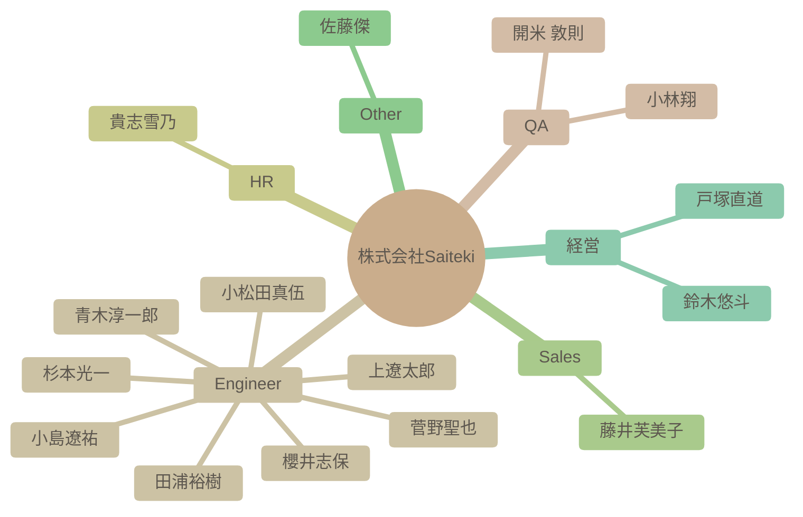

# チーム構成図

自動生成された組織図です。Issueによる更新が反映されます。

## 詳細リスト

| 名前 | 職種 | 得意スキル (Tags) | 興味 (Interests) | 目標 (Goal) | 人柄 (Personality) |
| --- | --- | --- | --- | --- | --- |
| 杉本光一 | Engineer | - | - | - | - |
| 青木淳一郎 | Engineer | AWS, インフラ設計, インフラ構築 | Youtube, 家族との時間, ドライブ | Azure、Google Cloudのスキル向上、Saitekiの輪を広げる | 協調性、コミュニケーション能力、親しみやすい |
| 小林翔 | QA | - | - | - | - |
| 櫻井志保 | Engineer | - | - | - | - |
| 田浦裕樹 | Engineer | - | - | - | - |
| 開米 敦則 | QA | - | - | - | - |
| 貴志雪乃 | HR | - | - | - | - |
| 上遼太郎 | Engineer | - | - | - | - |
| 小松田真伍 | Engineer | - | - | - | - |
| 小島遼祐 | Engineer | - | - | - | - |
| 藤井芙美子 | Sales | - | - | - | - |
| 菅野聖也 | Engineer | - | - | - | - |
| 佐藤傑 | Other | - | - | - | - |
| 鈴木悠斗 | 経営 | - | - | - | - |
| 戸塚直道 | 経営 | - | - | - | - |
