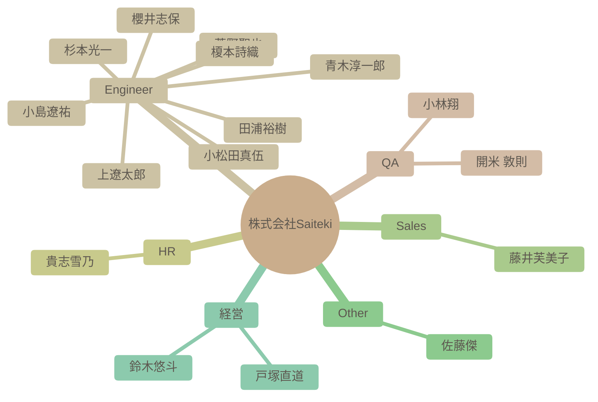

# チーム構成図

自動生成された組織図です。Issueによる更新が反映されます。

## 社員一覧サマリー

| 名前 | 職種 | 性格傾向 (概略) | 現在の状態 |
| --- | --- | --- | --- |
| [杉本光一](#%E6%9D%89%E6%9C%AC%E5%85%89%E4%B8%80) | Engineer | 好奇心旺盛で、協調性があり、新しい技術や情報に対する感度が高い。また、楽観的で周囲を巻き込む力がある。 | 新しいAI技術（ローカルAI推論、独自AIモデル構築など）の業務活用に意欲的であり、現状のAI技術の課題点や改善点について積極的に議論している。 |
| [青木淳一郎](#%E9%9D%92%E6%9C%A8%E6%B7%B3%E4%B8%80%E9%83%8E) | Engineer | 協調性が高く、新しい知識や経験に対して積極的な姿勢を持つ。楽観的で社交的な性格。 | 現在は業務負荷が高く、イベントへの参加を見送っているものの、全体的にポジティブな状況である。Saitekiのメンバーとの出会いを喜び、来年への期待を抱いている。 |
| [小林翔](#%E5%B0%8F%E6%9E%97%E7%BF%94) | QA | 開放性が高く、協調性があり、外向性も比較的高い。新しい経験や人々との交流を積極的に求めている。 | 新しい職場に期待を抱いており、周囲との良好な関係を築こうと積極的に行動している。 |
| [櫻井志保](#%E6%AB%BB%E4%BA%95%E5%BF%97%E4%BF%9D) | Engineer | 自己認識が高く、協調性があり、学習意欲も高い。新しい環境への適応力も期待できる。 | 入社を控えており、新しい環境への期待感と意欲に満ち溢れている。チームの一員として貢献したいという気持ちが強い。 |
| [田浦裕樹](#%E7%94%B0%E6%B5%A6%E8%A3%95%E6%A8%B9) | Engineer | 協調性が高く、開放的で誠実。安定した情緒を持ち、周囲との調和を大切にする。 | 現在の業務やチームに満足しており、積極的に貢献しようとしている。新しい技術への関心も高く、自己成長にも意欲的である。 |
| [開米 敦則](#%E9%96%8B%E7%B1%B3%20%E6%95%A6%E5%89%87) | QA | 開米さんは、新しいことへの興味を持ち、計画性があり、社交的で、協調性があり、ストレス耐性もある人物であると考えられます。 | 入社を控えており、新しい職場への期待感と貢献意欲に満ち溢れています。QA業界におけるAIの動向に強い関心を持ち、積極的に情報収集を行おうとしています。 |
| [貴志雪乃](#%E8%B2%B4%E5%BF%97%E9%9B%AA%E4%B9%83) | HR | 協調性が高く、誠実で、新しい知識や情報への好奇心も持ち合わせている。控えめで謙虚な面もある。 | 人事担当者として、イベント告知や社内交流企画の運営など、積極的に業務に取り組んでいる。新しい情報にも関心を持ち、意欲的に学習している様子。 |
| [上遼太郎](#%E4%B8%8A%E9%81%BC%E5%A4%AA%E9%83%8E) | Engineer | 好奇心旺盛で社交的、協調性があり、新しいことへの挑戦を好む。また、自身の知識や経験に対して謙虚な姿勢を持つ。 | 入社を控え、新しい環境への期待感と、貢献意欲に満ちている。AI技術に対する関心が高い。 |
| [小松田真伍](#%E5%B0%8F%E6%9D%BE%E7%94%B0%E7%9C%9F%E4%BC%8D) | Engineer | 協調性が高く、学習意欲と責任感がある。新しい技術への関心も高く、積極的に情報収集・共有を行う。 | 入社を非常に楽しみにしており、新しい環境で自身のスキルを活かしたいという意欲に満ち溢れている。AI技術に関する情報収集に熱心で、業務への応用を積極的に検討している。 |
| [小島遼祐](#%E5%B0%8F%E5%B3%B6%E9%81%BC%E7%A5%90) | Engineer | 開放性が高く、協調性があり、外向的な性格。几帳面さや安定性は中程度。 | 入社したばかりで、新しい環境に馴染もうと努力している。周囲とのコミュニケーションを積極的に行い、貢献意欲も高い。 |
| [藤井芙美子](#%E8%97%A4%E4%BA%95%E8%8A%99%E7%BE%8E%E5%AD%90) | Sales | 全体的に協調性が高く、新しいことへの好奇心も旺盛。ストレス耐性も平均以上と推測される。 | 新しい職場への期待感と、周囲との良好な関係を築きたいという意欲に満ちている。また、家庭と仕事の両立に意欲的で、日々の生活を楽しんでいる。 |
| [菅野聖也](#%E8%8F%85%E9%87%8E%E8%81%96%E4%B9%9F) | Engineer | 好奇心旺盛で、学習意欲が高く、新しいものへの適応力がある。また、謙虚で協調性を重んじる。 | 入社を控え、新たな環境への期待と、技術的なスキルに対する若干の不安を感じている。AI技術や読書に高い関心を持っている。 |
| [佐藤傑](#%E4%BD%90%E8%97%A4%E5%82%91) | Other | 非常に開放的で外向性が高く、新しい経験や人々との交流を楽しむ。責任感と勤勉さも持ち合わせている。 | AI技術に関する情報収集や活用に意欲的で、自身の知識や経験を共有することに積極的。新しい技術動向に関心を寄せている。 |
| [鈴木悠斗](#%E9%88%B4%E6%9C%A8%E6%82%A0%E6%96%97) | 経営 | 開放的で協調性が高く、外向的な性格。新しいもの好きで、周囲との調和を大切にする。 | 全体的にポジティブで、仕事に対するモチベーションも高い。新しい技術（生成AI）の活用に強い関心を持っている。 |
| [戸塚直道](#%E6%88%B8%E5%A1%9A%E7%9B%B4%E9%81%93) | 経営 | 外交的で誠実、開放性と向こう見ずな一面も。仕事への情熱と周囲への感謝を忘れない。 | 多忙ながらも新規メンバーの入社や事業の進展に意欲的。AI技術の活用による事業成長と組織の強化に注力している。 |
| [榎本詩織](#%E6%A6%8E%E6%9C%AC%E8%A9%A9%E7%B9%94) | Engineer | - | - |

---

## 詳細プロフィール

各社員の詳細な分析結果です。クリックして展開できます。

### 杉本光一 (Engineer)

> **総合サマリー**: 杉本光一は、技術に対する強い好奇心と学習意欲を持ち、チームへの貢献を積極的に行うエンジニア。家族を大切にし、新しい技術やトレンドに敏感である。

<b>🛠 性格傾向 (Personality Traits)</b>

**要約**: 好奇心旺盛で、協調性があり、新しい技術や情報に対する感度が高い。また、楽観的で周囲を巻き込む力がある。

| 項目 | スコア | 根拠・エピソード |
| --- | --- | --- |
| 開放性 (Openness) | 9/10 | AI関連の技術トレンドに興味を持ち、積極的に情報収集・共有している。また、新しいテストの形やローカルAIでの推論処理など、新しい技術の活用に意欲的である。 |
| 誠実性 (Conscientiousness) | 7/10 | 自己紹介をホワイトボードにまとめたり、書籍レポートを提出するなど、情報を整理して共有する几帳面さが見られる。自身のスキル不足を認識しつつ、地道に努力しようとする姿勢も伺える。 |
| 外向性 (Extraversion) | 8/10 | 新しいメンバーへの積極的な挨拶や、共通の趣味（ゲーム、アニメ）を通じたコミュニケーションを積極的に行っている。また、雑談会や交流イベントの提案など、周囲との交流を重視している。 |
| 協調性 (Agreeableness) | 9/10 | 他者の意見や成果を認め、積極的に賞賛するコメントが多い。困っている人に手を差し伸べたり、質問に丁寧に答えるなど、協調性を重視する姿勢が見られる。 |
| 神経症的傾向 (Neuroticism) | 3/10 | 全体的にポジティブな発言が多く、ネガティブな感情を表に出すことは少ない。自身のスキル不足を自覚していても、前向きに努力しようとする姿勢が見られる。 |

<b>💪 仕事スタイルと強み (Work Styles & Strengths)</b>

**要約**: AI技術に対する深い理解と実践的な応用力を持つ。チームと協力し、積極的に知識を共有することで、組織全体の成長に貢献する。

**問題解決スタイル**: 技術的な課題に対して、情報収集、仮説検証、実験を繰り返しながら解決策を探る。積極的に新しいツールや技術を取り入れ、効率的な解決を目指す。

**主要な強み**: AI技術の理解と応用, 情報収集と共有, チームワークと協調性

**証拠エピソード**:
- RAG構築アプリの開発を通じて、ベクトルデータに関する理解を深め、その知識をチームに共有している。
- AntigravityというAI搭載IDEの利点を共有し、AI開発ガイドラインのPJに導入しようとしている。
- 書籍購入補助制度を利用し、自身のスキルアップを図るとともに、得られた知識をレポートとして共有している。

<b>💎 価値観とモチベーター (Values & Motivators)</b>

**要約**: 技術的な成長、チームへの貢献、家族との時間を大切にしている。新しい技術や知識を習得すること、自身のスキルアップがモチベーションにつながる。

**コアバリュー**: 技術的成長, チームへの貢献, 家族との時間

**モチベーショントリガー**: 新しい技術の習得, チームからの感謝, 家族との交流

**証拠エピソード**:
- SaitekiでのAI関連の取り組みに期待し、会社が成功する未来を信じている。
- 新しい書籍購入補助制度を利用し、自己成長を促進しようとしている。
- 家族と公園に行ったり、子供の成長を記録するなど、家族との時間を大切にしている様子が伺える。

<b>📈 現在の状態 (Current State)</b>

**要約**: 新しいAI技術（ローカルAI推論、独自AIモデル構築など）の業務活用に意欲的であり、現状のAI技術の課題点や改善点について積極的に議論している。

- **感情レベル**: positive
- **業務負荷状況**: 標準的。新しい技術の調査・検証に時間を割いている。
- **最近の関心トピック**: ローカルAIでの推論処理, AI生成レビューの効率化, RAG構築

---

### 青木淳一郎 (Engineer)

> **総合サマリー**: 佐賀県出身で福岡在住のAWS基盤エンジニア。多趣味で家族を大切にし、学習意欲も高い。周囲との協調性を重視する社交的な人物。

<b>🛠 性格傾向 (Personality Traits)</b>

**要約**: 協調性が高く、新しい知識や経験に対して積極的な姿勢を持つ。楽観的で社交的な性格。

| 項目 | スコア | 根拠・エピソード |
| --- | --- | --- |
| 開放性 (Openness) | 8/10 | 新しい技術（Azure、Google Cloud、AI）への学習意欲が高く、未経験領域にも積極的に挑戦しようとしている。 |
| 誠実性 (Conscientiousness) | 7/10 | 仕事に対して真面目に取り組む姿勢が見られる。納品が近い際にイベント参加を控えるなど、責任感も強い。 |
| 外向性 (Extraversion) | 8/10 | 自己紹介や挨拶を丁寧に行い、積極的にコミュニケーションを取ろうとしている。共通の趣味を持つ人との交流も楽しんでいる。 |
| 協調性 (Agreeableness) | 9/10 | 周囲への感謝の気持ちを頻繁に表現し、協力的な姿勢を示す。他のメンバーの発言にも肯定的な反応が多い。 |
| 神経症的傾向 (Neuroticism) | 3/10 | ネガティブな感情表現は少なく、全体的にポジティブな発言が多い。近所にサルが出没した際の驚きを述べているものの、深刻な不安は感じられない。 |

<b>💪 仕事スタイルと強み (Work Styles & Strengths)</b>

**要約**: インフラ設計・構築の経験があり、新しい技術への学習意欲も高い。チームワークを重視し、協力的な姿勢で業務に取り組む。

**問題解決スタイル**: 現状を把握し、必要な情報を収集しながら解決策を模索する。BIツールの使用で苦戦していることを共有し、協力を仰ぐ姿勢も見られる。

**主要な強み**: インフラ設計・構築スキル, 学習意欲, コミュニケーション能力

**証拠エピソード**:
- AWS基盤のインフラ設計・構築の経験を持つ。
- AIやBIツールなど、新しい技術の学習に意欲的である。
- Slackでの積極的なコミュニケーションを通じて、チームメンバーとの関係構築を図っている。

<b>💎 価値観とモチベーター (Values & Motivators)</b>

**要約**: 家族との時間を大切にし、仕事を通じてスキルアップを目指している。チームへの貢献意欲も高く、組織の一員としての意識も強い。

**コアバリュー**: 家族, 成長, 貢献

**モチベーショントリガー**: 新しい技術の習得, チームへの貢献, 自己成長

**証拠エピソード**:
- 休日の過ごし方として家族との時間を大切にしている。
- 未経験領域への挑戦を通じてスキルの幅を広げたいと考えている。
- Saitekiの輪を広げていきたいという発言から、組織への貢献意欲が伺える。

<b>📈 現在の状態 (Current State)</b>

**要約**: 現在は業務負荷が高く、イベントへの参加を見送っているものの、全体的にポジティブな状況である。Saitekiのメンバーとの出会いを喜び、来年への期待を抱いている。

- **感情レベル**: positive
- **業務負荷状況**: 納品が近いこともあり、業務負荷が高い。
- **最近の関心トピック**: Saitekiメンバーの入社経緯, 京都旅行

---

### 小林翔 (QA)

> **総合サマリー**: 小林翔さんは、新しい職場に積極的に溶け込もうとする姿勢があり、趣味や嗜好も多岐にわたるため、周囲との共通点を見つけやすく、協調性を重視する人物である。

<b>🛠 性格傾向 (Personality Traits)</b>

**要約**: 開放性が高く、協調性があり、外向性も比較的高い。新しい経験や人々との交流を積極的に求めている。

| 項目 | スコア | 根拠・エピソード |
| --- | --- | --- |
| 開放性 (Openness) | 8/10 | 新しい職場への期待感や、旅行やゲームなど多様な趣味を持っていることから、新しい経験やアイデアに対して積極的な姿勢がうかがえる。特にローグライクゲームへの深いハマり込みは、探求心の強さを示している。 |
| 誠実性 (Conscientiousness) | 7/10 | 前職で13年間テスターおよび進行管理の経験があることから、責任感があり、計画性を持って業務に取り組むことができると考えられる。入社時の丁寧な自己紹介からも、几帳面な一面が窺える。 |
| 外向性 (Extraversion) | 6/10 | 自己紹介で年齢の近い人が多いことに触れ、仲良くしながら一緒に成長したいと述べていることから、他人との交流を好み、積極的にコミュニケーションを取ろうとする傾向が見られる。 |
| 協調性 (Agreeableness) | 8/10 | 自己紹介の丁寧さや、他の社員の趣味や好みに共感する発言、お互いを尊重する姿勢が見られることから、協調性が高く、周囲との調和を大切にすると考えられる。ゲーム部の創設に意欲を示す点も、集団への貢献意欲を示している。 |
| 神経症的傾向 (Neuroticism) | 3/10 | 全体的にポジティブな発言が多く、ネガティブな感情を表に出すことは少ない。自己紹介も丁寧で、周囲に好印象を与えようとする姿勢が見られる。 |

<b>💪 仕事スタイルと強み (Work Styles & Strengths)</b>

**要約**: 協調性があり、コミュニケーション能力が高く、長年のテスター経験から注意深く問題点を見つけることができる。新しい知識を吸収することにも積極的である。

**問題解決スタイル**: 過去の経験から得た知識や情報を活用し、論理的に問題を解決する。テスターとしての経験から、細かい部分にも注意を払い、潜在的なリスクを早期に発見することができる。

**主要な強み**: テスト経験, コミュニケーション能力, 情報収集力

**証拠エピソード**:
- 13年間のテスター経験から、問題点を見つけ出す能力が高いと考えられる。
- 他の社員の趣味や好みに共感する発言が多く、コミュニケーション能力が高いと考えられる。
- 北海道のグルメ情報に興味を示し、積極的に情報収集を行っている。

<b>💎 価値観とモチベーター (Values & Motivators)</b>

**要約**: 成長、繋がり、楽しさ、経験を重視する。新しい知識やスキルを習得すること、他人との良好な関係を築くこと、そして楽しい経験をすることがモチベーションの源泉となる。

**コアバリュー**: 成長, 協調, 楽しさ

**モチベーショントリガー**: 新しい知識の習得, チームへの貢献, 楽しい経験

**証拠エピソード**:
- 自己紹介で「一緒に成長できたら嬉しい」と述べていることから、成長意欲が高いことがわかる。
- ゲーム部の創設に意欲を示すことから、チームへの貢献意欲が高いことがわかる。
- 趣味の話題を楽しそうに語っていることから、楽しい経験がモチベーションにつながることがわかる。

<b>📈 現在の状態 (Current State)</b>

**要約**: 新しい職場に期待を抱いており、周囲との良好な関係を築こうと積極的に行動している。

- **感情レベル**: positive
- **業務負荷状況**: 入社前であり、業務負荷は低いと考えられる。
- **最近の関心トピック**: ゲーム, 北海道グルメ

---

### 櫻井志保 (Engineer)

> **総合サマリー**: 櫻井志保さんは、データ分析経験があり、学習意欲の高い、コミュニケーションを重視する人物です。柔軟性があり、新しい環境への適応力も期待できます。

<b>🛠 性格傾向 (Personality Traits)</b>

**要約**: 自己認識が高く、協調性があり、学習意欲も高い。新しい環境への適応力も期待できる。

| 項目 | スコア | 根拠・エピソード |
| --- | --- | --- |
| 開放性 (Openness) | 8/10 | データ分析など専門分野への挑戦意欲や、資格取得を目指す姿勢から、新しい知識や経験に対して積極的であることが伺えます。 |
| 誠実性 (Conscientiousness) | 7/10 | 自己紹介で業務内容や趣味について丁寧に記述しており、責任感と几帳面さが見られます。データ集計業務の経験からも計画性と正確性が推測できます。 |
| 外向性 (Extraversion) | 6/10 | Slackを通じた積極的なコミュニケーションを希望しており、周囲との連携を重視する姿勢が見られます。自己紹介も丁寧で、相手に良い印象を与えようという意識が感じられます。 |
| 協調性 (Agreeableness) | 9/10 | 自己紹介で丁寧な言葉遣いを心掛けており、協調性を重視する姿勢が伺えます。謙虚な姿勢も見られ、周囲との良好な関係を築こうとする意識が感じられます。 |
| 神経症的傾向 (Neuroticism) | 3/10 | 自己紹介の内容から、不安や心配を感じやすいといった傾向は見られません。むしろ、新しい環境への期待感や前向きな姿勢が感じられます。 |

<b>💪 仕事スタイルと強み (Work Styles & Strengths)</b>

**要約**: データ分析スキルを持ち、学習意欲が高く、自ら課題を見つけて改善に取り組むタイプ。コミュニケーション能力も高く、チームワークを重視する。

**問題解決スタイル**: データに基づいた分析と、論理的な思考で問題を解決するアプローチを取る。

**主要な強み**: データ分析, コミュニケーション, 学習意欲

**証拠エピソード**:
- Power BIを用いたデータ分析・加工の経験
- データベース構築などより専門的な分野への挑戦意欲
- Slackを通じた積極的なコミュニケーションへの意欲

<b>💎 価値観とモチベーター (Values & Motivators)</b>

**要約**: 成長と貢献を重視し、新しい知識やスキルを習得することに喜びを感じる。チームワークを重視し、周囲との協調関係を築くことを大切にする。

**コアバリュー**: 成長, 貢献, 協調性

**モチベーショントリガー**: 新しい知識やスキルの習得, 専門性の向上, チームへの貢献

**証拠エピソード**:
- 資格取得を目指す姿勢
- データベース構築など専門分野への挑戦意欲
- Slackを通じた積極的なコミュニケーションへの意欲

<b>📈 現在の状態 (Current State)</b>

**要約**: 入社を控えており、新しい環境への期待感と意欲に満ち溢れている。チームの一員として貢献したいという気持ちが強い。

- **感情レベル**: positive
- **業務負荷状況**: 新規入社のため、業務負荷は不明
- **最近の関心トピック**: データ分析, データベース構築, 資格取得

---

### 田浦裕樹 (Engineer)

> **総合サマリー**: 20年のエンジニア経験を持つ、Warm Heart, Cool Headなベテラン。技術力が高く、チームを盛り上げ、知見を共有することに意欲的な人物。

<b>🛠 性格傾向 (Personality Traits)</b>

**要約**: 協調性が高く、開放的で誠実。安定した情緒を持ち、周囲との調和を大切にする。

| 項目 | スコア | 根拠・エピソード |
| --- | --- | --- |
| 開放性 (Openness) | 8/10 | AI技術の学習に意欲的で、新しいラーメン店やチョコレート、音楽など、様々な分野に興味を示す。また、ゴッホ展に行くなど芸術にも関心がある。 |
| 誠実性 (Conscientiousness) | 9/10 | アジャイル開発や品質改善を得意とし、PoCの立ち上げを主導するなど、計画性と責任感がある。技術的な知見を惜しみなく共有しようとする姿勢からも、誠実さが伺える。 |
| 外向性 (Extraversion) | 7/10 | Slackでの活発なコミュニケーションや、他者へのリプライから、外向的な性格が窺える。また、チームの立ち上げや拡大を得意としており、周囲との交流を楽しんでいる様子が伺える。 |
| 協調性 (Agreeableness) | 9/10 | 丁寧な言葉遣いや、他者への感謝の言葉が多く、協調性が高い。また、チームメンバーへの気遣いや、若手との交流を積極的に行おうとする姿勢からも、共感性の高さが窺える。 |
| 神経症的傾向 (Neuroticism) | 3/10 | 自身の経験を元に若手の悩みに寄り添いたいという発言や、他者への気遣いが多く見られることから、感情が安定していることが窺える。50代であることへの不安を吐露する場面もあるが、全体的には落ち着いた印象を与える。 |

<b>💪 仕事スタイルと強み (Work Styles & Strengths)</b>

**要約**: アジャイル開発を得意とし、チーム立ち上げや品質改善に貢献できる。問題解決能力が高く、技術的な知見を活かしてチームをサポートする。

**問題解決スタイル**: 仮説を立て、クライアントと協力しながら要件を整理し、段階的に詳細を詰めていく。変化に柔軟に対応し、前提や制約の変化を前向きに吸収する。

**主要な強み**: アジャイル開発, チーム立ち上げ・拡大, 設計・実装の品質改善

**証拠エピソード**:
- PoCの立ち上げにおいて、クライアントの曖昧な要件を整理し、タスク分解と優先順位付けを行い、PoCを円滑に進めている。
- 過去には、再設計やリファクタリングを集中的に行い、顧客から「田浦工務店」と呼ばれるほど信頼されていた。

<b>💎 価値観とモチベーター (Values & Motivators)</b>

**要約**: 技術に裏打ちされた温かみのある仕事をすることに価値を置き、顧客やチームメンバーへの貢献をモチベーションとする。

**コアバリュー**: Warm Heart, Cool Head, 技術による貢献, チームワーク

**モチベーショントリガー**: 顧客からの感謝, チームの成功, 技術的な挑戦

**証拠エピソード**:
- Saitekiへの参画を決めた理由として、「この人のために汗をかきたい」と思えたことを挙げている。
- 自身が開発したプロダクトを戸塚さんが購入してくれた際に、非常に喜んでいる様子が伺える。

<b>📈 現在の状態 (Current State)</b>

**要約**: 現在の業務やチームに満足しており、積極的に貢献しようとしている。新しい技術への関心も高く、自己成長にも意欲的である。

- **感情レベル**: positive
- **業務負荷状況**: 標準的。PoCの立ち上げや設計確認など、複数のタスクを抱えているが、積極的に業務に取り組んでいる。
- **最近の関心トピック**: AI技術, PoC (Proof of Concept), 要件定義

---

### 開米 敦則 (QA)

> **総合サマリー**: 開米敦則さんは、QAエンジニアとしての経験を持ち、新しい技術への探究心と、趣味を大切にするバランスの取れた人物です。チームへの貢献意欲も高く、協調性を重視する姿勢が伺えます。

<b>🛠 性格傾向 (Personality Traits)</b>

**要約**: 開米さんは、新しいことへの興味を持ち、計画性があり、社交的で、協調性があり、ストレス耐性もある人物であると考えられます。

| 項目 | スコア | 根拠・エピソード |
| --- | --- | --- |
| 開放性 (Openness) | 8/10 | AIを活用した新しいテストの形にチャレンジしたいという意欲や、社外セミナーへの参加意欲から、新しい知識や経験に対して積極的であることが伺えます。また、趣味の多様さからも、知的好奇心の高さが窺えます。 |
| 誠実性 (Conscientiousness) | 7/10 | 20年のQAエンジニア経験や、テスト計画・設計・進捗管理に関わってきたことから、計画性や責任感があると考えられます。自己紹介が丁寧である点も、几帳面さを示唆します。 |
| 外向性 (Extraversion) | 6/10 | 自己紹介を積極的に行い、周囲とのコミュニケーションを円滑に図ろうとする姿勢が見られます。スポーツ観戦が好きで、誰かと一緒に応援したいという発言からも、社交的な一面が窺えます。 |
| 協調性 (Agreeableness) | 8/10 | 丁寧な言葉遣いや、周囲への感謝の言葉が多く見られることから、協調性があり、周囲との関係を大切にする人物であると考えられます。チームの一員として貢献したいという意欲も、協調性を示すものです。 |
| 神経症的傾向 (Neuroticism) | 4/10 | 自己紹介の内容や、周囲への返信から、落ち着いた印象を受けます。趣味に没頭することでストレスを解消している可能性も考えられます。 |

<b>💪 仕事スタイルと強み (Work Styles & Strengths)</b>

**要約**: QAエンジニアとしての豊富な経験を持ち、問題解決能力が高く、新しい技術への適応力もあると考えられます。コミュニケーション能力も高く、チームワークを重視する姿勢が伺えます。

**問題解決スタイル**: 経験に基づいた論理的なアプローチに加え、AIなどの新しい技術を活用した問題解決を志向する。

**主要な強み**: QAエンジニアとしての専門知識, コミュニケーション能力, 新しい技術への適応力

**証拠エピソード**:
- 20年のQAエンジニア経験から、Webサービスやアプリのテスト計画・設計・進捗管理・プロセス改善に精通していることがわかる。
- AIを活用した新しいテストの形にチャレンジしたいという意欲から、新しい技術への関心が高いことがわかる。
- 社外セミナーへの参加意欲から、情報収集能力が高く、学習意欲も高いことがわかる。

<b>💎 価値観とモチベーター (Values & Motivators)</b>

**要約**: チームワークを重視し、自身のスキルアップと組織への貢献を両立させることを大切にしていると考えられます。新しい技術への探求心と、趣味を通じた充実感も重要なモチベーションの源泉です。

**コアバリュー**: チームワーク, スキルアップ, 組織への貢献

**モチベーショントリガー**: 新しい技術への挑戦, 趣味を通じた充実感, 周囲からの感謝

**証拠エピソード**:
- チームの一員としてお役に立てるよう努めると述べており、組織への貢献意欲が高いことがわかる。
- 色々な方と意見交換してさらにスキルアップしていきたいと述べており、学習意欲が高いことがわかる。
- ガンプラやペットの飼育など、趣味を大切にしていることから、ワークライフバランスを重視していることがわかる。

<b>📈 現在の状態 (Current State)</b>

**要約**: 入社を控えており、新しい職場への期待感と貢献意欲に満ち溢れています。QA業界におけるAIの動向に強い関心を持ち、積極的に情報収集を行おうとしています。

- **感情レベル**: positive
- **業務負荷状況**: 新規入社のため、現時点では業務負荷は低いと考えられる
- **最近の関心トピック**: AIを活用したQA, QA業界の動向, ガンプラ, インコ

---

### 貴志雪乃 (HR)

> **総合サマリー**: 貴志雪乃さんは、丁寧で協調性があり、学習意欲の高い人事担当者。子育てと仕事を両立しながら、チームに貢献しようと努めている。

<b>🛠 性格傾向 (Personality Traits)</b>

**要約**: 協調性が高く、誠実で、新しい知識や情報への好奇心も持ち合わせている。控えめで謙虚な面もある。

| 項目 | スコア | 根拠・エピソード |
| --- | --- | --- |
| 開放性 (Openness) | 7/10 | 映画鑑賞が好きで、体罰をテーマにした社会派作品に関心を示す。また、勉強会に参加したり、オンライン部活の企画に関わるなど、新しい知識や経験を積極的に取り入れようとする姿勢が見られる。 |
| 誠実性 (Conscientiousness) | 8/10 | 「お返事が遅くなってしまい、申し訳ございません」と丁寧に謝罪したり、「精一杯努めてまいりますので、何卒よろしくお願い申し上げます」と述べるなど、責任感が強く、丁寧な対応を心がけている。 |
| 外向性 (Extraversion) | 5/10 | 初対面の人にも丁寧に挨拶し、共通の話題を見つけて親近感を持たせようとする。オンライン飲み会など、交流の機会にも関心を示す。 |
| 協調性 (Agreeableness) | 9/10 | 温かい言葉へ感謝を述べ、相手の意見を尊重する姿勢がうかがえる。「〜できたら嬉しいです」のように、相手への配慮が見られる発言が多い。 |
| 神経症的傾向 (Neuroticism) | 4/10 | 「お返事が遅くなってしまい、申し訳ございません」と何度か述べていることから、相手への配慮を強く意識し、失礼のないように努めていると考えられる。ただし、全体的にはポジティブな発言が多い。 |

<b>💪 仕事スタイルと強み (Work Styles & Strengths)</b>

**要約**: 人事担当者として、丁寧なコミュニケーションと学習意欲を活かし、チームに貢献しようとしている。イベントの告知や勉強会のレポート共有など、情報発信にも積極的。

**問題解決スタイル**: 情報を収集し、関係者と協力しながら解決策を探るタイプ。

**主要な強み**: 丁寧なコミュニケーション, 情報収集力, 学習意欲

**証拠エピソード**:
- 勉強会の告知やレポート共有を通じて、チーム全体の知識向上に貢献している。
- オンライン部活の企画に積極的に参加し、社員間の交流を促進しようとしている。

<b>💎 価値観とモチベーター (Values & Motivators)</b>

**要約**: 仕事と家庭の両立を重視し、チームへの貢献と自己成長を両立させたいと考えている。また、新しい知識や情報に触れること、人との交流に喜びを感じる。

**コアバリュー**: 家族, チームワーク, 自己成長

**モチベーショントリガー**: チームへの貢献, 新しい知識やスキルの習得, 人との交流

**証拠エピソード**:
- 子育て世代への共感を示し、自身の経験を共有することで、相手との親近感を深めようとしている。
- 勉強会やオンライン部活など、自己成長や社員間の交流を促進する企画に積極的に関わっている。

<b>📈 現在の状態 (Current State)</b>

**要約**: 人事担当者として、イベント告知や社内交流企画の運営など、積極的に業務に取り組んでいる。新しい情報にも関心を持ち、意欲的に学習している様子。

- **感情レベル**: positive
- **業務負荷状況**: 通常
- **最近の関心トピック**: 生成AI, 映画

---

### 上遼太郎 (Engineer)

> **総合サマリー**: 上遼太郎は、新しい技術への好奇心旺盛で、コミュニケーションを積極的に行い、学習意欲の高い人物。周囲との協調も重視する。

<b>🛠 性格傾向 (Personality Traits)</b>

**要約**: 好奇心旺盛で社交的、協調性があり、新しいことへの挑戦を好む。また、自身の知識や経験に対して謙虚な姿勢を持つ。

| 項目 | スコア | 根拠・エピソード |
| --- | --- | --- |
| 開放性 (Openness) | 9/10 | 新しい技術に触れるたびにワクワクし、AI駆動開発に向けた調査を副業で行うなど、知的好奇心が非常に高い。StagewiseというIDE拡張機能を調べてDiscordコミュニティに参加するなど、新しい分野への探求心が見られる。 |
| 誠実性 (Conscientiousness) | 7/10 | 自己紹介で職務経歴を詳細に記述しており、過去の経験を振り返って現在に活かそうとする姿勢が見られる。また、SaitekiのHPのDBにphpadminを使用していることについて、記事を読んで改めて注意しようとするなど、責任感の高さがうかがえる。 |
| 外向性 (Extraversion) | 7/10 | 自己紹介で飲み会が好きと述べており、積極的にコミュニケーションを取りたいという意欲が感じられる。また、スラックの発言頻度を上げて盛り上げたいという発言からも、周囲との交流を重視する姿勢がうかがえる。 |
| 協調性 (Agreeableness) | 8/10 | 自己紹介で「よろしくお願いします」と丁寧な言葉遣いを心がけている。また、他の社員の発言に対して共感や感謝の意を示すことが多く、協調性を重視する傾向がある。営業の商談動画を共有してもらったことに対して感謝を述べている。 |
| 神経症的傾向 (Neuroticism) | 4/10 | 自身のIT経験について「そこまでITの経験はない」と謙遜する様子が見られる。しかし、全体的には前向きな発言が多く、不安や心配を抱えている様子はあまり見られない。 |

<b>💪 仕事スタイルと強み (Work Styles & Strengths)</b>

**要約**: 学習意欲が高く、新しい技術や知識を積極的に吸収しようとする。過去の経験を活かし、問題解決に役立てようとする。

**問題解決スタイル**: 過去の経験や知識を参考にしながら、新しい情報を取り入れて解決策を探る。技術的なコミュニティへの参加を通じて情報収集を行う。

**主要な強み**: 学習意欲, 情報収集力, コミュニケーション能力

**証拠エピソード**:
- SaitekiでAI駆動開発に向けた調査を副業で行い、新しい技術に触れるたびにワクワクしている。
- StagewiseというIDEの拡張機能を調べてDiscordコミュニティに参加し、情報収集に努めている。

<b>💎 価値観とモチベーター (Values & Motivators)</b>

**要約**: 新しい技術への挑戦や自己成長、周囲との良好な関係を重視する。自身のスキルアップを通じて会社に貢献したいという意欲が強い。

**コアバリュー**: 自己成長, 貢献, 協調性

**モチベーショントリガー**: 新しい技術, 周囲からの刺激, 自己の成長

**証拠エピソード**:
- 入社後はどんどん新しいことに挑戦していきたいと考えている。
- 来年の四月入社までにAIのキャッチアップを進めていこうと改めて思っている。

<b>📈 現在の状態 (Current State)</b>

**要約**: 入社を控え、新しい環境への期待感と、貢献意欲に満ちている。AI技術に対する関心が高い。

- **感情レベル**: positive
- **業務負荷状況**: 業務負荷は不明。入社前のため、比較的余裕があると思われる。
- **最近の関心トピック**: AI技術, 商談, 勉強会

---

### 小松田真伍 (Engineer)

> **総合サマリー**: 屋久島出身のWeb/スマホアプリエンジニア。技術探求心旺盛で、地域活性化への情熱を持つ。学習意欲が高く、周囲との協調性を重視する。

<b>🛠 性格傾向 (Personality Traits)</b>

**要約**: 協調性が高く、学習意欲と責任感がある。新しい技術への関心も高く、積極的に情報収集・共有を行う。

| 項目 | スコア | 根拠・エピソード |
| --- | --- | --- |
| 開放性 (Openness) | 9/10 | 新しいAI技術（Warp, Antigravity, ClaudeCode, Cursor）に関する講習に積極的に参加し、その情報を共有している。また、既存のSIerのあり方に対して疑問を持ち、より良い方法を模索したいと考えている。 |
| 誠実性 (Conscientiousness) | 8/10 | 入社前から自己紹介を丁寧に行い、入社後も積極的にチームメンバーとコミュニケーションを取ろうとしている。また、エンジニアカフェでの講習内容を詳細にまとめ、チームに共有するなど、責任感の強さが伺える。 |
| 外向性 (Extraversion) | 7/10 | 自己紹介で自身の趣味や出身地について積極的に語り、周囲との交流を求めている。勉強会での実況スレッドの提案や、チームメンバーとの雑談など、コミュニケーションを重視する傾向が見られる。 |
| 協調性 (Agreeableness) | 9/10 | 周囲への感謝の言葉を頻繁に述べ、謙虚な姿勢を崩さない。また、他者の意見を尊重し、積極的に学ぼうとする姿勢が見られる。 |
| 神経症的傾向 (Neuroticism) | 4/10 | 知識不足を心配する発言があるものの、それを乗り越えようとする意欲が強く、全体的に安定した精神状態を保っている。 |

<b>💪 仕事スタイルと強み (Work Styles & Strengths)</b>

**要約**: 自ら学習し、得た知識を共有する。AI技術に強い興味があり、積極的に業務に取り入れようとする。チームワークを重視し、周囲と協力して目標達成を目指す。

**問題解決スタイル**: AI技術を活用し、効率的かつ高品質な問題解決を目指す。複数のAIエージェントを組み合わせることで、相互監視性を高め、人的レビューを減らすことを志向する。

**主要な強み**: Web/スマホアプリ開発経験, AI技術への関心と活用, チームワークとコミュニケーション

**証拠エピソード**:
- AI駆動開発講習の内容を詳細に共有し、チーム全体の知識向上に貢献している。
- 開発速度に追いつけないQAの問題に対し、AIを活用したドキュメント作成の可能性を示唆している。
- WarpとAntigravityを組み合わせた開発手法を提案し、効率的な開発体制の構築を目指している。

<b>💎 価値観とモチベーター (Values & Motivators)</b>

**要約**: 地域活性化への貢献を重視し、自身のスキルを社会に役立てたいと考えている。また、技術的な成長を追求し、常に新しい知識を習得することに意欲的である。企業の理念に共感し、その実現に貢献したいと考えている。

**コアバリュー**: 地域活性化, 技術的成長, 社会貢献

**モチベーショントリガー**: 新しい技術の習得, チームへの貢献, 社会への貢献

**証拠エピソード**:
- 地域活性化をライフワークとしており、福岡のエンジニアカフェで事業を推進している。
- 新しい技術（AI）を積極的に学び、業務に取り入れようとしている。
- 企業の理念に共感し、その実現のために貢献したいと考えている。

<b>📈 現在の状態 (Current State)</b>

**要約**: 入社を非常に楽しみにしており、新しい環境で自身のスキルを活かしたいという意欲に満ち溢れている。AI技術に関する情報収集に熱心で、業務への応用を積極的に検討している。

- **感情レベル**: positive
- **業務負荷状況**: 不明
- **最近の関心トピック**: AI駆動開発, AIエージェントの活用, 開発環境の構築

---

### 小島遼祐 (Engineer)

> **総合サマリー**: 小島遼祐さんは、積極的で学習意欲が高く、コミュニケーション能力に長けた人物。多様な趣味を持ち、周囲との協調を重視する。

<b>🛠 性格傾向 (Personality Traits)</b>

**要約**: 開放性が高く、協調性があり、外向的な性格。几帳面さや安定性は中程度。

| 項目 | スコア | 根拠・エピソード |
| --- | --- | --- |
| 開放性 (Openness) | 9/10 | 新しいことへの学習意欲が高く、アニメや将棋など多様な趣味を持つ。自己紹介の内容が詳細で、多くの情報を開示している。 |
| 誠実性 (Conscientiousness) | 6/10 | 大学時代にアルバイトの責任者を務めたり、中学時代から様々な役職を経験していることから、一定の責任感を持つ。ただし、大学を中退している点から、計画性や持続力には改善の余地があるかもしれない。 |
| 外向性 (Extraversion) | 8/10 | 自己紹介で多くの情報を提供し、初対面の相手にも積極的に話しかけている。周囲との交流を積極的に求めている。 |
| 協調性 (Agreeableness) | 9/10 | 自己紹介が丁寧で、相手への敬意を払う姿勢が見られる。周囲の意見をまとめたり、協調性を重視する傾向がある。 |
| 神経症的傾向 (Neuroticism) | 4/10 | 辛い時に音楽に救われた経験を語っているが、全体的には安定した精神状態であると推測される。自己肯定感も高い。 |

<b>💪 仕事スタイルと強み (Work Styles & Strengths)</b>

**要約**: 協調性を重視し、周囲から学びながら成長していくタイプ。コミュニケーション能力が高く、リーダーシップも発揮できる。

**問題解決スタイル**: 周囲の意見を聞きながら、協調して問題解決を図る。過去の経験から、計画を立てて実行することも得意。

**主要な強み**: コミュニケーション能力, 学習意欲, 協調性

**証拠エピソード**:
- 自己紹介で「人の意見を纏めるのが好き」と述べている。
- 先輩から学べることは全て学びたいと述べており、学習意欲が高い。
- 周囲への感謝の言葉を述べており、協調性がある。

<b>💎 価値観とモチベーター (Values & Motivators)</b>

**要約**: 周囲との良好な関係、成長、貢献を重視する。感謝されることや、チームの一員として認められることがモチベーションに繋がる。

**コアバリュー**: 協調性, 成長, 貢献

**モチベーショントリガー**: 感謝, 貢献, チームワーク

**証拠エピソード**:
- 仲間に迎え入れてくれたことへの感謝を述べている。
- 早く力になれるように尽力すると述べている。
- 一緒に盛り上げていきたいという発言から、チームワークを重視している。

<b>📈 現在の状態 (Current State)</b>

**要約**: 入社したばかりで、新しい環境に馴染もうと努力している。周囲とのコミュニケーションを積極的に行い、貢献意欲も高い。

- **感情レベル**: positive
- **業務負荷状況**: 低。入社前であり、業務負荷は低い。
- **最近の関心トピック**: アニメ（葬送のフリーレン）, ラーメン, ポケモン, ビジネス本

---

### 藤井芙美子 (Sales)

> **総合サマリー**: 藤井芙美子は、社交的で協調性があり、新しい環境にも積極的に適応しようとする人物。周囲への気配りもでき、学ぶ意欲も高い。

<b>🛠 性格傾向 (Personality Traits)</b>

**要約**: 全体的に協調性が高く、新しいことへの好奇心も旺盛。ストレス耐性も平均以上と推測される。

| 項目 | スコア | 根拠・エピソード |
| --- | --- | --- |
| 開放性 (Openness) | 8/10 | 新しい職場への期待感を示し、趣味も多岐にわたる。ゴールデンカムイの実写版もチェックするなど、様々なメディアに興味を示す。 |
| 誠実性 (Conscientiousness) | 7/10 | 自己紹介で過去の職歴を詳細に説明し、現在の業務に早く慣れたいという意欲を示していることから、責任感と几帳面さがあると考えられる。 |
| 外向性 (Extraversion) | 7/10 | 自己紹介で積極的にコミュニケーションを取りたい姿勢を見せ、デパ地下トークなど共通の話題で交流を深めようとする。 |
| 協調性 (Agreeableness) | 9/10 | 周囲への感謝の気持ちを表現し、相手の意見に共感する姿勢が目立つ。また、他者の良い点を見習おうとするなど、協調性を重視する。 |
| 神経症的傾向 (Neuroticism) | 4/10 | 子供の反抗期についてユーモアを交えて語り、ストレスをある程度コントロールできると考えられる。東京の交通機関の遅延についても冷静に状況を伝えている。 |

<b>💪 仕事スタイルと強み (Work Styles & Strengths)</b>

**要約**: 営業事務としての経験が豊富で、周囲と協力しながら業務を進めることを得意とする。状況を的確に把握し、柔軟に対応できる。

**問題解決スタイル**: 過去の経験を活かしつつ、周囲の意見も参考にしながら、柔軟に問題解決に取り組む。

**主要な強み**: 事務処理能力, コミュニケーション能力, 状況対応力

**証拠エピソード**:
- 過去の職務経験から、事務処理能力が高いことが伺える。
- 周囲とのコミュニケーションを円滑に進めようとする姿勢から、コミュニケーション能力が高いことがわかる。
- 311を機に本社営業事務へ異動したことから、状況対応力があると考えられる。

<b>💎 価値観とモチベーター (Values & Motivators)</b>

**要約**: 家族との時間を大切にし、周囲との良好な人間関係を築くことを重視する。また、新しい知識や経験を得ることに喜びを感じ、成長を追求する。

**コアバリュー**: 家族, 協調性, 成長

**モチベーショントリガー**: 周囲からの感謝, 新しい知識の獲得, 目標達成

**証拠エピソード**:
- 子供の野球や公園遊びに付き合うことから、家族を大切にしていることがわかる。
- 周囲への感謝の言葉を述べることから、協調性を重視していることがわかる。
- 新しい職場での業務に早く慣れたいという意欲から、成長を追求していることがわかる。

<b>📈 現在の状態 (Current State)</b>

**要約**: 新しい職場への期待感と、周囲との良好な関係を築きたいという意欲に満ちている。また、家庭と仕事の両立に意欲的で、日々の生活を楽しんでいる。

- **感情レベル**: positive
- **業務負荷状況**: 業務に慣れようと努力している段階で、業務負荷は標準的と推測される。
- **最近の関心トピック**: 周囲の同僚, デパ地下, 子供の反抗期

---

### 菅野聖也 (Engineer)

> **総合サマリー**: 向学心旺盛で、新しい技術や知識の習得に意欲的な人物。謙虚で協調性があり、周囲とのコミュニケーションを大切にする。

<b>🛠 性格傾向 (Personality Traits)</b>

**要約**: 好奇心旺盛で、学習意欲が高く、新しいものへの適応力がある。また、謙虚で協調性を重んじる。

| 項目 | スコア | 根拠・エピソード |
| --- | --- | --- |
| 開放性 (Openness) | 9/10 | AI技術への興味、読書習慣（特にビジネス書や専門書）、新しいことへの挑戦意欲から、非常に高いと考えられる。 |
| 誠実性 (Conscientiousness) | 7/10 | 自己のスキル向上への意識、丁寧な対応、品質管理の経験から、ある程度の責任感と計画性を持っていると推測できる。 |
| 外向性 (Extraversion) | 6/10 | 初対面の人とも話しやすい、ランチに誘われるなどのエピソードから、社交性は平均以上と考えられる。積極的にコミュニケーションを取ろうとする姿勢が見られる。 |
| 協調性 (Agreeableness) | 8/10 | 自己紹介での丁寧な言葉遣い、周囲への感謝の言葉、謙虚な姿勢から、協調性が高く、周囲との良好な関係を築こうとする傾向が見られる。 |
| 神経症的傾向 (Neuroticism) | 4/10 | 現場を離れていた期間に対する若干の不安が見られるものの、全体的には落ち着いており、自己肯定感も比較的高いと考えられる。 |

<b>💪 仕事スタイルと強み (Work Styles & Strengths)</b>

**要約**: 学習意欲が高く、新しい技術を積極的に取り入れる。過去の経験から、システム開発に関する基礎知識を持ち、品質管理の経験もある。

**問題解決スタイル**: AIを活用して問題解決のヒントを得たり、書籍から知識を吸収したりするなど、多角的なアプローチを試みる。

**主要な強み**: 学習意欲, 適応力, コミュニケーション能力

**証拠エピソード**:
- AIに質問して問題解決の糸口を探す
- コーヒーに関する専門書を読むことで知識を深める
- 過去の職務経験から得た知識やスキルを活かそうとする姿勢

<b>💎 価値観とモチベーター (Values & Motivators)</b>

**要約**: 自己成長、技術の向上、周囲との協調を重視する。新しい知識の習得や、工夫を凝らしたコーディングにやりがいを感じる。

**コアバリュー**: 自己成長, 技術向上, 協調性

**モチベーショントリガー**: 新しい知識の習得, 技術的な挑戦, 周囲からの貢献の実感

**証拠エピソード**:
- 開発者としての勘を取り戻すことを楽しみにしている
- 工夫してコードを書くことに面白みを感じている
- 周囲の期待に応えようと努力する姿勢

<b>📈 現在の状態 (Current State)</b>

**要約**: 入社を控え、新たな環境への期待と、技術的なスキルに対する若干の不安を感じている。AI技術や読書に高い関心を持っている。

- **感情レベル**: positive
- **業務負荷状況**: 不明
- **最近の関心トピック**: AI技術, 読書, システム開発

---

### 佐藤傑 (Other)

> **総合サマリー**: 起業家精神旺盛で、AI領域に深い関心を持ち、グローバルな視点を持つ人物。学習意欲が高く、行動力がある。

<b>🛠 性格傾向 (Personality Traits)</b>

**要約**: 非常に開放的で外向性が高く、新しい経験や人々との交流を楽しむ。責任感と勤勉さも持ち合わせている。

| 項目 | スコア | 根拠・エピソード |
| --- | --- | --- |
| 開放性 (Openness) | 9/10 | 海外での活動やAIに関するコミュニティの立ち上げ、ハッカソンへの参加などから、新しい経験やアイデアに対して非常に積極的であることがわかる。 |
| 誠実性 (Conscientiousness) | 7/10 | 会社を創業し、複数の事業を推進している点や、質問に丁寧に答えようとする姿勢から、責任感があり計画的に行動する傾向が見られる。 |
| 外向性 (Extraversion) | 9/10 | 海外で現地の人と積極的に交流したり、チーム開発でリーダーシップを発揮したりする様子から、社交的でエネルギッシュな性格が伺える。 |
| 協調性 (Agreeableness) | 7/10 | 「皆さんありがとうございます！改めてよろしくお願いします！」や「シェアの方ありがとうございます！」といった発言から、協調性があり、感謝の気持ちを伝えることを大切にしている様子が窺える。 |
| 神経症的傾向 (Neuroticism) | 3/10 | 全体的にポジティブな発言が多く、ストレスを感じている様子は見られない。新しいことに挑戦する意欲が高いことから、精神的に安定していると考えられる。 |

<b>💪 仕事スタイルと強み (Work Styles & Strengths)</b>

**要約**: AI技術に関する深い知識を持ち、実践的な応用に関心がある。グローバルな視点を持ち、チームでの開発を積極的に行う。

**問題解決スタイル**: 技術的な課題に対して、最新の情報を収集し、最適な解決策を模索する。実践的な経験を通じて問題解決を図る。

**主要な強み**: AI技術への深い知識と応用力, 起業家精神と事業推進力, グローバルな視点とコミュニケーション能力

**証拠エピソード**:
- 生成AI研修・AI顧問などの事業を推進していることから、AI技術に関する深い知識と実践的な応用力を持っている。
- ウクライナ、イタリア、トルコの人とチーム開発を行い、イタリア人がPM的な役割を担っていたというエピソードから、多様なバックグラウンドを持つ人々と協力してプロジェクトを進めることができる。
- スペックに関する質問に自身の知識を基に回答しており、知見を共有することに抵抗がない。

<b>💎 価値観とモチベーター (Values & Motivators)</b>

**要約**: 新しい技術の学習と実践、グローバルな経験、そして人との繋がりを重視している。

**コアバリュー**: 学習と成長, グローバルな視点, 共創

**モチベーショントリガー**: 新しい技術に触れること, 海外での経験, アウトプットの増加

**証拠エピソード**:
- AIを触っている時や、旅先でコスパの良いローカル飯を食べることに喜びを感じていることから、新しい経験や発見を重視している。
- 海外に滞在し、現地の人と話すことにハマっていることから、グローバルな視点や異文化交流を大切にしている。
- SaitekiのみんなとAI実装の成功事例を共創したいという発言から、他者との協力や貢献を重視していることがわかる。

<b>📈 現在の状態 (Current State)</b>

**要約**: AI技術に関する情報収集や活用に意欲的で、自身の知識や経験を共有することに積極的。新しい技術動向に関心を寄せている。

- **感情レベル**: positive
- **業務負荷状況**: 多忙だが、意欲的に業務に取り組んでいる様子。
- **最近の関心トピック**: 小型の高性能モデル, AI実装の成功事例

---

### 鈴木悠斗 (経営)

> **総合サマリー**: 鈴木悠斗氏は、経験豊富な営業職出身の取締役副社長兼COO。新しい技術や組織への貢献意欲が高く、親しみやすい人柄でチームを盛り上げる。

<b>🛠 性格傾向 (Personality Traits)</b>

**要約**: 開放的で協調性が高く、外向的な性格。新しいもの好きで、周囲との調和を大切にする。

| 項目 | スコア | 根拠・エピソード |
| --- | --- | --- |
| 開放性 (Openness) | 8/10 | 新しい技術（生成AI）への関心が高く、積極的に取り入れようとしている。アニメや漫画など、様々なジャンルのコンテンツにも興味を持つ。 |
| 誠実性 (Conscientiousness) | 7/10 | 自己紹介が丁寧で、周囲への配慮が見られる。業務についても、積極的に改善点を見つけようとする姿勢がある。 |
| 外向性 (Extraversion) | 9/10 | 自己紹介で自身の経歴や趣味を積極的に共有し、周囲とのコミュニケーションを楽しもうとしている。他者の投稿にも積極的にコメントしている。 |
| 協調性 (Agreeableness) | 8/10 | 他者の意見を尊重し、肯定的なフィードバックを送ることが多い。チームメンバーの紹介や誕生日を祝うなど、協調性を重視する。 |
| 神経症的傾向 (Neuroticism) | 3/10 | 全体的にポジティブな発言が多く、ネガティブな感情を表に出すことは少ない。自身の弱み（「喜怒哀楽が顔や態度に出やすい」）を自覚し、改善しようとする姿勢が見られる。 |

<b>💪 仕事スタイルと強み (Work Styles & Strengths)</b>

**要約**: 営業経験豊富で、新しい技術への適応力も高い。チームワークを重視し、周囲を巻き込みながら目標達成を目指す。

**問題解決スタイル**: データに基づいた分析と、周囲の意見を参考にしながら、最適な解決策を見つけ出す。ウォーターフォールとアジャイルの違いを例え話で説明するなど、わかりやすい説明を心がける。

**主要な強み**: 営業経験, リーダーシップ, 技術への関心

**証拠エピソード**:
- 営業初心者向けのマニュアル作成時に、AIを活用してわかりやすい画像を生成した
- チームメンバーの未経験領域でのキャッチアップを評価し、積極的にシェアした
- 勉強会後、参加者のプロフィール共有やオフライン・オンライン参加者への配慮など、改善点を具体的に提案した

<b>💎 価値観とモチベーター (Values & Motivators)</b>

**要約**: チームワークと成長を重視し、会社全体の成功に貢献したいと考えている。新しい技術への興味も強く、常に学び続けたいと考えている。

**コアバリュー**: チームワーク, 成長, 貢献

**モチベーショントリガー**: 新しい技術, チームの成功, 顧客からの感謝

**証拠エピソード**:
- 自己紹介で「皆さんが幸せになれるよう、全力で事業に取り組みます」と述べている
- リファラル採用を推進し、会社のカルチャーに合った人材獲得に貢献しようとしている
- 資金調達の成功を喜び、会社の飛躍を誓っている

<b>📈 現在の状態 (Current State)</b>

**要約**: 全体的にポジティブで、仕事に対するモチベーションも高い。新しい技術（生成AI）の活用に強い関心を持っている。

- **感情レベル**: positive
- **業務負荷状況**: やや多忙だが、積極的に業務に取り組んでいる様子
- **最近の関心トピック**: 生成AI, 採用活動

---

### 戸塚直道 (経営)

> **総合サマリー**: 富山県出身で、営業・事業開発経験豊富な起業家。IT産業の構造変革を目指し、エンジニアの待遇改善に情熱を注いでいる。多忙ながらも学習意欲が高く、周囲との協調を大切にするリーダー。

<b>🛠 性格傾向 (Personality Traits)</b>

**要約**: 外交的で誠実、開放性と向こう見ずな一面も。仕事への情熱と周囲への感謝を忘れない。

| 項目 | スコア | 根拠・エピソード |
| --- | --- | --- |
| 開放性 (Openness) | 8/10 | 新しい技術やビジネスモデルに高い関心を示し、勉強会や情報共有を積極的に行う。AI駆動開発の可能性を探求し、社内外の知見を積極的に取り入れている。 |
| 誠実性 (Conscientiousness) | 9/10 | 資金調達や事業計画など、綿密な準備と計画性が必要な業務を遂行。目標達成に向けて努力を惜しまず、責任感が強い。週報「Letter of T」を発行し、透明性の高い情報共有を心掛けている。 |
| 外向性 (Extraversion) | 8/10 | 社内外の人脈を積極的に構築し、交流会や勉強会を主催。初対面の人とも円滑なコミュニケーションを図り、良好な人間関係を築く。SNSでの発信も積極的に行い、情報発信力も高い。 |
| 協調性 (Agreeableness) | 8/10 | メンバーへの感謝の言葉を頻繁に述べ、貢献を評価。困っている人に手を差し伸べ、チームワークを重視する。採用活動にも積極的に関与し、共感力の高い人材を求める。 |
| 神経症的傾向 (Neuroticism) | 4/10 | 多忙な日々を送る中で、時には情緒不安定になる様子も見られるが、自己認識しており、バランスを取ろうと努めている。困難な状況でも前向きな姿勢を保ち、周囲を鼓舞する。 |

<b>💪 仕事スタイルと強み (Work Styles & Strengths)</b>

**要約**: 戦略的思考と実行力を兼ね備え、人脈を活かした営業力と組織運営能力に長ける。学習意欲が高く、常に新しい情報を取り入れ、改善を続ける。

**問題解決スタイル**: 課題に対して多角的な視点からアプローチし、AI技術の活用や外部連携など、柔軟な発想で解決策を探る。データに基づいた意思決定を重視し、客観的な評価を行う。

**主要な強み**: 事業開発力, 組織運営力, 学習意欲

**証拠エピソード**:
- 勉強会を企画・開催し、社内外のエンジニアの知識向上を図る
- 資金調達のリリースを「PJ IGNITE（火種をつける）」と名付け、モチベーション高く取り組む
- SmartHRの芹澤代表との対談動画を共有し、ユニコーン企業のエッセンスを学ぼうとする

<b>💎 価値観とモチベーター (Values & Motivators)</b>

**要約**: 透明性、学習、成長を重視し、関わる全ての人が幸せになることを願う。自身の成長だけでなく、メンバーの成長やキャリアアップを支援することに喜びを感じる。

**コアバリュー**: 透明性, 成長, 貢献

**モチベーショントリガー**: メンバーの成長, 社会への貢献, 目標達成

**証拠エピソード**:
- 資金調達の成功をメンバーのおかげと感謝し、今後の待遇改善に繋げると宣言
- メンバーのキャリア相談に乗る環境を整備したいと発言
- 会社のビジョンを明確に示し、メンバーに共感と協力を求める

<b>📈 現在の状態 (Current State)</b>

**要約**: 多忙ながらも新規メンバーの入社や事業の進展に意欲的。AI技術の活用による事業成長と組織の強化に注力している。

- **感情レベル**: positive
- **業務負荷状況**: 高負荷。採用活動、事業戦略、組織運営など多岐にわたる業務をこなしている。
- **最近の関心トピック**: AI駆動開発, 受託開発営業, 組織改善

---

### 榎本詩織 (Engineer)

> **総合サマリー**: -

<b>🛠 性格傾向 (Personality Traits)</b>

※Slack連携後に詳細な性格分析結果が表示されます。 (暫定性格: -)

<b>💪 仕事スタイルと強み (Work Styles & Strengths)</b>

※Slack連携後に詳細な強み分析が表示されます。 (既存スキル: -)

<b>💎 価値観とモチベーター (Values & Motivators)</b>

※Slack連携後に詳細分析が表示されます。

<b>📈 現在の状態 (Current State)</b>

※Slack連携後に表示されます。

---

