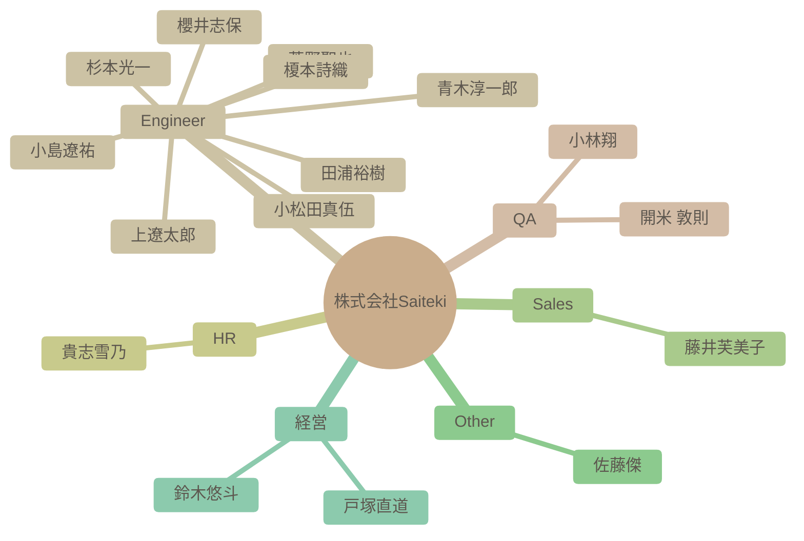

# チーム構成図

自動生成された組織図です。IssueおよびSlack連携による高度なAI分析結果が反映されます。

### 組織マップ

## 社員一覧サマリー

| 名前 | 職種 | 性格傾向 (概略) | 現在の状態 |
| --- | --- | --- | --- |
| [杉本光一](#%E6%9D%89%E6%9C%AC%E5%85%89%E4%B8%80) | Engineer | 開放性、誠実性、調和性が高く、外向性と神経症傾向は中程度。新しい技術への関心と、周囲との協調を重視する。 | AI技術を活用した業務効率化プロジェクトを推進しており、多忙ながらも意欲的に取り組んでいる。チームメンバーとの連携を重視し、情報共有やコミュニケーションを積極的に行っている。 |
| [青木淳一郎](#%E9%9D%92%E6%9C%A8%E6%B7%B3%E4%B8%80%E9%83%8E) | Engineer | 協調性が高く、新しい知識や経験に対して積極的な姿勢を持つ。楽観的で社交的な性格。 | 現在は業務負荷が高く、イベントへの参加を見送っているものの、全体的にポジティブな状況である。Saitekiのメンバーとの出会いを喜び、来年への期待を抱いている。 |
| [小林翔](#%E5%B0%8F%E6%9E%97%E7%BF%94) | QA | 開放性が高く、協調性があり、外向性も比較的高い。新しい経験や人々との交流を積極的に求めている。 | 新しい職場に期待を抱いており、周囲との良好な関係を築こうと積極的に行動している。 |
| [櫻井志保](#%E6%AB%BB%E4%BA%95%E5%BF%97%E4%BF%9D) | Engineer | 自己認識が高く、協調性があり、学習意欲も高い。新しい環境への適応力も期待できる。 | 入社を控えており、新しい環境への期待感と意欲に満ち溢れている。チームの一員として貢献したいという気持ちが強い。 |
| [田浦裕樹](#%E7%94%B0%E6%B5%A6%E8%A3%95%E6%A8%B9) | Engineer | 知的好奇心が強く、探求心旺盛。協調性があり、周囲と協力しながら新しい技術や知識の習得を重視する。 | AI駆動開発に関するプロジェクトに積極的に取り組んでおり、意欲的に業務を推進している。業務負荷は高い可能性がある。 |
| [開米 敦則](#%E9%96%8B%E7%B1%B3%20%E6%95%A6%E5%89%87) | QA | 協調性が高く、新しい知識や技術の習得に積極的で、責任感も強い。一方で、内向的な一面も持つ。 | 新しい技術の導入に意欲的で、業務に貢献しようとしている。リモートワーク環境にも慣れており、柔軟に対応できる。 |
| [貴志雪乃](#%E8%B2%B4%E5%BF%97%E9%9B%AA%E4%B9%83) | HR | 協調性が高く、誠実で、新しい知識や情報への好奇心も持ち合わせている。控えめで謙虚な面もある。 | 人事担当者として、イベント告知や社内交流企画の運営など、積極的に業務に取り組んでいる。新しい情報にも関心を持ち、意欲的に学習している様子。 |
| [上遼太郎](#%E4%B8%8A%E9%81%BC%E5%A4%AA%E9%83%8E) | Engineer | 協調性があり、学習意欲が高く、新しい技術に積極的に取り組む姿勢がみられる。一方で、やや不安を感じやすい一面もある。 | 直近では、基本設計の成果物作成手順の見直しや、NotionのMCPサーバ利用に関心がある。業務負荷については、明確な記述はないものの、複数のタスクを同時進行している様子がうかがえる。 |
| [小松田真伍](#%E5%B0%8F%E6%9D%BE%E7%94%B0%E7%9C%9F%E4%BC%8D) | Engineer | 全体的に協調性が高く、誠実で、新しいことにも積極的に取り組むタイプ。 | イベントが重なり多忙な状況だが、新しい技術への挑戦意欲は高い。協働フローの構築にも意欲的。 |
| [小島遼祐](#%E5%B0%8F%E5%B3%B6%E9%81%BC%E7%A5%90) | Engineer | 開放性が高く、協調性があり、外向的な性格。几帳面さや安定性は中程度。 | 入社したばかりで、新しい環境に馴染もうと努力している。周囲とのコミュニケーションを積極的に行い、貢献意欲も高い。 |
| [藤井芙美子](#%E8%97%A4%E4%BA%95%E8%8A%99%E7%BE%8E%E5%AD%90) | Sales | 全体的に協調性が高く、新しいことへの好奇心も旺盛。ストレス耐性も平均以上と推測される。 | 新しい職場への期待感と、周囲との良好な関係を築きたいという意欲に満ちている。また、家庭と仕事の両立に意欲的で、日々の生活を楽しんでいる。 |
| [菅野聖也](#%E8%8F%85%E9%87%8E%E8%81%96%E4%B9%9F) | Engineer | 好奇心旺盛で、学習意欲が高く、新しいものへの適応力がある。また、謙虚で協調性を重んじる。 | 入社を控え、新たな環境への期待と、技術的なスキルに対する若干の不安を感じている。AI技術や読書に高い関心を持っている。 |
| [佐藤傑](#%E4%BD%90%E8%97%A4%E5%82%91) | Other | 非常に開放的で外向性が高く、新しい経験や人々との交流を楽しむ。責任感と勤勉さも持ち合わせている。 | AI技術に関する情報収集や活用に意欲的で、自身の知識や経験を共有することに積極的。新しい技術動向に関心を寄せている。 |
| [鈴木悠斗](#%E9%88%B4%E6%9C%A8%E6%82%A0%E6%96%97) | 経営 | 協調性と責任感が高く、安定した性格。几帳面で、周囲への配慮もできる。 | 業務に意欲的に取り組んでおり、タスクの完了に向けて着実に進捗している。 |
| [戸塚直道](#%E6%88%B8%E5%A1%9A%E7%9B%B4%E9%81%93) | 経営 | 協調性が高く、新しい技術への関心と学習意欲が強い。計画性と几帳面さを持ち合わせつつ、周囲への気配りも忘れない。 | 開米さんの件について対応しており、業務負荷は高いが、新しいメンバーの受け入れに向けて積極的に動いている。 |
| [榎本詩織](#%E6%A6%8E%E6%9C%AC%E8%A9%A9%E7%B9%94) | Engineer | - | - |

---

## 詳細プロフィール

各社員の詳細な分析結果です。クリックして展開できます。

### 杉本光一 (Engineer)

> **総合サマリー**: 杉本光一氏は、AI技術に深い関心を持ち、積極的に学習・応用を試みる、チーム志向で協調性を重視するリーダーシップを発揮する人物です。

<b>🛠 性格傾向 (Personality Traits)</b>

**要約**: 開放性、誠実性、調和性が高く、外向性と神経症傾向は中程度。新しい技術への関心と、周囲との協調を重視する。

| 項目 | スコア | 根拠・エピソード |
| --- | --- | --- |
| 開放性 (Openness) | 9/10 | Next.js16のMCPサーバーやGeminiCLIなどの新しい技術に興味を示し、積極的に試用を検討している。AIに関する知識を共有するチャンネルを自ら立ち上げ、情報収集にも熱心。 |
| 誠実性 (Conscientiousness) | 8/10 | タスク管理や進捗確認を徹底し、期日を守ることを重視。Notionを活用してタスクを整理し、チームメンバーに見積もりを依頼するなど、計画性がある。 |
| 外向性 (Extraversion) | 6/10 | チームメンバーとのコミュニケーションを積極的に行い、質問や意見交換を促す。MTGの開催やハドルへの招待など、交流の機会を設ける。 |
| 協調性 (Agreeableness) | 8/10 | チームメンバーの作業を評価し、感謝の言葉を伝える。意見や提案を求める姿勢を示し、協調性を重視する。相手の状況を考慮し、MTGの日程調整やリスケを柔軟に対応する。 |
| 神経症的傾向 (Neuroticism) | 4/10 | 体調不良によるMTGのリスケを申し出る際に、申し訳ないという気持ちを伝える。しかし、全体的には安定しており、冷静な判断を下している。 |

<b>💪 仕事タイルと強み (Work Styles & Strengths)</b>

**要約**: AI技術を活用した業務効率化を推進し、チームをまとめ、組織全体の能力向上を目指す。問題解決能力が高く、ドキュメント作成や情報共有にも積極的に取り組む。

**問題解決スタイル**: AI技術を活用して、開発プロセスの課題を解決しようとする。既存のInterfaceとUnitTestを流用し、検証作業を省略するなど、効率的な解決策を模索する。

**主要な強み**: AI技術の活用, チームマネジメント, ドキュメント作成

**証拠エピソード**:
- AIを活用した開発手法の調査・検討を行い、ドキュメント作成を進めることで、属人化を防ぎ、チーム全体の知識レベル向上に貢献している。
- チームメンバーにタスクを依頼する際に、明確な指示と期待する成果物を伝えることで、スムーズな作業を促している。
- NotionやSlackなどのツールを効果的に活用し、情報共有やコミュニケーションを円滑に進めている。

<b>💎 価値観とモチベーター (Values & Motivators)</b>

**要約**: AI技術を活用した業務効率化や組織全体の能力向上に価値を置き、チームメンバーとの協調や貢献にやりがいを感じる。

**コアバリュー**: 効率性, 協調性, 貢献

**モチベーショントリガー**: 新しい技術の習得, チームの成功, 組織への貢献

**証拠エピソード**:
- AIに関する知識を共有するチャンネルを立ち上げ、積極的に情報発信を行うことで、チーム全体の知識レベル向上に貢献しようとしている。
- チームメンバーの進捗状況を把握し、適切なアドバイスやサポートを提供することで、チームの成功に貢献しようとしている。
- AIを活用した開発手法を調査・検討し、ドキュメント作成を進めることで、組織全体の業務効率化に貢献しようとしている。

<b>📈 現在の状態 (Current State)</b>

**要約**: AI技術を活用した業務効率化プロジェクトを推進しており、多忙ながらも意欲的に取り組んでいる。チームメンバーとの連携を重視し、情報共有やコミュニケーションを積極的に行っている。

- **感情レベル**: positive
- **業務負荷状況**: 多忙
- **最近の関心トピック**: AI技術の活用, チームマネジメント, ドキュメント作成, ファインチューニング

---

### 青木淳一郎 (Engineer)

> **総合サマリー**: 佐賀県出身で福岡在住のAWS基盤エンジニア。多趣味で家族を大切にし、学習意欲も高い。周囲との協調性を重視する社交的な人物。

<b>🛠 性格傾向 (Personality Traits)</b>

**要約**: 協調性が高く、新しい知識や経験に対して積極的な姿勢を持つ。楽観的で社交的な性格。

| 項目 | スコア | 根拠・エピソード |
| --- | --- | --- |
| 開放性 (Openness) | 8/10 | 新しい技術（Azure、Google Cloud、AI）への学習意欲が高く、未経験領域にも積極的に挑戦しようとしている。 |
| 誠実性 (Conscientiousness) | 7/10 | 仕事に対して真面目に取り組む姿勢が見られる。納品が近い際にイベント参加を控えるなど、責任感も強い。 |
| 外向性 (Extraversion) | 8/10 | 自己紹介や挨拶を丁寧に行い、積極的にコミュニケーションを取ろうとしている。共通の趣味を持つ人との交流も楽しんでいる。 |
| 協調性 (Agreeableness) | 9/10 | 周囲への感謝の気持ちを頻繁に表現し、協力的な姿勢を示す。他のメンバーの発言にも肯定的な反応が多い。 |
| 神経症的傾向 (Neuroticism) | 3/10 | ネガティブな感情表現は少なく、全体的にポジティブな発言が多い。近所にサルが出没した際の驚きを述べているものの、深刻な不安は感じられない。 |

<b>💪 仕事タイルと強み (Work Styles & Strengths)</b>

**要約**: インフラ設計・構築の経験があり、新しい技術への学習意欲も高い。チームワークを重視し、協力的な姿勢で業務に取り組む。

**問題解決スタイル**: 現状を把握し、必要な情報を収集しながら解決策を模索する。BIツールの使用で苦戦していることを共有し、協力を仰ぐ姿勢も見られる。

**主要な強み**: インフラ設計・構築スキル, 学習意欲, コミュニケーション能力

**証拠エピソード**:
- AWS基盤のインフラ設計・構築の経験を持つ。
- AIやBIツールなど、新しい技術の学習に意欲的である。
- Slackでの積極的なコミュニケーションを通じて、チームメンバーとの関係構築を図っている。

<b>💎 価値観とモチベーター (Values & Motivators)</b>

**要約**: 家族との時間を大切にし、仕事を通じてスキルアップを目指している。チームへの貢献意欲も高く、組織の一員としての意識も強い。

**コアバリュー**: 家族, 成長, 貢献

**モチベーショントリガー**: 新しい技術の習得, チームへの貢献, 自己成長

**証拠エピソード**:
- 休日の過ごし方として家族との時間を大切にしている。
- 未経験領域への挑戦を通じてスキルの幅を広げたいと考えている。
- Saitekiの輪を広げていきたいという発言から、組織への貢献意欲が伺える。

<b>📈 現在の状態 (Current State)</b>

**要約**: 現在は業務負荷が高く、イベントへの参加を見送っているものの、全体的にポジティブな状況である。Saitekiのメンバーとの出会いを喜び、来年への期待を抱いている。

- **感情レベル**: positive
- **業務負荷状況**: 納品が近いこともあり、業務負荷が高い。
- **最近の関心トピック**: Saitekiメンバーの入社経緯, 京都旅行

---

### 小林翔 (QA)

> **総合サマリー**: 小林翔さんは、新しい職場に積極的に溶け込もうとする姿勢があり、趣味や嗜好も多岐にわたるため、周囲との共通点を見つけやすく、協調性を重視する人物である。

<b>🛠 性格傾向 (Personality Traits)</b>

**要約**: 開放性が高く、協調性があり、外向性も比較的高い。新しい経験や人々との交流を積極的に求めている。

| 項目 | スコア | 根拠・エピソード |
| --- | --- | --- |
| 開放性 (Openness) | 8/10 | 新しい職場への期待感や、旅行やゲームなど多様な趣味を持っていることから、新しい経験やアイデアに対して積極的な姿勢がうかがえる。特にローグライクゲームへの深いハマり込みは、探求心の強さを示している。 |
| 誠実性 (Conscientiousness) | 7/10 | 前職で13年間テスターおよび進行管理の経験があることから、責任感があり、計画性を持って業務に取り組むことができると考えられる。入社時の丁寧な自己紹介からも、几帳面な一面が窺える。 |
| 外向性 (Extraversion) | 6/10 | 自己紹介で年齢の近い人が多いことに触れ、仲良くしながら一緒に成長したいと述べていることから、他人との交流を好み、積極的にコミュニケーションを取ろうとする傾向が見られる。 |
| 協調性 (Agreeableness) | 8/10 | 自己紹介の丁寧さや、他の社員の趣味や好みに共感する発言、お互いを尊重する姿勢が見られることから、協調性が高く、周囲との調和を大切にすると考えられる。ゲーム部の創設に意欲を示す点も、集団への貢献意欲を示している。 |
| 神経症的傾向 (Neuroticism) | 3/10 | 全体的にポジティブな発言が多く、ネガティブな感情を表に出すことは少ない。自己紹介も丁寧で、周囲に好印象を与えようとする姿勢が見られる。 |

<b>💪 仕事タイルと強み (Work Styles & Strengths)</b>

**要約**: 協調性があり、コミュニケーション能力が高く、長年のテスター経験から注意深く問題点を見つけることができる。新しい知識を吸収することにも積極的である。

**問題解決スタイル**: 過去の経験から得た知識や情報を活用し、論理的に問題を解決する。テスターとしての経験から、細かい部分にも注意を払い、潜在的なリスクを早期に発見することができる。

**主要な強み**: テスト経験, コミュニケーション能力, 情報収集力

**証拠エピソード**:
- 13年間のテスター経験から、問題点を見つけ出す能力が高いと考えられる。
- 他の社員の趣味や好みに共感する発言が多く、コミュニケーション能力が高いと考えられる。
- 北海道のグルメ情報に興味を示し、積極的に情報収集を行っている。

<b>💎 価値観とモチベーター (Values & Motivators)</b>

**要約**: 成長、繋がり、楽しさ、経験を重視する。新しい知識やスキルを習得すること、他人との良好な関係を築くこと、そして楽しい経験をすることがモチベーションの源泉となる。

**コアバリュー**: 成長, 協調, 楽しさ

**モチベーショントリガー**: 新しい知識の習得, チームへの貢献, 楽しい経験

**証拠エピソード**:
- 自己紹介で「一緒に成長できたら嬉しい」と述べていることから、成長意欲が高いことがわかる。
- ゲーム部の創設に意欲を示すことから、チームへの貢献意欲が高いことがわかる。
- 趣味の話題を楽しそうに語っていることから、楽しい経験がモチベーションにつながることがわかる。

<b>📈 現在の状態 (Current State)</b>

**要約**: 新しい職場に期待を抱いており、周囲との良好な関係を築こうと積極的に行動している。

- **感情レベル**: positive
- **業務負荷状況**: 入社前であり、業務負荷は低いと考えられる。
- **最近の関心トピック**: ゲーム, 北海道グルメ

---

### 櫻井志保 (Engineer)

> **総合サマリー**: 櫻井志保さんは、データ分析経験があり、学習意欲の高い、コミュニケーションを重視する人物です。柔軟性があり、新しい環境への適応力も期待できます。

<b>🛠 性格傾向 (Personality Traits)</b>

**要約**: 自己認識が高く、協調性があり、学習意欲も高い。新しい環境への適応力も期待できる。

| 項目 | スコア | 根拠・エピソード |
| --- | --- | --- |
| 開放性 (Openness) | 8/10 | データ分析など専門分野への挑戦意欲や、資格取得を目指す姿勢から、新しい知識や経験に対して積極的であることが伺えます。 |
| 誠実性 (Conscientiousness) | 7/10 | 自己紹介で業務内容や趣味について丁寧に記述しており、責任感と几帳面さが見られます。データ集計業務の経験からも計画性と正確性が推測できます。 |
| 外向性 (Extraversion) | 6/10 | Slackを通じた積極的なコミュニケーションを希望しており、周囲との連携を重視する姿勢が見られます。自己紹介も丁寧で、相手に良い印象を与えようという意識が感じられます。 |
| 協調性 (Agreeableness) | 9/10 | 自己紹介で丁寧な言葉遣いを心掛けており、協調性を重視する姿勢が伺えます。謙虚な姿勢も見られ、周囲との良好な関係を築こうとする意識が感じられます。 |
| 神経症的傾向 (Neuroticism) | 3/10 | 自己紹介の内容から、不安や心配を感じやすいといった傾向は見られません。むしろ、新しい環境への期待感や前向きな姿勢が感じられます。 |

<b>💪 仕事タイルと強み (Work Styles & Strengths)</b>

**要約**: データ分析スキルを持ち、学習意欲が高く、自ら課題を見つけて改善に取り組むタイプ。コミュニケーション能力も高く、チームワークを重視する。

**問題解決スタイル**: データに基づいた分析と、論理的な思考で問題を解決するアプローチを取る。

**主要な強み**: データ分析, コミュニケーション, 学習意欲

**証拠エピソード**:
- Power BIを用いたデータ分析・加工の経験
- データベース構築などより専門的な分野への挑戦意欲
- Slackを通じた積極的なコミュニケーションへの意欲

<b>💎 価値観とモチベーター (Values & Motivators)</b>

**要約**: 成長と貢献を重視し、新しい知識やスキルを習得することに喜びを感じる。チームワークを重視し、周囲との協調関係を築くことを大切にする。

**コアバリュー**: 成長, 貢献, 協調性

**モチベーショントリガー**: 新しい知識やスキルの習得, 専門性の向上, チームへの貢献

**証拠エピソード**:
- 資格取得を目指す姿勢
- データベース構築など専門分野への挑戦意欲
- Slackを通じた積極的なコミュニケーションへの意欲

<b>📈 現在の状態 (Current State)</b>

**要約**: 入社を控えており、新しい環境への期待感と意欲に満ち溢れている。チームの一員として貢献したいという気持ちが強い。

- **感情レベル**: positive
- **業務負荷状況**: 新規入社のため、業務負荷は不明
- **最近の関心トピック**: データ分析, データベース構築, 資格取得

---

### 田浦裕樹 (Engineer)

> **総合サマリー**: 田浦裕樹は、AI駆動開発に高い関心と深い知識を持つ技術者であり、チームを牽引し、積極的に情報共有を行う人物である。

<b>🛠 性格傾向 (Personality Traits)</b>

**要約**: 知的好奇心が強く、探求心旺盛。協調性があり、周囲と協力しながら新しい技術や知識の習得を重視する。

| 項目 | スコア | 根拠・エピソード |
| --- | --- | --- |
| 開放性 (Openness) | 9/10 | AI駆動開発に関する最新の技術動向や書籍を積極的に共有し、自身の考えや課題意識を発信する。新しい技術を業務に取り入れようとする姿勢が強い。 |
| 誠実性 (Conscientiousness) | 7/10 | タスクの進捗や課題を定期的に報告し、期日を守ろうとする意識が見られる。ドキュメント作成や情報整理にも意欲的である。 |
| 外向性 (Extraversion) | 6/10 | チームメンバーとのコミュニケーションを積極的に行い、意見交換や情報共有を重視する。MTGの開催や参加を促し、議論を活性化させようとする。 |
| 協調性 (Agreeableness) | 8/10 | 他者の意見を尊重し、共感的な言葉をかけることが多い。チームメンバーの状況を気遣い、協力的な姿勢を示す。 |
| 神経症的傾向 (Neuroticism) | 4/10 | プレッシャーを感じやすい面もあるが、全体的には安定している。問題が発生した場合でも、冷静に解決策を模索しようとする。 |

<b>💪 仕事タイルと強み (Work Styles & Strengths)</b>

**要約**: AI駆動開発に関する深い知識と実践的なスキルを持ち、技術的な問題解決能力が高い。チームをリードし、新しい技術を導入・活用する能力に長けている。

**問題解決スタイル**: 技術的な課題に対して、情報収集や分析を行い、論理的な解決策を導き出す。AIを活用した効率的な開発手法の検討にも積極的である。

**主要な強み**: AI駆動開発に関する深い知識, 技術的な問題解決能力, チームをリードする能力

**証拠エピソード**:
- AIを活用した開発ワークフローのアーキテクチャを構築しようとしている
- AI翻訳システムの開発に着手し、AI駆動開発のスタンダード作りに貢献しようとしている

<b>💎 価値観とモチベーター (Values & Motivators)</b>

**要約**: 技術的な成長とチームへの貢献を重視する。新しい技術の習得や活用に強い意欲を持ち、自身の知識やスキルをチームに共有することで、チーム全体の能力向上に貢献したいと考えている。

**コアバリュー**: 技術的成長, チームへの貢献

**モチベーショントリガー**: 新しい技術の習得, チームへの貢献が実感できること

**証拠エピソード**:
- AI駆動開発のベストプラクティス集やアンチパターン集などのドキュメントを自動生成する仕組みづくりに意欲的
- システム開発の全フェーズの業務を明確化、構造化し、AI応用の検討をしやすくしようとしている

<b>📈 現在の状態 (Current State)</b>

**要約**: AI駆動開発に関するプロジェクトに積極的に取り組んでおり、意欲的に業務を推進している。業務負荷は高い可能性がある。

- **感情レベル**: positive
- **業務負荷状況**: 定例MTGの参加可否や、家族の状況から、業務と家庭の両立に苦労している面が見受けられる。年末年始にあまり進捗が出せていないことを気にしている。
- **最近の関心トピック**: AI駆動開発ワークフローのアーキテクチャ, 要件定義の成果物

---

### 開米 敦則 (QA)

> **総合サマリー**: 開米敦則氏は、技術的な知識が豊富で、学習意欲が高く、協調性があり、責任感の強い人物である。

<b>🛠 性格傾向 (Personality Traits)</b>

**要約**: 協調性が高く、新しい知識や技術の習得に積極的で、責任感も強い。一方で、内向的な一面も持つ。

| 項目 | スコア | 根拠・エピソード |
| --- | --- | --- |
| 開放性 (Openness) | 9/10 | 新しいAIツールや技術に興味を示し、積極的に試そうとする姿勢が見られる。過去の経験や噂に基づいてツールを選定するなど、情報収集にも熱心。 |
| 誠実性 (Conscientiousness) | 8/10 | タスクの進捗状況を共有するための作業履歴ページを作成したり、会議の遅延に対して丁寧に謝罪したりするなど、責任感の強さがうかがえる。 |
| 外向性 (Extraversion) | 4/10 | 会議の日程調整に関する発言から、自身の都合を明確に伝えつつも、相手の都合を尊重しようとする姿勢が見られる。積極的にコミュニケーションを取るというよりは、必要に応じて丁寧に情報を共有するタイプ。 |
| 協調性 (Agreeableness) | 8/10 | 相手の意見や提案に対して肯定的な反応を示し、感謝の言葉を述べるなど、協調性を重視する姿勢が見られる。アップデート履歴に対するフィードバックを求めるなど、改善意欲も高い。 |
| 神経症的傾向 (Neuroticism) | 3/10 | 会議でのミュート解除のトラブルや、遅刻の可能性に対して、丁寧に謝罪しており、几帳面で責任感が強いことが伺える。 |

<b>💪 仕事タイルと強み (Work Styles & Strengths)</b>

**要約**: AI技術に関する深い知識と、それを業務に適用する能力に長けている。問題解決能力が高く、自律的に行動できる。

**問題解決スタイル**: AI技術の特性を理解し、各フェーズに最適なツールを検討することで、効率的な問題解決を目指す。仮説を立て、検証するアプローチを重視する。

**主要な強み**: AI技術の知識, 問題解決能力, 情報収集力

**証拠エピソード**:
- 複数のテスト自動化ツールを比較検討し、各ツールの得意分野に基づいて最適な組み合わせを提案している。
- Chat GPTとGeminiを用いてテスト計画を行い、プロンプトのフォーマットの重要性を指摘している。
- 作業履歴ページを作成し、関係者への情報共有を円滑にしている。

<b>💎 価値観とモチベーター (Values & Motivators)</b>

**要約**: 効率性、学習意欲、貢献意欲を重視している。新しい技術を積極的に学び、業務に役立てることにモチベーションを感じる。

**コアバリュー**: 効率性, 学習, 貢献

**モチベーショントリガー**: 新しい技術への挑戦, 業務効率の改善, チームへの貢献

**証拠エピソード**:
- AIツールに関する知識を共有し、業務への適用を提案している。
- アップデート履歴ページを作成し、チームへの情報共有を促進している。
- 会議の遅延に対して、丁寧に謝罪している。

<b>📈 現在の状態 (Current State)</b>

**要約**: 新しい技術の導入に意欲的で、業務に貢献しようとしている。リモートワーク環境にも慣れており、柔軟に対応できる。

- **感情レベル**: positive
- **業務負荷状況**: 標準的な業務負荷。自律的にタスクをこなせる。
- **最近の関心トピック**: AIを活用したテスト自動化, プロンプトエンジニアリング, 新しいテストツール

---

### 貴志雪乃 (HR)

> **総合サマリー**: 貴志雪乃さんは、丁寧で協調性があり、学習意欲の高い人事担当者。子育てと仕事を両立しながら、チームに貢献しようと努めている。

<b>🛠 性格傾向 (Personality Traits)</b>

**要約**: 協調性が高く、誠実で、新しい知識や情報への好奇心も持ち合わせている。控えめで謙虚な面もある。

| 項目 | スコア | 根拠・エピソード |
| --- | --- | --- |
| 開放性 (Openness) | 7/10 | 映画鑑賞が好きで、体罰をテーマにした社会派作品に関心を示す。また、勉強会に参加したり、オンライン部活の企画に関わるなど、新しい知識や経験を積極的に取り入れようとする姿勢が見られる。 |
| 誠実性 (Conscientiousness) | 8/10 | 「お返事が遅くなってしまい、申し訳ございません」と丁寧に謝罪したり、「精一杯努めてまいりますので、何卒よろしくお願い申し上げます」と述べるなど、責任感が強く、丁寧な対応を心がけている。 |
| 外向性 (Extraversion) | 5/10 | 初対面の人にも丁寧に挨拶し、共通の話題を見つけて親近感を持たせようとする。オンライン飲み会など、交流の機会にも関心を示す。 |
| 協調性 (Agreeableness) | 9/10 | 温かい言葉へ感謝を述べ、相手の意見を尊重する姿勢がうかがえる。「〜できたら嬉しいです」のように、相手への配慮が見られる発言が多い。 |
| 神経症的傾向 (Neuroticism) | 4/10 | 「お返事が遅くなってしまい、申し訳ございません」と何度か述べていることから、相手への配慮を強く意識し、失礼のないように努めていると考えられる。ただし、全体的にはポジティブな発言が多い。 |

<b>💪 仕事タイルと強み (Work Styles & Strengths)</b>

**要約**: 人事担当者として、丁寧なコミュニケーションと学習意欲を活かし、チームに貢献しようとしている。イベントの告知や勉強会のレポート共有など、情報発信にも積極的。

**問題解決スタイル**: 情報を収集し、関係者と協力しながら解決策を探るタイプ。

**主要な強み**: 丁寧なコミュニケーション, 情報収集力, 学習意欲

**証拠エピソード**:
- 勉強会の告知やレポート共有を通じて、チーム全体の知識向上に貢献している。
- オンライン部活の企画に積極的に参加し、社員間の交流を促進しようとしている。

<b>💎 価値観とモチベーター (Values & Motivators)</b>

**要約**: 仕事と家庭の両立を重視し、チームへの貢献と自己成長を両立させたいと考えている。また、新しい知識や情報に触れること、人との交流に喜びを感じる。

**コアバリュー**: 家族, チームワーク, 自己成長

**モチベーショントリガー**: チームへの貢献, 新しい知識やスキルの習得, 人との交流

**証拠エピソード**:
- 子育て世代への共感を示し、自身の経験を共有することで、相手との親近感を深めようとしている。
- 勉強会やオンライン部活など、自己成長や社員間の交流を促進する企画に積極的に関わっている。

<b>📈 現在の状態 (Current State)</b>

**要約**: 人事担当者として、イベント告知や社内交流企画の運営など、積極的に業務に取り組んでいる。新しい情報にも関心を持ち、意欲的に学習している様子。

- **感情レベル**: positive
- **業務負荷状況**: 通常
- **最近の関心トピック**: 生成AI, 映画

---

### 上遼太郎 (Engineer)

> **総合サマリー**: 上遼太郎さんは、AI技術を積極的に活用し、チームと協力しながら効率的な開発プロセスを模索する意欲的なエンジニアです。

<b>🛠 性格傾向 (Personality Traits)</b>

**要約**: 協調性があり、学習意欲が高く、新しい技術に積極的に取り組む姿勢がみられる。一方で、やや不安を感じやすい一面もある。

| 項目 | スコア | 根拠・エピソード |
| --- | --- | --- |
| 開放性 (Openness) | 8/10 | 新しい技術（AI、Stagewise、Tailwind CSSなど）の導入に積極的であり、設計書の構成を刷新するなど、改善を試みる姿勢が見られる。 |
| 誠実性 (Conscientiousness) | 7/10 | 設計書を詳細に作成し、タスクをリスト化するなど、計画的に業務を進めようとする。また、進捗報告を定期的に行い、タスクの遅延を気にかける。 |
| 外向性 (Extraversion) | 5/10 | チームメンバーとのコミュニケーションを積極的に行い、質問や相談を行う。ミーティングのスケジュール調整や、進捗報告のタイミングについて確認する。 |
| 協調性 (Agreeableness) | 8/10 | チームメンバーの意見を尊重し、アドバイスを受け入れる。また、相手の状況を気遣い、遅刻の謝罪や、体調を気遣う言葉をかける。 |
| 神経症的傾向 (Neuroticism) | 4/10 | 課題に直面した際に「難しい」と感じたり、自身のスキル不足を気にしたりするなど、やや不安を感じやすい面がある。「報告できることが少なさそうです、すみません」といった発言も見られる。 |

<b>💪 仕事タイルと強み (Work Styles & Strengths)</b>

**要約**: AI技術を活用した開発効率化に意欲的で、設計書に基づいた体系的な開発プロセスを重視する。学習意欲が高く、新しいツールや技術を積極的に習得する。

**問題解決スタイル**: 設計書を作成し、AIを用いてコーディングを自動化するなど、体系的なアプローチで問題解決を図る。また、チームメンバーに相談しながら、解決策を探る。

**主要な強み**: AI技術の活用, 設計書の作成, 学習意欲の高さ

**証拠エピソード**:
- AIツール(Stagewise)の使い勝手を検証し、VSCodeとの比較や、AIへの指示方法などを詳細に記録している。
- 検索フォームのコンポーネント設計において、UI要素、Props、状態管理、アクション、スタイリングなどを詳細に定義した設計書を作成している。
- Tailwind CSSの導入に苦戦しながらも、学習を進め、最終的に実装に成功している。

<b>💎 価値観とモチベーター (Values & Motivators)</b>

**要約**: 効率的な開発プロセスや、チームとの協調を重視する。新しい技術を習得し、自身のスキルアップを図ることにモチベーションを感じる。

**コアバリュー**: 効率性, チームワーク, 継続的な学習

**モチベーショントリガー**: 新しい技術の習得, チームでの共同作業, 開発プロセスの改善

**証拠エピソード**:
- AI技術を活用した開発効率化に意欲的であり、設計書に基づいた体系的な開発プロセスを重視している。
- チームメンバーとの情報共有や、進捗報告を積極的に行い、チーム全体の進捗を意識している。
- 新しいツールや技術（Stagewise、Tailwind CSSなど）を積極的に習得し、自身のスキルアップを図っている。

<b>📈 現在の状態 (Current State)</b>

**要約**: 直近では、基本設計の成果物作成手順の見直しや、NotionのMCPサーバ利用に関心がある。業務負荷については、明確な記述はないものの、複数のタスクを同時進行している様子がうかがえる。

- **感情レベル**: neutral
- **業務負荷状況**: busy
- **最近の関心トピック**: 基本設計の成果物作成手順, Notion MCPサーバの利用

---

### 小松田真伍 (Engineer)

> **総合サマリー**: 小松田真伍は、自律的に考え行動し、新しい技術や知識の習得に意欲的な人物。多忙ながらも積極的に業務改善に取り組む。

<b>🛠 性格傾向 (Personality Traits)</b>

**要約**: 全体的に協調性が高く、誠実で、新しいことにも積極的に取り組むタイプ。

| 項目 | スコア | 根拠・エピソード |
| --- | --- | --- |
| 開放性 (Openness) | 8/10 | NotionやRAGといった新しい技術を積極的に取り入れ、AIを活用したナレッジDBのプロパティ設計を試みるなど、新しい知識や技術に対する好奇心と学習意欲が高い。 |
| 誠実性 (Conscientiousness) | 9/10 | 期日を守り、タスクを確実に実行しようとする姿勢が見られる。報告を欠かさず行い、質問事項の管理表を作成するなど、計画性と責任感がある。 |
| 外向性 (Extraversion) | 4/10 | 積極的にコミュニケーションを取るというよりは、必要に応じて情報共有や確認を行う。イベントへの参加や協働には前向きだが、自ら率先して交流を深める様子は見られない。 |
| 協調性 (Agreeableness) | 7/10 | 丁寧な言葉遣いや絵文字の使用から、友好的なコミュニケーションを心がけていることが伺える。相手の都合を考慮し、可能な範囲で協力しようとする姿勢が見られる。 |
| 神経症的傾向 (Neuroticism) | 3/10 | 多忙な状況でも冷静に対応しようと努めており、感情的な不安定さは感じられない。スケジュール調整の困難さを丁寧に伝えるなど、相手への配慮が見られる。 |

<b>💪 仕事タイルと強み (Work Styles & Strengths)</b>

**要約**: 自律的に考え、新しい技術を取り入れながら業務改善を進める。知識の整理・構造化能力に長けており、効率的な情報管理を重視する。

**問題解決スタイル**: 現状の課題を分析し、新しいツールや技術を導入して解決策を検討する。仮説を立てて検証し、改善を繰り返すアジャイル的なアプローチを得意とする。

**主要な強み**: 情報整理力, 学習意欲, 問題解決能力

**証拠エピソード**:
- ナレッジワークフローの叩き台を作成し、データ承認フローを構築。データの陳腐化防止策を検討していることから、課題解決に向けて自発的に行動している。
- AIを活用したナレッジDBのプロパティ設計を試み、最終的な陳腐化を抑える項目を出力するなど、新しい技術を積極的に業務に取り入れている。
- 質問事項の管理表を作成し、優先度に応じて対応するなど、効率的な情報管理を重視している。

<b>💎 価値観とモチベーター (Values & Motivators)</b>

**要約**: 効率性や生産性を重視し、新しい技術や知識の習得に価値を置いている。チームや組織への貢献をモチベーションとしている。

**コアバリュー**: 効率性, 継続的改善, 知識共有

**モチベーショントリガー**: 新しい技術の習得, 問題解決, チームへの貢献

**証拠エピソード**:
- 「巻いていち早く実用/効果検証に持っていけるように頑張ります」という発言から、効率性とスピードを重視していることが伺える。
- ナレッジDBの構築や質問管理表の作成など、情報共有や業務効率化に貢献しようとしている。
- 「イメージの壁打ちと大きくズレるところなかったので」という発言から、認識のずれがないことやスムーズな連携に価値を置いていることが伺える。

<b>📈 現在の状態 (Current State)</b>

**要約**: イベントが重なり多忙な状況だが、新しい技術への挑戦意欲は高い。協働フローの構築にも意欲的。

- **感情レベル**: neutral
- **業務負荷状況**: イベントが重なっており、業務負荷が高い状態
- **最近の関心トピック**: Notion, RAG, ナレッジDB

---

### 小島遼祐 (Engineer)

> **総合サマリー**: 小島遼祐さんは、積極的で学習意欲が高く、コミュニケーション能力に長けた人物。多様な趣味を持ち、周囲との協調を重視する。

<b>🛠 性格傾向 (Personality Traits)</b>

**要約**: 開放性が高く、協調性があり、外向的な性格。几帳面さや安定性は中程度。

| 項目 | スコア | 根拠・エピソード |
| --- | --- | --- |
| 開放性 (Openness) | 9/10 | 新しいことへの学習意欲が高く、アニメや将棋など多様な趣味を持つ。自己紹介の内容が詳細で、多くの情報を開示している。 |
| 誠実性 (Conscientiousness) | 6/10 | 大学時代にアルバイトの責任者を務めたり、中学時代から様々な役職を経験していることから、一定の責任感を持つ。ただし、大学を中退している点から、計画性や持続力には改善の余地があるかもしれない。 |
| 外向性 (Extraversion) | 8/10 | 自己紹介で多くの情報を提供し、初対面の相手にも積極的に話しかけている。周囲との交流を積極的に求めている。 |
| 協調性 (Agreeableness) | 9/10 | 自己紹介が丁寧で、相手への敬意を払う姿勢が見られる。周囲の意見をまとめたり、協調性を重視する傾向がある。 |
| 神経症的傾向 (Neuroticism) | 4/10 | 辛い時に音楽に救われた経験を語っているが、全体的には安定した精神状態であると推測される。自己肯定感も高い。 |

<b>💪 仕事タイルと強み (Work Styles & Strengths)</b>

**要約**: 協調性を重視し、周囲から学びながら成長していくタイプ。コミュニケーション能力が高く、リーダーシップも発揮できる。

**問題解決スタイル**: 周囲の意見を聞きながら、協調して問題解決を図る。過去の経験から、計画を立てて実行することも得意。

**主要な強み**: コミュニケーション能力, 学習意欲, 協調性

**証拠エピソード**:
- 自己紹介で「人の意見を纏めるのが好き」と述べている。
- 先輩から学べることは全て学びたいと述べており、学習意欲が高い。
- 周囲への感謝の言葉を述べており、協調性がある。

<b>💎 価値観とモチベーター (Values & Motivators)</b>

**要約**: 周囲との良好な関係、成長、貢献を重視する。感謝されることや、チームの一員として認められることがモチベーションに繋がる。

**コアバリュー**: 協調性, 成長, 貢献

**モチベーショントリガー**: 感謝, 貢献, チームワーク

**証拠エピソード**:
- 仲間に迎え入れてくれたことへの感謝を述べている。
- 早く力になれるように尽力すると述べている。
- 一緒に盛り上げていきたいという発言から、チームワークを重視している。

<b>📈 現在の状態 (Current State)</b>

**要約**: 入社したばかりで、新しい環境に馴染もうと努力している。周囲とのコミュニケーションを積極的に行い、貢献意欲も高い。

- **感情レベル**: positive
- **業務負荷状況**: 低。入社前であり、業務負荷は低い。
- **最近の関心トピック**: アニメ（葬送のフリーレン）, ラーメン, ポケモン, ビジネス本

---

### 藤井芙美子 (Sales)

> **総合サマリー**: 藤井芙美子は、社交的で協調性があり、新しい環境にも積極的に適応しようとする人物。周囲への気配りもでき、学ぶ意欲も高い。

<b>🛠 性格傾向 (Personality Traits)</b>

**要約**: 全体的に協調性が高く、新しいことへの好奇心も旺盛。ストレス耐性も平均以上と推測される。

| 項目 | スコア | 根拠・エピソード |
| --- | --- | --- |
| 開放性 (Openness) | 8/10 | 新しい職場への期待感を示し、趣味も多岐にわたる。ゴールデンカムイの実写版もチェックするなど、様々なメディアに興味を示す。 |
| 誠実性 (Conscientiousness) | 7/10 | 自己紹介で過去の職歴を詳細に説明し、現在の業務に早く慣れたいという意欲を示していることから、責任感と几帳面さがあると考えられる。 |
| 外向性 (Extraversion) | 7/10 | 自己紹介で積極的にコミュニケーションを取りたい姿勢を見せ、デパ地下トークなど共通の話題で交流を深めようとする。 |
| 協調性 (Agreeableness) | 9/10 | 周囲への感謝の気持ちを表現し、相手の意見に共感する姿勢が目立つ。また、他者の良い点を見習おうとするなど、協調性を重視する。 |
| 神経症的傾向 (Neuroticism) | 4/10 | 子供の反抗期についてユーモアを交えて語り、ストレスをある程度コントロールできると考えられる。東京の交通機関の遅延についても冷静に状況を伝えている。 |

<b>💪 仕事タイルと強み (Work Styles & Strengths)</b>

**要約**: 営業事務としての経験が豊富で、周囲と協力しながら業務を進めることを得意とする。状況を的確に把握し、柔軟に対応できる。

**問題解決スタイル**: 過去の経験を活かしつつ、周囲の意見も参考にしながら、柔軟に問題解決に取り組む。

**主要な強み**: 事務処理能力, コミュニケーション能力, 状況対応力

**証拠エピソード**:
- 過去の職務経験から、事務処理能力が高いことが伺える。
- 周囲とのコミュニケーションを円滑に進めようとする姿勢から、コミュニケーション能力が高いことがわかる。
- 311を機に本社営業事務へ異動したことから、状況対応力があると考えられる。

<b>💎 価値観とモチベーター (Values & Motivators)</b>

**要約**: 家族との時間を大切にし、周囲との良好な人間関係を築くことを重視する。また、新しい知識や経験を得ることに喜びを感じ、成長を追求する。

**コアバリュー**: 家族, 協調性, 成長

**モチベーショントリガー**: 周囲からの感謝, 新しい知識の獲得, 目標達成

**証拠エピソード**:
- 子供の野球や公園遊びに付き合うことから、家族を大切にしていることがわかる。
- 周囲への感謝の言葉を述べることから、協調性を重視していることがわかる。
- 新しい職場での業務に早く慣れたいという意欲から、成長を追求していることがわかる。

<b>📈 現在の状態 (Current State)</b>

**要約**: 新しい職場への期待感と、周囲との良好な関係を築きたいという意欲に満ちている。また、家庭と仕事の両立に意欲的で、日々の生活を楽しんでいる。

- **感情レベル**: positive
- **業務負荷状況**: 業務に慣れようと努力している段階で、業務負荷は標準的と推測される。
- **最近の関心トピック**: 周囲の同僚, デパ地下, 子供の反抗期

---

### 菅野聖也 (Engineer)

> **総合サマリー**: 向学心旺盛で、新しい技術や知識の習得に意欲的な人物。謙虚で協調性があり、周囲とのコミュニケーションを大切にする。

<b>🛠 性格傾向 (Personality Traits)</b>

**要約**: 好奇心旺盛で、学習意欲が高く、新しいものへの適応力がある。また、謙虚で協調性を重んじる。

| 項目 | スコア | 根拠・エピソード |
| --- | --- | --- |
| 開放性 (Openness) | 9/10 | AI技術への興味、読書習慣（特にビジネス書や専門書）、新しいことへの挑戦意欲から、非常に高いと考えられる。 |
| 誠実性 (Conscientiousness) | 7/10 | 自己のスキル向上への意識、丁寧な対応、品質管理の経験から、ある程度の責任感と計画性を持っていると推測できる。 |
| 外向性 (Extraversion) | 6/10 | 初対面の人とも話しやすい、ランチに誘われるなどのエピソードから、社交性は平均以上と考えられる。積極的にコミュニケーションを取ろうとする姿勢が見られる。 |
| 協調性 (Agreeableness) | 8/10 | 自己紹介での丁寧な言葉遣い、周囲への感謝の言葉、謙虚な姿勢から、協調性が高く、周囲との良好な関係を築こうとする傾向が見られる。 |
| 神経症的傾向 (Neuroticism) | 4/10 | 現場を離れていた期間に対する若干の不安が見られるものの、全体的には落ち着いており、自己肯定感も比較的高いと考えられる。 |

<b>💪 仕事タイルと強み (Work Styles & Strengths)</b>

**要約**: 学習意欲が高く、新しい技術を積極的に取り入れる。過去の経験から、システム開発に関する基礎知識を持ち、品質管理の経験もある。

**問題解決スタイル**: AIを活用して問題解決のヒントを得たり、書籍から知識を吸収したりするなど、多角的なアプローチを試みる。

**主要な強み**: 学習意欲, 適応力, コミュニケーション能力

**証拠エピソード**:
- AIに質問して問題解決の糸口を探す
- コーヒーに関する専門書を読むことで知識を深める
- 過去の職務経験から得た知識やスキルを活かそうとする姿勢

<b>💎 価値観とモチベーター (Values & Motivators)</b>

**要約**: 自己成長、技術の向上、周囲との協調を重視する。新しい知識の習得や、工夫を凝らしたコーディングにやりがいを感じる。

**コアバリュー**: 自己成長, 技術向上, 協調性

**モチベーショントリガー**: 新しい知識の習得, 技術的な挑戦, 周囲からの貢献の実感

**証拠エピソード**:
- 開発者としての勘を取り戻すことを楽しみにしている
- 工夫してコードを書くことに面白みを感じている
- 周囲の期待に応えようと努力する姿勢

<b>📈 現在の状態 (Current State)</b>

**要約**: 入社を控え、新たな環境への期待と、技術的なスキルに対する若干の不安を感じている。AI技術や読書に高い関心を持っている。

- **感情レベル**: positive
- **業務負荷状況**: 不明
- **最近の関心トピック**: AI技術, 読書, システム開発

---

### 佐藤傑 (Other)

> **総合サマリー**: 起業家精神旺盛で、AI領域に深い関心を持ち、グローバルな視点を持つ人物。学習意欲が高く、行動力がある。

<b>🛠 性格傾向 (Personality Traits)</b>

**要約**: 非常に開放的で外向性が高く、新しい経験や人々との交流を楽しむ。責任感と勤勉さも持ち合わせている。

| 項目 | スコア | 根拠・エピソード |
| --- | --- | --- |
| 開放性 (Openness) | 9/10 | 海外での活動やAIに関するコミュニティの立ち上げ、ハッカソンへの参加などから、新しい経験やアイデアに対して非常に積極的であることがわかる。 |
| 誠実性 (Conscientiousness) | 7/10 | 会社を創業し、複数の事業を推進している点や、質問に丁寧に答えようとする姿勢から、責任感があり計画的に行動する傾向が見られる。 |
| 外向性 (Extraversion) | 9/10 | 海外で現地の人と積極的に交流したり、チーム開発でリーダーシップを発揮したりする様子から、社交的でエネルギッシュな性格が伺える。 |
| 協調性 (Agreeableness) | 7/10 | 「皆さんありがとうございます！改めてよろしくお願いします！」や「シェアの方ありがとうございます！」といった発言から、協調性があり、感謝の気持ちを伝えることを大切にしている様子が窺える。 |
| 神経症的傾向 (Neuroticism) | 3/10 | 全体的にポジティブな発言が多く、ストレスを感じている様子は見られない。新しいことに挑戦する意欲が高いことから、精神的に安定していると考えられる。 |

<b>💪 仕事タイルと強み (Work Styles & Strengths)</b>

**要約**: AI技術に関する深い知識を持ち、実践的な応用に関心がある。グローバルな視点を持ち、チームでの開発を積極的に行う。

**問題解決スタイル**: 技術的な課題に対して、最新の情報を収集し、最適な解決策を模索する。実践的な経験を通じて問題解決を図る。

**主要な強み**: AI技術への深い知識と応用力, 起業家精神と事業推進力, グローバルな視点とコミュニケーション能力

**証拠エピソード**:
- 生成AI研修・AI顧問などの事業を推進していることから、AI技術に関する深い知識と実践的な応用力を持っている。
- ウクライナ、イタリア、トルコの人とチーム開発を行い、イタリア人がPM的な役割を担っていたというエピソードから、多様なバックグラウンドを持つ人々と協力してプロジェクトを進めることができる。
- スペックに関する質問に自身の知識を基に回答しており、知見を共有することに抵抗がない。

<b>💎 価値観とモチベーター (Values & Motivators)</b>

**要約**: 新しい技術の学習と実践、グローバルな経験、そして人との繋がりを重視している。

**コアバリュー**: 学習と成長, グローバルな視点, 共創

**モチベーショントリガー**: 新しい技術に触れること, 海外での経験, アウトプットの増加

**証拠エピソード**:
- AIを触っている時や、旅先でコスパの良いローカル飯を食べることに喜びを感じていることから、新しい経験や発見を重視している。
- 海外に滞在し、現地の人と話すことにハマっていることから、グローバルな視点や異文化交流を大切にしている。
- SaitekiのみんなとAI実装の成功事例を共創したいという発言から、他者との協力や貢献を重視していることがわかる。

<b>📈 現在の状態 (Current State)</b>

**要約**: AI技術に関する情報収集や活用に意欲的で、自身の知識や経験を共有することに積極的。新しい技術動向に関心を寄せている。

- **感情レベル**: positive
- **業務負荷状況**: 多忙だが、意欲的に業務に取り組んでいる様子。
- **最近の関心トピック**: 小型の高性能モデル, AI実装の成功事例

---

### 鈴木悠斗 (経営)

> **総合サマリー**: 鈴木悠斗は、協調性があり、責任感の強い人物である。問題解決能力が高く、チームへの貢献意欲も高い。

<b>🛠 性格傾向 (Personality Traits)</b>

**要約**: 協調性と責任感が高く、安定した性格。几帳面で、周囲への配慮もできる。

| 項目 | スコア | 根拠・エピソード |
| --- | --- | --- |
| 開放性 (Openness) | 6/10 | Notionの編集権限がない場合にそれを明確に伝え、解決を依頼している点から、新しいツールや環境への適応に抵抗はないが、スムーズな業務遂行を重視する傾向が見られる。 |
| 誠実性 (Conscientiousness) | 8/10 | タスクの進捗状況を報告し、認識のずれがないか確認するなど、責任感があり、丁寧な仕事をする傾向がある。また、編集権限の問題を速やかに解決してもらい、感謝を伝えていることから、物事を着実に進めることを重視している。 |
| 外向性 (Extraversion) | 4/10 | 積極的に発言するタイプではないが、必要な時にはしっかりとコミュニケーションを取り、協力を仰ぐ姿勢が見られる。チャンネルへの参加履歴が多いが、発言自体は少ない。 |
| 協調性 (Agreeableness) | 7/10 | 編集権限の問題解決に対する感謝の言葉や、作業内容の認識確認など、周囲との協調性を重視する姿勢が見られる。 |
| 神経症的傾向 (Neuroticism) | 3/10 | 問題発生時にも冷静に対応し、建設的な解決策を求める姿勢から、感情の安定性が高いと推測される。 |

<b>💪 仕事タイルと強み (Work Styles & Strengths)</b>

**要約**: 問題解決能力が高く、チームワークを重視する。確認を怠らず、着実に業務を遂行する。

**問題解決スタイル**: 問題点を明確にし、必要な情報を収集し、解決策を提案する。周囲の協力を仰ぎながら、着実に解決を目指す。

**主要な強み**: 問題解決能力, 責任感, 協調性

**証拠エピソード**:
- Notionの編集権限がないという問題を提起し、権限付与を依頼し、解決後には感謝を述べている。
- 作成した回答内容について認識のずれがないか確認し、問題がなければ同様に進めるという意思表示をしている。

<b>💎 価値観とモチベーター (Values & Motivators)</b>

**要約**: 効率性と正確性を重視し、チームへの貢献を意識している。周囲からの感謝や承認をモチベーションとする。

**コアバリュー**: 効率性, 正確性, チームワーク

**モチベーショントリガー**: 感謝, 承認

**証拠エピソード**:
- 編集権限の問題が解決した際に感謝を述べていることから、協力に対する感謝の気持ちを大切にしていることがわかる。
- 回答内容の認識確認をすることで、正確な情報伝達を重視していることがわかる。

<b>📈 現在の状態 (Current State)</b>

**要約**: 業務に意欲的に取り組んでおり、タスクの完了に向けて着実に進捗している。

- **感情レベル**: positive
- **業務負荷状況**: 標準的。特定の問題解決に集中している。
- **最近の関心トピック**: Notion, タスク進捗

---

### 戸塚直道 (経営)

> **総合サマリー**: 戸塚直道は、技術動向に敏感で、チームをサポートし、組織全体の効率化を重視するリーダーシップを発揮する人物。

<b>🛠 性格傾向 (Personality Traits)</b>

**要約**: 協調性が高く、新しい技術への関心と学習意欲が強い。計画性と几帳面さを持ち合わせつつ、周囲への気配りも忘れない。

| 項目 | スコア | 根拠・エピソード |
| --- | --- | --- |
| 開放性 (Openness) | 8/10 | AI駆動開発の記事を共有したり、全社的なAI活用方針のドキュメント化を提案するなど、新しい技術やアイデアに対して積極的な姿勢を示している。 |
| 誠実性 (Conscientiousness) | 7/10 | 会議の日程調整や議事録の確認、タスクの割り当てなど、プロジェクトを円滑に進めるための管理能力を発揮している。また、アカウント情報などのセキュリティにも配慮している。 |
| 外向性 (Extraversion) | 5/10 | Slackでのコミュニケーションは活発だが、個人的な感情を露わにする場面は少ない。チームメンバーへのメンションを多用し、情報共有や指示出しを円滑に行おうとしている。 |
| 協調性 (Agreeableness) | 9/10 | 他者の意見を尊重し、感謝の言葉を積極的に伝えるなど、協調性を重視する姿勢が見られる。また、会議に遅れることに対する謝罪や、相手への配慮を示す発言が多い。 |
| 神経症的傾向 (Neuroticism) | 3/10 | 突発的な問題発生時にも冷静に対応し、建設的な解決策を模索しようとする。プレッシャーを感じている様子は見られるものの、感情的な不安定さは感じられない。 |

<b>💪 仕事タイルと強み (Work Styles & Strengths)</b>

**要約**: 組織全体の効率化を重視し、リーダーシップを発揮する。技術的な知識も豊富で、問題解決能力に優れている。

**問題解決スタイル**: 技術的な知識を活用し、論理的に問題を分析して解決策を導き出す。必要に応じて周囲に協力を仰ぎ、チーム全体で問題解決に取り組む。

**主要な強み**: リーダーシップ, 問題解決能力, 技術的知識

**証拠エピソード**:
- 新しいメンバーのためにアカウントを作成し、アクセス権を付与する作業を率先して行っている。
- 全社的なAI活用方針を策定するために、部門ごとのロードマップ作成を提案している。

<b>💎 価値観とモチベーター (Values & Motivators)</b>

**要約**: 組織への貢献とチームワークを重視し、新しい技術の導入による効率化を追求する。自身の成長よりも、組織全体の成長を優先する傾向がある。

**コアバリュー**: 組織への貢献, チームワーク, 効率化

**モチベーショントリガー**: 新しい技術の導入, チームの成功, 組織の成長

**証拠エピソード**:
- AI駆動開発に関する記事を共有し、組織全体での活用を提案している。
- チームメンバーの作業を円滑に進めるために、アカウント作成やアクセス権付与などのサポートを積極的に行っている。

<b>📈 現在の状態 (Current State)</b>

**要約**: 開米さんの件について対応しており、業務負荷は高いが、新しいメンバーの受け入れに向けて積極的に動いている。

- **感情レベル**: neutral
- **業務負荷状況**: 高め。投資契約書対応などのタスクが溜まっている。
- **最近の関心トピック**: 開米さんのオンボーディング, 組織全体のAI活用方針

---

### 榎本詩織 (Engineer)

> **総合サマリー**: -

<b>🛠 性格傾向 (Personality Traits)</b>

データなし

<b>💪 仕事タイルと強み (Work Styles & Strengths)</b>

データなし

<b>💎 価値観とモチベーター (Values & Motivators)</b>

データなし

<b>📈 現在の状態 (Current State)</b>

データなし

---

