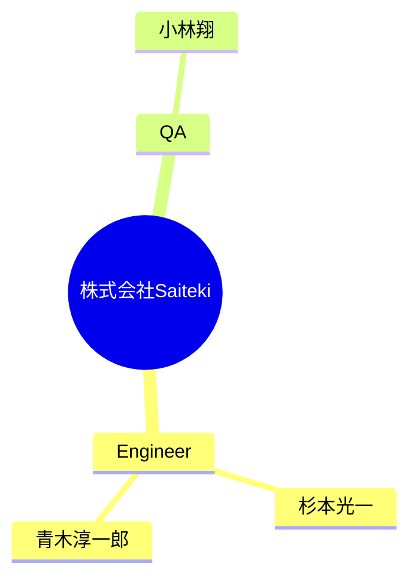

# チーム構成図

自動生成された組織図です。Issueによる更新が反映されます。

## 詳細リスト

| 名前 | 職種 | 好きな技術 | 嫌いな技術 | 次のゴール (SMART) |
| --- | --- | --- | --- | --- |
| 杉本光一 | Engineer | React, Typescript, CSS, RAG | jQuery, | **S:** 知識グラフを利用してなにか開発を行いたい / **M:** 実際に知識グラフが必要なプロダクトの案から考え、実装構築する / **A:** 知識グラフに関する書籍を読みながら、なにが良いのかを考え実装する / **R:** AIに関する資料作りをしているので、それへの反映ができそう / **T:** 2026年4月までにプロトタイプ開発 |
| 青木淳一郎 | Engineer | - | - | - |
| 小林翔 | QA | - | - | - |
