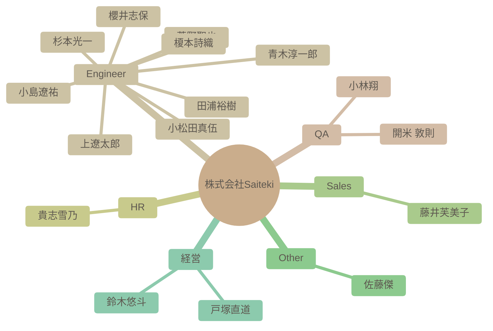

# チーム構成図

自動生成された組織図です。IssueおよびSlack連携による高度なAI分析結果が反映されます。

### 📊 関連リソース
- [🌐 インタラクティブ・ナレッジグラフ (Web版)](https://saitekiinc-com.github.io/saiteki-employee-management/)
- [📝 ナレッジグラフ分析レポート (Markdown)](./KNOWLEDGE_GRAPH.md)

### 組織マップ

## 社員一覧サマリー

| 名前 | 職種 | 性格傾向 (概略) | 現在の状態 |
| --- | --- | --- | --- |
| [杉本光一](#%E6%9D%89%E6%9C%AC%E5%85%89%E4%B8%80) | Engineer | 技術への飽くなき探求心と実践的な応用力、そしてチームへの貢献意欲が一貫して高いです。新しい知識の共有と後進の育成に熱心で、常に丁寧で協調的なコミュニケーションを心がけています。 | 直近では、「AI x 知識グラフ」というRAGの課題を解決しうる最先端技術に深く没頭し、その可能性をチームに積極的に共有している。同時に、カスタムAIモデルの評価基盤の整備やナレッジ共有の仕組み化を推進し、若手メンバーの育成にも具体的なタスクを通じて尽力している。プライベートでは、共有されたチョコレートを家族と楽しむなど、引き続きワークライフバランスを重視する姿勢が見られる。 |
| [青木淳一郎](#%E9%9D%92%E6%9C%A8%E6%B7%B3%E4%B8%80%E9%83%8E) | Engineer | 協調性が非常に高く、新しい知識や経験に対し前向きに挑戦する。社交的で周囲との交流を深め、高い責任感を持って業務に取り組む楽観的な性格。 | 年末年始を通してSaitekiメンバーとの出会いに深く感謝し、2026年を「飛躍の年」と意気込んでいる。12月上旬には業務負荷が高い様子が伺えたが、それを乗り越え、現在は非常に前向きな精神状態にある。 |
| [小林翔](#%E5%B0%8F%E6%9E%97%E7%BF%94) | QA | 開放性と協調性が特に高く、新しい経験や人との交流を楽しみ、チームワークを重視する傾向がある。責任感も強く、ポジティブな姿勢を保ちながら、自身の経験や関心を積極的に共有する。 | 12月から1月にかけての入社を控えている、または入社初期段階であり、非常に前向きで期待に満ちた状態。積極的に自己開示し、様々な趣味や経験を通じて周囲との共通点を見つけることで、良好な人間関係を築こうと行動している。業務に関する確認にもスムーズに対応しており、既にチームの一員として貢献しようとする姿勢が見える。 |
| [櫻井志保](#%E6%AB%BB%E4%BA%95%E5%BF%97%E4%BF%9D) | Engineer | 自己認識が高く、協調性があり、学習意欲も高い。新しい環境への適応力も期待でき、謙虚で丁寧な印象を与えます。 | 1月からの入社を控えており、新しい環境に対する高い期待感と意欲に満ち溢れています。自身のスキルを活かしつつ、さらなる専門性向上とチームへの貢献を目指しています。 |
| [田浦裕樹](#%E7%94%B0%E6%B5%A6%E8%A3%95%E6%A8%B9) | Engineer | 非常に協調性が高く、誠実で、周囲への配慮を忘れない。新しい知識や経験への探求心が旺盛で、ユーモアを交えながら積極的に他者と関わる。グルメへの関心も高い。 | 複数のPoC立ち上げフェーズや商談・提案資料作成に注力しており、クライアントとの要件定義や認識合わせに尽力している。同時に、社内での知識共有や新しいメンバーの歓迎にも積極的に関わっている。荒天による急なテレワークにも柔軟に対応しつつ、プライベートではロイズの生チョコやアイラウイスキーを楽しむなど、多忙ながらも充実した日々を送っている。 |
| [開米 敦則](#%E9%96%8B%E7%B1%B3%20%E6%95%A6%E5%89%87) | QA | 協調性が高く学習意欲が旺盛で、多岐にわたる趣味を持つ。新しい環境にも積極的に適応し、責任感を持って業務に取り組む。技術的な課題にも冷静かつ積極的に対応する。 | 入社直後であり、新しい職場環境への適応に非常に前向きに取り組んでいる。特にQAにおけるAI活用に強く意欲的で、具体的なツール選定やプロンプトの最適化、人とAIの協働を検討中。チームへの貢献意識も高く、情報共有や意見交換を積極的に図りながら、自律的に業務を進めている。 |
| [貴志雪乃](#%E8%B2%B4%E5%BF%97%E9%9B%AA%E4%B9%83) | HR | 組織への貢献意欲と周囲への配慮が非常に高く、自ら行動して周囲を巻き込む力に長けています。新しい知識や経験への探求心も旺盛で、感情表現も健全かつバランスが取れています。特に他者の貢献に対する感謝と称賛を具体的に表現します。 | 直近のログ（2月上旬）でも、勉強会のアーカイブ公開とレポート作成・共有、外部の専門知識（生成AIレポート、経営者対談）のキュレーションと社内共有、そして新入社員のオンボーディングと歓迎と、非常に多岐にわたる活動を精力的に推進しており、極めて意欲的でポジティブな状態にある。特に、学習コンテンツの品質向上と協力者への感謝表明が際立っている。 |
| [上遼太郎](#%E4%B8%8A%E9%81%BC%E5%A4%AA%E9%83%8E) | Engineer | 新しい知識や経験への関心が深く、他者から学ぶ姿勢が顕著です。責任感が強く、業務を丁寧かつ着実に進めることを重視。周囲への配慮を忘れず、社交的な態度で積極的に交流を図ります。 | 非常に高い意欲を持って業務に取り組んでおり、自身の成長に貪欲です。業務負荷は適切に管理され、迅速かつ柔軟に対応できる状態にあります。丁寧で確実な仕事ぶりを心がけ、周囲との協調を重視しています。 |
| [小松田真伍](#%E5%B0%8F%E6%9D%BE%E7%94%B0%E7%9C%9F%E4%BC%8D) | Engineer | 新しい技術や知識の習得に極めて積極的で、それを組織に還元しようとする意識が非常に高い。協調性を重んじ、周囲とのコミュニケーションも円滑に行う。自身の経験に基づいた問題意識を持ち、それを解決するための行動を厭わない。特に、社会や組織全体をより良くしようとする貢献意欲が顕著。 | ナレッジ蓄積とAI技術の活用に関する複数の検証（RAGと知識グラフの比較、カスタムアプリによるPoC開発）を積極的に推進しており、SIer業界の変革という長期的な目標にも強いコミットメントを示している。自身の提案に対してフィードバックがあれば、すぐに改善策を検討し実行に移す柔軟性と迅速性も兼ね備えている。 |
| [小島遼祐](#%E5%B0%8F%E5%B3%B6%E9%81%BC%E7%A5%90) | Engineer | 新しい知識や経験に対する強い好奇心と探求心を持ち、周囲の意見を尊重し、積極的に関係を深めようとする。責任感も強く、常に前向きな姿勢を保つ。 | 新しい職場環境への適応に非常に意欲的で、持ち前の社交性と学習意欲を最大限に活かし、周囲との良好な関係を積極的に築いている。具体的な業務貢献目標を持ち、前向きな姿勢で取り組む準備が整っている。 |
| [藤井芙美子](#%E8%97%A4%E4%BA%95%E8%8A%99%E7%BE%8E%E5%AD%90) | Sales | 共感力が高く親しみやすい人柄で、探求心、責任感、そして自ら積極的に行動する推進力を持つ。周囲への配慮を忘れず、困難な状況にも冷静に対応する。 | 2月に入社したばかりで、新しい総務の役割と環境に非常に前向きに適応しようとしている。持ち前の社交性を活かし、部署内外の同僚とのコミュニケーションを積極的に楽しんでいる様子が伺える。業務への習熟と並行して、人間関係の構築にも注力している段階。 |
| [菅野聖也](#%E8%8F%85%E9%87%8E%E8%81%96%E4%B9%9F) | Engineer | 新しい技術や知識の吸収に意欲的で、協調性と社交性を持ち合わせる。自身の強みをユーモアを交えて表現し、感情も安定している。 | 入社直後で、開発者としての復帰とチームとの協働に非常に前向きである。AI技術への関心は非常に高く、読書を通じて多様な知識を吸収し、それを業務やコミュニケーションに活かそうとしている。人との交流も積極的に楽しみ、新しい環境での活躍を強く望んでいる。 |
| [佐藤傑](#%E4%BD%90%E8%97%A4%E5%82%91) | Other | 非常に開放的で誠実、外向的で協調性も高い。常に前向きで、新しい挑戦や学びを楽しみ、実践と情報共有を通じて貢献しようとする探求心と行動力を兼ね備えている。 | 海外での活動を継続しており、現在はUAEに滞在し、その後ASEAN中台韓を巡り、来年には帰国予定。国際的なチーム開発やハッカソンに積極的に参加し、最新のAI技術（特に小型高性能AIモデルのMac環境での実用性）に高い関心を持ち、M4 MaxでのGPTsossの動作を検証・共有するなど、その情報共有を通じて実践的な活用を模索している。質問歓迎の姿勢で、コミュニティへの貢献も意識している。 |
| [鈴木悠斗](#%E9%88%B4%E6%9C%A8%E6%82%A0%E6%96%97) | 経営 | 社交的で協調性が高く、強い責任感と好奇心を持つ。新しい知識や技術の習得に積極的で、ポジティブかつ安定した精神状態を保ちながら周囲を巻き込む力がある。 | COOとして組織のリスク管理、社員の健康と快適な労働環境の促進に深くコミットしており、高い責任感を持って業務に取り組んでいる。最新の技術トレンド、特に生成AIへの関心が非常に高く、日常的に活用している。メンバーの貢献を具体的に評価し、自身の趣味や嗜好も共有することで、良好な人間関係を築いている。 |
| [戸塚直道](#%E6%88%B8%E5%A1%9A%E7%9B%B4%E9%81%93) | 経営 | 非常に外向的で協調性が高く、誠実かつ開放的な人物。組織の成長とメンバーの成功に深くコミットし、困難な状況にも持ち前のユーモアと前向きさで対処する。特にAIとSIerの未来に対する深い洞察と、それを自身の事業に落とし込む粘り強さが顕著。 | AI技術の進化とそのビジネスへの応用、SIer業界の変革に関する議論が非常に活発。採用も継続的に成功し、組織が拡大している。メンバーの学習支援とコミュニケーションを重視する姿勢が明確。業務への没頭度合いが高く、多忙ながらも前向きに事業を推進している。 |
| [榎本詩織](#%E6%A6%8E%E6%9C%AC%E8%A9%A9%E7%B9%94) | Engineer | 非常に開放的で協調性があり、新しい知識や経験を積極的に取り入れようとする。親しみやすく、ユーモアのセンスも持ち合わせながら、自己を客観視できるバランスの取れた性格。 | 6月～7月の入社を間近に控え、期待と意欲に満ち溢れている。積極的にコミュニケーションを取り、周囲との関係構築に努めており、社内での新しい経験と学習を楽しみにしている。 |

---

## 詳細プロフィール

各社員の詳細な分析結果です。クリックして展開できます。

### 杉本光一 (Engineer)

> **総合サマリー**: 杉本さんは、AI技術の中でも特に「知識グラフ」に深く没頭し、RAGの課題を補完する新たなアプローチを模索する技術探求心の持ち主です。ナレッジ共有と若手メンバーの育成にも精力的に取り組み、技術と人の成長双方に貢献する協調性溢れるエンジニアです。

<b>🛠 性格傾向</b>

**要約**: 技術への飽くなき探求心と実践的な応用力、そしてチームへの貢献意欲が一貫して高いです。新しい知識の共有と後進の育成に熱心で、常に丁寧で協調的なコミュニケーションを心がけています。

| 項目 | スコア | 根拠・エピソード |
| --- | --- | --- |
| 開放性 | 9/10 | RAGのベクトル検索の限界（文脈・複雑な関係性の理解不足）を認識し、「AI x 知識グラフ」という新たな技術領域に「熱い」関心を示す。知識グラフがAIの回答精度を飛躍的に向上させる可能性を具体例を交えて説明し、その活用幅に可能性を感じている。ローカルAIでの推論処理やM4MAX、MacStudioといった新しい技術や環境にも強い興味を示す。 |
| 誠実性 | 9/10 | カスタムチューニングモデルの回答比較ツールについて、具体的な確認方法を明確に指示し、情報が溜まり次第ジュニアメンバーへの共有と実践を計画するなど、計画性と指導力を持つ。ナレッジDBの投稿ハードルを低くするための改善案（軽いメモでも可）を提案するなど、運用の最適化にも気を配る。AI活用のノウハウ動画作成のため、若手メンバーに設計や実装で気づいたことのメモを依頼し、その情報を活用しようとする。 |
| 外向性 | 9/10 | 新しいメンバーへ「はじめまして、エンジニアの杉本です」と積極的に挨拶し、自身の出身地、居住地、趣味（翔んで埼玉）や読書体験（「承認が人を動かす」）を共有して会話のきっかけを作る。メンバーに勧められたチョコレートを家族と楽しんだ様子を共有するなど、プライベートな話題もオープンにする。ハドルでの直接会話を提案するなど、対面でのコミュニケーションも厭わない。 |
| 協調性 | 9/10 | 他者の意見（「あいまいさの軸良いですね」「あってる:+1:」）を積極的に肯定し、学びを得ていることを伝える（「知らないこと多くて勉強になりますー！」）。ミーティングのリスケを提案する際も、メンバーの「別作業」や「スキルアップのための作業」を理由に挙げるなど、きめ細やかな配慮を示す。相手が書籍を購入したことに対して「はやい:驚き:」とポジティブな反応を示し、自身も購入を決め感謝を伝える。 |
| 神経症的傾向 | 3/10 | AIの発展に伴うサイバー攻撃のリスク増大について冷静に言及し、セキュリティ意識の重要性を再確認する。業務遂行において、感情的になることなく論理的かつ建設的な姿勢を保っている。 |

<b>💪 仕事スタイルと強み</b>

**要約**: AI技術の深い知見と戦略的思考に基づき、RAGの限界を克服する「知識グラフ」の可能性を探求。組織全体のナレッジ共有とAI活用の効率化を推進し、若手メンバーの育成にも具体的なアクションで貢献するリーダーシップを発揮します。

**問題解決スタイル**: RAGのベクトル検索が持つ「文脈」や「複雑な関係性」の理解不足という本質的な課題を特定し、AIに「知識グラフ」を前提知識として与えることで、回答精度と信頼性を向上させるという革新的な解決策を提案する。単一技術に固執せず、複数のアプローチ（RAGと知識グラフの組み合わせ）を統合して最適解を追求する。

**主要な強み**: AI技術の深い知見と実践的な応用力, 戦略的思考による本質的な課題解決（RAGと知識グラフ）, 情報共有とナレッジマネジメントの推進, 丁寧で建設的なコミュニケーションと指導力, 後進の育成への貢献, セキュリティへの高い意識

**証拠エピソード**:
- AIと知識グラフの組み合わせがRAGの弱点を補い、回答精度を向上させる可能性を具体例（A案件の遅延理由）を交えて説明する。
- カスタムチューニングモデルの回答品質評価のための具体的な手順を作成し、情報が溜まり次第ジュニアメンバー（田浦さんや遼太郎くん）への共有と実践を計画する。
- AI活用のノウハウ動画化に向け、若手メンバーに設計や実装で気づいたこと（課題、ツール（Cursor）の使いやすさ/使いづらさなど）のメモを依頼し、育成につなげようとする。
- 「AIが発展している今、サイバー攻撃も容易になってきていて、甘いプロダクトはつくれないなぁと思うしね！」と、AI開発におけるセキュリティの重要性を再確認する発言をしている。
- ナレッジDBの投稿ハードルを低くするため、外部学習情報や感じたことをメモ程度で登録するアイデアを提案する。

<b>💎 価値観とモチベーター</b>

**要約**: 最新AI技術への飽くなき探求心と、それが組織やチームの根本的な課題解決、ひいてはメンバーの成長に繋がることに大きな喜びを感じます。自身の学びを惜しみなく共有し、チーム全体の知見向上と生産性向上に貢献することを重視しています。

**コアバリュー**: 技術革新と探求 (特にAI x 知識グラフ), 組織・チームへの貢献 (ナレッジ共有、セキュリティ), 後進の育成とスキルアップ支援, 自己成長と学習の継続, チームワークと協調性, 信頼性の高いシステム開発

**モチベーショントリガー**: 新しい技術の深い理解と、それが根本的な課題解決に繋がること, 自身の知識や経験がチームのナレッジ蓄積やメンバーの成長に貢献すること, メンバーとの活発な情報交換を通じて新たな学びを得ること, チームや組織の生産性や信頼性が向上すること

**証拠エピソード**:
- 「AI x 知識グラフ」が自分のなかで「熱い」と表現し、RAGの課題解決に繋がる新たな可能性に強い探求心と期待を抱いている。
- 「承認 (アクノレッジ) 」が人を動かすという本を読んだことを共有し、チームビルディングへの意識の高さと自己成長の意欲を見せる。
- 若手メンバーの「スキルアップのための作業があると思います」を理由にリスケを提案するなど、他者の成長を支援する姿勢を示す。
- 「カスタマイズappのほうは共有目的や運用なんかのコスト面的には、github actionsのワークフローが結構使いやすかったりもしますよ！」と自身の経験に基づく知見を惜しみなく共有する。

<b>📈 現在の状態</b>

**要約**: 直近では、「AI x 知識グラフ」というRAGの課題を解決しうる最先端技術に深く没頭し、その可能性をチームに積極的に共有している。同時に、カスタムAIモデルの評価基盤の整備やナレッジ共有の仕組み化を推進し、若手メンバーの育成にも具体的なタスクを通じて尽力している。プライベートでは、共有されたチョコレートを家族と楽しむなど、引き続きワークライフバランスを重視する姿勢が見られる。

- **感情レベル**: positive
- **業務負荷状況**: AI x 知識グラフの探求、カスタムチューニングモデルの評価システム設計と運用計画、ナレッジDBの運用検討、若手メンバーへの具体的な指導とタスク付与など、多角的なプロジェクトに深く関与しており、責任感を持って多くの業務を推進している。チームメンバーの状況にも常に配慮し、調整役も果たしている。
- **最近の関心トピック**: AI x 知識グラフ, RAGの限界と克服アプローチ, ローカルAIでの推論処理の可能性, ナレッジDBの運用と投稿ハードルの低減, カスタムAIモデルの評価方法と若手メンバーへの共有, AI開発におけるサイバーセキュリティの重要性

---

### 青木淳一郎 (Engineer)

> **総合サマリー**: AWS基盤の専門性を持ち、未経験技術の習得にも意欲的。福岡在住で家族を大切にし、高い責任感と協調性でSaitekiへの貢献とメンバーとの交流を積極的に図る人物。

<b>🛠 性格傾向</b>

**要約**: 協調性が非常に高く、新しい知識や経験に対し前向きに挑戦する。社交的で周囲との交流を深め、高い責任感を持って業務に取り組む楽観的な性格。

| 項目 | スコア | 根拠・エピソード |
| --- | --- | --- |
| 開放性 | 8/10 | AWS基盤の経験がある中で、AzureやGoogle Cloud、AIといったクラウド技術への強い関心を示す。未経験のBIツールに苦戦しながらも、それをスキルの幅を広げるチャンスと捉え、前向きに知識と経験の習得に努めている。 |
| 誠実性 | 7/10 | 業務の納期を最優先し、興味のある社内イベントであっても納品が近いことを理由に参加を見送る判断をするなど、強い責任感を持つ。未経験のBIツールでの苦労も、粘り強く習得に努める機会と捉えている。 |
| 外向性 | 8/10 | 入社時に詳細な自己紹介を行い、共通の趣味（Youtube、パパ）を持つメンバーには積極的に交流を呼びかけ「パパ会」を提案。地域を越えた「西日本勢」の盛り上げにも意欲を見せるなど、社内でのコミュニケーションや親睦を重視する姿勢が強い。 |
| 協調性 | 9/10 | メンバーの投稿に対し共感や感謝を積極的に示し、共通点を見つけて親睦を深めようとする。他者のnoteを読み感動を伝えるなど、周囲の人々の気持ちや経験を尊重し、良好な関係性を築くことに非常に長けている。 |
| 神経症的傾向 | 3/10 | ネガティブな感情の表出は非常に少なく、近所のサル出没に驚きと恐怖を感じたという発言程度。未経験のBIツールでの苦戦や多忙な業務状況下でも、常に前向きな姿勢を保ち、状況を好転させる機会と捉える傾向がある。 |

<b>💪 仕事スタイルと強み</b>

**要約**: AWS基盤のインフラ設計・構築に高い専門性を持ちつつ、未経験技術への学習意欲が極めて高い。責任感が強く、チームワークと自己成長を重視して業務に取り組む。

**問題解決スタイル**: 未経験の技術や困難に直面しても、それをスキルアップの好機と捉え、前向きな姿勢で学びと経験を積み重ね、解決策を模索する。

**主要な強み**: インフラ設計・構築スキル, 学習意欲, コミュニケーション能力, 責任感

**証拠エピソード**:
- 入社時の自己紹介でAWS基盤のインフラ設計・構築に携わってきたことを明確に述べている。
- Azure、Google Cloud、AIへの関心や、未経験のBIツール（QuickSuite）に苦戦しつつも「スキルの幅を広げるチャンス」と捉え積極的に取り組む姿勢を見せている。
- 興味のある社内イベントであっても、納品が近いことを理由に不参加を表明し、業務を最優先する強い責任感を見せている。
- 「Saitekiの輪をどんどん広げていけたら」と発言し、オンラインでの積極的なコミュニケーションや「パパ会」の提案を通じてメンバーとの関係構築に努めている。

<b>💎 価値観とモチベーター</b>

**要約**: 家族との時間を大切にし、仕事では新しい技術の習得と自己成長を追求。組織への貢献意欲とSaitekiの一員であることへの誇り、メンバーとの交流を非常に重視している。

**コアバリュー**: 家族, 成長, 貢献, 責任

**モチベーショントリガー**: 新しい技術の習得, チームへの貢献, 自己成長, 人との交流

**証拠エピソード**:
- 自己紹介で「家族とドライブに行ったり、子どもと遊んだり、妻をガチャガチャ屋さんに連れて行ったり」と休日の過ごし方を共有し、家族との時間を大切にしている様子が伺える。
- AWS以外のAzure、Google Cloud、AIといった技術への学習意欲や、未経験のBIツールでの苦戦も「スキルの幅を広げるチャンス」と捉え、知識と経験を得ることに意欲的である。
- 入社時に「Saitekiの輪をどんどん広げていけたら」と組織への貢献意欲を示し、年末には2025年を「最高の年」と振り返り、2026年を「さらに飛躍の年にしていきましょう！」と語るなど、強い責任感と組織への帰属意識が見られる。
- オンラインでのコミュニケーションを重視し、「パパ会」や「西日本勢盛り上げていきましょー」とメンバー間の交流を積極的に促進しようとしている。
- 他者のnoteを読んで「グッときました！」と感動を伝え、メンバーの入社経緯への関心を示している。

<b>📈 現在の状態</b>

**要約**: 年末年始を通してSaitekiメンバーとの出会いに深く感謝し、2026年を「飛躍の年」と意気込んでいる。12月上旬には業務負荷が高い様子が伺えたが、それを乗り越え、現在は非常に前向きな精神状態にある。

- **感情レベル**: positive
- **業務負荷状況**: 12月上旬には納品が近く、帰りが遅くなるほどの業務負荷があったが、それを乗り越え、年末年始は達成感と来年への意欲を見せている。
- **最近の関心トピック**: Saitekiメンバーの入社経緯, 京都旅行, 2025年の振り返りと2026年への期待, BIツールの知識習得

---

### 小林翔 (QA)

> **総合サマリー**: 協調性が高く、新しい環境への適応能力に優れる人物。多岐にわたる趣味と豊富な経験を持ち、周囲との積極的な交流を通じて、共に成長することを重視する。詳細な情報共有も得意とする。

<b>🛠 性格傾向</b>

**要約**: 開放性と協調性が特に高く、新しい経験や人との交流を楽しみ、チームワークを重視する傾向がある。責任感も強く、ポジティブな姿勢を保ちながら、自身の経験や関心を積極的に共有する。

| 項目 | スコア | 根拠・エピソード |
| --- | --- | --- |
| 開放性 | 9/10 | 旅行での名物探索、神社仏閣巡り、アニメの舞台巡り、そしてローグライクゲームへの深い熱中（プレイ時間100時間超えもしばしば）から、新しい経験や知識への強い探求心、好奇心、多様な興味関心がうかがえる。他者の紹介したゲーム（Balatro）に共感し、自身のプレイ経験（Slay the Spire）や最近気になるゲーム（CloverPit）を共有するなど、新しい情報への高い関心と既存の知識を積極的に結びつける。また、小樽の「ニシンの塩焼き」の情報に感謝し、食べに行きたいと興味を示している。 |
| 誠実性 | 7/10 | 前職で13年間のテスターおよび進行管理の経験があることから、責任感、計画性、細部への注意深さを持ち合わせていると考えられる。メダルゲームの大当たり状況を詳細かつ具体的に説明できる点も、観察力や記憶力の高さを伺わせる。また、業務に関する確認に対し「個人的には問題ないと思っています」と明確に意思表示する。 |
| 外向性 | 8/10 | 自己紹介で年齢の近い人が多いことに触れ、親睦を深めたい意欲を明確に示している。ゲーム部創設への積極的な参加意欲や、「ぜひお声掛けください！」といった能動的な発言が見られる。他者の話題に共感し自身の経験を交えて会話を広げ、共通の関心を持つ人には「歳も好みも近いのいいですね…！」と積極的に交流を歓迎する姿勢から、他人との交流を非常に好む傾向が強く見られる。 |
| 協調性 | 9/10 | 丁寧な自己紹介と、他者の趣味や好みに積極的に共感する発言（メダルゲーム、Balatro、北海道グルメ、ニシンの塩焼きへの反応）から、協調性が高く、周囲との調和を大切にする。ゲーム部創設への参加意欲や「一緒に成長できたら嬉しい」という言葉も、集団への貢献意欲と友好的な姿勢を示している。複数の相手に「よろしくお願いします！」と挨拶を欠かさない点も、円滑な人間関係構築への配慮が伺える。 |
| 神経症的傾向 | 3/10 | 全体的にポジティブで友好的な発言が多く、ネガティブな感情を露わにすることは少ない。「なかなか大変でした(笑)」といった表現も、ユーモアを交えたポジティブな自己開示であり、困難な状況を楽しんで乗り越える姿勢が見える。 |

<b>💪 仕事スタイルと強み</b>

**要約**: 長年のテスター経験に裏打ちされた問題発見能力と、高いコミュニケーション能力が強み。新しい情報や知識の吸収にも積極的で、協調性を持ちながら業務に取り組む。状況把握と情報共有に長ける。

**問題解決スタイル**: 13年間のテスター経験を通じて培われた、細部に目を配り潜在的な問題点を見つけ出す能力を持つ。過去の経験や知識を活用し、論理的に課題を整理する傾向がある。

**主要な強み**: テスト・品質管理経験, コミュニケーション能力, 情報収集力, 状況説明能力, 協調性

**証拠エピソード**:
- 13年間のテスターおよび進行管理の経験から、プロジェクトの品質向上や効率的な進行に貢献できる。
- メダルゲームでの大当たり体験を詳細かつ具体的に説明する能力は、状況把握力と情報伝達能力の高さを示唆する。
- 他の社員の話題（ゲーム、グルメ）に積極的に共感し、関連する自身の経験や関心事を話すことで、円滑なコミュニケーションを促進する。
- 小樽のグルメ情報に対して感謝を示し、積極的に情報を取り入れようとする姿勢が見られる。
- 業務に関する確認事項に対し「個人的には問題ないと思っています」と明確に意思表示できる。

<b>💎 価値観とモチベーター</b>

**要約**: 成長、繋がり、楽しさ、そして経験を重視する。新しい知識やスキルの習得、他人との良好な関係構築、そして充実した楽しい経験がモチベーションの源泉となる。

**コアバリュー**: 成長, 協調, 楽しさ, 探求, 繋がり

**モチベーショントリガー**: 新しい知識やスキルの習得, チームへの貢献と協業, 楽しい経験や趣味の追求, 共通の興味を持つ人々との交流, 興味を持ったことの詳細な情報共有

**証拠エピソード**:
- 自己紹介で「仲良くしながら一緒に成長できたら嬉しい」と述べており、自己成長と他者との協調を重視している。
- ゲーム部創設に対して「ぜひお声掛けください！」と積極的に参加意欲を示しており、チームやコミュニティへの貢献、楽しい活動への参加に意欲的である。
- メダルゲームやローグライクゲームへの深い熱中、旅行での多様な体験への意欲から、楽しい経験や趣味が大きなモチベーションとなっている。
- 他者と趣味や好みが近いことを喜び、「歳も好みも近いのいいですね…！」と発言し、人との繋がりを大切にする。

<b>📈 現在の状態</b>

**要約**: 12月から1月にかけての入社を控えている、または入社初期段階であり、非常に前向きで期待に満ちた状態。積極的に自己開示し、様々な趣味や経験を通じて周囲との共通点を見つけることで、良好な人間関係を築こうと行動している。業務に関する確認にもスムーズに対応しており、既にチームの一員として貢献しようとする姿勢が見える。

- **感情レベル**: positive
- **業務負荷状況**: 入社直前〜入社初期段階であり、業務負荷はまだ限定的だが、一部業務に関する確認にもスムーズに対応している。
- **最近の関心トピック**: ゲーム（メダルゲーム、Balatro, Slay the Spire, CloverPit）, 旅行（特に北海道グルメ、ニシンの塩焼き、神社仏閣、アニメ舞台）, 海鮮料理, 新しい職場の人間関係, ゲーム部創設

---

### 櫻井志保 (Engineer)

> **総合サマリー**: 櫻井志保さんは、データ分析スキルと高い学習意欲を持ち、協調性をもってチームに貢献しようと意欲的な人物です。

<b>🛠 性格傾向</b>

**要約**: 自己認識が高く、協調性があり、学習意欲も高い。新しい環境への適応力も期待でき、謙虚で丁寧な印象を与えます。

| 項目 | スコア | 根拠・エピソード |
| --- | --- | --- |
| 開放性 | 8/10 | Power BIを用いたデータ分析・加工の経験があり、資格取得を目指しデータベース構築といったより専門的な分野への挑戦意欲を明確に示しています。 |
| 誠実性 | 7/10 | 自己紹介で自身の業務経験、スキル、今後の展望を詳細かつ明確に記述しており、責任感と計画性が伺えます。趣味を通じて業務のリフレッシュを図る自己管理能力も持ち合わせています。 |
| 外向性 | 6/10 | 「Slack等を通じて積極的にコミュニケーションを取っていければ」と、自ら進んで他者との交流を求める姿勢が見られます。ただし、直接会う機会が少ないことへの言及もあり、バランスの取れた交流を好むと推測されます。 |
| 協調性 | 9/10 | 「今後ともよろしくお願いいたします」「まだまだ至らない点も多いかと思いますが、何卒よろしくお願いいたします」といった謙虚で丁寧な言葉遣いから、協調性や相手への配慮が強く感じられます。 |
| 神経症的傾向 | 3/10 | 自己紹介の内容全体から、新しい環境への期待感と前向きな姿勢が感じられ、不安や心配を示唆する要素は見当たりません。 |

<b>💪 仕事スタイルと強み</b>

**要約**: データに基づいた分析力と高い学習意欲を持ち、自ら専門性を深めようと努力します。チームでのコミュニケーションを重視し、協調的に仕事を進めるタイプです。

**問題解決スタイル**: データ分析スキルを活かし、論理的な思考で現状を把握し問題解決に取り組むアプローチを取ります。

**主要な強み**: データ分析, 学習意欲, コミュニケーション

**証拠エピソード**:
- Power BIを用いたデータ分析・加工の経験があると述べています。
- 資格取得を目指し、データベース構築などより専門的な分野への挑戦を考えていると表明しています。
- Slack等を通じて積極的にコミュニケーションを取りたいと意欲を示しています。

<b>💎 価値観とモチベーター</b>

**要約**: 自身の成長と専門性向上を重視し、新しい知識やスキルを習得することに喜びを感じる人物です。チームワークを大切にし、周囲との良好な関係を築きながら貢献することにモチベーションを感じます。

**コアバリュー**: 成長, 貢献, 協調性, 専門性

**モチベーショントリガー**: 新しい知識やスキルの習得, 専門性の向上, チームへの貢献, 自己管理を通じたパフォーマンス維持

**証拠エピソード**:
- 資格取得やデータベース構築といった専門分野への挑戦意欲を表明しています。
- Slack等を通じて積極的にコミュニケーションを取りたいと述べています。
- 趣味をリフレッシュに活用し、業務パフォーマンス維持に努めていることを示唆しています。

<b>📈 現在の状態</b>

**要約**: 1月からの入社を控えており、新しい環境に対する高い期待感と意欲に満ち溢れています。自身のスキルを活かしつつ、さらなる専門性向上とチームへの貢献を目指しています。

- **感情レベル**: positive
- **業務負荷状況**: 新規入社予定のため、現在の業務負荷は不明ですが、趣味をリフレッシュに活用していることから自己管理ができていると推測されます。
- **最近の関心トピック**: データ分析, データベース構築, 資格取得, Slackを通じたコミュニケーション

---

### 田浦裕樹 (Engineer)

> **総合サマリー**: 豊富な経験と卓越した技術力を持ち、顧客への安心提供と社内知識共有に情熱を注ぐエンジニア。論理的思考と温かい人間性を兼ね備え、協調性とグルメを含む豊かな私生活を大切にする。

<b>🛠 性格傾向</b>

**要約**: 非常に協調性が高く、誠実で、周囲への配慮を忘れない。新しい知識や経験への探求心が旺盛で、ユーモアを交えながら積極的に他者と関わる。グルメへの関心も高い。

| 項目 | スコア | 根拠・エピソード |
| --- | --- | --- |
| 開放性 | 10/10 | AI技術の学習に深くコミットし、自身でRAG構築を目標に高性能PCを導入。ゴッホ展を深く鑑賞し、原田マハの関連書籍を即座に購入するなど芸術への知的好奇心が非常に高い。長年の憧れだったチェロを始め、羊文学のライブには毎年参戦するほどの情熱を持つ。日本酒、ビール、ワインを好み、特に黒龍、作、酔鯨、浜福鶴といった銘柄を挙げる。ロイズの生チョコとアイラウイスキーの組み合わせを絶賛するなど、グルメへの探求心とこだわりも深い。 |
| 誠実性 | 9/10 | PoCの立ち上げフェーズでタスク分解、優先順位付け、計画策定を詳細に行い、進捗を具体的なポイントと共に共有する。AI駆動開発の標準化に向けたワークフローやガイドライン作成にも継続的に取り組む。家庭の事情（子供のインフルエンザ罹患や荒天による急遽テレワーク）が生じた際も、業務への影響を考慮し速やかに連絡を行い、柔軟に対応するなど、責任感と計画性が非常に高い。商談や提案資料作成にも意欲的に取り組む。 |
| 外向性 | 8/10 | 新メンバーには積極的に自己紹介し、自身のプライベートな情報（出身地、家族、趣味、グルメ情報、PC購入の経緯）をオープンに共有することで親近感を醸成する。絵文字を非常に多用し、勉強会では活発に発言や改善提案を行うなど、他者との交流を積極的に楽しむ。戸塚氏とのライブ参加を積極的に提案する他、社内レターや商談共有にも感謝を伝え、積極的にコメントを残すなど、関係構築にも意欲的。新しい同僚にお酒の好みや関西在住であることを共有し、共通点を探すことで距離を縮めようとする。 |
| 協調性 | 9/10 | 他者の意見を尊重し、感謝の意を頻繁に伝える。「素晴らしいレターをありがとうございました」「そう言って頂けてめっちゃ嬉しいです」「シェアありがとうございます」「お心遣いありがとうございます」といった感謝の言葉が多い。荒天時のメンバーの安否を気遣い、周囲への配慮や思いやりが非常に強い。顧客を安心させることを商談の最優先事項と捉え、具体的なヒアリングで実践する。勉強会へのフィードバックも、リモート参加者への配慮を含め建設的に行う。チームメンバーへの協力を惜しまない姿勢を示す。 |
| 神経症的傾向 | 3/10 | 子供の体調不良（インフルエンザ）や急なテレワークにも冷静かつ柔軟に対応し、業務を調整する。週例MTGへの参加可否も状況を考慮しつつ事前に連絡するなど、精神的な安定性とストレス耐性が高く、業務への影響を最小限に抑えようと努める。荒天でバスが運休し急遽テレワークになった際も、焦りを見せず業務に対応している。 |

<b>💪 仕事スタイルと強み</b>

**要約**: AI技術を活用した開発全般に強みを持ち、特に要件定義から実装までの開発プロセス全体への深い知見と標準化への貢献意欲が高い。アジャイルなプロジェクト推進と顧客視点での問題解決に長け、ビジネスモデルへの深い洞察力も持つ。最上流工程の重要性を認識し、レビューを通じて品質向上にも貢献する。

**問題解決スタイル**: PoCにおいては、最初に全てを決め切らず、仮説を立て、クライアントとの密なすり合わせを通じて要件や計画を段階的にアップデートしていくアジャイルなアプローチを重視する。問題解決に際しては、AIを積極的に活用し、自身の経験と組み合わせることで具体的なワークフローやガイドラインの標準化を目指す。飲食店の利益設計を分析する際にも、ビジネスモデルを構造的に分解し、技術開発のプロセスと関連付けて考察する。商談においては「お客様を安心させる」ことを最優先事項と捉え、的確なヒアリングで目的を明確にする。

**主要な強み**: 開発プロセス全体（要件定義〜実装）への深い知見と標準化への貢献, AI駆動開発の実践と知識共有（特に標準化・ガイドライン作成）, アジャイルなプロジェクト推進と問題解決（特にPoCの立ち上げと進捗管理）, 顧客視点での課題解決と安心感の提供, チーム立ち上げ・品質改善（レビューを通じた貢献）, ビジネスモデルへの深い洞察と分析力, システム開発最上流工程への深い理解と重視

**証拠エピソード**:
- PoCの進捗状況を詳細に共有し、仮説検証と段階的アップデートの重要性を解説することで、チーム全体のレベルアップに貢献しようとしている。
- IPAの要件定義ガイドラインやAIエージェントによる開発フローのテンプレートを共有し、開発プロセスの基礎知識やAI活用のベストプラクティスを惜しみなく共有する。
- ChatGPTを用いて飲食店の利益設計を分析し、そのビジネスモデルを技術開発のプロセスと関連付けて考察するなど、技術を実生活やビジネスに応用する高い洞察力と好奇心を持つ。
- 自身の経験から「お客様を安心させる」ことを商談の最優先事項と考え、具体的なヒアリングでの認識合わせを通じて実践していると発言。
- 勉強会への建設的なフィードバックを通じて、より質の高い学習機会を創出しようと働きかけ、QAと開発の連携に関する深掘り議論を提案する。
- AI駆動開発のスタンダード作りのため、作業ログテンプレートやワークフローのドキュメント化に積極的に取り組む。
- 「システム開発の最上流を知っていると、開発に取り組むときの視野が格段に広がると思います」と述べ、商談内容の社内共有を奨励。
- 「もう今は自分が書く時はリカバリーの時だけで、普段はレビューばかりですが…」と自身の役割がレビュー中心であることを示唆し、品質向上に貢献している様子がうかがえる。

<b>💎 価値観とモチベーター</b>

**要約**: Saitekiへの強い信頼とコミットメントを背景に、自身の豊富な経験と知識をチームや後進に惜しみなく共有することで、組織全体の成長と顧客の成功に貢献することに大きな価値を見出している。新技術への探求心も高く、家族との時間や芸術・文化的な趣味の充実も重視する。社内における情報共有と異なる専門性を持つメンバー間のシナジーを高く評価する。

**コアバリュー**: チームワーク, 継続的な学習と技術革新（特にAIの探求と標準化）, 顧客満足と貢献（特に顧客への安心感提供）, 誠実さ, 知識共有と後進育成, 家族, SaitekiのMVVへの共感, 多様な専門性を持つメンバー間のシナジー

**モチベーショントリガー**: チームメンバーからの感謝と成長の実感, 自身の知識共有がチームや後進の成長に貢献できたという実感, 新しい技術（特にAI）の習得と実践、そしてその標準化への挑戦, 顧客からの肯定的なフィードバックとプロジェクトの成功, SaitekiのMVVへの共感と貢献, 芸術や文化、グルメに触れること、家族との充実した時間, 社内の情報共有文化の促進

**証拠エピソード**:
- 「この人のために汗をかきたい」という強い想いからSaitekiへの参画を決めるなど、戸塚氏への信頼と会社への貢献意欲が非常に高い。
- 勉強会のフィードバックに「胸アツ」と反応し、自身の知識や経験がチームに貢献できたことを喜び、さらに共有を続けると表明している。
- 「僕の大事な役割だと自覚しているので、やっていきます！！」と、自身の経験値を社内にシェアすることへの強いコミットメントを示す。若手エンジニアには自身の若い頃のような悩みをさせたくないという思いも原動力。
- 子供の行事に参加したり、家族で旅行や外食を楽しんだりするなど、家族との時間を非常に大切にし、プライベートの充実も重視している。
- 長年の憧れだったチェロを始めたり、羊文学のライブに毎年参加したり、ゴッホ展を深く鑑賞したりと、自身の知的好奇心や芸術への情熱を追求する。
- 「商談の様子をどんどん社内に共有する取り組み、すごくありがたいですね」と発言し、情報共有を積極的に支持。
- 「ビジネス・営業の戦闘力は備えているボードメンバーと、技術のプロである皆さんが商談に出ていったら百人力だな、と！」「お客様側から見ても、心強いと思うんですよ。なのでこれからもどんどん頼って下さい」と述べ、異なる専門性を持つメンバー間の協業とシナジーを重視する姿勢を示す。

<b>📈 現在の状態</b>

**要約**: 複数のPoC立ち上げフェーズや商談・提案資料作成に注力しており、クライアントとの要件定義や認識合わせに尽力している。同時に、社内での知識共有や新しいメンバーの歓迎にも積極的に関わっている。荒天による急なテレワークにも柔軟に対応しつつ、プライベートではロイズの生チョコやアイラウイスキーを楽しむなど、多忙ながらも充実した日々を送っている。

- **感情レベル**: positive
- **業務負荷状況**: やや高め。複数のPoCや商談準備を並行して推進し、技術的な深掘りだけでなく、ビジネスサイドとの連携やチームへの情報共有といった多岐にわたる業務をこなしている。家庭の事情もありながら、効率的かつ柔軟に業務に対応しつつ、プライベートも充実させている。
- **最近の関心トピック**: PoC (Proof of Concept) の立ち上げと推進, 要件定義と開発プロセス標準化、AI駆動開発のワークフロー構築, AI駆動開発と技術応用、RAG、AI翻訳システム, 顧客との商談・クライアントワークにおける顧客安心の実現と営業・技術連携のシナジー, 社内での商談内容の知識共有と学習, 荒天時の交通機関への影響と急遽テレワーク, 音楽（特にチェロ、羊文学、2Cellos）, ゴッホ展と美術鑑賞, グルメ（ロイズの生チョコ、アイラウイスキー、日本酒、ピザ、サラミ、ウイスキー、チョコレート）, 高性能PC (RAG構築用), 新しいエンジニアメンバーの歓迎と自己紹介

---

### 開米 敦則 (QA)

> **総合サマリー**: 開米敦則氏は、QAエンジニアとしての豊富な経験とAI技術への深い探求心を持つ。多趣味で協調性が高く、新しい環境にも前向きに適応し、チームへの貢献と自己のスキルアップに意欲的に取り組む誠実な人物です。

<b>🛠 性格傾向</b>

**要約**: 協調性が高く学習意欲が旺盛で、多岐にわたる趣味を持つ。新しい環境にも積極的に適応し、責任感を持って業務に取り組む。技術的な課題にも冷静かつ積極的に対応する。

| 項目 | スコア | 根拠・エピソード |
| --- | --- | --- |
| 開放性 | 9/10 | 「AIを活用した新しいテストの形にもチャレンジしたい」と意欲を示し、社外セミナーへの積極的な参加や情報収集、社内展開を表明している。Google AI Proなどの新しいAIツールも積極的に試そうとする。ガンプラ、ペット飼育、城巡り、スポーツ観戦と非常に幅広い趣味を持つ。QA業界のAIはまだ定まっていないという認識のもと、新たな情報収集と展開に意欲的。 |
| 誠実性 | 9/10 | 「早くチームの一員としてお役に立てるよう、精一杯努めてまいります」と貢献意欲を示す。作業履歴ページを作成し、更新箇所を明示、さらにフィードバックを求めるなど、責任感と改善意欲が非常に高い。会議中の機材トラブル時も、状況を説明し、再接続を試み、謝罪するなど、真摯かつ迅速に対応する。MTGの時間調整にも自身の状況を伝えつつ柔軟に応じる。 |
| 外向性 | 6/10 | 詳細な自己紹介を自ら行い、趣味について語り、共通の話題を見つけて他のメンバーとの交流に意欲的。「お好きな方とぜひご一緒したいです！」「インコについてはお話大歓迎です！」と交流を促す。AIについても「ぜひ意見交換させていただきたいです！」と積極的に働きかける。他者のコメントには頻繁に感謝を伝える。 |
| 協調性 | 9/10 | 他のメンバーのコメントに対して頻繁に「ありがとうございます！」と感謝を伝える。同僚の体調不良の際には「お大事にしてください！！」と気遣う言葉を述べるなど、他者への配慮と共感性が高い。自身の作業履歴ページへのフィードバックも積極的に求めるなど、協調性を重視する。 |
| 神経症的傾向 | 4/10 | 会議でのミュート解除トラブル時、「なんで解除できないんですかね。。。」と戸惑いつつも、すぐに「すみません。繋ぎ直しても良いですか」「再起動します」と状況を説明し、解決策を試みる。土曜日のMTG時間調整も、自身の予定を伝えた上で調整に協力的であり、几帳面だが過度に心配性ではない。新しいツールも積極的に試そうとし、変化への抵抗は低い。 |

<b>💪 仕事スタイルと強み</b>

**要約**: QAエンジニアとしての深い経験を活かし、AI技術を積極的に業務に取り入れ、効率的かつプロセス全体を俯瞰した問題解決を目指す。情報共有にも熱心で、自律的にタスクを遂行し、常に改善の視点を持っている。

**問題解決スタイル**: AI技術の特性を深く理解し、各テストフェーズ（計画・設計、実行、管理・分析）に最適なツールを選定することで、効率的な問題解決を目指す。Chat GPTやGeminiでの経験からプロンプトのフォーマットの重要性を指摘するなど、仮説検証のアプローチを重視し、人とAIの役割分担を意識している。

**主要な強み**: QAエンジニアリングの専門知識と20年の経験, AI技術の知識と業務適用能力（特にテスト領域）, プロンプトエンジニアリングの理解と実践意欲, 情報共有とドキュメンテーション能力、改善提案, テスト自動化ツールの選定・比較検討とプロセスへの組み込み

**証拠エピソード**:
- 「AIを活用した新しいテストの形にもチャレンジしたい」と意欲を表明している。
- 複数のテスト自動化ツール（Autify, MagicPod, TFACT, Mabl, Cursor, TestScape, Testsigma, BrowserStack Test Management）について、選定基準を具体的に説明し、それぞれの特性を理解している。
- Chat GPTとGeminiを用いたテスト計画の経験から、プロンプトのフォーマットの重要性を指摘し、仮説検証のアプローチを取っている。
- テストフェーズ（上流、実行、管理・分析）ごとに最適なAIツールを具体的に組み合わせる提案をしている。
- 作業履歴ページを作成し、更新箇所を明確にすることで、関係者への情報共有と連携を円滑にし、さらにフィードバックを求めるなど改善意識が高い。

<b>💎 価値観とモチベーター</b>

**要約**: 新しい技術への挑戦、業務プロセスの効率化、チームへの貢献、そして自己のスキルアップに強いモチベーションを感じる。学習と協調性を重視し、オープンな意見交換を通じて成長しようとする。

**コアバリュー**: 効率性, 学習・成長, 貢献, 協調性, 探求心

**モチベーショントリガー**: 新しい技術への挑戦と実践、未知の領域の開拓, 業務効率の改善と最適なツール選定, チームへの貢献と協業、情報共有, 人との意見交換を通じたスキルアップと知識の深化

**証拠エピソード**:
- 自己紹介で「AIを活用した新しいテストの形にもチャレンジしていきたい」と語り、新しい技術への挑戦意欲を示す。
- 「社外セミナーにも積極的に参加し、情報収集し、社内にも展開していきたい」と、自己成長とチームへの貢献を両立させる意欲がある。
- 「色々な方と意見交換してさらにスキルアップしていきたいです」と、人との交流を通じた学習意欲を表明している。
- 「早くチームの一員としてお役に立てるよう、精一杯努めてまいります」と、チーム貢献への高い意識を示す。
- 「AIツールの選定は、プロセスのどこで使うのかで得意不得意が出てくると思います」と、効率を重視した技術選定の考え方を述べている。
- 自身の作業履歴ページについて「もう少しこうやって書いて欲しいなどFBがありましたら、ご指摘いただければ幸いです」と積極的に改善を求める姿勢。

<b>📈 現在の状態</b>

**要約**: 入社直後であり、新しい職場環境への適応に非常に前向きに取り組んでいる。特にQAにおけるAI活用に強く意欲的で、具体的なツール選定やプロンプトの最適化、人とAIの協働を検討中。チームへの貢献意識も高く、情報共有や意見交換を積極的に図りながら、自律的に業務を進めている。

- **感情レベル**: positive
- **業務負荷状況**: 標準的な業務負荷。自律的にタスクをこなし、情報共有のためのドキュメンテーション作成にも積極的。会議時間外での対応も柔軟に検討する姿勢が見られる。新しいツールの試用など、業務外での探求活動も行っている。
- **最近の関心トピック**: QAにおけるAIツールの選定と活用方法, プロンプトエンジニアリングの最適化とフォーマットの重要性, テスト自動化ツールの比較と適用フェーズ, 情報共有とドキュメンテーションの改善、フィードバックの取り入れ, 人とAIの具体的な作業領域の分担

---

### 貴志雪乃 (HR)

> **総合サマリー**: 貴志雪乃さんは、学習支援とコミュニティ形成を継続的に推進し、最新の知識共有、イベントの企画・詳細な実行、そして協力者への深い感謝表明を通じて組織貢献への高い意欲を示す、積極的で協調性に富んだ人物です。

<b>🛠 性格傾向</b>

**要約**: 組織への貢献意欲と周囲への配慮が非常に高く、自ら行動して周囲を巻き込む力に長けています。新しい知識や経験への探求心も旺盛で、感情表現も健全かつバランスが取れています。特に他者の貢献に対する感謝と称賛を具体的に表現します。

| 項目 | スコア | 根拠・エピソード |
| --- | --- | --- |
| 開放性 | 9/10 | 生成AIに関する専門家レポートや上場企業社長との対談動画を積極的に共有し、ビジネス知識や最新技術、経営戦略への強い関心を示す。社内勉強会のアーカイブ動画やレポートを通じて、継続的な学習機会を提供している。 |
| 誠実性 | 9/10 | 勉強会のレポート作成やアーカイブ動画の編集（テロップ付き）まで詳細に手配し、参加できなかったメンバーや振り返りたいメンバーへの配慮を怠らない。イベント実施後には、協力メンバーの具体的な貢献を詳細に記し、感謝を伝えるなど、細やかな配慮と確実なタスク遂行が見られる。 |
| 外向性 | 8/10 | 全社チャンネルを通じて積極的に情報共有や学習機会の発信を行う。新しいメンバーに対して人事として自己紹介を行い、歓迎の意を示すなど、対外的な交流にも積極的である。 |
| 協調性 | 9/10 | 勉強会の企画・準備に協力したメンバーの具体的な貢献を詳細に記述し、深く感謝の意を表明している。アーカイブ動画の視聴を促す際も「日々の業務に役立ててもらえたら嬉しい」と他者への配慮を示す。 |
| 神経症的傾向 | 3/10 | 過去の分析から感情の起伏は安定しており、今回確認された発言ログにおいても、一貫してポジティブかつ建設的な内容に終始している。新たなネガティブな兆候は見られない。 |

<b>💪 仕事スタイルと強み</b>

**要約**: 学習機会の提供とコミュニティ活性化に強く貢献し、情報収集、コンテンツ作成、イベント運営、そして特に協力者への詳細な感謝と功績の明示を通じて、組織全体のエンゲージメント向上に努めています。

**問題解決スタイル**: 学習コンテンツ（動画、レポート）を、より分かりやすく、利用しやすくするための工夫（テロップ編集、詳細レポート）を凝らす。情報共有においては、外部の専門家やビジネスリーダーの知見を積極的にキュレーションし、社内に関連性の高い形で共有する。

**主要な強み**: 知識キュレーション・発信力, イベント企画・運営とその詳細なフォローアップ, 他者貢献・協調性（特に協力者の功績を詳細に称賛する力）, 計画・実行力, コミュニティ形成力

**証拠エピソード**:
- 社内勉強会のアーカイブ動画をテロップ付きで編集し、分かりやすく共有する。
- 生成AIに関する専門家のレポートを、社内向けに開発関連情報を多く含む点を強調して共有する。
- 上場企業社長との対談動画を公開し、創業ストーリーや経営戦略といったビジネスパーソン必見の内容であることを強調して共有する。
- 1月に開催した勉強会の詳細レポートを作成し、その中で企画・準備に協力した複数のメンバーの具体的な貢献内容を詳しく記述して感謝する。
- 人事として新しい社員に自己紹介し、歓迎の意を伝える。

<b>💎 価値観とモチベーター</b>

**要約**: 組織への多角的な貢献、知的好奇心の追求と知識の共有、そしてメンバー間の活発な交流と一体感の醸成に高い価値を置いています。特に、他者の努力と貢献を正当に評価し、それを公に称賛することを重視します。

**コアバリュー**: 貢献, 学習, 知識共有, 協調, チームワーク, 感謝, 成長

**モチベーショントリガー**: 新しい知識や技術の習得と共有, 組織やチームへの具体的な貢献, メンバー間の交流や一体感の促進, 周囲からの感謝やポジティブな反応, 企画したイベントが成功し、参加者に価値を提供できた時, 他者の成功や貢献を具体的に認識し、称賛すること

**証拠エピソード**:
- 社内勉強会のアーカイブ動画を編集・共有し、参加できなかったメンバーや振り返りたいメンバーにも学びの機会を提供している。
- 外部の生成AIレポートや上場企業社長の対談動画を積極的に共有し、社内の知識レベル向上に貢献している。
- 勉強会のレポートで、複数の協力者の具体的な貢献内容を詳細に記述し、感謝の意を伝えることで、チームワークと他者へのリスペクトを重視する姿勢を示す。
- 人事として新入社員に自ら挨拶し、歓迎することで、組織への貢献意欲とコミュニティ形成への関与を示す。

<b>📈 現在の状態</b>

**要約**: 直近のログ（2月上旬）でも、勉強会のアーカイブ公開とレポート作成・共有、外部の専門知識（生成AIレポート、経営者対談）のキュレーションと社内共有、そして新入社員のオンボーディングと歓迎と、非常に多岐にわたる活動を精力的に推進しており、極めて意欲的でポジティブな状態にある。特に、学習コンテンツの品質向上と協力者への感謝表明が際立っている。

- **感情レベル**: positive
- **業務負荷状況**: 学習コンテンツの編集、外部情報のキュレーション、イベントレポート作成と協力者への詳細な感謝表明、採用業務と新入社員のオンボーディングなど、多岐にわたるタスクを同時並行で高いクオリティでこなしており、業務負荷は依然として高い状態にあると推測されるが、それを前向きに遂行している。
- **最近の関心トピック**: 社内勉強会の効果的なフォローアップ（動画編集、レポート作成）, 生成AIに関する最新技術・ビジネス応用, 上場企業経営者の経営戦略・創業ストーリー, チームメンバーの具体的な貢献を認識し、称賛すること, 採用活動・新入社員オンボーディング

---

### 上遼太郎 (Engineer)

> **総合サマリー**: 上遼太郎さんは、非常に高い学習意欲と探求心を持ち、他者からの学びを積極的に取り入れます。丁寧なコミュニケーションと確実な業務遂行を心がけ、責任感と協調性を兼ね備えた、誠実で社交的な人物です。

<b>🛠 性格傾向</b>

**要約**: 新しい知識や経験への関心が深く、他者から学ぶ姿勢が顕著です。責任感が強く、業務を丁寧かつ着実に進めることを重視。周囲への配慮を忘れず、社交的な態度で積極的に交流を図ります。

| 項目 | スコア | 根拠・エピソード |
| --- | --- | --- |
| 開放性 | 9/10 | 他者の優れたスキル（要件伝達）を具体的な学びとして捉え、吸収しようとする姿勢が見られます。地域特産品（かつお、サバ）への関心も示しており、技術以外の多様な話題にも積極的に興味を抱き、自身の知見を広げようとしています。 |
| 誠実性 | 9/10 | 資料共有を楽しみにする姿勢や、自身の稼働状況を迅速かつ正直に「稼働しています！」「いつでも可能です」と報告する責任感があります。業務を「できる限り細かくメモで残しながらやっていきたい」と述べるなど、丁寧で確実な作業への意識が非常に高いです。 |
| 外向性 | 8/10 | 共有された資料や動画、地域ネタ（鹿児島のかつお、屋久島のサバ）といった話題にも積極的に反応し、他者との交流を楽しむ様子が伺えます。共通の話題を通じて親近感を抱き、場に貢献しようとする傾向が見られます。 |
| 協調性 | 9/10 | 「ありがとうございます」「ごめんなさい」「すみません」「お願いします」といった非常に丁寧な言葉遣いが一貫しており、絵文字も多用します。他者の貢献やスキルを具体的に称賛し、返信が遅れた際には丁寧に謝罪するなど、周囲への感謝と配慮を常に示しています。 |
| 神経症的傾向 | 3/10 | 返信が遅れた際も感情的にならず、「ごめんなさい反応遅くなりました 稼働しています！」「できる限り細かくメモで残しながらやっていきたいと思います」と冷静に状況を説明し、今後の業務への具体的な姿勢を示すなど、安定した態度を保っています。 |

<b>💪 仕事スタイルと強み</b>

**要約**: 他者からの学びを積極的に自身の成長に繋げ、業務を丁寧かつ確実に行うことで品質を追求します。情報共有と計画性を重視し、体系的なアプローチで問題解決に取り組みます。

**問題解決スタイル**: 他者の優れたスキルやノウハウを具体的な学びとして取り入れ、自身の業務遂行に活かそうとします。不明点があれば「もう一度お願いします！」と遠慮なく質問し、業務を「できる限り細かくメモで残しながら」進めることで、正確性と確実性を高めるアプローチを取ります。

**主要な強み**: 学習意欲, 他者からの学びの吸収, 丁寧な作業遂行, 責任感, 協調性, 品質志向, 情報整理

**証拠エピソード**:
- 共有された動画を通じて、田浦さんの「要件を簡潔に丁寧に伝えていて勉強になる」と具体的に称賛し、自身の学びとして吸収しようとしている。
- 自身の稼働状況を「稼働しています！」「いつでも可能です」と明確に伝え、他者との連携に支障がないよう配慮している。
- 業務において「できる限り細かくメモで残しながらやっていきたい」と述べ、確実性と品質を重視する姿勢を示している。

<b>💎 価値観とモチベーター</b>

**要約**: 他者からの学びを通じた自己成長と、丁寧で確実な業務遂行による貢献に大きな価値を見出しています。周囲との協調を大切にし、自身の行動がチーム全体の円滑な運営に寄与することを望んでいます。

**コアバリュー**: 成長, 貢献, 協調, 品質, 誠実, 探求心

**モチベーショントリガー**: 他者の優れた点から学びを得ること, 自身のスキルアップと自己成長, チームへの具体的な貢献, 丁寧で確実な業務遂行, 円滑な人間関係と協力体制

**証拠エピソード**:
- 「貴重な動画をありがとうございます」「勉強になるなと思っていました」と、他者の貢献やスキルを自身の成長の機会と捉えている。
- 「時間ある時にじっくり拝見します！楽しみです」と、積極的に学びの時間を作り出そうとする意欲を示している。
- 「できる限り細かくメモで残しながらやっていきたいと思います」と述べ、自身の業務の質を高めることでチームに貢献しようとしている。

<b>📈 現在の状態</b>

**要約**: 非常に高い意欲を持って業務に取り組んでおり、自身の成長に貪欲です。業務負荷は適切に管理され、迅速かつ柔軟に対応できる状態にあります。丁寧で確実な仕事ぶりを心がけ、周囲との協調を重視しています。

- **感情レベル**: positive
- **業務負荷状況**: 「稼働しています！」「いつでも可能です」という発言から、既存の分析通り、業務負荷は適切に管理されており、調整可能な状態にあることが強く裏付けられます。迅速なレスポンスと柔軟な対応が可能です。
- **最近の関心トピック**: 他者の優れたスキルやノウハウ（特に要件伝達スキル）, 共有される業務関連資料や動画, 地域特産品や食文化, 業務における情報整理と丁寧な作業遂行（メモ活用）

---

### 小松田真伍 (Engineer)

> **総合サマリー**: 小松田真伍は、AI駆動開発やナレッジマネジメントの最先端技術を深く探求し、迅速に実践・検証する実行力を持つ。SIer業界の構造的問題に強い問題意識を持ち、自社理念への深い共感のもと、周囲を巻き込みながら変革とイノベーションを推進する、協調性と貢献意欲に溢れた人物。

<b>🛠 性格傾向</b>

**要約**: 新しい技術や知識の習得に極めて積極的で、それを組織に還元しようとする意識が非常に高い。協調性を重んじ、周囲とのコミュニケーションも円滑に行う。自身の経験に基づいた問題意識を持ち、それを解決するための行動を厭わない。特に、社会や組織全体をより良くしようとする貢献意欲が顕著。

| 項目 | スコア | 根拠・エピソード |
| --- | --- | --- |
| 開放性 | 10/10 | AI駆動開発講習の内容を体系的に共有し、その効果と課題を深く分析する既存の傾向に加え、RAGと知識グラフの比較研究を自ら提案し、カスタムアプリによるPoC開発を迅速に実現しようとする。ナレッジDBのプロパティ設計についても、フィードバックを受けてさらに実用的な構造を追求するなど、新しい概念や改善提案を積極的に取り入れ、実践に移す強い意欲と柔軟性を持つ。 |
| 誠実性 | 9/10 | AI駆動開発講習の情報を体系的に整理し、ナレッジワークフローの叩き台作成、データ陳腐化防止の考慮、質問事項の管理表作成と優先度付けを率先して行う。AI壁打ちを活用したナレッジDBのプロパティ設計をアウトプットするなど、計画性と責任感、そして実行力が非常に高い。多忙な中でも自身のスケジュールを詳細かつ透明に共有し、関係者への配慮を欠かさない。比較研究の提案やPoC開発に3月中の目処を立てるなど、具体的な行動計画とコミットメントを示す。 |
| 外向性 | 8/10 | 自己紹介において多様な経験や趣味（スポーツ、地域活性化事業）を積極的に開示し、新入社員へ積極的に挨拶し、世代ネタや地域といった共通の話題で交流を深める。勉強会の「実況スレ」を提案し、他者の参加と議論を促す。SIer業界変革においても「SIerの方も、果ては小さな現場で燻ってる方も巻き込んで」と語るなど、周囲を巻き込みながら目標達成を目指す姿勢が顕著。屋久島土産の話題で親近感を表現する。 |
| 協調性 | 9/10 | 相手への感謝の言葉を頻繁に述べ、自身の知識不足や勘違いを素直に認め、建設的なフィードバックを受け入れて検証・修正を行う。SIerの業務に対する苦しみに共感を示し、業界変革においても包含的な視点を持つ。新入社員へ積極的にサポートを申し出たり、多忙な中でもスケジュール調整について丁寧に謝意と状況を伝えるなど、周囲への配慮が非常に高い。親しみやすい絵文字や口語表現も多用し、個人的な話題（屋久島土産）でも交流を深める。 |
| 神経症的傾向 | 4/10 | MBTI診断結果へのユーモラスな反応を見せ、自身の知識の「浅さ」を謙遜しつつも、それを成長の機会と捉え、積極的に学びキャッチアップする意欲を明確にする。感情的な起伏は少なく、冷静に意見を述べ、自身の感情を良好にコントロールできていることがうかがえる。新たな課題や指摘に対しても、焦燥感ではなく改善への意欲を持って対応する。 |

<b>💪 仕事スタイルと強み</b>

**要約**: 現状の問題点、特に業界構造の課題を深く把握し、既存の枠組みにとらわれずに変革的な改善策を提案・実行する。チームや組織全体をより良くしようとする意識が非常に高く、新しい技術を積極的に試し、効率化と品質向上、そしてスケーラビリティに繋げようとする。特にAI駆動開発における深い探求と実践的応用力は突出しており、その知見を組織のナレッジとして確立することに尽力する。

**問題解決スタイル**: 業界や社会構造への深い洞察に基づき、既存の評価軸や慣習に疑問を呈し、会社の理念と合致する変革的なアプローチを模索する。新たな技術の導入においては、単なる利用に留まらず、その効果と課題を多角的に分析し、効率性、品質、セキュリティ、スケーラビリティといった観点から実践的な解決策を導き出す。自身の知見をオープンに共有し、周囲の意見も積極的に取り入れながら最適解を追求する。RAGと知識グラフの比較研究やカスタムアプリによるPoC開発など、仮説検証型で迅速な実証を進める。

**主要な強み**: 問題解決, 協調性, 貢献意欲, 学習意欲, 変革志向, 実行力, 情報共有, 戦略的思考, 効率化推進, 品質重視, 実験と検証

**証拠エピソード**:
- SIerの評価軸に対する問題提起と、会社の理念が「世論と戦い、破壊する」ことだと深く共感し、その道を模索していきたいと明確に表明した。
- AI駆動開発講習の情報を詳細に共有し、自身の考察や課題意識を明確に示した上で、ナレッジ化の意欲と実用化への強い意欲を示した。特にWarpとAntigravity、複数のAIエージェントの役割分担に関する詳細な分析は、技術の深い理解と戦略的な応用力を示している。
- ナレッジワークフローの叩き台作成や、AI壁打ちを取り入れたナレッジDBのプロパティ設計を行い、データ陳腐化防止まで考慮するなど、迅速な実用化と長期的な運用を見据えた実行力と効率重視の姿勢を示した。
- NotionにおけるRAGと知識グラフの「出力比較研究」を提案し、自ら「任せて貰えればやってみます」と宣言。さらに既存の0→1Webアプリ作成ノウハウを活かしてカスタムアプリのPoCレベル開発を迅速に行うことを表明し、3月中を目処にナレッジの引き出し精度検証を進めると具体的にコミットした。
- ナレッジDBのプロパティ設計についてフィードバックを受けた際、「確かにプロンプトによった構成になってますね」と素直に認め、マニュアルページ作成やタグ・自由記入欄の追加といった具体的な改善案を即座に提示した。

<b>💎 価値観とモチベーター</b>

**要約**: 組織への貢献意欲が非常に強く、自身の成長を通じて組織をより良くしたいと考えている。地域活性化を人生の命題とするなど、業界や社会の構造的な問題に対する深い問題意識を持ち、所属する組織を通してその変革に貢献することを強く志向している。個人の成長だけでなく、周囲や社会全体を巻き込み、良い方向へ導くことに大きなモチベーションを感じる。特に「既存の世論や慣習と戦い、破壊する」という会社の理念に深く共感し、その実現を自身の入社理由として挙げている。

**コアバリュー**: 貢献, 成長, 変革, 効率化, 公正性, 影響力, 社会貢献, 地域活性化, 品質, 実用性, 実験と検証

**モチベーショントリガー**: 組織の成長, 自己成長, 現状打破, 技術革新, 社会課題解決, 業界変革, 地域貢献, 大規模な影響, 新しい技術の実践と検証

**証拠エピソード**:
- SIerの評価軸に対する深い問題意識を表明し、Saitekiの理念が「世論と戦い、破壊する」ことだと捉え、それを実現できると信じて入社を決断したと発言した。
- 地域活性化を人生の命題とし、その事業を推進していることを自己紹介で語り、社会貢献への強い志向を示した。
- AI駆動開発に関する深い探求と情報共有、そしてそれをナレッジベース構築や業務効率化、品質向上に繋げようとする姿勢は、技術革新と組織・社会への貢献への強いモチベーションの表れである。
- 未経験者へのサポートの申し出や、勉強会実況スレの提案は、自身の経験を活かして組織や仲間の成長に貢献しようとする姿勢を示している。
- 「SIerの交代」という大規模な変革に心底ワクワクすると述べ、関係者を巻き込みながら実現していきたいという影響力への意欲を明確にした。
- RAGと知識グラフの「出力比較研究」やカスタムアプリによる「PoCレベル」の迅速な開発を提案し、具体的な検証計画を立てることは、新しい技術を実践的に応用し、その価値を証明することに強いモチベーションを感じている証拠である。

<b>📈 現在の状態</b>

**要約**: ナレッジ蓄積とAI技術の活用に関する複数の検証（RAGと知識グラフの比較、カスタムアプリによるPoC開発）を積極的に推進しており、SIer業界の変革という長期的な目標にも強いコミットメントを示している。自身の提案に対してフィードバックがあれば、すぐに改善策を検討し実行に移す柔軟性と迅速性も兼ね備えている。

- **感情レベル**: positive
- **業務負荷状況**: 複数の技術検証（RAG/知識グラフ比較、カスタムアプリPoC）、ナレッジDB構築、業界変革へのコミットなど、非常に多忙な状況が継続している。3月中を目処に検証を行うという具体的な行動目標があり、精力的に活動している。
- **最近の関心トピック**: RAGと知識グラフの比較研究, NotionAIとカスタムアプリによるナレッジ検索精度の向上, AI壁打ちを活用したナレッジDBのプロパティ設計と入力最適化, SIer業界の評価軸と構造変革, 0→1Webアプリ作成ノウハウの応用

---

### 小島遼祐 (Engineer)

> **総合サマリー**: 極めて高い学習意欲と貢献意欲を持ち、社交的で協調性が高く、周囲との関係構築に積極的に取り組む人物。

<b>🛠 性格傾向</b>

**要約**: 新しい知識や経験に対する強い好奇心と探求心を持ち、周囲の意見を尊重し、積極的に関係を深めようとする。責任感も強く、常に前向きな姿勢を保つ。

| 項目 | スコア | 根拠・エピソード |
| --- | --- | --- |
| 開放性 | 9/10 | 将棋、アニメ（特に葬送のフリーレンへの深い愛）、ポケモン（ゲーム、カード）、音楽（SEKAI NO OWARI）、読書（ビジネス書への関心）と多岐にわたる趣味を持つ。他者の趣味にも積極的に興味を示し、ビジネス書の推薦を具体的に求めるなど、新しい知識や情報への探求心が非常に高い。 |
| 誠実性 | 9/10 | 学生時代に一蘭で1年8ヶ月アルバイト責任者を務め、中学時代から代表委員長や部長、各種実行委員長を歴任。IT業界も社会人も未経験でありながら、「積極的に色々なことを学んでいきたい」「先輩方から学べることは全て学んで早く皆さんに追いつき、その先に進んでいけるように尽力いたします！」と強い責任感と自己成長へのコミットメントを繰り返し表明している。また、特定の同僚に対し『いい案件を提案できるよう頑張る』と具体的な業務での貢献を約束している。 |
| 外向性 | 9/10 | 非常に詳細な自己紹介で自身の情報を積極的に開示し、共通の話題（ラーメン、アニメ、ポケモン、出身地、大学）を見つけては、積極的に相手に話しかけ、関係性を深めようと努力する。お昼ご飯を一緒に食べた同僚には、後日改めてメッセージを送り、「今度またお話ししてください」とさらに交流を深めようとするなど、非常に社交的で自ら機会を創出する。 |
| 協調性 | 9/10 | 「よろしくお願いします」「ありがとうございます」といった丁寧な言葉遣いを常に心がけ、相手の趣味や経験を「かっこいいです！」「親近感が湧きました！」と称賛する。初対面の相手に対しても、一蘭のギフトカードや優待券の提供を申し出るなど、他者への配慮と好意が非常に強く感じられる。また、相手の居住地が近いことや共通の出身地であることに「嬉しいです！」と共感を示す。 |
| 神経症的傾向 | 3/10 | IT業界や社会人経験の不足を謙虚に認識しているものの、それを不安視する発言はなく、一貫して「積極的に学び、尽力する」という非常に前向きで意欲的な姿勢を保っている。全体的に明るく、ユーモアを交えたトーンであり、精神的な安定性が高いと評価できる。 |

<b>💪 仕事スタイルと強み</b>

**要約**: 高い学習意欲と自己成長へのコミットメントを原動力に、周囲との良好な関係構築を通じてチームへの貢献を目指す。学生時代のリーダー経験から、意見をまとめ、調整する能力も高い。

**問題解決スタイル**: IT未経験という状況から、まず「先輩方から学べることは全て学び」という姿勢で、経験豊富なメンバーからの知識吸収を最優先する。過去のリーダー経験から、多様な意見を統合し、調整しながら課題解決を進める傾向がある。

**主要な強み**: 学習意欲, プロアクティブなコミュニケーション能力, 協調性, 貢献意欲, 責任感, 関係構築力

**証拠エピソード**:
- 入社時の自己紹介で自身の詳細なプロフィールを開示し、親近感を持たせようと努めている。
- 先輩社員に対し「学べることは全て学び、早く追いつき、その先に進めるように尽力する」と、強い成長意欲と貢献への決意を表明している。
- 特定の同僚に対し「いい案件提案できるよう頑張る」と、具体的な業務での貢献目標を掲げている。
- 共通の趣味や出身地を持つ社員に対し、積極的に話しかけ、個人的な話題を深掘りして関係を築こうとする。
- お昼ご飯を共にした同僚に対し、後日改めて挨拶し、読書やアニメといった共通の話題でさらに親睦を深めようとしている。

<b>💎 価値観とモチベーター</b>

**要約**: 人間関係の調和と周囲への貢献を非常に重視し、そのために自身の成長と知識習得を強く志向する。チームの一員として認められ、役立つことに大きな喜びを感じる。

**コアバリュー**: 協調性, 成長, 貢献, 責任, 探究心

**モチベーショントリガー**: 周囲からの感謝や肯定的な反応, 新しい知識の習得とスキルの向上, チームへの貢献と成功, 共通の関心事を通じた良好な人間関係, 自己の成長実感

**証拠エピソード**:
- 初対面のメンバーに対し、共通の趣味や出身地を通じて積極的に親近感を築き、関係性の構築を試みている。
- 「先輩方から学べることは全て学び、早く追いつき、その先に進んでいけるように尽力する」と、自己成長と組織貢献への強い意欲と責任感を表明している。
- 同僚に「読書が趣味なんですね。かっこいいです！オススメのビジネス本あったら教えて下さい！」と、具体的な知識習得への意欲と相手への尊敬を示している。
- お昼を共にした同僚に対し、後日改めて挨拶し、相手の趣味を称賛しつつ、共通の話題での関係構築を試みている。
- 特定の同僚に対し、『いい案件を提案できるよう頑張る』と、具体的な業務を通じた貢献意欲を示している。

<b>📈 現在の状態</b>

**要約**: 新しい職場環境への適応に非常に意欲的で、持ち前の社交性と学習意欲を最大限に活かし、周囲との良好な関係を積極的に築いている。具体的な業務貢献目標を持ち、前向きな姿勢で取り組む準備が整っている。

- **感情レベル**: positive
- **業務負荷状況**: IT業界や社会人経験が浅いため、現在は新しい知識やスキルの習得、環境への適応に重点を置いている段階と推測される。しかし、積極的な学習と貢献への意欲が非常に高く、「いい案件提案できるよう頑張る」と具体的な目標設定もしており、前向きな姿勢で業務に取り組む準備は万全である。
- **最近の関心トピック**: ビジネス書（特に推薦を求めるもの）, アニメ（昨日話した内容に言及）, 将棋, ポケモン（ゲーム・カード）, ラーメン, 同僚との共通の出身地や趣味

---

### 藤井芙美子 (Sales)

> **総合サマリー**: 新しい環境に意欲的に適応し、持ち前の社交性と協調性で迅速に人間関係を構築。周囲への細やかな気配りと貢献意識が高く、ポジティブな姿勢で成長を追求する人物。周囲の模範的な行動から学び、自身の成長に繋げようとする真面目さも持ち合わせる。

<b>🛠 性格傾向</b>

**要約**: 共感力が高く親しみやすい人柄で、探求心、責任感、そして自ら積極的に行動する推進力を持つ。周囲への配慮を忘れず、困難な状況にも冷静に対応する。

| 項目 | スコア | 根拠・エピソード |
| --- | --- | --- |
| 開放性 | 9/10 | ゴールデンカムイの漫画・アニメ・実写全てを視聴するほど熱中し、USJのフライングダイナソーに爽快感を覚えるなど、新しいエンターテイメントや体験に積極的。道の駅、ご当地スーパー、デパ地下巡りといった日常の中の発見も楽しむ。過去の流行にも関心を示し、幅広い話題に対応できる。 |
| 誠実性 | 9/10 | 「お役に立てるよう、早く業務に慣れたい」と責任感と貢献意欲を明確に示す。同僚への書類持参に感謝を伝え、交通機関の遅延情報を周囲に共有して注意を促すなど、周囲への配慮と丁寧な対応が見られる。他者の良い行動から学び、「もっと頑張ります」と自己成長に繋げようとする真面目さも伺える。 |
| 外向性 | 9/10 | 新しい職場への詳細な自己紹介を自ら行い、デパ地下、ご当地スーパー、ゴールデンカムイ、子供の年齢など共通の話題を見つけては「デパ地下トークしましょう」「色々お話しましょう」と具体的な交流を提案。他部署のメンバーにも積極的に挨拶し、コーヒーに誘ったり、イベントへの途中参加を表明したりと、自らコミュニケーションの機会を積極的に創出している。 |
| 協調性 | 9/10 | 同僚の行動を「素敵でしたよね」「流石です」と具体的に称賛し、感謝の気持ちを率直に表現。新しい職場での共通の話題を見つけた際の喜びを表現し、良好な人間関係を積極的に構築しようとする。子供の年齢が近い同僚には自身の育児経験をユーモアを交えて共有するなど、共感性が非常に高い。他者への注意喚起も行うなど、親切心も顕著である。 |
| 神経症的傾向 | 3/10 | 交通機関の遅延や路面凍結について、状況を冷静に伝えつつ注意を促す。子供の反抗期への懸念をユーモアを交えた絵文字と共に共有するなど、困難や不安な状況に対しても過度に落ち込むことなく、現実的な対応が見られる。 |

<b>💪 仕事スタイルと強み</b>

**要約**: 新しい環境への高い適応力と、周囲を観察し良い点を吸収して成長しようとする学習意欲が強み。チームワークを重視し、丁寧で親切な対応で人間関係を円滑に進め、周囲への情報共有も怠らない。

**問題解決スタイル**: 状況を正確に把握し、周囲と積極的に連携しながら最適な解決策や行動を模索する。他者への情報共有や具体的な提案を通じて、チーム全体の円滑な運営に貢献しようとする。

**主要な強み**: 適応力, 学習意欲, 協調性, 貢献意欲, 人間関係構築力, 観察力, 情報共有力

**証拠エピソード**:
- 過去の多様な職務経験（帝国データバンク、リクルートギャラリー、派遣SES、NEC/デジタルガレージ出向、本社営業事務など）から、新しい環境や役割への高い適応力が伺える。
- 「お役に立てるよう、早く業務に慣れたい」と発言し、組織への貢献意欲と自己成長への強い意欲を示す。
- 同僚のさりげない親切な対応を具体的に挙げ、「素敵でしたよね」「見習って私も頑張ります」と、他者からの学びを自身の成長に繋げようとする。
- 共通の趣味を持つ同僚に積極的に話しかけ、交流を深めようと努める。
- 交通機関の状況変化を周囲に共有し、足元への注意を促すなど、情報共有を通じてチーム全体の円滑な運営に貢献しようとする。
- 他部署のメンバーにも積極的に自己紹介を行い、今後の連携を見据えた関係構築に努める。
- 書類持参のお礼とともに、コーヒーに誘うなど、積極的な交流を図ろうとする。

<b>💎 価値観とモチベーター</b>

**要約**: 他者との良好な関係構築と相互の成長、そして組織への貢献を重視する。家族との時間を大切にし、仕事とプライベートの充実を求める。周囲からの感謝や共感が大きなモチベーションとなる。

**コアバリュー**: 協調性, 成長, 貢献, 感謝, 家族

**モチベーショントリガー**: 自己成長の機会, 他者との共感・交流, 組織への貢献実感, 良好な人間関係, 感謝の言葉

**証拠エピソード**:
- 「皆さんの素敵なところを見習って、私ももっと頑張ります」と自己成長への強い意欲と、他者からの学びを重視する姿勢を示す。
- 「お役に立てるよう、早く業務に慣れたい」という発言から、組織への貢献意欲の高さが伺える。
- 「ゴールデンカムイ好きな人がいてくれて嬉しい」「道の駅、ご当地スーパー好きに同意の声が多くて嬉しい」と、共通の話題や共感がモチベーションに繋がる様子。
- 休日の過ごし方として子供中心の生活を挙げ、家族を大切にする価値観が伺える。
- 「私も一緒にお仕事できるのを楽しみにしています」と、他者との協働や交流に喜びを見出す。
- 同僚の親切な行動を称賛し、感謝の気持ちを伝えることで、ポジティブな人間関係を育もうとしている。

<b>📈 現在の状態</b>

**要約**: 2月に入社したばかりで、新しい総務の役割と環境に非常に前向きに適応しようとしている。持ち前の社交性を活かし、部署内外の同僚とのコミュニケーションを積極的に楽しんでいる様子が伺える。業務への習熟と並行して、人間関係の構築にも注力している段階。

- **感情レベル**: positive
- **業務負荷状況**: 2月入社で新しい総務の業務に慣れる期間ではあるものの、「早く業務に慣れたい」という意欲が強く、社内への積極的な挨拶や同僚との交流を積極的に行う余裕があることから、業務負荷は高くなく、新しい役割への適応と人間関係構築に注力している段階と推測される。
- **最近の関心トピック**: 同僚の行動と学び, 交通機関の状況と注意喚起, 新しい職場での自己紹介, 書類のやり取りと感謝, 同僚との交流（コーヒーなど）

---

### 菅野聖也 (Engineer)

> **総合サマリー**: 協調性と知的好奇心が高く、AI活用や読書を通じて常に学習し、自身の成長とチームへの貢献を目指す技術者。丁寧なコミュニケーションとユーモアを兼ね備え、新しい環境への適応力と前向きな姿勢が際立つ。

<b>🛠 性格傾向</b>

**要約**: 新しい技術や知識の吸収に意欲的で、協調性と社交性を持ち合わせる。自身の強みをユーモアを交えて表現し、感情も安定している。

| 項目 | スコア | 根拠・エピソード |
| --- | --- | --- |
| 開放性 | 9/10 | 「AIさんに何でも質問すること」を挙げ、旅行計画、献立、コード生成に活用している。ビジネス書に加え「コーヒーの化学」や「君は戦略を立てることができるか」を読むなど、幅広い分野への知的好奇心が高く、テーマはバラバラだが面白いと思った本をよく読むと述べている。 |
| 誠実性 | 7/10 | 自ら「丁寧の菅野」と称し、業務への丁寧さや責任感が見られる。「これからもご期待に添えられるよう精進してまいります！」「速度のAI。丁寧の菅野。としてコーディングしていきたい」と貢献意欲とプロ意識を示している。 |
| 外向性 | 8/10 | 他者から「初対面でも話しやすくて嬉しかった」と評価されていることを認識し、「次お会いした時はまたお話しましょう！」と再会を望む。面接後にサプライズでランチを共にするなど、社交性があり、他者との交流を積極的に楽しむ姿勢がある。 |
| 協調性 | 8/10 | 挨拶から一貫して丁寧な言葉遣いをし、「あらためてよろしくお願いします！」「嬉しい限りです」「ご返信ありがとうございます！」など感謝や協調の意を頻繁に表している。相手のメッセージに対しポジティブに応答し、薦められた本をすぐに購入するなど、友好的な関係構築を重視していることが伺える。 |
| 神経症的傾向 | 4/10 | 「現場を離れていた期間が長い」ことを認識しつつも、「開発者としてのカンを取り戻しつつ、皆様とシステム開発をする日を楽しみにしています」と前向きに捉えている。読書が「心の安定」をもたらすと語っており、自己肯定感が高く感情の安定が見られる。 |

<b>💪 仕事スタイルと強み</b>

**要約**: システム開発、品質管理の経験に加え、AI技術活用と応用力に長ける。工夫を凝らしたコーディングを好み、多角的な視点から問題解決に取り組む。

**問題解決スタイル**: IT企業でのシステム開発経験から論理的思考力を持ち、AIに質問することで多角的な視点や効率的な解決策を模索する。読書で得た多様な知識（例: コーヒーの化学、戦略論）を業務や会話に応用しようとする姿勢も見られる。

**主要な強み**: 技術的なスキル（VB.Net, JAVA）, 品質管理の経験と視点, AI活用スキルと探求心, 旺盛な学習意欲と知識応用力, 工夫を凝らすコーディングへの興味, チームとの協働を重視する姿勢

**証拠エピソード**:
- 情報系の専門学校を卒業後、VB.NetやJAVAを用いたシステム開発、機能追加、改修の経験を積んでいると詳細に説明している。
- 倉庫業での品質管理の仕事やデータ入力の経験があり、着実な業務遂行能力を持つ。
- AIを旅行計画や献立、コード生成に活用し、その便利さを実感していると積極的に紹介している。
- 「工夫してコードを書くの面白いですよね」と発言し、能動的に課題に取り組む姿勢がある。
- 「開発者としてのカンを取り戻しつつ」と意欲を示し、自身の成長にコミットしている。
- 紹介された本をすぐに購入し、「コーヒーの話になった時にスパイスを加えられる話」を得るなど、知識の活用にも意欲的。

<b>💎 価値観とモチベーター</b>

**要約**: 新しい技術の習得と自身の成長を強く志向し、AI技術の可能性を信じてその活用を推進する。チームの一員として貢献することに価値を見出し、知的探求と人との交流を大切にする。

**コアバリュー**: 技術的成長とスキル向上, チームワークと貢献, 新しい知識の探求と学習, AI技術の積極的活用, 人とのつながり、交流

**モチベーショントリガー**: 開発者としての能力回復と向上, チームメンバーとの協働によるシステム開発, AIを活用した新しい働き方や効率化の実現, 読書などによる知的好奇心の充足と知識の獲得, 積極的に人々と交流し、関係を深めること

**証拠エピソード**:
- 「開発者としてのカンを取り戻しつつ、皆様とシステム開発をする日を楽しみにしています」と発言し、自身の成長とチーム貢献への意欲を示している。
- 「これからもご期待に添えられるよう精進してまいります！」と周囲への貢献意欲を表明している。
- 「AIと共にいき、AIと共に死ぬ時代が来たのかもしれません」とAI技術への深い関心と未来への期待を示している。
- 「読書は新しい発見や心の安定を得られたり、とてもよい影響を受けてきました」と読書の価値を語り、今後も続けると述べている。
- 「初対面でも話しやすくて嬉しかった」と交流を喜び、サプライズランチの機会も楽しんでいる。

<b>📈 現在の状態</b>

**要約**: 入社直後で、開発者としての復帰とチームとの協働に非常に前向きである。AI技術への関心は非常に高く、読書を通じて多様な知識を吸収し、それを業務やコミュニケーションに活かそうとしている。人との交流も積極的に楽しみ、新しい環境での活躍を強く望んでいる。

- **感情レベル**: positive
- **業務負荷状況**: 入社直後であり、実際の業務負荷はまだ低いと推測されるが、積極的に情報収集や自己研鑽に励み、業務開始への準備を進めている。小島さんからの案件紹介を「楽しみに待っている」と意欲を示している。
- **最近の関心トピック**: AI技術の活用（旅行計画、献立作成、コード生成）, 読書（「コーヒーの化学」、「君は戦略を立てることができるか」など幅広いジャンル）, コードの書き方や工夫, チームメンバーとの交流と協力, 新しい案件やプロジェクトへの参加

---

### 佐藤傑 (Other)

> **総合サマリー**: グローバルな視点と実践的なAI知識を兼ね備え、起業家精神と旺盛な行動力で共創を推進する。最新技術への強い探求心と実践力を持ち、アウトプットを重視する人物。

<b>🛠 性格傾向</b>

**要約**: 非常に開放的で誠実、外向的で協調性も高い。常に前向きで、新しい挑戦や学びを楽しみ、実践と情報共有を通じて貢献しようとする探求心と行動力を兼ね備えている。

| 項目 | スコア | 根拠・エピソード |
| --- | --- | --- |
| 開放性 | 10/10 | 半年間にわたる海外滞在でヨーロッパ13カ国を巡り、現在UAEに滞在しており、今後もASEAN中台韓を巡る予定がある。現地の人との会話を積極的に楽しみ、ウクライナ、イタリア、トルコなど多様な国籍のメンバーとの国際的なチーム開発に参加している。DeepSeek4などの最新の小型高性能AIモデルの動向に強い関心を示し、自身のMac M4 Max環境でGPTsossを実際に動かすなど、新しい技術を積極的に試している。 |
| 誠実性 | 9/10 | 2024年に株式会社Uravationを創業し、生成AI研修、AI顧問、海外AIスタートアップとの連携事業など複数の事業を計画的に推進している。ChatGPT研究所の運営や早稲田AI研究会の立ち上げなど、AIコミュニティとビジネスの両面で活動してきた。ハッカソンへの積極的な参加を好み、「アウトプットが増えるほどテンションが上がる」と発言するなど、具体的な成果創出への強い意欲と実行力を持つ。自身のMac環境でのAI動作検証や、追加コストなしで諸々動かせる「お得感」に言及するなど、実践的な視点と効率性を考慮する。 |
| 外向性 | 9/10 | 海外滞在中に現地の人との会話を楽しむことを「ハマっている」と表現し、多様な国籍のメンバーとのチーム開発にも積極的に参加している。チームメンバーの役割（陽キャでPM的）を的確に観察し、自らも「質問なども受け付けてますのでお気軽にお願いします」とコミュニケーションを促すオープンな姿勢を見せている。自身のMac環境でのAI利用経験を積極的に共有し、他者の質問を歓迎し、Mac Studioでの動作可能性についても具体的な見解を述べるなど、積極的に他者と関わろうとする姿勢が伺える。 |
| 協調性 | 8/10 | SaitekiメンバーとのAI実装の成功事例を「どんどん共創していきたい」「一緒に形にしましょう」と呼びかけ、自身の知見を共有しつつ、他者からの質問を積極的に受け付けるなど、協力的な姿勢が明確である。他者の「シェア」に対し感謝を述べ、質問を促し、Mac StudioのAI利用について自身の経験と観察から助言を提供するなど、協調的で親しみやすい態度を示す。 |
| 神経症的傾向 | 3/10 | 海外での多忙な活動や複数の事業推進、国際的なチーム開発、最新技術の検証にもかかわらず、発言からはネガティブな感情やストレスは見受けられず、常に前向きで楽しんでいる様子が伺える。「AIを触っています！笑」といったユーモアも見られる。新たな技術や環境への適応力が高く、困難を前向きに捉える傾向がある。 |

<b>💪 仕事スタイルと強み</b>

**要約**: グローバルな視点と実践的なAI知識を強みとし、起業家精神と行動力で事業を推進する。最新技術を自ら積極的に検証し、その知見を共有しながら、多様なチームとの共創を通じて具体的な成果を最大化する。

**問題解決スタイル**: 最新のAI技術（特に小型高性能モデル）を深く理解し、自身のMac M4 Max環境でのGPTsoss動作検証など実践的な活用方法を模索・提案することで、現場の課題解決に貢献する。「現場で使い倒せるAIを一緒に形にしましょう」と、共創を通じて具体的なアウトプットを生み出すことに注力する。コストパフォーマンスも考慮し、実践的なアドバイスを提供する。

**主要な強み**: 起業家精神, 実践的なAI活用能力, グローバルな視点, アウトプット志向, 実行力, 協調的リーダーシップ, 最新技術の探求と検証

**証拠エピソード**:
- 株式会社Uravationを創業し、生成AI研修やAI顧問、海外AIスタートアップとの連携事業などを推進している。
- ChatGPT研究所の運営や早稲田AI研究会の立ち上げを通じて、AIコミュニティとビジネスの両面で活動してきた。
- 海外のハッカソン（ポーランドなど）に積極的に参加し、ドバイでの参加にも意欲を見せ、「アウトプットが増えるほどテンションが上がる」と発言している。
- ウクライナ、イタリア、トルコなど多様な国籍のメンバーとの国際的なチーム開発を経験し、その面白さやチームメンバーの特性を語っている。
- 自身のMac M4 Max環境でGPTsossが問題なく動作することを具体的に検証し、その経験を共有している。
- DeepSeek4などの小型高性能モデルの動向に注目し、追加コストなしで利用できるメリットを強調、Mac StudioでのAI利用についても過去の事例を挙げて肯定的な見解を示している。

<b>💎 価値観とモチベーター</b>

**要約**: 新しい技術の探求とその実践的な活用を通じて社会に貢献することに価値を見出す。アウトプットと共創を重視し、常に自己成長と具体的な成果を追求する。異文化交流や旅、効率性も重要な要素。

**コアバリュー**: 成長, 貢献, 共創, アウトプット, 実践, 探求, 効率性

**モチベーショントリガー**: 新しい技術の習得と実践, 海外での多様な経験と異文化交流, チームとの共創と具体的な成果創出, ハッカソンでのアウトプット創出, コスト効率の良い技術活用

**証拠エピソード**:
- 半年間海外に滞在し、現地の人との会話やローカル飯の食べ歩きを通じて多様な文化に触れることを楽しむ。
- ハッカソンの参加を好み、『アウトプットが増えるほどテンションが上がります』と発言し、具体的な成果創出が大きなモチベーション源。
- SaitekiのメンバーとのAI実装の成功事例を共創し、現場で役立つAIの形を共に追求しようと呼びかける。
- Mac M4 MaxでのGPTsoss動作やDeepSeek4など小型高性能AIモデルの動向に注目し、自身の環境での実践に意欲的である。
- 「追加コストかからずに諸々動かせるのは結構お得かんありますね」と発言し、実践的な視点とコスト効率への価値観を示している。

<b>📈 現在の状態</b>

**要約**: 海外での活動を継続しており、現在はUAEに滞在し、その後ASEAN中台韓を巡り、来年には帰国予定。国際的なチーム開発やハッカソンに積極的に参加し、最新のAI技術（特に小型高性能AIモデルのMac環境での実用性）に高い関心を持ち、M4 MaxでのGPTsossの動作を検証・共有するなど、その情報共有を通じて実践的な活用を模索している。質問歓迎の姿勢で、コミュニティへの貢献も意識している。

- **感情レベル**: positive
- **業務負荷状況**: 株式会社Uravationの事業推進、海外での長期滞在と多国籍チーム開発、ハッカソンへの継続的な参加、最新AI技術の情報収集と検証など、非常に多忙な状況にあると推測される。しかし、高いモチベーションを維持し、常に積極的に活動している。
- **最近の関心トピック**: 小型高性能AIモデルの動向と実用性（DeepSeek4を含む）, Mac環境でのAI活用（M4 Max、GPTsoss、Mac Studioでの動作可能性）, 海外AIスタートアップとの連携, 国際的なチーム開発, ハッカソンでのアウトプット創出, コスト効率の良いAIソリューション

---

### 鈴木悠斗 (経営)

> **総合サマリー**: 社交的で親しみやすく、経営者としての強い責任感と組織へのコミットメントを持つ人物。最新技術を積極的に活用し、リスク管理と組織の成長を推進。チームメンバーの貢献を評価し、ユーモアを交えながら周囲を巻き込む。

<b>🛠 性格傾向</b>

**要約**: 社交的で協調性が高く、強い責任感と好奇心を持つ。新しい知識や技術の習得に積極的で、ポジティブかつ安定した精神状態を保ちながら周囲を巻き込む力がある。

| 項目 | スコア | 根拠・エピソード |
| --- | --- | --- |
| 開放性 | 9/10 | 生成AI（Gemini）が便利だと述べ、自身も毎日Geminiと会話していると公言するなど、技術的な探求心と新しいものへの好奇心が非常に高い。動物占いのアルゴリズムに関心を示したり、多様な趣味やアニメへの興味も示す。 |
| 誠実性 | 9/10 | 実在の社長や役員を騙るビジネスメール詐欺のリスクに対し、具体的な手口、怪しいと感じた時のアクション、参考情報まで詳細に渡り全社に注意喚起を行うなど、組織全体のリスク意識向上と具体的な行動を促している。業務上の疑問点も積極的に質問し、解決を図ろうとする姿勢が見られる。 |
| 外向性 | 9/10 | 新メンバーへの挨拶と歓迎の意を示し、自身の嗜好（コーヒーの好みなど）や日常的な行動（毎日Geminiと会話）を共有する。ロイズのチョコや日本酒の好みなど個人の情報を開示し、他者の趣味にも共感を示すなど、積極的に自己開示しコミュニケーションを図っている。 |
| 協調性 | 9/10 | 特定のメンバーの顧客対応における安定感やビジネス戦闘力を具体的に称賛し、顧客への好影響にまで言及する。社員の健康や快適な労働環境を気遣い、改善に役立つ情報を共有するなど、他者の貢献や成長を高く評価し、協調的で友好的な関係を築いている。 |
| 神経症的傾向 | 3/10 | 全体的にポジティブで建設的な発言が多く、ネガティブな感情や不安定さを示す兆候は見られない。自身の体調が優れない時でも周囲を気遣う余裕があるなど、感情の安定性が高い。 |

<b>💪 仕事スタイルと強み</b>

**要約**: 経営者視点から組織全体のリスク管理と成長を推進する。新しい技術を積極的に業務に取り入れ、効率化を図る。チームメンバーの強みを理解し、評価することで、組織全体のパフォーマンス向上に貢献する。

**問題解決スタイル**: ビジネスメール詐欺に対して、具体的な手口、怪しいと感じた時のアクション、参考情報まで詳細に提示して対策を促す。業務上の不明点に対しても具体的な情報や例示を求めて解決しようとするなど、課題に対しては建設的な解決策を提示し、具体的なアクションを求める。

**主要な強み**: リスク管理と危機意識, 組織の成長推進とリーダーシップ, 最新技術の活用と業務改善, メンバーの能力評価と育成支援, 建設的なフィードバック能力, メンバーへの配慮と環境改善

**証拠エピソード**:
- 組織全体のセキュリティ意識を高めるため、ビジネスメール詐欺の具体的な手口と対策を詳細に全社に共有し、注意喚起を行った。
- 特定のメンバーの顧客対応における安定感とビジネス戦闘力を具体的に称賛し、その貢献を評価した。
- 社員の健康や快適な労働環境に関心を持ち、デスク環境改善のための有益な情報を積極的に共有した。
- 業務に関する具体的な不明点（プロンプトの入力方法）について、例を挙げて質問することで効率的な情報収集と業務遂行を図った。
- 生成AIを営業初心者向けマニュアル作成における概念説明の画像生成や、新年の挨拶画像作成に活用するなど、積極的に新しい技術を業務やプライベートに取り入れている。

<b>💎 価値観とモチベーター</b>

**要約**: 自己と会社の成長を強く重視し、組織への貢献とチームワークを大切にする。新しい挑戦と技術革新に喜びを感じ、組織全体の安全とメンバーの幸福を追求することが行動の原動力となっている。

**コアバリュー**: 自己と組織の成長, 貢献と責任, チームワークと協調, 技術革新と活用, リスク管理とセキュリティ, メンバーの幸福と健康

**モチベーショントリガー**: 会社の目標達成と拡大, 新しい技術や知識の習得と応用, チームメンバーの成功と評価, 課題解決と組織の改善, 社員の健康と快適な労働環境の実現

**証拠エピソード**:
- 組織全体のセキュリティ意識を高めるため、ビジネスメール詐欺の具体的な手口と対策を詳細に全社に共有した。
- 顧客対応で高い評価を得たメンバーを具体的に称賛し、チーム全体のモチベーション向上に寄与した。
- 社員の健康と快適な労働環境を重視し、デスク環境改善に関する有益な情報を共有した。
- 生成AIの利便性を日常的に実感し、毎日利用していることを明かすなど、技術革新への強い関心と活用意欲を示す。
- 会社のカルチャーを理解しているメンバーからのリファラル採用を呼びかけ、組織の健全な成長を重視している。

<b>📈 現在の状態</b>

**要約**: COOとして組織のリスク管理、社員の健康と快適な労働環境の促進に深くコミットしており、高い責任感を持って業務に取り組んでいる。最新の技術トレンド、特に生成AIへの関心が非常に高く、日常的に活用している。メンバーの貢献を具体的に評価し、自身の趣味や嗜好も共有することで、良好な人間関係を築いている。

- **感情レベル**: positive
- **業務負荷状況**: 経営層として組織全体のリスク管理、事業推進、社員の健康配慮といった幅広い責任を伴う業務を順調に遂行しつつ、メンバーへの配慮や最新技術の探求にも積極的である。業務上の不明点も自ら解決しようとする意欲が見られる。
- **最近の関心トピック**: ビジネスメール詐欺（BEC）対策とセキュリティ, 生成AIの活用と進化, 組織メンバーの活躍と成長, 快適なデスク環境や健康, 日本酒、チョコレート、コーヒーなど食の好み, 業務上の具体的な情報収集（プロンプト入力方法）

---

### 戸塚直道 (経営)

> **総合サマリー**: 日本のIT産業変革とエンジニアの地位向上に情熱を燃やす起業家。AI駆動開発とSIerの未来を深く見据え、戦略的な組織変革を推進。高い学習意欲と実行力で組織を牽引し、メンバーの成長と協調を重視しながら、事業の加速に全身全霊を注ぐ。

<b>🛠 性格傾向</b>

**要約**: 非常に外向的で協調性が高く、誠実かつ開放的な人物。組織の成長とメンバーの成功に深くコミットし、困難な状況にも持ち前のユーモアと前向きさで対処する。特にAIとSIerの未来に対する深い洞察と、それを自身の事業に落とし込む粘り強さが顕著。

| 項目 | スコア | 根拠・エピソード |
| --- | --- | --- |
| 開放性 | 9/10 | 最新のAI技術であるGraphRAGを深く探求し、自身の言葉でその概念を再解釈する。SaaSのAI万能論に対し、規模に応じた開発の複雑性を指摘し批判的視点を示す。AI利用の倫理的側面やリスクについても考察を共有。ジモティーのビジネスモデルを深掘りし、その成功要因と創業者の努力を詳細に分析する。 |
| 誠実性 | 9/10 | SIer交代という長期的な目標に対し「何年かけても取り組みたいテーマ」と強いコミットメントを示す。毎週「Letter of T」を発行し、経営情報や自身の思考、採用基準などを継続的に共有。書籍購入補助制度の利用促進や社内ナレッジベースの整備を通じて、組織的な学習と成長を計画的に支援する。 |
| 外向性 | 10/10 | 複数の新入社員に対し、面接での会話内容や個性、趣味に触れながら具体的な歓迎メッセージを送る。既存メンバーの貢献を具体的に称賛し、協力を呼びかける。オンライン飲み会部への参加を推奨し、社内交流を促す。ワイヤレスイヤホンが見つからなかったユーモラスなエピソードを自己開示し、親しみやすさを醸成する。 |
| 協調性 | 9/10 | 新入社員や既存メンバーへの感謝と期待の言葉を惜しまない。Letter of Tの共有では「全部読まなくてもOK」「質問お気軽に」とメンバーへの配慮を見せる。協調性を重視する自身の採用基準を共有し、チームワークの価値を強調する。他者の意見や貢献を尊重し、具体的なフィードバックを与える。 |
| 神経症的傾向 | 4/10 | ワイヤレスイヤホン紛失の件で「会社のこと考えすぎて気が回らなかった」と自己分析しつつ、すぐにユーモアに転換する。退職代行サービスの問題に対し、感情的にならずにその必要性を認めつつも「品がない」と批判し、建設的な改善点を提言するなど、困難な状況や社会問題に対しても冷静かつ前向きな姿勢を保つ。 |

<b>💪 仕事スタイルと強み</b>

**要約**: 日本のIT産業の構造変革を志向し、経営者視点で戦略的な意思決定を行う。AI駆動開発の最先端を深く探求し、その現実的な課題を捉えつつ、自社の成長戦略に統合する先見性と問題解決能力を持つ。社内外の関係者を巻き込みながら目標達成を推進し、リーダーシップと実行力に優れ、情報共有を通じて透明性の高い組織運営を実践する。

**問題解決スタイル**: AIとビジネスの現実的なギャップを認識し、最新技術の本質を深く理解した上で自社戦略に統合する。SIer業界の構造的課題に対し、具体的なビジョンと強いコミットメントで長期的な解決を目指す。外部の知見や社会事象を多角的に分析し、本質的な課題と解決策を見出す。

**主要な強み**: リーダーシップ, 戦略的思考, 問題解決能力, 組織牽引力, 実行力, 採用力, 学習促進, 先見性, ナレッジマネジメント, 組織開発, 批判的思考

**証拠エピソード**:
- SIerの役割を「リスクテイカー」と定義し、「何年かけても取り組みたいテーマ」として業界構造変革への揺るぎない意志を表明する。
- 最新のAI技術であるGraphRAGの概念を深く理解し、プロンプトとコンテキストの関係性を独自の視点で再解釈する。
- SaaSのAI万能論に対し、大規模開発におけるAIの限界と、複雑なシステム開発には人間の専門性やリスクテイクが不可欠であると指摘する。
- 「Letter of T」を通じて、自身の面接基準である「陽の雰囲気」「素直さ」を共有し、組織の共通価値観と文化を能動的に形成しようと試みる。
- ジモティーのビジネスモデルを詳細に分析し、その成功要因がシンプルなモデルではなく、いかにユーザー数を増やしたかという本質的な努力にあると喝破する。
- 書籍購入補助制度の利用方法を動画とナレッジベースで具体的に示し、社員の自主的な学習と成長を促進する。

<b>💎 価値観とモチベーター</b>

**要約**: 日本のIT産業構造の変革と、エンジニアの経済的・待遇的環境の改善に強い使命感を抱いている。AI駆動開発とSIerの未来という最先端テーマに深くコミットし、その変革を通じて社会に貢献することを志向。組織全体の成長とメンバー一人ひとりの活躍を何よりも重視し、そのために自身の全人生を捧げる覚悟を持つ。新しい知識や技術の習得に貪欲で、常に学びと実践を繰り返すことを自身のモチベーションとしている。

**コアバリュー**: 業界変革, エンジニアの待遇改善, 組織の成長, メンバーの成功, 貢献, 透明性, 学習と実践, 社会貢献, リスクテイクの最適化, 顧客課題解決, 倫理観

**モチベーショントリガー**: 明確なビジョンの達成, 社員の成長と活躍, 資金調達による事業加速, 新しい技術やビジネスモデルの探求と実践, 社会への影響力拡大, 社内での学びの共有と実践, 大規模案件獲得とSIer交代, AI活用による生産性向上と組織変革, 組織文化の醸成

**証拠エピソード**:
- SIerの役割変革という長期的なビジョンに対し「何年かけても取り組みたいテーマ」と強い使命感と情熱を表明する。
- 「Saitekiの理念は、この業界構造を変えることにある」と繰り返し共有し、メンバーの共感と参画を促す。
- 「Letter of T」で自身の面接基準（「陽の雰囲気」「素直さ」）を共有することで、組織が目指す文化や価値観を明示し、その醸成に意欲を見せる。
- 書籍購入補助制度を積極的に活用するよう促し、メンバー一人ひとりの自律的な学習と成長を組織として強力に後押しする。
- 退職代行サービスへの批判と、公正でフェアなサービスへの期待を述べることで、事業活動においても社会的な倫理観や公正さを重んじる姿勢を示す。
- 採用活動が好調であることを喜び、新たな仲間が増えることに対して強い期待と感謝の意を表す。

<b>📈 現在の状態</b>

**要約**: AI技術の進化とそのビジネスへの応用、SIer業界の変革に関する議論が非常に活発。採用も継続的に成功し、組織が拡大している。メンバーの学習支援とコミュニケーションを重視する姿勢が明確。業務への没頭度合いが高く、多忙ながらも前向きに事業を推進している。

- **感情レベル**: positive
- **業務負荷状況**: 非常に高い。最新AI技術の深い探求と考察、SIer業界構造変革という長期戦略への揺るぎないコミットメント、毎週の経営情報共有（Letter of T）、複数の採用活動とその個別対応、メンバーの学習支援の促進、社内交流イベントの奨励など、戦略策定から実務推進まで多岐にわたる活動を精力的にこなしている。自身のユーモラスなエピソードの中で「会社のこと考えすぎて気が回らなかった」と自己分析しており、業務への没頭度合いが伺える。
- **最近の関心トピック**: AI技術の深い探求とビジネスへの応用・限界（GraphRAG, AIとSaaS, AI利用の倫理）, SIerの役割変革と大規模案件獲得戦略、Saitekiの理念, 採用活動の好調と新入社員への期待、既存メンバーの活躍への言及, 経営情報の透明性の高い共有（Letter of T）と組織文化の醸成, メンバーの学習支援（書籍購入補助制度）と社内交流促進（オンライン飲み部）, 成功企業のビジネスモデル分析（ジモティー）, 社会的な倫理観と公正さ（退職代行サービス）

---

### 榎本詩織 (Engineer)

> **総合サマリー**: 多様な経験と高い学習意欲を持つ、コミュニケーション能力に優れた人物。ユーモアを交えながら積極的にチームと交流し、自己成長と組織への貢献を追求する。

<b>🛠 性格傾向</b>

**要約**: 非常に開放的で協調性があり、新しい知識や経験を積極的に取り入れようとする。親しみやすく、ユーモアのセンスも持ち合わせながら、自己を客観視できるバランスの取れた性格。

| 項目 | スコア | 根拠・エピソード |
| --- | --- | --- |
| 開放性 | 9/10 | 自身の多様な職務経験や趣味を詳細に自己開示し、新しい日本酒の銘柄に興味を示し試してみようとする意欲や、未視聴の映画にも見る意欲を示すなど、新しい情報や経験に非常に積極的である。 |
| 誠実性 | 7/10 | 高校で調理師免許を取得後、事務、飲食業、ネットワーク監視・運用保守など多岐にわたる職務経験があり、経験が浅い点を自覚しながらも「積極的に色々なことを学んでいきたい」と明確に表明しており、真面目で向上心が高い。 |
| 外向性 | 8/10 | Slackでの活発なコミュニケーションに魅力を感じ、オンライン飲み部への参加意欲を示し、複数の相手に積極的に返信することで交流を楽しんでいる様子が伺える。 |
| 協調性 | 9/10 | 他者への返信では常に丁寧な言葉遣いと感謝の意を伝え、相手の趣味や意見に共感を示しつつ、謙虚な姿勢で交流を図ることで良好な人間関係を築こうと努めている。 |
| 神経症的傾向 | 4/10 | 自身の経験が浅い点を認識しつつもそれを学習意欲に繋げており、熱中しすぎるクレーンゲームを「ゴトン病」とユーモラスに表現しつつ「最近は自重しています」と自己制御の姿勢も見せる。 |

<b>💪 仕事スタイルと強み</b>

**要約**: 多様な経験を活かし、変化への柔軟な対応力と極めて高い学習意欲で業務に取り組む。コミュニケーション能力も高く、チームワークを重視した協調的な働き方を志向する。

**問題解決スタイル**: 自身の多様な経験を基盤としつつ、未知の分野や課題に対しては積極的に知識を吸収し、周囲との連携を図りながら解決策を見出すアプローチを取る。

**主要な強み**: 学習意欲, コミュニケーション能力, 適応力, 協調性, 多様な経験

**証拠エピソード**:
- 高校で調理師免許を取得後、事務、飲食業、ネットワーク監視・運用保守など多岐にわたる職務経験を持ち、環境変化への高い適応力と柔軟性を持っている。
- 「積極的に色々なことを学んでいきたい」と明言し、未経験分野への学習意欲が非常に高い。
- Slackでの活発なコミュニケーションに魅力を感じ、入社前から積極的に他者との交流を図り、チームワークを重視する傾向が見られる。
- 新しい日本酒の銘柄に興味を持ち、見つけたら試してみようとするなど、知的好奇心の高さが伺える。

<b>💎 価値観とモチベーター</b>

**要約**: チームワークと自己成長を強く重視し、新しい知識やスキルを積極的に習得することに意欲的。特に社内のつながりを大切にし、共に働くことを楽しみにしている。

**コアバリュー**: チームワーク, 自己成長, 社内のつながり, 多様な経験

**モチベーショントリガー**: 新しい知識やスキルを習得すること, チームに貢献すること, 社内の人々と交流し、共に働くこと, 自身の成長を実感できること

**証拠エピソード**:
- 「SESだけどちゃんと社内のつながりがあるっていいなと感じました」という発言から、組織内の一体感や連携を非常に重視していることが伺える。
- 「積極的に色々なことを学んでいきたい」という言葉や、多様な職務経験から、自己成長と新しいスキルの習得が大きなモチベーションとなっている。
- オンライン飲み会への参加意欲や、お酒好き仲間がいることへの喜びを表明するなど、社内の交流を大切にし、共に働くことを楽しみにしている様子がうかがえる。

<b>📈 現在の状態</b>

**要約**: 6月～7月の入社を間近に控え、期待と意欲に満ち溢れている。積極的にコミュニケーションを取り、周囲との関係構築に努めており、社内での新しい経験と学習を楽しみにしている。

- **感情レベル**: positive
- **業務負荷状況**: 不明（入社前）
- **最近の関心トピック**: 社内コミュニケーション, チームワーク, 日本酒（特に楽器政宗、浜福鶴、酔鯨）, クレーンゲーム（ゴトン病）, ポケモン, 映画（飛んで埼玉）

---

