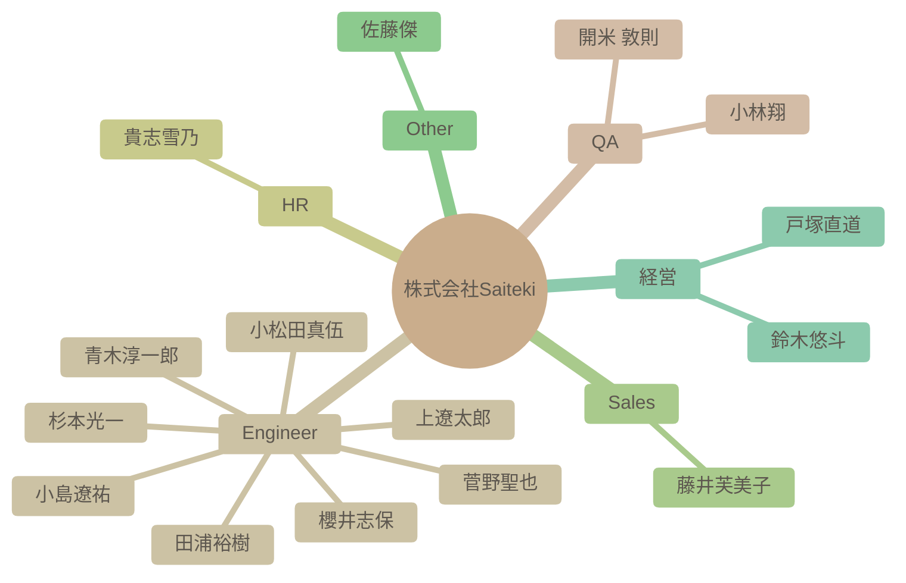

# チーム構成図

自動生成された組織図です。Issueによる更新が反映されます。

## 詳細リスト

| 名前 | 職種 | 得意スキル (Tags) | 興味 (Interests) | 目標 (Goal) | 人柄 (Personality) |
| --- | --- | --- | --- | --- | --- |
| 杉本光一 | Engineer | - | - | - | - |
| 青木淳一郎 | Engineer | AWS, インフラ設計, インフラ構築 | Youtube (ざっくりYoutube), ドライブ, 家族と過ごすこと | Azure, Google Cloudの経験を積む。Saitekiの輪を広げる。 | 協調性, コミュニケーション能力, 親しみやすい |
| 小林翔 | QA | テスター, 進行管理 | メダルゲーム, 旅行, ゲーム, アニメ | 仲良くしながら一緒に成長 | 協調性 |
| 櫻井志保 | Engineer | Power BI, データ分析, データ加工, データ集計 | YouTube, ゲーム配信, お笑い番組鑑賞 | 資格取得を目指し、データベース構築など専門的な分野に挑戦する | 積極的,コミュニケーション重視,謙虚 |
| 田浦裕樹 | Engineer | - | - | - | - |
| 開米 敦則 | QA | - | - | - | - |
| 貴志雪乃 | HR | - | - | - | - |
| 上遼太郎 | Engineer | - | - | - | - |
| 小松田真伍 | Engineer | - | - | - | - |
| 小島遼祐 | Engineer | - | - | - | - |
| 藤井芙美子 | Sales | - | - | - | - |
| 菅野聖也 | Engineer | - | - | - | - |
| 佐藤傑 | Other | - | - | - | - |
| 鈴木悠斗 | 経営 | 営業, 大規模PJのPL, インフラ・セキュリティエンジニア, SES営業部立ち上げ, 経営 | キングダムのアニメ, 寿司, 家系ラーメン, 動画鑑賞, ゴルフ, サウナ, 家族と買い物 | 会社と共に成長し、皆が幸せになれるよう事業に全力で取り組む | 熱い、成長意欲 |
| 戸塚直道 | 経営 | 営業, 事業開発, M&A仲介, 新規事業立ち上げ | ジム, サウナ, ランニング, 筋トレ, トライアスロン, 仕事 | 日本のIT産業の構造を変革し、エンジニアの経済環境・待遇を改善する | 情熱的 |
