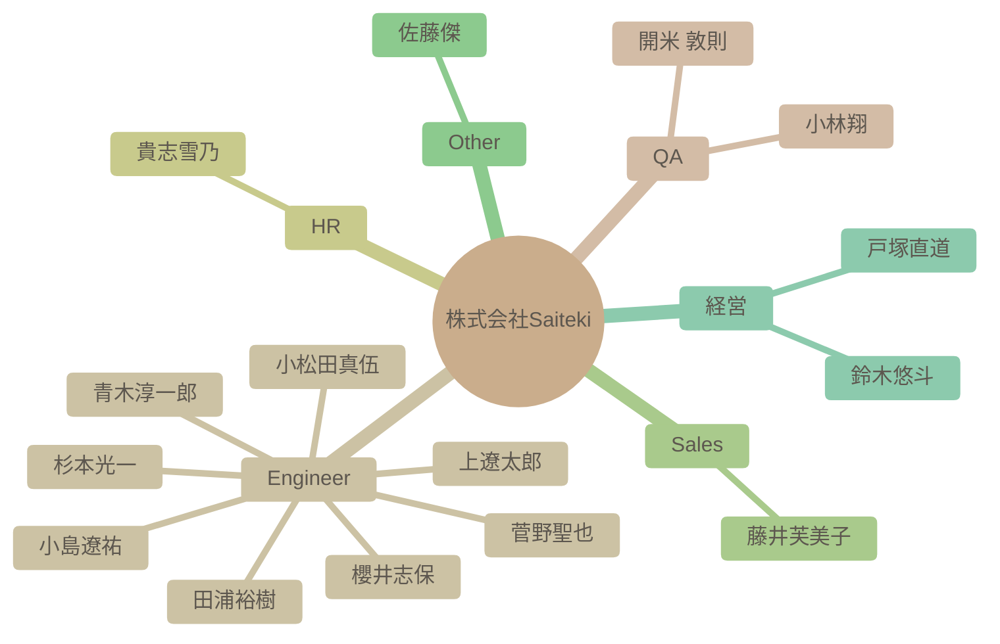

# チーム構成図

自動生成された組織図です。IssueおよびSlack連携による高度なAI分析結果が反映されます。

### 組織マップ

## 社員一覧サマリー

| 名前 | 職種 | 性格傾向 (概略) | 現在の状態 |
| --- | --- | --- | --- |
| [杉本光一](#%E6%9D%89%E6%9C%AC%E5%85%89%E4%B8%80) | Engineer | 開放性が高く、協調性があり、誠実な性格。新しい経験やアイデアに対して積極的で、周囲の人々との良好な関係を築くことを重視する。 | 新しいAI技術への関心が高く、それを業務に活かそうとしている。家族との時間を大切にしながらも、仕事にも意欲的に取り組んでいる様子がうかがえる。 |
| [青木淳一郎](#%E9%9D%92%E6%9C%A8%E6%B7%B3%E4%B8%80%E9%83%8E) | Engineer | 協調性が高く、開放的で、新しいことへの学習意欲が高い。安定性も高く、落ち着いた人物。 | 年末年始を挟み、新年への期待感と仕事への意欲を感じられる。業務多忙な時期でもあり、自己啓発への意欲も高い。 |
| [小林翔](#%E5%B0%8F%E6%9E%97%E7%BF%94) | QA | 全体的に開放的で協調性が高く、新しい環境にも適応しやすい性格。 | 入社前で、新しい職場環境に期待と興味を持っている。ゲームや趣味の話で積極的にコミュニケーションを取ろうとしている。 |
| [櫻井志保](#%E6%AB%BB%E4%BA%95%E5%BF%97%E4%BF%9D) | Engineer | 全体的に、誠実で協調性があり、新しい知識を積極的に学ぼうとする意欲的な性格が窺えます。 | 入社を控えており、新しい環境への期待と若干の不安を感じている。 |
| [田浦裕樹](#%E7%94%B0%E6%B5%A6%E8%A3%95%E6%A8%B9) | Engineer | 非常にオープンで協調性が高く、誠実な人物。新しい知識を吸収することに意欲的で、チームメンバーとの良好な関係を築くことを重視する。 | 新しいPoCプロジェクトに積極的に取り組み、チームに貢献しようとしている。技術的な知識共有だけでなく、ビジネス的な視点も取り入れようと努めている。 |
| [開米 敦則](#%E9%96%8B%E7%B1%B3%20%E6%95%A6%E5%89%87) | QA | 社交的で好奇心旺盛、新しい環境にも積極的に適応しようとする姿勢が見られる。協調性も高く、チームワークを重視する。 | 新しい職場への期待と意欲に満ちている。AI技術への関心が高く、積極的に情報収集を行おうとしている。 |
| [貴志雪乃](#%E8%B2%B4%E5%BF%97%E9%9B%AA%E4%B9%83) | HR | 協調性が高く、誠実で、新しいことにも興味を持つ。感情の安定性も高く、周囲への配慮を忘れない。 | 直近のログから、業務と育児を両立しながら、人事担当として様々な業務に意欲的に取り組んでいる様子が窺える。新しい技術や情報にも関心を持ち、積極的に学ぼうとしている。 |
| [上遼太郎](#%E4%B8%8A%E9%81%BC%E5%A4%AA%E9%83%8E) | Engineer | 全体的に開放的で社交性があり、協調性も高く、安定した精神状態がうかがえる。新しい経験や知識に好奇心旺盛で、周囲とのコミュニケーションを大切にする。 | 入社を控え、新しい環境への期待感と貢献意欲に満ち溢れている。AI技術への関心が高く、学習意欲も旺盛。 |
| [小松田真伍](#%E5%B0%8F%E6%9D%BE%E7%94%B0%E7%9C%9F%E4%BC%8D) | Engineer | 協調性が高く、新しい知識の習得に意欲的。また、責任感と向上心を持ち合わせている。 | 新しい環境に馴染もうと積極的に行動し、業務を通じて貢献したいという意欲が高い。最新技術にも強い関心を持っている。 |
| [小島遼祐](#%E5%B0%8F%E5%B3%B6%E9%81%BC%E7%A5%90) | Engineer | 社交的で外向性が高く、協調性があり、新しい環境への適応力も高い。自己肯定感が高く、楽観的な傾向が見られる。 | 新しい環境に期待と不安を感じつつも、積極的にコミュニケーションを取り、周囲との関係構築に努めている。学習意欲が高く、貢献意欲も高い。 |
| [藤井芙美子](#%E8%97%A4%E4%BA%95%E8%8A%99%E7%BE%8E%E5%AD%90) | Sales | 社交的で好奇心旺盛、共感性が高く、周囲との調和を重視する傾向があります。 | 新しい職場環境に積極的に適応しようとしており、周囲とのコミュニケーションを楽しんでいる。業務負荷は不明。 |
| [菅野聖也](#%E8%8F%85%E9%87%8E%E8%81%96%E4%B9%9F) | Engineer | 全体的に開放的で協調性が高く、真面目な性格。 | 新しい職場への期待感と、自己成長への意欲に満ち溢れている。 |
| [佐藤傑](#%E4%BD%90%E8%97%A4%E5%82%91) | Other | 開放性が高く、外向的で、知的好奇心が旺盛。新しい経験を積極的に求める傾向がある。 | 海外を拠点に活動しており、AI技術の進歩に高い関心を持っている。新しいプロジェクトや協力に意欲的。 |
| [鈴木悠斗](#%E9%88%B4%E6%9C%A8%E6%82%A0%E6%96%97) | 経営 | 社交的で協調性があり、新しいことへの好奇心も旺盛。一方で、感情が表に出やすい一面も持つ。 | 新しい技術（生成AI）の活用に強い関心を持ち、業務効率化や創造的な活動に役立てようとしている。また、チームメンバーとの交流も楽しんでいる。 |
| [戸塚直道](#%E6%88%B8%E5%A1%9A%E7%9B%B4%E9%81%93) | 経営 | 戸塚直道は、外向性が高く、新しいことへの好奇心旺盛で、誠実で共感性の高い人物である。ストレスを感じやすい一面もあるが、それを乗り越える強さも持ち合わせている。 | 直近では新規エンジニアの採用成功や事業の進捗に満足しており、引き続き会社の成長と組織作り、そしてメンバーの成長に注力している様子が見受けられる。 |

---

## 詳細プロフィール

各社員の詳細な分析結果です。クリックして展開できます。

### 杉本光一 (Engineer)

> **総合サマリー**: 杉本光一氏は、技術への好奇心と学習意欲が高く、チームへの貢献意欲が強いエンジニア。周囲との協調を重視し、新しい技術や情報に対する感度が高い。

<b>🛠 性格傾向 (Personality Traits)</b>

**要約**: 開放性が高く、協調性があり、誠実な性格。新しい経験やアイデアに対して積極的で、周囲の人々との良好な関係を築くことを重視する。

| 項目 | スコア | 根拠・エピソード |
| --- | --- | --- |
| 開放性 (Openness) | 9/10 | 新しい技術（AI関連ツール、RAGなど）への関心が高く、積極的に情報収集・共有している。書籍購入補助制度を利用し、学習意欲が高い。 [2025-11-13T12:21:59.623Z] Saitekiでの取り組みにめちゃくちゃわくわくしてます（主にAI）。 [2025-11-27T06:16:23.823Z] 今RAG構築してアプリ（添付画像）を作ってみてる |
| 誠実性 (Conscientiousness) | 8/10 | 自己紹介をホワイトボードにまとめ、共有するなど、自己開示に積極的。自身のスキルアップや業務改善に意欲的で、タスク管理ツールや開発環境に関する情報も積極的に取り入れている。 [2025-11-13T12:21:59.623Z] 引き続き自分も貢献していくつもりです。やれるだけのことはしっかりとやっていきます。 [2025-11-13T12:21:59.623Z] あと自己紹介やこれまでのことは<https://sugimotokoichi.fibery.io/default/54?sharing-key=bfbd9e94-43b0-4188-8a16-9a4e315daccb|ホワイトボード>に書いてみたのでぜひみてください:raised_hands: |
| 外向性 (Extraversion) | 7/10 | 初対面の人にも積極的に挨拶し、趣味や興味関心について共有するなど、コミュニケーションを積極的に行っている。 [2026-02-08T13:00:10.310Z] <@U0ADE4H3RTJ> さん はじめまして！杉本です:raised_hands: [2025-11-20T08:48:34.293Z] <@U09UHG24VUZ> はじめまして！エンジニアの杉本です:raised_hands: |
| 協調性 (Agreeableness) | 9/10 | 他者の意見や成果を尊重し、肯定的なフィードバックを送ることを心がけている。チームメンバーの貢献を称賛したり、困っている人に助けの手を差し伸べたりするなど、協調性を重視する。 [2026-01-10T04:32:23.731Z] 事業会社直の商談がどうやって生まれて、どう進んでいるか...会社一体でやってる感じがしてすごいいいね [2025-11-13T04:47:39.022Z] &gt; 2社目→SES営業部立ち上げ、売上7.2億まで拡大 :clap::clap::clap: |
| 神経症的傾向 (Neuroticism) | 4/10 | 課題に対して悩むこともあるが、前向きに努力する姿勢が見られる。ストレスを感じた際には散歩をするなど、自分なりの解消法を持っている。 [2026-01-10T04:25:15.753Z] 自分もスキル面で尖ったところもなければ、課題がでるたびになやんでばかりです笑 地道に一緒に頑張っていきましょう:raised_hands: [2025-11-19T11:10:30.031Z] 散歩します！:cold_face: |

<b>💪 仕事スタイルと強み (Work Styles & Strengths)</b>

**要約**: 新しい技術を積極的に学び、業務に取り入れようとする姿勢が強い。問題解決においては、情報を収集・分析し、論理的に解決策を検討する。チームでの協調を重視し、ナレッジ共有にも積極的。

**問題解決スタイル**: 情報を収集・分析し、論理的に解決策を検討する。AIを活用した業務効率化にも関心が高い。

**主要な強み**: 技術に対する学習意欲, 問題解決能力, チームワーク

**証拠エピソード**:
- RAG構築に関する情報収集とアプリ開発
- Antigravityの活用による業務効率化の検討
- 書籍購入補助制度の利用とレポート共有

<b>💎 価値観とモチベーター (Values & Motivators)</b>

**要約**: チームへの貢献、自己成長、家族との時間を大切にしている。新しい技術や情報に触れること、自身のスキルアップがモチベーションにつながる。

**コアバリュー**: チームへの貢献, 自己成長, 家族との時間

**モチベーショントリガー**: 新しい技術や情報, スキルアップ, チームからの感謝や賞賛

**証拠エピソード**:
- 会社への貢献意欲を示す発言
- 書籍購入補助制度の利用
- 家族との時間に関する投稿

<b>📈 現在の状態 (Current State)</b>

**要約**: 新しいAI技術への関心が高く、それを業務に活かそうとしている。家族との時間を大切にしながらも、仕事にも意欲的に取り組んでいる様子がうかがえる。

- **感情レベル**: positive
- **業務負荷状況**: 業務負荷は平均的。新しい技術の学習や導入に時間を割いている可能性がある。
- **最近の関心トピック**: AI（RAG、Antigravityなど）, チームビルディング, 家族との時間

---

### 青木淳一郎 (Engineer)

> **総合サマリー**: 青木淳一郎は、新しい環境に積極的に馴染もうとし、学習意欲が高く、周囲との協調性を重視する人物。

<b>🛠 性格傾向 (Personality Traits)</b>

**要約**: 協調性が高く、開放的で、新しいことへの学習意欲が高い。安定性も高く、落ち着いた人物。

| 項目 | スコア | 根拠・エピソード |
| --- | --- | --- |
| 開放性 (Openness) | 8/10 | AWSだけでなくAzure、Google Cloudにも触れたいという発言や、AIを学びたいという発言から、新しい技術や知識への探求心が見られる。 |
| 誠実性 (Conscientiousness) | 7/10 | 納品が近いことを考慮してイベント参加を見送るなど、責任感の強さが伺える。 |
| 外向性 (Extraversion) | 6/10 | Slackでの自己紹介や、パパ会を提案するなど、積極的にコミュニケーションを取ろうとする姿勢が見られる。しかし、直接会う機会が少ないことを気にしているため、内向的な面も持つ。 |
| 協調性 (Agreeableness) | 9/10 | 「よろしくお願いします」という挨拶を頻繁に行い、周囲への配慮が見られる。noteを読んで感動したことを伝えたり、相手を褒める発言も多い。 |
| 神経症的傾向 (Neuroticism) | 4/10 | 近所にサルが出没した際に驚きと恐怖を感じたという発言があるが、全体的には落ち着いた言動が多い。 |

<b>💪 仕事スタイルと強み (Work Styles & Strengths)</b>

**要約**: インフラ設計・構築の経験があり、学習意欲が高く、新しい技術にも積極的に挑戦する姿勢を持つ。周囲と協力しながら業務を進めることを重視する。

**問題解決スタイル**: 未経験領域でも知識と経験を得てスキルを広げようとするなど、学習を通じて課題解決を図る。

**主要な強み**: AWS基盤のインフラ設計・構築スキル, 学習意欲, コミュニケーション能力

**証拠エピソード**:
- AWS基盤のインフラ設計、構築経験
- AIにも強くなりたいのでいろいろ学ばせてもらいます
- 未経験領域なので苦労していることも多いですが、スキルの幅を広げるチャンスなので知識と経験を得ていきたいと思ってます！

<b>💎 価値観とモチベーター (Values & Motivators)</b>

**要約**: 家族との時間を大切にし、技術的なスキル向上と周囲との良好な関係構築を重視する。

**コアバリュー**: 家族, 技術的成長, チームワーク

**モチベーショントリガー**: 新しい技術の習得, チームへの貢献, 自身の成長

**証拠エピソード**:
- 休日の過ごし方：家族とドライブに行ったり、子どもと遊んだり、妻をガチャガチャ屋さんに連れて行ったり
- もっとAIに強くなりたいのでいろいろ学ばせてもらいます！
- Saitekiの輪をどんどん広げていけたらと思っています

<b>📈 現在の状態 (Current State)</b>

**要約**: 年末年始を挟み、新年への期待感と仕事への意欲を感じられる。業務多忙な時期でもあり、自己啓発への意欲も高い。

- **感情レベル**: positive
- **業務負荷状況**: 納品が近いこともあり、業務多忙
- **最近の関心トピック**: 京都旅行, Saitekiメンバーの入社経緯

---

### 小林翔 (QA)

> **総合サマリー**: 小林翔さんは、ゲーム業界経験が長く、多趣味で社交的な人物。新しい環境での成長を楽しみにしている。

<b>🛠 性格傾向 (Personality Traits)</b>

**要約**: 全体的に開放的で協調性が高く、新しい環境にも適応しやすい性格。

| 項目 | スコア | 根拠・エピソード |
| --- | --- | --- |
| 開放性 (Openness) | 8/10 | 旅行やアニメの舞台巡りなど、新しい経験や文化に対する好奇心が強い。ゲームのジャンルも幅広く嗜む。 |
| 誠実性 (Conscientiousness) | 7/10 | 前職で13年間テスターの進行管理をしていたことから、計画性や責任感があると考えられる。 |
| 外向性 (Extraversion) | 6/10 | 自己紹介で年齢層について触れたり、ゲーム部への参加意欲を示したりするなど、社交的な一面が見られる。 |
| 協調性 (Agreeableness) | 8/10 | 自己紹介が丁寧で謙虚。他者の発言にも丁寧に返信しており、協調性がある。 |
| 神経症的傾向 (Neuroticism) | 4/10 | 自己紹介で出身地について少し自虐的に語っているが、全体的には安定している。 |

<b>💪 仕事スタイルと強み (Work Styles & Strengths)</b>

**要約**: テスターとしての経験から、問題解決能力と管理能力に長けている。ゲームに関する知識も豊富。

**問題解決スタイル**: 過去のテスター経験から、論理的に問題を分析し、解決策を提案するタイプ。

**主要な強み**: 問題解決能力, 進行管理能力, ゲームに関する知識

**証拠エピソード**:
- 前職でテスターとして13年間勤務
- メダルゲームで大当たりを経験し、その状況を説明している

<b>💎 価値観とモチベーター (Values & Motivators)</b>

**要約**: 成長、人とのつながり、新しい経験を重視する。趣味や興味を通じて、モチベーションを高める。

**コアバリュー**: 成長, つながり, 経験

**モチベーショントリガー**: 新しいゲーム, 旅行, 食べ物

**証拠エピソード**:
- 自己紹介で「一緒に成長できたら嬉しい」と述べている
- 趣味について語る際に、楽しそうな様子が伝わってくる

<b>📈 現在の状態 (Current State)</b>

**要約**: 入社前で、新しい職場環境に期待と興味を持っている。ゲームや趣味の話で積極的にコミュニケーションを取ろうとしている。

- **感情レベル**: positive
- **業務負荷状況**: 不明
- **最近の関心トピック**: ゲーム, 北海道旅行, 食べ物

---

### 櫻井志保 (Engineer)

> **総合サマリー**: 櫻井志保さんは、データ分析スキルを持ち、学習意欲が高く、コミュニケーションを重視する協調性のある人物です。

<b>🛠 性格傾向 (Personality Traits)</b>

**要約**: 全体的に、誠実で協調性があり、新しい知識を積極的に学ぼうとする意欲的な性格が窺えます。

| 項目 | スコア | 根拠・エピソード |
| --- | --- | --- |
| 開放性 (Openness) | 8/10 | Power BIの利用経験やデータベース構築への挑戦意欲から、新しい技術や知識への高い関心と学習意欲が伺えます。 |
| 誠実性 (Conscientiousness) | 7/10 | データ集計業務の経験や資格取得を目指す姿勢から、責任感があり、目標達成に向けて努力する傾向が伺えます。 |
| 外向性 (Extraversion) | 5/10 | Slackを通じて積極的にコミュニケーションを取りたいという意欲から、ある程度の社交性はあるものの、内向的な側面もあると考えられます。 |
| 協調性 (Agreeableness) | 9/10 | 自己紹介の丁寧さや「何卒よろしくお願いいたします」という言葉遣いから、協調性を重視し、周囲との良好な関係を築こうとする姿勢が伺えます。 |
| 神経症的傾向 (Neuroticism) | 3/10 | 自己紹介で「至らない点も多いかと思いますが」と述べている点から、謙虚な姿勢が見られるものの、若干の不安を感じている可能性も考えられます。 |

<b>💪 仕事スタイルと強み (Work Styles & Strengths)</b>

**要約**: データ分析スキルを持ち、学習意欲が高く、自ら課題を見つけて改善に取り組むことができる。

**問題解決スタイル**: データに基づいた分析を行い、論理的に課題解決に取り組む。

**主要な強み**: データ分析, 学習意欲, コミュニケーション

**証拠エピソード**:
- Power BIを用いたデータ分析・加工
- データベース構築への挑戦意欲
- Slackを通じた積極的なコミュニケーション

<b>💎 価値観とモチベーター (Values & Motivators)</b>

**要約**: 成長と貢献を重視し、新しい知識やスキルを習得すること、チームに貢献することにモチベーションを感じる。

**コアバリュー**: 成長, 貢献, コミュニケーション

**モチベーショントリガー**: 新しい知識・スキルの習得, データ分析による課題解決, チームへの貢献

**証拠エピソード**:
- データベース構築への挑戦意欲
- Power BIを用いた業務効率化
- Slackを通じたコミュニケーション

<b>📈 現在の状態 (Current State)</b>

**要約**: 入社を控えており、新しい環境への期待と若干の不安を感じている。

- **感情レベル**: positive
- **業務負荷状況**: 不明
- **最近の関心トピック**: データ分析, データベース構築, コミュニケーション

---

### 田浦裕樹 (Engineer)

> **総合サマリー**: 20年のエンジニア経験を持つ、温和で協調性があり、学習意欲も高いベテランエンジニア。チームへの貢献と自己成長を重視する。

<b>🛠 性格傾向 (Personality Traits)</b>

**要約**: 非常にオープンで協調性が高く、誠実な人物。新しい知識を吸収することに意欲的で、チームメンバーとの良好な関係を築くことを重視する。

| 項目 | スコア | 根拠・エピソード |
| --- | --- | --- |
| 開放性 (Openness) | 9/10 | AI技術への興味、新しい開発環境への適応意欲、ゴッホ展への訪問など、幅広い分野への関心を示す。 |
| 誠実性 (Conscientiousness) | 8/10 | PoCの進捗共有における計画性と丁寧な説明、品質改善へのこだわり、タスク分割と優先順位付けによる効率的な進め方。 |
| 外向性 (Extraversion) | 7/10 | 自己紹介での積極的な情報共有、社内メンバーとの交流を積極的に行う姿勢、イベントや勉強会への参加。 |
| 協調性 (Agreeableness) | 9/10 | チームメンバーへの感謝の言葉、他者の意見への尊重、穏やかな口調でのコミュニケーション、貢献意欲の高さ。 |
| 神経症的傾向 (Neuroticism) | 3/10 | 50代であることへの懸念を述べるものの、すぐに貢献意欲へと転換している点、全体的にポジティブな発言が多い。 |

<b>💪 仕事スタイルと強み (Work Styles & Strengths)</b>

**要約**: アジャイル開発を得意とし、チーム立ち上げや品質改善に貢献できる。経験豊富で、得た知識や経験を共有することに意欲的。

**問題解決スタイル**: 仮説を立て、クライアントとすり合わせながら、柔軟に計画を修正していく。変化を前向きに捉え、最初から全てを決め切らない。

**主要な強み**: アジャイル開発, チーム立ち上げ・拡大, 設計・実装の品質改善

**証拠エピソード**:
- PoCの立ち上げフェーズにおける要件定義の進め方（仮説ベースでの分析、クライアントとの連携）
- 過去の経験から「田浦工務店」と呼ばれるほど再設計やリファクタリングに貢献
- Android TVアプリ開発チームでのQAチームとの連携による品質向上

<b>💎 価値観とモチベーター (Values & Motivators)</b>

**要約**: 技術に裏打ちされた温かみのある仕事を目指し、チームや会社への貢献を重視する。自身の経験や知識を共有することで、若手の育成にも貢献したいと考えている。

**コアバリュー**: Warm Heart, Cool Head (温かさと冷静さ), チームへの貢献, 継続的な学習と成長

**モチベーショントリガー**: 顧客からの感謝, チームの成功, 新しい技術の習得

**証拠エピソード**:
- 戸塚氏からプロダクトを買ってもらった際の喜び
- Saitekiへの参画理由（戸塚氏との出会い、貢献意欲）
- 勉強会での知識共有や議論への積極的な参加

<b>📈 現在の状態 (Current State)</b>

**要約**: 新しいPoCプロジェクトに積極的に取り組み、チームに貢献しようとしている。技術的な知識共有だけでなく、ビジネス的な視点も取り入れようと努めている。

- **感情レベル**: positive
- **業務負荷状況**: やや多忙だが、意欲的に業務に取り組んでいる様子
- **最近の関心トピック**: PoC (Proof of Concept) の進め方, 要件定義, ビジネス・営業戦略, AI技術の活用

---

### 開米 敦則 (QA)

> **総合サマリー**: 開米敦則氏は、QAエンジニアとしての経験を持つ、多趣味でコミュニケーションを重視する人物。新しい技術への探求心も旺盛。

<b>🛠 性格傾向 (Personality Traits)</b>

**要約**: 社交的で好奇心旺盛、新しい環境にも積極的に適応しようとする姿勢が見られる。協調性も高く、チームワークを重視する。

| 項目 | スコア | 根拠・エピソード |
| --- | --- | --- |
| 開放性 (Openness) | 9/10 | AI技術への関心、城巡りやガンプラなど多岐にわたる趣味、社外セミナーへの参加意欲 |
| 誠実性 (Conscientiousness) | 8/10 | 自己紹介の丁寧さ、QAエンジニアとしての職務経験、プロセス改善への関与 |
| 外向性 (Extraversion) | 7/10 | 自己紹介での積極的な情報開示、スポーツ観戦を共有したいという意欲、意見交換への積極性 |
| 協調性 (Agreeableness) | 8/10 | チームへの貢献意欲、他者への感謝の言葉、インコの話への積極的な対応 |
| 神経症的傾向 (Neuroticism) | 3/10 | 全体的にポジティブな発言が多い、自己開示における率直さ |

<b>💪 仕事スタイルと強み (Work Styles & Strengths)</b>

**要約**: QAエンジニアとしての経験を活かし、チームワークを重視しながら新しい技術を取り入れることを目指す。情報収集能力と問題解決能力が高い。

**問題解決スタイル**: データに基づいた分析と、関係者との協調による解決

**主要な強み**: QAエンジニアリング, 情報収集力, コミュニケーション能力

**証拠エピソード**:
- QAエンジニアとしての経験
- AIに関する社外セミナーへの参加意欲
- 意見交換を通じたスキルアップへの意欲

<b>💎 価値観とモチベーター (Values & Motivators)</b>

**要約**: チームワーク、自己成長、新しい技術への挑戦を重視する。自身の経験を活かし、組織に貢献することに意欲を持つ。

**コアバリュー**: チームワーク, 自己成長, 貢献

**モチベーショントリガー**: 新しい技術への挑戦, チームへの貢献, スキルアップ

**証拠エピソード**:
- チームの一員としてお役に立てるよう努めるとの発言
- 色々な方と意見交換してさらにスキルアップしていきたいとの発言
- AIを活用した新しいテストの形にチャレンジしたいという意欲

<b>📈 現在の状態 (Current State)</b>

**要約**: 新しい職場への期待と意欲に満ちている。AI技術への関心が高く、積極的に情報収集を行おうとしている。

- **感情レベル**: positive
- **業務負荷状況**: 不明（入社予定のため、具体的な業務負荷は不明）
- **最近の関心トピック**: AIを活用したQA, ガンプラ, インコ

---

### 貴志雪乃 (HR)

> **総合サマリー**: 貴志雪乃さんは、丁寧で協調性があり、周囲との調和を大切にする人物。子育てと仕事に両立しながら、人事担当として貢献。

<b>🛠 性格傾向 (Personality Traits)</b>

**要約**: 協調性が高く、誠実で、新しいことにも興味を持つ。感情の安定性も高く、周囲への配慮を忘れない。

| 項目 | スコア | 根拠・エピソード |
| --- | --- | --- |
| 開放性 (Openness) | 7/10 | 鬼滅の刃にハマる、洋画鑑賞を趣味とする、映画「でっちあげ」を観る、オンライン部活企画への参加意欲などから、新しい体験や知識に対する好奇心が高いと推測される。 |
| 誠実性 (Conscientiousness) | 8/10 | 勉強会のレポート作成、参加登録用URLのconnpass作成、オンライン部活の企画と実行などから、責任感が強く、タスクをきちんとこなす傾向が見られる。 |
| 外向性 (Extraversion) | 6/10 | 初対面の人への挨拶や、子供を交えて会いたいという発言から、社交性はある程度あると考えられるが、積極的な発信は少なめ。 |
| 協調性 (Agreeableness) | 9/10 | 丁寧な言葉遣い、感謝の言葉、相手への共感的なコメント、「〜できたら嬉しいです」といった協調的な表現から、協調性が非常に高く、周囲との良好な関係を築こうとする姿勢が窺える。 |
| 神経症的傾向 (Neuroticism) | 4/10 | お返事が遅れたことへの謝罪、父親が小学校教師であることへの複雑な感情を示すなど、繊細な一面もあるが、全体的には安定していると思われる。 |

<b>💪 仕事スタイルと強み (Work Styles & Strengths)</b>

**要約**: 丁寧で正確な仕事ぶりで、人事・採用担当として、勉強会の企画・運営などにも積極的に関わる。チームワークを重視し、貢献意欲も高い。

**問題解決スタイル**: 勉強会を企画・運営したり、オンライン部活動のアイデアを募ったりすることから、周りの意見を聞きながら、協力して問題を解決するタイプ。

**主要な強み**: 丁寧なコミュニケーション, 企画・運営力, チームワーク

**証拠エピソード**:
- 勉強会のレポート作成と共有
- オンライン部活の企画と投票の実施
- 採用担当としての丁寧な挨拶

<b>💎 価値観とモチベーター (Values & Motivators)</b>

**要約**: 家族との時間を大切にし、仕事を通じて社会に貢献したいと考えている。また、個人の成長やチームの成功にも高い関心を持つ。

**コアバリュー**: 家族, 貢献, 成長

**モチベーショントリガー**: 子供との時間, チームへの貢献, 新しい知識やスキルの習得

**証拠エピソード**:
- 子供と遊ぶ休日の過ごし方
- 勉強会の企画・運営への積極的な参加
- 新しい映画やイベントへの興味

<b>📈 現在の状態 (Current State)</b>

**要約**: 直近のログから、業務と育児を両立しながら、人事担当として様々な業務に意欲的に取り組んでいる様子が窺える。新しい技術や情報にも関心を持ち、積極的に学ぼうとしている。

- **感情レベル**: positive
- **業務負荷状況**: 標準的。勉強会の企画、レポート作成、オンライン部活動の企画など、様々な業務をこなしているが、特に負担が大きいという様子は見られない。
- **最近の関心トピック**: 生成AI, 勉強会, オンライン部活

---

### 上遼太郎 (Engineer)

> **総合サマリー**: 上遼太郎さんは、学習意欲が高く、コミュニケーションを積極的に取り、新しい技術や知識の習得に意欲的な人物です。

<b>🛠 性格傾向 (Personality Traits)</b>

**要約**: 全体的に開放的で社交性があり、協調性も高く、安定した精神状態がうかがえる。新しい経験や知識に好奇心旺盛で、周囲とのコミュニケーションを大切にする。

| 項目 | スコア | 根拠・エピソード |
| --- | --- | --- |
| 開放性 (Openness) | 9/10 | 新しい技術に触れる度にワクワクする、海外旅行が好き、StagewiseというIDEの拡張機能を調べてDiscordコミュニティに参加、フリーレンなどのアニメを見るなど、新しいものや未知の体験に対する好奇心が強い。 |
| 誠実性 (Conscientiousness) | 7/10 | 入社前からSaitekiで副業を行いAI駆動開発に向けた調査を行う、ダブルチェック指差しだいじ、などから、責任感があり、注意深い性格がうかがえる。 |
| 外向性 (Extraversion) | 8/10 | 飲み会が好き、スラックなどの発言の頻度上げて盛り上げていきたい、九州勢で盛り上げていきたいなど、周囲との交流を積極的に求める傾向がある。 |
| 協調性 (Agreeableness) | 8/10 | よろしくお願いします、ありがとうございます、おめでとうございます、など感謝や祝福の言葉を頻繁に使う、相手の発言に共感を示すなど、協調性が高く、友好的な性格がうかがえる。 |
| 神経症的傾向 (Neuroticism) | 3/10 | 全体的にポジティブな発言が多く、ネガティブな感情を表に出すことが少ない。落ち着いており、安定した精神状態であると推測される。 |

<b>💪 仕事スタイルと強み (Work Styles & Strengths)</b>

**要約**: 学習意欲が高く、新しい技術や知識の習得に意欲的。また、過去の経験から、様々な分野の知識を持っている。周囲と協力しながら仕事を進めることを重視する。

**問題解決スタイル**: 新しい情報や技術を取り入れながら、問題解決に取り組む。過去の経験や知識を活かし、多角的な視点から問題解決を図る。

**主要な強み**: 学習意欲の高さ, コミュニケーション能力, 多様な知識・経験

**証拠エピソード**:
- SaitekiでAI駆動開発に向けた調査
- StagewiseというIDEの拡張機能を調べる
- Letter of T を読んで営業について学ぶ

<b>💎 価値観とモチベーター (Values & Motivators)</b>

**要約**: 成長、貢献、協調性を重視し、新しい知識や技術の習得、チームへの貢献、周囲との良好な関係構築にモチベーションを感じる。

**コアバリュー**: 成長, 貢献, 協調性

**モチベーショントリガー**: 新しい技術に触れること, チームに貢献できること, 周囲との交流

**証拠エピソード**:
- 新しい技術に触れる度ワクワク
- 早く貢献したい気持ちでいっぱい
- スラックなどの発言の頻度上げて盛り上げていきたい

<b>📈 現在の状態 (Current State)</b>

**要約**: 入社を控え、新しい環境への期待感と貢献意欲に満ち溢れている。AI技術への関心が高く、学習意欲も旺盛。

- **感情レベル**: positive
- **業務負荷状況**: 低い（入社前）
- **最近の関心トピック**: AI, 商談動画, つけ麺, 画像生成AI

---

### 小松田真伍 (Engineer)

> **総合サマリー**: 小松田真伍氏は、学習意欲が高く、コミュニティへの貢献を重視するエンジニア。技術探求心と社会貢献への意識を併せ持つ。

<b>🛠 性格傾向 (Personality Traits)</b>

**要約**: 協調性が高く、新しい知識の習得に意欲的。また、責任感と向上心を持ち合わせている。

| 項目 | スコア | 根拠・エピソード |
| --- | --- | --- |
| 開放性 (Openness) | 9/10 | AI駆動開発講習への参加、新しい技術（Warp, Antigravity等）の学習、学習内容の共有 |
| 誠実性 (Conscientiousness) | 8/10 | 学習内容の備忘録としての記録、課題に対する分析、不明点の確認 |
| 外向性 (Extraversion) | 6/10 | 自己紹介での詳細な情報開示、バッティングセンターなど趣味の共有、勉強会での実況スレ提案 |
| 協調性 (Agreeableness) | 9/10 | 丁寧な言葉遣い、感謝の言葉、相手への配慮（例：質問がキラーパスだったかも）、勉強会スレの提案など、全体的に協調性を重視する姿勢が見られる。 |
| 神経症的傾向 (Neuroticism) | 4/10 | 知識が浅く広くで所々ついていけるか非常にビビっている、たぬきかぁ〜〜もっと可愛げあるやつが嬉しかったヤツ |

<b>💪 仕事スタイルと強み (Work Styles & Strengths)</b>

**要約**: 新しい技術への適応力が高く、学習意欲が旺盛。問題解決能力も高く、積極的に情報共有を行う。

**問題解決スタイル**: 技術的な課題に対して、AIツールを活用しながら効率的な解決策を模索する。また、得られた知見を積極的に共有する。

**主要な強み**: 技術探求心, 情報共有, 学習能力

**証拠エピソード**:
- AI駆動開発講習で学んだ内容を詳細に共有し、チームに貢献しようとしている
- WarpとAntigravityの使い分けについて講師に質問し、理解を深めようとしている
- 勉強会での実況スレ提案を通して、チーム全体の学習効果を高めようとしている

<b>💎 価値観とモチベーター (Values & Motivators)</b>

**要約**: 地域活性化への貢献意欲が高く、エンジニアとしてのスキルを社会に還元したいと考えている。また、成長意欲が強く、新しい技術を積極的に学び、自身のスキルアップを目指している。

**コアバリュー**: 地域活性化, 技術貢献, 成長

**モチベーショントリガー**: 新しい技術への挑戦, チームへの貢献, 社会への貢献

**証拠エピソード**:
- 屋久島活性化を人生における命題として、事業を推進している
- 経験を活かした自分なりの最適を還元できるように頑張りたい
- Saitekiの理念に共感し、SIerとの戦いに貢献したいと考えている

<b>📈 現在の状態 (Current State)</b>

**要約**: 新しい環境に馴染もうと積極的に行動し、業務を通じて貢献したいという意欲が高い。最新技術にも強い関心を持っている。

- **感情レベル**: positive
- **業務負荷状況**: 不明。入社前のため、業務負荷に関する直接的な情報は少ない。
- **最近の関心トピック**: AI駆動開発, WarpとAntigravity, QA

---

### 小島遼祐 (Engineer)

> **総合サマリー**: 小島遼祐は、積極的で協調性があり、学習意欲の高い新入社員。コミュニケーション能力が高く、周囲との関係構築を重視する。

<b>🛠 性格傾向 (Personality Traits)</b>

**要約**: 社交的で外向性が高く、協調性があり、新しい環境への適応力も高い。自己肯定感が高く、楽観的な傾向が見られる。

| 項目 | スコア | 根拠・エピソード |
| --- | --- | --- |
| 開放性 (Openness) | 8/10 | 新しいことへの学習意欲が高く、様々な趣味を持っている（アニメ、将棋、ポケモン）。自己紹介で出身地や趣味を詳細に記述。 |
| 誠実性 (Conscientiousness) | 7/10 | 自己紹介が丁寧で詳細。一蘭でのアルバイト経験や責任者経験から、責任感の強さが伺える。入社後の抱負を述べている。 |
| 外向性 (Extraversion) | 9/10 | 自己紹介で積極的にコミュニケーションを取ろうとしている。他者へのレスポンスが丁寧で迅速。多くの人に話しかけている。 |
| 協調性 (Agreeableness) | 9/10 | 自己紹介で丁寧な言葉遣いを心がけており、相手への敬意を示している。感謝の言葉を頻繁に述べている。相手の趣味や出身地に関心を示している。 |
| 神経症的傾向 (Neuroticism) | 3/10 | 自己紹介で不安な点を述べつつも、前向きな姿勢を示している。全体的に楽観的なトーンで記述されている。 |

<b>💪 仕事スタイルと強み (Work Styles & Strengths)</b>

**要約**: 学習意欲が高く、周囲から学ぶ姿勢が強い。チームワークを重視し、貢献意欲が高い。過去の経験からリーダーシップの素質も伺える。

**問題解決スタイル**: 周囲に協力を仰ぎながら、積極的に知識を吸収し、実践を通して解決を図るタイプ。

**主要な強み**: 学習意欲, コミュニケーション能力, 協調性

**証拠エピソード**:
- 自己紹介で積極的に学びたいと述べている
- 他者への返信で相手の長所を褒め、尊敬の念を示している
- 過去の経験から人の意見をまとめるのが好きだと述べている

<b>💎 価値観とモチベーター (Values & Motivators)</b>

**要約**: 成長と貢献を重視し、チームの一員として認められることをモチベーションとしている。人との繋がりを大切にし、感謝の気持ちを忘れない。

**コアバリュー**: 成長, 貢献, チームワーク

**モチベーショントリガー**: 新しい知識の習得, チームへの貢献, 他者からの感謝

**証拠エピソード**:
- 自己紹介で「先輩方から学べることは全て学びたい」と述べている
- 「早く力になれるように尽力いたします！」と述べている
- 「仲間に迎え入れてくださり本当にありがとうございます！」と述べている

<b>📈 現在の状態 (Current State)</b>

**要約**: 新しい環境に期待と不安を感じつつも、積極的にコミュニケーションを取り、周囲との関係構築に努めている。学習意欲が高く、貢献意欲も高い。

- **感情レベル**: positive
- **業務負荷状況**: 不明。入社前のため業務負荷は判断できない
- **最近の関心トピック**: ビジネス本, アニメ, ラーメン

---

### 藤井芙美子 (Sales)

> **総合サマリー**: 藤井芙美子さんは、社交的で共感力が高く、新しい環境に積極的に適応しようとする人物です。多様な経験を持ち、周囲との協調を重視します。

<b>🛠 性格傾向 (Personality Traits)</b>

**要約**: 社交的で好奇心旺盛、共感性が高く、周囲との調和を重視する傾向があります。

| 項目 | スコア | 根拠・エピソード |
| --- | --- | --- |
| 開放性 (Openness) | 8/10 | 新しい趣味や経験に積極的（ゴールデンカムイ、USJ）、旅行好き、道の駅やご当地スーパーへの興味 |
| 誠実性 (Conscientiousness) | 7/10 | 自己紹介が丁寧で、迅速に業務に慣れようとしている、周囲への気遣い |
| 外向性 (Extraversion) | 8/10 | 自己紹介で積極的にコミュニケーションを取ろうとしている、デパ地下トークへの興味、イベントへの参加意欲 |
| 協調性 (Agreeableness) | 9/10 | 周囲の意見に共感し、肯定的な反応を示す（道の駅、ご当地スーパー好き）、相手を褒める（菅野さんの対応）、感謝の言葉を述べる |
| 神経症的傾向 (Neuroticism) | 4/10 | 子供の反抗期に対する不安はあるものの、基本的には明るく前向きな発言が多い、交通機関の遅延に対する冷静な対応 |

<b>💪 仕事スタイルと強み (Work Styles & Strengths)</b>

**要約**: 協調性を重視し、周囲と協力しながら業務を進めることを得意とする。多様な経験を活かし、柔軟に対応できる。

**問題解決スタイル**: 周囲と協力して解決策を探る、過去の経験から得られた知識を活かす

**主要な強み**: コミュニケーション能力, 共感力, 適応力

**証拠エピソード**:
- 自己紹介で親近感を持たせる工夫をしている
- 周囲の意見に共感し、積極的にコミュニケーションを取ろうとしている
- 過去の職務経験を活かして新しい環境に適応しようとしている

<b>💎 価値観とモチベーター (Values & Motivators)</b>

**要約**: 家族との時間を大切にし、周囲との良好な人間関係を築くことを重視する。新しい知識や経験を得ることに意欲的。

**コアバリュー**: 家族, 協調性, 成長

**モチベーショントリガー**: 周囲からの感謝, 新しい知識や経験の獲得, チームへの貢献

**証拠エピソード**:
- 子供との時間に関する言及
- 周囲への気遣い
- 新しい業務への意欲

<b>📈 現在の状態 (Current State)</b>

**要約**: 新しい職場環境に積極的に適応しようとしており、周囲とのコミュニケーションを楽しんでいる。業務負荷は不明。

- **感情レベル**: positive
- **業務負荷状況**: 不明
- **最近の関心トピック**: 社内の人物（菅野さん、戸塚さん）, 過去の占い, 交通機関の状況

---

### 菅野聖也 (Engineer)

> **総合サマリー**: 向学心があり、新しい技術や知識の習得に意欲的な人物。コミュニケーション能力も高く、周囲との協調性も期待できる。

<b>🛠 性格傾向 (Personality Traits)</b>

**要約**: 全体的に開放的で協調性が高く、真面目な性格。

| 項目 | スコア | 根拠・エピソード |
| --- | --- | --- |
| 開放性 (Openness) | 9/10 | AIへの興味、読書習慣（ビジネス書以外も読む）、新しい知識を得ることに積極的 |
| 誠実性 (Conscientiousness) | 8/10 | 丁寧な言葉遣い、過去の職務経験（品質管理）、自己成長への意欲 |
| 外向性 (Extraversion) | 6/10 | 初対面でも話しやすいと評価されている、ランチを共にするなど積極的な面もある |
| 協調性 (Agreeableness) | 8/10 | 丁寧な言葉遣い、周囲への感謝の言葉、協調性 |
| 神経症的傾向 (Neuroticism) | 3/10 | 自己肯定感があり、安定している様子。過去の職歴に対する客観的な評価 |

<b>💪 仕事スタイルと強み (Work Styles & Strengths)</b>

**要約**: 技術的な知識に加え、品質管理の経験もあり、多角的な視点を持っている。学習意欲が高く、新しい技術の習得にも積極的。

**問題解決スタイル**: 技術的な知識と経験に基づき、効率的かつ効果的な解決策を模索する。AIの活用も視野に入れている。

**主要な強み**: 学習意欲, 技術知識, 品質管理経験

**証拠エピソード**:
- AIに質問してコードを生成する
- コーヒーの化学に関する読書
- 倉庫業で品質管理を任された

<b>💎 価値観とモチベーター (Values & Motivators)</b>

**要約**: 自己成長、新しい知識の習得、技術的なスキル向上に価値を置いている。周囲からの期待に応えること、チームへの貢献もモチベーションに繋がっている。

**コアバリュー**: 自己成長, 知識, 貢献

**モチベーショントリガー**: 新しい技術の習得, 周囲からの期待, チームへの貢献

**証拠エピソード**:
- 開発者としてのカンを取り戻したい
- ご期待に添えられるよう精進
- 工夫してコードを書くのが面白い

<b>📈 現在の状態 (Current State)</b>

**要約**: 新しい職場への期待感と、自己成長への意欲に満ち溢れている。

- **感情レベル**: positive
- **業務負荷状況**: 不明（入社前のため）
- **最近の関心トピック**: AI, 読書, プログラミング

---

### 佐藤傑 (Other)

> **総合サマリー**: 起業家精神旺盛で、AI領域に深い知識と情熱を持つ、国際的な視野を持つ人物。学習意欲が高く、アウトプットを重視する。

<b>🛠 性格傾向 (Personality Traits)</b>

**要約**: 開放性が高く、外向的で、知的好奇心が旺盛。新しい経験を積極的に求める傾向がある。

| 項目 | スコア | 根拠・エピソード |
| --- | --- | --- |
| 開放性 (Openness) | 9/10 | 海外での活動、AIへの深い関心、ハッカソンへの参加 |
| 誠実性 (Conscientiousness) | 7/10 | 起業家としての活動、プロジェクトの推進 |
| 外向性 (Extraversion) | 8/10 | 海外での交流、チーム開発への参加、コミュニティ活動 |
| 協調性 (Agreeableness) | 6/10 | チームメンバーへの感謝、質問への積極的な対応 |
| 神経症的傾向 (Neuroticism) | 3/10 | 全体的にポジティブな発言が多い |

<b>💪 仕事スタイルと強み (Work Styles & Strengths)</b>

**要約**: AIに関する専門知識を持ち、グローバルな視点でのチーム開発を推進できる。学習意欲が高く、アウトプットを重視する。

**問題解決スタイル**: 実践的なAI活用を重視し、最新技術を取り入れながら課題解決に取り組む

**主要な強み**: AIに関する深い知識, グローバルな視点, 起業家精神

**証拠エピソード**:
- 株式会社Uravationの創業
- ChatGPT研究所の運営
- 海外のチームとの開発

<b>💎 価値観とモチベーター (Values & Motivators)</b>

**要約**: AI技術の発展と社会への実装に貢献することに価値を置き、新しい知識の習得や成果のアウトプットに強いモチベーションを感じる。

**コアバリュー**: イノベーション, グローバルな視点, コミュニティへの貢献

**モチベーショントリガー**: 新しいAI技術の習得, ハッカソンでのアウトプット, チームでの成功事例の共創

**証拠エピソード**:
- SaitekiのみんなとAI実装の成功事例を共創したい
- アウトプットが増えるほどテンションが上がる
- 海外のローカル飯の食べ歩きとハッカソンへの参加

<b>📈 現在の状態 (Current State)</b>

**要約**: 海外を拠点に活動しており、AI技術の進歩に高い関心を持っている。新しいプロジェクトや協力に意欲的。

- **感情レベル**: positive
- **業務負荷状況**: 複数のプロジェクトを同時進行している可能性があるが、意欲的に取り組んでいる
- **最近の関心トピック**: 小型の高性能モデル（Deepseek4), グローバルなチーム開発, AI実装の成功事例

---

### 鈴木悠斗 (経営)

> **総合サマリー**: 取締役副社長兼COO。経験豊富な営業職で、経営者としては見習い。学習意欲が高く、周囲との協調性を重視する人物。

<b>🛠 性格傾向 (Personality Traits)</b>

**要約**: 社交的で協調性があり、新しいことへの好奇心も旺盛。一方で、感情が表に出やすい一面も持つ。

| 項目 | スコア | 根拠・エピソード |
| --- | --- | --- |
| 開放性 (Openness) | 8/10 | 新しい技術（生成AI）への関心、アニメや漫画など様々な趣味を持つ。未経験のBIについても積極的にキャッチアップしようとする姿勢。 |
| 誠実性 (Conscientiousness) | 7/10 | 営業マニュアル作成など、仕事への責任感が強い。リファラル採用にも積極的に協力しようとしている。 |
| 外向性 (Extraversion) | 9/10 | 自己紹介投稿や、他のメンバーへの積極的な歓迎メッセージから、社交性が高いことが伺える。他者とのコミュニケーションを積極的に行う。 |
| 協調性 (Agreeableness) | 8/10 | 他者の投稿への肯定的なリアクションが多い。「素晴らしい」「良い写真です」などの言葉を多用し、相手を尊重する姿勢が見られる。 |
| 神経症的傾向 (Neuroticism) | 4/10 | 動物占いの結果から、喜怒哀楽が顔や態度に出やすいと自己認識している。体調を崩したことを共有するなど、比較的オープンな一面もある。 |

<b>💪 仕事スタイルと強み (Work Styles & Strengths)</b>

**要約**: 営業経験が豊富で、新しい技術を積極的に取り入れる。チームワークを重視し、メンバーの成長をサポートする。

**問題解決スタイル**: AIを活用して効率化を図る。営業初心者向けのマニュアルを作成するなど、体系的なアプローチを好む。

**主要な強み**: 営業力, 技術への関心, コミュニケーション能力

**証拠エピソード**:
- SES営業部立ち上げ、売上7.2億まで拡大
- インフラ・セキュリティエンジニアとして現場に参画、大規模PJのPLを務めた
- 青木さんの未経験領域への積極的なキャッチアップを評価し、チームに共有

<b>💎 価値観とモチベーター (Values & Motivators)</b>

**要約**: 会社の成長と、メンバーの幸せを重視している。新しい技術を積極的に取り入れ、事業を推進することにモチベーションを感じる。

**コアバリュー**: 成長, チームワーク, 新しい技術の活用

**モチベーショントリガー**: 事業の成功, メンバーの成長, 新しい技術の習得

**証拠エピソード**:
- 「会社と共に私も成長していきますので、皆様よろしくお願いします」
- 「皆さんが幸せになれるよう、全力で事業に取り組みます」
- リファラル採用の協力依頼

<b>📈 現在の状態 (Current State)</b>

**要約**: 新しい技術（生成AI）の活用に強い関心を持ち、業務効率化や創造的な活動に役立てようとしている。また、チームメンバーとの交流も楽しんでいる。

- **感情レベル**: positive
- **業務負荷状況**: 業務は多忙だが、新しい技術の活用やチームメンバーとの協力によって、うまくバランスを取れている様子。
- **最近の関心トピック**: 生成AI, 動物占い, リファラル採用

---

### 戸塚直道 (経営)

> **総合サマリー**: 戸塚直道は、高い熱量と行動力を持つ起業家であり、周囲を巻き込みながら事業を推進するリーダーシップを発揮する。学習意欲が高く、ユーモアがあり、コミュニケーション能力にも長けている。

<b>🛠 性格傾向 (Personality Traits)</b>

**要約**: 戸塚直道は、外向性が高く、新しいことへの好奇心旺盛で、誠実で共感性の高い人物である。ストレスを感じやすい一面もあるが、それを乗り越える強さも持ち合わせている。

| 項目 | スコア | 根拠・エピソード |
| --- | --- | --- |
| 開放性 (Openness) | 9/10 | 新しい技術やビジネスモデルへの高い関心を示し、AIに関する情報を積極的に共有・学習している。SmartHR芹澤代表との対談、小島さんとの交流、勉強会開催など、積極的に外部の知識を取り入れている。 |
| 誠実性 (Conscientiousness) | 8/10 | 資金調達のリリース準備に半年間取り組み、着金後も気を抜かずに準備を進めるなど、目標達成への強い責任感と計画性を持つ。週ごとの記録「Letter of T」を作成し、進捗や考えを共有するなど、組織的な行動を重視している。 |
| 外向性 (Extraversion) | 9/10 | 社内外の人々と積極的に交流し、勉強会やイベントを企画・開催するなど、周囲を巻き込むリーダーシップを発揮する。採用活動にも積極的に関わり、入社者の個性や強みを積極的にアピールする。 |
| 協調性 (Agreeableness) | 8/10 | 社員や関係者への感謝の気持ちを頻繁に伝え、他者の意見や貢献を高く評価する。メンバーのキャリア相談に乗る姿勢や、チームワークを重視する発言からも、協調性の高さが伺える。 |
| 神経症的傾向 (Neuroticism) | 4/10 | 資金調達の過程で精神的に不安定になる瞬間もあったが、最終的には目標を達成している。困難な状況でも、周囲のサポートを得ながら乗り越えるレジリエンスを持つ。 |

<b>💪 仕事スタイルと強み (Work Styles & Strengths)</b>

**要約**: 戸塚直道は、目標達成意欲が高く、常に新しい情報を取り入れながら、事業を推進する。課題解決能力が高く、創造的な発想力も持ち合わせている。

**問題解決スタイル**: 課題に対して多角的にアプローチし、AI技術の活用や外部リソースとの連携など、柔軟な解決策を模索する。過去の失敗経験から学び、それを組織全体に共有することで、再発防止に努める。

**主要な強み**: リーダーシップ, 戦略的思考, コミュニケーション能力

**証拠エピソード**:
- 資金調達を成功させ、会社の成長を加速させている。
- 勉強会やイベントを企画・開催し、社内外の知識共有を促進している。
- AI技術を活用した新しいサービスを開発し、事業の幅を広げている。

<b>💎 価値観とモチベーター (Values & Motivators)</b>

**要約**: 戸塚直道は、会社の成長と従業員の幸福を最も大切にしている。困難な課題に挑戦し、それを乗り越えることに強いモチベーションを感じる。

**コアバリュー**: 成長, 貢献, 革新

**モチベーショントリガー**: 会社の成長, 従業員の幸福, 社会への貢献

**証拠エピソード**:
- 資金調達の成功により、会社の成長を加速させる。
- 従業員がチャレンジできる環境を作る。
- 日本のIT産業の構造を変革するようなビジネスをしたい。

<b>📈 現在の状態 (Current State)</b>

**要約**: 直近では新規エンジニアの採用成功や事業の進捗に満足しており、引き続き会社の成長と組織作り、そしてメンバーの成長に注力している様子が見受けられる。

- **感情レベル**: positive
- **業務負荷状況**: 高め。多くのプロジェクトを同時並行で進めている。
- **最近の関心トピック**: AI駆動開発, 組織運営, SaaSビジネス

---

