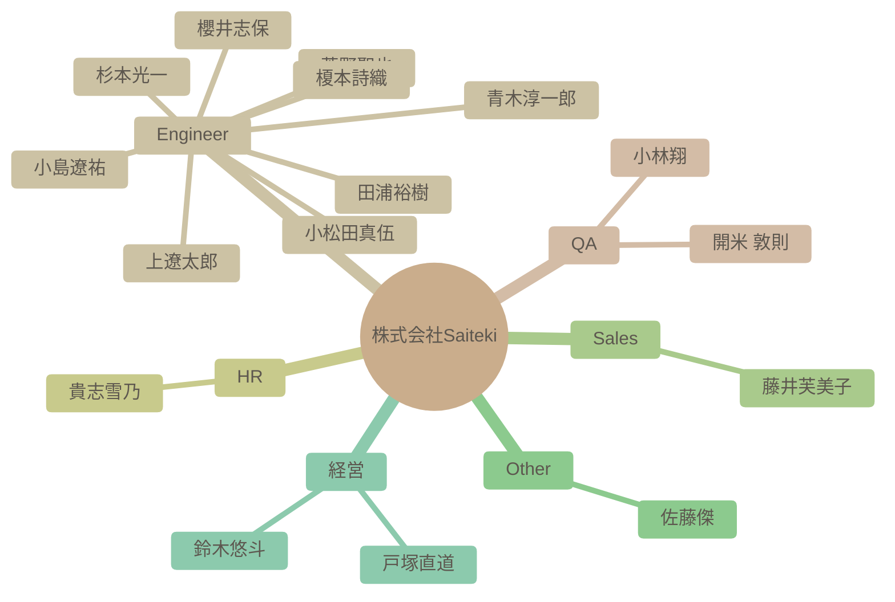

# チーム構成図

自動生成された組織図です。IssueおよびSlack連携による高度なAI分析結果が反映されます。

### 組織マップ

## 社員一覧サマリー

| 名前 | 職種 | 性格傾向 (概略) | 現在の状態 |
| --- | --- | --- | --- |
| [杉本光一](#%E6%9D%89%E6%9C%AC%E5%85%89%E4%B8%80) | Engineer | 開放性が高く、協調性があり、外向的な傾向が見られる。神経質傾向は低いと考えられる。 | 新しい職場環境に積極的に馴染もうとしており、様々なことに興味を持っている。業務負荷は不明。 |
| [青木淳一郎](#%E9%9D%92%E6%9C%A8%E6%B7%B3%E4%B8%80%E9%83%8E) | Engineer | 協調性が高く、新しい知識や経験に対して積極的な姿勢を持つ。楽観的で社交的な性格。 | 現在は業務負荷が高く、イベントへの参加を見送っているものの、全体的にポジティブな状況である。Saitekiのメンバーとの出会いを喜び、来年への期待を抱いている。 |
| [小林翔](#%E5%B0%8F%E6%9E%97%E7%BF%94) | QA | 開放性が高く、協調性があり、外向性も比較的高い。新しい経験や人々との交流を積極的に求めている。 | 新しい職場に期待を抱いており、周囲との良好な関係を築こうと積極的に行動している。 |
| [櫻井志保](#%E6%AB%BB%E4%BA%95%E5%BF%97%E4%BF%9D) | Engineer | 自己認識が高く、協調性があり、学習意欲も高い。新しい環境への適応力も期待できる。 | 入社を控えており、新しい環境への期待感と意欲に満ち溢れている。チームの一員として貢献したいという気持ちが強い。 |
| [田浦裕樹](#%E7%94%B0%E6%B5%A6%E8%A3%95%E6%A8%B9) | Engineer | 協調性が高く、誠実で、新しい知識を吸収することに意欲的な性格。 | 現在はAndroid TVアプリ開発チームでのPoC立ち上げに注力しており、業務負荷は高いものの、計画的にタスクを進めている様子。チームメンバーとの連携も良好。 |
| [開米 敦則](#%E9%96%8B%E7%B1%B3%20%E6%95%A6%E5%89%87) | QA | 協調性が高く、新しい知識や技術の習得に積極的で、責任感も強い。一方で、内向的な一面も持つ。 | 新しい技術の導入に意欲的で、業務に貢献しようとしている。リモートワーク環境にも慣れており、柔軟に対応できる。 |
| [貴志雪乃](#%E8%B2%B4%E5%BF%97%E9%9B%AA%E4%B9%83) | HR | 協調性が高く、新しいことへの好奇心も旺盛です。周囲への気配りもできる、バランスの取れた人物と言えます。 | 新しい情報を積極的に共有し、組織への貢献意欲も高く、全体的にポジティブな状態にある。新しい役割である採用担当にも前向きに取り組んでいる。 |
| [上遼太郎](#%E4%B8%8A%E9%81%BC%E5%A4%AA%E9%83%8E) | Engineer | 協調性が高く、学習意欲があり、ポジティブな性格。 | 新しい情報やスキルを積極的に吸収しようとしており、意欲的に業務に取り組んでいる様子が伺える。 |
| [小松田真伍](#%E5%B0%8F%E6%9D%BE%E7%94%B0%E7%9C%9F%E4%BC%8D) | Engineer | 好奇心旺盛で、新しい知識や経験を積極的に取り入れようとする。現状に満足せず、より良い方法を模索する。周りの意見に耳を傾け、協調性を重視する。 | 新しい職場に馴染み、積極的に貢献しようとしている。業務内容にも意欲的に取り組んでおり、組織の成長に貢献したいと考えている。 |
| [小島遼祐](#%E5%B0%8F%E5%B3%B6%E9%81%BC%E7%A5%90) | Engineer | 協調性が高く、新しい知識や経験に対する好奇心が旺盛。社交性も持ち合わせているが、内向的な一面もある。 | 新しい職場環境に積極的に馴染もうとしており、良好な人間関係を築きながら、仕事に貢献しようと意欲的に取り組んでいる。 |
| [藤井芙美子](#%E8%97%A4%E4%BA%95%E8%8A%99%E7%BE%8E%E5%AD%90) | Sales | 社交的で共感性が高く、真面目な性格。 | 困難な状況下でも周囲を気遣い、前向きな姿勢を保っている。 |
| [菅野聖也](#%E8%8F%85%E9%87%8E%E8%81%96%E4%B9%9F) | Engineer | 好奇心旺盛で、協調性があり、新しい技術や知識の吸収に積極的な傾向が見られる。 | 入社を控え、開発者としての勘を取り戻しつつ、チームに貢献できることを楽しみにしている。 |
| [佐藤傑](#%E4%BD%90%E8%97%A4%E5%82%91) | Other | 知的好奇心旺盛で、新しい技術トレンドに敏感。他者への共感性も高く、協力的。 | 新しい技術トレンドに興味を持ち、積極的に情報収集・共有を行っている。 |
| [鈴木悠斗](#%E9%88%B4%E6%9C%A8%E6%82%A0%E6%96%97) | 経営 | 社交的で共感性が高く、新しいことへの好奇心も持ち合わせている。また、分析的な側面も持ち合わせている。 | 周囲の状況をよく観察し、問題意識を持っている。また、同僚の活躍を喜ぶなど、良好な人間関係を築いている。 |
| [戸塚直道](#%E6%88%B8%E5%A1%9A%E7%9B%B4%E9%81%93) | 経営 | 協調性が高く、外向的な性格。新しい情報や技術に対する好奇心も旺盛で、組織への貢献意欲が高い。 | 良好な状態を維持している。積極的に業務に取り組んでおり、高いモチベーションを維持している。新メンバーの入社や組織の成長を喜んでいる。 |
| [榎本詩織](#%E6%A6%8E%E6%9C%AC%E8%A9%A9%E7%B9%94) | Engineer | 開放的で協調性があり、新しいことに積極的に取り組む姿勢が見られる。安定志向も持ち合わせている。 | 入社を前に期待と意欲に満ち溢れている。 |

---

## 詳細プロフィール

各社員の詳細な分析結果です。クリックして展開できます。

### 杉本光一 (Engineer)

> **総合サマリー**: 杉本さんは、チームビルディングに関心があり、学習意欲が高く、積極的にコミュニケーションを取ろうとする人物。

<b>🛠 性格傾向 (Personality Traits)</b>

**要約**: 開放性が高く、協調性があり、外向的な傾向が見られる。神経質傾向は低いと考えられる。

| 項目 | スコア | 根拠・エピソード |
| --- | --- | --- |
| 開放性 (Openness) | 8/10 | 新しいアイデアや情報に対して興味を示し、「コーヒーの化学」やローカルAIの話題に関心を持つ。ビジネス書にも関心があり、おすすめを尋ねるなど学習意欲が高い。 |
| 誠実性 (Conscientiousness) | 6/10 | 特に記述からは判断できないが、チームビルディングへの課題意識から、自己啓発に繋がる行動を起こしていることから、一定の責任感と目標達成意識があると考えられる。 |
| 外向性 (Extraversion) | 7/10 | 初対面の人に積極的に挨拶し、自己紹介をする。他のメンバーの発言にも反応し、積極的にコミュニケーションを取ろうとする姿勢が見られる。 |
| 協調性 (Agreeableness) | 8/10 | 丁寧な言葉遣いを心がけ、相手への配慮を示す。「はじめまして！」や「よろしくお願いいたしますー！」といった表現から、友好的な態度がうかがえる。 |
| 神経症的傾向 (Neuroticism) | 3/10 | 発言全体から、不安や心配を感じさせる要素は見当たらない。前向きで安定した精神状態であると推測される。 |

<b>💪 仕事タイルと強み (Work Styles & Strengths)</b>

**要約**: 学習意欲が高く、チームワークを重視する傾向がある。問題解決に向けて積極的に情報収集を行う。

**問題解決スタイル**: 課題に対して、書籍や情報収集を通じて解決策を探る。チームビルディングの課題に対して、書籍を読むことで解決を図ろうとする。

**主要な強み**: 学習意欲, コミュニケーション能力, 情報収集力

**証拠エピソード**:
- チームビルディングに課題を感じ、関連書籍を読んでいる
- コーヒーの化学やローカルAIなど、幅広い分野に興味を持つ

<b>💎 価値観とモチベーター (Values & Motivators)</b>

**要約**: チームワーク、自己成長、知的好奇心を重視する。他者との交流や新しい発見からモチベーションを得る。

**コアバリュー**: チームワーク, 自己成長, 知的好奇心

**モチベーショントリガー**: 他者との交流, 新しい発見, 自己成長の機会

**証拠エピソード**:
- チームビルディングに関する課題意識
- コーヒーやローカルAIに対する興味関心

<b>📈 現在の状態 (Current State)</b>

**要約**: 新しい職場環境に積極的に馴染もうとしており、様々なことに興味を持っている。業務負荷は不明。

- **感情レベル**: positive
- **業務負荷状況**: 不明
- **最近の関心トピック**: コーヒーの化学, ローカルAI, チームビルディング

---

### 青木淳一郎 (Engineer)

> **総合サマリー**: 佐賀県出身で福岡在住のAWS基盤エンジニア。多趣味で家族を大切にし、学習意欲も高い。周囲との協調性を重視する社交的な人物。

<b>🛠 性格傾向 (Personality Traits)</b>

**要約**: 協調性が高く、新しい知識や経験に対して積極的な姿勢を持つ。楽観的で社交的な性格。

| 項目 | スコア | 根拠・エピソード |
| --- | --- | --- |
| 開放性 (Openness) | 8/10 | 新しい技術（Azure、Google Cloud、AI）への学習意欲が高く、未経験領域にも積極的に挑戦しようとしている。 |
| 誠実性 (Conscientiousness) | 7/10 | 仕事に対して真面目に取り組む姿勢が見られる。納品が近い際にイベント参加を控えるなど、責任感も強い。 |
| 外向性 (Extraversion) | 8/10 | 自己紹介や挨拶を丁寧に行い、積極的にコミュニケーションを取ろうとしている。共通の趣味を持つ人との交流も楽しんでいる。 |
| 協調性 (Agreeableness) | 9/10 | 周囲への感謝の気持ちを頻繁に表現し、協力的な姿勢を示す。他のメンバーの発言にも肯定的な反応が多い。 |
| 神経症的傾向 (Neuroticism) | 3/10 | ネガティブな感情表現は少なく、全体的にポジティブな発言が多い。近所にサルが出没した際の驚きを述べているものの、深刻な不安は感じられない。 |

<b>💪 仕事タイルと強み (Work Styles & Strengths)</b>

**要約**: インフラ設計・構築の経験があり、新しい技術への学習意欲も高い。チームワークを重視し、協力的な姿勢で業務に取り組む。

**問題解決スタイル**: 現状を把握し、必要な情報を収集しながら解決策を模索する。BIツールの使用で苦戦していることを共有し、協力を仰ぐ姿勢も見られる。

**主要な強み**: インフラ設計・構築スキル, 学習意欲, コミュニケーション能力

**証拠エピソード**:
- AWS基盤のインフラ設計・構築の経験を持つ。
- AIやBIツールなど、新しい技術の学習に意欲的である。
- Slackでの積極的なコミュニケーションを通じて、チームメンバーとの関係構築を図っている。

<b>💎 価値観とモチベーター (Values & Motivators)</b>

**要約**: 家族との時間を大切にし、仕事を通じてスキルアップを目指している。チームへの貢献意欲も高く、組織の一員としての意識も強い。

**コアバリュー**: 家族, 成長, 貢献

**モチベーショントリガー**: 新しい技術の習得, チームへの貢献, 自己成長

**証拠エピソード**:
- 休日の過ごし方として家族との時間を大切にしている。
- 未経験領域への挑戦を通じてスキルの幅を広げたいと考えている。
- Saitekiの輪を広げていきたいという発言から、組織への貢献意欲が伺える。

<b>📈 現在の状態 (Current State)</b>

**要約**: 現在は業務負荷が高く、イベントへの参加を見送っているものの、全体的にポジティブな状況である。Saitekiのメンバーとの出会いを喜び、来年への期待を抱いている。

- **感情レベル**: positive
- **業務負荷状況**: 納品が近いこともあり、業務負荷が高い。
- **最近の関心トピック**: Saitekiメンバーの入社経緯, 京都旅行

---

### 小林翔 (QA)

> **総合サマリー**: 小林翔さんは、新しい職場に積極的に溶け込もうとする姿勢があり、趣味や嗜好も多岐にわたるため、周囲との共通点を見つけやすく、協調性を重視する人物である。

<b>🛠 性格傾向 (Personality Traits)</b>

**要約**: 開放性が高く、協調性があり、外向性も比較的高い。新しい経験や人々との交流を積極的に求めている。

| 項目 | スコア | 根拠・エピソード |
| --- | --- | --- |
| 開放性 (Openness) | 8/10 | 新しい職場への期待感や、旅行やゲームなど多様な趣味を持っていることから、新しい経験やアイデアに対して積極的な姿勢がうかがえる。特にローグライクゲームへの深いハマり込みは、探求心の強さを示している。 |
| 誠実性 (Conscientiousness) | 7/10 | 前職で13年間テスターおよび進行管理の経験があることから、責任感があり、計画性を持って業務に取り組むことができると考えられる。入社時の丁寧な自己紹介からも、几帳面な一面が窺える。 |
| 外向性 (Extraversion) | 6/10 | 自己紹介で年齢の近い人が多いことに触れ、仲良くしながら一緒に成長したいと述べていることから、他人との交流を好み、積極的にコミュニケーションを取ろうとする傾向が見られる。 |
| 協調性 (Agreeableness) | 8/10 | 自己紹介の丁寧さや、他の社員の趣味や好みに共感する発言、お互いを尊重する姿勢が見られることから、協調性が高く、周囲との調和を大切にすると考えられる。ゲーム部の創設に意欲を示す点も、集団への貢献意欲を示している。 |
| 神経症的傾向 (Neuroticism) | 3/10 | 全体的にポジティブな発言が多く、ネガティブな感情を表に出すことは少ない。自己紹介も丁寧で、周囲に好印象を与えようとする姿勢が見られる。 |

<b>💪 仕事タイルと強み (Work Styles & Strengths)</b>

**要約**: 協調性があり、コミュニケーション能力が高く、長年のテスター経験から注意深く問題点を見つけることができる。新しい知識を吸収することにも積極的である。

**問題解決スタイル**: 過去の経験から得た知識や情報を活用し、論理的に問題を解決する。テスターとしての経験から、細かい部分にも注意を払い、潜在的なリスクを早期に発見することができる。

**主要な強み**: テスト経験, コミュニケーション能力, 情報収集力

**証拠エピソード**:
- 13年間のテスター経験から、問題点を見つけ出す能力が高いと考えられる。
- 他の社員の趣味や好みに共感する発言が多く、コミュニケーション能力が高いと考えられる。
- 北海道のグルメ情報に興味を示し、積極的に情報収集を行っている。

<b>💎 価値観とモチベーター (Values & Motivators)</b>

**要約**: 成長、繋がり、楽しさ、経験を重視する。新しい知識やスキルを習得すること、他人との良好な関係を築くこと、そして楽しい経験をすることがモチベーションの源泉となる。

**コアバリュー**: 成長, 協調, 楽しさ

**モチベーショントリガー**: 新しい知識の習得, チームへの貢献, 楽しい経験

**証拠エピソード**:
- 自己紹介で「一緒に成長できたら嬉しい」と述べていることから、成長意欲が高いことがわかる。
- ゲーム部の創設に意欲を示すことから、チームへの貢献意欲が高いことがわかる。
- 趣味の話題を楽しそうに語っていることから、楽しい経験がモチベーションにつながることがわかる。

<b>📈 現在の状態 (Current State)</b>

**要約**: 新しい職場に期待を抱いており、周囲との良好な関係を築こうと積極的に行動している。

- **感情レベル**: positive
- **業務負荷状況**: 入社前であり、業務負荷は低いと考えられる。
- **最近の関心トピック**: ゲーム, 北海道グルメ

---

### 櫻井志保 (Engineer)

> **総合サマリー**: 櫻井志保さんは、データ分析経験があり、学習意欲の高い、コミュニケーションを重視する人物です。柔軟性があり、新しい環境への適応力も期待できます。

<b>🛠 性格傾向 (Personality Traits)</b>

**要約**: 自己認識が高く、協調性があり、学習意欲も高い。新しい環境への適応力も期待できる。

| 項目 | スコア | 根拠・エピソード |
| --- | --- | --- |
| 開放性 (Openness) | 8/10 | データ分析など専門分野への挑戦意欲や、資格取得を目指す姿勢から、新しい知識や経験に対して積極的であることが伺えます。 |
| 誠実性 (Conscientiousness) | 7/10 | 自己紹介で業務内容や趣味について丁寧に記述しており、責任感と几帳面さが見られます。データ集計業務の経験からも計画性と正確性が推測できます。 |
| 外向性 (Extraversion) | 6/10 | Slackを通じた積極的なコミュニケーションを希望しており、周囲との連携を重視する姿勢が見られます。自己紹介も丁寧で、相手に良い印象を与えようという意識が感じられます。 |
| 協調性 (Agreeableness) | 9/10 | 自己紹介で丁寧な言葉遣いを心掛けており、協調性を重視する姿勢が伺えます。謙虚な姿勢も見られ、周囲との良好な関係を築こうとする意識が感じられます。 |
| 神経症的傾向 (Neuroticism) | 3/10 | 自己紹介の内容から、不安や心配を感じやすいといった傾向は見られません。むしろ、新しい環境への期待感や前向きな姿勢が感じられます。 |

<b>💪 仕事タイルと強み (Work Styles & Strengths)</b>

**要約**: データ分析スキルを持ち、学習意欲が高く、自ら課題を見つけて改善に取り組むタイプ。コミュニケーション能力も高く、チームワークを重視する。

**問題解決スタイル**: データに基づいた分析と、論理的な思考で問題を解決するアプローチを取る。

**主要な強み**: データ分析, コミュニケーション, 学習意欲

**証拠エピソード**:
- Power BIを用いたデータ分析・加工の経験
- データベース構築などより専門的な分野への挑戦意欲
- Slackを通じた積極的なコミュニケーションへの意欲

<b>💎 価値観とモチベーター (Values & Motivators)</b>

**要約**: 成長と貢献を重視し、新しい知識やスキルを習得することに喜びを感じる。チームワークを重視し、周囲との協調関係を築くことを大切にする。

**コアバリュー**: 成長, 貢献, 協調性

**モチベーショントリガー**: 新しい知識やスキルの習得, 専門性の向上, チームへの貢献

**証拠エピソード**:
- 資格取得を目指す姿勢
- データベース構築など専門分野への挑戦意欲
- Slackを通じた積極的なコミュニケーションへの意欲

<b>📈 現在の状態 (Current State)</b>

**要約**: 入社を控えており、新しい環境への期待感と意欲に満ち溢れている。チームの一員として貢献したいという気持ちが強い。

- **感情レベル**: positive
- **業務負荷状況**: 新規入社のため、業務負荷は不明
- **最近の関心トピック**: データ分析, データベース構築, 資格取得

---

### 田浦裕樹 (Engineer)

> **総合サマリー**: 田浦裕樹は、協調性があり、学習意欲が高く、チームに貢献することを重視するエンジニア。技術的な知見を共有し、プロジェクトの成功に貢献しようとする姿勢が見られる。

<b>🛠 性格傾向 (Personality Traits)</b>

**要約**: 協調性が高く、誠実で、新しい知識を吸収することに意欲的な性格。

| 項目 | スコア | 根拠・エピソード |
| --- | --- | --- |
| 開放性 (Openness) | 8/10 | 新しい技術や情報に興味を持ち、積極的に学習しようとする姿勢。要件定義に関するガイドラインを共有している。 |
| 誠実性 (Conscientiousness) | 9/10 | PoCの進捗状況を詳細に共有し、タスクの優先順位付けや計画作成を丁寧に行っている。また、保守性の高いコードを重視する発言がある。 |
| 外向性 (Extraversion) | 6/10 | チームメンバーとのコミュニケーションを積極的に行い、自身の経験や知識を共有することを厭わない。自己紹介のリンクを共有している。 |
| 協調性 (Agreeableness) | 9/10 | 他者の意見や貢献を尊重し、感謝の意を伝えることが多い。チームメンバーの成果や貢献を積極的に称賛している。 |
| 神経症的傾向 (Neuroticism) | 3/10 | 荒天による交通機関の乱れに言及しているものの、テレワークに切り替えるなど、冷静に対応している。全体的に落ち着いた印象を与える。 |

<b>💪 仕事タイルと強み (Work Styles & Strengths)</b>

**要約**: アジャイル的な思考を持ち、PoCの立ち上げや推進に強みを発揮する。チームを円滑に動かすための調整能力にも長けている。

**問題解決スタイル**: 仮説を立て、クライアントとの対話を重ねながら要件を明確化していく。変化に柔軟に対応し、前向きに問題解決に取り組む。

**主要な強み**: PoCの立ち上げ・推進, 要件定義・整理, チームコミュニケーション

**証拠エピソード**:
- Android TVアプリ開発チームでのPoC立ち上げについて、背景、特徴、要件整理の流れ、今後の展望などを詳細に共有している。
- PoCが止まらないように、最初のタスクに即着手できるような進め方を意識し、優先順位の高い順にタスクのボリューム把握を進めている。

<b>💎 価値観とモチベーター (Values & Motivators)</b>

**要約**: チームへの貢献、技術的な成長、顧客の成功を重視する。自身の知識や経験を共有することで、チーム全体のレベルアップに貢献したいと考えている。

**コアバリュー**: チームワーク, 継続的な学習, 顧客満足

**モチベーショントリガー**: チームメンバーからの感謝, プロジェクトの成功, 新しい技術の習得

**証拠エピソード**:
- 勉強会のフィードバックから、内容が伝わったことを実感し、胸が熱くなると述べている。
- 商談の様子を共有する取り組みに対し、システム開発の最上流を知ることで開発に取り組む際の視野が広がると述べている。

<b>📈 現在の状態 (Current State)</b>

**要約**: 現在はAndroid TVアプリ開発チームでのPoC立ち上げに注力しており、業務負荷は高いものの、計画的にタスクを進めている様子。チームメンバーとの連携も良好。

- **感情レベル**: positive
- **業務負荷状況**: やや高め。PoCの立ち上げフェーズで、要件定義や計画作成に追われている様子。
- **最近の関心トピック**: PoC (Proof of Concept), 要件定義, アジャイル開発

---

### 開米 敦則 (QA)

> **総合サマリー**: 開米敦則氏は、技術的な知識が豊富で、学習意欲が高く、協調性があり、責任感の強い人物である。

<b>🛠 性格傾向 (Personality Traits)</b>

**要約**: 協調性が高く、新しい知識や技術の習得に積極的で、責任感も強い。一方で、内向的な一面も持つ。

| 項目 | スコア | 根拠・エピソード |
| --- | --- | --- |
| 開放性 (Openness) | 9/10 | 新しいAIツールや技術に興味を示し、積極的に試そうとする姿勢が見られる。過去の経験や噂に基づいてツールを選定するなど、情報収集にも熱心。 |
| 誠実性 (Conscientiousness) | 8/10 | タスクの進捗状況を共有するための作業履歴ページを作成したり、会議の遅延に対して丁寧に謝罪したりするなど、責任感の強さがうかがえる。 |
| 外向性 (Extraversion) | 4/10 | 会議の日程調整に関する発言から、自身の都合を明確に伝えつつも、相手の都合を尊重しようとする姿勢が見られる。積極的にコミュニケーションを取るというよりは、必要に応じて丁寧に情報を共有するタイプ。 |
| 協調性 (Agreeableness) | 8/10 | 相手の意見や提案に対して肯定的な反応を示し、感謝の言葉を述べるなど、協調性を重視する姿勢が見られる。アップデート履歴に対するフィードバックを求めるなど、改善意欲も高い。 |
| 神経症的傾向 (Neuroticism) | 3/10 | 会議でのミュート解除のトラブルや、遅刻の可能性に対して、丁寧に謝罪しており、几帳面で責任感が強いことが伺える。 |

<b>💪 仕事タイルと強み (Work Styles & Strengths)</b>

**要約**: AI技術に関する深い知識と、それを業務に適用する能力に長けている。問題解決能力が高く、自律的に行動できる。

**問題解決スタイル**: AI技術の特性を理解し、各フェーズに最適なツールを検討することで、効率的な問題解決を目指す。仮説を立て、検証するアプローチを重視する。

**主要な強み**: AI技術の知識, 問題解決能力, 情報収集力

**証拠エピソード**:
- 複数のテスト自動化ツールを比較検討し、各ツールの得意分野に基づいて最適な組み合わせを提案している。
- Chat GPTとGeminiを用いてテスト計画を行い、プロンプトのフォーマットの重要性を指摘している。
- 作業履歴ページを作成し、関係者への情報共有を円滑にしている。

<b>💎 価値観とモチベーター (Values & Motivators)</b>

**要約**: 効率性、学習意欲、貢献意欲を重視している。新しい技術を積極的に学び、業務に役立てることにモチベーションを感じる。

**コアバリュー**: 効率性, 学習, 貢献

**モチベーショントリガー**: 新しい技術への挑戦, 業務効率の改善, チームへの貢献

**証拠エピソード**:
- AIツールに関する知識を共有し、業務への適用を提案している。
- アップデート履歴ページを作成し、チームへの情報共有を促進している。
- 会議の遅延に対して、丁寧に謝罪している。

<b>📈 現在の状態 (Current State)</b>

**要約**: 新しい技術の導入に意欲的で、業務に貢献しようとしている。リモートワーク環境にも慣れており、柔軟に対応できる。

- **感情レベル**: positive
- **業務負荷状況**: 標準的な業務負荷。自律的にタスクをこなせる。
- **最近の関心トピック**: AIを活用したテスト自動化, プロンプトエンジニアリング, 新しいテストツール

---

### 貴志雪乃 (HR)

> **総合サマリー**: 貴志雪乃さんは、人当たりの良いコミュニケーションを心がけ、組織への貢献意欲が高い人物です。新しい情報への関心も高く、学習意欲も旺盛です。

<b>🛠 性格傾向 (Personality Traits)</b>

**要約**: 協調性が高く、新しいことへの好奇心も旺盛です。周囲への気配りもできる、バランスの取れた人物と言えます。

| 項目 | スコア | 根拠・エピソード |
| --- | --- | --- |
| 開放性 (Openness) | 8/10 | 新着YouTube動画や生成AIに関するレポートを共有するなど、新しい情報に対する関心が高い。勉強会のレポートを作成し、積極的に共有している。 |
| 誠実性 (Conscientiousness) | 7/10 | 勉強会のレポート作成やオンライン飲み会の企画など、組織のために貢献しようとする姿勢が見られる。レポート作成などタスクをきちんとこなしている。 |
| 外向性 (Extraversion) | 6/10 | 自己紹介を丁寧に行い、オンライン飲み会の企画を積極的に行うなど、周囲との交流を重視している。他の人の発言に積極的に反応している。 |
| 協調性 (Agreeableness) | 9/10 | 初対面の人に対して丁寧な挨拶を心がけている。勉強会の企画に協力したメンバーへの感謝を述べるなど、周囲への気配りができる。 |
| 神経症的傾向 (Neuroticism) | 3/10 | 全体的にポジティブな発言が多く、ストレスを感じている様子は見られない。落ち着いており、感情の起伏が少ない。 |

<b>💪 仕事タイルと強み (Work Styles & Strengths)</b>

**要約**: 積極的に情報収集・共有し、周りを巻き込みながら業務を推進するタイプです。丁寧な仕事ぶりで、周囲からの信頼も厚いでしょう。

**問題解決スタイル**: 情報収集と共有を重視し、周囲の意見を参考にしながら解決策を探る。

**主要な強み**: 情報収集力, 企画力, コミュニケーション力

**証拠エピソード**:
- 勉強会のレポートを作成し、内容をわかりやすくまとめている。
- オンライン飲み会の企画を立案し、参加を促している。
- 生成AIレポートを共有し、開発関連の情報を共有している。

<b>💎 価値観とモチベーター (Values & Motivators)</b>

**要約**: 組織への貢献、新しい知識の習得、周囲との良好な関係構築を重視している。自身の成長と組織の成長を重ねて考えている。

**コアバリュー**: 貢献, 成長, 協調

**モチベーショントリガー**: 新しい知識や技術の習得, 組織への貢献, 周囲からの感謝

**証拠エピソード**:
- 勉強会レポートの作成を通して、組織に貢献しようとしている。
- 新着YouTube動画の共有を通して、メンバーに新しい情報を提供しようとしている。
- オンライン飲み会の企画を通して、メンバー間の交流を促進しようとしている。

<b>📈 現在の状態 (Current State)</b>

**要約**: 新しい情報を積極的に共有し、組織への貢献意欲も高く、全体的にポジティブな状態にある。新しい役割である採用担当にも前向きに取り組んでいる。

- **感情レベル**: positive
- **業務負荷状況**: 平均的な業務負荷
- **最近の関心トピック**: 生成AI, YouTube動画, オンラインイベント

---

### 上遼太郎 (Engineer)

> **総合サマリー**: 上遼太郎さんは、他者の営業スキルを高く評価し、学習意欲が高く、感謝の気持ちを素直に表現する協調性のある人物です。

<b>🛠 性格傾向 (Personality Traits)</b>

**要約**: 協調性が高く、学習意欲があり、ポジティブな性格。

| 項目 | スコア | 根拠・エピソード |
| --- | --- | --- |
| 開放性 (Openness) | 8/10 | 商談動画やLetter of Teを「勉強になる」と発言し、新しい情報や知識の習得に積極的。 |
| 誠実性 (Conscientiousness) | 7/10 | 共有された資料に対して感謝を述べ、田浦さんの週次ミーティングでの要件伝達方法を観察し、学ぼうとしている。 |
| 外向性 (Extraversion) | 4/10 | 積極的に意見を発信するタイプではないが、他者への感謝や賞賛の言葉を伝えている。 |
| 協調性 (Agreeableness) | 9/10 | 商談動画の共有に対する感謝、他者の営業スキルへの賞賛など、協調的で友好的な態度が見られる。 |
| 神経症的傾向 (Neuroticism) | 3/10 | ネガティブな感情を表出する発言は見られず、全体的にポジティブな印象を与える。 |

<b>💪 仕事タイルと強み (Work Styles & Strengths)</b>

**要約**: 観察力が高く、学習意欲があり、他者の良い点を吸収しようとする姿勢が見られる。

**問題解決スタイル**: 観察と学習を通じて問題解決のヒントを得るアプローチ。

**主要な強み**: 学習意欲, 観察力, 協調性

**証拠エピソード**:
- 商談動画を視聴し、関係構築の深め方を学んでいる。
- 週次ミーティングでの要件伝達方法を観察し、自身のスキル向上に役立てようとしている。

<b>💎 価値観とモチベーター (Values & Motivators)</b>

**要約**: 他者のスキルや知識を尊重し、自身の成長を重視する傾向がある。

**コアバリュー**: 学習, 成長, 感謝

**モチベーショントリガー**: 新しい知識の習得, 他者の成功事例, 自己成長の機会

**証拠エピソード**:
- 営業担当者のスキルを高く評価し、自身のスキル向上に繋げようとしている。
- 共有された資料や動画を積極的に活用し、学習意欲を高めている。

<b>📈 現在の状態 (Current State)</b>

**要約**: 新しい情報やスキルを積極的に吸収しようとしており、意欲的に業務に取り組んでいる様子が伺える。

- **感情レベル**: positive
- **業務負荷状況**: 発言内容からは業務負荷は不明だが、学習意欲が高いことから、積極的に業務に取り組んでいる可能性が高い。
- **最近の関心トピック**: 営業スキル, コミュニケーションスキル

---

### 小松田真伍 (Engineer)

> **総合サマリー**: 小松田真伍は、学習意欲が高く、現状に疑問を持ち、組織変革に貢献したいと考えている人物。共感力があり、チームへの貢献を重視。

<b>🛠 性格傾向 (Personality Traits)</b>

**要約**: 好奇心旺盛で、新しい知識や経験を積極的に取り入れようとする。現状に満足せず、より良い方法を模索する。周りの意見に耳を傾け、協調性を重視する。

| 項目 | スコア | 根拠・エピソード |
| --- | --- | --- |
| 開放性 (Openness) | 9/10 | 新しい勉強会の形式を提案したり、SIerの在り方に対する疑問を呈し変革を訴えたりと、現状に留まらず新しいものを取り入れようとする姿勢が見られる。 |
| 誠実性 (Conscientiousness) | 7/10 | 勉強会後のお礼を述べたり、提案に対して感謝を述べるなど、礼儀正しく几帳面な面が見られる。提案内容も建設的で、物事を着実に進めようとする意欲が感じられる。 |
| 外向性 (Extraversion) | 6/10 | Slackでの発言を通じて、積極的に他者とコミュニケーションを取り、意見交換を行おうとする姿勢が見られる。勉強会での実況スレッドの提案など、周囲を巻き込むことを意識している。 |
| 協調性 (Agreeableness) | 8/10 | 他者の意見に同意したり、感謝の言葉を述べたりするなど、協調性を重視する姿勢が見られる。SIerに対する意見も、一方的な批判ではなく、理解を示そうとしている。 |
| 神経症的傾向 (Neuroticism) | 4/10 | 発言全体を通して、感情の起伏は穏やかであり、冷静に物事を判断しようとする傾向が見られる。過去の経験を振り返り、自己分析を行っていることから、内省的な一面も伺える。 |

<b>💪 仕事タイルと強み (Work Styles & Strengths)</b>

**要約**: 学習意欲が高く、提案力があり、周囲を巻き込む力に長けている。現状分析に基づいた改善提案を得意とする。

**問題解決スタイル**: 現状の問題点を分析し、具体的な改善策を提案する。周囲の意見を聞きながら、より良い解決策を模索する。

**主要な強み**: 提案力, 学習意欲, 共感力

**証拠エピソード**:
- 勉強会での実況スレッド提案は、参加者の理解度向上とアウトプットの練習に繋がるという具体的なメリットを示している。
- SIerの評価軸に対する疑問提起は、現状の問題点を明確にし、Saitekiが目指すべき方向性を示唆している。

<b>💎 価値観とモチベーター (Values & Motivators)</b>

**要約**: 組織への貢献意欲が高く、自身の成長を通じて組織をより良くしたいと考えている。現状に疑問を持ち、変革を求める。

**コアバリュー**: 貢献, 成長, 変革

**モチベーショントリガー**: 組織の成長, 自己成長, 新しい挑戦

**証拠エピソード**:
- Saitekiの理念に共感し入社を決断したことから、組織の理念と自身の価値観が合致することを重視している。
- SIerの交代という大規模案件に心底ワクワクすると述べていることから、困難な課題への挑戦にモチベーションを感じている。

<b>📈 現在の状態 (Current State)</b>

**要約**: 新しい職場に馴染み、積極的に貢献しようとしている。業務内容にも意欲的に取り組んでおり、組織の成長に貢献したいと考えている。

- **感情レベル**: positive
- **業務負荷状況**: 標準的
- **最近の関心トピック**: 勉強会の効果的な実施方法, SIerの現状と課題, 組織変革

---

### 小島遼祐 (Engineer)

> **総合サマリー**: 小島遼祐は、協調性があり、親しみやすく、学習意欲の高い人物。周囲との良好な関係構築を重視し、自身の成長にも意欲的である。

<b>🛠 性格傾向 (Personality Traits)</b>

**要約**: 協調性が高く、新しい知識や経験に対する好奇心が旺盛。社交性も持ち合わせているが、内向的な一面もある。

| 項目 | スコア | 根拠・エピソード |
| --- | --- | --- |
| 開放性 (Openness) | 8/10 | 読書を趣味としており、新しいビジネス本を積極的に学ぼうとする姿勢が見られる。アニメなどの話題にも興味を示すことから、幅広い分野への関心があると考えられる。 |
| 誠実性 (Conscientiousness) | 6/10 | 菅野さんのために良い案件を提案できるよう頑張ると述べており、責任感を持って仕事に取り組もうとしている様子が伺える。 |
| 外向性 (Extraversion) | 7/10 | 初対面の相手に対しても積極的にコミュニケーションを取り、親近感を持ってもらおうとする姿勢が見られる。昼食を共にしたことや、アニメの話題を持ち出すことで、相手との距離を縮めようとしている。 |
| 協調性 (Agreeableness) | 9/10 | 自己紹介とともに「よろしくお願いします！」と丁寧な言葉遣いを心がけており、相手への配慮が感じられる。相手の趣味に関心を示し、共感することで良好な関係を築こうとしている。 |
| 神経症的傾向 (Neuroticism) | 3/10 | Slackの発言からは、不安や心配といったネガティブな感情を示す要素は特に見られない。安定した精神状態を保っていると考えられる。 |

<b>💪 仕事タイルと強み (Work Styles & Strengths)</b>

**要約**: 協調性を活かしてチームワークを重視し、学習意欲に基づいて自己成長を図ることで、組織に貢献しようとする。

**問題解決スタイル**: 情報収集と周囲との連携を重視し、多角的な視点から課題解決に取り組む。

**主要な強み**: コミュニケーション能力, 学習意欲, 協調性

**証拠エピソード**:
- 昼食を共にした相手に改めて自己紹介を行い、相手の趣味に関心を示すことで、良好な人間関係を構築しようとしている。
- 菅野さんのために良い案件を提案できるよう努力することを表明し、仕事に対する責任感を示している。

<b>💎 価値観とモチベーター (Values & Motivators)</b>

**要約**: 人間関係の調和を重視し、自己成長を通じて周囲に貢献することに喜びを感じる。新しい知識や経験に対する好奇心が強く、常に学び続けようとする。

**コアバリュー**: 協調性, 成長, 貢献

**モチベーショントリガー**: 周囲からの感謝, 新しい知識の習得, チームの成功

**証拠エピソード**:
- 相手の趣味である読書やアニメに関心を示し、共通の話題を通じて親睦を深めようとしている。
- 菅野さんのために良い案件を提案できるよう努力すると述べており、貢献意欲を示している。

<b>📈 現在の状態 (Current State)</b>

**要約**: 新しい職場環境に積極的に馴染もうとしており、良好な人間関係を築きながら、仕事に貢献しようと意欲的に取り組んでいる。

- **感情レベル**: positive
- **業務負荷状況**: 標準的な業務負荷であると推測される。新しい環境に慣れるための努力をしている様子が見られる。
- **最近の関心トピック**: ビジネス書, アニメ, 新しい人間関係

---

### 藤井芙美子 (Sales)

> **総合サマリー**: 協調性があり、周囲の状況をよく見て、積極的に学ぼうとする姿勢が見られる人物。

<b>🛠 性格傾向 (Personality Traits)</b>

**要約**: 社交的で共感性が高く、真面目な性格。

| 項目 | スコア | 根拠・エピソード |
| --- | --- | --- |
| 開放性 (Openness) | 6/10 | 若い頃の占いに関する話題に関心を持ち、新しいものを受け入れる柔軟性を示唆。 |
| 誠実性 (Conscientiousness) | 8/10 | 他者の行動を注意深く観察し、見習おうとする姿勢から、向上心と責任感の強さが伺える。 |
| 外向性 (Extraversion) | 7/10 | イベントへの途中参加を表明し、他のメンバーとの交流を楽しみにしていることから、社交性が高いことが伺える。 |
| 協調性 (Agreeableness) | 9/10 | 他者の良い点を積極的に認め、賞賛する発言が多いことから、協調性が高く、周囲との良好な関係を築こうとする姿勢が強い。 |
| 神経症的傾向 (Neuroticism) | 3/10 | 困難な状況（交通機関の遅延）に対しても、前向きな言葉を選び、周囲を気遣う様子から、精神的に安定していることが伺える。 |

<b>💪 仕事タイルと強み (Work Styles & Strengths)</b>

**要約**: 周囲を観察し、他者の良い点を吸収して成長しようとする姿勢が強く、チームワークを重視する。

**問題解決スタイル**: 状況を冷静に判断し、周囲と協力しながら解決策を探る。

**主要な強み**: 共感性, 学習意欲, 協調性

**証拠エピソード**:
- 他者のさりげない優しさに気づき、それを称賛するコメントを送る。
- 自身の未熟な点を自覚し、他者から学んで成長しようとする。

<b>💎 価値観とモチベーター (Values & Motivators)</b>

**要約**: 他者との良好な関係構築と自己成長を重視し、周囲からの評価や感謝がモチベーションに繋がる。

**コアバリュー**: 協調性, 成長, 感謝

**モチベーショントリガー**: 他者からの賞賛, 自己成長の機会

**証拠エピソード**:
- 他者の良い行いを褒め称える。
- 自身の成長のために努力する姿勢を見せる。

<b>📈 現在の状態 (Current State)</b>

**要約**: 困難な状況下でも周囲を気遣い、前向きな姿勢を保っている。

- **感情レベル**: positive
- **業務負荷状況**: 不明。ただし、イベントへの参加意欲があることから、過度な負担はないと推測される。
- **最近の関心トピック**: 交通機関の状況, 過去の占い, 他者の行動

---

### 菅野聖也 (Engineer)

> **総合サマリー**: 向上心があり、学習意欲が高く、周囲との協調性も重視する人物。

<b>🛠 性格傾向 (Personality Traits)</b>

**要約**: 好奇心旺盛で、協調性があり、新しい技術や知識の吸収に積極的な傾向が見られる。

| 項目 | スコア | 根拠・エピソード |
| --- | --- | --- |
| 開放性 (Openness) | 9/10 | AI技術への興味や読書習慣（ビジネス書や専門書）から、知的好奇心や新しい経験への意欲が高いことが伺える。 |
| 誠実性 (Conscientiousness) | 7/10 | 過去の職務経歴や品質管理の経験から、一定の責任感と几帳面さを持っていると考えられる。また「丁寧の菅野」を自称している点も、几帳面さを意識していることを示唆する。 |
| 外向性 (Extraversion) | 6/10 | 初対面でも話しやすいと言われたり、ランチを共にするなど、社交性がある程度ある。しかし、内向的な趣味（読書）も持っており、バランスが取れている。 |
| 協調性 (Agreeableness) | 8/10 | 丁寧な言葉遣いや周囲への感謝の言葉から、協調性があり、友好的な関係を築こうとする姿勢がうかがえる。 |
| 神経症的傾向 (Neuroticism) | 4/10 | 現場を離れていた期間があることを気にしているが、前向きに捉えようとしている。全体的に自己肯定感が高く、感情の安定性があると思われる。 |

<b>💪 仕事タイルと強み (Work Styles & Strengths)</b>

**要約**: 過去の開発経験と品質管理の経験があり、技術的なスキルと問題解決能力を兼ね備えている。

**問題解決スタイル**: 過去の経験から、データ分析やシステム改修など、論理的な思考を必要とする問題解決が得意。また、読書を通じて得た知識を応用するなど、柔軟な発想力も持ち合わせている。

**主要な強み**: 技術的なスキル（VB.Net, JAVA）, 品質管理の経験, 学習意欲

**証拠エピソード**:
- IT企業でのシステム開発経験
- 倉庫業での品質管理の経験
- AI技術を活用した業務効率化への関心

<b>💎 価値観とモチベーター (Values & Motivators)</b>

**要約**: 技術的なスキル向上と、チームへの貢献を重視しており、新しい知識や経験を得ることに意欲的。

**コアバリュー**: 技術向上, チームワーク, 学習

**モチベーショントリガー**: 新しい技術の習得, チームへの貢献, 自身の成長

**証拠エピソード**:
- 開発者としての勘を取り戻したいという発言
- 皆様とシステム開発をする日を楽しみにしているという発言
- 読書による知識の獲得

<b>📈 現在の状態 (Current State)</b>

**要約**: 入社を控え、開発者としての勘を取り戻しつつ、チームに貢献できることを楽しみにしている。

- **感情レベル**: positive
- **業務負荷状況**: 入社前のため、業務負荷は低いと考えられる
- **最近の関心トピック**: AI技術, 読書（ビジネス書、コーヒーの化学、戦略に関する本）

---

### 佐藤傑 (Other)

> **総合サマリー**: 技術に詳しく、協力的で情報共有に積極的な人物。質問に答えたり、アドバイスをしたりすることで貢献しようとする姿勢が見られる。

<b>🛠 性格傾向 (Personality Traits)</b>

**要約**: 知的好奇心旺盛で、新しい技術トレンドに敏感。他者への共感性も高く、協力的。

| 項目 | スコア | 根拠・エピソード |
| --- | --- | --- |
| 開放性 (Openness) | 8/10 | 最新の技術トレンド（Deepseek4のような小型高性能モデル）に関心を持ち、情報を共有している。 |
| 誠実性 (Conscientiousness) | 7/10 | 質問に対して具体的なスペックや事例を提示し、論理的に回答している。 |
| 外向性 (Extraversion) | 6/10 | 質問を受け付けていることを表明し、積極的にコミュニケーションを取ろうとしている。 |
| 協調性 (Agreeableness) | 8/10 | シェアに対する感謝を述べたり、相手の状況を考慮したアドバイスをしたりしている。 |
| 神経症的傾向 (Neuroticism) | 3/10 | 発言から、不安や心配といった感情は読み取れない。 |

<b>💪 仕事タイルと強み (Work Styles & Strengths)</b>

**要約**: 技術的な知識を活かして問題解決に貢献。情報収集能力が高く、共有を惜しまない。

**問題解決スタイル**: 具体的な情報や事例を提示し、相手の状況に合わせた解決策を提案する。

**主要な強み**: 技術知識, 情報共有, 問題解決

**証拠エピソード**:
- スペックに関する具体的な情報を提供し、質問者の疑問に答えている
- 過去の事例を参考に、他の解決策を示唆している

<b>💎 価値観とモチベーター (Values & Motivators)</b>

**要約**: 知識欲と貢献意欲が強い。新しい技術を学び、それを共有することでチームに貢献することに価値を置いている。

**コアバリュー**: 知識, 貢献, 協力

**モチベーショントリガー**: 新しい技術の習得, 他者からの質問や依頼, チームへの貢献

**証拠エピソード**:
- 技術に関する情報を共有し、質問を受け付けている
- 他の人が困っている状況に対して、自分の知識や経験を活かしてアドバイスをしている

<b>📈 現在の状態 (Current State)</b>

**要約**: 新しい技術トレンドに興味を持ち、積極的に情報収集・共有を行っている。

- **感情レベル**: positive
- **業務負荷状況**: 明確な業務負荷は不明だが、技術的な情報交換に積極的に参加していることから、ある程度の余裕があると考えられる。
- **最近の関心トピック**: 小型高性能モデル（Deepseek4など）, MacのスペックとAIモデルの動作

---

### 鈴木悠斗 (経営)

> **総合サマリー**: 明るく社交的で、周りを良く見ており、自身の考えも持っている。技術への関心も高く、ユーモアもある人物。

<b>🛠 性格傾向 (Personality Traits)</b>

**要約**: 社交的で共感性が高く、新しいことへの好奇心も持ち合わせている。また、分析的な側面も持ち合わせている。

| 項目 | スコア | 根拠・エピソード |
| --- | --- | --- |
| 開放性 (Openness) | 7/10 | 生成AIや動物占いなど、新しい技術や情報に興味を示し、積極的に会話に取り入れている。 |
| 誠実性 (Conscientiousness) | 6/10 | ビジネスメール詐欺に関する注意喚起を共有するなど、責任感のある行動が見られる。 |
| 外向性 (Extraversion) | 8/10 | 積極的にコミュニケーションを取り、他者との共通点を見つけて親近感を抱こうとする。また、他者の良い点を褒めるなど、社交的な一面がある。 |
| 協調性 (Agreeableness) | 7/10 | 他者の意見に耳を傾け、共感する姿勢が見られる。また、相手を尊重する言葉遣いを心がけている。 |
| 神経症的傾向 (Neuroticism) | 4/10 | 動物占いの結果に照れ笑いを浮かべるなど、感情を表に出すことを恥ずかしいと感じる一面があるが、全体的には安定している。 |

<b>💪 仕事タイルと強み (Work Styles & Strengths)</b>

**要約**: 周囲をよく観察し、他者の優れた点を評価できる。また、問題意識を持ち、解決策を模索する姿勢も持ち合わせている。

**問題解決スタイル**: 情報共有を通じて、リスクを未然に防ぐことを重視する。

**主要な強み**: 観察力, 共感性, 問題解決能力

**証拠エピソード**:
- 同僚の安定感を評価し、顧客を安心させている点を称賛している。
- ビジネスメール詐欺のリスクに関する情報を共有し、注意を促している。

<b>💎 価値観とモチベーター (Values & Motivators)</b>

**要約**: チームワークを重視し、他者の成長を支援することに喜びを感じる。また、新しい知識や技術を学ぶことに意欲的。

**コアバリュー**: チームワーク, 成長, 貢献

**モチベーショントリガー**: 他者からの感謝, 新しい知識の習得, 問題解決による貢献

**証拠エピソード**:
- 同僚の仕事ぶりを褒め、その成長を喜んでいる。
- 生成AIなどの新しい技術に興味を持ち、積極的に情報収集している。

<b>📈 現在の状態 (Current State)</b>

**要約**: 周囲の状況をよく観察し、問題意識を持っている。また、同僚の活躍を喜ぶなど、良好な人間関係を築いている。

- **感情レベル**: positive
- **業務負荷状況**: 通常
- **最近の関心トピック**: ビジネスメール詐欺, 同僚の活躍

---

### 戸塚直道 (経営)

> **総合サマリー**: 戸塚直道氏は、組織への貢献意欲が高く、学習意欲も旺盛な人物。チームや組織全体の成長を促進することに意欲を持っている。コミュニケーション能力も高く、周囲との協調を重視する。

<b>🛠 性格傾向 (Personality Traits)</b>

**要約**: 協調性が高く、外向的な性格。新しい情報や技術に対する好奇心も旺盛で、組織への貢献意欲が高い。

| 項目 | スコア | 根拠・エピソード |
| --- | --- | --- |
| 開放性 (Openness) | 8/10 | 新しい技術やビジネスモデルに関する記事を積極的に共有し、学習意欲が高い。未経験のことにも積極的に挑戦しようとする姿勢が見られる。 |
| 誠実性 (Conscientiousness) | 7/10 | 勉強会の内容をnoteにまとめたり、商談の内容を共有するなど、得られた知見を組織に還元しようとする姿勢が見られる。タスク分解や優先順位付けなど、計画性も高い。 |
| 外向性 (Extraversion) | 8/10 | 新しいメンバーへの歓迎の言葉や、オンライン飲み会への誘いなど、積極的にコミュニケーションを取ろうとする姿勢が見られる。社内外の人との交流も大切にしている。 |
| 協調性 (Agreeableness) | 9/10 | 他者の意見を尊重し、感謝の言葉を伝えることが多い。チームメンバーの貢献を評価し、協調性を重視する姿勢が見られる。 |
| 神経症的傾向 (Neuroticism) | 3/10 | 退職代行サービスについて、利用者の人生に与える影響を真剣に考えているが、感情的な表現は控えめ。冷静に状況を分析し、建設的な意見を述べている。 |

<b>💪 仕事タイルと強み (Work Styles & Strengths)</b>

**要約**: 学習意欲が高く、得られた知識や情報を共有することで組織全体の成長を促進する。ビジネス感覚にも優れており、技術とビジネスを結びつける視点を持つ。

**問題解決スタイル**: 課題に対して、多角的な視点から分析し、本質的な解決策を模索する。リスクや責任についても考慮し、長期的な視点を持つ。

**主要な強み**: 学習意欲, 情報共有, ビジネス感覚

**証拠エピソード**:
- 勉強会で得た知識をnoteにまとめ、組織内に共有している。
- SmartHRのSaaSに関する記事を共有し、大規模開発におけるAI活用に関する自身の考えを述べている。
- SIerの役割をリスクテイカーという観点から解説した記事を共有し、AI時代におけるSIerの存在意義について考察している。

<b>💎 価値観とモチベーター (Values & Motivators)</b>

**要約**: 組織全体の成長と業界の発展を重視する。新しい技術やビジネスモデルに対する好奇心が強く、常に学び続けることを大切にしている。

**コアバリュー**: 成長, 貢献, 協調

**モチベーショントリガー**: 新しい知識や技術の習得, 組織目標の達成, チームメンバーとの協力

**証拠エピソード**:
- 会社説明資料によるプレゼンだけでなく、ヒアリングが信頼を提供していると評価している
- 大規模案件獲得によるSIer交代という目標にワクワクしている

<b>📈 現在の状態 (Current State)</b>

**要約**: 良好な状態を維持している。積極的に業務に取り組んでおり、高いモチベーションを維持している。新メンバーの入社や組織の成長を喜んでいる。

- **感情レベル**: positive
- **業務負荷状況**: 不明。ただし、複数のプロジェクトに関わっている可能性があり、業務負荷は高いかもしれない。
- **最近の関心トピック**: SaaS, AI, SIerの役割, 大規模案件獲得

---

### 榎本詩織 (Engineer)

> **総合サマリー**: 社交的で学習意欲の高い新入社員。多様な経験と趣味を持ち、チームへの貢献意欲も高い。

<b>🛠 性格傾向 (Personality Traits)</b>

**要約**: 開放的で協調性があり、新しいことに積極的に取り組む姿勢が見られる。安定志向も持ち合わせている。

| 項目 | スコア | 根拠・エピソード |
| --- | --- | --- |
| 開放性 (Openness) | 8/10 | 新しい趣味（ポケモン、クレーンゲーム）に積極的に挑戦し、自身の経験を共有している。 |
| 誠実性 (Conscientiousness) | 7/10 | 調理師免許の取得や事務、飲食業、ネットワーク監視運用保守など、様々な職務経験がある。入社前の挨拶も丁寧に行っている。 |
| 外向性 (Extraversion) | 6/10 | Slackでの活発なコミュニケーションに期待し、入社前から積極的に関わろうとしている。 |
| 協調性 (Agreeableness) | 8/10 | 自己紹介で丁寧な言葉遣いを心がけ、周囲への配慮を示している。「至らない点も多いと思いますが」と謙虚な姿勢も見られる。 |
| 神経症的傾向 (Neuroticism) | 4/10 | 経験が浅いことを気にかけつつも、積極的に学んでいきたいという意欲を示している。 |

<b>💪 仕事タイルと強み (Work Styles & Strengths)</b>

**要約**: 多様な経験を活かし、柔軟な対応力と学習意欲の高さを生かした働き方が期待できる。

**問題解決スタイル**: 経験を活かしつつ、新しい知識を積極的に取り入れることで問題解決を図る。

**主要な強み**: 学習意欲, コミュニケーション能力, 適応力

**証拠エピソード**:
- 様々な職種を経験していることから、変化への対応力が高いと考えられる。
- Slackでのコミュニケーションを重視していることから、チームワークを重視する傾向が見られる。

<b>💎 価値観とモチベーター (Values & Motivators)</b>

**要約**: チームワークと自己成長を重視し、新しい知識やスキルを積極的に習得することに意欲的。

**コアバリュー**: チームワーク, 自己成長, 多様性

**モチベーショントリガー**: 新しい知識やスキルを習得すること, チームに貢献すること, 自身の成長を実感できること

**証拠エピソード**:
- Slackでの活発なコミュニケーションがある環境に魅力を感じている。
- 積極的に色々なことを学んでいきたいという意欲を示している。

<b>📈 現在の状態 (Current State)</b>

**要約**: 入社を前に期待と意欲に満ち溢れている。

- **感情レベル**: positive
- **業務負荷状況**: 不明（入社前）
- **最近の関心トピック**: 社内コミュニケーション, チームワーク

---

