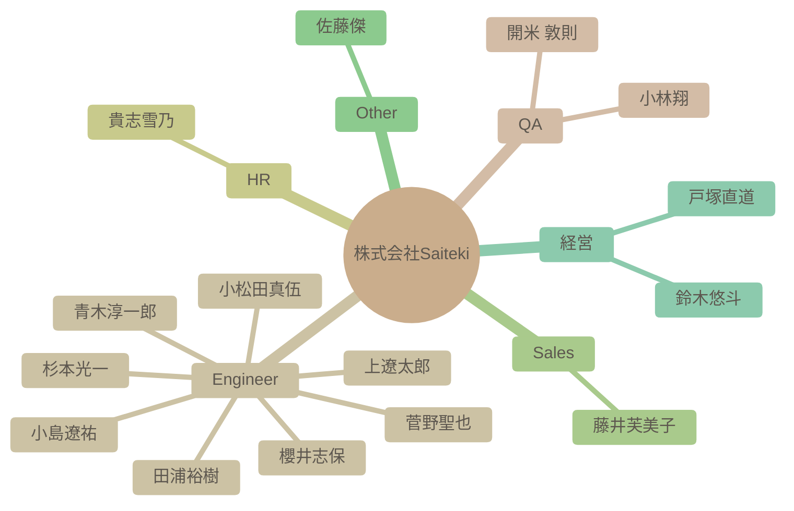

# チーム構成図

自動生成された組織図です。Issueによる更新が反映されます。

## 詳細リスト

| 名前 | 職種 | 得意スキル (Tags) | 興味 (Interests) | 目標 (Goal) | 人柄 (Personality) |
| --- | --- | --- | --- | --- | --- |
| 杉本光一 | Engineer | - | - | - | - |
| 青木淳一郎 | Engineer | AWS, インフラ設計, インフラ構築 | Youtube (ざっくりYoutube), ドライブ, 家族と過ごすこと | Azure, Google Cloudの経験を積む。Saitekiの輪を広げる。 | 協調性, コミュニケーション能力, 親しみやすい |
| 小林翔 | QA | テスター, 進行管理 | メダルゲーム, 旅行, ゲーム, アニメ | 仲良くしながら一緒に成長 | 協調性 |
| 櫻井志保 | Engineer | Power BI, データ分析, データ加工, データ集計 | YouTube, ゲーム配信, お笑い番組鑑賞 | 資格取得を目指し、データベース構築など専門的な分野に挑戦する | 積極的,コミュニケーション重視,謙虚 |
| 田浦裕樹 | Engineer | アジャイル開発, チーム立ち上げ, 設計・実装の品質改善, Android開発(Java/Kotlin), PL, アーキテクト | AI, 音楽鑑賞, 子供の応援, ビール, ワイン, ラーメン | 技術に裏打ちされた温かみのある仕事を目指す | 温かみがある |
| 開米 敦則 | QA | テスト計画, テスト設計, 進捗管理, プロセス改善, QAエンジニアリング, 営業, 販売 | ガンプラ, ペットの飼育(羽衣セキセイインコ, オカメインコ), 旅行(城めぐり, 城下町散策, 百名城スタンプ・御城印集め), スポーツ観戦(野球, サッカー, バスケ, 陸上, テニス, F1, ラグビー) | AIを活用した新しいテストの形にチャレンジする | 協調性, 真面目, 多趣味, 家族思い |
| 貴志雪乃 | HR | 保育補助, スカウト送付 | 鬼滅の刃, 洋画鑑賞, フルーツ, お刺身, 子供と遊ぶ | 精一杯努める | 誠実 |
| 上遼太郎 | Engineer | VB.NET, Python, LINUX, JP1, SAP | ビリヤード, 飲み会, 海外旅行, AI駆動開発 | 新しいことに挑戦していきたい | 積極的, 好奇心旺盛, コミュニケーション好き |
| 小松田真伍 | Engineer | Java, Webアプリ開発, スマホアプリ開発, バックエンド開発, フロントエンド開発, DB, WindowsServer管理, Salesforce, 開発請負 | バッティングセンター, スポッチャ, 飲み会, 地域活性化(屋久島) | 経験を活かした自分なりの最適を還元 | 社交的, 多趣味, 熱意がある, 謙虚 |
| 小島遼祐 | Engineer | - | - | - | - |
| 藤井芙美子 | Sales | - | - | - | - |
| 菅野聖也 | Engineer | - | - | - | - |
| 佐藤傑 | Other | (AI解析待ち/失敗) | - | ◼︎出身地：... | - |
| 鈴木悠斗 | 経営 | 営業, 大規模PJのPL, インフラ・セキュリティエンジニア, SES営業部立ち上げ, 経営 | キングダムのアニメ, 寿司, 家系ラーメン, 動画鑑賞, ゴルフ, サウナ, 家族と買い物 | 会社と共に成長し、皆が幸せになれるよう事業に全力で取り組む | 熱い、成長意欲 |
| 戸塚直道 | 経営 | 営業, 事業開発, M&A仲介, 新規事業立ち上げ | ジム, サウナ, ランニング, 筋トレ, トライアスロン, 仕事 | 日本のIT産業の構造を変革し、エンジニアの経済環境・待遇を改善する | 情熱的 |
