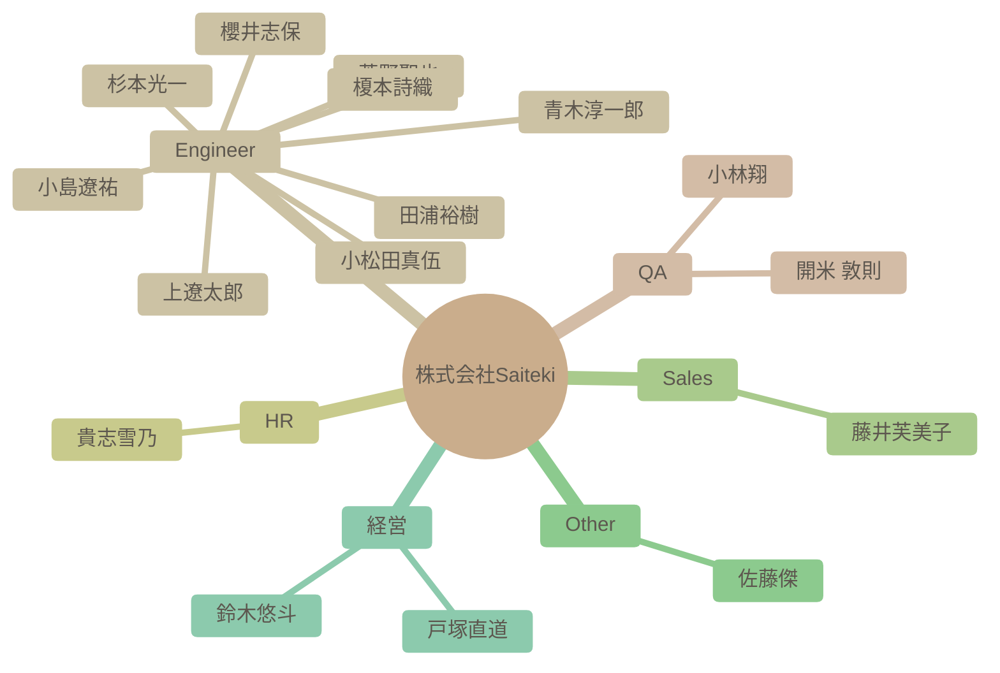

# チーム構成図

自動生成された組織図です。IssueおよびSlack連携による高度なAI分析結果が反映されます。

### 組織マップ

## 社員一覧サマリー

| 名前 | 職種 | 性格傾向 (概略) | 現在の状態 |
| --- | --- | --- | --- |
| [杉本光一](#%E6%9D%89%E6%9C%AC%E5%85%89%E4%B8%80) | Engineer | 開放性、協調性、外向性が高く、学習意欲も旺盛。AI技術への強い関心に加え、周囲への貢献意欲や共感性がうかがえる。 | AI技術への関心が高く、自己成長とチームへの貢献を強く意識している。業務負荷は状況により変動するものの、全体的に前向きな姿勢を維持している。 |
| [青木淳一郎](#%E9%9D%92%E6%9C%A8%E6%B7%B3%E4%B8%80%E9%83%8E) | Engineer | 協調性が高く、新しい知識や経験に対して積極的な姿勢を持つ。楽観的で社交的な性格で、周囲とのコミュニケーションを積極的に行う。 | 現在は業務負荷が高い時期もあるが、Saitekiのメンバーとの出会いを喜び、来年への期待を抱いている。新しい環境でスキルアップを目指している。 |
| [小林翔](#%E5%B0%8F%E6%9E%97%E7%BF%94) | QA | 開放性と協調性が高く、外向性も平均以上。新しい経験や人との交流を楽しみ、チームワークを重視する傾向がある。 | 新しい職場に期待を抱き、周囲との良好な関係を築こうと積極的に行動している。入社を控え、期待と意欲に満ちている様子。 |
| [櫻井志保](#%E6%AB%BB%E4%BA%95%E5%BF%97%E4%BF%9D) | Engineer | 自己認識が高く、協調性があり、学習意欲も高い。新しい環境への適応力も期待できる。謙虚で丁寧な印象を与える。 | 入社を控えており、新しい環境への期待感と意欲に満ち溢れている。チームの一員として貢献したいという気持ちが強い。 |
| [田浦裕樹](#%E7%94%B0%E6%B5%A6%E8%A3%95%E6%A8%B9) | Engineer | 協調性が高く、誠実で、周囲への気配りを忘れない。また、ユーモアがあり、親しみやすい。 | 現在はAndroid TVアプリ開発チームでPoCの立ち上げフェーズに注力しており、クライアントとの要件定義・調整に力を入れている様子。テレワークも活用し、柔軟に対応している。 |
| [開米 敦則](#%E9%96%8B%E7%B1%B3%20%E6%95%A6%E5%89%87) | QA | 協調性が高く、学習意欲旺盛で、趣味も多彩。新しい環境にも積極的に適応しようとする。 | 新しい職場環境に積極的に適応しようとしており、AI技術を活用した業務改善に意欲的。コミュニケーションも円滑で、チームへの貢献を意識している。 |
| [貴志雪乃](#%E8%B2%B4%E5%BF%97%E9%9B%AA%E4%B9%83) | HR | 協調性が高く、周囲への気配りができる、バランスの取れた人物です。新しい情報に対する関心も高く、ポジティブで明るい印象を与えます。 | 新しい情報を積極的に共有し、組織への貢献意欲も高く、全体的にポジティブな状態にある。採用担当としても意欲的に業務に取り組んでいる。オンライン部活の企画や勉強会の開催など、積極的に活動している。 |
| [上遼太郎](#%E4%B8%8A%E9%81%BC%E5%A4%AA%E9%83%8E) | Engineer | 協調性が高く、学習意欲旺盛。周囲への感謝を忘れず、新しい技術への関心も高い。 | 共有された情報から積極的に学び、自身のスキルアップに繋げようとしている。チームメンバーのスキルを高く評価し、感謝の気持ちを伝えている。AI技術を活用した開発に強い関心を持っている。 |
| [小松田真伍](#%E5%B0%8F%E6%9D%BE%E7%94%B0%E7%9C%9F%E4%BC%8D) | Engineer | 新しい技術や知識の習得に積極的で、それを組織に還元しようとする意識が高い。協調性を重んじ、周囲とのコミュニケーションも円滑に行う。自身の経験に基づいた問題意識も持ち合わせている。 | 組織への貢献意欲が非常に高く、新しい技術を積極的に学習し、それを組織に共有しようとしている。業務効率化やナレッジ共有に強い関心を持っている。 |
| [小島遼祐](#%E5%B0%8F%E5%B3%B6%E9%81%BC%E7%A5%90) | Engineer | 協調性が高く、新しい知識や経験に対する好奇心が旺盛。謙虚で、周囲への感謝を忘れない。 | 新しい職場環境に積極的に馴染もうとしており、良好な人間関係を築きながら、仕事に貢献しようと意欲的に取り組んでいる。周囲への感謝の気持ちを忘れない。 |
| [藤井芙美子](#%E8%97%A4%E4%BA%95%E8%8A%99%E7%BE%8E%E5%AD%90) | Sales | 共感力が高く、親しみやすい人柄。新しいことへの興味も持ち、積極的に学ぼうとする姿勢が見られる。 | 新しい職場環境に積極的に適応しようとしており、周囲とのコミュニケーションを楽しんでいる。仕事とプライベートのバランスも考慮しながら、充実した日々を送っている様子。 |
| [菅野聖也](#%E8%8F%85%E9%87%8E%E8%81%96%E4%B9%9F) | Engineer | 好奇心旺盛で、協調性があり、新しい技術や知識の吸収に積極的。ユーモアのセンスも持ち合わせている。 | 入社を控え、開発者としての勘を取り戻しつつ、チームに貢献できることを楽しみにしている。AI技術への関心が高く、業務への活用を模索している。 |
| [佐藤傑](#%E4%BD%90%E8%97%A4%E5%82%91) | Other | 外向的で好奇心旺盛、協調性も高く、新しいことに積極的に挑戦する。知的好奇心と行動力を兼ね備えている。 | 海外を拠点に活動し、グローバルな視点での事業展開を模索している。新しいAI技術への関心も高く、積極的に情報収集を行っている。 |
| [鈴木悠斗](#%E9%88%B4%E6%9C%A8%E6%82%A0%E6%96%97) | 経営 | 社交的で協調性を重視する性格。新しい技術や知識への好奇心も持ち合わせている。周囲への感謝と評価を忘れず、チームワークを重視する。 | 周囲とのコミュニケーションを楽しみながら、業務に取り組んでいる様子がうかがえる。チームメンバーの活躍を喜ぶなど、良好な関係性を築いている。生成AIや新しい技術に強い関心を持ち、業務効率化や新しい価値創造に繋げようとしている。 |
| [戸塚直道](#%E6%88%B8%E5%A1%9A%E7%9B%B4%E9%81%93) | 経営 | 非常に外向的で協調性が高く、誠実な人物。周囲を巻き込み、組織を盛り上げようとする意識が強い。新しい経験や知識に対してオープンであり、変化を恐れない。 | 引き続き非常に良好な状態を維持している。複数のプロジェクトに関わっており、多忙ではあるものの、高いモチベーションを維持している。チームメンバーのサポートや組織運営にも積極的に関わっている。特に、業界構造の変革に対する意欲が高い。 |
| [榎本詩織](#%E6%A6%8E%E6%9C%AC%E8%A9%A9%E7%B9%94) | Engineer | 開放的で協調性があり、新しい知識を積極的に取り入れようとする姿勢が見られる。ユーモアがあり、親しみやすい。 | 入社を前に期待と意欲に満ち溢れている。積極的にコミュニケーションを取り、周囲との関係構築に努めている。 |

---

## 詳細プロフィール

各社員の詳細な分析結果です。クリックして展開できます。

### 杉本光一 (Engineer)

> **総合サマリー**: 杉本さんは、AI技術への高い関心と貢献意欲を持ち、チームワークを重視する協調性のあるエンジニア。課題解決への意欲も高く、周囲への気配りもできる。

<b>🛠 性格傾向</b>

**要約**: 開放性、協調性、外向性が高く、学習意欲も旺盛。AI技術への強い関心に加え、周囲への貢献意欲や共感性がうかがえる。

| 項目 | スコア | 根拠・エピソード |
| --- | --- | --- |
| 開放性 (Openness) | 9/10 | AI技術（Gemini, RAG, Antigravityなど）に関する深い知識と強い興味を示す。技術的な課題に対して積極的に調査・検討を行う。 |
| 誠実性 (Conscientiousness) | 8/10 | AI開発ガイドラインの作成や、チームの作業効率化のための提案など、組織的な課題解決に貢献しようとする。タスク管理や進捗確認を丁寧に行う。 |
| 外向性 (Extraversion) | 8/10 | 新しいメンバーに積極的に挨拶し、質問や意見交換を通じてコミュニケーションを図ろうとする。社内外のイベントや技術交流にも関心を持つ。 |
| 協調性 (Agreeableness) | 9/10 | 丁寧な言葉遣いで相手を尊重し、質問を通じて会話を円滑に進めようとする。感謝の気持ちを頻繁に表現する。他者の状況を気遣う発言が多い。 |
| 神経症的傾向 (Neuroticism) | 3/10 | 発言全体を通して、不安や否定的な感情はほとんど見られない。前向きで積極的な姿勢がうかがえる。困難な状況でも冷静に解決策を模索する。 |

<b>💪 仕事スタイルと強み</b>

**要約**: チームワークを重視し、学習意欲が高く、得た知識やツールを共有することでチームに貢献しようとする。AI技術を活用した業務効率化に強い関心を持つ。

**問題解決スタイル**: AI技術に関する課題に対し、技術記事やドキュメントを参照し、具体的な解決策を提案する。Antigravityのようなツールを積極的に活用し、効率的な開発プロセスを構築しようとする。

**主要な強み**: コミュニケーション能力, 学習意欲, チームワーク

**証拠エピソード**:
- AI技術に関する記事を共有し、チームメンバーの知識向上に貢献する。
- NotionやGitHub Wikiなどを活用し、ナレッジ共有の仕組みを構築する。
- チームメンバーのタスク進捗を丁寧に確認し、必要に応じてサポートを提供する。

<b>💎 価値観とモチベーター</b>

**要約**: チームワーク、自己成長、技術革新を重視する。他者との交流や新しい発見からモチベーションを得る。会社やチームの成功に貢献したいという強い意欲を持つ。

**コアバリュー**: チームワーク, 自己成長, 技術革新

**モチベーショントリガー**: 他者との交流, 新しい発見, 自己成長の機会

**証拠エピソード**:
- 書籍購入補助制度を活用し、自己成長を促進する。
- 新しいAI技術を積極的に試し、チームに共有する。
- チームの課題解決に積極的に参加し、貢献する。

<b>📈 現在の状態</b>

**要約**: AI技術への関心が高く、自己成長とチームへの貢献を強く意識している。業務負荷は状況により変動するものの、全体的に前向きな姿勢を維持している。

- **感情レベル**: positive
- **業務負荷状況**: 多忙だが、タスク管理を徹底し、効率的に業務を進めている様子。状況により業務負荷が変動する。
- **最近の関心トピック**: AI技術（Gemini, RAG, Antigravityなど）, AI開発ガイドライン, チームの作業効率化

---

### 青木淳一郎 (Engineer)

> **総合サマリー**: 佐賀県出身、福岡在住のAWS基盤エンジニア。多趣味で学習意欲が高く、協調性を重視する社交的な人物。Saitekiへの貢献意欲も高い。

<b>🛠 性格傾向</b>

**要約**: 協調性が高く、新しい知識や経験に対して積極的な姿勢を持つ。楽観的で社交的な性格で、周囲とのコミュニケーションを積極的に行う。

| 項目 | スコア | 根拠・エピソード |
| --- | --- | --- |
| 開放性 (Openness) | 8/10 | AzureやGoogle CloudといったAWS以外の技術にも関心を示し、AIについても学びたいという意欲を見せている。 |
| 誠実性 (Conscientiousness) | 7/10 | 納品が近い時期にはイベントへの参加を見送るなど、責任感の強さが見られる。BIツール学習に苦戦しながらも、業務に取り組んでいる。 |
| 外向性 (Extraversion) | 8/10 | 自己紹介を丁寧に行い、初対面の相手にも積極的にコミュニケーションを取ろうとする。趣味の話題で共感し、パパ会を提案するなど交流を深めようとしている。 |
| 協調性 (Agreeableness) | 9/10 | 相手の発言に対して肯定的な反応を示し、感謝の言葉を述べるなど、協調的な姿勢が顕著である。 |
| 神経症的傾向 (Neuroticism) | 3/10 | ネガティブな感情表現は少ない。近所にサルが出没した際には驚きを表現しているが、全体的にポジティブな発言が多い。 |

<b>💪 仕事スタイルと強み</b>

**要約**: AWS基盤のインフラ設計・構築経験を持ち、新しい技術への学習意欲も高い。チームワークを重視し、協力的な姿勢で業務に取り組む。

**問題解決スタイル**: BIツールのような未経験領域でも、積極的に情報収集や協力を仰ぎながら解決策を模索する。

**主要な強み**: インフラ設計・構築スキル, 学習意欲, コミュニケーション能力

**証拠エピソード**:
- AWS基盤のインフラ設計・構築の経験を持つ。
- AIやBIツールなど、新しい技術の学習に意欲的である。
- Slackでの積極的なコミュニケーションを通じて、チームメンバーとの関係構築を図っている。

<b>💎 価値観とモチベーター</b>

**要約**: 家族との時間を大切にし、仕事を通じてスキルアップを目指している。チームへの貢献意欲も高く、組織の一員としての意識も強い。

**コアバリュー**: 家族, 成長, 貢献

**モチベーショントリガー**: 新しい技術の習得, チームへの貢献, 自己成長

**証拠エピソード**:
- 休日の過ごし方として家族との時間を大切にしている。
- 未経験領域への挑戦を通じてスキルの幅を広げたいと考えている。
- Saitekiの輪を広げていきたいという発言から、組織への貢献意欲が伺える。

<b>📈 現在の状態</b>

**要約**: 現在は業務負荷が高い時期もあるが、Saitekiのメンバーとの出会いを喜び、来年への期待を抱いている。新しい環境でスキルアップを目指している。

- **感情レベル**: positive
- **業務負荷状況**: 納品が近いこともあり、業務負荷が高い。
- **最近の関心トピック**: Saitekiメンバーの入社経緯, 京都旅行

---

### 小林翔 (QA)

> **総合サマリー**: 小林翔さんは、協調性があり、新しい環境への適応能力が高い人物。趣味が多岐にわたり、周囲との共通点を見つけやすい。

<b>🛠 性格傾向</b>

**要約**: 開放性と協調性が高く、外向性も平均以上。新しい経験や人との交流を楽しみ、チームワークを重視する傾向がある。

| 項目 | スコア | 根拠・エピソード |
| --- | --- | --- |
| 開放性 (Openness) | 9/10 | 旅行やゲームなど多趣味であり、特にローグライクゲームへの熱中や、北海道グルメへの関心から、新しい経験や知識への強い探求心がうかがえる。 |
| 誠実性 (Conscientiousness) | 7/10 | 13年間のテスター経験と進行管理の経験から、責任感と計画性があり、几帳面な一面も持ち合わせていると考えられる。 |
| 外向性 (Extraversion) | 7/10 | 自己紹介で年齢の近い人が多いことに触れ、親睦を深めたいという意欲を示している。また、ゲーム部創設への参加意欲からも、他人との交流を好む傾向がわかる。 |
| 協調性 (Agreeableness) | 9/10 | 丁寧な自己紹介や、他の社員の趣味や好みに共感する発言から、協調性が高く、周囲との調和を大切にする。ゲーム部創設への参加意欲も、集団への貢献意欲を示している。 |
| 神経症的傾向 (Neuroticism) | 3/10 | 全体的にポジティブな発言が多く、ネガティブな感情を露わにすることは少ない。周囲に好印象を与えようとする姿勢が見られる。 |

<b>💪 仕事スタイルと強み</b>

**要約**: 協調性があり、コミュニケーション能力が高く、長年のテスター経験から問題発見能力に優れる。新しい知識の吸収にも積極的。

**問題解決スタイル**: 過去の経験から得た知識を活用し、論理的に問題を解決する。テスターとしての経験から、細部にも注意を払い、潜在的なリスクを早期に発見する。

**主要な強み**: テスト経験, コミュニケーション能力, 情報収集力

**証拠エピソード**:
- 13年間のテスター経験から、問題点を見つけ出す能力が高いと考えられる。
- 他の社員の趣味や好みに共感し、積極的に会話に参加している。
- 北海道のグルメ情報に興味を示し、積極的に情報収集を行っている。

<b>💎 価値観とモチベーター</b>

**要約**: 成長、繋がり、楽しさ、経験を重視する。新しい知識やスキルを習得すること、他人との良好な関係を築くこと、楽しい経験をすることがモチベーションの源泉となる。

**コアバリュー**: 成長, 協調, 楽しさ

**モチベーショントリガー**: 新しい知識の習得, チームへの貢献, 楽しい経験

**証拠エピソード**:
- 自己紹介で「一緒に成長できたら嬉しい」と述べていることから、成長意欲が高い。
- ゲーム部の創設に意欲を示すことから、チームへの貢献意欲が高い。
- 趣味の話題を楽しそうに語っていることから、楽しい経験がモチベーションにつながる。

<b>📈 現在の状態</b>

**要約**: 新しい職場に期待を抱き、周囲との良好な関係を築こうと積極的に行動している。入社を控え、期待と意欲に満ちている様子。

- **感情レベル**: positive
- **業務負荷状況**: 入社前であり、業務負荷は低いと考えられる。
- **最近の関心トピック**: ゲーム（メダルゲーム、ローグライク）, 北海道グルメ

---

### 櫻井志保 (Engineer)

> **総合サマリー**: 櫻井志保さんは、データ分析スキルを活かし、学習意欲とコミュニケーション能力を発揮して活躍することが期待される人物です。

<b>🛠 性格傾向</b>

**要約**: 自己認識が高く、協調性があり、学習意欲も高い。新しい環境への適応力も期待できる。謙虚で丁寧な印象を与える。

| 項目 | スコア | 根拠・エピソード |
| --- | --- | --- |
| 開放性 (Openness) | 8/10 | データ分析など専門分野への挑戦意欲や、資格取得を目指す姿勢から、新しい知識や経験に対して積極的であることが伺える。 |
| 誠実性 (Conscientiousness) | 7/10 | 自己紹介で業務内容や趣味について丁寧に記述しており、責任感と几帳面さが見られる。データ集計業務の経験からも計画性と正確性が推測できる。 |
| 外向性 (Extraversion) | 6/10 | Slackを通じた積極的なコミュニケーションを希望しており、周囲との連携を重視する姿勢が見られる。自己紹介も丁寧で、相手に良い印象を与えようという意識が感じられる。 |
| 協調性 (Agreeableness) | 9/10 | 自己紹介で丁寧な言葉遣いを心掛けており、協調性を重視する姿勢が伺える。謙虚な姿勢も見られ、周囲との良好な関係を築こうとする意識が感じられる。 |
| 神経症的傾向 (Neuroticism) | 3/10 | 自己紹介の内容から、不安や心配を感じやすいといった傾向は見られない。むしろ、新しい環境への期待感や前向きな姿勢が感じられる。 |

<b>💪 仕事スタイルと強み</b>

**要約**: データ分析スキルを持ち、学習意欲が高く、自ら課題を見つけて改善に取り組むタイプ。コミュニケーション能力も高く、チームワークを重視する。

**問題解決スタイル**: データに基づいた分析と、論理的な思考で問題を解決するアプローチを取る。

**主要な強み**: データ分析, コミュニケーション, 学習意欲

**証拠エピソード**:
- Power BIを用いたデータ分析・加工の経験
- データベース構築などより専門的な分野への挑戦意欲
- Slackを通じた積極的なコミュニケーションへの意欲

<b>💎 価値観とモチベーター</b>

**要約**: 成長と貢献を重視し、新しい知識やスキルを習得することに喜びを感じる。チームワークを重視し、周囲との協調関係を築くことを大切にする。

**コアバリュー**: 成長, 貢献, 協調性

**モチベーショントリガー**: 新しい知識やスキルの習得, 専門性の向上, チームへの貢献

**証拠エピソード**:
- 資格取得を目指す姿勢
- データベース構築など専門分野への挑戦意欲
- Slackを通じた積極的なコミュニケーションへの意欲

<b>📈 現在の状態</b>

**要約**: 入社を控えており、新しい環境への期待感と意欲に満ち溢れている。チームの一員として貢献したいという気持ちが強い。

- **感情レベル**: positive
- **業務負荷状況**: 新規入社のため、業務負荷は不明
- **最近の関心トピック**: データ分析, データベース構築, 資格取得

---

### 田浦裕樹 (Engineer)

> **総合サマリー**: 田浦裕樹は、豊富な経験と高い技術力を持ち、チームへの貢献意欲が強く、周囲との協調を大切にするエンジニアである。AI技術への関心も高く、学習意欲も旺盛。

<b>🛠 性格傾向</b>

**要約**: 協調性が高く、誠実で、周囲への気配りを忘れない。また、ユーモアがあり、親しみやすい。

| 項目 | スコア | 根拠・エピソード |
| --- | --- | --- |
| 開放性 (Openness) | 9/10 | 新しい技術（AI）の学習に意欲的であり、要件定義に関するガイドラインなど、有益な情報をチームに共有する。また、ゴッホ展に足を運ぶなど、芸術への関心も高い。 |
| 誠実性 (Conscientiousness) | 8/10 | PoCの立ち上げフェーズにおいて、タスクを分解し優先順位付けを行い、計画的にプロジェクトを進めている。また、進捗状況を共有する。日々の業務をこなしつつ、AI技術の標準化にも取り組む。 |
| 外向性 (Extraversion) | 7/10 | チームメンバーとのコミュニケーションを重視し、積極的に意見交換や情報共有を行っている。他者の投稿に積極的に反応し、感謝の言葉を述べている。社内外問わず多くの人と交流がある。 |
| 協調性 (Agreeableness) | 9/10 | 他者の意見を尊重し、感謝の意を伝えることが多い。チームメンバーの状況を気遣い、荒天時の影響を心配するなど、思いやりがある。周囲のメンバーを励ますなど、協調性を重視する。 |
| 神経症的傾向 (Neuroticism) | 4/10 | 業務負荷が高い状況でも冷静に対応し、計画的にタスクを進めている様子が見られる。突発的なテレワークにも柔軟に対応している。おみくじで凶を引いた子供を励ますなど、精神的な安定性が見られる。 |

<b>💪 仕事スタイルと強み</b>

**要約**: AI技術を活用した開発に強みを持ち、チームを円滑に動かすための調整能力にも長けている。PoCの立ち上げや要件定義も得意。

**問題解決スタイル**: PoCにおいて、最初に全てを決め切らず、仮説を立て、クライアントとのすり合わせを重ねながら、アジャイル的に進めることを重視する。

**主要な強み**: AI技術を活用した開発, チームコミュニケーション, 要件定義・整理, PoCの推進

**証拠エピソード**:
- PoCの進捗状況を共有し、進め方のポイントを解説することで、チーム全体のレベルアップに貢献しようとしている。
- 過去の経験から、品質改善やチーム立ち上げに貢献できる。また、顧客のニーズを的確に捉え、顧客を安心させることを重視する。

<b>💎 価値観とモチベーター</b>

**要約**: チームへの貢献、技術的な成長、顧客の成功を重視する。自身の知識や経験を共有することで、チーム全体のレベルアップに貢献したいと考えている。

**コアバリュー**: チームワーク, 継続的な学習, 顧客満足, 貢献

**モチベーショントリガー**: チームメンバーからの感謝, プロジェクトの成功, 新しい技術の習得, 顧客からの肯定的なフィードバック

**証拠エピソード**:
- 勉強会のフィードバックに胸を熱くしており、自身の知識や経験がチームに貢献できたことを喜んでいる。
- 若手メンバーの成長を支援することにやりがいを感じ、積極的に知識や経験を共有する。自身の経験や知識を共有することでチームに貢献したいと考えている。

<b>📈 現在の状態</b>

**要約**: 現在はAndroid TVアプリ開発チームでPoCの立ち上げフェーズに注力しており、クライアントとの要件定義・調整に力を入れている様子。テレワークも活用し、柔軟に対応している。

- **感情レベル**: positive
- **業務負荷状況**: やや高め。複数のPoCを並行して進めており、クライアントとの要件定義やタスク整理に時間を割いている。また、AI技術のキャッチアップやチームへの情報共有も行っている。
- **最近の関心トピック**: PoC (Proof of Concept), 要件定義, Android TVアプリ開発, AI駆動開発

---

### 開米 敦則 (QA)

> **総合サマリー**: 開米敦則氏は、QAエンジニアとしての経験豊富で、AI技術への関心も高く、学習意欲も旺盛。協調性があり、チームへの貢献を重視する。

<b>🛠 性格傾向</b>

**要約**: 協調性が高く、学習意欲旺盛で、趣味も多彩。新しい環境にも積極的に適応しようとする。

| 項目 | スコア | 根拠・エピソード |
| --- | --- | --- |
| 開放性 (Openness) | 9/10 | 新しいAIツール（Google AI Proなど）への興味を示し、積極的に試そうとする姿勢が見られる。また、ガンプラや城巡りなど、多岐にわたる趣味を持つ。 |
| 誠実性 (Conscientiousness) | 8/10 | 作業履歴ページを作成し、アップデート箇所を明示するなど、情報共有に対する責任感の強さがうかがえる。また、会議に遅れないよう時間を確認したり、ミュート解除のトラブルに丁寧に謝罪したりする。 |
| 外向性 (Extraversion) | 5/10 | 自己紹介で自身の情報を詳細に共有したり、趣味の話で他のメンバーとの交流を試みたりするなど、積極的にコミュニケーションを取ろうとする姿勢が見られる。ただし、大人数での交流よりも、少人数での意見交換を好む傾向がある。 |
| 協調性 (Agreeableness) | 9/10 | 相手の意見や提案に対して肯定的な反応を示し、感謝の言葉を述べるなど、協調性を重視する姿勢が見られる。また、作業履歴に対するフィードバックを求め、改善意欲も示す。 |
| 神経症的傾向 (Neuroticism) | 4/10 | 会議でのミュート解除のトラブルや、土曜日のMTG時間に対する懸念など、几帳面で責任感が強いことが伺える。ただし、過度な心配性というわけではない。 |

<b>💪 仕事スタイルと強み</b>

**要約**: QAエンジニアとしての経験を活かし、AI技術を積極的に業務に取り入れようとしている。問題解決能力が高く、自律的に行動できる。

**問題解決スタイル**: AI技術の特性を理解し、各フェーズに最適なツールを検討することで、効率的な問題解決を目指す。仮説を立て、検証するアプローチを重視する。

**主要な強み**: QAエンジニアリングの知識, AI技術の知識, 問題解決能力

**証拠エピソード**:
- 複数のテスト自動化ツールを比較検討し、各ツールの得意分野に基づいて最適な組み合わせを提案している。
- Chat GPTとGeminiを用いてテスト計画を行い、プロンプトのフォーマットの重要性を指摘している。
- 作業履歴ページを作成し、関係者への情報共有を円滑にしている。

<b>💎 価値観とモチベーター</b>

**要約**: 効率性、学習意欲、貢献意欲を重視している。新しい技術を積極的に学び、業務に役立てることにモチベーションを感じる。チームや組織への貢献を重視する。

**コアバリュー**: 効率性, 学習, 貢献

**モチベーショントリガー**: 新しい技術への挑戦, 業務効率の改善, チームへの貢献

**証拠エピソード**:
- AIツールに関する知識を共有し、業務への適用を提案している。
- アップデート履歴ページを作成し、チームへの情報共有を促進している。
- 自己紹介で自身のスキルや経験をアピールし、チームに貢献したいという意欲を示している。

<b>📈 現在の状態</b>

**要約**: 新しい職場環境に積極的に適応しようとしており、AI技術を活用した業務改善に意欲的。コミュニケーションも円滑で、チームへの貢献を意識している。

- **感情レベル**: positive
- **業務負荷状況**: 標準的な業務負荷。自律的にタスクをこなせる。
- **最近の関心トピック**: AIを活用したテスト自動化, テスト自動化ツールの比較検討, プロンプトエンジニアリング

---

### 貴志雪乃 (HR)

> **総合サマリー**: 貴志雪乃さんは、協調性があり、丁寧なコミュニケーションを心がける人物です。組織への貢献意欲が高く、学習意欲も旺盛です。

<b>🛠 性格傾向 (Personality Traits)</b>

**要約**: 協調性が高く、周囲への気配りができる、バランスの取れた人物です。新しい情報に対する関心も高く、ポジティブで明るい印象を与えます。

| 項目 | スコア | 根拠・エピソード |
| --- | --- | --- |
| 開放性 (Openness) | 9/10 | 上場企業の社長との対談動画や生成AIに関するレポートを共有するなど、情報感度が高い。また、自身が企画・準備に携わった勉強会のレポートを共有している。 |
| 誠実性 (Conscientiousness) | 8/10 | 勉強会の企画・準備に積極的に参加し、レポート作成も行うなど、組織のために貢献しようとする姿勢が見られる。オンライン飲み会の企画も行っており、タスクをきちんとこなしている。 |
| 外向性 (Extraversion) | 7/10 | 自己紹介を丁寧に行い、オンライン飲み会の企画を積極的に行うなど、周囲との交流を重視している。他の人の発言に積極的に反応し、共感や感謝の言葉を述べている。 |
| 協調性 (Agreeableness) | 9/10 | 初対面の人に対して丁寧な挨拶を心がけている。勉強会の企画に協力したメンバーへの感謝を述べるなど、周囲への気配りができる。他のメンバーの投稿に共感的なコメントを送っている。 |
| 神経症的傾向 (Neuroticism) | 3/10 | 全体的にポジティブな発言が多く、ストレスを感じている様子は見られない。落ち着いており、感情の起伏が少ない。映画を観て複雑な気持ちになったことを述べているが、全体的には安定している。 |

<b>💪 仕事タイルと強み (Work Styles & Strengths)</b>

**要約**: 積極的に情報収集・共有し、周りを巻き込みながら業務を推進するタイプです。丁寧な仕事ぶりで、周囲からの信頼も厚いでしょう。採用担当としての役割も積極的にこなしています。

**問題解決スタイル**: 情報収集と共有を重視し、周囲の意見を参考にしながら解決策を探る。勉強会を開催し、参加者の意見を収集・反映させている。

**主要な強み**: 情報収集力, 企画力, コミュニケーション力

**証拠エピソード**:
- 勉強会のレポートを作成し、内容をわかりやすくまとめている。
- オンライン飲み会の企画を立案し、参加を促している。
- 新着YouTube動画を共有し、メンバーに新しい情報を提供している。
- オンライン部活企画を立案し、意見を募集している。

<b>💎 価値観とモチベーター (Values & Motivators)</b>

**要約**: 組織への貢献、新しい知識の習得、周囲との良好な関係構築を重視している。自身の成長と組織の成長を重ねて考えている。メンバーの貢献を認め、感謝の気持ちを伝えることを大切にしている。

**コアバリュー**: 貢献, 成長, 協調

**モチベーショントリガー**: 新しい知識や技術の習得, 組織への貢献, 周囲からの感謝

**証拠エピソード**:
- 勉強会レポートの作成を通して、組織に貢献しようとしている。
- 新着YouTube動画の共有を通して、メンバーに新しい情報を提供しようとしている。
- オンライン飲み会の企画を通して、メンバー間の交流を促進しようとしている。
- 採用担当として、自己紹介を行い、組織に貢献しようとしている。

<b>📈 現在の状態 (Current State)</b>

**要約**: 新しい情報を積極的に共有し、組織への貢献意欲も高く、全体的にポジティブな状態にある。採用担当としても意欲的に業務に取り組んでいる。オンライン部活の企画や勉強会の開催など、積極的に活動している。

- **感情レベル**: positive
- **業務負荷状況**: 平均的な業務負荷
- **最近の関心トピック**: 生成AI, YouTube動画, オンラインイベント, 採用, 映画

---

### 上遼太郎 (Engineer)

> **総合サマリー**: 上遼太郎さんは、学習意欲が高く、周囲との協調性を重視する人物。新しい技術への関心と、チームへの貢献意欲が強い。

<b>🛠 性格傾向 (Personality Traits)</b>

**要約**: 協調性が高く、学習意欲旺盛。周囲への感謝を忘れず、新しい技術への関心も高い。

| 項目 | スコア | 根拠・エピソード |
| --- | --- | --- |
| 開放性 (Openness) | 9/10 | Stagewiseなどの新しい技術に触れることにワクワクしており、AI駆動開発に向けた調査を積極的に行っている。フリーレンなどの話題にも関心を示す。 |
| 誠実性 (Conscientiousness) | 7/10 | 定例会用の備忘録を作成し、Stagewiseを使用した感想をまとめるなど、タスクに対して真面目に取り組む姿勢が見られる。設計書を作成し、AIが理解しやすい指示を模索するなど、効率化も意識している。 |
| 外向性 (Extraversion) | 6/10 | 初対面の社員にも積極的に挨拶し、共通の話題で盛り上げようとする。飲み会が好きで、社員との交流を積極的に求めている。 |
| 協調性 (Agreeableness) | 9/10 | 共有された情報への感謝を伝え、他者のスキルや知識を認め、学ぼうとする姿勢から、協調性の高さが伺える。チームメンバーへの気遣いも忘れない。 |
| 神経症的傾向 (Neuroticism) | 3/10 | 困難に直面しても冷静に対処しようとし、ネガティブな感情を表に出すことは少ない。業務が立て込んでいても、前向きに取り組もうとしている。 |

<b>💪 仕事タイルと強み (Work Styles & Strengths)</b>

**要約**: 他者の優れた点を吸収し、自身のスキルアップに繋げようとする。学習意欲が高く、情報収集能力に優れ、設計書作成にも意欲的。

**問題解決スタイル**: 自ら手を動かすだけでなく、周囲の知識や経験から学び、問題解決のヒントを得ようとする。AIを活用した開発にも積極的に取り組む。

**主要な強み**: 学習意欲, 情報収集, 協調性

**証拠エピソード**:
- 商談動画から営業スキルを学ぼうとしている。
- Letter of Tの内容を勉強になったと述べている。
- 田浦さんの要件伝達スキルを参考にしようとしている。
- 設計書を作成し、AIが理解しやすい指示を模索している。

<b>💎 価値観とモチベーター (Values & Motivators)</b>

**要約**: 学習、成長、貢献を重視する傾向がある。他者のスキルから学び、自身の成長に繋げることにやりがいを感じる。チームへの貢献意欲も高い。

**コアバリュー**: 学習, 成長, 貢献

**モチベーショントリガー**: 新しい知識の習得, スキルアップ, チームへの貢献, 技術的な課題への挑戦

**証拠エピソード**:
- 商談動画から営業スキルを学ぼうとしている。
- Letter of Tの内容を勉強になったと述べている。
- SaitekiでAI駆動開発に向けた調査を行っている。
- 入社後、新しいことにどんどん挑戦していきたいと考えている。

<b>📈 現在の状態 (Current State)</b>

**要約**: 共有された情報から積極的に学び、自身のスキルアップに繋げようとしている。チームメンバーのスキルを高く評価し、感謝の気持ちを伝えている。AI技術を活用した開発に強い関心を持っている。

- **感情レベル**: positive
- **業務負荷状況**: 発言内容から判断すると、業務負荷は平均的。新しい技術の学習や設計書の作成など、意欲的に業務に取り組んでいる様子が伺える。
- **最近の関心トピック**: AI技術, ローコード開発, チームメンバーのスキル, 設計書の作成

---

### 小松田真伍 (Engineer)

> **総合サマリー**: 小松田真伍は、技術への探求心と学習意欲が非常に高く、積極的に情報共有を行う人物。組織貢献への意欲も強く、周囲との協調を重視する。

<b>🛠 性格傾向 (Personality Traits)</b>

**要約**: 新しい技術や知識の習得に積極的で、それを組織に還元しようとする意識が高い。協調性を重んじ、周囲とのコミュニケーションも円滑に行う。自身の経験に基づいた問題意識も持ち合わせている。

| 項目 | スコア | 根拠・エピソード |
| --- | --- | --- |
| 開放性 (Openness) | 10/10 | AI駆動開発講習の内容を詳細に共有したり、エンジニアカフェでの学びを積極的に発信するなど、新しい情報に対する高い関心と共有意欲が見られる。 |
| 誠実性 (Conscientiousness) | 8/10 | 講習内容を体系的にまとめたり、ナレッジDBの構築を率先して行うなど、責任感を持って物事に取り組む姿勢がうかがえる。また、イベントの日程調整など丁寧なコミュニケーションも行う。 |
| 外向性 (Extraversion) | 8/10 | Slackでの自己紹介や、勉強会実況スレの提案など、積極的にコミュニケーションを図ろうとする姿勢が顕著。初対面の人にも積極的に話しかけ、関係を構築しようとする。 |
| 協調性 (Agreeableness) | 9/10 | 相手への感謝の言葉を頻繁に述べたり、提案を受け入れるなど、協調性を重視する姿勢が見られる。また、相手の意見を尊重し、建設的な議論を心がける。 |
| 神経症的傾向 (Neuroticism) | 4/10 | 感情的な起伏は少なく、冷静に意見を述べることが多い。知識不足を謙遜する発言もあるが、積極的に学習しキャッチアップしようと努める。 |

<b>💪 仕事タイルと強み (Work Styles & Strengths)</b>

**要約**: 現状の問題点を把握し、積極的に改善策を提案する。チームと協力し、組織全体をより良くしようとする意識が非常に高い。新しい技術を積極的に試し、業務効率化に繋げようとする。

**問題解決スタイル**: 現状分析に基づき、具体的な提案を行う。組織全体の視点から問題解決を試みる。AI技術を活用した効率化を検討する。

**主要な強み**: 問題解決, 協調性, 貢献意欲, 学習意欲

**証拠エピソード**:
- AI駆動開発講習の情報を共有し、組織への貢献を試みる行動は、問題解決能力と貢献意欲を示している。
- SIerの評価軸に対する問題提起は、現状への深い理解と改善意欲の表れである。
- ナレッジDBの構築や勉強会実況スレの提案は、組織全体の知識共有と成長に貢献しようとする姿勢の表れである。

<b>💎 価値観とモチベーター (Values & Motivators)</b>

**要約**: 組織への貢献意欲が強く、自身の成長を通じて組織をより良くしたいと考えている。現状打破への意欲も高く、新しい道を切り開くことにやりがいを感じる。技術の進化を追求し、それを社会に役立てたいと考えている。

**コアバリュー**: 貢献, 成長, 変革, 効率化

**モチベーショントリガー**: 組織の成長, 自己成長, 現状打破, 技術革新

**証拠エピソード**:
- 勉強会への積極的な参加や実況スレの提案は、組織全体の知識共有と成長に貢献しようとする姿勢の表れである。
- SIerの評価軸に対する問題提起は、現状を変革し、より良い方向へ導きたいという強い意志を示している。
- AI技術に関する学習と情報共有は、技術革新への貢献意欲を示すものである。

<b>📈 現在の状態 (Current State)</b>

**要約**: 組織への貢献意欲が非常に高く、新しい技術を積極的に学習し、それを組織に共有しようとしている。業務効率化やナレッジ共有に強い関心を持っている。

- **感情レベル**: positive
- **業務負荷状況**: イベント参加などで多忙だが、積極的に業務に取り組んでいる様子。
- **最近の関心トピック**: AI駆動開発, ナレッジDB, QA

---

### 小島遼祐 (Engineer)

> **総合サマリー**: 小島遼祐は、協調性があり、学習意欲が高く、周囲との良好な関係構築を重視する人物。社会人経験は浅いが、意欲的に学ぼうとしている。

<b>🛠 性格傾向 (Personality Traits)</b>

**要約**: 協調性が高く、新しい知識や経験に対する好奇心が旺盛。謙虚で、周囲への感謝を忘れない。

| 項目 | スコア | 根拠・エピソード |
| --- | --- | --- |
| 開放性 (Openness) | 9/10 | アニメや将棋、ポケモンなど多岐にわたる趣味を持ち、新しい知識を積極的に学ぼうとする姿勢が見られる。ビジネス書にも関心を示している。 |
| 誠実性 (Conscientiousness) | 7/10 | 社会人として初めて働くことに不安を感じつつも、積極的に学び、貢献しようとしている。一蘭でのアルバイト経験から、責任感の強さが伺える。 |
| 外向性 (Extraversion) | 8/10 | 初対面の相手にも積極的に話しかけ、共通の話題を見つけようとする。自己紹介で自分の情報を開示し、親近感を持ってもらおうとしている。 |
| 協調性 (Agreeableness) | 9/10 | 丁寧な言葉遣いを心がけており、相手への配慮が感じられる。「よろしくお願いします」といった挨拶を頻繁に使い、協調性を重視する。 |
| 神経症的傾向 (Neuroticism) | 4/10 | 社会人経験がないことへの不安はあるものの、前向きに学ぼうとしており、全体的に安定した精神状態を保っていると考えられる。 |

<b>💪 仕事タイルと強み (Work Styles & Strengths)</b>

**要約**: 協調性を活かしてチームワークを重視し、学習意欲に基づいて自己成長を図ることで、組織に貢献しようとする。人の意見をまとめることが得意。

**問題解決スタイル**: 情報収集と周囲との連携を重視し、多角的な視点から課題解決に取り組むことが期待される。

**主要な強み**: コミュニケーション能力, 学習意欲, 協調性

**証拠エピソード**:
- 自己紹介で出身地や趣味などを詳しく述べ、親近感を持ってもらおうとしている。
- 先輩社員に対し、学べることは全て学び、早く追いつけるように尽力すると述べている。
- 同僚の趣味に関心を示し、共通の話題で盛り上がろうとしている。

<b>💎 価値観とモチベーター (Values & Motivators)</b>

**要約**: 人間関係の調和を重視し、自己成長を通じて周囲に貢献することに喜びを感じる。新しい知識や経験に対する好奇心が強く、常に学び続けようとする。

**コアバリュー**: 協調性, 成長, 貢献

**モチベーショントリガー**: 周囲からの感謝, 新しい知識の習得, チームの成功

**証拠エピソード**:
- 相手の趣味であるアニメやポケモンに関心を示し、共通の話題を通じて親睦を深めようとしている。
- 先輩社員に追いつき、その先に進めるように尽力すると述べており、貢献意欲を示している。
- 積極的に質問し、知識を吸収しようとしている。

<b>📈 現在の状態 (Current State)</b>

**要約**: 新しい職場環境に積極的に馴染もうとしており、良好な人間関係を築きながら、仕事に貢献しようと意欲的に取り組んでいる。周囲への感謝の気持ちを忘れない。

- **感情レベル**: positive
- **業務負荷状況**: 標準的な業務負荷であると推測される。新しい環境に慣れるための努力をしている様子が見られる。
- **最近の関心トピック**: ビジネス書, アニメ, ポケモン, 新しい人間関係

---

### 藤井芙美子 (Sales)

> **総合サマリー**: 社交的で協調性があり、学習意欲の高い人物。周囲への気配りを忘れず、新しい環境への適応力も高い。

<b>🛠 性格傾向 (Personality Traits)</b>

**要約**: 共感力が高く、親しみやすい人柄。新しいことへの興味も持ち、積極的に学ぼうとする姿勢が見られる。

| 項目 | スコア | 根拠・エピソード |
| --- | --- | --- |
| 開放性 (Openness) | 8/10 | ゴールデンカムイの実写版を視聴したり、USJのアトラクションを楽しむなど、新しい経験に積極的。過去の占いに関する話題も楽しんでいる。 |
| 誠実性 (Conscientiousness) | 9/10 | 書類を持参してくれたことへの感謝を述べるなど、丁寧な対応が見られる。早く業務に慣れたいという発言から責任感の強さが伺える。 |
| 外向性 (Extraversion) | 8/10 | イベントへの途中参加を表明し、皆と話すのを楽しみにしている。コーヒーに誘うなど、積極的にコミュニケーションを取ろうとする。 |
| 協調性 (Agreeableness) | 9/10 | 周囲への感謝の気持ちを言葉で表現し、良好な関係を築こうとする姿勢が強い。相手の趣味に共感し、積極的に会話を広げようとする。 |
| 神経症的傾向 (Neuroticism) | 3/10 | 交通機関の遅延について状況を共有しつつ、周囲に注意を促すなど、冷静に対応している。子供の成長に関する悩みも共有しているが、前向きな姿勢を保っている。 |

<b>💪 仕事タイルと強み (Work Styles & Strengths)</b>

**要約**: 周囲を観察し、他者の良い点を吸収して成長しようとする姿勢が強く、チームワークを重視する。丁寧で親切な対応を心がける。

**問題解決スタイル**: 状況を把握し、周囲と協力しながら解決策を探る。交通機関の状況を共有し、注意を促すなど、状況に応じた適切な行動を取る。

**主要な強み**: 共感性, 学習意欲, 協調性

**証拠エピソード**:
- 他者のさりげない優しさに気づき、それを称賛する。
- 自身の未熟な点を自覚し、他者から学んで成長しようとする。
- 書類を持参してくれたことへの感謝を伝えるなど、相手への配慮を忘れない。

<b>💎 価値観とモチベーター (Values & Motivators)</b>

**要約**: 他者との良好な関係構築と自己成長を重視し、周囲からの評価や感謝がモチベーションに繋がる。貢献意欲も高い。

**コアバリュー**: 協調性, 成長, 感謝

**モチベーショントリガー**: 他者からの賞賛, 自己成長の機会, 貢献感

**証拠エピソード**:
- デパ地下トークを提案するなど、共通の趣味を通じて積極的にコミュニケーションを取ろうとする。
- 早く業務に慣れたいという発言から、貢献意欲の高さが伺える。
- 周囲の素敵なところを見習って、自分も頑張りたいと述べる。

<b>📈 現在の状態 (Current State)</b>

**要約**: 新しい職場環境に積極的に適応しようとしており、周囲とのコミュニケーションを楽しんでいる。仕事とプライベートのバランスも考慮しながら、充実した日々を送っている様子。

- **感情レベル**: positive
- **業務負荷状況**: イベントへの参加意欲や、コーヒーに誘う余裕があることから、比較的安定していると推測される。入社したばかりで業務に慣れる必要はある。
- **最近の関心トピック**: ゴールデンカムイ, 道の駅、ご当地スーパー, 子供の成長, デパ地下, 交通機関の状況

---

### 菅野聖也 (Engineer)

> **総合サマリー**: 向上心と協調性があり、AI技術への興味と学習意欲が高い。丁寧なコミュニケーションを心がけ、チームへの貢献を目指している。

<b>🛠 性格傾向 (Personality Traits)</b>

**要約**: 好奇心旺盛で、協調性があり、新しい技術や知識の吸収に積極的。ユーモアのセンスも持ち合わせている。

| 項目 | スコア | 根拠・エピソード |
| --- | --- | --- |
| 開放性 (Openness) | 9/10 | AI技術を積極的に活用し、旅行計画やコード生成に利用。コーヒーの化学や戦略に関する書籍を読むなど、知的好奇心と学習意欲が高い。 |
| 誠実性 (Conscientiousness) | 7/10 | 「丁寧の菅野」を自称し、過去の職務経歴から、一定の責任感と几帳面さを持っている。データ入力の仕事も丁寧に取り組んでいることが推測される。 |
| 外向性 (Extraversion) | 7/10 | 初対面でも話しやすいと言われたり、小島さんとランチを共にするなど、社交性がある。多くの人に積極的に挨拶をしている。 |
| 協調性 (Agreeableness) | 8/10 | 丁寧な言葉遣いや「嬉しい限りです」といった表現から、協調性があり、友好的な関係を築こうとする姿勢がうかがえる。 |
| 神経症的傾向 (Neuroticism) | 4/10 | 現場を離れていた期間があることを気にしているものの、前向きに捉えようとしている。全体的に自己肯定感が高く、感情の安定性がある。 |

<b>💪 仕事タイルと強み (Work Styles & Strengths)</b>

**要約**: 過去の開発経験と品質管理の経験があり、技術的なスキルと問題解決能力を兼ね備えている。AI技術を活用した業務改善に関心がある。

**問題解決スタイル**: 過去の経験から、データ分析やシステム改修など、論理的な思考を必要とする問題解決が得意。読書を通じて得た知識やAIの活用など、柔軟な発想力も持ち合わせている。

**主要な強み**: 技術的なスキル（VB.Net, JAVA）, 品質管理の経験, 学習意欲, AI活用スキル

**証拠エピソード**:
- IT企業でのシステム開発経験
- 倉庫業での品質管理の経験
- AI技術を活用した業務効率化への関心
- 工夫してコードを書くことを面白いと感じている

<b>💎 価値観とモチベーター (Values & Motivators)</b>

**要約**: 技術的なスキル向上と、チームへの貢献を重視しており、新しい知識や経験を得ることに意欲的。AI技術の可能性に期待し、積極的に活用しようとしている。

**コアバリュー**: 技術向上, チームワーク, 学習, AI活用

**モチベーショントリガー**: 新しい技術の習得, チームへの貢献, 自身の成長, AI技術の活用

**証拠エピソード**:
- 開発者としての勘を取り戻したいという発言
- 皆様とシステム開発をする日を楽しみにしているという発言
- 読書による知識の獲得
- AIに様々な質問をして活用している

<b>📈 現在の状態 (Current State)</b>

**要約**: 入社を控え、開発者としての勘を取り戻しつつ、チームに貢献できることを楽しみにしている。AI技術への関心が高く、業務への活用を模索している。

- **感情レベル**: positive
- **業務負荷状況**: 入社前のため、業務負荷は低いと考えられる
- **最近の関心トピック**: AI技術, 読書（コーヒーの化学、戦略に関する本）, コードの書き方

---

### 佐藤傑 (Other)

> **総合サマリー**: 起業家精神旺盛で、AIに関する深い知識とグローバルな視野を持つ。コミュニティ形成にも積極的で、アウトプットを重視する。

<b>🛠 性格傾向 (Personality Traits)</b>

**要約**: 外向的で好奇心旺盛、協調性も高く、新しいことに積極的に挑戦する。知的好奇心と行動力を兼ね備えている。

| 項目 | スコア | 根拠・エピソード |
| --- | --- | --- |
| 開放性 (Openness) | 10/10 | 海外を拠点に活動し、様々な国の文化や技術に触れている。新しいAI技術や海外スタートアップに関心が高い。 |
| 誠実性 (Conscientiousness) | 8/10 | 株式会社を創業し、複数の事業を推進している。ハッカソンに積極的に参加し、アウトプットを増やそうとしている。 |
| 外向性 (Extraversion) | 9/10 | 海外で現地の人と積極的にコミュニケーションを取っている。チーム開発でPM的な役割を担い、ピッチも行っている。 |
| 協調性 (Agreeableness) | 8/10 | Saitekiのメンバーとの共創に意欲的で、質問を受け付けるなど、協力的な姿勢を示している。 |
| 神経症的傾向 (Neuroticism) | 3/10 | 発言から不安やストレスを感じさせる要素は少なく、前向きで安定した精神状態が窺える。 |

<b>💪 仕事タイルと強み (Work Styles & Strengths)</b>

**要約**: 起業家精神とAIに関する専門知識を活かし、グローバルな視点での事業開発を得意とする。チームをまとめ、成果を出す能力も高い。

**問題解決スタイル**: 実践的なAIの活用方法を提案し、現場で役立つソリューションを重視する。チーム開発においては、リーダーシップを発揮する。

**主要な強み**: 起業家精神, AI知識, グローバルな視点

**証拠エピソード**:
- 株式会社Uravationを創業し、生成AI研修やAI顧問などの事業を推進している。
- チーム開発でPM的な役割を担い、ピッチを行うなど、リーダーシップを発揮している。

<b>💎 価値観とモチベーター (Values & Motivators)</b>

**要約**: 新しい技術の習得と、それを通じた社会貢献に価値を置いている。アウトプットを重視し、常に成長を追求する。

**コアバリュー**: 成長, 貢献, 共創

**モチベーショントリガー**: 新しい技術の習得, 海外での経験, チームとの共創

**証拠エピソード**:
- 海外で現地の人とコミュニケーションを取り、様々な文化や価値観に触れている。
- SaitekiのメンバーとAI実装の成功事例を共創することに意欲を示している。

<b>📈 現在の状態 (Current State)</b>

**要約**: 海外を拠点に活動し、グローバルな視点での事業展開を模索している。新しいAI技術への関心も高く、積極的に情報収集を行っている。

- **感情レベル**: positive
- **業務負荷状況**: 複数の事業を推進しながら海外を飛び回っており、多忙な状況にあると考えられる。しかし、積極的に情報発信やコミュニケーションを行っており、高いモチベーションを維持している。
- **最近の関心トピック**: 海外AIスタートアップ, グローバルなチーム開発, 小型高性能モデル（Deepseek4など）

---

### 鈴木悠斗 (経営)

> **総合サマリー**: 社交的で親しみやすく、周囲との協調性を重視する人物。技術への関心も高く、新しい知識の習得に意欲的。チームメンバーの貢献を積極的に評価し、組織全体の成長に貢献しようとする。

<b>🛠 性格傾向 (Personality Traits)</b>

**要約**: 社交的で協調性を重視する性格。新しい技術や知識への好奇心も持ち合わせている。周囲への感謝と評価を忘れず、チームワークを重視する。

| 項目 | スコア | 根拠・エピソード |
| --- | --- | --- |
| 開放性 (Openness) | 8/10 | 動物占いのアルゴリズムに関心を示し、技術的な側面から興味を持つ。生成AIを積極的に活用し、その可能性に注目している。 |
| 誠実性 (Conscientiousness) | 7/10 | ビジネスメール詐欺に関する情報を共有し、注意喚起を行う。リスク管理意識が高いことを示している。メンバーへのリファラルのお願いをしていることから組織を良くしようという意識が伺える。 |
| 外向性 (Extraversion) | 9/10 | 自己紹介で自身の経歴や趣味を積極的に共有し、他者との共通点を見つけて親近感を持とうとする。新しいメンバーを歓迎し、積極的にコミュニケーションを取ろうとする。 |
| 協調性 (Agreeableness) | 9/10 | チームメンバーの貢献を高く評価し、感謝の気持ちを伝える。他者の意見に耳を傾け、共感を示す。メンバー紹介時に、人柄の良さをアピールしている。 |
| 神経症的傾向 (Neuroticism) | 4/10 | 自身の性格を客観的に分析し、動物占いの結果に対して恥ずかしさを感じるといった内省的な一面も持つ。体調を崩したことを共有しつつ、インフラエンジニアを気遣う発言も見られる。 |

<b>💪 仕事タイルと強み (Work Styles & Strengths)</b>

**要約**: リスク管理意識を持ち、情報共有を積極的に行う。チームメンバーの強みを認識し、高く評価できる。新しい技術への関心も高く、学習意欲も高い。組織を良くしようという意識も高い。

**問題解決スタイル**: リスクを早期に発見し、関係者へ情報共有することで被害を未然に防ぐ。技術的な詳細にも関心を持ち、本質を理解しようと努める。勉強会の改善点を上げるなど、より良くしようという意識が伺える。

**主要な強み**: 情報共有, リスク管理, チームワーク

**証拠エピソード**:
- ビジネスメール詐欺に関する情報を共有し、注意喚起を促している。
- チームメンバーの安定感を評価し、顧客が安心している様子を具体的に伝えている。
- 勉強会の改善点を具体的に提案し、より良い学びの場づくりに貢献しようとしている。

<b>💎 価値観とモチベーター (Values & Motivators)</b>

**要約**: チームワークと貢献を重視し、他者の成功を喜ぶことをモチベーションとする。リスク管理意識が高く、組織全体の安全を重視する。会社の成長に貢献したいという意欲が強い。

**コアバリュー**: チームワーク, 貢献, 安全

**モチベーショントリガー**: チームの成功, 感謝, 問題解決

**証拠エピソード**:
- チームメンバーの貢献を認め、称賛することで、チーム全体のモチベーション向上に貢献している。
- ビジネスメール詐欺に関する注意喚起を行い、組織全体のリスク管理に貢献している。
- リファラル採用を積極的に呼びかけ、組織の成長に貢献しようとしている。

<b>📈 現在の状態 (Current State)</b>

**要約**: 周囲とのコミュニケーションを楽しみながら、業務に取り組んでいる様子がうかがえる。チームメンバーの活躍を喜ぶなど、良好な関係性を築いている。生成AIや新しい技術に強い関心を持ち、業務効率化や新しい価値創造に繋げようとしている。

- **感情レベル**: positive
- **業務負荷状況**: 通常
- **最近の関心トピック**: 生成AI, ビジネスメール詐欺, 動物占い, リファラル採用

---

### 戸塚直道 (経営)

> **総合サマリー**: 戸塚直道氏は、起業家精神とリーダーシップに溢れ、組織を牽引する。技術への関心も高く、学習意欲も旺盛。周囲との協調を重んじ、組織全体の成長を促進する。

<b>🛠 性格傾向 (Personality Traits)</b>

**要約**: 非常に外向的で協調性が高く、誠実な人物。周囲を巻き込み、組織を盛り上げようとする意識が強い。新しい経験や知識に対してオープンであり、変化を恐れない。

| 項目 | スコア | 根拠・エピソード |
| --- | --- | --- |
| 開放性 (Openness) | 9/10 | 最新技術やビジネスモデルに関する情報を積極的に収集・共有し、勉強会を企画するなど、知的好奇心が旺盛。AI駆動開発やSaaSビジネスモデルにも関心が高い。 |
| 誠実性 (Conscientiousness) | 8/10 | 資金調達のリリース日を「遠足」に例え、入念に準備するなど、目標達成に向けた計画性と実行力を持つ。勉強会を主催し、参加者からのフィードバックを収集・改善に繋げる。 |
| 外向性 (Extraversion) | 10/10 | 新しいメンバーの入社を歓迎し、積極的にコミュニケーションを取ろうとする。社内外問わず多くの人と交流し、勉強会やイベントを企画するなど、人を巻き込む力に長けている。 |
| 協調性 (Agreeableness) | 9/10 | チームメンバーや顧客への感謝の言葉が多く、相手の貢献を評価する。採用活動においても、応募者の良い点を見つけ、入社をサポートするなど、他者への共感性が高い。 |
| 神経症的傾向 (Neuroticism) | 4/10 | 起業家として、困難な状況にも冷静に対処し、感情的な反応は少ない。退職代行サービスに関するニュースに対し、冷静に意見を述べ、建設的な解決策を模索する。 |

<b>💪 仕事タイルと強み (Work Styles & Strengths)</b>

**要約**: 問題解決能力が高く、組織全体を俯瞰して最適な解決策を導き出す。リーダーシップを発揮し、チームを目標達成に導く。営業戦略やビジネスモデルに関する深い理解を持つ。

**問題解決スタイル**: 課題に対して、関係者と連携しながら解決策を模索する。リスクや責任についても考慮し、組織全体にとって最適な判断を下す。DCMコミュニティでの提案事例を参考に、自社でのワークショップを検討する。

**主要な強み**: リーダーシップ, 問題解決能力, 組織力

**証拠エピソード**:
- 新規メンバーの入社を歓迎し、組織へのスムーズな統合を支援している
- 勉強会を主催し、参加者からのフィードバックを積極的に収集し、改善に繋げている
- 資金調達のリリースを「PJ IGNITE（火種をつける）」と名付け、積極的にPR活動を行うなど、組織を盛り上げる。

<b>💎 価値観とモチベーター (Values & Motivators)</b>

**要約**: 組織全体の成長とメンバーの成功を重視する。新しい技術やビジネスモデルに対する好奇心が強く、常に学び続けることを大切にしている。業界構造を変革し、より良い未来を創造することに情熱を燃やす。

**コアバリュー**: 成長, 貢献, 協調

**モチベーショントリガー**: 組織目標の達成, チームメンバーの成長, 新しい知識や技術の習得

**証拠エピソード**:
- 会社の現在地と「これから」へのワクワクが詰まった内容を共有し、メンバーのモチベーションを高めている
- メンバーのビジネス戦闘力向上を促し、組織全体のスキルアップを目指している
- 大規模案件獲得とSIerの交代という目標を掲げ、業界の変革を目指している

<b>📈 現在の状態 (Current State)</b>

**要約**: 引き続き非常に良好な状態を維持している。複数のプロジェクトに関わっており、多忙ではあるものの、高いモチベーションを維持している。チームメンバーのサポートや組織運営にも積極的に関わっている。特に、業界構造の変革に対する意欲が高い。

- **感情レベル**: positive
- **業務負荷状況**: 非常に高い。複数のプロジェクトに関与し、資金調達、採用、営業、組織運営など多岐にわたる業務をこなしている。
- **最近の関心トピック**: AI駆動開発, SIerの役割, 大規模案件獲得, 業界構造の変革, 自治体案件, 受託開発, ポスティング

---

### 榎本詩織 (Engineer)

> **総合サマリー**: 社交的で学習意欲が高く、チームへの貢献意欲が強い。多様な趣味を持ち、コミュニケーションを大切にする人物。

<b>🛠 性格傾向 (Personality Traits)</b>

**要約**: 開放的で協調性があり、新しい知識を積極的に取り入れようとする姿勢が見られる。ユーモアがあり、親しみやすい。

| 項目 | スコア | 根拠・エピソード |
| --- | --- | --- |
| 開放性 (Openness) | 9/10 | 自身の出身地や趣味について率直に語り、新しい日本酒の銘柄にも興味を示す。また、オンライン飲み会への参加意欲も見られる。 |
| 誠実性 (Conscientiousness) | 7/10 | 高校で調理師免許を取得し、多様な職務経験がある。入社前から丁寧な挨拶を心がけている。 |
| 外向性 (Extraversion) | 7/10 | Slackでのコミュニケーションを重視し、積極的に他の社員と交流しようとしている。オンライン飲み会にも興味を示す。 |
| 協調性 (Agreeableness) | 8/10 | 丁寧な言葉遣いを心がけ、周囲への配慮を示している。自己紹介でも謙虚な姿勢を見せている。 |
| 神経症的傾向 (Neuroticism) | 4/10 | 経験が浅いことを気にかけつつも、積極的に学んでいきたいという意欲を示している。クレーンゲームに熱中しすぎる傾向を自重するなど、自己制御もできる。 |

<b>💪 仕事タイルと強み (Work Styles & Strengths)</b>

**要約**: 多様な経験を活かし、柔軟な対応力と学習意欲の高さを生かした働き方が期待できる。コミュニケーション能力も高く、チームワークを重視する。

**問題解決スタイル**: 経験を活かしつつ、新しい知識を積極的に取り入れることで問題解決を図る。周囲との連携も重視する。

**主要な強み**: 学習意欲, コミュニケーション能力, 適応力

**証拠エピソード**:
- 様々な職種を経験していることから、変化への対応力が高いと考えられる。
- Slackでのコミュニケーションを重視していることから、チームワークを重視する傾向が見られる。
- 新しい日本酒の銘柄に興味を持つなど、知的好奇心旺盛な面がある。

<b>💎 価値観とモチベーター (Values & Motivators)</b>

**要約**: チームワークと自己成長を重視し、新しい知識やスキルを積極的に習得することに意欲的。社内のつながりを大切にし、共に働くことを楽しみにしている。

**コアバリュー**: チームワーク, 自己成長, 多様性

**モチベーショントリガー**: 新しい知識やスキルを習得すること, チームに貢献すること, 自身の成長を実感できること

**証拠エピソード**:
- Slackでの活発なコミュニケーションがある環境に魅力を感じている。
- 積極的に色々なことを学んでいきたいという意欲を示している。
- オンライン飲み会への参加意欲から、社内の交流を大切にしていることが伺える。

<b>📈 現在の状態 (Current State)</b>

**要約**: 入社を前に期待と意欲に満ち溢れている。積極的にコミュニケーションを取り、周囲との関係構築に努めている。

- **感情レベル**: positive
- **業務負荷状況**: 不明（入社前）
- **最近の関心トピック**: 社内コミュニケーション, チームワーク, 日本酒

---

