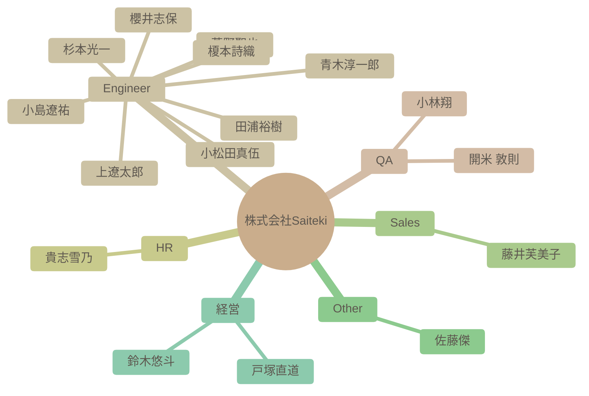

# チーム構成図

自動生成された組織図です。IssueおよびSlack連携による高度なAI分析結果が反映されます。

### 組織マップ

## 社員一覧サマリー

| 名前 | 職種 | 性格傾向 (概略) | 現在の状態 |
| --- | --- | --- | --- |
| [杉本光一](#%E6%9D%89%E6%9C%AC%E5%85%89%E4%B8%80) | Engineer | 開放性、協調性、外向性が高く、学習意欲も旺盛。最新技術への関心や、チームへの貢献意欲がうかがえる。 | チームビルディングに課題を感じつつ、AI技術への関心も高く、自己成長を意識している様子がうかがえる。 |
| [青木淳一郎](#%E9%9D%92%E6%9C%A8%E6%B7%B3%E4%B8%80%E9%83%8E) | Engineer | 協調性が高く、新しい知識や経験に対して積極的な姿勢を持つ。楽観的で社交的な性格。 | 現在は業務負荷が高く、イベントへの参加を見送っているものの、全体的にポジティブな状況である。Saitekiのメンバーとの出会いを喜び、来年への期待を抱いている。 |
| [小林翔](#%E5%B0%8F%E6%9E%97%E7%BF%94) | QA | 開放性が高く、協調性があり、外向性も比較的高い。新しい経験や人々との交流を積極的に求めている。 | 新しい職場に期待を抱いており、周囲との良好な関係を築こうと積極的に行動している。 |
| [櫻井志保](#%E6%AB%BB%E4%BA%95%E5%BF%97%E4%BF%9D) | Engineer | 自己認識が高く、協調性があり、学習意欲も高い。新しい環境への適応力も期待できる。 | 入社を控えており、新しい環境への期待感と意欲に満ち溢れている。チームの一員として貢献したいという気持ちが強い。 |
| [田浦裕樹](#%E7%94%B0%E6%B5%A6%E8%A3%95%E6%A8%B9) | Engineer | 協調性が高く、学習意欲が旺盛で、責任感と誠実さを兼ね備えた人物。また、周囲への気配りを忘れない。 | 現在はAndroid TVアプリ開発チームでPoCの立ち上げフェーズに注力しており、クライアントとの要件定義・調整に力を入れている様子。テレワークも活用し、柔軟に対応している。 |
| [開米 敦則](#%E9%96%8B%E7%B1%B3%20%E6%95%A6%E5%89%87) | QA | 協調性が高く、学習意欲旺盛で責任感が強い。技術探求心が強く、丁寧なコミュニケーションを心がける。 | 新しい技術の導入に意欲的で、業務に貢献しようとしている。リモートワーク環境にも慣れており、柔軟に対応できる。技術的な問題への対応能力も高い。 |
| [貴志雪乃](#%E8%B2%B4%E5%BF%97%E9%9B%AA%E4%B9%83) | HR | 協調性が高く、新しいことへの好奇心も旺盛です。周囲への気配りもできる、バランスの取れた人物と言えます。ポジティブで明るい印象を与えます。 | 新しい情報を積極的に共有し、組織への貢献意欲も高く、全体的にポジティブな状態にある。採用担当としても意欲的に業務に取り組んでいる。 |
| [上遼太郎](#%E4%B8%8A%E9%81%BC%E5%A4%AA%E9%83%8E) | Engineer | 協調性が高く、学習意欲旺盛で、周囲への感謝を忘れない。 | 共有された情報から積極的に学び、自身のスキルアップに繋げようとしている。チームメンバーのスキルを高く評価し、感謝の気持ちを伝えている。 |
| [小松田真伍](#%E5%B0%8F%E6%9D%BE%E7%94%B0%E7%9C%9F%E4%BC%8D) | Engineer | 新しい知識の吸収に積極的で、自身の経験に基づいた問題意識を持つ。協調性を重んじ、組織への貢献意欲が高い。ユーモアも持ち合わせている。 | 組織への貢献意欲が高く、現状打破への強い思いを持っている。チームとの協調を重視し、積極的に議論に参加している。 |
| [小島遼祐](#%E5%B0%8F%E5%B3%B6%E9%81%BC%E7%A5%90) | Engineer | 協調性が高く、新しい知識や経験に対する好奇心が旺盛。社交性も持ち合わせている。 | 新しい職場環境に積極的に馴染もうとしており、良好な人間関係を築きながら、仕事に貢献しようと意欲的に取り組んでいる。 |
| [藤井芙美子](#%E8%97%A4%E4%BA%95%E8%8A%99%E7%BE%8E%E5%AD%90) | Sales | 社交的で共感性が高く、向上心のある性格。周囲の意見を尊重し、積極的に学ぼうとする。 | 困難な状況下でも周囲を気遣い、前向きな姿勢を保っている。仕事とプライベートのバランスも取れている様子。 |
| [菅野聖也](#%E8%8F%85%E9%87%8E%E8%81%96%E4%B9%9F) | Engineer | 好奇心旺盛で、協調性があり、新しい技術や知識の吸収に積極的。ユーモアのセンスも持ち合わせている。 | 入社を控え、開発者としての勘を取り戻しつつ、チームに貢献できることを楽しみにしている。AI技術への関心が高く、業務への活用を模索している。 |
| [佐藤傑](#%E4%BD%90%E8%97%A4%E5%82%91) | Other | 知的好奇心旺盛で協力的。新しい技術トレンドに関心を持ち、他者への共感性も高く、質問に対して丁寧に答える。 | 新しい技術トレンドに興味を持ち、積極的に情報収集・共有を行っている。特に小型高性能モデルに関心が高い。 |
| [鈴木悠斗](#%E9%88%B4%E6%9C%A8%E6%82%A0%E6%96%97) | 経営 | 社交的で周囲を気遣う性格。新しい技術にも興味を持ち、学習意欲も高い。他者への感謝と評価を忘れず、チームワークを重視する。 | 周囲とのコミュニケーションを楽しみながら、業務に取り組んでいる様子がうかがえる。チームメンバーの活躍を喜ぶなど、良好な関係性を築いている。 |
| [戸塚直道](#%E6%88%B8%E5%A1%9A%E7%9B%B4%E9%81%93) | 経営 | 協調性が高く、外向的な性格。周囲への気配りを忘れず、組織全体の成長に貢献することに意欲を持つ。 | 引き続き良好な状態を維持している。複数のプロジェクトに関わっており、多忙ではあるものの、高いモチベーションを維持している。チームメンバーのサポートや組織運営にも積極的に関わっている。特に、業界構造の変革に対する意欲が高い。 |
| [榎本詩織](#%E6%A6%8E%E6%9C%AC%E8%A9%A9%E7%B9%94) | Engineer | 開放的で協調性があり、新しい知識を積極的に取り入れようとする姿勢が見られる。ユーモアがあり、親しみやすい。 | 入社を前に期待と意欲に満ち溢れている。積極的にコミュニケーションを取り、周囲との関係構築に努めている。 |

---

## 詳細プロフィール

各社員の詳細な分析結果です。クリックして展開できます。

### 杉本光一 (Engineer)

> **総合サマリー**: 杉本さんは、チームワークを重視し、学習意欲が高く、AI技術にも関心を持つ協調性のある人物。

<b>🛠 性格傾向 (Personality Traits)</b>

**要約**: 開放性、協調性、外向性が高く、学習意欲も旺盛。最新技術への関心や、チームへの貢献意欲がうかがえる。

| 項目 | スコア | 根拠・エピソード |
| --- | --- | --- |
| 開放性 (Openness) | 9/10 | コーヒーの化学やローカルAIでの推論処理など、幅広い分野に興味を持つ。ビジネス書にも関心があり、知識欲が旺盛。 |
| 誠実性 (Conscientiousness) | 8/10 | チームビルディングに課題を感じ、書籍を読むなど、組織改善に向けて積極的に行動しようとする。 |
| 外向性 (Extraversion) | 8/10 | 初対面の相手にも積極的に挨拶し、質問や意見交換を通じてコミュニケーションを図ろうとする。 |
| 協調性 (Agreeableness) | 9/10 | 丁寧な言葉遣いで相手を尊重し、質問を通じて会話を円滑に進めようとする。相手への感謝の気持ちを表現する。 |
| 神経症的傾向 (Neuroticism) | 3/10 | 発言全体を通して、不安や否定的な感情はほとんど見られない。前向きで積極的な姿勢がうかがえる。 |

<b>💪 仕事タイルと強み (Work Styles & Strengths)</b>

**要約**: チームワークを重視し、学習意欲が高く、得た知識を共有することでチームに貢献しようとする。

**問題解決スタイル**: チームビルディングの課題に対し、書籍から知識を得て解決策を探る。ローカルAIでの推論処理に関心を持ち、技術的な側面から問題解決を試みる。

**主要な強み**: コミュニケーション能力, 学習意欲, チームワーク

**証拠エピソード**:
- チームビルディングに関する課題を認識し、書籍を通じて解決策を模索する。
- ローカルAIでの推論処理に関心を持ち、MacStudioなどの具体的な環境での実現可能性を検討する。

<b>💎 価値観とモチベーター (Values & Motivators)</b>

**要約**: チームワーク、自己成長、技術革新を重視する。他者との交流や新しい発見からモチベーションを得る。

**コアバリュー**: チームワーク, 自己成長, 技術革新

**モチベーショントリガー**: 他者との交流, 新しい発見, 自己成長の機会

**証拠エピソード**:
- チームビルディングに関する課題意識を持ち、書籍を通じて解決を図ろうとする。
- ローカルAIでの推論処理に関心を持ち、技術的な可能性を探求する。

<b>📈 現在の状態 (Current State)</b>

**要約**: チームビルディングに課題を感じつつ、AI技術への関心も高く、自己成長を意識している様子がうかがえる。

- **感情レベル**: positive
- **業務負荷状況**: 不明
- **最近の関心トピック**: コーヒーの化学, チームビルディング, ローカルAIでの推論処理

---

### 青木淳一郎 (Engineer)

> **総合サマリー**: 佐賀県出身で福岡在住のAWS基盤エンジニア。多趣味で家族を大切にし、学習意欲も高い。周囲との協調性を重視する社交的な人物。

<b>🛠 性格傾向 (Personality Traits)</b>

**要約**: 協調性が高く、新しい知識や経験に対して積極的な姿勢を持つ。楽観的で社交的な性格。

| 項目 | スコア | 根拠・エピソード |
| --- | --- | --- |
| 開放性 (Openness) | 8/10 | 新しい技術（Azure、Google Cloud、AI）への学習意欲が高く、未経験領域にも積極的に挑戦しようとしている。 |
| 誠実性 (Conscientiousness) | 7/10 | 仕事に対して真面目に取り組む姿勢が見られる。納品が近い際にイベント参加を控えるなど、責任感も強い。 |
| 外向性 (Extraversion) | 8/10 | 自己紹介や挨拶を丁寧に行い、積極的にコミュニケーションを取ろうとしている。共通の趣味を持つ人との交流も楽しんでいる。 |
| 協調性 (Agreeableness) | 9/10 | 周囲への感謝の気持ちを頻繁に表現し、協力的な姿勢を示す。他のメンバーの発言にも肯定的な反応が多い。 |
| 神経症的傾向 (Neuroticism) | 3/10 | ネガティブな感情表現は少なく、全体的にポジティブな発言が多い。近所にサルが出没した際の驚きを述べているものの、深刻な不安は感じられない。 |

<b>💪 仕事タイルと強み (Work Styles & Strengths)</b>

**要約**: インフラ設計・構築の経験があり、新しい技術への学習意欲も高い。チームワークを重視し、協力的な姿勢で業務に取り組む。

**問題解決スタイル**: 現状を把握し、必要な情報を収集しながら解決策を模索する。BIツールの使用で苦戦していることを共有し、協力を仰ぐ姿勢も見られる。

**主要な強み**: インフラ設計・構築スキル, 学習意欲, コミュニケーション能力

**証拠エピソード**:
- AWS基盤のインフラ設計・構築の経験を持つ。
- AIやBIツールなど、新しい技術の学習に意欲的である。
- Slackでの積極的なコミュニケーションを通じて、チームメンバーとの関係構築を図っている。

<b>💎 価値観とモチベーター (Values & Motivators)</b>

**要約**: 家族との時間を大切にし、仕事を通じてスキルアップを目指している。チームへの貢献意欲も高く、組織の一員としての意識も強い。

**コアバリュー**: 家族, 成長, 貢献

**モチベーショントリガー**: 新しい技術の習得, チームへの貢献, 自己成長

**証拠エピソード**:
- 休日の過ごし方として家族との時間を大切にしている。
- 未経験領域への挑戦を通じてスキルの幅を広げたいと考えている。
- Saitekiの輪を広げていきたいという発言から、組織への貢献意欲が伺える。

<b>📈 現在の状態 (Current State)</b>

**要約**: 現在は業務負荷が高く、イベントへの参加を見送っているものの、全体的にポジティブな状況である。Saitekiのメンバーとの出会いを喜び、来年への期待を抱いている。

- **感情レベル**: positive
- **業務負荷状況**: 納品が近いこともあり、業務負荷が高い。
- **最近の関心トピック**: Saitekiメンバーの入社経緯, 京都旅行

---

### 小林翔 (QA)

> **総合サマリー**: 小林翔さんは、新しい職場に積極的に溶け込もうとする姿勢があり、趣味や嗜好も多岐にわたるため、周囲との共通点を見つけやすく、協調性を重視する人物である。

<b>🛠 性格傾向 (Personality Traits)</b>

**要約**: 開放性が高く、協調性があり、外向性も比較的高い。新しい経験や人々との交流を積極的に求めている。

| 項目 | スコア | 根拠・エピソード |
| --- | --- | --- |
| 開放性 (Openness) | 8/10 | 新しい職場への期待感や、旅行やゲームなど多様な趣味を持っていることから、新しい経験やアイデアに対して積極的な姿勢がうかがえる。特にローグライクゲームへの深いハマり込みは、探求心の強さを示している。 |
| 誠実性 (Conscientiousness) | 7/10 | 前職で13年間テスターおよび進行管理の経験があることから、責任感があり、計画性を持って業務に取り組むことができると考えられる。入社時の丁寧な自己紹介からも、几帳面な一面が窺える。 |
| 外向性 (Extraversion) | 6/10 | 自己紹介で年齢の近い人が多いことに触れ、仲良くしながら一緒に成長したいと述べていることから、他人との交流を好み、積極的にコミュニケーションを取ろうとする傾向が見られる。 |
| 協調性 (Agreeableness) | 8/10 | 自己紹介の丁寧さや、他の社員の趣味や好みに共感する発言、お互いを尊重する姿勢が見られることから、協調性が高く、周囲との調和を大切にすると考えられる。ゲーム部の創設に意欲を示す点も、集団への貢献意欲を示している。 |
| 神経症的傾向 (Neuroticism) | 3/10 | 全体的にポジティブな発言が多く、ネガティブな感情を表に出すことは少ない。自己紹介も丁寧で、周囲に好印象を与えようとする姿勢が見られる。 |

<b>💪 仕事タイルと強み (Work Styles & Strengths)</b>

**要約**: 協調性があり、コミュニケーション能力が高く、長年のテスター経験から注意深く問題点を見つけることができる。新しい知識を吸収することにも積極的である。

**問題解決スタイル**: 過去の経験から得た知識や情報を活用し、論理的に問題を解決する。テスターとしての経験から、細かい部分にも注意を払い、潜在的なリスクを早期に発見することができる。

**主要な強み**: テスト経験, コミュニケーション能力, 情報収集力

**証拠エピソード**:
- 13年間のテスター経験から、問題点を見つけ出す能力が高いと考えられる。
- 他の社員の趣味や好みに共感する発言が多く、コミュニケーション能力が高いと考えられる。
- 北海道のグルメ情報に興味を示し、積極的に情報収集を行っている。

<b>💎 価値観とモチベーター (Values & Motivators)</b>

**要約**: 成長、繋がり、楽しさ、経験を重視する。新しい知識やスキルを習得すること、他人との良好な関係を築くこと、そして楽しい経験をすることがモチベーションの源泉となる。

**コアバリュー**: 成長, 協調, 楽しさ

**モチベーショントリガー**: 新しい知識の習得, チームへの貢献, 楽しい経験

**証拠エピソード**:
- 自己紹介で「一緒に成長できたら嬉しい」と述べていることから、成長意欲が高いことがわかる。
- ゲーム部の創設に意欲を示すことから、チームへの貢献意欲が高いことがわかる。
- 趣味の話題を楽しそうに語っていることから、楽しい経験がモチベーションにつながることがわかる。

<b>📈 現在の状態 (Current State)</b>

**要約**: 新しい職場に期待を抱いており、周囲との良好な関係を築こうと積極的に行動している。

- **感情レベル**: positive
- **業務負荷状況**: 入社前であり、業務負荷は低いと考えられる。
- **最近の関心トピック**: ゲーム, 北海道グルメ

---

### 櫻井志保 (Engineer)

> **総合サマリー**: 櫻井志保さんは、データ分析経験があり、学習意欲の高い、コミュニケーションを重視する人物です。柔軟性があり、新しい環境への適応力も期待できます。

<b>🛠 性格傾向 (Personality Traits)</b>

**要約**: 自己認識が高く、協調性があり、学習意欲も高い。新しい環境への適応力も期待できる。

| 項目 | スコア | 根拠・エピソード |
| --- | --- | --- |
| 開放性 (Openness) | 8/10 | データ分析など専門分野への挑戦意欲や、資格取得を目指す姿勢から、新しい知識や経験に対して積極的であることが伺えます。 |
| 誠実性 (Conscientiousness) | 7/10 | 自己紹介で業務内容や趣味について丁寧に記述しており、責任感と几帳面さが見られます。データ集計業務の経験からも計画性と正確性が推測できます。 |
| 外向性 (Extraversion) | 6/10 | Slackを通じた積極的なコミュニケーションを希望しており、周囲との連携を重視する姿勢が見られます。自己紹介も丁寧で、相手に良い印象を与えようという意識が感じられます。 |
| 協調性 (Agreeableness) | 9/10 | 自己紹介で丁寧な言葉遣いを心掛けており、協調性を重視する姿勢が伺えます。謙虚な姿勢も見られ、周囲との良好な関係を築こうとする意識が感じられます。 |
| 神経症的傾向 (Neuroticism) | 3/10 | 自己紹介の内容から、不安や心配を感じやすいといった傾向は見られません。むしろ、新しい環境への期待感や前向きな姿勢が感じられます。 |

<b>💪 仕事タイルと強み (Work Styles & Strengths)</b>

**要約**: データ分析スキルを持ち、学習意欲が高く、自ら課題を見つけて改善に取り組むタイプ。コミュニケーション能力も高く、チームワークを重視する。

**問題解決スタイル**: データに基づいた分析と、論理的な思考で問題を解決するアプローチを取る。

**主要な強み**: データ分析, コミュニケーション, 学習意欲

**証拠エピソード**:
- Power BIを用いたデータ分析・加工の経験
- データベース構築などより専門的な分野への挑戦意欲
- Slackを通じた積極的なコミュニケーションへの意欲

<b>💎 価値観とモチベーター (Values & Motivators)</b>

**要約**: 成長と貢献を重視し、新しい知識やスキルを習得することに喜びを感じる。チームワークを重視し、周囲との協調関係を築くことを大切にする。

**コアバリュー**: 成長, 貢献, 協調性

**モチベーショントリガー**: 新しい知識やスキルの習得, 専門性の向上, チームへの貢献

**証拠エピソード**:
- 資格取得を目指す姿勢
- データベース構築など専門分野への挑戦意欲
- Slackを通じた積極的なコミュニケーションへの意欲

<b>📈 現在の状態 (Current State)</b>

**要約**: 入社を控えており、新しい環境への期待感と意欲に満ち溢れている。チームの一員として貢献したいという気持ちが強い。

- **感情レベル**: positive
- **業務負荷状況**: 新規入社のため、業務負荷は不明
- **最近の関心トピック**: データ分析, データベース構築, 資格取得

---

### 田浦裕樹 (Engineer)

> **総合サマリー**: 田浦裕樹は、AI技術に精通し、チームと協力しながら技術を共有し、プロジェクトを積極的に推進するエンジニアであり、コミュニケーション能力に長けている。

<b>🛠 性格傾向 (Personality Traits)</b>

**要約**: 協調性が高く、学習意欲が旺盛で、責任感と誠実さを兼ね備えた人物。また、周囲への気配りを忘れない。

| 項目 | スコア | 根拠・エピソード |
| --- | --- | --- |
| 開放性 (Openness) | 9/10 | 要件定義に関するガイドラインなど、有益な情報をチームに共有し、新しい技術の導入にも意欲的である。自身の経験を共有することにも積極的。 |
| 誠実性 (Conscientiousness) | 8/10 | PoCの立ち上げフェーズにおいて、タスクを分解し優先順位付けを行い、計画的にプロジェクトを進めている。また、進捗状況を共有している。 |
| 外向性 (Extraversion) | 7/10 | チームメンバーとのコミュニケーションを重視し、積極的に意見交換や情報共有を行っている。他者の投稿に積極的に反応し、感謝の言葉を述べている。 |
| 協調性 (Agreeableness) | 9/10 | 他者の意見を尊重し、感謝の意を伝えることが多い。チームメンバーの状況を気遣い、荒天時の影響を心配するなど、思いやりがある。 |
| 神経症的傾向 (Neuroticism) | 4/10 | 業務負荷が高い状況でも冷静に対応し、計画的にタスクを進めている様子が見られる。突発的なテレワークにも柔軟に対応している。 |

<b>💪 仕事タイルと強み (Work Styles & Strengths)</b>

**要約**: AI技術を活用した開発に強みを持ち、チームを円滑に動かすための調整能力にも長けている。PoCの立ち上げや要件定義も得意。

**問題解決スタイル**: PoCにおいて、最初に全てを決め切らず、仮説を立て、クライアントとのすり合わせを重ねながら、アジャイル的に進めることを重視する。

**主要な強み**: AI技術を活用した開発, チームコミュニケーション, 要件定義・整理, PoCの推進

**証拠エピソード**:
- PoCの進捗状況を共有し、進め方のポイントを解説することで、チーム全体のレベルアップに貢献しようとしている。
- 商談動画を共有し、注目ポイントを示すことで、チームの営業力向上に貢献しようとしている。

<b>💎 価値観とモチベーター (Values & Motivators)</b>

**要約**: チームへの貢献、技術的な成長、顧客の成功を重視する。自身の知識や経験を共有することで、チーム全体のレベルアップに貢献したいと考えている。

**コアバリュー**: チームワーク, 継続的な学習, 顧客満足, 貢献

**モチベーショントリガー**: チームメンバーからの感謝, プロジェクトの成功, 新しい技術の習得, 顧客からの肯定的なフィードバック

**証拠エピソード**:
- 勉強会のフィードバックに胸を熱くしており、自身の知識や経験がチームに貢献できたことを喜んでいる。
- 商談の様子を共有することで、チーム全体の営業力向上に貢献しようとしている。

<b>📈 現在の状態 (Current State)</b>

**要約**: 現在はAndroid TVアプリ開発チームでPoCの立ち上げフェーズに注力しており、クライアントとの要件定義・調整に力を入れている様子。テレワークも活用し、柔軟に対応している。

- **感情レベル**: positive
- **業務負荷状況**: やや高め。複数のPoCを並行して進めており、クライアントとの要件定義やタスク整理に時間を割いている。
- **最近の関心トピック**: PoC (Proof of Concept), 要件定義, Android TVアプリ開発

---

### 開米 敦則 (QA)

> **総合サマリー**: 開米敦則氏は、AI技術に精通し、学習意欲が高く、協調性を重んじるプロフェッショナル。問題解決能力に優れ、チームへの貢献意欲も高い。

<b>🛠 性格傾向 (Personality Traits)</b>

**要約**: 協調性が高く、学習意欲旺盛で責任感が強い。技術探求心が強く、丁寧なコミュニケーションを心がける。

| 項目 | スコア | 根拠・エピソード |
| --- | --- | --- |
| 開放性 (Openness) | 9/10 | 新しいAIツールや技術（Google AI Proなど）への興味を示し、積極的に試そうとする姿勢が見られる。噂や評判を参考にツールを選定するなど、情報収集にも熱心。 |
| 誠実性 (Conscientiousness) | 8/10 | 作業履歴ページを作成し、アップデート箇所を明示するなど、情報共有に対する責任感の強さがうかがえる。会議に遅れないよう時間を確認したり、ミュート解除のトラブルに丁寧に謝罪したりする。 |
| 外向性 (Extraversion) | 4/10 | MTG時間について、自身の都合を伝えつつも相手の都合を尊重しようとする姿勢が見られる。積極的にコミュニケーションを取るというよりは、必要に応じて丁寧に情報を共有するタイプ。 |
| 協調性 (Agreeableness) | 8/10 | 相手の意見や提案に対して肯定的な反応を示し、感謝の言葉を述べるなど、協調性を重視する姿勢が見られる。アップデート履歴に対するフィードバックを求め、改善意欲も示す。 |
| 神経症的傾向 (Neuroticism) | 3/10 | 会議でのミュート解除のトラブルや、土曜日のMTG時間に対する懸念など、几帳面で責任感が強いことが伺える。ただし、過度な心配性というわけではない。 |

<b>💪 仕事タイルと強み (Work Styles & Strengths)</b>

**要約**: AI技術に関する深い知識と、それを業務に適用する能力に長けている。問題解決能力が高く、自律的に行動できる。情報収集力と分析力も高い。

**問題解決スタイル**: AI技術の特性を理解し、各フェーズに最適なツールを検討することで、効率的な問題解決を目指す。仮説を立て、検証するアプローチを重視する。

**主要な強み**: AI技術の知識, 問題解決能力, 情報収集力

**証拠エピソード**:
- 複数のテスト自動化ツールを比較検討し、各ツールの得意分野に基づいて最適な組み合わせを提案している。
- Chat GPTとGeminiを用いてテスト計画を行い、プロンプトのフォーマットの重要性を指摘している。
- 作業履歴ページを作成し、関係者への情報共有を円滑にしている。

<b>💎 価値観とモチベーター (Values & Motivators)</b>

**要約**: 効率性、学習意欲、貢献意欲を重視している。新しい技術を積極的に学び、業務に役立てることにモチベーションを感じる。チームや組織への貢献を重視する。

**コアバリュー**: 効率性, 学習, 貢献

**モチベーショントリガー**: 新しい技術への挑戦, 業務効率の改善, チームへの貢献

**証拠エピソード**:
- AIツールに関する知識を共有し、業務への適用を提案している。
- アップデート履歴ページを作成し、チームへの情報共有を促進している。
- 会議の遅延や接続トラブルに対して、丁寧に謝罪している。

<b>📈 現在の状態 (Current State)</b>

**要約**: 新しい技術の導入に意欲的で、業務に貢献しようとしている。リモートワーク環境にも慣れており、柔軟に対応できる。技術的な問題への対応能力も高い。

- **感情レベル**: positive
- **業務負荷状況**: 標準的な業務負荷。自律的にタスクをこなせる。
- **最近の関心トピック**: AIを活用したテスト自動化, プロンプトエンジニアリング, 新しいテストツール

---

### 貴志雪乃 (HR)

> **総合サマリー**: 貴志雪乃さんは、協調性があり、組織への貢献意欲と学習意欲が高い人物です。人当たりの良いコミュニケーションを心がけ、周囲との良好な関係構築を重視します。

<b>🛠 性格傾向 (Personality Traits)</b>

**要約**: 協調性が高く、新しいことへの好奇心も旺盛です。周囲への気配りもできる、バランスの取れた人物と言えます。ポジティブで明るい印象を与えます。

| 項目 | スコア | 根拠・エピソード |
| --- | --- | --- |
| 開放性 (Openness) | 9/10 | 新着YouTube動画や生成AIに関するレポートを共有するなど、新しい情報に対する関心が高い。勉強会のレポートを作成し、積極的に共有している。上場企業の社長との対談動画を共有するなど、情報感度が高い。 |
| 誠実性 (Conscientiousness) | 8/10 | 勉強会のレポート作成やオンライン飲み会の企画など、組織のために貢献しようとする姿勢が見られる。レポート作成などタスクをきちんとこなしている。オンライン飲み会の企画とUber Eatsの手配など、細部まで丁寧に準備している。 |
| 外向性 (Extraversion) | 7/10 | 自己紹介を丁寧に行い、オンライン飲み会の企画を積極的に行うなど、周囲との交流を重視している。他の人の発言に積極的に反応している。オンライン部活企画の投票を呼びかけ、結果を報告している。 |
| 協調性 (Agreeableness) | 9/10 | 初対面の人に対して丁寧な挨拶を心がけている。勉強会の企画に協力したメンバーへの感謝を述べるなど、周囲への気配りができる。他のメンバーの投稿に共感的なコメントを送っている。 |
| 神経症的傾向 (Neuroticism) | 3/10 | 全体的にポジティブな発言が多く、ストレスを感じている様子は見られない。落ち着いており、感情の起伏が少ない。他者の発言に対しても肯定的な反応を示している。 |

<b>💪 仕事タイルと強み (Work Styles & Strengths)</b>

**要約**: 積極的に情報収集・共有し、周りを巻き込みながら業務を推進するタイプです。丁寧な仕事ぶりで、周囲からの信頼も厚いでしょう。採用担当としての役割も積極的にこなしています。

**問題解決スタイル**: 情報収集と共有を重視し、周囲の意見を参考にしながら解決策を探る。過去の事例や外部の情報を参考にしながら、最適な解決策を見つけようとする。

**主要な強み**: 情報収集力, 企画力, コミュニケーション力

**証拠エピソード**:
- 勉強会のレポートを作成し、内容をわかりやすくまとめている。
- オンライン飲み会の企画を立案し、参加を促している。
- 生成AIレポートを共有し、開発関連の情報を共有している。
- 新着YouTube動画を共有し、メンバーに新しい情報を提供している。

<b>💎 価値観とモチベーター (Values & Motivators)</b>

**要約**: 組織への貢献、新しい知識の習得、周囲との良好な関係構築を重視している。自身の成長と組織の成長を重ねて考えている。メンバーの貢献を認め、感謝の気持ちを伝えることを大切にしている。

**コアバリュー**: 貢献, 成長, 協調

**モチベーショントリガー**: 新しい知識や技術の習得, 組織への貢献, 周囲からの感謝

**証拠エピソード**:
- 勉強会レポートの作成を通して、組織に貢献しようとしている。
- 新着YouTube動画の共有を通して、メンバーに新しい情報を提供しようとしている。
- オンライン飲み会の企画を通して、メンバー間の交流を促進しようとしている。
- 採用担当として、自己紹介を行い、組織に貢献しようとしている。

<b>📈 現在の状態 (Current State)</b>

**要約**: 新しい情報を積極的に共有し、組織への貢献意欲も高く、全体的にポジティブな状態にある。採用担当としても意欲的に業務に取り組んでいる。

- **感情レベル**: positive
- **業務負荷状況**: 平均的な業務負荷
- **最近の関心トピック**: 生成AI, YouTube動画, オンラインイベント, 採用

---

### 上遼太郎 (Engineer)

> **総合サマリー**: 上遼太郎さんは、他者のスキルや知識を高く評価し、積極的に学ぼうとする姿勢が際立つ。共有された情報への感謝を忘れず、学習意欲も高い。

<b>🛠 性格傾向 (Personality Traits)</b>

**要約**: 協調性が高く、学習意欲旺盛で、周囲への感謝を忘れない。

| 項目 | スコア | 根拠・エピソード |
| --- | --- | --- |
| 開放性 (Openness) | 9/10 | 商談動画やLetter of Tなど、共有された情報から積極的に学ぼうとしている。新しい知識に対する学習意欲が非常に高い。 |
| 誠実性 (Conscientiousness) | 7/10 | 共有された動画を時間のある時にじっくり見ようとしており、得られた情報を無駄にしない姿勢が見られる。 |
| 外向性 (Extraversion) | 5/10 | 積極的に発言するタイプではないが、共有された情報に対して感謝の意を示したり、楽しみだと伝えることで、周囲とのコミュニケーションを円滑にしようとしている。 |
| 協調性 (Agreeableness) | 9/10 | 共有された情報への感謝を伝え、他者の営業力やスキルの高さを認め、学ぼうとする姿勢から、協調性の高さが伺える。 |
| 神経症的傾向 (Neuroticism) | 3/10 | 困難に直面しても冷静に対処しようとし、ネガティブな感情を表に出すことは少ない。全体的にポジティブで安定した印象を与える。 |

<b>💪 仕事タイルと強み (Work Styles & Strengths)</b>

**要約**: 他者の優れた点を吸収し、自身のスキルアップに繋げようとする。学習意欲が高く、情報収集能力に優れる。

**問題解決スタイル**: 自ら手を動かすだけでなく、周囲の知識や経験から学び、問題解決のヒントを得ようとする。

**主要な強み**: 学習意欲, 情報収集, 協調性

**証拠エピソード**:
- 商談動画から営業スキルを学ぼうとしている。
- Letter of Tの内容を勉強になったと述べている。
- 田浦さんの要件伝達スキルを参考にしようとしている。

<b>💎 価値観とモチベーター (Values & Motivators)</b>

**要約**: 学習、成長、貢献を重視する傾向がある。他者のスキルから学び、自身の成長に繋げることにやりがいを感じる。

**コアバリュー**: 学習, 成長, 貢献

**モチベーショントリガー**: 新しい知識の習得, スキルアップ, チームへの貢献

**証拠エピソード**:
- 商談動画から営業スキルを学ぼうとしている。
- Letter of Tの内容を勉強になったと述べている。
- 田浦さんの要件伝達スキルを参考にしようとしている。

<b>📈 現在の状態 (Current State)</b>

**要約**: 共有された情報から積極的に学び、自身のスキルアップに繋げようとしている。チームメンバーのスキルを高く評価し、感謝の気持ちを伝えている。

- **感情レベル**: positive
- **業務負荷状況**: 発言内容から判断すると、業務負荷は平均的。共有された情報を積極的に吸収し、自身のスキルアップに繋げようとしているため、意欲的に業務に取り組んでいる様子が伺える。
- **最近の関心トピック**: 営業スキル, コミュニケーションスキル, チームメンバーのスキル

---

### 小松田真伍 (Engineer)

> **総合サマリー**: 小松田真伍は、学習意欲と問題意識が高く、組織への貢献を強く願う人物。チームとの協調を重視し、現状打破への意欲も持つ。

<b>🛠 性格傾向 (Personality Traits)</b>

**要約**: 新しい知識の吸収に積極的で、自身の経験に基づいた問題意識を持つ。協調性を重んじ、組織への貢献意欲が高い。ユーモアも持ち合わせている。

| 項目 | スコア | 根拠・エピソード |
| --- | --- | --- |
| 開放性 (Openness) | 9/10 | 勉強会での議論参加やSlack実況スレの提案など、新しい試みに意欲的。既存の評価軸に疑問を持ち、新しい道を模索しようとする。 |
| 誠実性 (Conscientiousness) | 7/10 | 勉強会後にお礼を述べたり、提案内容を具体的に説明するなど、丁寧で責任感のある言動が見られる。 |
| 外向性 (Extraversion) | 7/10 | Slackでの活発な発言や、勉強会実況スレの提案など、積極的にコミュニケーションを図ろうとする姿勢が見られる。 |
| 協調性 (Agreeableness) | 8/10 | 勉強会参加のお礼や、提案に対する感謝を述べるなど、協調性を重視し、相手への配慮を忘れない。 |
| 神経症的傾向 (Neuroticism) | 5/10 | 感情的な起伏は少なく、冷静に意見を述べることが多い。現状に対する問題意識を持ちつつも、建設的な解決策を模索しようとする。 |

<b>💪 仕事タイルと強み (Work Styles & Strengths)</b>

**要約**: 現状の問題点を把握し、積極的に改善策を提案する。チームと協力し、組織全体をより良くしようとする意識が高い。

**問題解決スタイル**: 現状分析に基づき、具体的な提案を行う。組織全体の視点から問題解決を試みる。

**主要な強み**: 問題解決, 協調性, 貢献意欲

**証拠エピソード**:
- 勉強会の実況スレ提案は、参加者の理解度向上やアウトプット練習に繋げようとする問題解決能力を示している。
- SIerの評価軸に対する問題提起は、現状への深い理解と改善意欲の表れである。

<b>💎 価値観とモチベーター (Values & Motivators)</b>

**要約**: 組織への貢献意欲が強く、自身の成長を通じて組織をより良くしたいと考えている。現状打破への意欲も高く、新しい道を切り開くことにやりがいを感じる。

**コアバリュー**: 貢献, 成長, 変革

**モチベーショントリガー**: 組織の成長, 自己成長, 現状打破

**証拠エピソード**:
- 勉強会への積極的な参加や実況スレの提案は、組織全体の知識共有と成長に貢献しようとする姿勢の表れである。
- SIerの評価軸に対する問題提起は、現状を変革し、より良い方向へ導きたいという強い意志を示している。

<b>📈 現在の状態 (Current State)</b>

**要約**: 組織への貢献意欲が高く、現状打破への強い思いを持っている。チームとの協調を重視し、積極的に議論に参加している。

- **感情レベル**: positive
- **業務負荷状況**: 不明
- **最近の関心トピック**: QA, 勉強会での議論, SIerの評価軸

---

### 小島遼祐 (Engineer)

> **総合サマリー**: 小島遼祐は、協調性があり、学習意欲が高く、周囲との良好な関係構築を重視する人物。責任感も持ち合わせている。

<b>🛠 性格傾向 (Personality Traits)</b>

**要約**: 協調性が高く、新しい知識や経験に対する好奇心が旺盛。社交性も持ち合わせている。

| 項目 | スコア | 根拠・エピソード |
| --- | --- | --- |
| 開放性 (Openness) | 8/10 | 読書を趣味とし、ビジネス書に興味を示す。アニメの話題にも関心を示すことから、幅広い分野への関心がある。 |
| 誠実性 (Conscientiousness) | 7/10 | 同僚のために良い案件を提案できるよう頑張ると述べており、責任感を持って仕事に取り組もうとしている様子が伺える。 |
| 外向性 (Extraversion) | 7/10 | 初対面の相手にも積極的にコミュニケーションを取り、親近感を持ってもらおうとする姿勢が見られる。 |
| 協調性 (Agreeableness) | 9/10 | 丁寧な言葉遣いを心がけており、相手への配慮が感じられる。相手の趣味に関心を示し、共感することで良好な関係を築こうとしている。 |
| 神経症的傾向 (Neuroticism) | 3/10 | Slackの発言からは、不安や心配といったネガティブな感情を示す要素は特に見られない。安定した精神状態を保っていると考えられる。 |

<b>💪 仕事タイルと強み (Work Styles & Strengths)</b>

**要約**: 協調性を活かしてチームワークを重視し、学習意欲に基づいて自己成長を図ることで、組織に貢献しようとする。

**問題解決スタイル**: 情報収集と周囲との連携を重視し、多角的な視点から課題解決に取り組む。

**主要な強み**: コミュニケーション能力, 学習意欲, 協調性

**証拠エピソード**:
- 昼食を共にした相手に改めて自己紹介を行い、相手の趣味に関心を示すことで、良好な人間関係を構築しようとしている。
- 同僚のために良い案件を提案できるよう努力することを表明し、仕事に対する責任感を示している。

<b>💎 価値観とモチベーター (Values & Motivators)</b>

**要約**: 人間関係の調和を重視し、自己成長を通じて周囲に貢献することに喜びを感じる。新しい知識や経験に対する好奇心が強く、常に学び続けようとする。

**コアバリュー**: 協調性, 成長, 貢献

**モチベーショントリガー**: 周囲からの感謝, 新しい知識の習得, チームの成功

**証拠エピソード**:
- 相手の趣味である読書やアニメに関心を示し、共通の話題を通じて親睦を深めようとしている。
- 同僚のために良い案件を提案できるよう努力すると述べており、貢献意欲を示している。

<b>📈 現在の状態 (Current State)</b>

**要約**: 新しい職場環境に積極的に馴染もうとしており、良好な人間関係を築きながら、仕事に貢献しようと意欲的に取り組んでいる。

- **感情レベル**: positive
- **業務負荷状況**: 標準的な業務負荷であると推測される。新しい環境に慣れるための努力をしている様子が見られる。
- **最近の関心トピック**: ビジネス書, アニメ, 新しい人間関係

---

### 藤井芙美子 (Sales)

> **総合サマリー**: 協調性と社交性があり、周囲への感謝と自己成長を重視する人物。状況を冷静に捉え、前向きな姿勢を保つ。

<b>🛠 性格傾向 (Personality Traits)</b>

**要約**: 社交的で共感性が高く、向上心のある性格。周囲の意見を尊重し、積極的に学ぼうとする。

| 項目 | スコア | 根拠・エピソード |
| --- | --- | --- |
| 開放性 (Openness) | 7/10 | 若い頃の占いに関する話題を楽しんでおり、新しいものや変化への適応力がある。 |
| 誠実性 (Conscientiousness) | 9/10 | 他者の行動を注意深く観察し、見習おうとする姿勢から、向上心と責任感の強さが伺える。書類の持参へのお礼を述べるなど、丁寧な対応も示す。 |
| 外向性 (Extraversion) | 8/10 | イベントへの途中参加を表明し、他のメンバーとの交流を楽しみにしている。コーヒーに誘うなど、積極的にコミュニケーションを取ろうとする。 |
| 協調性 (Agreeableness) | 9/10 | 他者の良い点を積極的に認め、賞賛する発言が多い。周囲への感謝の気持ちを言葉で表現し、良好な関係を築こうとする姿勢が強い。 |
| 神経症的傾向 (Neuroticism) | 3/10 | 交通機関の遅延という困難な状況に対しても、前向きな言葉を選び、周囲を気遣う様子から、精神的に安定している。 |

<b>💪 仕事タイルと強み (Work Styles & Strengths)</b>

**要約**: 周囲を観察し、他者の良い点を吸収して成長しようとする姿勢が強く、チームワークを重視する。丁寧で親切な対応を心がける。

**問題解決スタイル**: 状況を冷静に判断し、周囲と協力しながら解決策を探る。交通機関の状況を把握し、注意を促すなど、状況に応じた適切な行動を取る。

**主要な強み**: 共感性, 学習意欲, 協調性

**証拠エピソード**:
- 他者のさりげない優しさに気づき、それを称賛するコメントを送る。
- 自身の未熟な点を自覚し、他者から学んで成長しようとする。
- 書類を持参してくれたことへの感謝を伝えるなど、相手への配慮を忘れない。

<b>💎 価値観とモチベーター (Values & Motivators)</b>

**要約**: 他者との良好な関係構築と自己成長を重視し、周囲からの評価や感謝がモチベーションに繋がる。貢献意欲も高い。

**コアバリュー**: 協調性, 成長, 感謝

**モチベーショントリガー**: 他者からの賞賛, 自己成長の機会, 貢献感

**証拠エピソード**:
- 他者の良い行いを褒め称える。
- 自身の成長のために努力する姿勢を見せる。
- 総務として、相手への感謝を伝え、貢献しようとする姿勢を見せる。

<b>📈 現在の状態 (Current State)</b>

**要約**: 困難な状況下でも周囲を気遣い、前向きな姿勢を保っている。仕事とプライベートのバランスも取れている様子。

- **感情レベル**: positive
- **業務負荷状況**: イベントへの参加意欲や、コーヒーに誘う余裕があることから、比較的安定していると推測される。
- **最近の関心トピック**: 交通機関の状況, 過去の占い, 他者の行動, コーヒー

---

### 菅野聖也 (Engineer)

> **総合サマリー**: 向上心と学習意欲が高く、協調性を持ちながらも、AI技術への深い興味と探究心を持つ人物。周囲とのコミュニケーションを円滑に進めようとする姿勢が見られる。

<b>🛠 性格傾向 (Personality Traits)</b>

**要約**: 好奇心旺盛で、協調性があり、新しい技術や知識の吸収に積極的。ユーモアのセンスも持ち合わせている。

| 項目 | スコア | 根拠・エピソード |
| --- | --- | --- |
| 開放性 (Openness) | 9/10 | AI技術への積極的な活用、コーヒーの化学や戦略に関する書籍を読むなど、知的好奇心と学習意欲が高い。また、読書から新しい発見や心の安定を得ている。 |
| 誠実性 (Conscientiousness) | 7/10 | 過去の職務経歴や「丁寧の菅野」を自称していることから、一定の責任感と几帳面さを持っている。データ入力の仕事も丁寧に取り組んでいることが推測される。 |
| 外向性 (Extraversion) | 7/10 | 初対面でも話しやすいと言われたり、ランチを共にするなど、社交性がある。多くの人に積極的に挨拶をしている。 |
| 協調性 (Agreeableness) | 8/10 | 丁寧な言葉遣いや周囲への感謝の言葉、相手を気遣う姿勢から、協調性があり、友好的な関係を築こうとする姿勢がうかがえる。 |
| 神経症的傾向 (Neuroticism) | 4/10 | 現場を離れていた期間があることを気にしているものの、前向きに捉えようとしている。全体的に自己肯定感が高く、感情の安定性がある。 |

<b>💪 仕事タイルと強み (Work Styles & Strengths)</b>

**要約**: 過去の開発経験と品質管理の経験があり、技術的なスキルと問題解決能力を兼ね備えている。AI技術を活用した業務改善にも関心がある。

**問題解決スタイル**: 過去の経験から、データ分析やシステム改修など、論理的な思考を必要とする問題解決が得意。読書を通じて得た知識やAIの活用など、柔軟な発想力も持ち合わせている。

**主要な強み**: 技術的なスキル（VB.Net, JAVA）, 品質管理の経験, 学習意欲, AI活用スキル

**証拠エピソード**:
- IT企業でのシステム開発経験
- 倉庫業での品質管理の経験
- AI技術を活用した業務効率化への関心
- 工夫してコードを書くことを面白いと感じている

<b>💎 価値観とモチベーター (Values & Motivators)</b>

**要約**: 技術的なスキル向上と、チームへの貢献を重視しており、新しい知識や経験を得ることに意欲的。AI技術の可能性に期待し、積極的に活用しようとしている。

**コアバリュー**: 技術向上, チームワーク, 学習, AI活用

**モチベーショントリガー**: 新しい技術の習得, チームへの貢献, 自身の成長, AI技術の活用

**証拠エピソード**:
- 開発者としての勘を取り戻したいという発言
- 皆様とシステム開発をする日を楽しみにしているという発言
- 読書による知識の獲得
- AIに様々な質問をして活用している

<b>📈 現在の状態 (Current State)</b>

**要約**: 入社を控え、開発者としての勘を取り戻しつつ、チームに貢献できることを楽しみにしている。AI技術への関心が高く、業務への活用を模索している。

- **感情レベル**: positive
- **業務負荷状況**: 入社前のため、業務負荷は低いと考えられる
- **最近の関心トピック**: AI技術, 読書（コーヒーの化学、戦略に関する本）, コードの書き方

---

### 佐藤傑 (Other)

> **総合サマリー**: 技術知識豊富で、質問に積極的に対応し、情報共有を惜しまない。新しい技術トレンドにも敏感で、チームへの貢献意欲が高い。

<b>🛠 性格傾向 (Personality Traits)</b>

**要約**: 知的好奇心旺盛で協力的。新しい技術トレンドに関心を持ち、他者への共感性も高く、質問に対して丁寧に答える。

| 項目 | スコア | 根拠・エピソード |
| --- | --- | --- |
| 開放性 (Openness) | 9/10 | 最新の小型高性能モデル（Deepseek4）に関心を持ち、それがもたらす可能性について言及している。 |
| 誠実性 (Conscientiousness) | 8/10 | 自身のMacのスペックを具体的に提示し、その上でgptsossが問題なく動作することを共有。追加コストなしで動かせる点にも言及している。 |
| 外向性 (Extraversion) | 7/10 | 質問を受け付けていることを明示的に表明し、他の人が質問しやすいように促している。 |
| 協調性 (Agreeableness) | 9/10 | シェアに対する感謝を述べ、相手の状況を考慮して、MacStudioでも同様のことができる可能性を示唆している。 |
| 神経症的傾向 (Neuroticism) | 3/10 | 発言から不安や心配といった感情は読み取れず、落ち着いて情報を提供している。 |

<b>💪 仕事タイルと強み (Work Styles & Strengths)</b>

**要約**: 技術的な知識を活かして問題解決に貢献し、情報収集能力が高く、共有を惜しまない。質問に対して具体的な情報を提供し、解決策を提案する。

**問題解決スタイル**: 具体的なスペックや事例を提示し、質問者の疑問に答える。過去の事例を参考に、他の解決策を示唆する。

**主要な強み**: 技術知識, 情報共有, 問題解決

**証拠エピソード**:
- 自身の環境における具体的なスペック情報を提供し、質問者の疑問に答えている。
- 過去の事例を参考に、別の環境でも同様のことができる可能性を示唆している。

<b>💎 価値観とモチベーター (Values & Motivators)</b>

**要約**: 知識欲と貢献意欲が強い。新しい技術を学び、それを共有することでチームに貢献することに価値を置いている。

**コアバリュー**: 知識, 貢献, 協力

**モチベーショントリガー**: 新しい技術の習得, 他者からの質問や依頼, チームへの貢献

**証拠エピソード**:
- 技術に関する情報を共有し、質問を受け付けている。
- 他の人が困っている状況に対して、自分の知識や経験を活かしてアドバイスをしている。

<b>📈 現在の状態 (Current State)</b>

**要約**: 新しい技術トレンドに興味を持ち、積極的に情報収集・共有を行っている。特に小型高性能モデルに関心が高い。

- **感情レベル**: positive
- **業務負荷状況**: 明確な業務負荷は不明だが、技術的な情報交換に積極的に参加していることから、ある程度の余裕があると考えられる。
- **最近の関心トピック**: 小型高性能モデル（Deepseek4など）, MacのスペックとAIモデルの動作

---

### 鈴木悠斗 (経営)

> **総合サマリー**: 社交的でユーモアがあり、周囲との関係性を大切にする人物。技術への興味も持ち、チームメンバーの貢献を評価できる。

<b>🛠 性格傾向 (Personality Traits)</b>

**要約**: 社交的で周囲を気遣う性格。新しい技術にも興味を持ち、学習意欲も高い。他者への感謝と評価を忘れず、チームワークを重視する。

| 項目 | スコア | 根拠・エピソード |
| --- | --- | --- |
| 開放性 (Openness) | 7/10 | 動物占いのアルゴリズムに関心を示し、新しい技術や知識への興味を示す。生成AIを日常的に使用している。 |
| 誠実性 (Conscientiousness) | 7/10 | ビジネスメール詐欺に関する情報を共有し、注意喚起を行う。リスク管理意識が高い。 |
| 外向性 (Extraversion) | 8/10 | 日本酒や趣味の話題で積極的にコミュニケーションを取り、他者との共通点を見つけて親近感を持つ。おはようの挨拶を欠かさない。 |
| 協調性 (Agreeableness) | 9/10 | チームメンバーの貢献を高く評価し、感謝の気持ちを伝える。他者の意見に耳を傾け、共感を示す。 |
| 神経症的傾向 (Neuroticism) | 4/10 | 自身の性格を客観的に分析し、恥ずかしさを感じるといった内省的な一面も持つ。 |

<b>💪 仕事タイルと強み (Work Styles & Strengths)</b>

**要約**: リスク管理意識を持ち、情報共有を積極的に行う。チームメンバーの強みを認識し、高く評価できる。新しい技術への関心も高く、学習意欲も高い。

**問題解決スタイル**: リスクを早期に発見し、関係者へ情報共有することで被害を未然に防ぐ。技術的な詳細にも関心を持ち、本質を理解しようと努める。

**主要な強み**: 情報共有, リスク管理, チームワーク

**証拠エピソード**:
- ビジネスメール詐欺に関する情報を共有し、注意喚起を促している。
- チームメンバーの安定感を評価し、顧客が安心している様子を具体的に伝えている。

<b>💎 価値観とモチベーター (Values & Motivators)</b>

**要約**: チームワークと貢献を重視し、他者の成功を喜ぶことをモチベーションとする。リスク管理意識が高く、組織全体の安全を重視する。

**コアバリュー**: チームワーク, 貢献, 安全

**モチベーショントリガー**: チームの成功, 感謝, 問題解決

**証拠エピソード**:
- チームメンバーの貢献を認め、称賛することで、チーム全体のモチベーション向上に貢献している。
- ビジネスメール詐欺に関する注意喚起を行い、組織全体のリスク管理に貢献している。

<b>📈 現在の状態 (Current State)</b>

**要約**: 周囲とのコミュニケーションを楽しみながら、業務に取り組んでいる様子がうかがえる。チームメンバーの活躍を喜ぶなど、良好な関係性を築いている。

- **感情レベル**: positive
- **業務負荷状況**: 通常
- **最近の関心トピック**: 生成AI, ビジネスメール詐欺, 動物占い

---

### 戸塚直道 (経営)

> **総合サマリー**: 戸塚直道氏は、組織への貢献意欲とリーダーシップを発揮し、チームを巻き込みながら目標達成を推進する。新しい技術やビジネスモデルにも関心が高く、学習意欲も旺盛である。

<b>🛠 性格傾向 (Personality Traits)</b>

**要約**: 協調性が高く、外向的な性格。周囲への気配りを忘れず、組織全体の成長に貢献することに意欲を持つ。

| 項目 | スコア | 根拠・エピソード |
| --- | --- | --- |
| 開放性 (Openness) | 9/10 | AI駆動開発に関する記事や、SaaSビジネスモデルの記事を積極的に共有し、新しい情報に対する強い関心を示している。技術トレンドや業界構造の変化にも敏感である。 |
| 誠実性 (Conscientiousness) | 8/10 | 勉強会のURL展開や、イベント後のフォローアップなど、タスクを確実に実行し、関係者への配慮も忘れない。組織目標達成に向けた意識が高い。 |
| 外向性 (Extraversion) | 9/10 | 新しいメンバーの参加を歓迎し、オンライン飲み会への参加を促すなど、積極的にコミュニケーションを取ろうとしている。社内外問わず、様々な人と繋がり、情報交換を行っている。 |
| 協調性 (Agreeableness) | 9/10 | 他者への感謝の言葉が多く、チームメンバーの貢献を評価する。また、勉強会参加者への感謝や、質問に対する感謝など、相手の貢献を認識し、感謝の意を伝える。 |
| 神経症的傾向 (Neuroticism) | 3/10 | 退職代行サービスに関するニュースに対し、冷静に意見を述べ、感情的な反応は少ない。建設的な解決策を模索する姿勢が見られる。 |

<b>💪 仕事タイルと強み (Work Styles & Strengths)</b>

**要約**: 問題解決能力が高く、組織全体を俯瞰して最適な解決策を導き出す。リーダーシップを発揮し、チームを目標達成に導く。営業戦略やビジネスモデルに関する深い理解を持つ。

**問題解決スタイル**: 課題に対して、関係者と連携しながら解決策を模索する。リスクや責任についても考慮し、組織全体にとって最適な判断を下す。SIerの役割や業界構造に関する深い考察を行う。

**主要な強み**: リーダーシップ, 問題解決能力, 組織力

**証拠エピソード**:
- 新規メンバーの入社を歓迎し、組織へのスムーズな統合を支援している
- 勉強会を主催し、参加者からのフィードバックを積極的に収集し、改善に繋げている
- 営業戦略やビジネスモデルに関する深い知識を持ち、社内外に情報共有を行っている

<b>💎 価値観とモチベーター (Values & Motivators)</b>

**要約**: 組織全体の成長とメンバーの成功を重視する。新しい技術やビジネスモデルに対する好奇心が強く、常に学び続けることを大切にしている。業界構造を変革し、より良い未来を創造することに情熱を燃やす。

**コアバリュー**: 成長, 貢献, 協調

**モチベーショントリガー**: 組織目標の達成, チームメンバーの成長, 新しい知識や技術の習得

**証拠エピソード**:
- 会社の現在地と「これから」へのワクワクが詰まった内容を共有し、メンバーのモチベーションを高めている
- メンバーのビジネス戦闘力向上を促し、組織全体のスキルアップを目指している
- 大規模案件獲得とSIerの交代という目標を掲げ、業界の変革を目指している

<b>📈 現在の状態 (Current State)</b>

**要約**: 引き続き良好な状態を維持している。複数のプロジェクトに関わっており、多忙ではあるものの、高いモチベーションを維持している。チームメンバーのサポートや組織運営にも積極的に関わっている。特に、業界構造の変革に対する意欲が高い。

- **感情レベル**: positive
- **業務負荷状況**: 高い。複数のプロジェクトに関与し、会議への参加、メンバーへの指示、情報共有など多岐にわたる業務をこなしている。
- **最近の関心トピック**: AI駆動開発, SIerの役割, 大規模案件獲得, 業界構造の変革

---

### 榎本詩織 (Engineer)

> **総合サマリー**: 社交的で親しみやすく、学習意欲とチームへの貢献意欲が高い。多様な趣味を持ち、コミュニケーションを大切にする。

<b>🛠 性格傾向 (Personality Traits)</b>

**要約**: 開放的で協調性があり、新しい知識を積極的に取り入れようとする姿勢が見られる。ユーモアがあり、親しみやすい。

| 項目 | スコア | 根拠・エピソード |
| --- | --- | --- |
| 開放性 (Openness) | 9/10 | 日本酒の好みを率直に語り、新しい銘柄にも興味を示す。オンライン飲み会への参加意欲も見られる。 |
| 誠実性 (Conscientiousness) | 7/10 | 調理師免許の取得や多様な職務経験がある。入社前から丁寧な挨拶を心がけている。 |
| 外向性 (Extraversion) | 7/10 | Slackでのコミュニケーションを重視し、積極的に他の社員と交流しようとしている。オンライン飲み会にも興味を示す。 |
| 協調性 (Agreeableness) | 8/10 | 丁寧な言葉遣いを心がけ、周囲への配慮を示している。自己紹介でも謙虚な姿勢を見せている。 |
| 神経症的傾向 (Neuroticism) | 4/10 | 経験が浅いことを気にかけつつも、積極的に学んでいきたいという意欲を示している。ゴトン病を自重するなど、自己制御もできる。 |

<b>💪 仕事タイルと強み (Work Styles & Strengths)</b>

**要約**: 多様な経験を活かし、柔軟な対応力と学習意欲の高さを生かした働き方が期待できる。コミュニケーション能力も高く、チームワークを重視する。

**問題解決スタイル**: 経験を活かしつつ、新しい知識を積極的に取り入れることで問題解決を図る。周囲との連携も重視する。

**主要な強み**: 学習意欲, コミュニケーション能力, 適応力

**証拠エピソード**:
- 様々な職種を経験していることから、変化への対応力が高いと考えられる。
- Slackでのコミュニケーションを重視していることから、チームワークを重視する傾向が見られる。
- 新しい日本酒の銘柄に興味を持つなど、知的好奇心旺盛な面がある。

<b>💎 価値観とモチベーター (Values & Motivators)</b>

**要約**: チームワークと自己成長を重視し、新しい知識やスキルを積極的に習得することに意欲的。社内のつながりを大切にし、共に働くことを楽しみにしている。

**コアバリュー**: チームワーク, 自己成長, 多様性

**モチベーショントリガー**: 新しい知識やスキルを習得すること, チームに貢献すること, 自身の成長を実感できること

**証拠エピソード**:
- Slackでの活発なコミュニケーションがある環境に魅力を感じている。
- 積極的に色々なことを学んでいきたいという意欲を示している。
- オンライン飲み会への参加意欲から、社内の交流を大切にしていることが伺える。

<b>📈 現在の状態 (Current State)</b>

**要約**: 入社を前に期待と意欲に満ち溢れている。積極的にコミュニケーションを取り、周囲との関係構築に努めている。

- **感情レベル**: positive
- **業務負荷状況**: 不明（入社前）
- **最近の関心トピック**: 社内コミュニケーション, チームワーク, 日本酒

---

