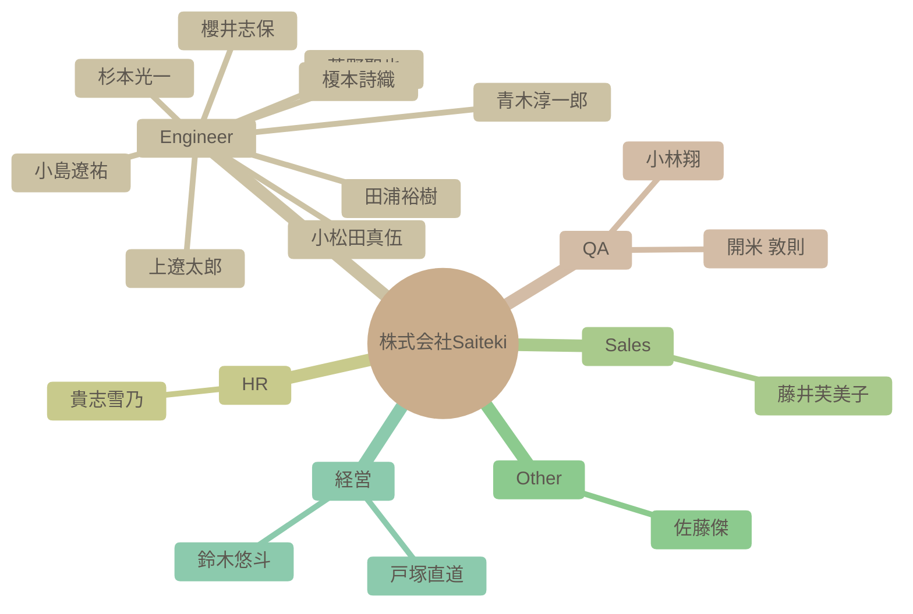

# チーム構成図

自動生成された組織図です。IssueおよびSlack連携による高度なAI分析結果が反映されます。

### 📊 関連リソース
- [🌐 インタラクティブ・ナレッジグラフ (Web版)](https://saitekiinc-com.github.io/saiteki-employee-management/)
- [📝 ナレッジグラフ分析レポート (Markdown)](./KNOWLEDGE_GRAPH.md)

### 組織マップ

```mermaid
%%{init: {'theme': 'base', 'themeVariables': {'primaryColor': '#F2EBE3', 'primaryTextColor': '#5D574F', 'primaryBorderColor': '#D9CFC1', 'lineColor': '#BEB3A5', 'secondaryColor': '#FAF9F6', 'tertiaryColor': '#FDFCFB', 'nodeBorder': '1px'}}}%%
mindmap
  root((株式会社Saiteki))
    Engineer
      杉本光一
      青木淳一郎
      櫻井志保
      田浦裕樹
      上遼太郎
      小松田真伍
      小島遼祐
      菅野聖也
      榎本詩織
    QA
      小林翔
      開米 敦則
    HR
      貴志雪乃
    Sales
      藤井芙美子
    Other
      佐藤傑
    経営
      鈴木悠斗
      戸塚直道
```

## 社員一覧サマリー

| 名前 | 職種 | 性格傾向 (概略) | 現在の状態 |
| --- | --- | --- | --- |
| [杉本光一](#%E6%9D%89%E6%9C%AC%E5%85%89%E4%B8%80) | Engineer | 技術トレンドへの深い洞察力と、それを組織全体へ浸透させる推進力を持つ。自身の働き方と組織貢献を両立させ、常に丁寧かつポジティブなコミュニケーションを心がける。責任感が強く、計画的にタスクを遂行し、周囲の意見を尊重する協調性も兼ね備えている。特に、知識の体系化と共有、そしてAI活用の本質的な側面に対する強い関心が見られる。 | 直近では、全社的なAI活用ガイドライン『Saiteki AI Standard』を策定・公開し、AI時代における人間中心の価値創造と本質的な問いの追求を組織全体に促している。AIを単なる効率化の道具ではなく、より深い議論と課題解決を可能にするものと位置づけ、組織文化の変革をリードしている。体系的な知識管理と情報共有の推進に加えて、AI活用の哲学的な側面からも組織の成長を牽引している。 |
| [青木淳一郎](#%E9%9D%92%E6%9C%A8%E6%B7%B3%E4%B8%80%E9%83%8E) | Engineer | 協調性が非常に高く、新しい知識や経験に対し前向きに挑戦する。社交的で周囲との交流を深め、高い責任感を持って業務に取り組む楽観的な性格。 | 年末年始を通してSaitekiメンバーとの出会いに深く感謝し、2026年を「飛躍の年」と意気込んでいる。12月上旬には業務負荷が高い様子が伺えたが、それを乗り越え、現在は非常に前向きな精神状態にある。 |
| [小林翔](#%E5%B0%8F%E6%9E%97%E7%BF%94) | QA | 開放性と協調性が特に高く、新しい経験や人との交流を楽しみ、チームワークを重視する傾向がある。責任感も強く、ポジティブな姿勢を保ちながら、自身の経験や関心を積極的に共有し、自己開示を厭わない。詳細への注意と観察力も顕著。 | 入社初期段階であり、非常に前向きで期待に満ちた状態。積極的に自己開示し、様々な趣味や経験を通じて周囲との共通点を見つけることで、良好な人間関係を築こうと行動している。特にプライベートな興味や体験を詳細に共有することで、チームメンバーとの心理的距離を縮めようとしている。 |
| [櫻井志保](#%E6%AB%BB%E4%BA%95%E5%BF%97%E4%BF%9D) | Engineer | 自己認識が高く、協調性があり、学習意欲も高い。新しい環境への適応力も期待でき、謙虚で丁寧な印象を与えます。 | 1月からの入社を控えており、新しい環境に対する高い期待感と意欲に満ち溢れています。自身のスキルを活かしつつ、さらなる専門性向上とチームへの貢献を目指しています。 |
| [田浦裕樹](#%E7%94%B0%E6%B5%A6%E8%A3%95%E6%A8%B9) | Engineer | 非常に協調性が高く、誠実で、周囲への配慮を忘れない。新しい知識や経験への探求心が旺盛で、ユーモアを交えながら積極的に他者と関わる。自身の業務状況を正直に伝え、同僚の活動をサポートするなど、ポジティブな関係構築を重視する。特に、顧客理解と会社の戦略的優位性への探求が深化しており、組織のビジョンへの共感が極めて深い。 | 同僚が執筆したnoteの内容に深く感動し、Saitekiのビジョン実現と業界課題解決への自身のコミットメントを再確認している。新しいメンバーの参加を心から歓迎し、彼が組織に合うことを見抜いていたことを伝え、今後のプロジェクトでの協業を楽しみにする、非常にポジティブな状態にある。 |
| [開米 敦則](#%E9%96%8B%E7%B1%B3%20%E6%95%A6%E5%89%87) | QA | 学習意欲が旺盛で新しい技術に積極的。責任感が強く、計画的に業務を進める。協調性があり、丁寧なコミュニケーションを心がける。 | 現在、QAにおけるAI協働作業の概念化と初期段階の成果物作成に取り組んでいる。特にテスト計画フェーズの最適化と汎用テスト観点の修正に注力し、業務プロセスの戦略的な改善を進めている段階。関係者との情報共有と意見交換にも積極的。 |
| [貴志雪乃](#%E8%B2%B4%E5%BF%97%E9%9B%AA%E4%B9%83) | HR | 組織への貢献意欲と周囲への配慮が非常に高く、課題解決に積極的。新しい知識や経験、会社の事業戦略、社員の心身の健康、社員間の交流、そして人材獲得への探求心が旺盛で、感情表現も豊かでバランスが取れている。 | 直近のログでは、福利厚生プログラム「MELON」の継続的な利用促進、リファラル採用による人材獲得、そしてオンライン飲み部を通じた社内コミュニティの活性化にも積極的に取り組んでおり、社員のウェルビーイングと長期的なパフォーマンス向上、会社成長への貢献、そして従業員エンゲージメントの向上に高い意欲を示している。 |
| [上遼太郎](#%E4%B8%8A%E9%81%BC%E5%A4%AA%E9%83%8E) | Engineer | 責任感が非常に強く、物事を深く理解しようとする探究心があります。計画的かつ体系的に業務を進め、困難な状況でも冷静さを保ち、正直かつ協調的な態度で問題解決に取り組みます。 | 直近では、二つの主要な開発フェーズドキュメント（新基本設計、新詳細設計）をSMART-APP仕様書を参考に完成させ、そのリンクを共有しました。実装作業に関しては、イメージが湧かず、また時間的な制約があるため、責任を持って他者への協力を要請しています。また、AIへのインプット方法について具体的な確認を行い、作業の正確性を追求しています。 |
| [小松田真伍](#%E5%B0%8F%E6%9D%BE%E7%94%B0%E7%9C%9F%E4%BC%8D) | Engineer | 新しい技術や知識の習得、改善提案に極めて積極的で、それを組織に還元しようとする意識が非常に高い。技術的な探求心だけでなく、ビジネスの側面への深い洞察も示す。周囲とのコミュニケーションを円滑に行い、場を和ませる能力も持つ。特に、社会や組織全体、そしてチームメンバーをより良くしようとする貢献意欲が顕著であり、活動的でチームを鼓舞する傾向がさらに強まっている。 | 新たなチームへの参加に大きな喜びと感謝を表明し、非常に高いモチベーションで業務に取り組んでいる。AI駆動ナレッジマネジメントシステムにおいては、ナレッジグラフの設計・実装と運用設計に深く携わり、特にノード/エッジの詳細設計、Entityキーワードの語彙統一、陳腐化対策の自動化と人間の介入のバランスを考慮した運用計画を策定・検証している。GitHub Issueでの検索MVPを達成し、非エンジニア層の使いやすさを重視したSlackモーダル検索の実装に着手する段階にある。 |
| [小島遼祐](#%E5%B0%8F%E5%B3%B6%E9%81%BC%E7%A5%90) | Engineer | 新しい知識や経験に対する強い好奇心と探求心を持ち、周囲の意見を尊重し、積極的に関係を深めようとする。入社3ヶ月目の新人として、自己成長と周囲との協働に意欲を燃やす。責任感も強く、常に前向きな姿勢を保ち、人とのつながりを重視する。不明な点があっても、それを成長の機会と捉え、粘り強く理解に努める。 | 入社3ヶ月目の新入社員として、新しい環境への適応と人間関係の構築に積極的に取り組んでいる。自己開示と共通の話題を通じて周囲との親近感を深めつつ、自身の成長とチームへの貢献意欲を高く持っている。専門的な学習だけでなく、趣味を通じた交流にも意欲的である。 |
| [藤井芙美子](#%E8%97%A4%E4%BA%95%E8%8A%99%E7%BE%8E%E5%AD%90) | Sales | 非常に高い責任感と細部へのこだわりを持ち、組織運営の正確性と公平性を追求する。一方で、個人の経験や趣味を積極的に共有し、親しみやすい雰囲気を作り出すことで、周囲や新しいメンバーとの良好な関係構築を図る。 | 総務として、賃金規定改定や36協定更新、さらには「子ども・子育て支援金制度」の導入といった重要かつ複雑な規則・制度に関する情報伝達に積極的に取り組んでいる。これらの業務を通じて、組織の透明性確保とコンプライアンス遵守、そして全社員への公平な情報提供に尽力している。同時に、複数の新しいメンバーを温かく迎え入れ、個人的な話題を共有することで、彼らの円滑なオンボーディングと職場の人間関係の活性化にも貢献しており、公式・非公式両面で組織の中心的な役割を担っている。 |
| [菅野聖也](#%E8%8F%85%E9%87%8E%E8%81%96%E4%B9%9F) | Engineer | 新しい技術や知識の吸収に意欲的で、協調性と社交性を持ち合わせる。自身の強みをユーモアを交えて表現し、感情も安定している。 | 入社直後で、開発者としての復帰とチームとの協働に非常に前向きである。AI技術への関心は非常に高く、読書を通じて多様な知識を吸収し、それを業務やコミュニケーションに活かそうとしている。人との交流も積極的に楽しみ、新しい環境での活躍を強く望んでいる。 |
| [佐藤傑](#%E4%BD%90%E8%97%A4%E5%82%91) | Other | 非常に開放的で誠実、外向的で協調性も高い。常に前向きで、新しい挑戦や学びを楽しみ、実践と情報共有を通じて貢献しようとする探求心と行動力を兼ね備えている。 | 海外での活動を継続しており、現在はUAEに滞在し、その後ASEAN中台韓を巡り、来年には帰国予定。国際的なチーム開発やハッカソンに積極的に参加し、最新のAI技術（特に小型高性能AIモデルのMac環境での実用性）に高い関心を持ち、M4 MaxでのGPTsossの動作を検証・共有するなど、その情報共有を通じて実践的な活用を模索している。質問歓迎の姿勢で、コミュニティへの貢献も意識している。 |
| [鈴木悠斗](#%E9%88%B4%E6%9C%A8%E6%82%A0%E6%96%97) | 経営 | 社交的で責任感が強く、自身の内面やビジョンを積極的に開示する開放性を持つ。共感力と協調性も非常に高く、困難な状況でも感情の安定を保ち、周囲を巻き込むポジティブなエネルギーを発する。新たな挑戦にも意欲的。 | 会社の3期目突入にあたり、自身のビジョンと情熱を共有するnoteを執筆し、全社的なエンゲージメントとチームビルディングに精力的に取り組んでいる。新しいメンバーの歓迎や既存メンバーとの交流にも積極的で、プライベートでは長男の入学式という人生の節目を迎え、公私ともに非常に活動的かつ前向きな状態である。 |
| [戸塚直道](#%E6%88%B8%E5%A1%9A%E7%9B%B4%E9%81%93) | 経営 | 非常に外向的で協調性が高く、誠実かつ開放的な人物。組織の戦略的成長とメンバーの成功に深くコミットし、困難な状況にも持ち前の分析力と前向きさで対処する。特にAI駆動型ビジネスモデルの推進、市場変化への戦略的対応、企業文化の醸成、そしてリーダーの自己管理に対する深い洞察と、それを自身の事業や行動に落とし込む粘り強さが顕著。今回のログでは、チームエンゲージメントと人材獲得への強いコミットメントが改めて強調されている。 | 第3期の始動に伴い、MVVの浸透と文化の再構築を強く推進している。同時に、自らが音頭を取り大規模な交流イベントを企画し、積極的なリファラル採用活動を展開することで、組織の一体感と成長を加速させている。新規入社者への個別サポートにも注力し、高負荷ながらも非常にポジティブなエネルギーで多方面に活動している。 |
| [榎本詩織](#%E6%A6%8E%E6%9C%AC%E8%A9%A9%E7%B9%94) | Engineer | 非常に開放的で協調性があり、新しい知識や経験を積極的に取り入れようとする。親しみやすく、ユーモアのセンスも持ち合わせながら、自己を客観視できるバランスの取れた性格。 | 6月～7月の入社を間近に控え、期待と意欲に満ち溢れている。積極的にコミュニケーションを取り、周囲との関係構築に努めており、社内での新しい経験と学習を楽しみにしている。 |

---

## 詳細プロフィール

各社員の詳細な分析結果です。クリックして展開できます。

### 杉本光一 (Engineer)

> **総合サマリー**: 最新AI技術を深く探求し、その本質的な価値と組織への影響を哲学的に考察する技術リーダー。AI時代の組織変革をリードし、人間中心のAI活用と本質的な課題解決を促す。体系的な知識共有と自律的な働き方の最適化に注力し、組織全体の生産性向上と深い議論の文化醸成を目指す実行力のある人物。

<b>🛠 性格傾向</b>

**要約**: 技術トレンドへの深い洞察力と、それを組織全体へ浸透させる推進力を持つ。自身の働き方と組織貢献を両立させ、常に丁寧かつポジティブなコミュニケーションを心がける。責任感が強く、計画的にタスクを遂行し、周囲の意見を尊重する協調性も兼ね備えている。特に、知識の体系化と共有、そしてAI活用の本質的な側面に対する強い関心が見られる。

| 項目 | スコア | 根拠・エピソード |
| --- | --- | --- |
| 開放性 | 9/10 | AI活用における「なぜ」を深く問い、安易なAI依存に警鐘を鳴らす。AIが与える影響を多角的に考察し、組織の未来を見据えた新しい働き方を提示するドキュメントを策定した。ナレッジベースの構築において、Slack情報を活用したチームビルディングやPJアサインの可能性を動画で提示したり、Neo4jのようなグラフデータベースの適用を検討するなど、新しい技術やアイデアを柔軟に取り入れ、その応用可能性を探求する。ナレッジベースの具体的なカテゴリ案やRAG利用時のプロンプトと期待される回答例を詳細に提示し、新しい情報活用の仕組みを具体的に設計している。 |
| 誠実性 | 9/10 | 全社的なAI活用ガイドライン『Saiteki AI Standard』を策定し公開するなど、組織全体の課題解決に対する強い責任感と、それを具体化するための計画性、実行力を持つ。表面的な効率化だけでなく、本質的な価値創造につながるよう具体的な提言を行う。子供の保育所入園に伴う働き方の変更に際し、単なるMTG中止ではなく、Notionを活用した1on1ページやテンプレート、チェックポイントを具体的に設定し、コミュニケーションの継続性を担保する。プロジェクトの進捗をこまめに確認し、必要に応じてリマインドや詳細な指示、具体的な資料提示を行うなど、責任感と計画性を持ってタスクとチームの管理を行う。AI活用ドキュメントの運用方法を動画で作成し、チーム全体の知識共有・蓄積の促進を図るなど、具体的な仕組み作りを推進する。 |
| 外向性 | 9/10 | 全社チャンネルを通じて自らの深い洞察と提言を積極的に発信し、組織全体に対してAI活用の本質について議論を促すなど、影響力を行使する。ドキュメントを読み、意見をシェアしてほしいと呼びかけるなど、オープンな対話を重視する。AI活用プロジェクトの現状や、AI駆動開発による組織の変化に関する自身の見解を動画やメッセージで積極的に共有する。初対面の同僚には笑顔で自己紹介し、同僚のライフイベントを祝福するなど、オープンで親しみやすいコミュニケーションを心がける。「AIと法 実務大全」を良書として積極的に推薦し、その活用法についてもアドバイスを行うなど、知識を共有することに意欲的である。 |
| 協調性 | 9/10 | AIによって生まれた時間をチーム内の議論や対話に費やすべきだと提言し、問題が本当に解決するまで会話し続けるスタイルを推奨するなど、協調性とチーム全体の成長を重視する。組織全体の意識向上を図り、共に成長しようとする姿勢が見られる。自身の提案が承認された際に喜びを表現し、MTG変更の提案時には相手の意見や懸念を求め、具体的な代替案を提示する。同僚の努力や成果に感謝を伝え、遅い時間の対応にも労いと感謝を示すなど、他者への配慮と尊重が見られる。不明点があればいつでも聞くよう促すなど、サポートする姿勢も持ち合わせる。返信が遅れた際には丁寧にお詫びを述べ、相手の作業を承認する際にも感謝を伝えるなど、細やかな配慮を示す。 |
| 神経症的傾向 | 3/10 | AI活用における懸念点を具体的に指摘しつつも、それを解決するための具体的な指針と、AIがもたらすポジティブな未来像を論理的かつ冷静に提示する。感情的になることなく、組織全体を前向きな方向に導こうとする安定した姿勢が見られる。ワークライフバランスの変化に伴う働き方の調整を、感情的ではなく具体的な解決策と丁寧な説明を伴って提示し、周囲の理解を求める。業務の進捗確認やリマインドも、常に穏やかで建設的な口調で行うなど、精神的な安定性と落ち着きを保って対応する。多忙により稼働が確保できない状況でも、その旨を冷静に伝え、今後の対応について言及するなど、感情的にならず状況を説明する。 |

<b>💪 仕事スタイルと強み</b>

**要約**: AI技術への深い知見と、その本質的な価値を追求する戦略的思考で、組織の課題解決と文化変革をリードする。人間中心のAI活用を提唱し、本質的な価値創造とチーム内の深い議論を促進。体系的な知識管理、情報共有の仕組み化を強力に推進し、実行力、問題解決能力、そして未来を見据えた提言力を兼ね備える。

**問題解決スタイル**: AI活用における「なんとなく必要」といった表面的なアプローチに警鐘を鳴らし、「なぜ」を深く掘り下げることで本質的な課題解決を促す。AIをあくまで道具と捉え、人間が判断の主体として価値を出し続けることの重要性を説く。チームでの対話と協調を通じて、クライアントの言葉の裏にある真の課題を発見し、解決に導くことを重視する。具体的なガイドラインを策定し、組織全体の思考様式と行動変革を促すアプローチを取る。AI駆動開発による組織や人材の変化を予見し、自律的な課題解決を促すメッセージを発信する。組織内のナレッジ共有やコミュニケーションの課題に対し、Slack情報の有効活用やNotionを活用した非同期コミュニケーションの仕組みなど、具体的なソリューションを自ら提案・構築する。AI活用の機会損失をなくすという明確な課題感を持ち、その解決のためにドキュメント運用方法を動画で作成し、知識の共有・蓄積を推進する。技術的な問題に対しては、Neo4jのような代替案を提示し、そのメリットを多角的に説明することで最適な解決策を模索する。

**主要な強み**: AI技術の深い知見と実践的な応用力, AI時代における組織・人材戦略への深い洞察, 情報共有とナレッジマネジメントの推進と仕組み化, 実行力と迅速な問題解決能力, 丁寧で建設的なコミュニケーションとチームガイダンス, ワークライフバランスを考慮した柔軟な働き方の提案と実践, 戦略的かつ実用的な技術選定能力, 高度な知識管理と情報活用戦略の立案・実行, 人間中心のAI活用哲学の提唱と浸透, 組織文化変革へのリーダーシップ, 本質的な価値創造への深い洞察と提言力, 深い議論と対話を促すファシリテーション能力

**証拠エピソード**:
- 『Saiteki AI Standard』を策定・公開し、AI活用における組織全体の思考様式と行動規範を具体的に提示した。
- AIに依存するのではなく、『なぜ』を問い、人間が判断の主体であるべきというAI活用の本質的な哲学を組織全体に発信した。
- AIによって生まれた時間をチーム内の深い議論や対話に費やすべきだと提言し、問題が本当に解決するまで会話し続けるスタイルを促した。
- 『どう作るか』ではなく『何を作るか・なぜ作るか』を考える時間を増やすことをAI活用のゴールとして明示し、組織全体の意識変革を促した。
- AI駆動開発の現状と、それに伴い求められるエンジニアの役割変化（自律的な課題発見・解決）について、現場からの知見として積極的に共有した。
- 子供の保育所入園に伴う生活リズムの変化に合わせ、20時からの定例MTGを一旦取りやめ、Notionを活用した非同期1on1の仕組みを提案し、具体的なページと運用ルール（チェックポイント、週間ログ）を設定した。
- 社内でのAI活用推進の一環として、Slack情報の有効活用を目的としたプロジェクトについて、NotebookLMで動画を作成し、PJアサインやチームビルディングへの応用可能性を提示した。
- AI活用に関するドキュメントの運用方法を動画で作成し、チーム全体の知識共有・蓄積を促し、AIによる活用機会損失をなくす目的を明確に伝えた。
- 「AIと法 実務大全」という書籍を紹介し、AI生成が前提となる開発においてエンジニアも法的観点を持つ必要性を提言するなど、未来を見据えた学習と情報共有の重要性を説いた。
- ナレッジベースの構造化において、具体的なカテゴリ例（AI技術、開発実践知、導入実績など）と、RAGを活用した情報検索の具体的なユースケース（Cursorの活用事例）を提示し、ナレッジの有効活用を促す設計を行った。
- ナレッジ検索の効率化とデータ構造の柔軟性を考慮し、JSONだけでなくNeo4jのようなグラフデータベースの活用可能性にも言及し、そのメリット（エッジの意味付け、クエリの扱いやすさ）を具体的に説明した。
- チームメンバーのプロジェクト進捗（詳細設計、基本設計）をNotionやSlackでこまめに確認し、期日のリマインドや、具体的な実装資料の共有、不明点があればいつでも相談に乗る姿勢を示すことで、プロジェクトの円滑な進行を支援した。
- AIドキュメントの具体的なワークフローの検討の余地を認めつつ、既存のAIドキュメントに反映させるなど、迅速な対応力も示す。

<b>💎 価値観とモチベーター</b>

**要約**: 最新AI技術への探求心に加えて、その本質的な意味と人間社会・組織への影響を深く考察し、人間中心の価値創造と組織文化の変革に最大の喜びを見出す。AI時代における「なぜ」を追求する知的好奇心と、チーム内の深い対話を通じた課題解決、そして組織全体の知の活用と成長を強く志向する。自律的な行動と貢献を重視し、自ら指針を構築する情熱を持つ。

**コアバリュー**: 技術革新と探求 (特にAIと知識グラフ、ベクトル検索、AI駆動開発), 組織・チームへの貢献 (ナレッジ共有、業務効率化、コミュニケーション改善), 自律的な行動と役割の拡張, AI時代における組織の適応と成長, 未来を見据えた継続的な学習と洞察 (特にAIと法), 実践を通じた技術検証と実装, オープンな情報共有と透明性, ワークライフバランスの重視と、それによる持続可能な貢献, 体系的な知識共有と活用, 人間中心のAI活用と価値創造, 本質的な問い（Why）の追求, チーム内の深い対話と協調, 組織文化の変革と進化

**モチベーショントリガー**: AI技術が組織の文化や働き方を良い方向に変革すること, 自身のアイデアや知見を活かして具体的な仕組みを構築し、その効果を実感すること, チームのナレッジ蓄積や情報活用の効率化に貢献すること, メンバーが自律的に課題を見つけ解決する組織風土を醸成すること, 技術的な問題を迅速に解決し、システムを安定稼働させること, 新たな技術や社会の変化に関する知識を深く学び、それを周囲と共有すること, 知識共有の仕組みを構築し、組織全体の知の活用を促進すること, チームや組織の生産性が向上すること, AIが単なる効率化ツールでなく、より本質的な思考と深い議論を促進するきっかけとなること, 組織全体がAI時代に合わせた思考様式と働き方に変革していく過程, 自身の策定したガイドラインが組織全体に浸透し、具体的な行動変容に繋がること

**証拠エピソード**:
- 『Saiteki AI Standard』を策定し、AI活用における安易な依存ではなく、『なぜ』を問い、人間が判断の主体であるべきという強い信念と価値観を示した。
- AIによって生まれる時間をチーム内の深い議論や対話、本質的な課題解決に充てるべきだと提唱することで、組織の文化変革への強い意欲を示した。
- 『どう作るか』ではなく『何を作るか・なぜ作るか』を考える時間を増やすことをゴールと設定し、AIをそのための道具と位置づけることで、本質的な価値創造への強いコミットメントを示した。
- AI駆動開発の現場での知見を共有し、受動的な働き方から能動的な役割拡張へと組織文化が変化する必要性を訴えることで、組織の適応と成長への強い意識を示した。
- AIと法の専門書を推奨することで、エンジニアが技術だけでなく、社会や法律といった多角的な視点を持つことの重要性を強調し、未来を見据えた学習への価値観を示した。
- ナレッジベースのカテゴリ分けやRAGの具体的な利用例を提示することで、AIを活用した情報共有が組織の課題解決と成長に直結するとの信念を示し、その実現に尽力している。
- 自身のライフイベントに合わせ、既存の定例を非同期コミュニケーションに移行し、そのための具体的な仕組みを提案・構築することで、柔軟な働き方と組織貢献の両立を自ら実践し、その重要性を組織に提示した。
- Slack情報活用プロジェクトの目的を、PJアサインやチームビルディングに繋げることと明確にすることで、技術が組織全体の最適化に貢献することへのモチベーションを示した。
- AI活用の機会損失をなくすという課題感を自ら設定し、その解決のためにドキュメントの運用方法を動画で提案するなど、自律的な課題解決と貢献への意欲を示す。

<b>📈 現在の状態</b>

**要約**: 直近では、全社的なAI活用ガイドライン『Saiteki AI Standard』を策定・公開し、AI時代における人間中心の価値創造と本質的な問いの追求を組織全体に促している。AIを単なる効率化の道具ではなく、より深い議論と課題解決を可能にするものと位置づけ、組織文化の変革をリードしている。体系的な知識管理と情報共有の推進に加えて、AI活用の哲学的な側面からも組織の成長を牽引している。

- **感情レベル**: positive
- **業務負荷状況**: 既存の業務やライフイベントによる時間的制約がある中で、『Saiteki AI Standard』のような全社的な重要ドキュメントの策定と啓蒙活動を行っており、相当な業務負荷がかかっていると推測される。しかし、その活動は非常に戦略的かつ建設的で、AI活用に対する深い洞察と情熱に裏打ちされており、精神的な安定と高いモチベーションを保ってタスクを推進している。
- **最近の関心トピック**: AI駆動開発と、それに伴うエンジニアの役割の変化, AIと法務に関する知見の習得, AI活用ドキュメントの運用とチームの知識共有促進, ナレッジベースのカテゴリ設計とRAGを活用した具体的な情報検索の仕組み, Neo4jなどのグラフデータベースを活用した検索ソリューションの検討, メンバーの基本設計・詳細設計の進捗管理とサポート, Saiteki AI Standardの策定と公開、およびAI活用の本質的な哲学, AIがもたらす組織文化と働き方の変革, AIによる深い議論と本質的な課題解決の促進

---

### 青木淳一郎 (Engineer)

> **総合サマリー**: AWS基盤の専門性を持ち、未経験技術の習得にも意欲的。福岡在住で家族を大切にし、高い責任感と協調性でSaitekiへの貢献とメンバーとの交流を積極的に図る人物。

<b>🛠 性格傾向</b>

**要約**: 協調性が非常に高く、新しい知識や経験に対し前向きに挑戦する。社交的で周囲との交流を深め、高い責任感を持って業務に取り組む楽観的な性格。

| 項目 | スコア | 根拠・エピソード |
| --- | --- | --- |
| 開放性 | 8/10 | AWS基盤の経験がある中で、AzureやGoogle Cloud、AIといったクラウド技術への強い関心を示す。未経験のBIツールに苦戦しながらも、それをスキルの幅を広げるチャンスと捉え、前向きに知識と経験の習得に努めている。 |
| 誠実性 | 7/10 | 業務の納期を最優先し、興味のある社内イベントであっても納品が近いことを理由に参加を見送る判断をするなど、強い責任感を持つ。未経験のBIツールでの苦労も、粘り強く習得に努める機会と捉えている。 |
| 外向性 | 8/10 | 入社時に詳細な自己紹介を行い、共通の趣味（Youtube、パパ）を持つメンバーには積極的に交流を呼びかけ「パパ会」を提案。地域を越えた「西日本勢」の盛り上げにも意欲を見せるなど、社内でのコミュニケーションや親睦を重視する姿勢が強い。 |
| 協調性 | 9/10 | メンバーの投稿に対し共感や感謝を積極的に示し、共通点を見つけて親睦を深めようとする。他者のnoteを読み感動を伝えるなど、周囲の人々の気持ちや経験を尊重し、良好な関係性を築くことに非常に長けている。 |
| 神経症的傾向 | 3/10 | ネガティブな感情の表出は非常に少なく、近所のサル出没に驚きと恐怖を感じたという発言程度。未経験のBIツールでの苦戦や多忙な業務状況下でも、常に前向きな姿勢を保ち、状況を好転させる機会と捉える傾向がある。 |

<b>💪 仕事スタイルと強み</b>

**要約**: AWS基盤のインフラ設計・構築に高い専門性を持ちつつ、未経験技術への学習意欲が極めて高い。責任感が強く、チームワークと自己成長を重視して業務に取り組む。

**問題解決スタイル**: 未経験の技術や困難に直面しても、それをスキルアップの好機と捉え、前向きな姿勢で学びと経験を積み重ね、解決策を模索する。

**主要な強み**: インフラ設計・構築スキル, 学習意欲, コミュニケーション能力, 責任感

**証拠エピソード**:
- 入社時の自己紹介でAWS基盤のインフラ設計・構築に携わってきたことを明確に述べている。
- Azure、Google Cloud、AIへの関心や、未経験のBIツール（QuickSuite）に苦戦しつつも「スキルの幅を広げるチャンス」と捉え積極的に取り組む姿勢を見せている。
- 興味のある社内イベントであっても、納品が近いことを理由に不参加を表明し、業務を最優先する強い責任感を見せている。
- 「Saitekiの輪をどんどん広げていけたら」と発言し、オンラインでの積極的なコミュニケーションや「パパ会」の提案を通じてメンバーとの関係構築に努めている。

<b>💎 価値観とモチベーター</b>

**要約**: 家族との時間を大切にし、仕事では新しい技術の習得と自己成長を追求。組織への貢献意欲とSaitekiの一員であることへの誇り、メンバーとの交流を非常に重視している。

**コアバリュー**: 家族, 成長, 貢献, 責任

**モチベーショントリガー**: 新しい技術の習得, チームへの貢献, 自己成長, 人との交流

**証拠エピソード**:
- 自己紹介で「家族とドライブに行ったり、子どもと遊んだり、妻をガチャガチャ屋さんに連れて行ったり」と休日の過ごし方を共有し、家族との時間を大切にしている様子が伺える。
- AWS以外のAzure、Google Cloud、AIといった技術への学習意欲や、未経験のBIツールでの苦戦も「スキルの幅を広げるチャンス」と捉え、知識と経験を得ることに意欲的である。
- 入社時に「Saitekiの輪をどんどん広げていけたら」と組織への貢献意欲を示し、年末には2025年を「最高の年」と振り返り、2026年を「さらに飛躍の年にしていきましょう！」と語るなど、強い責任感と組織への帰属意識が見られる。
- オンラインでのコミュニケーションを重視し、「パパ会」や「西日本勢盛り上げていきましょー」とメンバー間の交流を積極的に促進しようとしている。
- 他者のnoteを読んで「グッときました！」と感動を伝え、メンバーの入社経緯への関心を示している。

<b>📈 現在の状態</b>

**要約**: 年末年始を通してSaitekiメンバーとの出会いに深く感謝し、2026年を「飛躍の年」と意気込んでいる。12月上旬には業務負荷が高い様子が伺えたが、それを乗り越え、現在は非常に前向きな精神状態にある。

- **感情レベル**: positive
- **業務負荷状況**: 12月上旬には納品が近く、帰りが遅くなるほどの業務負荷があったが、それを乗り越え、年末年始は達成感と来年への意欲を見せている。
- **最近の関心トピック**: Saitekiメンバーの入社経緯, 京都旅行, 2025年の振り返りと2026年への期待, BIツールの知識習得

---

### 小林翔 (QA)

> **総合サマリー**: 協調性が高く、新しい環境への適応力に優れる人物。多岐にわたる趣味と経験を詳細かつ情熱的に共有することで、周囲との関係を深め、共に成長することを重視する。社交的な交流を楽しみ、自ら情報を発信することで場を活性化させる。

<b>🛠 性格傾向</b>

**要約**: 開放性と協調性が特に高く、新しい経験や人との交流を楽しみ、チームワークを重視する傾向がある。責任感も強く、ポジティブな姿勢を保ちながら、自身の経験や関心を積極的に共有し、自己開示を厭わない。詳細への注意と観察力も顕著。

| 項目 | スコア | 根拠・エピソード |
| --- | --- | --- |
| 開放性 | 9/10 | 出張先や趣味の旅行で知った美味しい飲食店（京都のうどん、沼津の餃子）を詳細に紹介し、地域特有の文化や食への深い興味と探求心を示す。自身の声が入ったライブ動画を共有するなど、アニメやアイドルといったポップカルチャーへの関心も非常に高く、多様な趣味を持つ。沼津の餃子の製法について言及するなど、物事の本質や背景にも関心を持つ。 |
| 誠実性 | 8/10 | 紹介する飲食店の情報（つゆのタイプ、麺の食感、天ぷらのサクサク感、餃子の製法、行列状況）が非常に詳細で具体的であることから、物事を注意深く観察し、記憶・整理する能力が高いことがうかがえる。自身のライブ体験の細部まで覚えている点も同様である。出張中に特定のうどん屋を何度もリピートするなど、気に入ったものには繰り返し関わる几帳面さも見られる。 |
| 外向性 | 9/10 | 飲み会後に自身の趣味に関する情報や動画を積極的に共有し、交流を深めようとする姿勢が明確に見られる。社交的なイベントへの参加に「わくわく」と絵文字を添えて意欲を示し、自身のライブでのエピソードをユーモアを交えて語るなど、自己開示を積極的に行うことで周囲との関係性を構築しようとする。参加後のお礼と情報提供も積極的な交流を示す。 |
| 協調性 | 9/10 | 飲み会後の感謝の言葉や、美味しいお店の情報を共有する行為自体が、周囲への配慮と貢献意識の表れである。自身の動画を共有する際に「何万分の一ですが…」と謙遜する姿勢や、ライブの思い出を共有することで親しみやすさを醸し出すなど、友好的で協調的なコミュニケーションを心がけている。 |
| 神経症的傾向 | 3/10 | 自身の声が入った動画の共有に際しても、ユーモラスな表現を使い、ライブでの失敗談を明るく語るなど、ポジティブな自己開示が見られる。ストレスや不安を感じやすい様子はなく、社交的な場面を心から楽しんでいる。 |

<b>💪 仕事スタイルと強み</b>

**要約**: 長年の経験に裏打ちされた細部への注意と、高いコミュニケーション能力が強み。新しい情報や知識の吸収にも積極的で、協調性を持ちながら業務に取り組む。状況把握と情報共有に長け、自身の経験を活かした具体的な提案も期待できる。

**問題解決スタイル**: 13年間のテスター経験を通じて培われた、細部に目を配り潜在的な問題点を見つけ出す能力を持つ。自身の経験や知識を活用し、論理的に課題を整理する傾向がある。具体的な情報収集と提供の側面が強化され、事実に基づいた提案を行う。

**主要な強み**: テスト・品質管理経験, コミュニケーション能力, 情報収集力, 情報提供力, 状況説明能力, 協調性, 詳細観察力

**証拠エピソード**:
- 飲み会後に、参加者へのお礼と共に、自身の趣味の動画と具体的なグルメ情報を詳細に共有する。
- 出張先や旅行で訪れた飲食店の特徴（麺の食感、天ぷらの状態、餃子の製法、行列状況）を細かく記憶し、他者に分かりやすく伝える。
- 社交的なイベントへの参加に強い意欲と喜びを示し、積極的に交流の機会を設ける。

<b>💎 価値観とモチベーター</b>

**要約**: 成長、繋がり、楽しさ、探求、そして経験を重視する。新しい知識やスキルの習得、他人との良好な関係構築、充実した楽しい経験、そして自身の情熱を共有することがモチベーションの源泉となる。

**コアバリュー**: 成長, 協調, 楽しさ, 探求, 繋がり, 経験の共有

**モチベーショントリガー**: 新しい知識やスキルの習得, チームへの貢献と協業, 楽しい経験や趣味の追求, 共通の興味を持つ人々との交流, 興味を持ったことの詳細な情報共有, 自己開示を通じた人間関係の深化

**証拠エピソード**:
- 飲み会の後に、自らの趣味や出張先での発見を詳細に共有することで、仲間との繋がりを深めようとする。
- 旅行や出張先での新しい発見（美味しいお店や地域文化）を積極的に楽しみ、それを他者と共有することに喜びを感じている。
- 社交的なイベントへの参加に「わくわく」と感情を表現し、楽しい経験を重視する姿勢が見られる。

<b>📈 現在の状態</b>

**要約**: 入社初期段階であり、非常に前向きで期待に満ちた状態。積極的に自己開示し、様々な趣味や経験を通じて周囲との共通点を見つけることで、良好な人間関係を築こうと行動している。特にプライベートな興味や体験を詳細に共有することで、チームメンバーとの心理的距離を縮めようとしている。

- **感情レベル**: positive
- **業務負荷状況**: 業務外の交流を活発に行っている段階であり、業務負荷はまだ限定的または、業務とプライベートのバランスをうまく取っている状況。
- **最近の関心トピック**: 美味しいグルメ（京都のうどん、沼津の地域特産餃子など）, 旅行・出張での体験と詳細な情報共有, アニメ・アイドルライブ（特にラブライブ!関連の思い出話）, 社交的なイベントへの参加と交流, 自身の趣味や経験を詳細に共有すること

---

### 櫻井志保 (Engineer)

> **総合サマリー**: 櫻井志保さんは、データ分析スキルと高い学習意欲を持ち、協調性をもってチームに貢献しようと意欲的な人物です。

<b>🛠 性格傾向</b>

**要約**: 自己認識が高く、協調性があり、学習意欲も高い。新しい環境への適応力も期待でき、謙虚で丁寧な印象を与えます。

| 項目 | スコア | 根拠・エピソード |
| --- | --- | --- |
| 開放性 | 8/10 | Power BIを用いたデータ分析・加工の経験があり、資格取得を目指しデータベース構築といったより専門的な分野への挑戦意欲を明確に示しています。 |
| 誠実性 | 7/10 | 自己紹介で自身の業務経験、スキル、今後の展望を詳細かつ明確に記述しており、責任感と計画性が伺えます。趣味を通じて業務のリフレッシュを図る自己管理能力も持ち合わせています。 |
| 外向性 | 6/10 | 「Slack等を通じて積極的にコミュニケーションを取っていければ」と、自ら進んで他者との交流を求める姿勢が見られます。ただし、直接会う機会が少ないことへの言及もあり、バランスの取れた交流を好むと推測されます。 |
| 協調性 | 9/10 | 「今後ともよろしくお願いいたします」「まだまだ至らない点も多いかと思いますが、何卒よろしくお願いいたします」といった謙虚で丁寧な言葉遣いから、協調性や相手への配慮が強く感じられます。 |
| 神経症的傾向 | 3/10 | 自己紹介の内容全体から、新しい環境への期待感と前向きな姿勢が感じられ、不安や心配を示唆する要素は見当たりません。 |

<b>💪 仕事スタイルと強み</b>

**要約**: データに基づいた分析力と高い学習意欲を持ち、自ら専門性を深めようと努力します。チームでのコミュニケーションを重視し、協調的に仕事を進めるタイプです。

**問題解決スタイル**: データ分析スキルを活かし、論理的な思考で現状を把握し問題解決に取り組むアプローチを取ります。

**主要な強み**: データ分析, 学習意欲, コミュニケーション

**証拠エピソード**:
- Power BIを用いたデータ分析・加工の経験があると述べています。
- 資格取得を目指し、データベース構築などより専門的な分野への挑戦を考えていると表明しています。
- Slack等を通じて積極的にコミュニケーションを取りたいと意欲を示しています。

<b>💎 価値観とモチベーター</b>

**要約**: 自身の成長と専門性向上を重視し、新しい知識やスキルを習得することに喜びを感じる人物です。チームワークを大切にし、周囲との良好な関係を築きながら貢献することにモチベーションを感じます。

**コアバリュー**: 成長, 貢献, 協調性, 専門性

**モチベーショントリガー**: 新しい知識やスキルの習得, 専門性の向上, チームへの貢献, 自己管理を通じたパフォーマンス維持

**証拠エピソード**:
- 資格取得やデータベース構築といった専門分野への挑戦意欲を表明しています。
- Slack等を通じて積極的にコミュニケーションを取りたいと述べています。
- 趣味をリフレッシュに活用し、業務パフォーマンス維持に努めていることを示唆しています。

<b>📈 現在の状態</b>

**要約**: 1月からの入社を控えており、新しい環境に対する高い期待感と意欲に満ち溢れています。自身のスキルを活かしつつ、さらなる専門性向上とチームへの貢献を目指しています。

- **感情レベル**: positive
- **業務負荷状況**: 新規入社予定のため、現在の業務負荷は不明ですが、趣味をリフレッシュに活用していることから自己管理ができていると推測されます。
- **最近の関心トピック**: データ分析, データベース構築, 資格取得, Slackを通じたコミュニケーション

---

### 田浦裕樹 (Engineer)

> **総合サマリー**: Saitekiのビジョンと顧客貢献に深く共感し、困難でも諦めず解決策を模索する推進力を持つ。戦略的機動力と柔軟性で会社の独自ポジション確立に貢献する誠実で協調性の高い人物。組織のビジョン達成に強くコミットし、新しい仲間との協業を心から楽しむポジティブな特性が際立つ。

<b>🛠 性格傾向</b>

**要約**: 非常に協調性が高く、誠実で、周囲への配慮を忘れない。新しい知識や経験への探求心が旺盛で、ユーモアを交えながら積極的に他者と関わる。自身の業務状況を正直に伝え、同僚の活動をサポートするなど、ポジティブな関係構築を重視する。特に、顧客理解と会社の戦略的優位性への探求が深化しており、組織のビジョンへの共感が極めて深い。

| 項目 | スコア | 根拠・エピソード |
| --- | --- | --- |
| 開放性 | 10/10 | AI技術の学習に深くコミットし、自身でRAG構築を目標に高性能PCを導入。ゴッホ展を深く鑑賞し、原田マハの関連書籍を即座に購入するなど芸術への知的好奇心が非常に高い。長年の憧れだったチェロを始め、羊文学のライブには毎年参戦するほどの情熱を持つ。日本酒、ビール、ワインを好み、特に黒龍、作、酔鯨、浜福鶴といった銘柄を挙げる。ロイズの生チョコとアイラウイスキーの組み合わせを絶賛するなど、グルメへの探求心とこだわりも深い。新しいメンバーには自身の好きなお酒の銘柄を具体的に挙げて共有している。また、広木大地氏の言葉を引用し、自身の哲学を共有するとともに、プレゼンや資料が仮説に基づいて設計されており、その検証のためのフィードバックを重視する点で、知的好奇心と分析的な思考の深さが伺える。「ホントにワクワクします」とSaitekiの目指す独自のポジションに強い期待と探求心を示す。社長の「正しい提案でも顧客が求めていないなら変える」という方針を会社としての考え方として高く評価する。商談を通じて「正しい提案」だけでなく「顧客の意思決定の文脈に乗せる」ことの重要性を痛感し、それをSaitekiの強みとして捉えている。SIerやコンサルティングファームの主戦場を明確に区別し、Saitekiが担う独自の領域を戦略的に言語化している。さらに、Saitekiのビジョン実現と業界課題の解決、そしてその道のりにある大成功という結果に自身も貢献したいと強く表明しており、会社の目指す新しい境地への探求心と期待が高い。 |
| 誠実性 | 9/10 | PoCの立ち上げフェーズでタスク分解、優先順位付け、計画策定を詳細に行い、進捗を具体的なポイントと共に共有する。AI駆動開発の標準化に向けたワークフローやガイドライン作成にも継続的に取り組む。家庭の事情が生じた際も、業務への影響を考慮し速やかに連絡を行い、柔軟に対応するなど、責任感と計画性が非常に高い。顧客に「自信を持って即答」するためには徹底した準備が必要であると認識し、実践する。自身の進捗がないことを正直に報告し、会議のスキップを提案するなど、責任感と効率性を重視する。プロジェクトの遅延を認めつつも、時間をやりくりして対応する意思を示す。資料やプレゼンは仮説を持って設計し、フィードバックを通じて検証することで、より良いものを提供しようと努める。他のコミットメントに対しては、時間を割くことが難しい状況を正直かつ明確に伝えるなど、自身の業務状況やキャパシティ管理を適切に行い、関係者への配慮を欠かさない。自身の進捗が遅れていることを正直に報告しつつも、「なんとか時間をやりくりしたいと思います」と責任感を持って業務完遂への意欲を示す。「まだ試合終了してません」と困難な状況でも諦めずに解決策を探求する姿勢。商談で得た学びを即座にハチドリ案件の提案修正に活かし、「早期にプロト開発」「同時にリスク制御」で受注を目指すなど、実行力と目標達成へのコミットメントが高い。全社に向けて提案資料へのアクセス権を速やかに共有し、不明点があれば個別にサポートを申し出るなど、責任感を持って情報共有を進める。加えて、同僚のnoteを拝見し、Saitekiのビジョン実現と業界課題解決への貢献に改めて身が引き締まる思いを表明するなど、会社の目標達成への強い責任感とコミットメントを持つ。 |
| 外向性 | 8/10 | 新メンバーには積極的に自己紹介し、自身のプライベートな情報をオープンに共有することで親近感を醸成する。絵文字を非常に多用し、勉強会では活発に発言や改善提案を行うなど、他者との交流を積極的に楽しむ。戸塚氏とのライブ参加を積極的に提案する他、社内レターや商談共有にも感謝を伝え、積極的にコメントを残すなど、関係構築にも意欲的。新しい同僚にお酒の好みや関西在住であることを共有し、共通点を探すことで距離を縮めようとする。グルメに関する話題でも、ユーモアを交えながら活発にコミュニケーションを取り、他者にも試すよう勧める。感謝や喜びの感情を豊富な絵文字とともに頻繁に表現し、他者の発言に対して「めちゃくちゃ嬉しい」と素直に伝えることで、周囲とのポジティブな関係構築を重視する。同僚が参加するマラソンイベントに対して、積極的に応援メッセージを送り、共感とサポートを示す。感謝や意欲を豊富な絵文字を用いて表現し、感情を豊かに伝える。同僚の努力に感謝を述べるなど、積極的にポジティブな交流を図る。多くのメンバーへの感謝のコメントを送り、自身の発言への返信を後ほど行うことを明言するなど、積極的なコミュニケーションとエンゲージメントを示す。全社に向けての資料共有も、他者への働きかけを伴う行動である。さらに、絵文字を多用し、同僚のnoteへの感動を率直に表現する。新しいメンバーを歓迎し、彼がSaitekiに合うと確信していたことを伝え、共に働くことへの感謝と今後の協業への期待を表明するなど、人との積極的な交流を重視し、ポジティブな関係構築に貢献する。 |
| 協調性 | 9/10 | 他者の意見を尊重し、感謝の意を頻繁に伝える。「素晴らしいレターをありがとうございました」「そう言って頂けてめっちゃ嬉しいです」「シェアありがとうございます」「お心遣いありがとうございます」「めちゃくちゃ嬉しいコメントありがとうございます」といった感謝の言葉が多い。荒天時のメンバーの安否を気遣い、周囲への配慮や思いやりが非常に強い。顧客を安心させることを商談の最優先事項と捉え、具体的なヒアリングで実践する。勉強会へのフィードバックも、リモート参加者への配慮を含め建設的に行う。家庭と仕事の両立に奮闘する同僚に深い感謝と労いの言葉をかけ、その努力を認識する。自身の進捗が芳しくない中でも、他の参加者の時間を尊重し、会議の開催について配慮を示す。チームメンバーへの協力を惜しまない姿勢を示す。同僚の体調を気遣う言葉をかけ、自身の経験から顧客への「安心と信頼」提供の重要性を語り、後輩には「普段の業務の中で何度も繰り返しやると、うまくなりますよ」と具体的にアドバイスする。他者の意見やフィードバックに対して「めちゃくちゃ嬉しい」と素直に感謝の意を表明し、後輩に対しては育成的なアドバイスを送る。同僚が参加するマラソンイベントに対し、積極的にエールを送ることで、チーム内の連帯感とサポート精神を発揮する。自身の時間的制約についても、相手に配慮しつつ正直に伝えることができる。「素晴らしいLetterをありがとうございました」と感謝を伝え、リーダーシップの判断とメッセージを尊重する。同僚が家庭と仕事を両立しながらプロジェクトを推進していることに対し、深く感謝し労いの言葉をかける。社長の「顧客が求めていないなら提案を変える」という判断を会社としての考え方がはっきり示されたものとして尊重し、自身の思考をリーダーの頭に合わせる姿勢を示す。提案資料へのアクセスで困るメンバーには個別のサポートを申し出るなど、細やかな配慮も忘れない。加えて、同僚が執筆したnoteの内容に深く感動し、共感と感謝を表明する。新しいメンバーを温かく迎え入れ、彼が会社に合うと確信していたことを伝え、共に働けることに心から感謝するとともに、今後の協業を楽しみにする姿勢から、他者への配慮と共感性の高さが伺える。 |
| 神経症的傾向 | 3/10 | 子供の体調不良や急なテレワークにも冷静かつ柔軟に対応し、業務を調整する。週例MTGへの参加可否も状況を考慮しつつ事前に連絡するなど、精神的な安定性とストレス耐性が高く、業務への影響を最小限に抑えようと努める。荒天でバスが運休し急遽テレワークになった際も、焦りを見せず業務に対応している。突然の予定変更に対しても冷静に対応し、状況を関係者に速やかに連絡できる。自身のプロジェクト進捗が滞っていることを冷静かつ率直に報告し、状況を過度に悲観せず、前向きに対応策を検討する姿勢を見せる。定例の廃止といった変化にも落ち着いて対応する。他のタスクへのコミットが難しい状況であっても、感情的にならず、客観的に現状を伝えることができる。定例の廃止を冷静に受け入れ、自身の業務進捗の遅れを認めつつも、その解決策として「なんとか時間をやりくりしたい」と前向きな姿勢を示す。プロジェクトが「あまりうまく行きませんでしたが」という状況を認めつつも、すぐに「まだ試合終了してません」「再度勝ち筋に乗る」と立て直しへの意欲と戦略的思考に転換する冷静さと強さを持つ。直近のログでも、感動や感謝といったポジティブな感情は豊かに表現するものの、不安や焦り、ネガティブな感情の兆候は見られない。 |

<b>💪 仕事スタイルと強み</b>

**要約**: AI技術を核とした開発プロセスの深い知見を持ち、アジャイルの本質であるリスクコントロールを重視する。Saitekiの独自の顧客貢献ビジョンに深く共感し、特に「顧客の意思決定の文脈に乗せる」機動力と柔軟性を重視。困難な状況でも諦めずに解決策を模索し、会社のユニークなポジション確立を推進する強い推進力と責任感を持って業務に取り組む。組織のビジョン達成への強いコミットメントと、適切な人材を見抜きチームへの貢献を促す視点を持つ。

**問題解決スタイル**: PoCにおいては、最初に全てを決め切らず、仮説を立て、クライアントとの密なすり合わせを通じて要件や計画を段階的にアップデートしていくアジャイルなアプローチを重視する。アジャイルの真髄を「不確実性を分解し、リスクをコントロール可能な形に変えていくこと」と定義し、これを商談やエンジニアリングの本質と捉えている。レクター代表の広木大地氏の「エンジニアリングの本質は、曖昧で分からない状態から、具体的ではっきりとした状態に変えていく行為だ」という思想に共感し、これを商談にも適用する。表面的な「速く作る」「ドキュメントを書かない」アジャイルを批判しつつも、リスクを限定できる場合は設計を固めず実装に入る柔軟な姿勢も持つ。問題解決に際しては、AIを積極的に活用し、自身の経験と組み合わせることで具体的なワークフローやガイドラインの標準化を目指す。商談においては「お客様を安心させる」ことを最優先事項と捉え、的確なヒアリングで目的を明確にし、そのために「自信を持って即答」できるだけの徹底した準備を重視する。自身のプレゼンや資料も「仮説を持って設計」し、フィードバックを通じて仮説検証と改善を行うことで、より質の高い問題解決を目指す。困難な状況においても「まだ試合終了してません」と諦めず、リーダーの戦略や思考に深く共感し、それに合わせて「再度勝ち筋に乗る」ことを模索する戦略的かつ適応的な問題解決アプローチを取る。顧客との「泥臭い対話」の重要性を強調し、本質的な顧客課題の解決を目指す姿勢。今回の商談の学びから「正しい提案」だけでなく「顧客の意思決定の文脈に乗せる」必要性を痛感し、その機動力と柔軟性でハチドリ案件の提案を「早期プロト開発」と「リスク制御」を両立する形に修正するなど、学んだことを即座に具体的な行動計画に落とし込む。また、SIerとコンサルティングファームの領域を明確に区別し、Saitekiが「リスクを除去しながら開発を前に進める」「開発プロセス自体を設計する」「事業の意思決定を支援する」という独自のポジションを担うべきだと戦略的に提言している。

**主要な強み**: 開発プロセス全体（要件定義〜実装）への深い知見と標準化への貢献, アジャイル開発の本質的な理解と実践（特にリスクコントロールと不確実性分解）, AI駆動開発の実践と知識共有（特に標準化・ガイドライン作成）, 顧客視点での課題解決と安心感の提供のための徹底した準備と自信ある回答, チーム立ち上げ・品質改善（レビューを通じた貢献）, ビジネスモデルへの深い洞察と分析力, システム開発最上流工程への深い理解と重視, 仮説検証に基づくプレゼン・資料設計と改善, 自身の時間管理と周囲への明確な伝達, 自身の業務状況を正直かつ建設的に報告する能力, 会議の効率化を提案する配慮, 困難な状況における諦めない姿勢と解決策模索能力, リーダーシップのビジョンへの深い共感と戦略的アラインメント, Saitekiの独自の顧客貢献アプローチへの理解と推進, 顧客との「泥臭い対話」を重視する姿勢, 顧客の意思決定の文脈を理解し、提案を調整する柔軟性と機動力, SIerやコンサルティングファームとの差別化ポイントを明確に言語化する戦略的思考, リスク制御と早期開発を両立する実践的な提案力, 顧客のシステム部門を担うというSaitekiのビジョン実現への強いコミットメント, 実績を通じて会社のポジションを確立しようとする能動性, Saitekiのビジョン達成への強いコミットメント, 人材を見極め、チームへの適応を促す視点

**証拠エピソード**:
- PoCの進捗状況を詳細に共有し、仮説検証と段階的アップデートの重要性を解説することで、チーム全体のレベルアップに貢献しようとしている。
- IPAの要件定義ガイドラインやAIエージェントによる開発フローのテンプレートを共有し、開発プロセスの基礎知識やAI活用のベストプラクティスを惜しみなく共有する。
- ChatGPTを用いて飲食店の利益設計を分析し、そのビジネスモデルを技術開発のプロセスと関連付けて考察するなど、技術を実生活やビジネスに応用する高い洞察力と好奇心を持つ。
- 自身の経験から「お客様を安心させる」ことを商談の最優先事項と考え、具体的なヒアリングでの認識合わせを通じて実践していると発言。
- 勉強会への建設的なフィードバックを通じて、より質の高い学習機会を創出しようと働きかけ、QAと開発の連携に関する深掘り議論を提案する。
- AI駆動開発のスタンダード作りのため、作業ログテンプレートやワークフローのドキュメント化に積極的に取り組む。
- 「システム開発の最上流を知っていると、開発に取り組むときの視野が格段に広がると思います」と述べ、商談内容の社内共有を奨励。
- 「もう今は自分が書く時はリカバリーの時だけで、普段はレビューばかりですが…」と自身の役割がレビュー中心であることを示唆し、品質向上に貢献している様子がうかがえる。
- 「エンジニアリングの本質は、曖昧で分からない状態から、具体的ではっきりとした状態に変えていく行為だ」という思想を商談に適用し、ハチドリソーラーへの提案内容にも反映させている。
- アジャイルの真髄を「不確実性を分解し、リスクをコントロール可能な形に変えていくこと」と明確に定義し、安易なアジャイル解釈を批判する。
- 顧客を安心させるためには「自信を持って即答」することが重要であり、そのためには徹底した準備が必要であると述べ、自身の仕事のスタンスを明らかにしている。
- エンジニアリングの本質を「曖昧な状態を具体的ではっきりとした状態に変える行為」と定義し、これが商談やアジャイルの真髄であると説明する。
- アジャイルを「不確実性を分解し、リスクをコントロール可能な形に変えていくこと」と明確に定義し、安易な「速く作る」「ドキュメントを書かない」アジャイル解釈を批判する。
- 顧客への提案において「動揺を見せることなく、自信を持って回答する」ことが安心と信頼を作るために重要であり、そのための徹底した準備を重視すると語る。
- 自身の資料やプレゼンは「仮説を持って設計」されており、他者からのフィードバックを通じてその仮説を検証し、改善に繋げていることを明かす。
- 同僚のマラソン参加に対し、積極的に応援のメッセージを送ることで、チーム内の連帯感を高めようとする。
- 他のタスクへの時間的コミットが難しい状況を、絵文字を交えつつ正直かつ簡潔に伝えることで、関係者間の認識の齟齬を防ぎ、信頼性を保つ。
- 自身の進捗がないことを率直に伝え、他の参加者の時間を配慮し、進捗報告のない会議のスキップを提案する。
- 他者の仕事と家庭の両立をねぎらい、その上で自身の遅延を認めつつも、時間をやりくりして業務を進める意欲を表明する。
- 「素晴らしいLetterをありがとうございました」と経営層からのメッセージを深く理解し、その重要性を高く評価する。
- 「我々は「正しい提案」をした でもそれをお客様が求めていない だから提案を変える」という経営判断を、会社としての考え方がはっきりと示されたものとして支持する。
- プロジェクトが難航している状況でも「まだ試合終了してません」と述べ、諦めずに「再度勝ち筋に乗る」ための戦略的思考を展開する。
- Saitekiが目指す「顧客のシステム開発部門」としての姿や「プロとしての『守り』を、いかに顧客の『攻め』のスピードに馴染ませるか」という難問への挑戦に「ホントにワクワクします」と強い共感と意欲を示す。
- 自身の進捗が遅れていることを正直に報告しつつも、「なんとか時間をやりくりしたいと思いますので、引き続きよろしくお願いします」と責任感を持って業務完遂へのコミットメントを示す。
- 定例の廃止を承知し、同僚の仕事と家庭の両立への努力に感謝を述べるなど、周囲への配慮と協力的な姿勢を維持する。
- 商談を通じて『正しい提案』だけでなく『顧客の意思決定の文脈に乗せる』ことの重要性を痛感し、その上で個別ニーズに合わせて提案を変える機動力と柔軟性がSaitekiの強みであると捉えていると発言。
- ハチドリ案件の次回提案では、『早期にプロト開発』と『同時にリスク制御』を組み合わせ、意思決定スピードを落とさずにリスクを潰す提案で受注を目指すと具体的に計画を修正。
- Saitekiが取り組む領域を『リスクを除去しながら開発を前に進める』『開発プロセス自体を設計する』『事業の意思決定を支援する』顧客のシステム部門を担うものと定義し、SIerやコンサルティングファームにはできない独自のポジションであると明言。
- AIで作れるものと品質の高いプロダクトのギャップが広がるという見解に賛同し、会社として取り組むべき役割であると強調。自身の経験から再設計・リファクタリングが顧客信頼とビジネス拡大に繋がると語る。
- ハチドリ案件での実績が会社のポジション確立に繋がると考え、まずは受注活動をやり切ると意欲を示す。
- 社長の『正しい提案でも顧客が求めていないなら変える』という判断を、会社としての考え方が明確に示されたものとして高く評価。
- プロジェクトの難航を認めつつも『まだ試合終了してません』と述べ、リーダーの戦略と自身の思考を同期させることで『再度勝ち筋に乗る』ことを目指す姿勢を示す。
- Saitekiが目指す『既存のSIerにもコンサルティングファームにもできない、日本にはほぼ存在しないポジション』に本気で向き合うことに『ホントにワクワクします』と強い共感と意欲を表明。
- 経営層のLetterで紹介された提案資料へのアクセス権を全社に公開し、アクセスが難しいメンバーには個別のサポートすることを申し出るなど、情報共有とサポートに積極的。
- 同僚からのコメントに対し、『めちゃくちゃ濃いコメントありがとうございました』と感謝を伝え、後ほど返信すると約束するなど、積極的に交流を図る。
- 同僚のnoteを読み、Saitekiのビジョン実現と業界課題の解決、そして会社の成功に自身も貢献していきたいと強い決意を表明する。
- 新しいメンバーについて、SNSでの情報からSaitekiへの適合性を見抜き、オンラインでの会話でそれを確信したことを伝え、共に働けることへの感謝と今後の協業への期待を示す。

<b>💎 価値観とモチベーター</b>

**要約**: Saitekiのビジョンと顧客への貢献に強い信頼とコミットメントを持ち、自身の経験と知識を活かして組織全体の成長と顧客の成功に貢献することに大きな価値を見出す。特に、顧客の意思決定の文脈を理解し、Saiteki独自の市場ポジションを確立することに強い意欲とモチベーションを感じる。困難な状況でも諦めずに解決策を模索し、責任感を持って業務を推進することにモチベーションを感じる。会社のビジョン実現と業界課題の解決への貢献に強い喜びと使命感を感じ、新しい仲間との協業を心から楽しみにする。

**コアバリュー**: チームワーク, 継続的な学習と技術革新（特にAIの探求と標準化、アジャイルの本質的な実践）, 顧客満足と貢献（特に顧客への安心感提供と信頼構築）, 誠実さ, 知識共有と後進育成, リスクコントロールと不確実性の管理, 家族, SaitekiのMVVへの共感, 多様な専門性を持つメンバー間のシナジー, 組織文化の形成と改善, 同僚への配慮とサポート, 責任ある情報開示, チームの効率性, Saitekiのユニークなポジションへの貢献, 困難克服への挑戦, 顧客との泥臭い対話, 顧客の意思決定の文脈尊重, 市場での差別化と独自のポジション確立, プロトタイプとリスク制御による実践的なアジャイル, Saitekiのビジョン実現と業界課題の解決への貢献

**モチベーショントリガー**: チームメンバーからの感謝と成長の実感, 自身の知識共有がチームや後進の成長に貢献できたという実感, 新しい技術（特にAI）の習得と実践、そしてその標準化への挑戦, 自身の専門性が組織の共通認識や文化として定着し、会社全体の成長に貢献すること, 顧客からの肯定的なフィードバックとプロジェクトの成功、顧客から信頼を得ること, Saitekiのビジョン実現と業界課題の解決に貢献できる実感, 新しいメンバーと共に働くことへの期待と喜び

**証拠エピソード**:
- 同僚が執筆したnoteの内容に深く感動し、自身の生い立ちからSaitekiへのジョインまでが一本の線で繋がっていると感じ、Saitekiのビジョン実現と業界課題解決、そして会社の成功に自身も貢献していきたいと強く表明する。
- 新しいメンバーを歓迎し、彼が会社に合うと確信していたことを伝える。共に働けることへの感謝と今後のプロジェクトでの協業への期待を表明することで、チームの一員としての貢献と協調を重視する。

<b>📈 現在の状態</b>

**要約**: 同僚が執筆したnoteの内容に深く感動し、Saitekiのビジョン実現と業界課題解決への自身のコミットメントを再確認している。新しいメンバーの参加を心から歓迎し、彼が組織に合うことを見抜いていたことを伝え、今後のプロジェクトでの協業を楽しみにする、非常にポジティブな状態にある。

- **感情レベル**: positive
- **業務負荷状況**: 直近のログからは業務負荷に関する具体的な言及はないものの、ポジティブな言動から良好な精神状態が伺える。
- **最近の関心トピック**: Saitekiのビジョンと業界課題の解決, 新しいメンバーの歓迎と今後の協業

---

### 開米 敦則 (QA)

> **総合サマリー**: QAエンジニアとしてAI活用の探求とプロセス改善に意欲的。協調性が高く、計画的かつ誠実に業務に取り組む人物。

<b>🛠 性格傾向</b>

**要約**: 学習意欲が旺盛で新しい技術に積極的。責任感が強く、計画的に業務を進める。協調性があり、丁寧なコミュニケーションを心がける。

| 項目 | スコア | 根拠・エピソード |
| --- | --- | --- |
| 開放性 | 9/10 | 「テスト計画フェーズの方の感じにしていきたいです。汎用テスト観点の方は後で修正したいと思っています」と、既存のプロセス改善に意欲を示す。また、「AI協働作業の書き出しが完了」し、「人とAIとが作業分担しながら成果物を完成させていくようなイメージができた」と報告するなど、新しい働き方や技術（AI）の探求と実践に積極的である。既存の分析でも、AI活用へのチャレンジや幅広い趣味が指摘されている。 |
| 誠実性 | 9/10 | 「ひとまずAI協働作業の書き出しが完了しました」と進捗を明確に報告し、「引き続き見直しはしておきます」と継続的な品質向上への意識が高い。「テスト計画フェーズの方の感じにしていきたい」「汎用テスト観点の方は後で修正したい」と具体的な改善計画と意図を表明し、責任感と計画性を持って業務に取り組む姿勢が見られる。既存の分析で示された、作業履歴ページの作成やフィードバックを求める姿勢とも一貫している。 |
| 外向性 | 6/10 | 「一度お話しさせていただければと思います」と、状況が確定次第、情報共有や議論の場を設けることを提案しており、他者との連携に前向きである。既存の分析に見られる、趣味を通じて交流を促す積極性も健在である。 |
| 協調性 | 9/10 | 発言の冒頭に「お疲れ様です」と挨拶し、相手の認識に対して「はい。ご認識通りです」と肯定的な返答をするなど、丁寧で協調的なコミュニケーションを心がけている。既存の分析でも、感謝の言葉や他者への配慮が強調されており、一貫した特性が見られる。 |
| 神経症的傾向 | 4/10 | 「まだまだ見直しが必要かと思いますが」と課題を認識しつつも、落ち着いて現状と今後の見通しを共有しており、不安や焦燥感は見られない。勤務形態が未確定な中でも、先を見越して話し合いを提案するなど、冷静かつ計画的に対応している。既存の分析で示された、トラブル時にも冷静に対応する姿勢と合致する。 |

<b>💪 仕事スタイルと強み</b>

**要約**: QAエンジニアとしての経験に基づき、AI技術を積極的に業務プロセスに取り入れ、効率的かつ戦略的な改善を推進する。情報共有を重視し、自律的にタスクを遂行しながら常に最適化を追求する。

**問題解決スタイル**: 既存のテストプロセス（汎用テスト観点）を現状維持ではなく、より効果的な「テスト計画フェーズ」へと戦略的にシフトさせようとする。AIを活用した協働作業を具体的に「書き出し」て概念化するなど、新しい技術を実践的に取り入れ、人とAIの最適な役割分担を模索することで、効率的かつ本質的な問題解決を目指す。

**主要な強み**: QAエンジニアリングの専門知識と長年の経験, AI技術の業務適用能力と実践力, テストプロセスの戦略的改善提案と実行力, 人とAIの協働作業の概念化と推進, 情報共有と進捗報告の明確さ, 自律的なタスク管理と品質追求

**証拠エピソード**:
- 「テスト計画フェーズの方の感じにしていきたいです。汎用テスト観点の方は後で修正したいと思っています」と、具体的な改善計画と目的意識を示している。
- 「ひとまずAI協働作業の書き出しが完了しました」と、AI活用に関する具体的な成果物を報告している。
- 「人とAIとが作業分担しながら成果物を完成させていくようなイメージができたかなと思います」と、新しい働き方の概念化に成功したことを示唆している。
- Notionなどのツールを活用して情報共有を行うことで、関係者との連携を円滑にしようとしている。
- 「引き続き見直しはしておきます」と、一度の成果で満足せず、継続的な改善を約束している。

<b>💎 価値観とモチベーター</b>

**要約**: 新しい技術（AI）の積極的な探求と業務への適用、プロセス全体の効率化と品質向上に強い意欲を持つ。チームへの貢献意識も高く、情報共有や意見交換を通じて成果を最大化しようとする。

**コアバリュー**: 探求心, 効率性, 品質改善, 貢献, 協調性, 戦略的思考

**モチベーショントリガー**: 新しい技術の導入と実践（特にAI）, 業務プロセスの抜本的な改善と最適化, 具体的な成果物の完成と品質向上, 人との協働を通じた課題解決と新しい働き方の創出, 自身の計画を実行し、目標を達成すること

**証拠エピソード**:
- 「テスト計画フェーズの方の感じにしていきたいです」と、テストプロセスの本質的な改善への意欲を示している。
- 「汎用テスト観点の方は後で修正したいと思っています」と、具体的な品質改善目標を持っている。
- 「ひとまずAI協働作業の書き出しが完了しました」と、新しい技術を用いた具体的な成果を出すことにモチベーションを感じている。
- 「人とAIとが作業分担しながら成果物を完成させていくようなイメージができたかなと思います」と、人との協働と効率的な作業分担に価値を見出している。
- 「来週の勤務形態はまだ確定しておりませんが、決まり次第、一度お話しさせていただければと思います」と、チームとの連携や情報共有を通じて業務を進めることを重視している。

<b>📈 現在の状態</b>

**要約**: 現在、QAにおけるAI協働作業の概念化と初期段階の成果物作成に取り組んでいる。特にテスト計画フェーズの最適化と汎用テスト観点の修正に注力し、業務プロセスの戦略的な改善を進めている段階。関係者との情報共有と意見交換にも積極的。

- **感情レベル**: positive
- **業務負荷状況**: AIを活用した新しい業務プロセスの定義と初期成果物の作成、既存プロセスの改善計画立案など、複雑で戦略的なタスクに積極的に取り組んでいる。自律的に進捗を管理し、継続的な見直しを計画しており、業務負荷は高いものの、意欲的にこなしている。
- **最近の関心トピック**: QAにおけるAI協働作業の定義と実践, 人とAIの役割分担と成果物の作成, テスト計画フェーズの最適化, 汎用テスト観点の修正と改善, Notion等を用いた情報共有とドキュメンテーション

---

### 貴志雪乃 (HR)

> **総合サマリー**: 社員のウェルビーイング、企業の成長、そして社内コミュニティの活性化を重視し、福利厚生の推進、人材獲得、そして社内交流イベントの企画運営を通じて多角的に貢献している。

<b>🛠 性格傾向</b>

**要約**: 組織への貢献意欲と周囲への配慮が非常に高く、課題解決に積極的。新しい知識や経験、会社の事業戦略、社員の心身の健康、社員間の交流、そして人材獲得への探求心が旺盛で、感情表現も豊かでバランスが取れている。

| 項目 | スコア | 根拠・エピソード |
| --- | --- | --- |
| 開放性 | 9/10 | 従業員の心身の健康を重視し、セルフマネジメントプログラム「MELON」のチラシなど新しい情報源を積極的に共有・推奨している。オンライン飲み部という社内コミュニティ活動にも積極的に関わり、新しい試みや交流機会の創出にも前向きである。 |
| 誠実性 | 9/10 | 福利厚生プログラム「MELON」の詳細な情報提供や、リファラル採用のインセンティブ制度について、対象や内容を明確かつ構造的に提示し、社員がスムーズに利用・理解できるよう丁寧な配慮を怠らない。オンライン飲み部の参加条件も明確に提示している。 |
| 外向性 | 8/10 | 全社チャンネル向けに福利厚生プログラム「MELON」の利用、リファラル採用、オンライン飲み部への参加を呼びかけ、絵文字を多用しつつ明るく積極的に社員の関心を惹きつけ、参加を促している。全体への積極的な発信は一貫している。 |
| 協調性 | 9/10 | リファラル紹介者への感謝を述べ、インセンティブ制度の詳細を明確に伝えることで貢献を評価し支援する姿勢を示す。オンライン飲み部では顔出しなし、途中参加、入社前のメンバーも歓迎するなど、徹底したインクルーシブな配慮を通じて、社員間の交流を促進し、温かい社内環境づくりに貢献している。 |
| 神経症的傾向 | 3/10 | 福利厚生プログラムやリファラル採用、社内イベントの呼びかけ全体が非常にポジティブで、多くの絵文字と感嘆符を使い、明るく親しみやすい雰囲気を維持しており、感情の安定性が際立っている。短いリアクションにもポジティブな感情が溢れている。 |

<b>💪 仕事スタイルと強み</b>

**要約**: 社員のウェルビーイング向上、会社成長のための人材獲得、そして社内コミュニティの活性化を優先課題の一つとし、プログラム導入・推進、イベント企画に尽力している。明確で構造化された情報発信を通じて、社員の積極的な参加と理解を促す能力に長けている。

**問題解決スタイル**: 社員のコンディション向上という課題に対し、外部プログラム導入や具体的なサポート（チラシ配布など）で対応。人材獲得という課題には、明確なインセンティブ制度を設けて社内からの紹介を促す。社内交流の希薄化という課題には、参加ハードルの低いイベントを企画し、インクルーシブな呼びかけで解決を図る。情報共有は常に明確で構造化されており、メリットや具体的なアクションが分かりやすい。

**主要な強み**: 福利厚生プログラムの企画・導入・推進, 社員のウェルビーイング支援, 明瞭な情報発信力, 他者貢献・協調性, 人材獲得・リファラル採用推進, 計画・実行力, 社内コミュニティ活性化, インクルージョン推進

**証拠エピソード**:
- 福利厚生としてセルフマネジメントプログラム「MELON」のチラシを案内し、そのサービス特徴やマインドフルネスの効果を分かりやすく説明することで、活用を推奨している。
- リファラル採用で紹介があったことに感謝を述べ、全社向けにリファラル採用のインセンティブ制度の対象と内容を具体的に案内し、積極的な協力を促している。
- オンライン飲み会の参加者を募集中し、顔出しのみ・途中参加・入社前の方も歓迎することで、気軽な参加を促し社内交流の促進に努めている。

<b>💎 価値観とモチベーター</b>

**要約**: 組織への多角的な貢献、社員の心身の健康と長期的な活躍を重視するウェルビーイングの推進に加え、会社の成長を支える優秀な人材の獲得、そして社員間のインクルーシブな交流を通じたコミュニティ形成にも高い価値を置く。会社の成長と事業発展への貢献意識が非常に高く、その戦略の社員への浸透や社内コミュニティの活性化、知識共有にも意欲的である。

**コアバリュー**: 貢献, ウェルビーイング, 長期的な活躍, 社員の健康, 人材獲得, 企業成長, コミュニティ形成, 情報共有, 学習機会の提供, 協調, チームワーク, 成長, 事業発展, インクルージョン

**モチベーショントリガー**: 社員の健康やコンディションが向上するプログラムの導入, 組織全体のパフォーマンス向上への貢献, 優秀な人材獲得による組織力向上, 社員間の交流が促進されること, 社員が安心して参加できる居場所が作られること, 新しい知識や情報の共有による貢献, 企画した取り組みが成功し、参加者や利用者に価値を提供できた時, 会社の事業発展に貢献できること

**証拠エピソード**:
- 福利厚生プログラム「MELON」のチラシを案内し、社員の健康と持続的なパフォーマンスへの深い配慮と価値観を表明している。
- リファラル採用のインセンティブ制度を明確に案内し、優秀な人材獲得と企業成長への強い意欲を示している。
- オンライン飲み部への参加を広く呼びかけ、入社前のメンバーも歓迎することで、社員間の交流促進とインクルーシブなコミュニティ形成を重視していることが伺える。

<b>📈 現在の状態</b>

**要約**: 直近のログでは、福利厚生プログラム「MELON」の継続的な利用促進、リファラル採用による人材獲得、そしてオンライン飲み部を通じた社内コミュニティの活性化にも積極的に取り組んでおり、社員のウェルビーイングと長期的なパフォーマンス向上、会社成長への貢献、そして従業員エンゲージメントの向上に高い意欲を示している。

- **感情レベル**: positive
- **業務負荷状況**: 福利厚生プログラムの導入・推進と継続的な利用促進、問い合わせ対応に加え、リファラル採用の推進活動、社内交流イベントの企画・運営も担当しており、既存の採用活動、新入社員のオンボーディング、社内イベント企画運営、外部情報のキュレーション、M&A戦略の社内広報など、多岐にわたる業務を高いモチベーションで遂行しており、業務負荷は依然として非常に高い状態にあると推測される。
- **最近の関心トピック**: セルフマネジメントプログラムMELONの導入・推進, 社員の心身の健康とウェルビーイング, 福利厚生プログラムの効果的な活用促進, 長期的なキャリア形成とコンディション維持, リファラル採用の推進, 優秀な人材獲得, 組織全体のパフォーマンス向上, 社内コミュニティ活性化, 従業員エンゲージメント向上, インクルージョン

---

### 上遼太郎 (Engineer)

> **総合サマリー**: 深い理解と計画性を重視し、ドキュメント作成を効率的に進める一方、実装フェーズでは自身の状況を正直に伝え、責任を持って協力を求めます。透明性の高い情報共有と、問題発生時の建設的な解決姿勢が際立っています。

<b>🛠 性格傾向</b>

**要約**: 責任感が非常に強く、物事を深く理解しようとする探究心があります。計画的かつ体系的に業務を進め、困難な状況でも冷静さを保ち、正直かつ協調的な態度で問題解決に取り組みます。

| 項目 | スコア | 根拠・エピソード |
| --- | --- | --- |
| 開放性 | 8/10 | AIへのインプット方法について「このような記載方法で良いでしょうか？」と、より良い方法や正確性を求めて積極的に疑問を呈しています。また、実装を担当する前に「実装面のイメージができてから」と、表面的な理解に留まらない探究心と内省的な姿勢を示しています。 |
| 誠実性 | 9/10 | ドキュメント作成の指示に対し「承知しました！チェックポイントも今日中に記載します！」と即座にコミットし、期日通りに「新基本設計」「新詳細設計」を完成させてリンクを共有しています。実装の困難や時間的制約を正直に伝え、責任を持って他者に依頼するなど、プロジェクト全体の進捗に対する高い責任感が見られます。 |
| 外向性 | 7/10 | 開発フェーズの実装に関するやり取りを個人からパブリックな場に切り替えることを自ら申し出ており、情報共有と透明性への意識の高さが伺えます。また、進捗報告や疑問点の確認を能動的に行い、必要なサポートを明確に求めています。 |
| 協調性 | 9/10 | 連絡の遅れや実装の困難に対し「すみません」「申し訳ありません」と繰り返し誠実に謝罪しています。また、ドキュメントの更新内容について「記載した内容で大丈夫でしょうか？」と確認を求めるなど、他者の意見や承認を尊重し、協調性を重視する姿勢を示しています。実装の依頼も丁寧な言葉遣いです。 |
| 神経症的傾向 | 3/10 | 実装のイメージが湧かない、時間が取れないといった困難な状況を、感情的にならず冷静かつ客観的に説明し、他者への依頼という具体的な解決策を提案しています。連絡の見落としについても素直に認め、動揺している様子は見られません。 |

<b>💪 仕事スタイルと強み</b>

**要約**: 物事を深く理解することを重視し、計画的かつ体系的に業務を進めます。ドキュメント作成能力が高く、自身の能力や状況を正確に判断し、適切なタイミングで責任ある委任を行うことで、プロジェクトの確実な推進に貢献します。

**問題解決スタイル**: 業務や課題に対し、まず「実装面のイメージができてから」というように深く理解することを重視し、その上で必要な情報を整理（ドキュメント作成）します。自身の能力や時間的制約を正確に判断し、課題解決のために適切な協力を求めたり、タスクを委任したりすることで、プロジェクト全体の進行を最適化しようとします。

**主要な強み**: 深い理解力, 計画性, 体系的思考, 情報共有能力, 責任感, 細部への注意, 透明性, 自己管理, 自己認識力, 状況判断力, 責任ある委任, ドキュメント作成・整理能力, proactiveなコミュニケーション

**証拠エピソード**:
- 実装部分の作成について「どうやって作るかイメージがわきませんでした」と正直に課題を共有し、時間的制約も踏まえて「作製をお願いしてもよいですか？」と責任を持ってタスクを委任している。
- ドキュメント作成の指示を「承知しました！チェックポイントも今日中に記載します！」と即座に受け入れ、期日を設けてコミットしている。
- 「新基本設計」「新詳細設計」の完了を報告し、Notionのリンクを共有。以前のものは「アーカイブに残しています」と述べ、優れたドキュメント管理能力と体系的な情報整理の意識を示している。
- AIへのインプット方法について具体的な疑問を呈し、より良い方法や正確性を追求する姿勢を見せている。

<b>💎 価値観とモチベーター</b>

**要約**: 物事を深く理解し、自らの言葉で説明できるレベルまで落とし込むことに価値を見出します。体系的な情報管理と透明性の高い情報共有、そして自身の能力に応じた責任ある行動を通じて、確実なプロジェクト推進とチームへの貢献を目指します。

**コアバリュー**: 徹底的な理解, 計画性, 情報共有, 透明性, 責任感, 協調, 自己内省, 正直さ, 自己認識, 正確性, チームでの目標達成, 品質向上

**モチベーショントリガー**: タスクを深く理解し、納得感を得ること, 自身の思考プロセスや業務状況を明確に共有すること, WBSやNotionのようなツールを活用した体系的な情報管理, プロジェクトの具体的な進捗が可視化されること, 自身の能力や状況に応じた最適な役割分担を通じてチームに貢献すること, ドキュメントの正確な作成と合意形成, 作業の品質や最適な方法を追求すること

**証拠エピソード**:
- 実装作業の「イメージが湧かない」ことを理由に、納得感を持って進めることを重視し、必要に応じて他者へ依頼している。
- 重要なドキュメントを更新した後、「記載した内容で大丈夫でしょうか？」と積極的に他者の承認とフィードバックを求めることで、協調性と正確性を重視している。
- AIへのインプット方法について「このような記載方法で良いでしょうか？」と質問し、作業の正確性と品質への高い意識を示している。
- 「新基本設計」「新詳細設計」を完了させ、リンクを共有する際に「今まで作成していたものはアーカイブに残しています」と述べ、体系的な情報管理と責任感を示している。
- 開発フェーズの実装に関する個人でのやり取りを「こちらでやり取りをさせてもらいます!!」と、透明性のあるコミュニケーションの場を自ら提案している。

<b>📈 現在の状態</b>

**要約**: 直近では、二つの主要な開発フェーズドキュメント（新基本設計、新詳細設計）をSMART-APP仕様書を参考に完成させ、そのリンクを共有しました。実装作業に関しては、イメージが湧かず、また時間的な制約があるため、責任を持って他者への協力を要請しています。また、AIへのインプット方法について具体的な確認を行い、作業の正確性を追求しています。

- **感情レベル**: neutral
- **業務負荷状況**: ドキュメント作成は順調に完了させていますが、実装フェーズにおいて自身の理解不足や時間的制約を感じており、積極的にタスクの委任を求めています。これにより、プロジェクト全体の遅延を防ぎつつ、自身の業務負荷を適切に調整しようと努めている状況です。
- **最近の関心トピック**: 新基本設計・新詳細設計ドキュメントの完成と共有, 実装作業における具体的な課題と責任ある委任, AIへのインプット方法に関する正確性の確認, コミュニケーションの場の透明性確保

---

### 小松田真伍 (Engineer)

> **総合サマリー**: 新チームへの貢献意欲と喜びを爆発させ、AI技術を活用したナレッジグラフの詳細設計、実装、運用、そして非エンジニアを含めたユーザー体験の向上に卓越したリーダーシップを発揮する。

<b>🛠 性格傾向</b>

**要約**: 新しい技術や知識の習得、改善提案に極めて積極的で、それを組織に還元しようとする意識が非常に高い。技術的な探求心だけでなく、ビジネスの側面への深い洞察も示す。周囲とのコミュニケーションを円滑に行い、場を和ませる能力も持つ。特に、社会や組織全体、そしてチームメンバーをより良くしようとする貢献意欲が顕著であり、活動的でチームを鼓舞する傾向がさらに強まっている。

| 項目 | スコア | 根拠・エピソード |
| --- | --- | --- |
| 開放性 | 10/10 | 新しいチームへの参加に心からの喜びと感謝を表明し、自身も成長していく意欲を示す。ナレッジグラフの実装において、Author/Tool/Entityノード、RELATED_TOエッジの詳細設計、Entityキーワードの語彙統一機能、GitHub Actionsを用いたナレッジの陳腐化対策（check/invalidフォルダへの移動、Neo4jマイグレ、リスト出力）など、既存技術の深い応用と先進的な運用設計を自ら主導している。検索結果の出力方式（関連ナレッジ列挙か要約か）についてもユーザー体験を考慮し比較検討するなど、常に新しい視点と効率化を追求する姿勢が見られる。 |
| 誠実性 | 10/10 | 既存のナレッジグラフに関する進捗管理において、「実装状況まとめスレ」として、現状、todo、検証工程、所感、relation評価、終了時点のtodo更新と、非常に詳細かつ構造的にプロジェクトの進捗と自身の考察を共有している。特にtodoリストの各項目に対し、完了したものは取り消し線で明示し、今後の対応（Slack側検索の実装、陳腐化対策の再見直し、リポジトリへのプルリクエスト作成）を具体的に宣言するなど、計画性、実行力、自己管理能力の高さが際立つ。ナレッジの陳腐化対策においても、30日と90日という具体的な期間を設定し、ファイル移動やNeo4jマイグレーションの有無まで詳細に定義しており、徹底した品質へのこだわりと責任感が伺える。 |
| 外向性 | 9/10 | 新たなチームやプロジェクトへの参加において「お声がけ頂き、大変感謝しております」「何よりも嬉しいです」と喜びと感謝をストレートに伝え、関係者への協力を促す。自虐的なユーモアを交えつつも、「チョロいことがバレてしまう」「してやられた感増し増しですが、いつかお二方と同等以上になれるように精進致します」と表現し、建設的な意見交換を求め、絵文字を多用するなど、親しみやすく活発なコミュニケーションを常に心がけている。自身の進捗を詳細に共有し、他者の意見を積極的に求める姿勢も、周囲との協業を重視する表れである。 |
| 協調性 | 10/10 | 新たなチーム/プロジェクトへの参加に対して「お声がけ頂き、大変感謝しております」と心からの感謝を表明し、今後の協力関係構築に前向きな姿勢を見せる。技術的な議論においても、「お手隙の際に、ご確認いただきたく」「お手数をおかけしますが、ご確認のほどよろしくお願いいたします」と常に相手への配慮を欠かさない丁寧な言葉遣いを貫いている。同僚からの軽い冗談にも「チョロいことがバレてしまう」「してやられた感増し増し」とユーモアで返し、良好な人間関係を築くことに長けている。自身の技術的な所感や疑問点についても率直に共有しつつ、他者の意見を謙虚に求め、建設的な議論を促進する。 |
| 神経症的傾向 | 4/10 | Neo4jへのナレッジ登録件数に「DB連携の件数が少ない気が...こけてるナレッジ登録がないかは要確認」と疑問を呈し、GitHub Actionsが全てPASSしていたにも関わらず「25/28件になっていそう」と冷静に事実を指摘するなど、客観的な状況判断と問題提起を怠らない。EntityやToolsの「発散」を指摘し、改善策の検討を促すなど、課題に対して感情的にならず、常に解決志向で建設的に向き合っている。Neo4jのキャパシティ表示に対しても「ホント？」と健康的な懐疑心を持ち、冷静に検証を進める姿勢を保っている。 |

<b>💪 仕事スタイルと強み</b>

**要約**: M&A後の組織標準化という広範な変革にも高い貢献意欲を示し、自身の技術がその基盤を築くことへの喜びを表明する。AI技術を活用したナレッジマネジメントシステムの設計、実装、運用に深く取り組み、技術的な実現可能性とビジネス視点を両立させながら、ユーザーフレンドリーかつスケーラブルなソリューションを追求する。詳細な計画策定、実行、検証、そして情報共有を徹底し、自動化と人間による最適な介入のバランスを見極める。

**問題解決スタイル**: ナレッジグラフの実装において、Author/Tool/Entityノード、RELATED_TOエッジといった詳細なデータ構造を設計し、Entityキーワードの語彙統一機能まで実装することで、将来的な検索精度向上を見越した堅牢な基盤を構築している。ナレッジの陳腐化対策としては、特定の期間（30日、90日）に基づいて自動的にファイルを移動し、Neo4jでのマイグレーションを制御する仕組みを考案。さらに、最終的なinvalidナレッジについては「人の手が入ってメンテした方が良い」と、完全自動化と人間の介入のバランスを考慮した運用計画を提示している。検索結果の出力方式についても、「関連ナレッジがそのまま列挙される」か「要約されて1問1答」のどちらがユーザーにとってより良いか、特に「非エンジニア含めた使いやすさ重視」の観点から深く検討するなど、多角的な視点から課題解決に臨む。

**主要な強み**: 問題解決, 協調性, 貢献意欲, 学習意欲, 変革志向, 実行力, 情報共有, 戦略的思考, 効率化推進, 品質重視, 実験と検証, 好奇心, ユーザー視点, 計画性, 自律性, システム設計, 自動化推進, ユーザー中心設計, スケーラビリティ志向, 技術選定, ビジネス洞察, 迅速な意思決定, リスク管理, アーキテクチャ設計, 運用設計, 検証能力, データモデリング, 語彙統制, 運用管理, デバッグ/診断, 比較分析, 改善提案, 長期的視点, 自己管理

**証拠エピソード**:
- 新たなチームへの参加に心からの感謝と喜びを表明し、協調性と貢献意欲を示した。
- 「ナレッジグラフの実装状況まとめスレ」として、現状、todo、検証工程、所感まで体系的に報告し、高い情報共有能力と計画性を示した。
- ナレッジグラフのデータ構造として、Author/Tool/EntityノードおよびRELATED_TOエッジの詳細を設計し、特にEntityキーワードの語彙統一機能まで実装することで、検索精度の基盤強化を図った。
- ナレッジの陳腐化対策として、GitHub Actionsのcronを用いて、30日と90日という具体的な期間でファイルを自動移動させ、Neo4jマイグレの有無を制御する詳細な運用設計を考案した。
- 検索結果の出力方式について、「関連ナレッジの列挙」と「要約された1問1答」の選択肢を提示し、「非エンジニア含めた使いやすさ重視」の観点から比較検討を求めた。
- Neo4jへのナレッジ登録件数に疑義を抱き、「Actionは全部PASSしてたが、25/28件になっていそう」と客観的なデータに基づき潜在的な問題点を指摘し、確認の必要性を示した。
- 実際の検索検証を通じて「DB連携の件数が少ない気が」「Entity/Toolsがちょっと発散してる？」「検索精度は悪くないかも」といった具体的な所感を述べ、今後の改善点や方向性を提案した。
- todoリストの進捗を「~完了~」と明記し、未完了のタスク（Slack側検索の実装、陳腐化対策の再見直し）を明確に示し、具体的な次ステップを宣言するなど、高い自己管理能力と実行力を示した。
- コードをプルリクエストする前に「中身をちゃんと確認した後に」と、品質に対する徹底したこだわりと慎重な姿勢を示した。

<b>💎 価値観とモチベーター</b>

**要約**: 組織への貢献意欲が非常に強く、M&A後の組織標準化といった広範な変革にも積極的に関与し、自身の成長を通じて組織をより良くしたいと考えている。新しい知見の探求と実践を重視し、技術革新による効率化と品質向上を追求すると同時に、ユーザーが「気軽に」活用できる実用性や、完全自動化と人間による最適な介入のバランスも重視する。仲間との協働と組織の一員であることに強い喜びとモチベーションを感じる。

**コアバリュー**: 貢献, 成長, 変革, 効率化, 品質, 実用性, 実験と検証, 共創, 探求, チームワーク, ユーザー体験, 透明性, 自動化, スケーラビリティ, 継続的改善, 先見性, 費用対効果, ビジネス戦略, リスク管理, 標準化, 適応, 成長意欲

**モチベーショントリガー**: 組織の成長, 自己成長, 現状打破, 技術革新, 新しい技術の実践と検証, チームの活性化, 課題の発見と解決, ユーザーの利便性向上, 経営層への貢献, 具体的な成果の創出, 複雑な技術課題の解決, 自動化による効率向上, 長期的なシステム運用設計, プロジェクトの具現化, ビジネス価値の創出, 戦略的課題の解決, 組織変革への貢献, ユーザーの使いやすさの実現

**証拠エピソード**:
- 新たなチーム/プロジェクトへの参加に「お声がけ頂き、大変感謝しております」「本当に一緒に働ける形になったのが何よりも嬉しいです」と述べ、仲間との協働と組織の一員であることへの強い喜びとモチベーションを示した。
- 「戸塚さんとのセットでしてやられた感増し増しですが、いつかお二方と同等以上になれるように精進致します」と、ユーモアを交えつつも、自己成長と高みを目指す向上心を表明した。
- 検索結果の出力方式について「非エンジニア含めた使いやすさ重視」と述べ、技術的な実現性だけでなく、実際のユーザーが「気軽に」活用できる実用性を最優先する姿勢を示した。
- ナレッジの陳腐化対策において、最終的に「人の手が入ってメンテした方が良い」という判断を示し、完全自動化に固執せず、実運用における最適なバランスと品質を追求する pragmatism を見せた。

<b>📈 現在の状態</b>

**要約**: 新たなチームへの参加に大きな喜びと感謝を表明し、非常に高いモチベーションで業務に取り組んでいる。AI駆動ナレッジマネジメントシステムにおいては、ナレッジグラフの設計・実装と運用設計に深く携わり、特にノード/エッジの詳細設計、Entityキーワードの語彙統一、陳腐化対策の自動化と人間の介入のバランスを考慮した運用計画を策定・検証している。GitHub Issueでの検索MVPを達成し、非エンジニア層の使いやすさを重視したSlackモーダル検索の実装に着手する段階にある。

- **感情レベル**: positive
- **業務負荷状況**: 複数の技術的な要素（Neo4j連携、GitHub Actionsによる自動化、検索機能、陳腐化対策）を並行して推進し、リアルタイムでの検証と詳細な情報共有を行っている。M&A後の組織適応や新しいチームへの参画といった業務外の側面にも高いモチベーションで対応しており、非常に高い負荷がかかりつつも、それをポジティブなエネルギーに変え、生産的かつ自律的に業務を進めている。
- **最近の関心トピック**: 新しいチームへの参画とチームメンバーとの関係構築, ナレッジグラフの実装状況（Neo4jへのノード/エッジ登録、Author/Tool/Entityノード、RELATED_TOエッジ）, Entityキーワードの語彙統一機能, GitHub Issueでのナレッジ検索MVP実装, 非エンジニア層向けのSlackモーダル検索実装, ナレッジの陳腐化対策（ファイル移動、Neo4jマイグレ、人間による確認プロセス）, 検索結果の出力方式（列挙 vs. 要約）の比較検討, Neo4jのキャパシティとデータ整合性検証, AI駆動開発における初期段階（0→1）の仕組み化

---

### 小島遼祐 (Engineer)

> **総合サマリー**: 積極的に自己開示し、共通の話題を通じて周囲との親密な関係構築に努める。入社3ヶ月目の新人として高い成長意欲と協調性を持ち、学習と貢献に前向きに取り組む。

<b>🛠 性格傾向</b>

**要約**: 新しい知識や経験に対する強い好奇心と探求心を持ち、周囲の意見を尊重し、積極的に関係を深めようとする。入社3ヶ月目の新人として、自己成長と周囲との協働に意欲を燃やす。責任感も強く、常に前向きな姿勢を保ち、人とのつながりを重視する。不明な点があっても、それを成長の機会と捉え、粘り強く理解に努める。

| 項目 | スコア | 根拠・エピソード |
| --- | --- | --- |
| 開放性 | 9/10 | 将棋、アニメ（特に葬送のフリーレンへの深い愛）、「私もディズニープラス見るの好きで、ついこの間まで放送されていた葬送のフリーレンが一番好きです」と具体的に言及する。ポケモン（ゲーム、カード）、音楽（SEKAI NO OWARI）、読書（ビジネス書への関心）と多岐にわたる趣味を持つ。他者の趣味にも積極的に興味を示し、ビジネス書の推薦を具体的に求めるほか、マッサージ巡りといった新しい活動にも関心を示し、情報収集を試みるなど、新しい知識や情報への探求心が非常に高い。「インドア派なので休日時間があるときは、アニメやYoutubeで動画視聴しています」と自身の過ごし方を具体的に語る。特に「歴史の勉強では自分も古代史が一番好きです。ロマンもありますよね！」と古代史への深い興味を示し、自身のインドアな趣味についても具体的に語る。また、「教科書の最初の方はしっかりやっていたんですが、近世あたりになってくるとだんだんやる気が英語や理数に吸われてしまって」とユーモアを交えつつ学習への偏りを自己開示する。「初めて入るのが怖くてなかなか最初の一歩が踏み出せていません」と新しい経験に対するわずかな躊躇を認めつつも、すぐに「オススメのお店あれば教えてください！」と情報収集に動き出す。専門的な内容のレターで「1回目Letterを読んだ時はあまりピンときていませんでしたが、もう一回その視点を持って読んでみます！」と、一度で理解できなくても諦めず、異なる視点から再学習を試みる姿勢は、知的好奇心の強さと探求心の深さを示す。 |
| 誠実性 | 9/10 | 学生時代に一蘭で1年8ヶ月アルバイト責任者を務め、中学時代から代表委員長や部長、各種実行委員長を歴任。IT業界も社会人も未経験でありながら、「積極的に色々なことを学んでいきたい」「先輩方から学べることは全て学んで早く皆さんに追いつき、その先に進んでいけるように尽力いたします！」と強い責任感と自己成長へのコミットメントを繰り返し表明している。特に「自分はまだ業界3ヶ月目の新人なので、これから一緒に成長させていただきたいです」と、自身の立場を認識しつつ、更なる成長への意欲と責任感を示している。また、特定の同僚に対し『いい案件を提案できるよう頑張る』と具体的な業務での貢献を約束し、担当業務に前向きな姿勢を示している。「網倉さんの営業を担当できて良かったです！」と、自身の担当業務に対してポジティブな評価を示す。専門的なレターの内容を一度では理解しきれなかった際も、「もう一回その視点を持って読んでみます！」と、自ら進んで再学習に取り組む勤勉さが見られる。 |
| 外向性 | 9/10 | 「営業の小島です！23歳です！」と自身の役割と年齢を積極的に自己開示し、共通の話題（ラーメン、アニメ、ポケモン、出身地、大学、マッサージ巡りなど）を見つけては、積極的に相手に話しかけ、関係性を深めようと努力する。特に「山田さん、改めてよろしくお願いします！」と個人名を挙げて挨拶し、自身の好きなアニメ（葬送のフリーレン）を共有した上で、「私もディズニープラス見るの好きで、ついこの間まで放送されていた葬送のフリーレンが一番好きです」と具体的コンテンツに言及する。さらに「山田さんの好きな作品も教えてください！」と具体的に相手に質問を投げかけることで、会話を促し関係構築を試みている。「はじめまして。2月よりSaitekiに入社した営業の小島と申します！」と丁寧に自己紹介し、「自分もインドア派なので休日時間があるときは、アニメやYoutubeで動画視聴しています」と自身のライフスタイルを共有する。お昼ご飯を一緒に食べた同僚には、後日改めてメッセージを送り、「今度またお話ししてください」とさらに交流を深めようとするなど、非常に社交的で自ら機会を創出する。また、「歴史の勉強では自分も古代史が一番好きです。ロマンもありますよね！」と相手に問いかける形で話題を広げる。新しい担当者への挨拶でも、自身の担当業務へのポジティブな感情と、相手の趣味への関心を示し、具体的な情報提供を求めることで会話を促している。過去の「食事会の帰り道」での会話内容を明確に記憶しており、それを業務上の議論に紐付けて言及するなど、ソーシャルな場での情報収集にも長けている。 |
| 協調性 | 9/10 | 「よろしくお願いします」「ありがとうございます」といった丁寧な言葉遣いを常に心がけ、相手の趣味や経験を「かっこいいです！」「親近感が湧きました！」と称賛する。初対面の相手に対しても、一蘭のギフトカードや優待券の提供を申し出るなど、他者への配慮と好意が非常に強く感じられる。特に「山田さん、改めてよろしくお願いします！」と個人名を挙げて丁寧な挨拶を欠かさず、自身の好きなものやインドア派であること、歴史の好みなどを共有することで、相手との共通点を見出し、親近感を築こうとする。相手の好きな作品を尋ねることで対話を促す。また、「自分はまだ業界3ヶ月目の新人なので、これから一緒に成長させていただきたいです」と、協働の姿勢を明確に示している。「今後ともよろしくお願いします！」と繰り返し挨拶することで、良好な関係継続の意思を伝える。相手の居住地が近いことや共通の出身地であることに「嬉しいです！」と共感を示し、担当業務や同僚との連携に感謝の意を表明する。過去の会話内容を覚えており、それを相手に確認する形で話を進めるなど、相手への配慮と対話を重視する。 |
| 神経症的傾向 | 3/10 | IT業界や社会人経験の不足を謙虚に認識しているものの、それを不安視する発言はなく、一貫して「積極的に学び、尽力する」という非常に前向きで意欲的な姿勢を保っている。「自分はまだ業界3ヶ月目の新人なので、これから一緒に成長させていただきたいです」と、自身の立場を認めつつも、成長への前向きな姿勢に繋げている。歴史の勉強において「教科書の最初の方はしっかりやっていたんですが、近世あたりになってくるとだんだんやる気が英語や理数に吸われてしまって、理解度でいうと古代史が一番高いので好きな感じです」とユーモラスに自己開示し、特定の分野への偏りを正直に認めるものの、それをネガティブに捉えるのではなく、むしろ親しみやすさに繋げている。新しい活動（マッサージ巡り）に一歩踏み出すことに「初めて入るのが怖くてなかなか最初の一歩が踏み出せていません:cry:」と若干の躊躇を見せるものの、すぐに相手に助言を求めるなど、その不安をポジティブな交流に転換する傾向がある。専門的なレターの内容を一度では理解できなかった際も、「あまりピンときていませんでしたが」と正直に認めつつ、すぐに「もう一回その視点を持って読んでみます！」と前向きな行動に繋げており、困難な状況を克服しようとする適応能力と精神的な安定性が高いと評価できる。全体的に明るく、ユーモアを交えたトーンである。 |

<b>💪 仕事スタイルと強み</b>

**要約**: 入社3ヶ月目の新人として、積極的に自己開示とコミュニケーションを図り、周囲との良好な関係構築を最優先に進める。高い学習意欲と成長へのコミットメントを持ち、自身の知識や経験を活かしつつ、チームへの貢献を目指す。未経験分野にも前向きに取り組み、周囲からの学びを積極的に取り入れながら、着実に業務を遂行しようとする。

**問題解決スタイル**: IT未経験という状況から、まず「先輩方から学べることは全て学び」という姿勢で、経験豊富なメンバーからの知識吸収を最優先する点は変わらず、特に新入社員として周囲からのインプットを重視する。過去のリーダー経験から、多様な意見を統合し、調整しながら課題解決を進める傾向がある。新しい経験に対しても、いきなり飛び込むのではなく、他者から具体的な情報やアドバイスを求めることで、不安を解消し、着実に前進しようとするアプローチを取る。一度で理解できない課題に対しても、立ち止まることなく「もう一回その視点を持って」再考・再学習を試みる、粘り強く内省的な学習アプローチをとる。

**主要な強み**: 学習意欲, プロアクティブなコミュニケーション能力, 協調性, 貢献意欲, 責任感, 関係構築力, 前向きな業務遂行, 情報収集力, 学習の粘り強さ, 内省的学習, 自己開示力, 共感力, 協働意欲

**証拠エピソード**:
- 入社時の自己紹介で自身の詳細なプロフィールを開示し、親近感を持たせようと努めている。
- 「営業の小島です！23歳です！」と自身の役割と年齢を明確に自己紹介し、相手に働きかけている。
- 「山田さん、改めてよろしくお願いします！」と個人名を挙げて丁寧に挨拶し、関係構築への意欲を示している。
- 「私もディズニープラス見るの好きで、ついこの間まで放送されていた葬送のフリーレンが一番好きです」と自身の趣味を具体的に開示し、相手の「好きな作品も教えてください！」と尋ねて共通の話題を探している。
- 「2月よりSaitekiに入社した営業の小島と申します！」と入社時期と自身の役割を伝え、丁寧な自己紹介を行っている。
- 「自分はまだ業界3ヶ月目の新人なので、これから一緒に成長させていただきたいです」と、自身の成長とチームとの協働への強い意欲と謙虚な姿勢を表明している。
- 「先輩方から学べることは全て学び、早く追いつき、その先に進めるように尽力する」と、強い成長意欲と貢献への決意を表明している。
- 特定の同僚に対し、自身の好きなアニメやインドア派であることなどを共有し、相手の趣味にも積極的に興味を示して質問している。
- 特定の同僚に対し『いい案件を提案できるよう頑張る』と、具体的な業務での貢献目標を掲げている。
- 共通の趣味や出身地を持つ社員に対し、積極的に話しかけ、個人的な話題を深掘りして関係を築こうとする。
- お昼ご飯を共にした同僚に対し、後日改めて挨拶し、読書やアニメといった共通の話題でさらに親睦を深めようとしている。
- 担当した営業業務について「担当できて良かったです！」とポジティブな感情を示し、継続的な連携を呼びかけている。
- 新しい活動であるマッサージ巡りへの興味を示しつつ、初めての経験へのためらいを認め、「オススメのお店あれば教えてください！」と積極的に情報提供を求めている。
- 「Slerとコンサルティングファームができないポジション」に関する過去の会話を記憶しており、専門的なレターの内容を一度では理解できなかった際も、「もう一回その視点を持って読んでみます！」と自ら再学習に取り組む姿勢を見せた。
- 「自分もインドア派なので休日時間があるときは、アニメやYoutubeで動画視聴しています」と自身のライフスタイルを共有し、親近感を醸成している。
- 「歴史の勉強では自分も古代史が一番好きです。ロマンもありますよね！」と知的な興味を共有しつつ、相手との共感点を求める姿勢。
- 「教科書の最初の方はしっかりやっていたんですが、近世あたりになってくるとだんだんやる気が英語や理数に吸われてしまって」と自身の学習履歴をユーモラスに自己開示している。
- 「今後ともよろしくお願いします！」と繰り返し丁寧な挨拶をすることで、継続的な良好関係の意思を示している。

<b>💎 価値観とモチベーター</b>

**要約**: 人間関係の調和と周囲への貢献、特に、入社3ヶ月目の新人としての自己成長とチームとの協働を非常に重視する。チームの一員として認められ、役立つことや、共通の関心事を通じて良好な関係を築くことに大きな喜びを感じる。新しい知識の習得や深い理解に価値を置き、それを楽しむ傾向がある。

**コアバリュー**: 協調性, 成長, 貢献, 責任, 探究心, 良好な関係性, 挑戦, 粘り強い学習, 協働, 親密性

**モチベーショントリガー**: 周囲からの感謝や肯定的な反応, 新しい知識の習得とスキルの向上, チームへの貢献と成功, 共通の関心事を通じた良好な人間関係, 自己の成長実感, 担当業務の円滑な進行と成果, 新しい経験への挑戦と達成, 複雑な概念の深い理解, 共通の話題による親近感, 相互理解と協働の機会

**証拠エピソード**:
- 初対面のメンバーに対し、共通の趣味や出身地を通じて積極的に親近感を築き、関係性の構築を試みている。
- 「営業の小島です！23歳です！ 山田さん、改めてよろしくお願いします！」と明確に自己開示し、個人名を挙げて丁寧な挨拶をすることで、円滑な人間関係構築を重視している。
- 「私もディズニープラス見るの好きで、ついこの間まで放送されていた葬送のフリーレンが一番好きです」と共通の趣味を積極的に共有し、「山田さんの好きな作品も教えてください！」と尋ねることで、共通の話題を通じた親密な関係形成を求めている。
- 「2月よりSaitekiに入社した営業の小島と申します！」と自己紹介し、「自分はまだ業界3ヶ月目の新人なので、これから一緒に成長させていただきたいです」と、自己成長とチームへの協働・貢献を強く志向している。
- 「歴史の勉強では自分も古代史が一番好きです。ロマンもありますよね！」と、自身の知的好奇心を共有し、相手に共感を促すことで、相互理解を深めようとしている。
- 年齢や趣味（アニメ、インドア派）を積極的に自己開示し、相手の趣味にも興味を示すことで、共通の話題を通じた人間関係の構築を重視している。
- 「先輩方から学べることは全て学び、早く追いつき、その先に進んでいけるように尽力する」と、自己成長と組織貢献への強い意欲と責任感を表明している。
- 同僚に「読書が趣味なんですね。かっこいいです！オススメのビジネス本あったら教えて下さい！」と、具体的な知識習得への意欲と相手への尊敬を示している。
- お昼を共にした同僚に対し、後日改めて挨拶し、相手の趣味を称賛しつつ、共通の話題での関係構築を試みている。
- 特定の同僚に対し、『いい案件を提案できるよう頑張る』と、具体的な業務を通じた貢献意欲を示している。
- 特定の同僚との営業担当業務について「担当できて良かったです！」と述べ、業務における良好な関係性や成果を重視する姿勢が見られる。
- マッサージ巡りという新しい活動に興味を示し、「初めて入るのが怖くてなかなか最初の一歩が踏み出せていません」と正直な気持ちを伝えつつ、「オススメのお店あれば教えてください！」と具体的なアドバイスを求めることで、新たな挑戦への意欲と行動力を見せている。
- 「Slerとコンサルティングファームができないポジション」について、過去の会話内容を正確に記憶し、専門的なレターを一度で理解できなかった際にも、「もう一回その視点を持って読んでみます！」と、深く理解しようとする探求心と粘り強い学習意欲を示した。
- 特に好きなアニメや歴史の分野について語り、自身の興味や知識を共有することを楽しんでいる。
- 「今後ともよろしくお願いします！」と繰り返し丁寧な挨拶をすることで、長期的な良好な人間関係を築こうとする姿勢が見られる。

<b>📈 現在の状態</b>

**要約**: 入社3ヶ月目の新入社員として、新しい環境への適応と人間関係の構築に積極的に取り組んでいる。自己開示と共通の話題を通じて周囲との親近感を深めつつ、自身の成長とチームへの貢献意欲を高く持っている。専門的な学習だけでなく、趣味を通じた交流にも意欲的である。

- **感情レベル**: positive
- **業務負荷状況**: 入社3ヶ月目の新入社員として、業務知識の習得と組織への適応、そして人間関係の構築に重点を置いている段階。特に営業職として、積極的なコミュニケーションと自己開示を通じて、社内外での円滑な連携基盤を築こうとしている。自身の成長へのコミットメントが非常に高く、学習意欲も旺盛であるため、多少の学習負荷はポジティブに受け入れていると推測される。
- **最近の関心トピック**: 葬送のフリーレン, ディズニープラス, アニメ, Youtubeでの動画視聴, 歴史（特に古代史と、英語や理数に学習意欲が吸われたこと）, 自身の年齢（23歳）, 新入社員としての成長と協働, 新しい同僚（山田さん）との関係構築, ビジネス書, 将棋, ポケモン（ゲーム・カード）, ラーメン, 同僚との共通の出身地や趣味, マッサージ巡り, Slerとコンサルティングファームのポジション, 専門的なレターの内容（深い理解）

---

### 藤井芙美子 (Sales)

> **総合サマリー**: 組織の規則や重要事項を詳細かつ正確に伝達し、透明性と効率性を高めることに尽力。同時に、個人的な経験を共有し、新しいメンバーを温かく迎え入れ、人間的なつながりを深めることに長けている。

<b>🛠 性格傾向</b>

**要約**: 非常に高い責任感と細部へのこだわりを持ち、組織運営の正確性と公平性を追求する。一方で、個人の経験や趣味を積極的に共有し、親しみやすい雰囲気を作り出すことで、周囲や新しいメンバーとの良好な関係構築を図る。

| 項目 | スコア | 根拠・エピソード |
| --- | --- | --- |
| 開放性 | 9/10 | 「孤独のグルメ」での個人的なランチ体験や、テレワーク中の子どもの可愛らしいエピソード、Disney+での好きな番組（マンダロリアン）の話題、子供との絵本（パンどろぼう）の共有など、自身のプライベートな経験や関心事を積極的に開示している。また、新しい社員の趣味（野球中継、音楽のジャンル）に興味を示し、対話を深めようとする姿勢も見られる。 |
| 誠実性 | 10/10 | 賃金規定改定や36協定の更新といった重要事項を、改定前後の条文比較、関連資料へのリンク、有効期間など極めて詳細かつ正確に周知している。また、「子ども・子育て支援金制度」のお知らせで添付ファイルをつけ忘れた際も、迅速にその事実を認識し、速やかに修正・再確認を促しており、業務の正確性と責任に対する強いこだわりが繰り返し示されている。 |
| 外向性 | 10/10 | 複数の新しい社員に対し、「はじめまして！」と積極的に声をかけ、出身地や趣味（野球中継、音楽、酒、絵本）といった個人的な話題に触れながら親近感を醸成し、オンライン飲み会への参加を誘っている。テレワーク中の子どものユーモラスなエピソードを共有したり、入学を祝うメッセージを送るなど、自身のプライベートも開示しながら、活発に交流を促す意識が極めて高い。 |
| 協調性 | 9/10 | 新しい社員への歓迎メッセージでは、一人ひとりのプロフィールに合わせた話題を選び、共通点を見つけて親近感を持たせ、オンライン飲み会へと誘うなど、他者への敬意と円滑な関係性を重視している。また、「先輩方の介抱をお願いします」といったユーモラスな表現で場を和ませる配慮も見られる。入学の祝いの言葉も送るなど、全体的に他者への配慮と友好性が伺える。 |
| 神経症的傾向 | 3/10 | 「子ども・子育て支援金制度」のお知らせで添付ファイルをつけ忘れた際も、迅速かつ正直にその事実を伝え、速やかに対応している。業務上のミスに対して感情的な動揺や不安を見せることなく、冷静かつ建設的に対処する姿勢が再度確認された。 |

<b>💪 仕事スタイルと強み</b>

**要約**: 管理業務において極めて高い正確性と透明性を追求し、従業員への詳細な情報提供とプロセスの明確化を通じて、組織全体の円滑な運営を支える。同時に、個人的な経験や関心を共有することで職場に親近感を醸成し、新しいメンバーの円滑なオンボーディングにも貢献する。

**問題解決スタイル**: 問題の発生を未然に防ぐため、情報共有の不足や曖昧さを早期に特定し、迅速かつ詳細な情報修正・補足を行う。また、情報伝達ミスが発生した際も、速やかに認識し、修正と補完を行うことで、混乱を最小限に抑えようと努める。

**主要な強み**: 実務遂行力, 責任感, 情報共有の徹底, プロセス改善, 正確性へのこだわり, リスク管理, 人間関係構築力, 情報整理能力, 透明性の確保, 制度導入に関する情報提供力, 新入社員オンボーディング支援, コンプライアンス遵守

**証拠エピソード**:
- 賃金規定の改定（住宅手当）と36協定の更新について、改定前後の条文比較や有効期間、資料閲覧方法まで詳細に説明し、社員の理解促進とコンプライアンス遵守を徹底した。
- 「子ども・子育て支援金制度」の導入にあたり、その概要、徴収方法、負担額、使い道などを詳細かつ分かりやすく説明し、社会的な変化への理解と適応を促した。
- 重要なお知らせに添付ファイルをつけ忘れた際も、迅速にその事実を認め、正直な言葉で修正を促し、情報伝達の完全性を保とうとした。
- 複数の新しい社員に対し、一人ひとりのプロフィールに基づいた個人的な話題（出身地、趣味の野球中継や音楽、好きな映画、絵本など）で親近感を醸成し、オンライン飲み会への参加を積極的に促すことで、オンボーディングを支援した。
- テレワーク中の子どもの微笑ましいエピソードを共有するなど、プライベートな側面を垣間見せ、職場の雰囲気を和ませ、共感を呼び起こしている。

<b>💎 価値観とモチベーター</b>

**要約**: 組織における業務の正確性と透明性、公正な運用を何よりも重視し、その実現に強い達成感と貢献意識を感じる。また、個人的な興味や体験、共通の話題を共有することで、職場に温かい人間関係と親近感を築き、新しいメンバーの組織への定着を支援することにも価値を見出している。

**コアバリュー**: 正確性, 効率性, 秩序, 貢献, 協調性, 公正性, 透明性, 人間関係, 親しみやすさ, 情報公開, 受容, コンプライアンス

**モチベーショントリガー**: 業務プロセスの改善と明確化, 情報共有の徹底による混乱防止, 社員からの信頼獲得とサポートへの貢献, 他者との共感・交流, 美食や新しい体験の探求, 制度理解の促進, 新しいメンバーの組織への定着支援

**証拠エピソード**:
- 賃金規定の改定や36協定の更新に関して詳細な情報を提供し、組織の透明性と公正な運用、そしてコンプライアンスの遵守を強く意識している。
- 「子ども・子育て支援金制度」の導入にあたり、詳細な情報を提供し、社会的な変化への理解と適応を促すことで、組織と社員の健全な発展を重視している。
- 新しい社員に積極的に声をかけ、共通の話題を見つけ、共感を表現し、オンライン飲み会に誘うことで、組織への歓迎と早期の人間関係構築を支援しようとしている。
- 「孤独のグルメ」で紹介された店への訪問や、テレワーク中の子どものエピソード、好きな映画の話題などを共有し、他者との共感や交流を通じて人間関係を深めたいという意欲を示す。

<b>📈 現在の状態</b>

**要約**: 総務として、賃金規定改定や36協定更新、さらには「子ども・子育て支援金制度」の導入といった重要かつ複雑な規則・制度に関する情報伝達に積極的に取り組んでいる。これらの業務を通じて、組織の透明性確保とコンプライアンス遵守、そして全社員への公平な情報提供に尽力している。同時に、複数の新しいメンバーを温かく迎え入れ、個人的な話題を共有することで、彼らの円滑なオンボーディングと職場の人間関係の活性化にも貢献しており、公式・非公式両面で組織の中心的な役割を担っている。

- **感情レベル**: positive
- **業務負荷状況**: 賃金規定改定や36協定更新、新規制度（子ども・子育て支援金）導入など、法改正や社内規定に関する重要かつ詳細な情報伝達業務が集中しており、高い正確性と注意力が求められる状況にある。さらに、立て続けに入社する新しい社員への個別かつ手厚い歓迎対応も並行して行っており、業務負荷は非常に高いと推測されるが、それらを精力的にこなしている。
- **最近の関心トピック**: 賃金規定の改定（特に住宅手当の支給条件）, 36協定の更新と時間外労働管理, 子ども・子育て支援金制度の導入と社員への影響, 新しい社員のオンボーディングと個別の趣味（野球中継、音楽、マンダロリアン、絵本）への関心, テレワーク中の子育てと家庭内の出来事, ご入学のお祝い, オンライン飲み会を通じた社内交流

---

### 菅野聖也 (Engineer)

> **総合サマリー**: 協調性と知的好奇心が高く、AI活用や読書を通じて常に学習し、自身の成長とチームへの貢献を目指す技術者。丁寧なコミュニケーションとユーモアを兼ね備え、新しい環境への適応力と前向きな姿勢が際立つ。

<b>🛠 性格傾向</b>

**要約**: 新しい技術や知識の吸収に意欲的で、協調性と社交性を持ち合わせる。自身の強みをユーモアを交えて表現し、感情も安定している。

| 項目 | スコア | 根拠・エピソード |
| --- | --- | --- |
| 開放性 | 9/10 | 「AIさんに何でも質問すること」を挙げ、旅行計画、献立、コード生成に活用している。ビジネス書に加え「コーヒーの化学」や「君は戦略を立てることができるか」を読むなど、幅広い分野への知的好奇心が高く、テーマはバラバラだが面白いと思った本をよく読むと述べている。 |
| 誠実性 | 7/10 | 自ら「丁寧の菅野」と称し、業務への丁寧さや責任感が見られる。「これからもご期待に添えられるよう精進してまいります！」「速度のAI。丁寧の菅野。としてコーディングしていきたい」と貢献意欲とプロ意識を示している。 |
| 外向性 | 8/10 | 他者から「初対面でも話しやすくて嬉しかった」と評価されていることを認識し、「次お会いした時はまたお話しましょう！」と再会を望む。面接後にサプライズでランチを共にするなど、社交性があり、他者との交流を積極的に楽しむ姿勢がある。 |
| 協調性 | 8/10 | 挨拶から一貫して丁寧な言葉遣いをし、「あらためてよろしくお願いします！」「嬉しい限りです」「ご返信ありがとうございます！」など感謝や協調の意を頻繁に表している。相手のメッセージに対しポジティブに応答し、薦められた本をすぐに購入するなど、友好的な関係構築を重視していることが伺える。 |
| 神経症的傾向 | 4/10 | 「現場を離れていた期間が長い」ことを認識しつつも、「開発者としてのカンを取り戻しつつ、皆様とシステム開発をする日を楽しみにしています」と前向きに捉えている。読書が「心の安定」をもたらすと語っており、自己肯定感が高く感情の安定が見られる。 |

<b>💪 仕事スタイルと強み</b>

**要約**: システム開発、品質管理の経験に加え、AI技術活用と応用力に長ける。工夫を凝らしたコーディングを好み、多角的な視点から問題解決に取り組む。

**問題解決スタイル**: IT企業でのシステム開発経験から論理的思考力を持ち、AIに質問することで多角的な視点や効率的な解決策を模索する。読書で得た多様な知識（例: コーヒーの化学、戦略論）を業務や会話に応用しようとする姿勢も見られる。

**主要な強み**: 技術的なスキル（VB.Net, JAVA）, 品質管理の経験と視点, AI活用スキルと探求心, 旺盛な学習意欲と知識応用力, 工夫を凝らすコーディングへの興味, チームとの協働を重視する姿勢

**証拠エピソード**:
- 情報系の専門学校を卒業後、VB.NetやJAVAを用いたシステム開発、機能追加、改修の経験を積んでいると詳細に説明している。
- 倉庫業での品質管理の仕事やデータ入力の経験があり、着実な業務遂行能力を持つ。
- AIを旅行計画や献立、コード生成に活用し、その便利さを実感していると積極的に紹介している。
- 「工夫してコードを書くの面白いですよね」と発言し、能動的に課題に取り組む姿勢がある。
- 「開発者としてのカンを取り戻しつつ」と意欲を示し、自身の成長にコミットしている。
- 紹介された本をすぐに購入し、「コーヒーの話になった時にスパイスを加えられる話」を得るなど、知識の活用にも意欲的。

<b>💎 価値観とモチベーター</b>

**要約**: 新しい技術の習得と自身の成長を強く志向し、AI技術の可能性を信じてその活用を推進する。チームの一員として貢献することに価値を見出し、知的探求と人との交流を大切にする。

**コアバリュー**: 技術的成長とスキル向上, チームワークと貢献, 新しい知識の探求と学習, AI技術の積極的活用, 人とのつながり、交流

**モチベーショントリガー**: 開発者としての能力回復と向上, チームメンバーとの協働によるシステム開発, AIを活用した新しい働き方や効率化の実現, 読書などによる知的好奇心の充足と知識の獲得, 積極的に人々と交流し、関係を深めること

**証拠エピソード**:
- 「開発者としてのカンを取り戻しつつ、皆様とシステム開発をする日を楽しみにしています」と発言し、自身の成長とチーム貢献への意欲を示している。
- 「これからもご期待に添えられるよう精進してまいります！」と周囲への貢献意欲を表明している。
- 「AIと共にいき、AIと共に死ぬ時代が来たのかもしれません」とAI技術への深い関心と未来への期待を示している。
- 「読書は新しい発見や心の安定を得られたり、とてもよい影響を受けてきました」と読書の価値を語り、今後も続けると述べている。
- 「初対面でも話しやすくて嬉しかった」と交流を喜び、サプライズランチの機会も楽しんでいる。

<b>📈 現在の状態</b>

**要約**: 入社直後で、開発者としての復帰とチームとの協働に非常に前向きである。AI技術への関心は非常に高く、読書を通じて多様な知識を吸収し、それを業務やコミュニケーションに活かそうとしている。人との交流も積極的に楽しみ、新しい環境での活躍を強く望んでいる。

- **感情レベル**: positive
- **業務負荷状況**: 入社直後であり、実際の業務負荷はまだ低いと推測されるが、積極的に情報収集や自己研鑽に励み、業務開始への準備を進めている。小島さんからの案件紹介を「楽しみに待っている」と意欲を示している。
- **最近の関心トピック**: AI技術の活用（旅行計画、献立作成、コード生成）, 読書（「コーヒーの化学」、「君は戦略を立てることができるか」など幅広いジャンル）, コードの書き方や工夫, チームメンバーとの交流と協力, 新しい案件やプロジェクトへの参加

---

### 佐藤傑 (Other)

> **総合サマリー**: グローバルな視点と実践的なAI知識を兼ね備え、起業家精神と旺盛な行動力で共創を推進する。最新技術への強い探求心と実践力を持ち、アウトプットを重視する人物。

<b>🛠 性格傾向</b>

**要約**: 非常に開放的で誠実、外向的で協調性も高い。常に前向きで、新しい挑戦や学びを楽しみ、実践と情報共有を通じて貢献しようとする探求心と行動力を兼ね備えている。

| 項目 | スコア | 根拠・エピソード |
| --- | --- | --- |
| 開放性 | 10/10 | 半年間にわたる海外滞在でヨーロッパ13カ国を巡り、現在UAEに滞在しており、今後もASEAN中台韓を巡る予定がある。現地の人との会話を積極的に楽しみ、ウクライナ、イタリア、トルコなど多様な国籍のメンバーとの国際的なチーム開発に参加している。DeepSeek4などの最新の小型高性能AIモデルの動向に強い関心を示し、自身のMac M4 Max環境でGPTsossを実際に動かすなど、新しい技術を積極的に試している。 |
| 誠実性 | 9/10 | 2024年に株式会社Uravationを創業し、生成AI研修、AI顧問、海外AIスタートアップとの連携事業など複数の事業を計画的に推進している。ChatGPT研究所の運営や早稲田AI研究会の立ち上げなど、AIコミュニティとビジネスの両面で活動してきた。ハッカソンへの積極的な参加を好み、「アウトプットが増えるほどテンションが上がる」と発言するなど、具体的な成果創出への強い意欲と実行力を持つ。自身のMac環境でのAI動作検証や、追加コストなしで諸々動かせる「お得感」に言及するなど、実践的な視点と効率性を考慮する。 |
| 外向性 | 9/10 | 海外滞在中に現地の人との会話を楽しむことを「ハマっている」と表現し、多様な国籍のメンバーとのチーム開発にも積極的に参加している。チームメンバーの役割（陽キャでPM的）を的確に観察し、自らも「質問なども受け付けてますのでお気軽にお願いします」とコミュニケーションを促すオープンな姿勢を見せている。自身のMac環境でのAI利用経験を積極的に共有し、他者の質問を歓迎し、Mac Studioでの動作可能性についても具体的な見解を述べるなど、積極的に他者と関わろうとする姿勢が伺える。 |
| 協調性 | 8/10 | SaitekiメンバーとのAI実装の成功事例を「どんどん共創していきたい」「一緒に形にしましょう」と呼びかけ、自身の知見を共有しつつ、他者からの質問を積極的に受け付けるなど、協力的な姿勢が明確である。他者の「シェア」に対し感謝を述べ、質問を促し、Mac StudioのAI利用について自身の経験と観察から助言を提供するなど、協調的で親しみやすい態度を示す。 |
| 神経症的傾向 | 3/10 | 海外での多忙な活動や複数の事業推進、国際的なチーム開発、最新技術の検証にもかかわらず、発言からはネガティブな感情やストレスは見受けられず、常に前向きで楽しんでいる様子が伺える。「AIを触っています！笑」といったユーモアも見られる。新たな技術や環境への適応力が高く、困難を前向きに捉える傾向がある。 |

<b>💪 仕事スタイルと強み</b>

**要約**: グローバルな視点と実践的なAI知識を強みとし、起業家精神と行動力で事業を推進する。最新技術を自ら積極的に検証し、その知見を共有しながら、多様なチームとの共創を通じて具体的な成果を最大化する。

**問題解決スタイル**: 最新のAI技術（特に小型高性能モデル）を深く理解し、自身のMac M4 Max環境でのGPTsoss動作検証など実践的な活用方法を模索・提案することで、現場の課題解決に貢献する。「現場で使い倒せるAIを一緒に形にしましょう」と、共創を通じて具体的なアウトプットを生み出すことに注力する。コストパフォーマンスも考慮し、実践的なアドバイスを提供する。

**主要な強み**: 起業家精神, 実践的なAI活用能力, グローバルな視点, アウトプット志向, 実行力, 協調的リーダーシップ, 最新技術の探求と検証

**証拠エピソード**:
- 株式会社Uravationを創業し、生成AI研修やAI顧問、海外AIスタートアップとの連携事業などを推進している。
- ChatGPT研究所の運営や早稲田AI研究会の立ち上げを通じて、AIコミュニティとビジネスの両面で活動してきた。
- 海外のハッカソン（ポーランドなど）に積極的に参加し、ドバイでの参加にも意欲を見せ、「アウトプットが増えるほどテンションが上がる」と発言している。
- ウクライナ、イタリア、トルコなど多様な国籍のメンバーとの国際的なチーム開発を経験し、その面白さやチームメンバーの特性を語っている。
- 自身のMac M4 Max環境でGPTsossが問題なく動作することを具体的に検証し、その経験を共有している。
- DeepSeek4などの小型高性能モデルの動向に注目し、追加コストなしで利用できるメリットを強調、Mac StudioでのAI利用についても過去の事例を挙げて肯定的な見解を示している。

<b>💎 価値観とモチベーター</b>

**要約**: 新しい技術の探求とその実践的な活用を通じて社会に貢献することに価値を見出す。アウトプットと共創を重視し、常に自己成長と具体的な成果を追求する。異文化交流や旅、効率性も重要な要素。

**コアバリュー**: 成長, 貢献, 共創, アウトプット, 実践, 探求, 効率性

**モチベーショントリガー**: 新しい技術の習得と実践, 海外での多様な経験と異文化交流, チームとの共創と具体的な成果創出, ハッカソンでのアウトプット創出, コスト効率の良い技術活用

**証拠エピソード**:
- 半年間海外に滞在し、現地の人との会話やローカル飯の食べ歩きを通じて多様な文化に触れることを楽しむ。
- ハッカソンの参加を好み、『アウトプットが増えるほどテンションが上がります』と発言し、具体的な成果創出が大きなモチベーション源。
- SaitekiのメンバーとのAI実装の成功事例を共創し、現場で役立つAIの形を共に追求しようと呼びかける。
- Mac M4 MaxでのGPTsoss動作やDeepSeek4など小型高性能AIモデルの動向に注目し、自身の環境での実践に意欲的である。
- 「追加コストかからずに諸々動かせるのは結構お得かんありますね」と発言し、実践的な視点とコスト効率への価値観を示している。

<b>📈 現在の状態</b>

**要約**: 海外での活動を継続しており、現在はUAEに滞在し、その後ASEAN中台韓を巡り、来年には帰国予定。国際的なチーム開発やハッカソンに積極的に参加し、最新のAI技術（特に小型高性能AIモデルのMac環境での実用性）に高い関心を持ち、M4 MaxでのGPTsossの動作を検証・共有するなど、その情報共有を通じて実践的な活用を模索している。質問歓迎の姿勢で、コミュニティへの貢献も意識している。

- **感情レベル**: positive
- **業務負荷状況**: 株式会社Uravationの事業推進、海外での長期滞在と多国籍チーム開発、ハッカソンへの継続的な参加、最新AI技術の情報収集と検証など、非常に多忙な状況にあると推測される。しかし、高いモチベーションを維持し、常に積極的に活動している。
- **最近の関心トピック**: 小型高性能AIモデルの動向と実用性（DeepSeek4を含む）, Mac環境でのAI活用（M4 Max、GPTsoss、Mac Studioでの動作可能性）, 海外AIスタートアップとの連携, 国際的なチーム開発, ハッカソンでのアウトプット創出, コスト効率の良いAIソリューション

---

### 鈴木悠斗 (経営)

> **総合サマリー**: 家族を大切にし、仕事とプライベートの調和を保ちながら、自身のビジョンと情熱を共有することでチームを鼓舞し、会社の目標達成とポジティブな文化醸成に深く貢献するリーダー。個人的な挑戦やチームイベントを通じて、さらに強い一体感を醸成している。

<b>🛠 性格傾向</b>

**要約**: 社交的で責任感が強く、自身の内面やビジョンを積極的に開示する開放性を持つ。共感力と協調性も非常に高く、困難な状況でも感情の安定を保ち、周囲を巻き込むポジティブなエネルギーを発する。新たな挑戦にも意欲的。

| 項目 | スコア | 根拠・エピソード |
| --- | --- | --- |
| 開放性 | 9/10 | 自身のバックボーンや会社への想いを綴ったnoteを執筆し、全社に共有することで内面を積極的に開示する。人生初のフルマラソンという個人的な挑戦を公にし、共感を求める。息子の入学式での感動を素直に共有するなど、自身の感情や経験をオープンに表現する。 |
| 誠実性 | 9/10 | 会社の3期目にあたり、自身のビジョンや意気込みをnoteという形で積極的に発信するなど、業務への高い責任感と目標達成への強いコミットメントを示す。「大成功」を皆で掴むことを目標に掲げ、ぐんまマラソンのような社内イベントでも、詳細な計画と費用補助を提示し、参加を促すなど、具体的な行動で目標達成に繋げようとする。 |
| 外向性 | 10/10 | 全社に向けたnoteへのコメントや「スキ」を促し、積極的に他者との交流を求める。会社でマラソンイベントを企画し、参加者を募るなど、自らコミュニティを形成し、メンバーを巻き込む行動力が非常に高い。新しいメンバーには個人的な話題を振って関心を深め、自身の家族との交流にも誘うなど、活発なコミュニケーションと社交性を発揮する。 |
| 協調性 | 9/10 | noteへのポジティブな感想に対し感謝を伝え、皆で「大成功」を掴みたいと協力を求める。マラソン企画では、会社からの費用補助、車での移動、温泉でのリフレッシュなど、参加者への配慮が行き届いている。新しいメンバーを温かく歓迎し、共通の話題を見つけて親近感を抱かせようと努めるなど、常に友好的で協調的な態度を保つ。 |
| 神経症的傾向 | 3/10 | 自身のビジョンや個人的な情報をnoteで開示する際も、ポジティブなメッセージを軸とし、ユーモアを交えながら（「笑」）自然体で表現する。人生初のフルマラソンへの不安を率直に認めつつも、仲間と共に乗り越えようとする前向きな姿勢を見せる。感情の起伏が少なく、常に安定した精神状態を維持している。 |

<b>💪 仕事スタイルと強み</b>

**要約**: 自身のビジョンと情熱を明確に伝え、チームの士気を高めながら組織目標達成に貢献するリーダーシップを発揮する。メンバー個々人との関係構築を重視し、協調的でオープンな職場文化を積極的に醸成するだけでなく、社内外の活動を通じてチームの一体感を高める。

**問題解決スタイル**: 自身の経験や考えを言語化し発信することで、チーム全体の目標意識や一体感を高め、潜在的な課題に対する共通理解を深めることを重視する。社内イベントの企画においても、明確なメリットと詳細な情報を提供し、参加へのハードルを下げて協力を促進する。

**主要な強み**: ビジョナリーリーダーシップと文化醸成, チームの士気とモチベーション向上, プロアクティブなコミュニケーションと関係構築, 自己開示による信頼関係の構築, 組織目標達成への強いコミットメント, 新メンバーのオンボーディング支援, コミュニティビルディングと一体感の醸成

**証拠エピソード**:
- 会社の3期目突入にあたり、自身のバックボーンや会社で成し遂げたいことを綴ったnoteを執筆し、全社に共有した。
- 「ぐんまマラソン」への参加を企画し、会社からの費用補助や移動手段、完走後の温泉といった特典を提示して社員の参加を募った。
- 新しいメンバーに対し、積極的に個人的な関心事（お酒、映画の好みなど）を尋ね、共通の話題を見つけることで親睦を深めようとした。
- チームメンバーに対し、自身の子供たちとの交流を提案するなど、仕事とプライベートを緩やかに融合させることで、より親密な人間関係の構築を促した。
- 長男の小学校入学式に参列した際の個人的な感動や親としての成長を、感謝の言葉と共に社内チャットで共有した。

<b>💎 価値観とモチベーター</b>

**要約**: 自身の想いをチームと共有し、組織のビジョン実現に向けて一丸となることに大きな価値を見出す。メンバー個々人との深い人間関係と、ポジティブでオープンな職場文化、そして共に困難を乗り越える経験が行動の原動力となっている。家族との調和も依然として重要な価値観である。

**コアバリュー**: 自己開示と透明性, 組織のビジョンと成長への貢献, チームの結束と高い士気, 深い人間関係の構築と共感, ポジティブな職場文化の醸成, 家族との調和, 共有された挑戦と達成感

**モチベーショントリガー**: 自身の想いをチームと共有し、共感を得ること, 組織が掲げる「大成功」の実現に向けて貢献すること, 新しいメンバーが円滑にチームに溶け込み、活躍すること, チームの一体感とシナジーの創出, ポジティブで協力的な職場環境の維持, 仲間と共に個人的な挑戦を乗り越えること

**証拠エピソード**:
- 自身のバックボーンと会社への想いをnoteで公開し、チームメンバーからの共感やフィードバックを求めた。
- 「ぐんまマラソン」への参加を企画し、自らの個人的な挑戦を共有しながら、社員全体での共同体験を創出しようとした。
- 長男の入学式に参列した際の感動を共有し、仕事とプライベートの垣根を越えた人間関係を重視していることを示した。
- 新しいメンバーに積極的に声をかけ、共通の話題を見つけることで、チームへの円滑な統合を促し、一体感を醸成しようと努めた。

<b>📈 現在の状態</b>

**要約**: 会社の3期目突入にあたり、自身のビジョンと情熱を共有するnoteを執筆し、全社的なエンゲージメントとチームビルディングに精力的に取り組んでいる。新しいメンバーの歓迎や既存メンバーとの交流にも積極的で、プライベートでは長男の入学式という人生の節目を迎え、公私ともに非常に活動的かつ前向きな状態である。

- **感情レベル**: positive
- **業務負荷状況**: 会社の節目における重要なメッセージ発信や、新しいメンバーとの関係構築、社内イベントの企画など、リーダーとして非常に活発な状況にある。戦略的なコミュニケーションとチームビルディングに多くのエネルギーを注ぎつつ、自身のプライベートなイベントも充実させている。
- **最近の関心トピック**: 会社の3期目のビジョンと目標, 自身のバックボーンと会社への想い（note）, チームメンバーとの交流と関係構築, 新しいメンバーのオンボーディング, 個人的な挑戦（マラソン）とチームでの共有体験, 家族の節目（長男の入学式）, 共通の趣味（ハリポタ、お酒）

---

### 戸塚直道 (経営)

> **総合サマリー**: MVVを組織の根幹として再定義し、文化醸成イベントと積極的な採用活動を通じて組織の成長と一体感を強力に牽引する起業家。

<b>🛠 性格傾向</b>

**要約**: 非常に外向的で協調性が高く、誠実かつ開放的な人物。組織の戦略的成長とメンバーの成功に深くコミットし、困難な状況にも持ち前の分析力と前向きさで対処する。特にAI駆動型ビジネスモデルの推進、市場変化への戦略的対応、企業文化の醸成、そしてリーダーの自己管理に対する深い洞察と、それを自身の事業や行動に落とし込む粘り強さが顕著。今回のログでは、チームエンゲージメントと人材獲得への強いコミットメントが改めて強調されている。

| 項目 | スコア | 根拠・エピソード |
| --- | --- | --- |
| 開放性 | 9/10 | 第3期の始動に合わせてMVVを再定義し、M&A仲介時代の原体験やAI時代に求められる原理原則までを深く掘り下げて共有する。友人とのVRゲーム体験から新しい楽しみを発見する柔軟性や好奇心も持ち合わせている。新しいメンバーの個性（バンド、Netflix、ハリーポッター、バイオハザード）にも積極的に興味を示し、対話のきっかけにしている。 |
| 誠実性 | 9/10 | 毎週の「Letter of T」を継続発行し、組織の根幹となるMVVについて詳細かつ体系的に共有する。BBQ企画においても、日時、場所、集合方法、持ち物、参加費、対象者などの情報を非常に具体的に提供し、高い計画性と責任感を示している。リファラル採用の事例をまとめ、メンバーが行動しやすいようにプロセスを簡素化して説明するなど、実行に向けた具体的な仕組みづくりを徹底している。 |
| 外向性 | 10/10 | BBQのような社内イベントを自ら企画・開催し、チームとの交流を非常に重視する。内定承諾の喜びを積極的に全体に共有し、新入社員一人ひとりに対して、その人の興味関心（バンド、Netflix、ハリーポッター、VRゲーム、バイオハザード）に合わせたパーソナルな歓迎メッセージを送るなど、積極的な交流と人間関係の構築に努めている。また、関東以外のメンバーへの配慮も欠かさない。 |
| 協調性 | 9/10 | 他者の投稿や情報共有に対し、感謝の意を頻繁に表明する。社員やその家族、友人までを対象としたBBQを「参加人数に関わらず私が気合いでお会計を持ちます」と自費で開催し、ウェルビーイングやエンゲージメントを重視する姿勢を見せる。リファラル採用においても、紹介者へのインセンティブとその簡素な獲得方法を明確にするなど、メンバーへの配慮が非常に高い。新入社員の活躍を「しっかりサポートさせていただきます」と約束するなど、面倒見の良さも際立つ。 |
| 神経症的傾向 | 5/10 | 以前の分析で自身のメンタルダウンの可能性を認識し、健康管理に取り組む姿勢を見せていたが、今回のログではそのような不安を示す発言は見られない。むしろ、イベント企画や人材獲得において、常にポジティブな姿勢で周囲を鼓舞している。リスクに対する意識は高いものの、過度な不安に陥る様子は見られない。 |

<b>💪 仕事スタイルと強み</b>

**要約**: MVVの再定義と浸透を通じて組織の方向性を明確化し、文化醸成イベントの積極的な企画・運営、そして効率的なリファラル採用の推進によって、組織全体の持続的な成長と一体感を追求する。

**問題解決スタイル**: MVVの再定義において、創業者の原体験やM&A仲介時代の経験、AI時代の原理原則といった多角的な視点を取り入れ、深掘りすることで組織の根幹を再構築する。リファラル採用におけるメンバーの『難しそう』という潜在的な課題を察知し、具体的な事例と簡素化されたプロセスを提示することで、実践的な解決策を提供する。地方メンバーの参加が難しいイベントについても、代替案を検討し、今後の交流会実施を約束するなど、全体最適を考慮したアプローチを取る。

**主要な強み**: リーダーシップ, 戦略的思考, 組織牽引力, 実行力, 採用力, チームビルディング, エンゲージメント促進, 学習促進, 先見性, 企業文化構築, 人材育成サポート, 個人への配慮, 透明性

**証拠エピソード**:
- 「Letter of T」を通じて、第3期始動に伴いSaitekiのMVV（ミッション・ビジョン・バリュー）の背景にある原体験やAI時代に求められる原理原則を改めて言語化し、全メンバーに共有した。
- 5月にBBQインストラクター兼顧問弁護士を招き、社員、家族、友人、入社予定者、採用候補者までを対象としたBBQ交流会を、自身が費用を全額負担して開催することを企画した。
- 「リファラル採用は難しそう」というメンバーの懸念を払拭するため、X経由で紹介された人物が入社に至った具体的な事例をまとめ、紹介者がインセンティブを得られる簡素な仕組みを提示した。
- 内定承諾したメンバーがいることを全体に共有し、喜びを分かち合うとともに、新規入社者一人ひとりに個別具体的な歓迎メッセージを送り、活躍のサポートを約束している。

<b>💎 価値観とモチベーター</b>

**要約**: 組織のMVVを最も重要な羅針盤とし、その浸透と実践を深く重視する。社員とその家族を含めたコミュニティ形成とエンゲージメントの向上、そして優秀な人材の獲得と育成を通じて、組織の持続的な成長と活気ある文化を創造することに価値を見出す。人とのつながりや共有体験を非常に大切にし、そのために個人的な努力や資源も惜しまない。

**コアバリュー**: MVVの追求と実践, 組織文化の醸成, チームエンゲージメント, 人材の成長とサポート, 透明性, 信頼関係の構築, 共有体験の創出, 人とのつながり, 責任感

**モチベーショントリガー**: MVVが組織全体に深く理解され、行動の指針となること, 社員とその家族、友人を含むメンバーのエンゲージメント向上と交流の活性化, 優秀な人材のリファラル採用の成功と新たな仲間が増えること, 新規入社者が組織に溶け込み、その成長をサポートできること, 自身の企画や発信がメンバーの行動や意識に良い影響を与えること, 組織の一体感やポジティブな雰囲気が高まること

**証拠エピソード**:
- 「Letter of T」にて、MVVを「Saitekiの根幹」であり「私のずっと大切にしているSaitekiの『背骨』」と表現し、日々の判断の指針となる重要性を強調した。
- 社員とその家族、友人、採用候補者までを招くBBQを自費で開催し、「大好評の人気イベント」としてチームのエンゲージメントと採用活動を同時に促進しようとしている。
- 「リファラル採用って難しそう」というメンバーの不安を解消するため、具体的な事例とインセンティブ制度を明確にし、メンバーが積極的に紹介できるよう後押ししている。
- 内定承諾者がいたことへの喜びを全体に共有し、新規入社者一人ひとりに対してパーソナルな歓迎メッセージを送ることで、新たな仲間への強い期待とサポートの意欲を示している。

<b>📈 現在の状態</b>

**要約**: 第3期の始動に伴い、MVVの浸透と文化の再構築を強く推進している。同時に、自らが音頭を取り大規模な交流イベントを企画し、積極的なリファラル採用活動を展開することで、組織の一体感と成長を加速させている。新規入社者への個別サポートにも注力し、高負荷ながらも非常にポジティブなエネルギーで多方面に活動している。

- **感情レベル**: positive
- **業務負荷状況**: 非常に高い。MVVの深い背景までを詳細に共有する「Letter of T」の継続発行に加え、大規模なBBQイベントの企画・運営、複数回の内定承諾とそれに伴う歓迎メッセージの送付、リファラル採用の事例化と促進など、経営戦略から組織文化、採用活動、個別メンバーへのケアまで多岐にわたるタスクを精力的にこなしている。新しい仲間が増える喜びを頻繁に共有しており、ポジティブなモチベーションで業務に取り組んでいる様子がうかがえる。
- **最近の関心トピック**: 第3期始動に伴うSaitekiのMVV（ミッション・ビジョン・バリュー）の再定義と浸透, 春のBBQ交流会企画と参加者募集、費用負担, リファラル採用の事例紹介と促進、具体的なインセンティブ制度の提示, 新規入社者や内定者への歓迎とオンボーディング, 継続的な「Letter of T」発行による経営情報の共有, チームのエンゲージメント向上とコミュニティ形成

---

### 榎本詩織 (Engineer)

> **総合サマリー**: 多様な経験と高い学習意欲を持ち、コミュニケーション能力に優れた人物。ユーモアを交えながら積極的にチームと交流し、自己成長と組織への貢献を追求する。

<b>🛠 性格傾向</b>

**要約**: 非常に開放的で協調性があり、新しい知識や経験を積極的に取り入れようとする。親しみやすく、ユーモアのセンスも持ち合わせながら、自己を客観視できるバランスの取れた性格。

| 項目 | スコア | 根拠・エピソード |
| --- | --- | --- |
| 開放性 | 9/10 | 自身の多様な職務経験や趣味を詳細に自己開示し、新しい日本酒の銘柄（楽器政宗、浜福鶴）や未視聴の映画（飛んで埼玉）にも積極的に興味を示し試そうとする意欲がある。 |
| 誠実性 | 7/10 | 高校で調理師免許を取得後、事務、飲食業、ネットワーク監視・運用保守など多岐にわたる職務経験があり、経験が浅い点を自覚しながらも「積極的に色々なことを学んでいきたい」と明確に表明しており、真面目で向上心が高い。 |
| 外向性 | 8/10 | Slackでの活発なコミュニケーションに魅力を感じると明言し、オンライン飲み部への参加意欲を示し、複数の相手に積極的に返信することで交流を楽しんでいる様子が伺える。お酒好き仲間がいることを「嬉しい」と表現する。 |
| 協調性 | 9/10 | 他者への返信では常に丁寧な言葉遣いと感謝の意を伝え、相手の趣味や意見に「いいですよね！」「私も好きです」と共感を示しつつ、謙虚な姿勢で交流を図ることで良好な人間関係を築こうと努めている。 |
| 神経症的傾向 | 4/10 | 自身の経験が浅い点を認識しつつもそれを学習意欲に繋げており、熱中しすぎるクレーンゲームを「ゴトン病」とユーモラスに表現しつつ「最近は自重しています」と自己制御の姿勢も見せる。「笑いのツボが浅い」と自己開示する一面もある。 |

<b>💪 仕事スタイルと強み</b>

**要約**: 多様な経験を活かし、変化への柔軟な対応力と極めて高い学習意欲で業務に取り組む。コミュニケーション能力も高く、チームワークを重視した協調的な働き方を志向する。

**問題解決スタイル**: 自身の多様な経験を基盤としつつ、未知の分野や課題に対しては「積極的に色々なことを学んでいきたい」と表明するように、周囲との連携を図りながら知識を吸収し解決策を見出すアプローチを取る。

**主要な強み**: 学習意欲, コミュニケーション能力, 適応力, 協調性, 多様な経験

**証拠エピソード**:
- 高校で調理師免許を取得後、事務、飲食業、ネットワーク監視・運用保守など多岐にわたる職務経験を持ち、環境変化への高い適応力と柔軟性を持っている。
- 「積極的に色々なことを学んでいきたい」と明言し、未経験分野への学習意欲が非常に高い。
- Slackでの活発なコミュニケーションに魅力を感じ、入社前から積極的に他者との交流を図り、チームワークを重視する傾向が見られる。
- 新しい日本酒の銘柄に興味を持ち、「見かけたら呑んでみます」と即座に試してみようとするなど、知的好奇心の高さが伺える。

<b>💎 価値観とモチベーター</b>

**要約**: チームワークと自己成長を強く重視し、新しい知識やスキルを積極的に習得することに意欲的。特に社内のつながりを大切にし、共に働くことを楽しみにしている。

**コアバリュー**: チームワーク, 自己成長, 社内のつながり, 多様な経験, 好奇心

**モチベーショントリガー**: 新しい知識やスキルを習得すること, チームに貢献すること, 社内の人々と交流し、共に働くこと, 自身の成長を実感できること, 新しい経験をすること

**証拠エピソード**:
- 「SESだけどちゃんと社内のつながりがあるっていいなと感じました」という発言から、組織内の一体感や連携を非常に重視していることが伺える。
- 「積極的に色々なことを学んでいきたい」という言葉や、多岐にわたる職務経験から、自己成長と新しいスキルの習得が大きなモチベーションとなっている。
- オンライン飲み会への参加意欲や、お酒好き仲間がいることへの喜びを表明するなど、社内の交流を大切にし、共に働くことを楽しみにしている様子がうかがえる。
- 未経験の日本酒を試したり、未視聴の映画を見ようとするなど、新しい体験への意欲が高い。

<b>📈 現在の状態</b>

**要約**: 6月～7月の入社を間近に控え、期待と意欲に満ち溢れている。積極的にコミュニケーションを取り、周囲との関係構築に努めており、社内での新しい経験と学習を楽しみにしている。

- **感情レベル**: positive
- **業務負荷状況**: 不明（入社前）
- **最近の関心トピック**: 社内コミュニケーション, チームワーク, 日本酒（特に楽器政宗、浜福鶴、酔鯨）, クレーンゲーム（ゴトン病）, ポケモン, 映画（飛んで埼玉）, オンライン飲み部, 良い文化（会社への期待）

---

