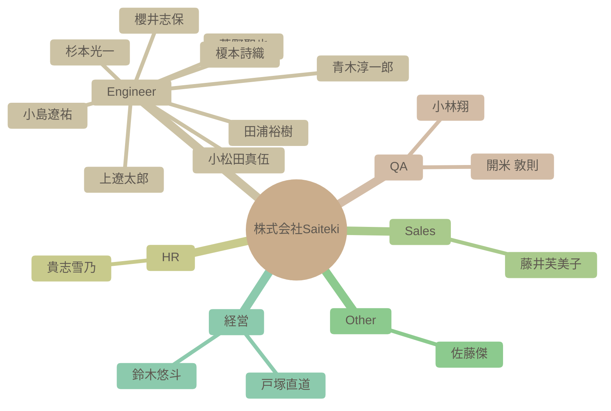

# チーム構成図

自動生成された組織図です。IssueおよびSlack連携による高度なAI分析結果が反映されます。

### 📊 関連リソース
- [🌐 インタラクティブ・ナレッジグラフ (Web版)](https://saitekiinc-com.github.io/saiteki-employee-management/)
- [📝 ナレッジグラフ分析レポート (Markdown)](./KNOWLEDGE_GRAPH.md)

### 組織マップ

```mermaid
%%{init: {'theme': 'base', 'themeVariables': {'primaryColor': '#F2EBE3', 'primaryTextColor': '#5D574F', 'primaryBorderColor': '#D9CFC1', 'lineColor': '#BEB3A5', 'secondaryColor': '#FAF9F6', 'tertiaryColor': '#FDFCFB', 'nodeBorder': '1px'}}}%%
mindmap
  root((株式会社Saiteki))
    Engineer
      杉本光一
      青木淳一郎
      櫻井志保
      田浦裕樹
      上遼太郎
      小松田真伍
      小島遼祐
      菅野聖也
      榎本詩織
    QA
      小林翔
      開米 敦則
    HR
      貴志雪乃
    Sales
      藤井芙美子
    Other
      佐藤傑
    経営
      鈴木悠斗
      戸塚直道
```

## 社員一覧サマリー

| 名前 | 職種 | 性格傾向 (概略) | 現在の状態 |
| --- | --- | --- | --- |
| [杉本光一](#%E6%9D%89%E6%9C%AC%E5%85%89%E4%B8%80) | Engineer | 技術への深い探求心と実践的な応用力、そしてチームへの強い貢献意欲が特徴です。新しい知識の共有と後進の育成に熱心で、常に丁寧でオープンなコミュニケーションを心がけています。 | 直近では、「AI x 知識グラフ」というRAGの課題を解決しうる最先端技術に深く没頭し、その可能性をチームに積極的に共有している。同時に、ナレッジDBの運用方法を具体的に議論し、若手メンバーの育成のための動画コンテンツ作成にも注力。プライベートでは、共有されたチョコレートを家族と楽しむなど、引き続きワークライフバランスを重視する姿勢が見られるが、体調を崩していることにも言及しており、心身のケアも必要となっている状況。 |
| [青木淳一郎](#%E9%9D%92%E6%9C%A8%E6%B7%B3%E4%B8%80%E9%83%8E) | Engineer | 協調性が非常に高く、新しい知識や経験に対し前向きに挑戦する。社交的で周囲との交流を深め、高い責任感を持って業務に取り組む楽観的な性格。 | 年末年始を通してSaitekiメンバーとの出会いに深く感謝し、2026年を「飛躍の年」と意気込んでいる。12月上旬には業務負荷が高い様子が伺えたが、それを乗り越え、現在は非常に前向きな精神状態にある。 |
| [小林翔](#%E5%B0%8F%E6%9E%97%E7%BF%94) | QA | 開放性と協調性が特に高く、新しい経験や人との交流を楽しみ、チームワークを重視する傾向がある。責任感も強く、ポジティブな姿勢を保ちながら、自身の経験や関心を積極的に共有し、自己開示を厭わない。 | 入社初期段階であり、非常に前向きで期待に満ちた状態。積極的に自己開示し、様々な趣味や経験を通じて周囲との共通点を見つけることで、良好な人間関係を築こうと行動している。特にプライベートな興味や体験を共有することで、チームメンバーとの心理的距離を縮めようとしている。 |
| [櫻井志保](#%E6%AB%BB%E4%BA%95%E5%BF%97%E4%BF%9D) | Engineer | 自己認識が高く、協調性があり、学習意欲も高い。新しい環境への適応力も期待でき、謙虚で丁寧な印象を与えます。 | 1月からの入社を控えており、新しい環境に対する高い期待感と意欲に満ち溢れています。自身のスキルを活かしつつ、さらなる専門性向上とチームへの貢献を目指しています。 |
| [田浦裕樹](#%E7%94%B0%E6%B5%A6%E8%A3%95%E6%A8%B9) | Engineer | 非常に協調性が高く、誠実で、周囲への配慮を忘れない。新しい知識や経験への探求心が旺盛で、ユーモアを交えながら積極的に他者と関わる。グルメへの関心も高い。 | ハチドリソーラー社への商談提案やアジャイル開発の本質に関する社内啓蒙に注力しており、顧客への安心感提供と社内文化の醸成に貢献している。週例タスクには一部進捗がないと正直に報告しつつも、社内コミュニケーションや新しいメンバーの歓迎には積極的に参加。プライベートではロイズの生チョコやアイラウイスキーといったグルメを楽しみ、多忙ながらも充実した日々を送っている。 |
| [開米 敦則](#%E9%96%8B%E7%B1%B3%20%E6%95%A6%E5%89%87) | QA | 協調性が高く学習意欲が旺盛で、多岐にわたる趣味を持つ。新しい環境にも積極的に適応し、責任感を持って業務に取り組む。技術的な課題にも冷静かつ積極的に対応し、業務プロセスの改善にも意欲的。 | 入社直後であり、新しい職場環境への適応に非常に前向きに取り組んでいる。特にQAにおけるAI活用に強く意欲的で、具体的なツール選定やプロンプトの最適化、人とAIの協働を検討中。チームへの貢献意識も高く、情報共有や意見交換を積極的に図りながら、自律的に業務を進めている。特にテストプロセス全体の最適化、中でもテスト計画フェーズの質の向上と、汎用テスト観点の修正に具体的な関心と改善意欲を示している。 |
| [貴志雪乃](#%E8%B2%B4%E5%BF%97%E9%9B%AA%E4%B9%83) | HR | 組織への貢献意欲と周囲への配慮が非常に高く、自ら行動して周囲を巻き込む力に長けています。新しい知識や経験への探求心も旺盛で、感情表現も健全かつバランスが取れています。特に他者の貢献に対する感謝と称賛を具体的に表現します。 | 直近のログ（2月中旬）でも、勉強会のアーカイブ公開とその品質向上（テロップ追加）、次期勉強会の企画と詳細な告知、そして人事として新入社員への温かい歓迎と、多岐にわたる活動を精力的に推進しており、極めて意欲的でポジティブな状態にある。特に、学習コンテンツの継続的な提供と新メンバーへの配慮が際立っている。 |
| [上遼太郎](#%E4%B8%8A%E9%81%BC%E5%A4%AA%E9%83%8E) | Engineer | 新しい知識や経験への関心が深く、他者から学ぶ姿勢が顕著です。責任感が強く、業務を丁寧かつ体系的に進めることを重視。周囲への配慮を忘れず、社交的な態度で積極的に交流を図ります。 | 非常に高い意欲を持って業務に取り組んでおり、自己学習を通じてスキルアップに励んでいます。業務負荷は適切に管理され、迅速かつ柔軟に対応できる状態にあります。丁寧で体系的な仕事ぶりを心がけ、周囲との協調と情報共有を重視しています。 |
| [小松田真伍](#%E5%B0%8F%E6%9D%BE%E7%94%B0%E7%9C%9F%E4%BC%8D) | Engineer | 新しい技術や知識の習得、改善提案に極めて積極的で、それを組織に還元しようとする意識が非常に高い。周囲とのコミュニケーションを円滑に行い、場を和ませる能力も持つ。自身の経験に基づいた問題意識を持ち、解決のための行動を厭わない。特に、社会や組織全体、そしてチームメンバーをより良くしようとする貢献意欲が顕著。 | ナレッジ蓄積とAI技術の活用に関する検証（RAGと知識グラフの比較、カスタムアプリによるPoC開発）を積極的に推進しており、3月中の検証完了を目指し精力的に活動している。加えて、チーム内の活発なコミュニケーションや雑談にも積極的に参加し、場の活性化に貢献している。 |
| [小島遼祐](#%E5%B0%8F%E5%B3%B6%E9%81%BC%E7%A5%90) | Engineer | 新しい知識や経験に対する強い好奇心と探求心を持ち、周囲の意見を尊重し、積極的に関係を深めようとする。責任感も強く、常に前向きな姿勢を保つ。 | 新しい職場環境への適応に非常に意欲的で、持ち前の社交性と学習意欲を最大限に活かし、周囲との良好な関係を積極的に築いている。具体的な業務貢献目標を持ち、前向きな姿勢で取り組む準備が整っている。 |
| [藤井芙美子](#%E8%97%A4%E4%BA%95%E8%8A%99%E7%BE%8E%E5%AD%90) | Sales | 親しみやすい人柄で共感力が高く、多様な分野への探求心を持つ。責任感と自ら積極的に行動する推進力を併せ持ち、周囲への配慮も忘れない。 | 2月入社後、新しい総務の役割に前向きに適応中。持ち前の社交性を最大限に活かし、社内イベントでの交流を楽しみ、部署内外の同僚との関係構築に積極的に取り組んでいる。業務習熟と並行して、人間関係の深化に注力している段階。 |
| [菅野聖也](#%E8%8F%85%E9%87%8E%E8%81%96%E4%B9%9F) | Engineer | 新しい技術や知識の吸収に意欲的で、協調性と社交性を持ち合わせる。自身の強みをユーモアを交えて表現し、感情も安定している。 | 入社直後で、開発者としての復帰とチームとの協働に非常に前向きである。AI技術への関心は非常に高く、読書を通じて多様な知識を吸収し、それを業務やコミュニケーションに活かそうとしている。人との交流も積極的に楽しみ、新しい環境での活躍を強く望んでいる。 |
| [佐藤傑](#%E4%BD%90%E8%97%A4%E5%82%91) | Other | 非常に開放的で誠実、外向的で協調性も高い。常に前向きで、新しい挑戦や学びを楽しみ、実践と情報共有を通じて貢献しようとする探求心と行動力を兼ね備えている。 | 海外での活動を継続しており、現在はUAEに滞在し、その後ASEAN中台韓を巡り、来年には帰国予定。国際的なチーム開発やハッカソンに積極的に参加し、最新のAI技術（特に小型高性能AIモデルのMac環境での実用性）に高い関心を持ち、M4 MaxでのGPTsossの動作を検証・共有するなど、その情報共有を通じて実践的な活用を模索している。質問歓迎の姿勢で、コミュニティへの貢献も意識している。 |
| [鈴木悠斗](#%E9%88%B4%E6%9C%A8%E6%82%A0%E6%96%97) | 経営 | 社交的で協調性が高く、強い責任感と好奇心を持つ。新しい知識や技術の習得に積極的で、ポジティブかつ安定した精神状態を保ちながら周囲を巻き込む力がある。家族との交流や趣味もオープンに共有する。 | COOとして組織のリスク管理、事業推進、社員の健康と快適な労働環境の促進に深くコミットしており、高い責任感を持って業務に取り組んでいる。新メンバーのオンボーディングとチームへの融和に積極的に関与し、会社の挑戦を歓迎する文化を体現している。最新の技術トレンド、特に生成AIへの関心が非常に高く、日常的に活用している。自身の趣味や家族との時間もオープンに共有することで、親しみやすく、信頼できる人物像を確立している。 |
| [戸塚直道](#%E6%88%B8%E5%A1%9A%E7%9B%B4%E9%81%93) | 経営 | 非常に外向的で協調性が高く、誠実かつ開放的な人物。組織の成長とメンバーの成功に深くコミットし、困難な状況にも持ち前のユーモアと前向きさで対処する。特にAIとSIerの未来に対する深い洞察と、それを自身の事業に落とし込む粘り強さが顕著。 | AI技術の深い探求とビジネスへの応用、SIer業界の変革に関する議論が非常に活発。採用も継続的に成功し組織が拡大している。メンバーの学習支援と社内交流促進に注力し、リスク管理や顧客関係構築といった実戦的な経営知見の共有にも積極的。業務への没頭度合いが高く、多忙ながらもユーモアを交え前向きに事業を推進している。 |
| [榎本詩織](#%E6%A6%8E%E6%9C%AC%E8%A9%A9%E7%B9%94) | Engineer | 非常に開放的で協調性があり、新しい知識や経験を積極的に取り入れようとする。親しみやすく、ユーモアのセンスも持ち合わせながら、自己を客観視できるバランスの取れた性格。 | 6月～7月の入社を間近に控え、期待と意欲に満ち溢れている。積極的にコミュニケーションを取り、周囲との関係構築に努めており、社内での新しい経験と学習を楽しみにしている。 |

---

## 詳細プロフィール

各社員の詳細な分析結果です。クリックして展開できます。

### 杉本光一 (Engineer)

> **総合サマリー**: 杉本さんは、AI技術、特に「知識グラフ」の可能性を深く探求し、RAGの課題を克服する先進的なアプローチを模索する技術探求者です。ナレッジ共有の仕組み化と若手メンバーの育成にも尽力し、技術と人の成長双方に貢献する協調性あふれるエンジニア。

<b>🛠 性格傾向</b>

**要約**: 技術への深い探求心と実践的な応用力、そしてチームへの強い貢献意欲が特徴です。新しい知識の共有と後進の育成に熱心で、常に丁寧でオープンなコミュニケーションを心がけています。

| 項目 | スコア | 根拠・エピソード |
| --- | --- | --- |
| 開放性 | 9/10 | RAGのベクトル検索の限界（文脈・複雑な関係性の理解不足）を認識し、「AI x 知識グラフ」という新たな技術領域に「熱い」関心を示す。知識グラフがAIの回答精度を飛躍的に向上させる可能性を、地図の比喩や具体的な業務例（A案件の遅延理由）を交えて非常に分かりやすく説明する。ローカルAIでの推論処理やM4MAX、MacStudioといった既存情報からの興味も一貫している。 |
| 誠実性 | 9/10 | ナレッジDBの投稿ハードルを低くするための改善案（軽いメモでも可）を提案し、具体的な投稿内容について質問するなど、運用の最適化と実用化に深く関与する。AI活用のノウハウ動画作成のため、若手メンバーに設計や実装で気づいたことのメモを依頼し、その情報を活用しようとするなど、計画性と指導力を発揮する。 |
| 外向性 | 9/10 | 新しいメンバーへ積極的に挨拶し、自身の出身地、居住地、趣味（翔んで埼玉）を共有して会話のきっかけを作る。メンバーに勧められたチョコレートを家族と楽しんだ様子や、おすすめされた商品を即座に購入したことを共有するなど、プライベートな話題もオープンにし、親しみやすい雰囲気を作る。ハドルでの直接会話を提案するなど、対面でのコミュニケーションも厭わない。 |
| 協調性 | 9/10 | 他者の意見（「あいまいさの軸良いですね」）を積極的に肯定し、学びを得ていることを伝える。ミーティングのリスケを提案する際も、メンバーの「別作業」や「スキルアップのための作業」を理由に挙げるなど、きめ細やかな配慮を示す。体調不良を理由にイベントを中止する提案も、相手への配慮が見られる。メンバーのおすすめ商品を即座に購入し、その感想を共有するなど、好意的な交流を楽しむ。 |
| 神経症的傾向 | 3/10 | AIの発展に伴うサイバー攻撃のリスク増大について冷静に言及し、セキュリティ意識の重要性を再確認する。業務遂行において、感情的になることなく論理的かつ建設的な姿勢を保っている。体調を崩していることを理由にイベント中止を提案するが、これは感情的な不安定さを示すものではなく、状況を冷静に判断した結果である。 |

<b>💪 仕事スタイルと強み</b>

**要約**: AI技術の深い知見と戦略的思考に基づき、RAGの限界を克服する「知識グラフ」の可能性を探求。組織全体のナレッジ共有とAI活用の効率化を推進し、若手メンバーの育成にも具体的なアクションで貢献するリーダーシップを発揮します。

**問題解決スタイル**: RAGのベクトル検索が持つ「文脈」や「複雑な関係性」の理解不足という本質的な課題を特定し、AIに「知識グラフ」を前提知識として与えることで、回答精度と信頼性を向上させるという革新的な解決策を提案する。単一技術に固執せず、複数のアプローチ（RAGと知識グラフの組み合わせ）を統合して最適解を追求する。既存のツール（GitHub Actions）の活用も提案するなど、実用性も重視する。

**主要な強み**: AI技術の深い知見と実践的な応用力, 戦略的思考による本質的な課題解決（RAGと知識グラフ）, 情報共有とナレッジマネジメントの推進, 丁寧で建設的なコミュニケーションと指導力, 後進の育成への貢献, セキュリティへの高い意識, 既存ツールの応用力

**証拠エピソード**:
- AIと知識グラフの組み合わせがRAGの弱点を補い、回答精度を向上させる可能性を具体例（A案件の遅延理由）を交えて説明する。
- ナレッジDBの投稿ハードルを低くするため、外部学習情報や感じたことをメモ程度で登録するアイデアを提案し、具体的な投稿内容について議論を深める。
- AI活用のノウハウ動画化に向け、若手メンバーに設計や実装で気づいたこと（課題、ツール（Cursor）の使いやすさ/使いづらさなど）のメモを依頼し、育成につなげようとする。
- カスタマイズappについて、共有目的や運用コストの観点からGitHub Actionsのワークフローが使いやすいと自身の経験から具体的な解決策を提示する。
- AI協働作業について、認識の確認と方向性の擦り合わせを丁寧に行い、タスクの円滑な進行を図る。

<b>💎 価値観とモチベーター</b>

**要約**: 最新AI技術への飽くなき探求心と、それが組織やチームの根本的な課題解決、ひいてはメンバーの成長に繋がることに大きな喜びを感じます。自身の学びを惜しみなく共有し、チーム全体の知見向上と生産性向上に貢献することを重視しています。

**コアバリュー**: 技術革新と探求 (特にAI x 知識グラフ), 組織・チームへの貢献 (ナレッジ共有、セキュリティ), 後進の育成とスキルアップ支援, 自己成長と学習の継続, チームワークと協調性, 信頼性の高いシステム開発, オープンな情報共有

**モチベーショントリガー**: 新しい技術の深い理解と、それが根本的な課題解決に繋がること, 自身の知識や経験がチームのナレッジ蓄積やメンバーの成長に貢献すること, メンバーとの活発な情報交換を通じて新たな学びを得ること, チームや組織の生産性や信頼性が向上すること, 個人的な趣味や楽しみをチームメンバーと共有し、共感を得ること

**証拠エピソード**:
- 「AI x 知識グラフ」が自分のなかで「熱い」と表現し、RAGの課題解決に繋がる新たな可能性に強い探求心と期待を抱いている。
- 若手メンバーの「スキルアップのための作業があると思います」を理由にリスケを提案するなど、他者の成長を支援する姿勢を示す。
- 「カスタマイズappのほうは共有目的や運用なんかのコスト面的には、github actionsのワークフローが結構使いやすかったりもしますよ！」と自身の経験に基づく知見を惜しみなく共有する。
- チームメンバーのおすすめ商品（チョコレート）を購入し、その感想を共有するなど、個人的なつながりを大切にする。

<b>📈 現在の状態</b>

**要約**: 直近では、「AI x 知識グラフ」というRAGの課題を解決しうる最先端技術に深く没頭し、その可能性をチームに積極的に共有している。同時に、ナレッジDBの運用方法を具体的に議論し、若手メンバーの育成のための動画コンテンツ作成にも注力。プライベートでは、共有されたチョコレートを家族と楽しむなど、引き続きワークライフバランスを重視する姿勢が見られるが、体調を崩していることにも言及しており、心身のケアも必要となっている状況。

- **感情レベル**: positive
- **業務負荷状況**: AI x 知識グラフの探求、ナレッジDBの運用設計、若手メンバーへの具体的な指導とタスク付与、AI協働作業の進行確認など、多角的なプロジェクトに深く関与しており、責任感を持って多くの業務を推進している。チームメンバーの状況にも常に配慮し、調整役も果たしている。しかし、自身の体調不良にも言及しており、業務負荷が高い状態が続いている可能性があり、一部で調整が必要になっている様子が見受けられる。
- **最近の関心トピック**: AI x 知識グラフ, RAGの限界と克服アプローチ, ナレッジDBの運用と投稿ハードルの低減, 若手メンバー育成のためのAI活用ノウハウ動画化, AI協働作業の進捗管理, 体調管理とワークライフバランス, おすすめの食べ物や趣味の共有

---

### 青木淳一郎 (Engineer)

> **総合サマリー**: AWS基盤の専門性を持ち、未経験技術の習得にも意欲的。福岡在住で家族を大切にし、高い責任感と協調性でSaitekiへの貢献とメンバーとの交流を積極的に図る人物。

<b>🛠 性格傾向</b>

**要約**: 協調性が非常に高く、新しい知識や経験に対し前向きに挑戦する。社交的で周囲との交流を深め、高い責任感を持って業務に取り組む楽観的な性格。

| 項目 | スコア | 根拠・エピソード |
| --- | --- | --- |
| 開放性 | 8/10 | AWS基盤の経験がある中で、AzureやGoogle Cloud、AIといったクラウド技術への強い関心を示す。未経験のBIツールに苦戦しながらも、それをスキルの幅を広げるチャンスと捉え、前向きに知識と経験の習得に努めている。 |
| 誠実性 | 7/10 | 業務の納期を最優先し、興味のある社内イベントであっても納品が近いことを理由に参加を見送る判断をするなど、強い責任感を持つ。未経験のBIツールでの苦労も、粘り強く習得に努める機会と捉えている。 |
| 外向性 | 8/10 | 入社時に詳細な自己紹介を行い、共通の趣味（Youtube、パパ）を持つメンバーには積極的に交流を呼びかけ「パパ会」を提案。地域を越えた「西日本勢」の盛り上げにも意欲を見せるなど、社内でのコミュニケーションや親睦を重視する姿勢が強い。 |
| 協調性 | 9/10 | メンバーの投稿に対し共感や感謝を積極的に示し、共通点を見つけて親睦を深めようとする。他者のnoteを読み感動を伝えるなど、周囲の人々の気持ちや経験を尊重し、良好な関係性を築くことに非常に長けている。 |
| 神経症的傾向 | 3/10 | ネガティブな感情の表出は非常に少なく、近所のサル出没に驚きと恐怖を感じたという発言程度。未経験のBIツールでの苦戦や多忙な業務状況下でも、常に前向きな姿勢を保ち、状況を好転させる機会と捉える傾向がある。 |

<b>💪 仕事スタイルと強み</b>

**要約**: AWS基盤のインフラ設計・構築に高い専門性を持ちつつ、未経験技術への学習意欲が極めて高い。責任感が強く、チームワークと自己成長を重視して業務に取り組む。

**問題解決スタイル**: 未経験の技術や困難に直面しても、それをスキルアップの好機と捉え、前向きな姿勢で学びと経験を積み重ね、解決策を模索する。

**主要な強み**: インフラ設計・構築スキル, 学習意欲, コミュニケーション能力, 責任感

**証拠エピソード**:
- 入社時の自己紹介でAWS基盤のインフラ設計・構築に携わってきたことを明確に述べている。
- Azure、Google Cloud、AIへの関心や、未経験のBIツール（QuickSuite）に苦戦しつつも「スキルの幅を広げるチャンス」と捉え積極的に取り組む姿勢を見せている。
- 興味のある社内イベントであっても、納品が近いことを理由に不参加を表明し、業務を最優先する強い責任感を見せている。
- 「Saitekiの輪をどんどん広げていけたら」と発言し、オンラインでの積極的なコミュニケーションや「パパ会」の提案を通じてメンバーとの関係構築に努めている。

<b>💎 価値観とモチベーター</b>

**要約**: 家族との時間を大切にし、仕事では新しい技術の習得と自己成長を追求。組織への貢献意欲とSaitekiの一員であることへの誇り、メンバーとの交流を非常に重視している。

**コアバリュー**: 家族, 成長, 貢献, 責任

**モチベーショントリガー**: 新しい技術の習得, チームへの貢献, 自己成長, 人との交流

**証拠エピソード**:
- 自己紹介で「家族とドライブに行ったり、子どもと遊んだり、妻をガチャガチャ屋さんに連れて行ったり」と休日の過ごし方を共有し、家族との時間を大切にしている様子が伺える。
- AWS以外のAzure、Google Cloud、AIといった技術への学習意欲や、未経験のBIツールでの苦戦も「スキルの幅を広げるチャンス」と捉え、知識と経験を得ることに意欲的である。
- 入社時に「Saitekiの輪をどんどん広げていけたら」と組織への貢献意欲を示し、年末には2025年を「最高の年」と振り返り、2026年を「さらに飛躍の年にしていきましょう！」と語るなど、強い責任感と組織への帰属意識が見られる。
- オンラインでのコミュニケーションを重視し、「パパ会」や「西日本勢盛り上げていきましょー」とメンバー間の交流を積極的に促進しようとしている。
- 他者のnoteを読んで「グッときました！」と感動を伝え、メンバーの入社経緯への関心を示している。

<b>📈 現在の状態</b>

**要約**: 年末年始を通してSaitekiメンバーとの出会いに深く感謝し、2026年を「飛躍の年」と意気込んでいる。12月上旬には業務負荷が高い様子が伺えたが、それを乗り越え、現在は非常に前向きな精神状態にある。

- **感情レベル**: positive
- **業務負荷状況**: 12月上旬には納品が近く、帰りが遅くなるほどの業務負荷があったが、それを乗り越え、年末年始は達成感と来年への意欲を見せている。
- **最近の関心トピック**: Saitekiメンバーの入社経緯, 京都旅行, 2025年の振り返りと2026年への期待, BIツールの知識習得

---

### 小林翔 (QA)

> **総合サマリー**: 協調性が高く、新しい環境への適応能力に優れる人物。多岐にわたる趣味と豊富な経験を持ち、周囲との積極的な交流を通じて、共に成長することを重視する。自身の体験や知識を詳細かつ情熱的に共有することで、人間関係を深めることを得意とする。

<b>🛠 性格傾向</b>

**要約**: 開放性と協調性が特に高く、新しい経験や人との交流を楽しみ、チームワークを重視する傾向がある。責任感も強く、ポジティブな姿勢を保ちながら、自身の経験や関心を積極的に共有し、自己開示を厭わない。

| 項目 | スコア | 根拠・エピソード |
| --- | --- | --- |
| 開放性 | 9/10 | 出張先や趣味の旅行で知った美味しい飲食店（京都のうどん、沼津の餃子）を詳細に紹介し、地域特有の文化や食への深い興味と探求心を示す。また、自身の声が入ったライブ動画を共有するなど、アニメやアイドルといったポップカルチャーへの関心も非常に高く、多様な趣味を持つ。 |
| 誠実性 | 7/10 | 前職での経験に加え、紹介する飲食店の情報（つゆのタイプ、麺の食感、天ぷらのサクサク感、餃子の製法、行列状況）が非常に詳細で具体的であることから、物事を注意深く観察し、記憶・整理する能力が高いことがうかがえる。自身のライブ体験の細部まで覚えている点も同様である。 |
| 外向性 | 9/10 | 飲み会後に自身の趣味に関する情報や動画を積極的に共有し、交流を深めようとする姿勢が明確に見られる。社交的なイベントへの参加に「わくわく」と絵文字を添えて意欲を示し、自身のライブでのエピソードをユーモアを交えて語るなど、自己開示を積極的に行うことで周囲との関係性を構築しようとする。 |
| 協調性 | 9/10 | 飲み会後の感謝の言葉や、美味しいお店の情報を共有する行為自体が、周囲への配慮と貢献意識の表れである。自身の動画を共有する際に「何万分の一ですが…」と謙遜する姿勢や、ライブの思い出を共有することで親しみやすさを醸し出すなど、友好的で協調的なコミュニケーションを心がけている。 |
| 神経症的傾向 | 3/10 | 自身の声が入った動画の共有に際しても、ユーモラスな表現を使い、ライブでの失敗談を明るく語るなど、ポジティブな自己開示が見られる。ストレスや不安を感じやすい様子はなく、社交的な場面を心から楽しんでいる。 |

<b>💪 仕事スタイルと強み</b>

**要約**: 長年の経験に裏打ちされた細部への注意と、高いコミュニケーション能力が強み。新しい情報や知識の吸収にも積極的で、協調性を持ちながら業務に取り組む。状況把握と情報共有に長け、自身の経験を活かした具体的な提案も期待できる。

**問題解決スタイル**: 13年間のテスター経験を通じて培われた、細部に目を配り潜在的な問題点を見つけ出す能力を持つ。自身の経験や知識を活用し、論理的に課題を整理する傾向がある。新しいデータからは、具体的な情報収集と提供の側面が強化された。

**主要な強み**: テスト・品質管理経験, コミュニケーション能力, 情報収集力, 情報提供力, 状況説明能力, 協調性

**証拠エピソード**:
- 出張先で何度もリピートした飲食店や、地域特有の製法を持つ人気店に関する具体的な情報と個人的な感想を詳細に説明できる。
- 飲み会後の交流の場で、自身が関心を持つ趣味（ライブ動画）を共有し、会話のきっかけを作る。
- 社交的なイベントへの参加に積極的に意欲を示し、周囲との関係構築に努める。

<b>💎 価値観とモチベーター</b>

**要約**: 成長、繋がり、楽しさ、探求、そして経験を重視する。新しい知識やスキルの習得、他人との良好な関係構築、充実した楽しい経験、そして自身の情熱を共有することがモチベーションの源泉となる。

**コアバリュー**: 成長, 協調, 楽しさ, 探求, 繋がり, 経験の共有

**モチベーショントリガー**: 新しい知識やスキルの習得, チームへの貢献と協業, 楽しい経験や趣味の追求, 共通の興味を持つ人々との交流, 興味を持ったことの詳細な情報共有, 自己開示を通じた人間関係の深化

**証拠エピソード**:
- 飲み会後に自身の趣味（ライブ動画）と旅行先でのグルメ情報を共有することで、仲間との繋がりを深めようとする。
- 旅行や出張先での新しい発見（美味しいお店）を積極的に楽しみ、それを他者と共有することに喜びを感じている。
- 社交的なイベントへの参加に「わくわく」と感情を表現し、楽しい経験を重視する姿勢が見られる。

<b>📈 現在の状態</b>

**要約**: 入社初期段階であり、非常に前向きで期待に満ちた状態。積極的に自己開示し、様々な趣味や経験を通じて周囲との共通点を見つけることで、良好な人間関係を築こうと行動している。特にプライベートな興味や体験を共有することで、チームメンバーとの心理的距離を縮めようとしている。

- **感情レベル**: positive
- **業務負荷状況**: 業務外の交流を活発に行っている段階であり、業務負荷はまだ限定的または、業務とプライベートのバランスをうまく取っている状況。
- **最近の関心トピック**: 美味しいグルメ（京都のうどん、沼津の餃子など）, 旅行・出張での体験, アニメ・アイドルライブ（特にラブライブ!）, 社交的なイベントへの参加, 自身の趣味や経験の共有

---

### 櫻井志保 (Engineer)

> **総合サマリー**: 櫻井志保さんは、データ分析スキルと高い学習意欲を持ち、協調性をもってチームに貢献しようと意欲的な人物です。

<b>🛠 性格傾向</b>

**要約**: 自己認識が高く、協調性があり、学習意欲も高い。新しい環境への適応力も期待でき、謙虚で丁寧な印象を与えます。

| 項目 | スコア | 根拠・エピソード |
| --- | --- | --- |
| 開放性 | 8/10 | Power BIを用いたデータ分析・加工の経験があり、資格取得を目指しデータベース構築といったより専門的な分野への挑戦意欲を明確に示しています。 |
| 誠実性 | 7/10 | 自己紹介で自身の業務経験、スキル、今後の展望を詳細かつ明確に記述しており、責任感と計画性が伺えます。趣味を通じて業務のリフレッシュを図る自己管理能力も持ち合わせています。 |
| 外向性 | 6/10 | 「Slack等を通じて積極的にコミュニケーションを取っていければ」と、自ら進んで他者との交流を求める姿勢が見られます。ただし、直接会う機会が少ないことへの言及もあり、バランスの取れた交流を好むと推測されます。 |
| 協調性 | 9/10 | 「今後ともよろしくお願いいたします」「まだまだ至らない点も多いかと思いますが、何卒よろしくお願いいたします」といった謙虚で丁寧な言葉遣いから、協調性や相手への配慮が強く感じられます。 |
| 神経症的傾向 | 3/10 | 自己紹介の内容全体から、新しい環境への期待感と前向きな姿勢が感じられ、不安や心配を示唆する要素は見当たりません。 |

<b>💪 仕事スタイルと強み</b>

**要約**: データに基づいた分析力と高い学習意欲を持ち、自ら専門性を深めようと努力します。チームでのコミュニケーションを重視し、協調的に仕事を進めるタイプです。

**問題解決スタイル**: データ分析スキルを活かし、論理的な思考で現状を把握し問題解決に取り組むアプローチを取ります。

**主要な強み**: データ分析, 学習意欲, コミュニケーション

**証拠エピソード**:
- Power BIを用いたデータ分析・加工の経験があると述べています。
- 資格取得を目指し、データベース構築などより専門的な分野への挑戦を考えていると表明しています。
- Slack等を通じて積極的にコミュニケーションを取りたいと意欲を示しています。

<b>💎 価値観とモチベーター</b>

**要約**: 自身の成長と専門性向上を重視し、新しい知識やスキルを習得することに喜びを感じる人物です。チームワークを大切にし、周囲との良好な関係を築きながら貢献することにモチベーションを感じます。

**コアバリュー**: 成長, 貢献, 協調性, 専門性

**モチベーショントリガー**: 新しい知識やスキルの習得, 専門性の向上, チームへの貢献, 自己管理を通じたパフォーマンス維持

**証拠エピソード**:
- 資格取得やデータベース構築といった専門分野への挑戦意欲を表明しています。
- Slack等を通じて積極的にコミュニケーションを取りたいと述べています。
- 趣味をリフレッシュに活用し、業務パフォーマンス維持に努めていることを示唆しています。

<b>📈 現在の状態</b>

**要約**: 1月からの入社を控えており、新しい環境に対する高い期待感と意欲に満ち溢れています。自身のスキルを活かしつつ、さらなる専門性向上とチームへの貢献を目指しています。

- **感情レベル**: positive
- **業務負荷状況**: 新規入社予定のため、現在の業務負荷は不明ですが、趣味をリフレッシュに活用していることから自己管理ができていると推測されます。
- **最近の関心トピック**: データ分析, データベース構築, 資格取得, Slackを通じたコミュニケーション

---

### 田浦裕樹 (Engineer)

> **総合サマリー**: 深い技術的知見を持ち、アジャイルの本質をリスクコントロールと捉え、顧客への安心提供と社内への知見共有に情熱を注ぐ。誠実で協調性豊か、グルメを含む豊かな私生活を大切にする。

<b>🛠 性格傾向</b>

**要約**: 非常に協調性が高く、誠実で、周囲への配慮を忘れない。新しい知識や経験への探求心が旺盛で、ユーモアを交えながら積極的に他者と関わる。グルメへの関心も高い。

| 項目 | スコア | 根拠・エピソード |
| --- | --- | --- |
| 開放性 | 10/10 | AI技術の学習に深くコミットし、自身でRAG構築を目標に高性能PCを導入。ゴッホ展を深く鑑賞し、原田マハの関連書籍を即座に購入するなど芸術への知的好奇心が非常に高い。長年の憧れだったチェロを始め、羊文学のライブには毎年参戦するほどの情熱を持つ。日本酒、ビール、ワインを好み、特に黒龍、作、酔鯨、浜福鶴といった銘柄を挙げる。ロイズの生チョコとアイラウイスキーの組み合わせを絶賛するなど、グルメへの探求心とこだわりも深い。新しいメンバーには自身の好きなお酒の銘柄を具体的に挙げて共有している。 |
| 誠実性 | 9/10 | PoCの立ち上げフェーズでタスク分解、優先順位付け、計画策定を詳細に行い、進捗を具体的なポイントと共に共有する。AI駆動開発の標準化に向けたワークフローやガイドライン作成にも継続的に取り組む。家庭の事情（子供のインフルエンザ罹患や荒天による急遽テレワーク）が生じた際も、業務への影響を考慮し速やかに連絡を行い、柔軟に対応するなど、責任感と計画性が非常に高い。顧客に「自信を持って即答」するためには徹底した準備が必要であると認識し、実践する。週例MTGの開催を事前に確認し、自身の進捗状況についても正直に共有できる。 |
| 外向性 | 8/10 | 新メンバーには積極的に自己紹介し、自身のプライベートな情報（出身地、家族、趣味、グルメ情報、PC購入の経緯）をオープンに共有することで親近感を醸成する。絵文字を非常に多用し、勉強会では活発に発言や改善提案を行うなど、他者との交流を積極的に楽しむ。戸塚氏とのライブ参加を積極的に提案する他、社内レターや商談共有にも感謝を伝え、積極的にコメントを残すなど、関係構築にも意欲的。新しい同僚にお酒の好みや関西在住であることを共有し、共通点を探すことで距離を縮めようとする。グルメに関する話題でも、ユーモアを交えながら活発にコミュニケーションを取り、他者にも試すよう勧める。 |
| 協調性 | 9/10 | 他者の意見を尊重し、感謝の意を頻繁に伝える。「素晴らしいレターをありがとうございました」「そう言って頂けてめっちゃ嬉しいです」「シェアありがとうございます」「お心遣いありがとうございます」「めちゃくちゃ嬉しいコメントありがとうございます」といった感謝の言葉が多い。荒天時のメンバーの安否を気遣い、周囲への配慮や思いやりが非常に強い。顧客を安心させることを商談の最優先事項と捉え、具体的なヒアリングで実践する。勉強会へのフィードバックも、リモート参加者への配慮を含め建設的に行う。チームメンバーへの協力を惜しまない姿勢を示す。同僚の体調を気遣う言葉をかけ、自身の経験から顧客への「安心と信頼」提供の重要性を語り、後輩には「普段の業務の中で何度も繰り返しやると、うまくなりますよ」と具体的にアドバイスする。 |
| 神経症的傾向 | 3/10 | 子供の体調不良（インフルエンザ）や急なテレワークにも冷静かつ柔軟に対応し、業務を調整する。週例MTGへの参加可否も状況を考慮しつつ事前に連絡するなど、精神的な安定性とストレス耐性が高く、業務への影響を最小限に抑えようと努める。荒天でバスが運休し急遽テレワークになった際も、焦りを見せず業務に対応している。突然の予定変更（夕食準備の時間がない、21時で早退）に対しても冷静に対応し、状況を関係者に速やかに連絡できる。自身の進捗がないことも正直に報告できる。 |

<b>💪 仕事スタイルと強み</b>

**要約**: AI技術を活用した開発全般に強みを持ち、特に要件定義から実装までの開発プロセス全体への深い知見と、アジャイルの本質であるリスクコントロールを重視した標準化への貢献意欲が高い。アジャイルなプロジェクト推進と顧客視点での問題解決に長け、ビジネスモデルへの深い洞察力も持つ。最上流工程の重要性を認識し、レビューを通じて品質向上にも貢献する。

**問題解決スタイル**: PoCにおいては、最初に全てを決め切らず、仮説を立て、クライアントとの密なすり合わせを通じて要件や計画を段階的にアップデートしていくアジャイルなアプローチを重視する。アジャイルの真髄を「不確実性を分解し、リスクをコントロール可能な形に変えていくこと」と定義し、これを商談やエンジニアリングの本質と捉えている。表面的な「速く作る」「ドキュメントを書かない」アジャイルを批判しつつも、リスクを限定できる場合は設計を固めず実装に入る柔軟な姿勢も持つ。問題解決に際しては、AIを積極的に活用し、自身の経験と組み合わせることで具体的なワークフローやガイドラインの標準化を目指す。商談においては「お客様を安心させる」ことを最優先事項と捉え、的確なヒアリングで目的を明確にし、そのために「自信を持って即答」できるだけの徹底した準備を重視する。

**主要な強み**: 開発プロセス全体（要件定義〜実装）への深い知見と標準化への貢献, アジャイル開発の本質的な理解と実践（特にリスクコントロールと不確実性分解）, AI駆動開発の実践と知識共有（特に標準化・ガイドライン作成）, 顧客視点での課題解決と安心感の提供のための徹底した準備と自信ある回答, チーム立ち上げ・品質改善（レビューを通じた貢献）, ビジネスモデルへの深い洞察と分析力, システム開発最上流工程への深い理解と重視

**証拠エピソード**:
- PoCの進捗状況を詳細に共有し、仮説検証と段階的アップデートの重要性を解説することで、チーム全体のレベルアップに貢献しようとしている。
- IPAの要件定義ガイドラインやAIエージェントによる開発フローのテンプレートを共有し、開発プロセスの基礎知識やAI活用のベストプラクティスを惜しみなく共有する。
- ChatGPTを用いて飲食店の利益設計を分析し、そのビジネスモデルを技術開発のプロセスと関連付けて考察するなど、技術を実生活やビジネスに応用する高い洞察力と好奇心を持つ。
- 自身の経験から「お客様を安心させる」ことを商談の最優先事項と考え、具体的なヒアリングでの認識合わせを通じて実践していると発言。
- 勉強会への建設的なフィードバックを通じて、より質の高い学習機会を創出しようと働きかけ、QAと開発の連携に関する深掘り議論を提案する。
- AI駆動開発のスタンダード作りのため、作業ログテンプレートやワークフローのドキュメント化に積極的に取り組む。
- 「システム開発の最上流を知っていると、開発に取り組むときの視野が格段に広がると思います」と述べ、商談内容の社内共有を奨励。
- 「もう今は自分が書く時はリカバリーの時だけで、普段はレビューばかりですが…」と自身の役割がレビュー中心であることを示唆し、品質向上に貢献している様子がうかがえる。
- 「エンジニアリングの本質は、曖昧で分からない状態から、具体的ではっきりとした状態に変えていく行為だ」という思想を商談に適用し、ハチドリソーラーへの提案内容にも反映させている。
- アジャイルの真髄を「不確実性を分解し、リスクをコントロール可能な形に変えていくこと」と明確に定義し、安易なアジャイル解釈を批判する。
- 顧客を安心させるためには「自信を持って即答」することが重要であり、そのためには徹底した準備が必要であると述べ、自身の仕事のスタンスを明らかにしている。

<b>💎 価値観とモチベーター</b>

**要約**: Saitekiへの強い信頼とコミットメントを背景に、自身の豊富な経験と知識をチームや後進に惜しみなく共有することで、組織全体の成長と顧客の成功に貢献することに大きな価値を見出している。特にアジャイルの本質であるリスクコントロールを重視し、技術的知見が社内で理解され、会社の型として磨かれることに意欲を見せる。新技術への探求心も高く、家族との時間や芸術・文化的な趣味の充実も重視する。社内における情報共有と異なる専門性を持つメンバー間のシナジーを高く評価する。

**コアバリュー**: チームワーク, 継続的な学習と技術革新（特にAIの探求と標準化、アジャイルの本質的な実践）, 顧客満足と貢献（特に顧客への安心感提供と信頼構築）, 誠実さ, 知識共有と後進育成, リスクコントロールと不確実性の管理, 家族, SaitekiのMVVへの共感, 多様な専門性を持つメンバー間のシナジー

**モチベーショントリガー**: チームメンバーからの感謝と成長の実感, 自身の知識共有がチームや後進の成長に貢献できたという実感, 新しい技術（特にAI）の習得と実践、そしてその標準化への挑戦, 自身の持つ技術的知見（特にアジャイルの本質）が社内で理解され、会社の型として磨かれること, 顧客からの肯定的なフィードバックとプロジェクトの成功、顧客から信頼を得ること, SaitekiのMVVへの共感と貢献, 芸術や文化、グルメに触れること、家族との充実した時間, 社内の情報共有文化の促進

**証拠エピソード**:
- 「この人のために汗をかきたい」という強い想いからSaitekiへの参画を決めるなど、戸塚氏への信頼と会社への貢献意欲が非常に高い。
- 勉強会のフィードバックに「胸アツ」と反応し、自身の知識や経験がチームに貢献できたことを喜び、さらに共有を続けると表明している。
- 「僕の大事な役割だと自覚しているので、やっていきます！！」と、自身の経験値を社内にシェアすることへの強いコミットメントを示す。若手エンジニアには自身の若い頃のような悩みをさせたくないという思いも原動力。
- 子供の行事に参加したり、家族で旅行や外食を楽しんだりするなど、家族との時間を非常に大切にし、プライベートの充実も重視している。
- 長年の憧れだったチェロを始めたり、羊文学のライブに毎年参加したり、ゴッホ展を深く鑑賞したりと、自身の知的好奇心や芸術への情熱を追求する。
- 「商談の様子をどんどん社内に共有する取り組み、すごくありがたいですね」と発言し、情報共有を積極的に支持。
- 「ビジネス・営業の戦闘力は備えているボードメンバーと、技術のプロである皆さんが商談に出ていったら百人力だな、と！」「お客様側から見ても、心強いと思うんですよ。なのでこれからもどんどん頼って下さい」と述べ、異なる専門性を持つメンバー間の協業とシナジーを重視する姿勢を示す。
- 「エンジニアリングの本質」を商談やアジャイルの真髄と結びつけ、「会社の型として皆さんと一緒に磨いていけたら最高」と発言し、組織文化への貢献意欲を示す。
- 顧客への提案において「動揺を見せることなく、自信を持って回答する」ことを心がけ、それが「安心と信頼を作る」と語る。

<b>📈 現在の状態</b>

**要約**: ハチドリソーラー社への商談提案やアジャイル開発の本質に関する社内啓蒙に注力しており、顧客への安心感提供と社内文化の醸成に貢献している。週例タスクには一部進捗がないと正直に報告しつつも、社内コミュニケーションや新しいメンバーの歓迎には積極的に参加。プライベートではロイズの生チョコやアイラウイスキーといったグルメを楽しみ、多忙ながらも充実した日々を送っている。

- **感情レベル**: positive
- **業務負荷状況**: やや高め。複数の商談準備や技術的な深掘り、ビジネスサイドとの連携、チームへの情報共有といった多岐にわたる業務をこなしている。特定タスクでは進捗がないものの、全体としては高いコミットメントを維持しており、効率的かつ柔軟に業務に対応しつつ、私生活も充実させている。
- **最近の関心トピック**: アジャイル開発の本質とリスクコントロール, エンジニアリングの本質と商談への応用（ハチドリソーラーへの提案）, 顧客への安心感提供と信頼構築, グルメ（ロイズの生チョコ、アイラウイスキー、日本酒、ビール、ワイン）, 新しいエンジニアメンバーの歓迎と自己紹介, 週例MTGとその進捗状況

---

### 開米 敦則 (QA)

> **総合サマリー**: 開米敦則氏は、QAエンジニアとしての豊富な経験とAI技術への深い探求心を持つ。多趣味で協調性が高く、具体的な業務改善にも意欲的に取り組む誠実な人物です。

<b>🛠 性格傾向</b>

**要約**: 協調性が高く学習意欲が旺盛で、多岐にわたる趣味を持つ。新しい環境にも積極的に適応し、責任感を持って業務に取り組む。技術的な課題にも冷静かつ積極的に対応し、業務プロセスの改善にも意欲的。

| 項目 | スコア | 根拠・エピソード |
| --- | --- | --- |
| 開放性 | 9/10 | 「AIを活用した新しいテストの形にもチャレンジしたい」と意欲を示し、社外セミナーへの積極的な参加や情報収集、社内展開を表明している。Google AI Proなどの新しいAIツールも積極的に試そうとする。ガンプラ、ペット飼育、城巡り、スポーツ観戦と非常に幅広い趣味を持つ。QA業界のAIはまだ定まっていないという認識のもと、新たな情報収集と展開に意欲的。テスト計画フェーズの改善に意欲を示し、汎用テスト観点の修正を計画するなど、既存のプロセスに対してもより良い形を模索する姿勢が見られる。 |
| 誠実性 | 9/10 | 「早くチームの一員としてお役に立てるよう、精一杯努めてまいります」と貢献意欲を示す。作業履歴ページを作成し、更新箇所を明示、さらにフィードバックを求めるなど、責任感と改善意欲が非常に高い。会議中の機材トラブル時も、状況を説明し、再接続を試み、謝罪するなど、真摯かつ迅速に対応する。MTGの時間調整にも自身の状況を伝えつつ柔軟に応じる。テストプロセスの改善点について具体的な方向性を示し、汎用テスト観点についても後で修正する意向を明確にするなど、責任感と計画性を持って業務の質を高めようとしている。 |
| 外向性 | 6/10 | 詳細な自己紹介を自ら行い、趣味について語り、共通の話題を見つけて他のメンバーとの交流に意欲的。「お好きな方とぜひご一緒したいです！」「インコについてはお話大歓迎です！」と交流を促す。AIについても「ぜひ意見交換させていただきたいです！」と積極的に働きかける。他者のコメントには頻繁に感謝を伝える。 |
| 協調性 | 9/10 | 他のメンバーのコメントに対して頻繁に「ありがとうございます！」と感謝を伝える。同僚の体調不良の際には「お大事にしてください！！」と気遣う言葉を述べるなど、他者への配慮と共感性が高い。自身の作業履歴ページへのフィードバックも積極的に求めるなど、協調性を重視する。発言の冒頭に『お疲れ様です』と述べ、相手の認識に『はい。ご認識通りです。』と同意するなど、丁寧なコミュニケーションを心がけている。 |
| 神経症的傾向 | 4/10 | 会議でのミュート解除トラブル時、「なんで解除できないんですかね。。。」と戸惑いつつも、すぐに「すみません。繋ぎ直しても良いですか」「再起動します」と状況を説明し、解決策を試みる。土曜日のMTG時間調整も、自身の予定を伝えた上で調整に協力的であり、几帳面だが過度に心配性ではない。新しいツールも積極的に試そうとし、変化への抵抗は低い。今回の発言でも、落ち着いて自身の意向と計画を伝えている。 |

<b>💪 仕事スタイルと強み</b>

**要約**: QAエンジニアとしての深い経験を活かし、AI技術を積極的に業務に取り入れ、効率的かつプロセス全体を俯瞰した問題解決を目指す。情報共有にも熱心で、自律的にタスクを遂行し、常に改善の視点を持っている。

**問題解決スタイル**: AI技術の特性を深く理解し、各テストフェーズ（計画・設計、実行、管理・分析）に最適なツールを選定することで、効率的な問題解決を目指す。Chat GPTやGeminiでの経験からプロンプトのフォーマットの重要性を指摘するなど、仮説検証のアプローチを重視し、人とAIの役割分担を意識している。具体的なテストプロセスにおいて、現状の課題を認識し、より適切なフェーズ（テスト計画フェーズ）への重点移行を提案するなど、効率的かつ質の高い問題解決を目指す。

**主要な強み**: QAエンジニアリングの専門知識と20年の経験, AI技術の知識と業務適用能力（特にテスト領域）, プロンプトエンジニアリングの理解と実践意欲, 情報共有とドキュメンテーション能力、改善提案, テスト自動化ツールの選定・比較検討とプロセスへの組み込み, テストプロセスの改善提案と実行力

**証拠エピソード**:
- 「AIを活用した新しいテストの形にもチャレンジしたい」と意欲を表明している。
- 複数のテスト自動化ツール（Autify, MagicPod, TFACT, Mabl, Cursor, TestScape, Testsigma, BrowserStack Test Management）について、選定基準を具体的に説明し、それぞれの特性を理解している。
- Chat GPTとGeminiを用いたテスト計画の経験から、プロンプトのフォーマットの重要性を指摘し、仮説検証のアプローチを取っている。
- テストフェーズ（上流、実行、管理・分析）ごとに最適なAIツールを具体的に組み合わせる提案をしている。
- 作業履歴ページを作成し、更新箇所を明確にすることで、関係者への情報共有と連携を円滑にし、さらにフィードバックを求めるなど改善意識が高い。
- 特定のテスト観点について、現状維持ではなく「テスト計画フェーズの感じにしていきたい」と具体的な改善の方向性を示し、「汎用テスト観点の方は後で修正したい」と計画性を持って業務の質向上に取り組む姿勢を見せている。

<b>💎 価値観とモチベーター</b>

**要約**: 新しい技術への挑戦、業務プロセスの効率化、チームへの貢献、そして自己のスキルアップに強いモチベーションを感じる。学習と協調性を重視し、オープンな意見交換を通じて成長しようとする。

**コアバリュー**: 効率性, 学習・成長, 貢献, 協調性, 探求心, 品質改善

**モチベーショントリガー**: 新しい技術への挑戦と実践、未知の領域の開拓, 業務効率の改善と最適なツール選定, チームへの貢献と協業、情報共有, 人との意見交換を通じたスキルアップと知識の深化, 業務プロセスの質向上と改善

**証拠エピソード**:
- 自己紹介で「AIを活用した新しいテストの形にもチャレンジしていきたい」と語り、新しい技術への挑戦意欲を示す。
- 「社外セミナーにも積極的に参加し、情報収集し、社内にも展開していきたい」と、自己成長とチームへの貢献を両立させる意欲がある。
- 「色々な方と意見交換してさらにスキルアップしていきたいです」と、人との交流を通じた学習意欲を表明している。
- 「早くチームの一員としてお役に立てるよう、精一杯努めてまいります」と、チーム貢献への高い意識を示す。
- 「AIツールの選定は、プロセスのどこで使うのかで得意不得意が出てくると思います」と、効率を重視した技術選定の考え方を述べている。
- 自身の作業履歴ページについて「もう少しこうやって書いて欲しいなどFBがありましたら、ご指摘いただければ幸いです」と積極的に改善を求める姿勢。
- 「テスト計画フェーズの方の感じにしていきたいです」と発言し、具体的な業務プロセスの改善に強い意欲を持っていることを示している。

<b>📈 現在の状態</b>

**要約**: 入社直後であり、新しい職場環境への適応に非常に前向きに取り組んでいる。特にQAにおけるAI活用に強く意欲的で、具体的なツール選定やプロンプトの最適化、人とAIの協働を検討中。チームへの貢献意識も高く、情報共有や意見交換を積極的に図りながら、自律的に業務を進めている。特にテストプロセス全体の最適化、中でもテスト計画フェーズの質の向上と、汎用テスト観点の修正に具体的な関心と改善意欲を示している。

- **感情レベル**: positive
- **業務負荷状況**: 標準的な業務負荷。自律的にタスクをこなし、情報共有のためのドキュメンテーション作成にも積極的。会議時間外での対応も柔軟に検討する姿勢が見られる。新しいツールの試用など、業務外での探求活動も行っている。
- **最近の関心トピック**: QAにおけるAIツールの選定と活用方法, プロンプトエンジニアリングの最適化とフォーマットの重要性, テスト自動化ツールの比較と適用フェーズ, 情報共有とドキュメンテーションの改善、フィードバックの取り入れ, 人とAIの具体的な作業領域の分担, テスト計画フェーズの最適化, 汎用テスト観点の改善と修正計画

---

### 貴志雪乃 (HR)

> **総合サマリー**: 学習支援とコミュニティ形成を継続的に推進し、新入社員のオンボーディングも担う、積極的で協調性に富んだ人物。最新知識共有、イベント企画・実行、詳細なフォローアップを通じ、組織貢献への高い意欲を示す。

<b>🛠 性格傾向</b>

**要約**: 組織への貢献意欲と周囲への配慮が非常に高く、自ら行動して周囲を巻き込む力に長けています。新しい知識や経験への探求心も旺盛で、感情表現も健全かつバランスが取れています。特に他者の貢献に対する感謝と称賛を具体的に表現します。

| 項目 | スコア | 根拠・エピソード |
| --- | --- | --- |
| 開放性 | 9/10 | 最新の技術トレンド（AWSアーキテクチャ設計とプロダクトマネジメントの合意形成）や、社内勉強会のアーカイブ動画提供を通じて、継続的な学習機会提供と知識共有への強い意欲と関心を示す。 |
| 誠実性 | 9/10 | 勉強会アーカイブ動画をテロップ付きで分かりやすく編集・提供し、参加できなかったメンバーへの配慮を怠らない。次回の勉強会もテーマ、登壇者、参加方法など詳細に告知し、計画性と実行力を発揮している。 |
| 外向性 | 8/10 | 全社チャンネルでの勉強会告知やアーカイブ共有に加え、新入社員に対し人事として積極的に自己紹介し、歓迎の意を伝えるなど、対外的な交流に積極的である。 |
| 協調性 | 9/10 | 勉強会アーカイブの共有時に「日々の業務に役立ててもらえたら嬉しい」と他者への貢献を促し、新入社員への温かい歓迎メッセージを通じて、周囲への配慮と協調性を明確に示している。 |
| 神経症的傾向 | 3/10 | ログ全体を通して、一貫してポジティブで建設的な発言に終始しており、感情の起伏は安定している。 |

<b>💪 仕事スタイルと強み</b>

**要約**: 学習機会の提供とコミュニティ活性化に強く貢献し、情報収集、コンテンツ作成、イベント運営に加え、新入社員の円滑なオンボーディングにも注力。協力者への感謝と功績の明示を通じて、組織全体のエンゲージメント向上に努めている。

**問題解決スタイル**: 学習コンテンツ（動画）を、より分かりやすく、利用しやすくするための工夫（テロップ編集）を凝らす。情報共有においては、外部の専門家やビジネスリーダーの知見を積極的にキュレーションし、社内に関連性の高い形で共有するとともに、技術的・事業的課題への合意形成プロセスといった実践的なテーマ設定を行う。

**主要な強み**: 知識キュレーション・発信力, イベント企画・運営とその詳細なフォローアップ, 他者貢献・協調性, 計画・実行力, コミュニティ形成力, 新入社員オンボーディング・歓迎

**証拠エピソード**:
- 社内勉強会のアーカイブ動画をテロップ付きで編集し、分かりやすく共有する。
- 2月の勉強会テーマとして「AWSアーキテクチャ設計 × プロダクトマネジメント」における合意形成プロセスという具体的な課題設定で企画・告知する。
- 新入社員に人事として自己紹介し、歓迎の意を伝える。

<b>💎 価値観とモチベーター</b>

**要約**: 組織への多角的な貢献、知的好奇心の追求と知識の共有、そしてメンバー間の活発な交流と一体感の醸成に高い価値を置いています。特に、他者の努力と貢献を正当に評価し、それを公に称賛すること、そして新メンバーの円滑な組織への統合を重視します。

**コアバリュー**: 貢献, 学習, 知識共有, 協調, チームワーク, 感謝, 成長, 歓迎, オンボーディング

**モチベーショントリガー**: 新しい知識や技術の習得と共有, 組織やチームへの具体的な貢献, メンバー間の交流や一体感の促進, 新メンバーの組織への円滑な統合, 周囲からの感謝やポジティブな反応, 企画したイベントが成功し、参加者に価値を提供できた時, 他者の成功や貢献を具体的に認識し、称賛すること

**証拠エピソード**:
- 社内勉強会のアーカイブ動画を編集・共有し、参加できなかったメンバーや振り返りたいメンバーにも学びの機会を提供している。
- 2月の勉強会では、AWSアーキテクチャにおける技術的理想と事業的理想の合意形成という実践的なテーマを設定し、組織の課題解決に貢献しようとしている。
- 人事として新入社員に自ら挨拶し、歓迎することで、組織への貢献意欲とコミュニティ形成への関与を示す。

<b>📈 現在の状態</b>

**要約**: 直近のログ（2月中旬）でも、勉強会のアーカイブ公開とその品質向上（テロップ追加）、次期勉強会の企画と詳細な告知、そして人事として新入社員への温かい歓迎と、多岐にわたる活動を精力的に推進しており、極めて意欲的でポジティブな状態にある。特に、学習コンテンツの継続的な提供と新メンバーへの配慮が際立っている。

- **感情レベル**: positive
- **業務負荷状況**: 学習コンテンツの編集と共有、次の勉強会の企画と告知、採用活動と新入社員のオンボーディングなど、多岐にわたるタスクを同時並行で高いクオリティでこなしており、業務負荷は依然として高い状態にあると推測されるが、それを前向きに遂行している。
- **最近の関心トピック**: 社内勉強会の効果的なフォローアップ（動画編集、レポート作成）, AWSアーキテクチャ設計とプロダクトマネジメントにおける合意形成, 新入社員オンボーディング・歓迎

---

### 上遼太郎 (Engineer)

> **総合サマリー**: 上遼太郎さんは、非常に高い学習意欲と探求心を持ち、体系的な情報整理と丁寧な業務遂行を重視します。責任感と協調性を兼ね備え、他者からの学びを積極的に取り入れる誠実で社交的な人物です。

<b>🛠 性格傾向</b>

**要約**: 新しい知識や経験への関心が深く、他者から学ぶ姿勢が顕著です。責任感が強く、業務を丁寧かつ体系的に進めることを重視。周囲への配慮を忘れず、社交的な態度で積極的に交流を図ります。

| 項目 | スコア | 根拠・エピソード |
| --- | --- | --- |
| 開放性 | 9/10 | 他者の優れたスキル（要件伝達、自信を持った回答）を具体的な学びとして捉え、吸収しようとする姿勢が見られます。専門知識（ER図）の不足を自覚し学習に取り組む他、動画コンテンツの企画提案を行うなど、技術以外の多様な話題にも積極的に興味を抱き、自身の知見を広げようとしています。 |
| 誠実性 | 9/10 | 自身の稼働状況を迅速かつ正直に「稼働しています！」「いつでも可能です」と報告する責任感があります。業務を「できる限り細かくメモで残しながらやっていきたい」と述べるなど、丁寧で確実な作業への意識が非常に高く、WBSやNotionを活用して進捗や作業内容を体系的に管理しています。 |
| 外向性 | 8/10 | 共有された資料や動画、地域ネタ（鹿児島のかつお、屋久島のサバ）といった話題にも積極的に反応し、自身の経験（食卓に出るかつお）を共有するなど、他者との交流を楽しむ様子が伺えます。共通の話題を通じて親近感を抱き、場に貢献しようとする傾向が見られます。 |
| 協調性 | 9/10 | 「ありがとうございます」「ごめんなさい」「すみません」「お願いします」といった非常に丁寧な言葉遣いが一貫しており、絵文字も多用します。返信が遅れた際には何度も丁寧に謝罪し、他者の貢献やスキルを具体的に称賛するなど、周囲への感謝と配慮を常に示しています。 |
| 神経症的傾向 | 3/10 | 返信が遅れた際も感情的にならず、「ごめんなさい反応遅くなりました 稼働しています！」と冷静に状況を説明し、今後の業務への具体的な姿勢を示すなど、安定した態度を保っています。ER図の知識不足を冷静に受け止め、学習することで解決しようとしています。 |

<b>💪 仕事スタイルと強み</b>

**要約**: 他者からの学びを積極的に自身の成長に繋げ、業務を丁寧かつ確実に行うことで品質を追求します。情報共有と計画性を重視し、体系的なアプローチで問題解決に取り組みます。

**問題解決スタイル**: 他者の優れたスキルやノウハウを具体的な学びとして取り入れ、自身の業務遂行に活かそうとします。不明点があれば「すみません、もう一度お願いします！」と遠慮なく質問し、業務を「できる限り細かくメモで残しながら」進めることで、正確性と確実性を高めます。また、不足する知識は自ら学習し、WBSやNotionを活用して作業を体系的に管理するアプローチを取ります。

**主要な強み**: 学習意欲, 他者からの学びの吸収, 丁寧な作業遂行, 責任感, 協調性, 品質志向, 情報整理, 計画性, 課題発見力, 自己学習能力

**証拠エピソード**:
- 商談動画から同僚の要件伝達スキルや自信ある回答を自身の目標として捉え、学びとして吸収しようとしている。
- ER図の知識不足を自覚し、「学習中」であると明確に述べ、積極的に知識習得に取り組む姿勢を見せている。
- WBSやNotionを用いて進捗や成果物、作業内容を体系的に管理し、詳細な情報共有を徹底している。
- 業務において「できる限り細かくメモで残しながらやっていきたい」と述べ、確実性と品質を重視する姿勢を示している。

<b>💎 価値観とモチベーター</b>

**要約**: 他者からの学びを通じた自己成長と、丁寧で確実な、そして体系的な業務遂行による貢献に大きな価値を見出しています。周囲との協調を大切にし、自身の行動がチーム全体の円滑な運営に寄与することを望んでいます。

**コアバリュー**: 成長, 貢献, 協調, 品質, 誠実, 探求心, 体系的学習, 情報共有

**モチベーショントリガー**: 他者の優れた点から学びを得ること, 自身のスキルアップと自己成長, チームへの具体的な貢献, 丁寧で確実な業務遂行, 円滑な人間関係と協力体制, 知識や情報の整理と共有

**証拠エピソード**:
- 商談動画での同僚の対応を「自分もいつかそのような回答が出来たらいいなと思いました」と、具体的な目標設定と成長意欲につなげている。
- ER図の知識不足を認め、自ら学習していることを報告するなど、自己改善への強い意欲を示している。
- WBSやNotionを駆使して進捗や作業内容を共有し、チーム全体の情報共有と効率化に貢献しようとしている。
- 業務の提案として「動画のネタになりそうなメモ」を積極的に提供し、チームやプロジェクトへの貢献意欲を示している。

<b>📈 現在の状態</b>

**要約**: 非常に高い意欲を持って業務に取り組んでおり、自己学習を通じてスキルアップに励んでいます。業務負荷は適切に管理され、迅速かつ柔軟に対応できる状態にあります。丁寧で体系的な仕事ぶりを心がけ、周囲との協調と情報共有を重視しています。

- **感情レベル**: positive
- **業務負荷状況**: 「稼働しています！」「いつでも可能です」という発言から、既存の分析通り、業務負荷は適切に管理されており、調整可能な状態にあることが強く裏付けられます。迅速なレスポンスと柔軟な対応が可能です。また、返信が遅れた際には都度謝罪し、対応状況を明確に伝えるなど、周囲への配慮も欠かしません。
- **最近の関心トピック**: 他者の優れたスキルやノウハウ（特に顧客への説明や断定的な回答）, ER図など専門知識の学習, Notionを活用したプロジェクト管理や情報整理, 動画コンテンツの企画・提案, 地域特産品や食文化

---

### 小松田真伍 (Engineer)

> **総合サマリー**: 小松田真伍は、AI駆動開発とナレッジマネジメントの最先端技術を深く探求し、迅速に実践・検証する実行力を持つ。SIer業界の構造的問題への問題意識は継続しつつ、チーム内のコミュニケーションを活性化させる親しみやすさと貢献意欲も非常に高い。

<b>🛠 性格傾向</b>

**要約**: 新しい技術や知識の習得、改善提案に極めて積極的で、それを組織に還元しようとする意識が非常に高い。周囲とのコミュニケーションを円滑に行い、場を和ませる能力も持つ。自身の経験に基づいた問題意識を持ち、解決のための行動を厭わない。特に、社会や組織全体、そしてチームメンバーをより良くしようとする貢献意欲が顕著。

| 項目 | スコア | 根拠・エピソード |
| --- | --- | --- |
| 開放性 | 10/10 | 既存のAI駆動開発講習の分析と共有に加え、NotionにおけるRAGと知識グラフの比較研究を自ら提案し、カスタムアプリによるPoC開発を迅速に実現しようとする。ナレッジDBのプロパティ設計についても、フィードバックを受けて具体的な改善案を即座に提示するなど、新しい概念や改善提案を積極的に取り入れ、実践に移す強い意欲と柔軟性を持つ。 |
| 誠実性 | 9/10 | RAGと知識グラフの比較研究およびカスタムアプリによるPoC開発を「3月中目処」と具体的な行動目標とコミットメントを示す。ナレッジDBの叩き台作成やAI壁打ちを活用したプロパティ設計、さらにフィードバックを受けてマニュアルページ作成やタグ・自由記入欄追加の改善案を提示するなど、計画性、責任感、そして実行力が非常に高い。 |
| 外向性 | 9/10 | 屋久島土産の話題にユーモラスに反応しつつ、そこから技術的な提案に繋げる発想力を持つ。ミーティングのチャットログから多様な趣味（鳥人間、お酒、子育て）に関するスレッド提案を積極的に行い、チーム内の雑談や交流を促進しようとする。副社長スタンプに関する「裏話」を共有するなど、周囲を巻き込みながら場の雰囲気を明るくする姿勢がさらに顕著になった。 |
| 協調性 | 10/10 | 屋久島土産に関する個人的な交流を通じて、感謝の言葉や気遣いを示す。ナレッジDBのプロパティ設計に対するフィードバックを「確かにプロンプトによった構成になってますね」と素直に認め、即座に具体的な改善策（マニュアルページ、タグ・自由記入欄の追加）を提示する。周囲への配慮が非常に高く、建設的な対話を重視する姿勢がさらに強化された。 |
| 神経症的傾向 | 4/10 | 「最初からスレに書き込みたかった...」という発言は、後悔の念を示しつつも、ユーモアを交えた表現であり、感情の起伏が少なく、冷静さを保っていることがうかがえる。新たな課題や指摘に対しても、焦燥感ではなく改善への意欲を持って対応する傾向に変化はない。 |

<b>💪 仕事スタイルと強み</b>

**要約**: 現状の問題点、特にAI技術の活用におけるナレッジの蓄積と検索精度向上に深く取り組み、既存の枠組みにとらわれずに変革的な改善策を提案・実行する。チームや組織全体をより良くしようとする意識が非常に高く、新しい技術を積極的に試し、効率化と品質向上、そしてスケーラビリティに繋げようとする。加えて、チーム内の活発な交流と情報共有を促進することにも尽力する。

**問題解決スタイル**: 具体的な技術課題（ナレッジの検索精度向上）に対し、RAGと知識グラフという異なるアプローチを比較研究するという仮説検証型の提案を行う。既存の0→1Webアプリ作成ノウハウを応用し、カスタムアプリでPoCレベルの開発を迅速に行うなど、実践的かつ効率的な解決策を志向する。自身の知見をオープンに共有し、周囲の意見も積極的に取り入れながら最適解を追求する。

**主要な強み**: 問題解決, 協調性, 貢献意欲, 学習意欲, 変革志向, 実行力, 情報共有, 戦略的思考, 効率化推進, 品質重視, 実験と検証, 好奇心, チームビルディング

**証拠エピソード**:
- 屋久島-種子島ネタからヒントを得て、NotionにおけるRAGと知識グラフの「出力比較研究」を提案し、自ら「任せて貰えればやってみます」と宣言した。
- 既存の0→1Webアプリ作成ノウハウを活かしてカスタムアプリのPoCレベル開発を迅速に行い、3月中を目処にナレッジの引き出し精度検証を進めると具体的にコミットした。
- ナレッジDBのプロパティ設計についてフィードバックを受けた際、「確かにプロンプトによった構成になってますね」と素直に認め、マニュアルページ作成やタグ・自由記入欄の追加といった具体的な改善案を即座に提示した。
- ナレッジDBの入力イメージ（例含む）とAI壁打ちの結果を具体的にアウトプットし、最終的な陳腐化を抑える項目まで考慮するなど、将来を見据えた設計と迅速な実行を示した。
- 「炭酸なしのおすすめお酒スレ立てよう」「子育てスレ立てよう」「鳥人間 布教スレ 期待」など、チーム内の多様なメンバーが参加できる雑談スレッドを積極的に提案した。

<b>💎 価値観とモチベーター</b>

**要約**: 組織への貢献意欲が非常に強く、自身の成長を通じて組織をより良くしたいと考えている。技術革新による効率化と品質向上を追求すると同時に、チーム内の活発なコミュニケーションと共創にも大きな価値を見出している。新しい知見の探求と実践、そしてそれを周囲と共有し、具体的な成果に繋げることに強いモチベーションを感じる。

**コアバリュー**: 貢献, 成長, 変革, 効率化, 公正性, 影響力, 品質, 実用性, 実験と検証, 共創, 探求, チームワーク

**モチベーショントリガー**: 組織の成長, 自己成長, 現状打破, 技術革新, 社会課題解決, 業界変革, 新しい技術の実践と検証, チームの活性化, 共通の話題発見, 交流による相乗効果

**証拠エピソード**:
- RAGと知識グラフの比較研究やカスタムアプリによるPoCレベルの迅速な開発を提案し、具体的な検証計画を立てることは、新しい技術を実践的に応用し、その価値を証明することに強いモチベーションを感じている証拠である。
- ナレッジDBのプロパティ設計に関するフィードバックを素直に受け入れ、改善に即座に取り組む姿勢は、実用性と品質への高い意識の表れである。
- 屋久島土産に関する交流から技術的な提案に繋げる発言は、日々の出来事からも学びや改善点を見出そうとする探求心を示す。
- 「炭酸なしのおすすめお酒スレ立てよう」「子育てスレ立てよう」「鳥人間 布教スレ 期待」など、チームメンバーの多様な興味を引き出すスレッドを提案することは、チーム内の交流と共創を促進したいという強い意欲を示す。

<b>📈 現在の状態</b>

**要約**: ナレッジ蓄積とAI技術の活用に関する検証（RAGと知識グラフの比較、カスタムアプリによるPoC開発）を積極的に推進しており、3月中の検証完了を目指し精力的に活動している。加えて、チーム内の活発なコミュニケーションや雑談にも積極的に参加し、場の活性化に貢献している。

- **感情レベル**: positive
- **業務負荷状況**: 複数の技術検証（RAG/知識グラフ比較、カスタムアプリPoC）、ナレッジDB構築といった技術的タスクに加えて、チーム内の交流促進にも積極的に関与しており、多忙ながらも高いモチベーションを維持している。3月中という具体的な目標に向けて行動中。
- **最近の関心トピック**: RAGと知識グラフの比較研究, NotionAIとカスタムアプリによるナレッジ検索精度の向上, AI壁打ちを活用したナレッジDBのプロパティ設計と入力最適化, 0→1Webアプリ作成ノウハウの応用, 食に関する雑談（ホルモン、ファミマの冷食）, 趣味に関する話題（鳥人間、お酒、子育て）, 屋久島・種子島に関する個人的な話題

---

### 小島遼祐 (Engineer)

> **総合サマリー**: 極めて高い学習意欲と貢献意欲を持ち、社交的で協調性が高く、周囲との関係構築に積極的に取り組む人物。

<b>🛠 性格傾向</b>

**要約**: 新しい知識や経験に対する強い好奇心と探求心を持ち、周囲の意見を尊重し、積極的に関係を深めようとする。責任感も強く、常に前向きな姿勢を保つ。

| 項目 | スコア | 根拠・エピソード |
| --- | --- | --- |
| 開放性 | 9/10 | 将棋、アニメ（特に葬送のフリーレンへの深い愛）、ポケモン（ゲーム、カード）、音楽（SEKAI NO OWARI）、読書（ビジネス書への関心）と多岐にわたる趣味を持つ。他者の趣味にも積極的に興味を示し、ビジネス書の推薦を具体的に求めるなど、新しい知識や情報への探求心が非常に高い。 |
| 誠実性 | 9/10 | 学生時代に一蘭で1年8ヶ月アルバイト責任者を務め、中学時代から代表委員長や部長、各種実行委員長を歴任。IT業界も社会人も未経験でありながら、「積極的に色々なことを学んでいきたい」「先輩方から学べることは全て学んで早く皆さんに追いつき、その先に進んでいけるように尽力いたします！」と強い責任感と自己成長へのコミットメントを繰り返し表明している。また、特定の同僚に対し『いい案件を提案できるよう頑張る』と具体的な業務での貢献を約束している。 |
| 外向性 | 9/10 | 非常に詳細な自己紹介で自身の情報を積極的に開示し、共通の話題（ラーメン、アニメ、ポケモン、出身地、大学）を見つけては、積極的に相手に話しかけ、関係性を深めようと努力する。お昼ご飯を一緒に食べた同僚には、後日改めてメッセージを送り、「今度またお話ししてください」とさらに交流を深めようとするなど、非常に社交的で自ら機会を創出する。 |
| 協調性 | 9/10 | 「よろしくお願いします」「ありがとうございます」といった丁寧な言葉遣いを常に心がけ、相手の趣味や経験を「かっこいいです！」「親近感が湧きました！」と称賛する。初対面の相手に対しても、一蘭のギフトカードや優待券の提供を申し出るなど、他者への配慮と好意が非常に強く感じられる。また、相手の居住地が近いことや共通の出身地であることに「嬉しいです！」と共感を示す。 |
| 神経症的傾向 | 3/10 | IT業界や社会人経験の不足を謙虚に認識しているものの、それを不安視する発言はなく、一貫して「積極的に学び、尽力する」という非常に前向きで意欲的な姿勢を保っている。全体的に明るく、ユーモアを交えたトーンであり、精神的な安定性が高いと評価できる。 |

<b>💪 仕事スタイルと強み</b>

**要約**: 高い学習意欲と自己成長へのコミットメントを原動力に、周囲との良好な関係構築を通じてチームへの貢献を目指す。学生時代のリーダー経験から、意見をまとめ、調整する能力も高い。

**問題解決スタイル**: IT未経験という状況から、まず「先輩方から学べることは全て学び」という姿勢で、経験豊富なメンバーからの知識吸収を最優先する。過去のリーダー経験から、多様な意見を統合し、調整しながら課題解決を進める傾向がある。

**主要な強み**: 学習意欲, プロアクティブなコミュニケーション能力, 協調性, 貢献意欲, 責任感, 関係構築力

**証拠エピソード**:
- 入社時の自己紹介で自身の詳細なプロフィールを開示し、親近感を持たせようと努めている。
- 先輩社員に対し「学べることは全て学び、早く追いつき、その先に進めるように尽力する」と、強い成長意欲と貢献への決意を表明している。
- 特定の同僚に対し「いい案件提案できるよう頑張る」と、具体的な業務での貢献目標を掲げている。
- 共通の趣味や出身地を持つ社員に対し、積極的に話しかけ、個人的な話題を深掘りして関係を築こうとする。
- お昼ご飯を共にした同僚に対し、後日改めて挨拶し、読書やアニメといった共通の話題でさらに親睦を深めようとしている。

<b>💎 価値観とモチベーター</b>

**要約**: 人間関係の調和と周囲への貢献を非常に重視し、そのために自身の成長と知識習得を強く志向する。チームの一員として認められ、役立つことに大きな喜びを感じる。

**コアバリュー**: 協調性, 成長, 貢献, 責任, 探究心

**モチベーショントリガー**: 周囲からの感謝や肯定的な反応, 新しい知識の習得とスキルの向上, チームへの貢献と成功, 共通の関心事を通じた良好な人間関係, 自己の成長実感

**証拠エピソード**:
- 初対面のメンバーに対し、共通の趣味や出身地を通じて積極的に親近感を築き、関係性の構築を試みている。
- 「先輩方から学べることは全て学び、早く追いつき、その先に進んでいけるように尽力する」と、自己成長と組織貢献への強い意欲と責任感を表明している。
- 同僚に「読書が趣味なんですね。かっこいいです！オススメのビジネス本あったら教えて下さい！」と、具体的な知識習得への意欲と相手への尊敬を示している。
- お昼を共にした同僚に対し、後日改めて挨拶し、相手の趣味を称賛しつつ、共通の話題での関係構築を試みている。
- 特定の同僚に対し、『いい案件を提案できるよう頑張る』と、具体的な業務を通じた貢献意欲を示している。

<b>📈 現在の状態</b>

**要約**: 新しい職場環境への適応に非常に意欲的で、持ち前の社交性と学習意欲を最大限に活かし、周囲との良好な関係を積極的に築いている。具体的な業務貢献目標を持ち、前向きな姿勢で取り組む準備が整っている。

- **感情レベル**: positive
- **業務負荷状況**: IT業界や社会人経験が浅いため、現在は新しい知識やスキルの習得、環境への適応に重点を置いている段階と推測される。しかし、積極的な学習と貢献への意欲が非常に高く、「いい案件提案できるよう頑張る」と具体的な目標設定もしており、前向きな姿勢で業務に取り組む準備は万全である。
- **最近の関心トピック**: ビジネス書（特に推薦を求めるもの）, アニメ（昨日話した内容に言及）, 将棋, ポケモン（ゲーム・カード）, ラーメン, 同僚との共通の出身地や趣味

---

### 藤井芙美子 (Sales)

> **総合サマリー**: 新しい環境への高い適応力と社交性で、周囲との人間関係を迅速かつ良好に構築する。家族との時間を大切にし、ポジティブな姿勢で成長と積極的な交流を追求する人物。

<b>🛠 性格傾向</b>

**要約**: 親しみやすい人柄で共感力が高く、多様な分野への探求心を持つ。責任感と自ら積極的に行動する推進力を併せ持ち、周囲への配慮も忘れない。

| 項目 | スコア | 根拠・エピソード |
| --- | --- | --- |
| 開放性 | 9/10 | ゴールデンカムイの漫画・アニメ・実写全てを視聴するほど熱中し、USJのフライングダイナソーに爽快感を覚えるなど、新しいエンターテイメントや体験に積極的。道の駅、ご当地スーパー、デパ地下巡りといった日常の中の発見も楽しむ。映画のフライヤー収集への関心や、特定の映画や美術館のフライヤーを大切にしていること、子供の初めてのプリン作りに興味を示すなど、日常生活や芸術、子供の成長といった幅広い領域への好奇心と探求心が見られる。 |
| 誠実性 | 9/10 | 「お役に立てるよう、早く業務に慣れたい」と責任感と貢献意欲を明確に示す。同僚への書類持参に感謝を伝え、交通機関の遅延情報を周囲に共有して注意を促すなど、周囲への配慮と丁寧な対応が見られる。他者の良い行動から学び、「もっと頑張ります」と自己成長に繋げようとする真面目さも伺える。 |
| 外向性 | 9/10 | 新しい職場への詳細な自己紹介を自ら行い、デパ地下、ご当地スーパー、ゴールデンカムイ、子供の年齢など共通の話題を見つけては「デパ地下トークしましょう」「色々お話しましょう」と具体的な交流を提案。他部署のメンバーにも積極的に挨拶し、コーヒーに誘ったり、イベントへの途中参加を表明したりと、自らコミュニケーションの機会を積極的に創出している。社内の懇親会で「皆さんとお話できて嬉しかった」と率直に喜びを表現し、積極的に交流を楽しむ様子が伺える。初対面の同僚にも自ら詳細な自己紹介を行い、共通の話題を見つけて会話のきっかけを作るなど、非常に社交的で積極的に人間関係を構築しようとする。 |
| 協調性 | 9/10 | 同僚の行動を「素敵でしたよね」「流石です」と具体的に称賛し、感謝の気持ちを率直に表現。新しい職場での共通の話題を見つけた際の喜びを表現し、良好な人間関係を積極的に構築しようとする。子供の年齢が近い同僚には自身の育児経験をユーモアを交えて共有するなど、共感性が非常に高い。他者への注意喚起も行うなど、親切心も顕著である。懇親会での交流の喜びを伝えたり、初対面の同僚に対して丁寧な挨拶と共に共通の話題を探り、関係構築に努めたりする姿勢は、他者への配慮と良好な関係を重視する協調性の高さを示す。 |
| 神経症的傾向 | 3/10 | 交通機関の遅延や路面凍結について、状況を冷静に伝えつつ注意を促す。子供の反抗期への懸念をユーモアを交えた絵文字と共に共有するなど、困難や不安な状況に対しても過度に落ち込むことなく、現実的な対応が見られる。 |

<b>💪 仕事スタイルと強み</b>

**要約**: 新しい環境への高い適応力と周囲の行動から学ぶ学習意欲が強み。積極的なコミュニケーションで人間関係を円滑に進め、チームワークを重視する。

**問題解決スタイル**: 状況を正確に把握し、周囲と積極的に連携しながら最適な解決策や行動を模索する。他者への情報共有や具体的な提案を通じて、チーム全体の円滑な運営に貢献しようとする。

**主要な強み**: 適応力, 学習意欲, 協調性, 貢献意欲, 人間関係構築力, 積極的な交流

**証拠エピソード**:
- 過去の多様な職務経験（帝国データバンク、リクルートギャラリー、派遣SES、NEC/デジタルガレージ出向、本社営業事務など）から、新しい環境や役割への高い適応力が伺える。
- 「お役に立てるよう、早く業務に慣れたい」と発言し、組織への貢献意欲と自己成長への強い意欲を示す。
- 同僚のさりげない親切な対応を具体的に挙げ、「素敵でしたよね」「見習って私も頑張ります」と、他者からの学びを自身の成長に繋げようとする。
- 社内イベントで他の参加者との会話を楽しみ、「皆さんとお話できて嬉しかった」とポジティブな感想を共有する。
- 初対面の同僚にも積極的に自己紹介を行い、自身の入社時期や勤務地を伝えて、今後の交流のきっかけを作る。
- 映画や美術館のフライヤーに関する個人的な興味を共有することで、相手との共通の話題を見つけ、距離を縮めようと努める。

<b>💎 価値観とモチベーター</b>

**要約**: 他者との良好な関係構築や相互の成長、そして組織への貢献を重視する。家族との時間を大切にし、仕事とプライベートの充実を追求。周囲との積極的な交流や共感が大きなモチベーションとなる。

**コアバリュー**: 協調性, 成長, 貢献, 感謝, 家族, 好奇心

**モチベーショントリガー**: 自己成長の機会, 他者との共感・交流, 組織への貢献実感, 良好な人間関係, 感謝の言葉, 新しい発見や体験

**証拠エピソード**:
- 「皆さんの素敵なところを見習って、私ももっと頑張ります」と自己成長への強い意欲と、他者からの学びを重視する姿勢を示す。
- 「お役に立てるよう、早く業務に慣れたい」という発言から、組織への貢献意欲の高さが伺える。
- 「ゴールデンカムイ好きな人がいてくれて嬉しい」「道の駅、ご当地スーパー好きに同意の声が多くて嬉しい」と、共通の話題や共感がモチベーションに繋がる様子。
- 休日の過ごし方として子供中心の生活を挙げ、家族を大切にする価値観が伺える。
- 社内の懇親会で参加者との会話に喜びを感じ、「皆さんとお話できて嬉しかった」と率直な感想を述べる。
- 子供が初めてプリン作りに挑戦する様子を微笑ましく共有するなど、家族との関わりを大切にしている。
- 映画や美術館のフライヤー収集という個人的な趣味を共有し、多様な興味関心を持つ姿を示す。

<b>📈 現在の状態</b>

**要約**: 2月入社後、新しい総務の役割に前向きに適応中。持ち前の社交性を最大限に活かし、社内イベントでの交流を楽しみ、部署内外の同僚との関係構築に積極的に取り組んでいる。業務習熟と並行して、人間関係の深化に注力している段階。

- **感情レベル**: positive
- **業務負荷状況**: 2月入社で新しい総務業務への適応期間だが、社内イベントへの参加や積極的に自己紹介を行う余裕が見られることから、業務負荷は適切であり、人間関係の構築と業務習熟の双方にバランス良く取り組めている段階と推測される。
- **最近の関心トピック**: 社内イベントでの交流, 子供の日常の出来事, 映画や美術館のフライヤーなどの趣味, 新しい同僚への挨拶と自己紹介, 書類のやり取りと感謝

---

### 菅野聖也 (Engineer)

> **総合サマリー**: 協調性と知的好奇心が高く、AI活用や読書を通じて常に学習し、自身の成長とチームへの貢献を目指す技術者。丁寧なコミュニケーションとユーモアを兼ね備え、新しい環境への適応力と前向きな姿勢が際立つ。

<b>🛠 性格傾向</b>

**要約**: 新しい技術や知識の吸収に意欲的で、協調性と社交性を持ち合わせる。自身の強みをユーモアを交えて表現し、感情も安定している。

| 項目 | スコア | 根拠・エピソード |
| --- | --- | --- |
| 開放性 | 9/10 | 「AIさんに何でも質問すること」を挙げ、旅行計画、献立、コード生成に活用している。ビジネス書に加え「コーヒーの化学」や「君は戦略を立てることができるか」を読むなど、幅広い分野への知的好奇心が高く、テーマはバラバラだが面白いと思った本をよく読むと述べている。 |
| 誠実性 | 7/10 | 自ら「丁寧の菅野」と称し、業務への丁寧さや責任感が見られる。「これからもご期待に添えられるよう精進してまいります！」「速度のAI。丁寧の菅野。としてコーディングしていきたい」と貢献意欲とプロ意識を示している。 |
| 外向性 | 8/10 | 他者から「初対面でも話しやすくて嬉しかった」と評価されていることを認識し、「次お会いした時はまたお話しましょう！」と再会を望む。面接後にサプライズでランチを共にするなど、社交性があり、他者との交流を積極的に楽しむ姿勢がある。 |
| 協調性 | 8/10 | 挨拶から一貫して丁寧な言葉遣いをし、「あらためてよろしくお願いします！」「嬉しい限りです」「ご返信ありがとうございます！」など感謝や協調の意を頻繁に表している。相手のメッセージに対しポジティブに応答し、薦められた本をすぐに購入するなど、友好的な関係構築を重視していることが伺える。 |
| 神経症的傾向 | 4/10 | 「現場を離れていた期間が長い」ことを認識しつつも、「開発者としてのカンを取り戻しつつ、皆様とシステム開発をする日を楽しみにしています」と前向きに捉えている。読書が「心の安定」をもたらすと語っており、自己肯定感が高く感情の安定が見られる。 |

<b>💪 仕事スタイルと強み</b>

**要約**: システム開発、品質管理の経験に加え、AI技術活用と応用力に長ける。工夫を凝らしたコーディングを好み、多角的な視点から問題解決に取り組む。

**問題解決スタイル**: IT企業でのシステム開発経験から論理的思考力を持ち、AIに質問することで多角的な視点や効率的な解決策を模索する。読書で得た多様な知識（例: コーヒーの化学、戦略論）を業務や会話に応用しようとする姿勢も見られる。

**主要な強み**: 技術的なスキル（VB.Net, JAVA）, 品質管理の経験と視点, AI活用スキルと探求心, 旺盛な学習意欲と知識応用力, 工夫を凝らすコーディングへの興味, チームとの協働を重視する姿勢

**証拠エピソード**:
- 情報系の専門学校を卒業後、VB.NetやJAVAを用いたシステム開発、機能追加、改修の経験を積んでいると詳細に説明している。
- 倉庫業での品質管理の仕事やデータ入力の経験があり、着実な業務遂行能力を持つ。
- AIを旅行計画や献立、コード生成に活用し、その便利さを実感していると積極的に紹介している。
- 「工夫してコードを書くの面白いですよね」と発言し、能動的に課題に取り組む姿勢がある。
- 「開発者としてのカンを取り戻しつつ」と意欲を示し、自身の成長にコミットしている。
- 紹介された本をすぐに購入し、「コーヒーの話になった時にスパイスを加えられる話」を得るなど、知識の活用にも意欲的。

<b>💎 価値観とモチベーター</b>

**要約**: 新しい技術の習得と自身の成長を強く志向し、AI技術の可能性を信じてその活用を推進する。チームの一員として貢献することに価値を見出し、知的探求と人との交流を大切にする。

**コアバリュー**: 技術的成長とスキル向上, チームワークと貢献, 新しい知識の探求と学習, AI技術の積極的活用, 人とのつながり、交流

**モチベーショントリガー**: 開発者としての能力回復と向上, チームメンバーとの協働によるシステム開発, AIを活用した新しい働き方や効率化の実現, 読書などによる知的好奇心の充足と知識の獲得, 積極的に人々と交流し、関係を深めること

**証拠エピソード**:
- 「開発者としてのカンを取り戻しつつ、皆様とシステム開発をする日を楽しみにしています」と発言し、自身の成長とチーム貢献への意欲を示している。
- 「これからもご期待に添えられるよう精進してまいります！」と周囲への貢献意欲を表明している。
- 「AIと共にいき、AIと共に死ぬ時代が来たのかもしれません」とAI技術への深い関心と未来への期待を示している。
- 「読書は新しい発見や心の安定を得られたり、とてもよい影響を受けてきました」と読書の価値を語り、今後も続けると述べている。
- 「初対面でも話しやすくて嬉しかった」と交流を喜び、サプライズランチの機会も楽しんでいる。

<b>📈 現在の状態</b>

**要約**: 入社直後で、開発者としての復帰とチームとの協働に非常に前向きである。AI技術への関心は非常に高く、読書を通じて多様な知識を吸収し、それを業務やコミュニケーションに活かそうとしている。人との交流も積極的に楽しみ、新しい環境での活躍を強く望んでいる。

- **感情レベル**: positive
- **業務負荷状況**: 入社直後であり、実際の業務負荷はまだ低いと推測されるが、積極的に情報収集や自己研鑽に励み、業務開始への準備を進めている。小島さんからの案件紹介を「楽しみに待っている」と意欲を示している。
- **最近の関心トピック**: AI技術の活用（旅行計画、献立作成、コード生成）, 読書（「コーヒーの化学」、「君は戦略を立てることができるか」など幅広いジャンル）, コードの書き方や工夫, チームメンバーとの交流と協力, 新しい案件やプロジェクトへの参加

---

### 佐藤傑 (Other)

> **総合サマリー**: グローバルな視点と実践的なAI知識を兼ね備え、起業家精神と旺盛な行動力で共創を推進する。最新技術への強い探求心と実践力を持ち、アウトプットを重視する人物。

<b>🛠 性格傾向</b>

**要約**: 非常に開放的で誠実、外向的で協調性も高い。常に前向きで、新しい挑戦や学びを楽しみ、実践と情報共有を通じて貢献しようとする探求心と行動力を兼ね備えている。

| 項目 | スコア | 根拠・エピソード |
| --- | --- | --- |
| 開放性 | 10/10 | 半年間にわたる海外滞在でヨーロッパ13カ国を巡り、現在UAEに滞在しており、今後もASEAN中台韓を巡る予定がある。現地の人との会話を積極的に楽しみ、ウクライナ、イタリア、トルコなど多様な国籍のメンバーとの国際的なチーム開発に参加している。DeepSeek4などの最新の小型高性能AIモデルの動向に強い関心を示し、自身のMac M4 Max環境でGPTsossを実際に動かすなど、新しい技術を積極的に試している。 |
| 誠実性 | 9/10 | 2024年に株式会社Uravationを創業し、生成AI研修、AI顧問、海外AIスタートアップとの連携事業など複数の事業を計画的に推進している。ChatGPT研究所の運営や早稲田AI研究会の立ち上げなど、AIコミュニティとビジネスの両面で活動してきた。ハッカソンへの積極的な参加を好み、「アウトプットが増えるほどテンションが上がる」と発言するなど、具体的な成果創出への強い意欲と実行力を持つ。自身のMac環境でのAI動作検証や、追加コストなしで諸々動かせる「お得感」に言及するなど、実践的な視点と効率性を考慮する。 |
| 外向性 | 9/10 | 海外滞在中に現地の人との会話を楽しむことを「ハマっている」と表現し、多様な国籍のメンバーとのチーム開発にも積極的に参加している。チームメンバーの役割（陽キャでPM的）を的確に観察し、自らも「質問なども受け付けてますのでお気軽にお願いします」とコミュニケーションを促すオープンな姿勢を見せている。自身のMac環境でのAI利用経験を積極的に共有し、他者の質問を歓迎し、Mac Studioでの動作可能性についても具体的な見解を述べるなど、積極的に他者と関わろうとする姿勢が伺える。 |
| 協調性 | 8/10 | SaitekiメンバーとのAI実装の成功事例を「どんどん共創していきたい」「一緒に形にしましょう」と呼びかけ、自身の知見を共有しつつ、他者からの質問を積極的に受け付けるなど、協力的な姿勢が明確である。他者の「シェア」に対し感謝を述べ、質問を促し、Mac StudioのAI利用について自身の経験と観察から助言を提供するなど、協調的で親しみやすい態度を示す。 |
| 神経症的傾向 | 3/10 | 海外での多忙な活動や複数の事業推進、国際的なチーム開発、最新技術の検証にもかかわらず、発言からはネガティブな感情やストレスは見受けられず、常に前向きで楽しんでいる様子が伺える。「AIを触っています！笑」といったユーモアも見られる。新たな技術や環境への適応力が高く、困難を前向きに捉える傾向がある。 |

<b>💪 仕事スタイルと強み</b>

**要約**: グローバルな視点と実践的なAI知識を強みとし、起業家精神と行動力で事業を推進する。最新技術を自ら積極的に検証し、その知見を共有しながら、多様なチームとの共創を通じて具体的な成果を最大化する。

**問題解決スタイル**: 最新のAI技術（特に小型高性能モデル）を深く理解し、自身のMac M4 Max環境でのGPTsoss動作検証など実践的な活用方法を模索・提案することで、現場の課題解決に貢献する。「現場で使い倒せるAIを一緒に形にしましょう」と、共創を通じて具体的なアウトプットを生み出すことに注力する。コストパフォーマンスも考慮し、実践的なアドバイスを提供する。

**主要な強み**: 起業家精神, 実践的なAI活用能力, グローバルな視点, アウトプット志向, 実行力, 協調的リーダーシップ, 最新技術の探求と検証

**証拠エピソード**:
- 株式会社Uravationを創業し、生成AI研修やAI顧問、海外AIスタートアップとの連携事業などを推進している。
- ChatGPT研究所の運営や早稲田AI研究会の立ち上げを通じて、AIコミュニティとビジネスの両面で活動してきた。
- 海外のハッカソン（ポーランドなど）に積極的に参加し、ドバイでの参加にも意欲を見せ、「アウトプットが増えるほどテンションが上がる」と発言している。
- ウクライナ、イタリア、トルコなど多様な国籍のメンバーとの国際的なチーム開発を経験し、その面白さやチームメンバーの特性を語っている。
- 自身のMac M4 Max環境でGPTsossが問題なく動作することを具体的に検証し、その経験を共有している。
- DeepSeek4などの小型高性能モデルの動向に注目し、追加コストなしで利用できるメリットを強調、Mac StudioでのAI利用についても過去の事例を挙げて肯定的な見解を示している。

<b>💎 価値観とモチベーター</b>

**要約**: 新しい技術の探求とその実践的な活用を通じて社会に貢献することに価値を見出す。アウトプットと共創を重視し、常に自己成長と具体的な成果を追求する。異文化交流や旅、効率性も重要な要素。

**コアバリュー**: 成長, 貢献, 共創, アウトプット, 実践, 探求, 効率性

**モチベーショントリガー**: 新しい技術の習得と実践, 海外での多様な経験と異文化交流, チームとの共創と具体的な成果創出, ハッカソンでのアウトプット創出, コスト効率の良い技術活用

**証拠エピソード**:
- 半年間海外に滞在し、現地の人との会話やローカル飯の食べ歩きを通じて多様な文化に触れることを楽しむ。
- ハッカソンの参加を好み、『アウトプットが増えるほどテンションが上がります』と発言し、具体的な成果創出が大きなモチベーション源。
- SaitekiのメンバーとのAI実装の成功事例を共創し、現場で役立つAIの形を共に追求しようと呼びかける。
- Mac M4 MaxでのGPTsoss動作やDeepSeek4など小型高性能AIモデルの動向に注目し、自身の環境での実践に意欲的である。
- 「追加コストかからずに諸々動かせるのは結構お得かんありますね」と発言し、実践的な視点とコスト効率への価値観を示している。

<b>📈 現在の状態</b>

**要約**: 海外での活動を継続しており、現在はUAEに滞在し、その後ASEAN中台韓を巡り、来年には帰国予定。国際的なチーム開発やハッカソンに積極的に参加し、最新のAI技術（特に小型高性能AIモデルのMac環境での実用性）に高い関心を持ち、M4 MaxでのGPTsossの動作を検証・共有するなど、その情報共有を通じて実践的な活用を模索している。質問歓迎の姿勢で、コミュニティへの貢献も意識している。

- **感情レベル**: positive
- **業務負荷状況**: 株式会社Uravationの事業推進、海外での長期滞在と多国籍チーム開発、ハッカソンへの継続的な参加、最新AI技術の情報収集と検証など、非常に多忙な状況にあると推測される。しかし、高いモチベーションを維持し、常に積極的に活動している。
- **最近の関心トピック**: 小型高性能AIモデルの動向と実用性（DeepSeek4を含む）, Mac環境でのAI活用（M4 Max、GPTsoss、Mac Studioでの動作可能性）, 海外AIスタートアップとの連携, 国際的なチーム開発, ハッカソンでのアウトプット創出, コスト効率の良いAIソリューション

---

### 鈴木悠斗 (経営)

> **総合サマリー**: 社交的で親しみやすく、経営者としての強い責任感と組織へのコミットメントを持つ人物。家族との時間を大切にしつつ、新メンバーを温かく迎え入れ、共通の趣味を通じてオープンな交流を促進。最新技術を積極的に活用し、リスク管理と組織の成長を推進。チームメンバーの貢献を評価し、ユーモアを交えながら周囲を巻き込む。

<b>🛠 性格傾向</b>

**要約**: 社交的で協調性が高く、強い責任感と好奇心を持つ。新しい知識や技術の習得に積極的で、ポジティブかつ安定した精神状態を保ちながら周囲を巻き込む力がある。家族との交流や趣味もオープンに共有する。

| 項目 | スコア | 根拠・エピソード |
| --- | --- | --- |
| 開放性 | 9/10 | 生成AI（Gemini）が便利だと述べ、自身も毎日Geminiと会話していると公言するなど、技術的な探求心と新しいものへの好奇心が非常に高い。動物占いのアルゴリズムに関心を示したり、多様な趣味（トミカ、ロボアニメ、レゴ遊び）やアニメへの興味も示し、他者の多様な趣味にも理解を示す。 |
| 誠実性 | 9/10 | 実在の社長や役員を騙るビジネスメール詐欺のリスクに対し、具体的な手口、怪しいと感じた時のアクション、参考情報まで詳細に渡り全社に注意喚起を行うなど、組織全体のリスク意識向上と具体的な行動を促している。業務上の疑問点も積極的に質問し、解決を図ろうとする姿勢が見られるほか、デスク環境改善に関する有用な情報を社員にシェアするなど、メンバーの健康と業務効率にも配慮。自身の業務においても「もっとブラッシュアップしていく」と改善意欲が高い。 |
| 外向性 | 9/10 | 新メンバーへの挨拶と歓迎の意を複数回示し、自身の嗜好（コーヒーの好み、ロイズのチョコ、日本酒、トミカ、ロボアニメ、レゴ遊び）や日常的な行動を積極的に共有する。他者の趣味にも共感を示したり、前職の話を聞きたがったりするなど、積極的に自己開示しコミュニケーションを図っている。 |
| 協調性 | 9/10 | 特定のメンバーの顧客対応における安定感やビジネス戦闘力を具体的に称賛する。社員の健康や快適な労働環境を気遣い、改善に役立つ情報を共有するなど、他者の貢献や成長を高く評価し、協調的で友好的な関係を築いている。新メンバーの自己紹介に対し、共感や肯定的なフィードバックを送り、自然体で関わることを促すなど、温かく迎え入れる姿勢が際立つ。 |
| 神経症的傾向 | 3/10 | 全体的にポジティブで建設的な発言が多く、ネガティブな感情や不安定さを示す兆候は見られない。自身の体調が優れない時でも周囲を気遣う余裕があるほか、プライベートで子供と遊ぶ様子や趣味を共有するなど、感情の安定性が高い。 |

<b>💪 仕事スタイルと強み</b>

**要約**: 経営者視点から組織全体のリスク管理と成長を推進する。新しい技術を積極的に業務に取り入れ、効率化を図るだけでなく、メンバーの健康や快適な労働環境、挑戦を促す文化の醸成にも尽力する。チームメンバーの強みを理解し、評価することで、組織全体のパフォーマンス向上に貢献する。

**問題解決スタイル**: ビジネスメール詐欺に対して、具体的な手口、怪しいと感じた時のアクション、参考情報まで詳細に提示して対策を促す。業務上の不明点に対しても具体的な情報や例示を求めて解決しようとするなど、課題に対しては建設的な解決策を提示し、具体的なアクションを求める。また、社員の健康問題に対しても予防的な情報共有を行う。

**主要な強み**: リスク管理と危機意識, 組織の成長推進とリーダーシップ, 最新技術の活用と業務改善, メンバーの能力評価と育成支援, 建設的なフィードバック能力, メンバーへの配慮と環境改善, インクルーシブな文化の醸成, 挑戦を促す文化醸成

**証拠エピソード**:
- 組織全体のセキュリティ意識を高めるため、ビジネスメール詐欺の具体的な手口と対策を詳細に全社に共有し、注意喚起を行った。
- 特定のメンバーの顧客対応における安定感とビジネス戦闘力を具体的に称賛し、その貢献を評価した。
- 社員の健康や快適な労働環境に関心を持ち、デスク環境改善のための有益な情報を積極的に共有した。
- 業務に関する具体的な不明点（プロンプトの入力方法）について、例を挙げて質問することで効率的な情報収集と業務遂行を図った。
- 生成AIを営業初心者向けマニュアル作成における概念説明の画像生成や、新年の挨拶画像作成に活用するなど、積極的に新しい技術を業務やプライベートに取り入れている。
- 新メンバーの自己紹介に対し、積極的にコメントし、共通の趣味を共有したり、前職での経験について興味を示すことで、チームへの温かい歓迎と融和を促進した。
- 会社として「チャレンジ大歓迎」と明言し、新メンバーに対して一緒に挑戦していこうと鼓舞する発言があった。

<b>💎 価値観とモチベーター</b>

**要約**: 自己と会社の成長を強く重視し、組織への貢献とチームワーク、そして挑戦を大切にする。新しい技術革新に喜びを感じ、組織全体の安全とメンバーの健康、そして個々の幸福と成長を追求することが行動の原動力となっている。家族との時間や個人的な趣味も大切にし、オープンでインクルーシブな環境を重視する。

**コアバリュー**: 自己と組織の成長, 貢献と責任, チームワークと協調, 技術革新と活用, リスク管理とセキュリティ, メンバーの幸福と健康, 家族とワークライフバランス, 挑戦と個性の尊重, オープンなコミュニケーション

**モチベーショントリガー**: 会社の目標達成と拡大, 新しい技術や知識の習得と応用, チームメンバーの成功と評価, 課題解決と組織の改善, 社員の健康と快適な労働環境の実現, メンバーの個性や才能が開花すること, オープンなコミュニケーションが生まれること, 新しい挑戦に対する意欲

**証拠エピソード**:
- 組織全体のセキュリティ意識を高めるため、ビジネスメール詐欺の具体的な手口と対策を詳細に全社に共有した。
- 顧客対応で高い評価を得たメンバーを具体的に称賛し、チーム全体のモチベーション向上に寄与した。
- 社員の健康と快適な労働環境を重視し、デスク環境改善に関する有益な情報を共有した。
- 生成AIの利便性を日常的に実感し、毎日利用していることを明かすなど、技術革新への強い関心と活用意欲を示す。
- 会社のカルチャーを理解しているメンバーからのリファラル採用を呼びかけ、組織の健全な成長を重視している。
- 子供たちとレゴで遊んだエピソードを共有し、家族との時間を大切にしていることを示す。
- 新メンバーの自己紹介に対して、共通の趣味を共有したり、会社の「チャレンジ大歓迎」の文化を伝え、共に挑戦していこうと鼓舞した。

<b>📈 現在の状態</b>

**要約**: COOとして組織のリスク管理、事業推進、社員の健康と快適な労働環境の促進に深くコミットしており、高い責任感を持って業務に取り組んでいる。新メンバーのオンボーディングとチームへの融和に積極的に関与し、会社の挑戦を歓迎する文化を体現している。最新の技術トレンド、特に生成AIへの関心が非常に高く、日常的に活用している。自身の趣味や家族との時間もオープンに共有することで、親しみやすく、信頼できる人物像を確立している。

- **感情レベル**: positive
- **業務負荷状況**: 経営層として組織全体のリスク管理、事業推進、社員の健康配慮といった幅広い責任を伴う業務を順調に遂行しつつ、メンバーへの配慮や最新技術の探求、そして新メンバーのチームへの円滑な統合にも積極的に時間を使っている。業務上の不明点も自ら解決しようとする意欲が見られる。
- **最近の関心トピック**: ビジネスメール詐欺（BEC）対策とセキュリティ, 生成AIの活用と進化, 組織メンバーの活躍と成長, 快適なデスク環境や健康, 新メンバーの歓迎とオンボーディング, 共通の趣味を通じたチームビルディング（トミカ、ロボアニメ、日本酒）, 家族との時間とワークライフバランス（レゴ遊び）, 個人の成長と挑戦の促進

---

### 戸塚直道 (経営)

> **総合サマリー**: 日本のIT産業変革とエンジニアの地位向上に情熱を燃やし、AI駆動開発とSIerの未来を見据える起業家。戦略的な組織変革を推進しつつ、チームの成長と協調を重視し、事業加速に全身全霊を注ぐ。

<b>🛠 性格傾向</b>

**要約**: 非常に外向的で協調性が高く、誠実かつ開放的な人物。組織の成長とメンバーの成功に深くコミットし、困難な状況にも持ち前のユーモアと前向きさで対処する。特にAIとSIerの未来に対する深い洞察と、それを自身の事業に落とし込む粘り強さが顕著。

| 項目 | スコア | 根拠・エピソード |
| --- | --- | --- |
| 開放性 | 9/10 | GraphRAGの概念を「プロンプトで補っていたコンテキストをデータ構造に組み込むもの」と自身の言葉で再解釈し、深い理解を示す。AI利用の倫理的側面やリスクについて考察を共有。未知の競技スポーツへの強い興味を示し、ロボットアニメの導入作品を尋ねるなど、幅広い分野への知的好奇心と学習意欲が非常に高い。 |
| 誠実性 | 9/10 | 毎週「Letter of T」を継続的に発行し、経営情報や自身の思考を共有。オンライン飲み会の企画では、詳細なスケジュール、ルール、ブレイクアウトルームの組み合わせ、自己紹介シート、アンケートまで綿密に準備し、イベントの成功と改善にコミットする。書籍購入補助制度の利用方法を再度案内し、継続的な学習を支援する。飲み会のメッセージを一時的に消してしまった際も、すぐにAIでの復元に言及するなど、自身の行動に対する責任感と問題解決志向が見られる。 |
| 外向性 | 10/10 | オンライン飲み会の開催を積極的に呼びかけ、詳細な企画と費用補助で参加を促す。「盛り上がりましたね！！」とイベント後の感想を共有し、喜びを表現。新入社員や既存メンバーへの感謝や称賛を具体的に伝え、個人的な会話を交わす。ワイヤレスイヤホンの紛失というユーモラスなエピソードを自己開示し、親しみやすさを醸成する。 |
| 協調性 | 9/10 | オンライン飲み会のアンケート結果を「宝の山」と表現し、改善案を歓迎するなど、メンバーからのフィードバックを非常に重視する。「皆さんと一緒に会社を創っていけることが何より嬉しい」と述べ、共創の喜びを強調。特定のメンバーの貢献を具体的に称賛し、感謝の意を示す。質問や相談を「お気軽に」と促し、心理的安全性の高いコミュニケーションを心がける。 |
| 神経症的傾向 | 4/10 | ワイヤレスイヤホンの紛失時も「会社のこと考えすぎて気が回らなかった」と自己分析しつつ、すぐにユーモアに転換する。オンライン飲み会のメッセージを誤って削除した際も、冷静に状況を説明し、AIによる復元に言及するなど、突発的な問題に対しても落ち着いて対処し、前向きな姿勢を保つ。 |

<b>💪 仕事スタイルと強み</b>

**要約**: 日本のIT産業の構造変革を志向し、経営者視点で戦略的な意思決定を行う。AI技術の本質を深く探求し、その現実的な課題を捉えつつ、自社の成長戦略に統合する先見性と問題解決能力を持つ。社内外の関係者を巻き込みながら目標達成を推進し、リーダーシップと実行力に優れ、情報共有を通じて透明性の高い組織運営を実践する。リスク管理と顧客との信頼関係構築に高い意識を持つ。

**問題解決スタイル**: AIとビジネスの現実的なギャップを認識し、最新技術の本質を深く理解した上で自社戦略に統合する。SIer業界の構造的課題に対し、具体的なビジョンと強いコミットメントで長期的な解決を目指す。外部の知見や社会事象を多角的に分析し、本質的な課題と解決策を見出す。また、商談における「回収漏れを防ぐためのPhase分け」や「顧客と揉めないための見積もり提示の極意」といった実践的なリスク管理策を重視する。

**主要な強み**: リーダーシップ, 戦略的思考, 問題解決能力, 組織牽引力, 実行力, 採用力, 学習促進, 先見性, ナレッジマネジメント, 組織開発, 批判的思考, リスク管理, 顧客関係構築, イベント企画・運営

**証拠エピソード**:
- GraphRAGについて、「プロンプトで必死に補っていたコンテキストを、データ構造そのものに組み込んでしまう」と本質を突いた独自の解釈を提示する。
- 「Letter of T」で、商談における「リスク管理」や「回収漏れを防ぐためのPhase分け」、そして「顧客と揉めない見積もり提示の極意」を共有し、組織全体の業務品質向上とリスクヘッジを促す。
- オンライン飲み会の詳細なスケジュール作成、ブレイクアウトルームの設計、費用補助の導入など、綿密な企画と実行により社内イベントを成功に導く。
- 自身の面接で重視する「陽の雰囲気」「素直さ」といった選考基準を明確に共有することで、採用戦略と組織文化の醸成を連携させる。

<b>💎 価値観とモチベーター</b>

**要約**: 日本のIT産業構造の変革と、エンジニアの経済的・待遇的環境の改善に強い使命感を抱いている。AI駆動開発とSIerの未来という最先端テーマに深くコミットし、その変革を通じて社会に貢献することを志向。組織全体の成長とメンバー一人ひとりの活躍を何よりも重視し、そのために自身の全人生を捧げる覚悟を持つ。新しい知識や技術の習得に貪欲で、常に学びと実践を繰り返すことを自身のモチベーションとしている。また、顧客との信頼関係と、チームとしての心理的安全性を重視する。

**コアバリュー**: 業界変革, エンジニアの待遇改善, 組織の成長, メンバーの成功, 貢献, 透明性, 学習と実践, 社会貢献, リスクテイクの最適化, 顧客課題解決, 倫理観, リスク管理, チームワーク, 顧客との信頼関係構築, 心理的安全性

**モチベーショントリガー**: 明確なビジョンの達成, 社員の成長と活躍, 資金調達による事業加速, 新しい技術やビジネスモデルの探求と実践, 社会への影響力拡大, 社内での学びの共有と実践, 大規模案件獲得とSIer交代, AI活用による生産性向上と組織変革, 組織文化の醸成, メンバーの積極的な参加とフィードバック, 新メンバーの加入と活躍, 顧客からの信頼獲得

**証拠エピソード**:
- 自身の面接基準として「陽の雰囲気」「素直さ」を共有することで、組織が目指す文化や価値観を明示し、その醸成に意欲を見せる。
- オンライン飲み会のアンケート結果に対して「宝の山」「皆さんと一緒に会社を創っていけることが何より嬉しい」と発言し、メンバーとの共創とフィードバックを事業運営の核と捉えている。
- 特定のメンバーの商談におけるリスク管理術を「全社員に知っておいてほしいプロの仕事術」と称賛し、組織全体のプロフェッショナリズムと品質向上を強く志向する。
- 新しいエンジニアの内定承諾を「まだまだ仲間が増えていきます」と喜び、「心強い仲間」と表現するなど、組織拡大と新メンバーへの期待を大きく持つ。

<b>📈 現在の状態</b>

**要約**: AI技術の深い探求とビジネスへの応用、SIer業界の変革に関する議論が非常に活発。採用も継続的に成功し組織が拡大している。メンバーの学習支援と社内交流促進に注力し、リスク管理や顧客関係構築といった実戦的な経営知見の共有にも積極的。業務への没頭度合いが高く、多忙ながらもユーモアを交え前向きに事業を推進している。

- **感情レベル**: positive
- **業務負荷状況**: 非常に高い。GraphRAGのような最先端AI技術の概念的理解から、それを実ビジネスに落とし込む考察、毎週の「Letter of T」での経営情報共有（商談術、リスク管理、採用基準）、オンライン飲み会の綿密な企画・運営・費用補助、複数の採用活動と個別対応、社員の学習支援（書籍購入補助）など、戦略から実行まで多岐にわたる活動を精力的にこなしている。自身のユーモラスなエピソードの中で「会社のこと考えすぎて気が回らなかった」と自己分析しており、業務への没頭度合いと負荷の高さが伺える。
- **最近の関心トピック**: AI技術の深い探求とビジネスへの応用・限界（GraphRAGの再解釈、AIの倫理的な側面）, Weekly Letter of Tを通じた経営情報の透明性の高い共有（商談術、リスク管理、採用基準、他社社長の戦略）, 採用活動の継続的な成功と新入社員への期待、既存メンバーの活躍への具体的な称賛, オンライン飲み会の企画・開催・運営と参加促進、費用補助、フィードバック収集, 社員の学習支援（書籍購入補助制度の利用促進）, 個人的な興味（屋久島のサバ節、ロボットアニメ、競技スポーツ）

---

### 榎本詩織 (Engineer)

> **総合サマリー**: 多様な経験と高い学習意欲を持ち、コミュニケーション能力に優れた人物。ユーモアを交えながら積極的にチームと交流し、自己成長と組織への貢献を追求する。

<b>🛠 性格傾向</b>

**要約**: 非常に開放的で協調性があり、新しい知識や経験を積極的に取り入れようとする。親しみやすく、ユーモアのセンスも持ち合わせながら、自己を客観視できるバランスの取れた性格。

| 項目 | スコア | 根拠・エピソード |
| --- | --- | --- |
| 開放性 | 9/10 | 自身の多様な職務経験や趣味を詳細に自己開示し、新しい日本酒の銘柄（楽器政宗、浜福鶴）や未視聴の映画（飛んで埼玉）にも積極的に興味を示し試そうとする意欲がある。 |
| 誠実性 | 7/10 | 高校で調理師免許を取得後、事務、飲食業、ネットワーク監視・運用保守など多岐にわたる職務経験があり、経験が浅い点を自覚しながらも「積極的に色々なことを学んでいきたい」と明確に表明しており、真面目で向上心が高い。 |
| 外向性 | 8/10 | Slackでの活発なコミュニケーションに魅力を感じると明言し、オンライン飲み部への参加意欲を示し、複数の相手に積極的に返信することで交流を楽しんでいる様子が伺える。お酒好き仲間がいることを「嬉しい」と表現する。 |
| 協調性 | 9/10 | 他者への返信では常に丁寧な言葉遣いと感謝の意を伝え、相手の趣味や意見に「いいですよね！」「私も好きです」と共感を示しつつ、謙虚な姿勢で交流を図ることで良好な人間関係を築こうと努めている。 |
| 神経症的傾向 | 4/10 | 自身の経験が浅い点を認識しつつもそれを学習意欲に繋げており、熱中しすぎるクレーンゲームを「ゴトン病」とユーモラスに表現しつつ「最近は自重しています」と自己制御の姿勢も見せる。「笑いのツボが浅い」と自己開示する一面もある。 |

<b>💪 仕事スタイルと強み</b>

**要約**: 多様な経験を活かし、変化への柔軟な対応力と極めて高い学習意欲で業務に取り組む。コミュニケーション能力も高く、チームワークを重視した協調的な働き方を志向する。

**問題解決スタイル**: 自身の多様な経験を基盤としつつ、未知の分野や課題に対しては「積極的に色々なことを学んでいきたい」と表明するように、周囲との連携を図りながら知識を吸収し解決策を見出すアプローチを取る。

**主要な強み**: 学習意欲, コミュニケーション能力, 適応力, 協調性, 多様な経験

**証拠エピソード**:
- 高校で調理師免許を取得後、事務、飲食業、ネットワーク監視・運用保守など多岐にわたる職務経験を持ち、環境変化への高い適応力と柔軟性を持っている。
- 「積極的に色々なことを学んでいきたい」と明言し、未経験分野への学習意欲が非常に高い。
- Slackでの活発なコミュニケーションに魅力を感じ、入社前から積極的に他者との交流を図り、チームワークを重視する傾向が見られる。
- 新しい日本酒の銘柄に興味を持ち、「見かけたら呑んでみます」と即座に試してみようとするなど、知的好奇心の高さが伺える。

<b>💎 価値観とモチベーター</b>

**要約**: チームワークと自己成長を強く重視し、新しい知識やスキルを積極的に習得することに意欲的。特に社内のつながりを大切にし、共に働くことを楽しみにしている。

**コアバリュー**: チームワーク, 自己成長, 社内のつながり, 多様な経験, 好奇心

**モチベーショントリガー**: 新しい知識やスキルを習得すること, チームに貢献すること, 社内の人々と交流し、共に働くこと, 自身の成長を実感できること, 新しい経験をすること

**証拠エピソード**:
- 「SESだけどちゃんと社内のつながりがあるっていいなと感じました」という発言から、組織内の一体感や連携を非常に重視していることが伺える。
- 「積極的に色々なことを学んでいきたい」という言葉や、多岐にわたる職務経験から、自己成長と新しいスキルの習得が大きなモチベーションとなっている。
- オンライン飲み会への参加意欲や、お酒好き仲間がいることへの喜びを表明するなど、社内の交流を大切にし、共に働くことを楽しみにしている様子がうかがえる。
- 未経験の日本酒を試したり、未視聴の映画を見ようとするなど、新しい体験への意欲が高い。

<b>📈 現在の状態</b>

**要約**: 6月～7月の入社を間近に控え、期待と意欲に満ち溢れている。積極的にコミュニケーションを取り、周囲との関係構築に努めており、社内での新しい経験と学習を楽しみにしている。

- **感情レベル**: positive
- **業務負荷状況**: 不明（入社前）
- **最近の関心トピック**: 社内コミュニケーション, チームワーク, 日本酒（特に楽器政宗、浜福鶴、酔鯨）, クレーンゲーム（ゴトン病）, ポケモン, 映画（飛んで埼玉）, オンライン飲み部, 良い文化（会社への期待）

---

