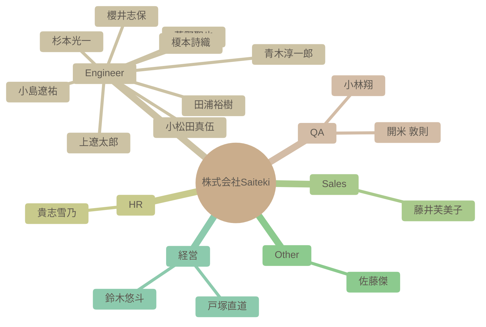

# チーム構成図

自動生成された組織図です。IssueおよびSlack連携による高度なAI分析結果が反映されます。

### 📊 関連リソース
- [🌐 インタラクティブ・ナレッジグラフ (Web版)](https://saitekiinc-com.github.io/saiteki-employee-management/)
- [📝 ナレッジグラフ分析レポート (Markdown)](./KNOWLEDGE_GRAPH.md)

### 組織マップ

```mermaid
%%{init: {'theme': 'base', 'themeVariables': {'primaryColor': '#F2EBE3', 'primaryTextColor': '#5D574F', 'primaryBorderColor': '#D9CFC1', 'lineColor': '#BEB3A5', 'secondaryColor': '#FAF9F6', 'tertiaryColor': '#FDFCFB', 'nodeBorder': '1px'}}}%%
mindmap
  root((株式会社Saiteki))
    Engineer
      杉本光一
      青木淳一郎
      櫻井志保
      田浦裕樹
      上遼太郎
      小松田真伍
      小島遼祐
      菅野聖也
      榎本詩織
    QA
      小林翔
      開米 敦則
    HR
      貴志雪乃
    Sales
      藤井芙美子
    Other
      佐藤傑
    経営
      鈴木悠斗
      戸塚直道
```

## 社員一覧サマリー

| 名前 | 職種 | 性格傾向 (概略) | 現在の状態 |
| --- | --- | --- | --- |
| [杉本光一](#%E6%9D%89%E6%9C%AC%E5%85%89%E4%B8%80) | Engineer | 技術への深い探求心と実践的な応用力に加え、チームへの強い貢献意欲が特徴です。新しい知識の共有と後進の育成に熱心で、常に丁寧かつオープン、そしてポジティブなコミュニケーションを心がけています。 | 直近では、組織内のナレッジベース構築プロジェクトを強力に推進しており、自ら具体的な仕組みを提案・実装する実行力を発揮しています。AI技術（RAG、ベクトル検索、知識グラフ）の実践的応用について深く考察し、コストや運用を考慮した戦略的な技術選定を行っています。多岐にわたる業務に精力的に取り組む中で、迅速な問題解決にもあたっています。 |
| [青木淳一郎](#%E9%9D%92%E6%9C%A8%E6%B7%B3%E4%B8%80%E9%83%8E) | Engineer | 協調性が非常に高く、新しい知識や経験に対し前向きに挑戦する。社交的で周囲との交流を深め、高い責任感を持って業務に取り組む楽観的な性格。 | 年末年始を通してSaitekiメンバーとの出会いに深く感謝し、2026年を「飛躍の年」と意気込んでいる。12月上旬には業務負荷が高い様子が伺えたが、それを乗り越え、現在は非常に前向きな精神状態にある。 |
| [小林翔](#%E5%B0%8F%E6%9E%97%E7%BF%94) | QA | 開放性と協調性が特に高く、新しい経験や人との交流を楽しみ、チームワークを重視する傾向がある。責任感も強く、ポジティブな姿勢を保ちながら、自身の経験や関心を積極的に共有し、自己開示を厭わない。詳細への注意と観察力も顕著。 | 入社初期段階であり、非常に前向きで期待に満ちた状態。積極的に自己開示し、様々な趣味や経験を通じて周囲との共通点を見つけることで、良好な人間関係を築こうと行動している。特にプライベートな興味や体験を詳細に共有することで、チームメンバーとの心理的距離を縮めようとしている。 |
| [櫻井志保](#%E6%AB%BB%E4%BA%95%E5%BF%97%E4%BF%9D) | Engineer | 自己認識が高く、協調性があり、学習意欲も高い。新しい環境への適応力も期待でき、謙虚で丁寧な印象を与えます。 | 1月からの入社を控えており、新しい環境に対する高い期待感と意欲に満ち溢れています。自身のスキルを活かしつつ、さらなる専門性向上とチームへの貢献を目指しています。 |
| [田浦裕樹](#%E7%94%B0%E6%B5%A6%E8%A3%95%E6%A8%B9) | Engineer | 非常に協調性が高く、誠実で、周囲への配慮を忘れない。新しい知識や経験への探求心が旺盛で、ユーモアを交えながら積極的に他者と関わる。時間管理を明確に伝え、同僚の活動をサポートするなど、ポジティブな関係構築を重視する。 | ハチドリソーラー社への商談提案やアジャイル開発の本質に関する社内啓蒙に継続的に注力しており、顧客への安心感提供と社内文化の醸成に貢献している。他者のフィードバックを自身のプレゼンや資料設計の仮説検証に活用し、改善に努める。私生活では「巨プリン」といったグルメへの関心も示し、同僚のマラソン参加を応援するなど、ポジティブな姿勢が見られる。一方で、他のコミットメントに対しては、時間を割くことが難しい状況も正直に伝えるなど、多忙ながらも状況を適切に管理している。 |
| [開米 敦則](#%E9%96%8B%E7%B1%B3%20%E6%95%A6%E5%89%87) | QA | 学習意欲が旺盛で新しい技術に積極的。責任感が強く、計画的に業務を進める。協調性があり、丁寧なコミュニケーションを心がける。 | 現在、QAにおけるAI協働作業の概念化と初期段階の成果物作成に取り組んでいる。特にテスト計画フェーズの最適化と汎用テスト観点の修正に注力し、業務プロセスの戦略的な改善を進めている段階。関係者との情報共有と意見交換にも積極的。 |
| [貴志雪乃](#%E8%B2%B4%E5%BF%97%E9%9B%AA%E4%B9%83) | HR | 組織への貢献と周囲への配慮が非常に高く、自ら課題解決に取り組み、周囲を巻き込む力に長けています。新しい知識や経験だけでなく、社員の心身の健康、そして社員間の交流への探求心も旺盛で、感情表現も豊かでバランスが取れています。 | 直近のログ（3月上旬）では、福利厚生プログラムの推進に加え、社内コミュニティの活性化イベント企画、有益な情報共有を精力的に行っている。常にポジティブで意欲的な姿勢を維持し、社員のウェルビーイング、交流、学習機会の提供に多岐にわたって貢献している。 |
| [上遼太郎](#%E4%B8%8A%E9%81%BC%E5%A4%AA%E9%83%8E) | Engineer | 新しい知識や経験への関心が深く、自己の成長のために他者やツールから学ぶ姿勢が顕著です。責任感が強く、計画的かつ体系的に業務を進めることを重視し、周囲への配慮を忘れず、社交的な態度で積極的に交流を図ります。 | アプリ開発が進行中で、AIを効果的に利用しつつも自身のスキル維持・向上に努めています。進捗を具体的に報告し、過去の経験を活かした業務改善にも意欲的で、業務は計画的に進められています。 |
| [小松田真伍](#%E5%B0%8F%E6%9D%BE%E7%94%B0%E7%9C%9F%E4%BC%8D) | Engineer | 新しい技術や知識の習得、改善提案に極めて積極的で、それを組織に還元しようとする意識が非常に高い。周囲とのコミュニケーションを円滑に行い、場を和ませる能力も持つ。自身の経験に基づいた問題意識を持ち、解決のための行動を厭わない。特に、社会や組織全体、そしてチームメンバーをより良くしようとする貢献意欲が顕著であり、活動的でチームを鼓舞する傾向がさらに強まっている。 | ナレッジ蓄積とAI技術の活用に関する検証（GitHub Actionsベースでの構築、DBやナレッジグラフの活用検討）を積極的に推進しており、一時的な繁忙期を乗り越え、現在は高いモチベーションで具体的な技術検証に着手している。会社全体への貢献意識を新たに持ち、経営層への配慮も示している。 |
| [小島遼祐](#%E5%B0%8F%E5%B3%B6%E9%81%BC%E7%A5%90) | Engineer | 新しい知識や経験に対する強い好奇心と探求心を持ち、周囲の意見を尊重し、積極的に関係を深めようとする。責任感も強く、常に前向きな姿勢を保つ。 | 新しい職場環境への適応に非常に意欲的で、持ち前の社交性と学習意欲を最大限に活かし、周囲との良好な関係を積極的に築いている。具体的な業務貢献目標を持ち、前向きな姿勢で取り組む準備が整っている。 |
| [藤井芙美子](#%E8%97%A4%E4%BA%95%E8%8A%99%E7%BE%8E%E5%AD%90) | Sales | 社交的で共感力が高く、新しいことへの探求心と責任感を併せ持つ。困難な状況にもユーモアを交えながら前向きに取り組み、組織的な課題にも率先して対応できる。 | 新オフィスへの移転が完了し、その後の重要な事務連絡（住所、月次処理）を担当するなど、総務として組織の基盤を支える業務に注力している。同時に、新しい仲間との交流や同僚の誕生日を祝うなど、社内の人間関係構築にも積極的に関与し、多忙ながらも充実した日々を送っている。 |
| [菅野聖也](#%E8%8F%85%E9%87%8E%E8%81%96%E4%B9%9F) | Engineer | 新しい技術や知識の吸収に意欲的で、協調性と社交性を持ち合わせる。自身の強みをユーモアを交えて表現し、感情も安定している。 | 入社直後で、開発者としての復帰とチームとの協働に非常に前向きである。AI技術への関心は非常に高く、読書を通じて多様な知識を吸収し、それを業務やコミュニケーションに活かそうとしている。人との交流も積極的に楽しみ、新しい環境での活躍を強く望んでいる。 |
| [佐藤傑](#%E4%BD%90%E8%97%A4%E5%82%91) | Other | 非常に開放的で誠実、外向的で協調性も高い。常に前向きで、新しい挑戦や学びを楽しみ、実践と情報共有を通じて貢献しようとする探求心と行動力を兼ね備えている。 | 海外での活動を継続しており、現在はUAEに滞在し、その後ASEAN中台韓を巡り、来年には帰国予定。国際的なチーム開発やハッカソンに積極的に参加し、最新のAI技術（特に小型高性能AIモデルのMac環境での実用性）に高い関心を持ち、M4 MaxでのGPTsossの動作を検証・共有するなど、その情報共有を通じて実践的な活用を模索している。質問歓迎の姿勢で、コミュニティへの貢献も意識している。 |
| [鈴木悠斗](#%E9%88%B4%E6%9C%A8%E6%82%A0%E6%96%97) | 経営 | 社交的で協調性が非常に高く、責任感と向上心も持ち合わせる。新しい環境や人、趣味にも積極的な関心を示し、ポジティブかつ安定した精神状態で周囲を巻き込む力がある。 | COOとして新事務所の立ち上げを完了させ、組織の物理的環境整備に貢献。新メンバーのオンボーディングに積極的に関わり、チーム全体のモチベーション向上と円滑な協力体制の構築に注力している。直近ではチームイベントへの参加意欲や同僚の誕生日を祝うなど、人間関係構築にも積極的。 |
| [戸塚直道](#%E6%88%B8%E5%A1%9A%E7%9B%B4%E9%81%93) | 経営 | 非常に外向的で協調性が高く、誠実かつ開放的な人物。組織の成長とメンバーの成功に深くコミットし、困難な状況にも持ち前のユーモアと前向きさで対処する。特にAIと組織開発に対する深い洞察と、それを自身の事業に落とし込む粘り強さが顕著。 | 第二創業期の中、SES事業の布陣完成と組織の質的な向上に注力し、急速な拡大と組織変革を推進している。自身の時間管理を公開するなど、透明性を高めながら、AI技術のビジネス応用と人材育成・定着を両輪で進めている。 |
| [榎本詩織](#%E6%A6%8E%E6%9C%AC%E8%A9%A9%E7%B9%94) | Engineer | 非常に開放的で協調性があり、新しい知識や経験を積極的に取り入れようとする。親しみやすく、ユーモアのセンスも持ち合わせながら、自己を客観視できるバランスの取れた性格。 | 6月～7月の入社を間近に控え、期待と意欲に満ち溢れている。積極的にコミュニケーションを取り、周囲との関係構築に努めており、社内での新しい経験と学習を楽しみにしている。 |

---

## 詳細プロフィール

各社員の詳細な分析結果です。クリックして展開できます。

### 杉本光一 (Engineer)

> **総合サマリー**: 杉本さんは、AI技術、特に知識グラフやベクトル検索の実践的な可能性を探求し、ナレッジ共有の仕組み化をリードする技術探求者です。自身の知見を活かして具体的なシステムを構築し、その中で戦略的な技術選定を行う、協調性と実行力に富んだエンジニア。

<b>🛠 性格傾向</b>

**要約**: 技術への深い探求心と実践的な応用力に加え、チームへの強い貢献意欲が特徴です。新しい知識の共有と後進の育成に熱心で、常に丁寧かつオープン、そしてポジティブなコミュニケーションを心がけています。

| 項目 | スコア | 根拠・エピソード |
| --- | --- | --- |
| 開放性 | 9/10 | ナレッジベースの仕組みを自ら考案し、Slackbot、Cloudflare、GitHub Actionsを連携させた具体的な実装案を提案している。ベクトル検索や知識グラフのどちらが適切か、コストや運用負荷も考慮して深く議論し、技術的な可能性を多角的に探求する姿勢が伺える。 |
| 誠実性 | 9/10 | ナレッジベースの構築という具体的な目標に対し、自ら仕組みを提案し、実装に着手している。GitHub Actionsのエラー発生時には迅速に原因を特定し、AIを活用して修正するなど、責任感を持ってタスクを遂行する。技術選定においても、まずゴール定義を優先し、コストや規模感を考慮するなど、計画的かつ実用性を重視する。 |
| 外向性 | 9/10 | 自身の提案が賛同された際に「よかったですー！」とポジティブに反応し、相談なしで提案したことには謙虚に意見を求めている。同僚のリソース状況を気遣うなど、周囲への配慮を欠かさない。絵文字も交えながら親しみやすいコミュニケーションを構築する。 |
| 協調性 | 9/10 | 自身の提案について「相談もなしですみませんが」と前置きし、他者からの意見を求めている。同僚の「事務処理と現場繁忙が重なってしまい…」という状況に対し、「全然大丈夫ですよ！副業なのでリソースの確保ができていないですからね」と理解と気遣いを示している。ポジティブなリアクションを返し、他者の意見を尊重する姿勢が見られる。 |
| 神経症的傾向 | 3/10 | GitHub Actionsのエラーに直面しても感情的にならず、「リッチテキスト許容してるんでなにか記法ではじかれたのか。ちょっと確認してみます！」と冷静に原因を探り、AIを活用して迅速に修正を行うなど、常に落ち着いて論理的に問題解決にあたっている。 |

<b>💪 仕事スタイルと強み</b>

**要約**: AI技術への深い知見と戦略的思考で、ナレッジ共有の課題を具体的な仕組みで解決しようとします。実装力、迅速な問題解決能力、そして技術選定における実用性・コスト意識を兼ね備えた、実践的な推進役です。

**問題解決スタイル**: 組織内のナレッジ共有という課題に対し、Slackbot、Cloudflare、GitHub Actionsを組み合わせた具体的な仕組みを自ら提案・試作することで解決を試みる。技術的な問題（GitHub Actionsのエラー）が発生した際には、AIを活用するなどして迅速かつ実用的な解決策を見出す。ベクトル検索やナレッジグラフの選定においても、コスト、運用負荷、ゴール定義を考慮した上で最適なアプローチを模索する。

**主要な強み**: AI技術の深い知見と実践的な応用力, 戦略的思考による本質的な課題解決（ナレッジ共有、技術選定）, 情報共有とナレッジマネジメントの推進, 実行力と迅速な問題解決能力, 丁寧で建設的なコミュニケーション, 技術的な探求心と個人的な実験による検証力, プロジェクトの進行管理と情報活用への意識

**証拠エピソード**:
- Slackのショートカットからナレッジを登録し、CloudflareとGitHub Actionsを連携させてMarkdownとして保存するナレッジベースの仕組みを自ら提案・試作した。
- GitHub Actionsのエラー発生時、AIを活用して迅速に修正コミットし、動作を確認した。
- ナレッジベースの実装において、まずは活用方針とゴール定義を優先し、技術選定（ベクトル検索かナレッジグラフか）はその後に、コストや規模感を考慮して柔軟に決めるべきと提案した。
- ナレッジの保存形式について、Notionのような独自ブロックではなく純粋なテキストを推奨することで、将来的なAIによる情報抽出と活用幅の拡大を見通している。

<b>💎 価値観とモチベーター</b>

**要約**: 最新AI技術への深い探求心と、それが組織やチームの具体的な課題解決、特にナレッジ共有や効率化に繋がることに大きな喜びを見出します。自ら手を動かして新しい仕組みを構築し、その効果を最大化することに情熱を燃やします。

**コアバリュー**: 技術革新と探求 (特にAI x 知識グラフ、ベクトル検索), 組織・チームへの貢献 (ナレッジ共有、業務効率化), 実践を通じた技術検証と実装, 自己成長と学習の継続, チームワークと協調性, 信頼性と実用性を兼ね備えたシステム開発, オープンな情報共有

**モチベーショントリガー**: 新しい技術を深く理解し、それが組織の具体的な課題解決に繋がること, 自身のアイデアや知見を活かして具体的な仕組みを構築すること, チームのナレッジ蓄積や情報活用の効率化に貢献すること, 技術的な問題を迅速に解決し、システムを安定稼働させること, メンバーとの活発な情報交換を通じて新たな学びを得ること, チームや組織の生産性が向上すること

**証拠エピソード**:
- Slackbot, Cloudflare, GitHub Actionsを利用したナレッジベースの仕組みを自ら提案・試作することで、組織のナレッジ共有と情報活用を促進しようとしている。
- ナレッジの保存形式について、純粋なテキストを推奨することで、将来的なAIによる情報抽出と活用幅の拡大を見据え、組織の効率化に貢献しようとしている。
- ベクトル検索やナレッジグラフの採用を検討する際、コストや運用負荷、最終的なゴール定義を考慮した上で柔軟に判断すべきと提唱し、最適な技術選定を通じて実用的なシステム構築を目指している。
- GitHub ActionsのエラーをAIを使って迅速に修正したことは、問題解決への意欲と効率化への志向を示している。

<b>📈 現在の状態</b>

**要約**: 直近では、組織内のナレッジベース構築プロジェクトを強力に推進しており、自ら具体的な仕組みを提案・実装する実行力を発揮しています。AI技術（RAG、ベクトル検索、知識グラフ）の実践的応用について深く考察し、コストや運用を考慮した戦略的な技術選定を行っています。多岐にわたる業務に精力的に取り組む中で、迅速な問題解決にもあたっています。

- **感情レベル**: positive
- **業務負荷状況**: ナレッジベースの仕組み提案・試作、GitHub Actionsのエラー対応、ベクトル検索や知識グラフといった技術選定の検討、他者への意見聴取と調整など、非常に多岐にわたる業務に精力的に取り組んでおり、高い負荷がかかっている様子が伺える。しかし、その中でも前向きにタスクを推進している。
- **最近の関心トピック**: ナレッジベースの仕組み化と実装（Slackbot, Cloudflare, GitHub Actions連携）, RAGの活用方針と、それに向けたナレッジのインプット形式, ベクトル検索と知識グラフの技術選定（コスト、運用負荷、ゴール定義の考慮）, GitHub ActionsのデバッグとAIを活用した問題解決

---

### 青木淳一郎 (Engineer)

> **総合サマリー**: AWS基盤の専門性を持ち、未経験技術の習得にも意欲的。福岡在住で家族を大切にし、高い責任感と協調性でSaitekiへの貢献とメンバーとの交流を積極的に図る人物。

<b>🛠 性格傾向</b>

**要約**: 協調性が非常に高く、新しい知識や経験に対し前向きに挑戦する。社交的で周囲との交流を深め、高い責任感を持って業務に取り組む楽観的な性格。

| 項目 | スコア | 根拠・エピソード |
| --- | --- | --- |
| 開放性 | 8/10 | AWS基盤の経験がある中で、AzureやGoogle Cloud、AIといったクラウド技術への強い関心を示す。未経験のBIツールに苦戦しながらも、それをスキルの幅を広げるチャンスと捉え、前向きに知識と経験の習得に努めている。 |
| 誠実性 | 7/10 | 業務の納期を最優先し、興味のある社内イベントであっても納品が近いことを理由に参加を見送る判断をするなど、強い責任感を持つ。未経験のBIツールでの苦労も、粘り強く習得に努める機会と捉えている。 |
| 外向性 | 8/10 | 入社時に詳細な自己紹介を行い、共通の趣味（Youtube、パパ）を持つメンバーには積極的に交流を呼びかけ「パパ会」を提案。地域を越えた「西日本勢」の盛り上げにも意欲を見せるなど、社内でのコミュニケーションや親睦を重視する姿勢が強い。 |
| 協調性 | 9/10 | メンバーの投稿に対し共感や感謝を積極的に示し、共通点を見つけて親睦を深めようとする。他者のnoteを読み感動を伝えるなど、周囲の人々の気持ちや経験を尊重し、良好な関係性を築くことに非常に長けている。 |
| 神経症的傾向 | 3/10 | ネガティブな感情の表出は非常に少なく、近所のサル出没に驚きと恐怖を感じたという発言程度。未経験のBIツールでの苦戦や多忙な業務状況下でも、常に前向きな姿勢を保ち、状況を好転させる機会と捉える傾向がある。 |

<b>💪 仕事スタイルと強み</b>

**要約**: AWS基盤のインフラ設計・構築に高い専門性を持ちつつ、未経験技術への学習意欲が極めて高い。責任感が強く、チームワークと自己成長を重視して業務に取り組む。

**問題解決スタイル**: 未経験の技術や困難に直面しても、それをスキルアップの好機と捉え、前向きな姿勢で学びと経験を積み重ね、解決策を模索する。

**主要な強み**: インフラ設計・構築スキル, 学習意欲, コミュニケーション能力, 責任感

**証拠エピソード**:
- 入社時の自己紹介でAWS基盤のインフラ設計・構築に携わってきたことを明確に述べている。
- Azure、Google Cloud、AIへの関心や、未経験のBIツール（QuickSuite）に苦戦しつつも「スキルの幅を広げるチャンス」と捉え積極的に取り組む姿勢を見せている。
- 興味のある社内イベントであっても、納品が近いことを理由に不参加を表明し、業務を最優先する強い責任感を見せている。
- 「Saitekiの輪をどんどん広げていけたら」と発言し、オンラインでの積極的なコミュニケーションや「パパ会」の提案を通じてメンバーとの関係構築に努めている。

<b>💎 価値観とモチベーター</b>

**要約**: 家族との時間を大切にし、仕事では新しい技術の習得と自己成長を追求。組織への貢献意欲とSaitekiの一員であることへの誇り、メンバーとの交流を非常に重視している。

**コアバリュー**: 家族, 成長, 貢献, 責任

**モチベーショントリガー**: 新しい技術の習得, チームへの貢献, 自己成長, 人との交流

**証拠エピソード**:
- 自己紹介で「家族とドライブに行ったり、子どもと遊んだり、妻をガチャガチャ屋さんに連れて行ったり」と休日の過ごし方を共有し、家族との時間を大切にしている様子が伺える。
- AWS以外のAzure、Google Cloud、AIといった技術への学習意欲や、未経験のBIツールでの苦戦も「スキルの幅を広げるチャンス」と捉え、知識と経験を得ることに意欲的である。
- 入社時に「Saitekiの輪をどんどん広げていけたら」と組織への貢献意欲を示し、年末には2025年を「最高の年」と振り返り、2026年を「さらに飛躍の年にしていきましょう！」と語るなど、強い責任感と組織への帰属意識が見られる。
- オンラインでのコミュニケーションを重視し、「パパ会」や「西日本勢盛り上げていきましょー」とメンバー間の交流を積極的に促進しようとしている。
- 他者のnoteを読んで「グッときました！」と感動を伝え、メンバーの入社経緯への関心を示している。

<b>📈 現在の状態</b>

**要約**: 年末年始を通してSaitekiメンバーとの出会いに深く感謝し、2026年を「飛躍の年」と意気込んでいる。12月上旬には業務負荷が高い様子が伺えたが、それを乗り越え、現在は非常に前向きな精神状態にある。

- **感情レベル**: positive
- **業務負荷状況**: 12月上旬には納品が近く、帰りが遅くなるほどの業務負荷があったが、それを乗り越え、年末年始は達成感と来年への意欲を見せている。
- **最近の関心トピック**: Saitekiメンバーの入社経緯, 京都旅行, 2025年の振り返りと2026年への期待, BIツールの知識習得

---

### 小林翔 (QA)

> **総合サマリー**: 協調性が高く、新しい環境への適応力に優れる人物。多岐にわたる趣味と経験を詳細かつ情熱的に共有することで、周囲との関係を深め、共に成長することを重視する。社交的な交流を楽しみ、自ら情報を発信することで場を活性化させる。

<b>🛠 性格傾向</b>

**要約**: 開放性と協調性が特に高く、新しい経験や人との交流を楽しみ、チームワークを重視する傾向がある。責任感も強く、ポジティブな姿勢を保ちながら、自身の経験や関心を積極的に共有し、自己開示を厭わない。詳細への注意と観察力も顕著。

| 項目 | スコア | 根拠・エピソード |
| --- | --- | --- |
| 開放性 | 9/10 | 出張先や趣味の旅行で知った美味しい飲食店（京都のうどん、沼津の餃子）を詳細に紹介し、地域特有の文化や食への深い興味と探求心を示す。自身の声が入ったライブ動画を共有するなど、アニメやアイドルといったポップカルチャーへの関心も非常に高く、多様な趣味を持つ。沼津の餃子の製法について言及するなど、物事の本質や背景にも関心を持つ。 |
| 誠実性 | 8/10 | 紹介する飲食店の情報（つゆのタイプ、麺の食感、天ぷらのサクサク感、餃子の製法、行列状況）が非常に詳細で具体的であることから、物事を注意深く観察し、記憶・整理する能力が高いことがうかがえる。自身のライブ体験の細部まで覚えている点も同様である。出張中に特定のうどん屋を何度もリピートするなど、気に入ったものには繰り返し関わる几帳面さも見られる。 |
| 外向性 | 9/10 | 飲み会後に自身の趣味に関する情報や動画を積極的に共有し、交流を深めようとする姿勢が明確に見られる。社交的なイベントへの参加に「わくわく」と絵文字を添えて意欲を示し、自身のライブでのエピソードをユーモアを交えて語るなど、自己開示を積極的に行うことで周囲との関係性を構築しようとする。参加後のお礼と情報提供も積極的な交流を示す。 |
| 協調性 | 9/10 | 飲み会後の感謝の言葉や、美味しいお店の情報を共有する行為自体が、周囲への配慮と貢献意識の表れである。自身の動画を共有する際に「何万分の一ですが…」と謙遜する姿勢や、ライブの思い出を共有することで親しみやすさを醸し出すなど、友好的で協調的なコミュニケーションを心がけている。 |
| 神経症的傾向 | 3/10 | 自身の声が入った動画の共有に際しても、ユーモラスな表現を使い、ライブでの失敗談を明るく語るなど、ポジティブな自己開示が見られる。ストレスや不安を感じやすい様子はなく、社交的な場面を心から楽しんでいる。 |

<b>💪 仕事スタイルと強み</b>

**要約**: 長年の経験に裏打ちされた細部への注意と、高いコミュニケーション能力が強み。新しい情報や知識の吸収にも積極的で、協調性を持ちながら業務に取り組む。状況把握と情報共有に長け、自身の経験を活かした具体的な提案も期待できる。

**問題解決スタイル**: 13年間のテスター経験を通じて培われた、細部に目を配り潜在的な問題点を見つけ出す能力を持つ。自身の経験や知識を活用し、論理的に課題を整理する傾向がある。具体的な情報収集と提供の側面が強化され、事実に基づいた提案を行う。

**主要な強み**: テスト・品質管理経験, コミュニケーション能力, 情報収集力, 情報提供力, 状況説明能力, 協調性, 詳細観察力

**証拠エピソード**:
- 飲み会後に、参加者へのお礼と共に、自身の趣味の動画と具体的なグルメ情報を詳細に共有する。
- 出張先や旅行で訪れた飲食店の特徴（麺の食感、天ぷらの状態、餃子の製法、行列状況）を細かく記憶し、他者に分かりやすく伝える。
- 社交的なイベントへの参加に強い意欲と喜びを示し、積極的に交流の機会を設ける。

<b>💎 価値観とモチベーター</b>

**要約**: 成長、繋がり、楽しさ、探求、そして経験を重視する。新しい知識やスキルの習得、他人との良好な関係構築、充実した楽しい経験、そして自身の情熱を共有することがモチベーションの源泉となる。

**コアバリュー**: 成長, 協調, 楽しさ, 探求, 繋がり, 経験の共有

**モチベーショントリガー**: 新しい知識やスキルの習得, チームへの貢献と協業, 楽しい経験や趣味の追求, 共通の興味を持つ人々との交流, 興味を持ったことの詳細な情報共有, 自己開示を通じた人間関係の深化

**証拠エピソード**:
- 飲み会の後に、自らの趣味や出張先での発見を詳細に共有することで、仲間との繋がりを深めようとする。
- 旅行や出張先での新しい発見（美味しいお店や地域文化）を積極的に楽しみ、それを他者と共有することに喜びを感じている。
- 社交的なイベントへの参加に「わくわく」と感情を表現し、楽しい経験を重視する姿勢が見られる。

<b>📈 現在の状態</b>

**要約**: 入社初期段階であり、非常に前向きで期待に満ちた状態。積極的に自己開示し、様々な趣味や経験を通じて周囲との共通点を見つけることで、良好な人間関係を築こうと行動している。特にプライベートな興味や体験を詳細に共有することで、チームメンバーとの心理的距離を縮めようとしている。

- **感情レベル**: positive
- **業務負荷状況**: 業務外の交流を活発に行っている段階であり、業務負荷はまだ限定的または、業務とプライベートのバランスをうまく取っている状況。
- **最近の関心トピック**: 美味しいグルメ（京都のうどん、沼津の地域特産餃子など）, 旅行・出張での体験と詳細な情報共有, アニメ・アイドルライブ（特にラブライブ!関連の思い出話）, 社交的なイベントへの参加と交流, 自身の趣味や経験を詳細に共有すること

---

### 櫻井志保 (Engineer)

> **総合サマリー**: 櫻井志保さんは、データ分析スキルと高い学習意欲を持ち、協調性をもってチームに貢献しようと意欲的な人物です。

<b>🛠 性格傾向</b>

**要約**: 自己認識が高く、協調性があり、学習意欲も高い。新しい環境への適応力も期待でき、謙虚で丁寧な印象を与えます。

| 項目 | スコア | 根拠・エピソード |
| --- | --- | --- |
| 開放性 | 8/10 | Power BIを用いたデータ分析・加工の経験があり、資格取得を目指しデータベース構築といったより専門的な分野への挑戦意欲を明確に示しています。 |
| 誠実性 | 7/10 | 自己紹介で自身の業務経験、スキル、今後の展望を詳細かつ明確に記述しており、責任感と計画性が伺えます。趣味を通じて業務のリフレッシュを図る自己管理能力も持ち合わせています。 |
| 外向性 | 6/10 | 「Slack等を通じて積極的にコミュニケーションを取っていければ」と、自ら進んで他者との交流を求める姿勢が見られます。ただし、直接会う機会が少ないことへの言及もあり、バランスの取れた交流を好むと推測されます。 |
| 協調性 | 9/10 | 「今後ともよろしくお願いいたします」「まだまだ至らない点も多いかと思いますが、何卒よろしくお願いいたします」といった謙虚で丁寧な言葉遣いから、協調性や相手への配慮が強く感じられます。 |
| 神経症的傾向 | 3/10 | 自己紹介の内容全体から、新しい環境への期待感と前向きな姿勢が感じられ、不安や心配を示唆する要素は見当たりません。 |

<b>💪 仕事スタイルと強み</b>

**要約**: データに基づいた分析力と高い学習意欲を持ち、自ら専門性を深めようと努力します。チームでのコミュニケーションを重視し、協調的に仕事を進めるタイプです。

**問題解決スタイル**: データ分析スキルを活かし、論理的な思考で現状を把握し問題解決に取り組むアプローチを取ります。

**主要な強み**: データ分析, 学習意欲, コミュニケーション

**証拠エピソード**:
- Power BIを用いたデータ分析・加工の経験があると述べています。
- 資格取得を目指し、データベース構築などより専門的な分野への挑戦を考えていると表明しています。
- Slack等を通じて積極的にコミュニケーションを取りたいと意欲を示しています。

<b>💎 価値観とモチベーター</b>

**要約**: 自身の成長と専門性向上を重視し、新しい知識やスキルを習得することに喜びを感じる人物です。チームワークを大切にし、周囲との良好な関係を築きながら貢献することにモチベーションを感じます。

**コアバリュー**: 成長, 貢献, 協調性, 専門性

**モチベーショントリガー**: 新しい知識やスキルの習得, 専門性の向上, チームへの貢献, 自己管理を通じたパフォーマンス維持

**証拠エピソード**:
- 資格取得やデータベース構築といった専門分野への挑戦意欲を表明しています。
- Slack等を通じて積極的にコミュニケーションを取りたいと述べています。
- 趣味をリフレッシュに活用し、業務パフォーマンス維持に努めていることを示唆しています。

<b>📈 現在の状態</b>

**要約**: 1月からの入社を控えており、新しい環境に対する高い期待感と意欲に満ち溢れています。自身のスキルを活かしつつ、さらなる専門性向上とチームへの貢献を目指しています。

- **感情レベル**: positive
- **業務負荷状況**: 新規入社予定のため、現在の業務負荷は不明ですが、趣味をリフレッシュに活用していることから自己管理ができていると推測されます。
- **最近の関心トピック**: データ分析, データベース構築, 資格取得, Slackを通じたコミュニケーション

---

### 田浦裕樹 (Engineer)

> **総合サマリー**: 深い技術的知見を持ち、アジャイルの本質をリスクコントロールと捉え、顧客への安心提供と社内への知見共有に情熱を注ぐ。誠実で協調性豊か、同僚への配慮を忘れず、グルメを含む豊かな私生活も大切にする。

<b>🛠 性格傾向</b>

**要約**: 非常に協調性が高く、誠実で、周囲への配慮を忘れない。新しい知識や経験への探求心が旺盛で、ユーモアを交えながら積極的に他者と関わる。時間管理を明確に伝え、同僚の活動をサポートするなど、ポジティブな関係構築を重視する。

| 項目 | スコア | 根拠・エピソード |
| --- | --- | --- |
| 開放性 | 10/10 | AI技術の学習に深くコミットし、自身でRAG構築を目標に高性能PCを導入。ゴッホ展を深く鑑賞し、原田マハの関連書籍を即座に購入するなど芸術への知的好奇心が非常に高い。長年の憧れだったチェロを始め、羊文学のライブには毎年参戦するほどの情熱を持つ。日本酒、ビール、ワインを好み、特に黒龍、作、酔鯨、浜福鶴といった銘柄を挙げる。ロイズの生チョコとアイラウイスキーの組み合わせを絶賛するなど、グルメへの探求心とこだわりも深い。新しいメンバーには自身の好きなお酒の銘柄を具体的に挙げて共有している。また、広木大地氏の言葉を引用し、自身の哲学を共有するとともに、プレゼンや資料が仮説に基づいて設計されており、その検証のためのフィードバックを重視する点で、知的好奇心と分析的な思考の深さが伺える。 |
| 誠実性 | 9/10 | PoCの立ち上げフェーズでタスク分解、優先順位付け、計画策定を詳細に行い、進捗を具体的なポイントと共に共有する。AI駆動開発の標準化に向けたワークフローやガイドライン作成にも継続的に取り組む。家庭の事情（子供のインフルエンザ罹患や荒天による急遽テレワーク）が生じた際も、業務への影響を考慮し速やかに連絡を行い、柔軟に対応するなど、責任感と計画性が非常に高い。顧客に「自信を持って即答」するためには徹底した準備が必要であると認識し、実践する。週例MTGの開催を事前に確認し、自身の進捗状況についても正直に共有できる。資料やプレゼンは仮説を持って設計し、フィードバックを通じて検証することで、より良いものを提供しようと努める。また、他のコミットメントに対しては、時間を割くことが難しい状況を正直かつ明確に伝えるなど、自身の業務状況やキャパシティ管理を適切に行い、関係者への配慮を欠かさない。 |
| 外向性 | 8/10 | 新メンバーには積極的に自己紹介し、自身のプライベートな情報（出身地、家族、趣味、グルメ情報、PC購入の経緯）をオープンに共有することで親近感を醸成する。絵文字を非常に多用し、勉強会では活発に発言や改善提案を行うなど、他者との交流を積極的に楽しむ。戸塚氏とのライブ参加を積極的に提案する他、社内レターや商談共有にも感謝を伝え、積極的にコメントを残すなど、関係構築にも意欲的。新しい同僚にお酒の好みや関西在住であることを共有し、共通点を探すことで距離を縮めようとする。グルメに関する話題でも、ユーモアを交えながら活発にコミュニケーションを取り、他者にも試すよう勧める。感謝や喜びの感情を豊富な絵文字とともに頻繁に表現し、他者の発言に対して「めちゃくちゃ嬉しい」と素直に伝えることで、周囲とのポジティブな関係構築を重視する。同僚が参加するマラソンイベントに対して、積極的に応援メッセージを送り、共感とサポートを示す。 |
| 協調性 | 9/10 | 他者の意見を尊重し、感謝の意を頻繁に伝える。「素晴らしいレターをありがとうございました」「そう言って頂けてめっちゃ嬉しいです」「シェアありがとうございます」「お心遣いありがとうございます」「めちゃくちゃ嬉しいコメントありがとうございます」といった感謝の言葉が多い。荒天時のメンバーの安否を気遣い、周囲への配慮や思いやりが非常に強い。顧客を安心させることを商談の最優先事項と捉え、具体的なヒアリングで実践する。勉強会へのフィードバックも、リモート参加者への配慮を含め建設的に行う。チームメンバーへの協力を惜しまない姿勢を示す。同僚の体調を気遣う言葉をかけ、自身の経験から顧客への「安心と信頼」提供の重要性を語り、後輩には「普段の業務の中で何度も繰り返しやると、うまくなりますよ」と具体的にアドバイスする。他者の意見やフィードバックに対して「めちゃくちゃ嬉しい」と素直に感謝の意を表明し、後輩に対しては「普段の業務の中で何度も繰り返しやると、うまくなりますよ」と具体的に育成的なアドバイスを送る。同僚が参加するマラソンイベントに対し、積極的にエールを送ることで、チームへの帰属意識とサポート精神を発揮する。また、自身の時間的制約についても、相手に配慮しつつ正直に伝えることができる。 |
| 神経症的傾向 | 3/10 | 子供の体調不良（インフルエンザ）や急なテレワークにも冷静かつ柔軟に対応し、業務を調整する。週例MTGへの参加可否も状況を考慮しつつ事前に連絡するなど、精神的な安定性とストレス耐性が高く、業務への影響を最小限に抑えようと努める。荒天でバスが運休し急遽テレワークになった際も、焦りを見せず業務に対応している。突然の予定変更（夕食準備の時間がない、21時で早退）に対しても冷静に対応し、状況を関係者に速やかに連絡できる。自身の進捗がないことも正直に報告できる。急な私用（夕食準備の時間がない、21時で早退）が発生した際も、業務への影響を考慮し速やかに連絡を行い、冷静かつ柔軟に対応する。他のタスクへのコミットが難しい状況であっても、感情的にならず、客観的に現状を伝えることができる。 |

<b>💪 仕事スタイルと強み</b>

**要約**: AI技術を活用した開発全般に強みを持ち、特に要件定義から実装までの開発プロセス全体への深い知見と、アジャイルの本質であるリスクコントロールを重視した標準化への貢献意欲が高い。アジャイルなプロジェクト推進と顧客視点での問題解決に長け、ビジネスモデルへの深い洞察力も持つ。最上流工程の重要性を認識し、レビューを通じて品質向上にも貢献し、顧客への安心提供と社内文化の醸成にも深く貢献する。自身の時間管理を明確に伝え、周囲との連携を円滑に進める。

**問題解決スタイル**: PoCにおいては、最初に全てを決め切らず、仮説を立て、クライアントとの密なすり合わせを通じて要件や計画を段階的にアップデートしていくアジャイルなアプローチを重視する。アジャイルの真髄を「不確実性を分解し、リスクをコントロール可能な形に変えていくこと」と定義し、これを商談やエンジニアリングの本質と捉えている。レクター代表の広木大地氏の「エンジニアリングの本質は、曖昧で分からない状態から、具体的ではっきりとした状態に変えていく行為だ」という思想に共感し、これを商談にも適用する。表面的な「速く作る」「ドキュメントを書かない」アジャイルを批判しつつも、リスクを限定できる場合は設計を固めず実装に入る柔軟な姿勢も持つ。問題解決に際しては、AIを積極的に活用し、自身の経験と組み合わせることで具体的なワークフローやガイドラインの標準化を目指す。商談においては「お客様を安心させる」ことを最優先事項と捉え、的確なヒアリングで目的を明確にし、そのために「自信を持って即答」できるだけの徹底した準備を重視する。自身のプレゼンや資料も「仮説を持って設計」し、フィードバックを通じて仮説検証と改善を行うことで、より質の高い問題解決を目指す。

**主要な強み**: 開発プロセス全体（要件定義〜実装）への深い知見と標準化への貢献, アジャイル開発の本質的な理解と実践（特にリスクコントロールと不確実性分解）, AI駆動開発の実践と知識共有（特に標準化・ガイドライン作成）, 顧客視点での課題解決と安心感の提供のための徹底した準備と自信ある回答, チーム立ち上げ・品質改善（レビューを通じた貢献）, ビジネスモデルへの深い洞察と分析力, システム開発最上流工程への深い理解と重視, 仮説検証に基づくプレゼン・資料設計と改善, 自身の時間管理と周囲への明確な伝達

**証拠エピソード**:
- PoCの進捗状況を詳細に共有し、仮説検証と段階的アップデートの重要性を解説することで、チーム全体のレベルアップに貢献しようとしている。
- IPAの要件定義ガイドラインやAIエージェントによる開発フローのテンプレートを共有し、開発プロセスの基礎知識やAI活用のベストプラクティスを惜しみなく共有する。
- ChatGPTを用いて飲食店の利益設計を分析し、そのビジネスモデルを技術開発のプロセスと関連付けて考察するなど、技術を実生活やビジネスに応用する高い洞察力と好奇心を持つ。
- 自身の経験から「お客様を安心させる」ことを商談の最優先事項と考え、具体的なヒアリングでの認識合わせを通じて実践していると発言。
- 勉強会への建設的なフィードバックを通じて、より質の高い学習機会を創出しようと働きかけ、QAと開発の連携に関する深掘り議論を提案する。
- AI駆動開発のスタンダード作りのため、作業ログテンプレートやワークフローのドキュメント化に積極的に取り組む。
- 「システム開発の最上流を知っていると、開発に取り組むときの視野が格段に広がると思います」と述べ、商談内容の社内共有を奨励。
- 「もう今は自分が書く時はリカバリーの時だけで、普段はレビューばかりですが…」と自身の役割がレビュー中心であることを示唆し、品質向上に貢献している様子がうかがえる。
- 「エンジニアリングの本質は、曖昧で分からない状態から、具体的ではっきりとした状態に変えていく行為だ」という思想を商談に適用し、ハチドリソーラーへの提案内容にも反映させている。
- アジャイルの真髄を「不確実性を分解し、リスクをコントロール可能な形に変えていくこと」と明確に定義し、安易なアジャイル解釈を批判する。
- 顧客を安心させるためには「自信を持って即答」することが重要であり、そのためには徹底した準備が必要であると述べ、自身の仕事のスタンスを明らかにしている。
- エンジニアリングの本質を「曖昧な状態を具体的ではっきりとした状態に変える行為」と定義し、これが商談やアジャイルの真髄であると説明する。
- アジャイルを「不確実性を分解し、リスクをコントロール可能な形に変えていくこと」と明確に定義し、安易な「速く作る」「ドキュメントを書かない」アジャイル解釈を批判する。
- 顧客への提案において「動揺を見せることなく、自信を持って回答する」ことが安心と信頼を作るために重要であり、そのための徹底した準備を重視すると語る。
- 自身の資料やプレゼンは「仮説を持って設計」されており、他者からのフィードバックを通じてその仮説を検証し、改善に繋げていることを明かす。
- 同僚のマラソン参加に対し、積極的に応援のメッセージを送ることで、チーム内の連帯感を高めようとする。
- 他のタスクへの時間的コミットが難しい状況を、絵文字を交えつつ正直かつ簡潔に伝えることで、関係者間の認識の齟齬を防ぎ、信頼性を保つ。

<b>💎 価値観とモチベーター</b>

**要約**: Saitekiへの強い信頼とコミットメントを背景に、自身の豊富な経験と知識をチームや後進に惜しみなく共有することで、組織全体の成長と顧客の成功に貢献することに大きな価値を見出している。特にアジャイルの本質であるリスクコントロールを重視し、技術的知見が社内で理解され、会社の型として磨かれることに意欲を見せる。新技術への探求心も高く、家族との時間や芸術・文化的な趣味の充実も重視する。社内における情報共有と異なる専門性を持つメンバー間のシナジーを高く評価し、組織文化の醸成にも強い価値を見出している。また、同僚の活動を応援し、チームへの配慮を怠らない。

**コアバリュー**: チームワーク, 継続的な学習と技術革新（特にAIの探求と標準化、アジャイルの本質的な実践）, 顧客満足と貢献（特に顧客への安心感提供と信頼構築）, 誠実さ, 知識共有と後進育成, リスクコントロールと不確実性の管理, 家族, SaitekiのMVVへの共感, 多様な専門性を持つメンバー間のシナジー, 組織文化の形成と改善, 同僚への配慮とサポート

**モチベーショントリガー**: チームメンバーからの感謝と成長の実感, 自身の知識共有がチームや後進の成長に貢献できたという実感, 新しい技術（特にAI）の習得と実践、そしてその標準化への挑戦, 自身の専門性が組織の共通認識や文化として定着し、会社全体の成長に貢献すること, 顧客からの肯定的なフィードバックとプロジェクトの成功、顧客から信頼を得ること, SaitekiのMVVへの共感と貢献, 芸術や文化、グルメに触れること、家族との充実した時間, 社内の情報共有文化の促進, 同僚の活動を応援し、チームの一体感を高めること

**証拠エピソード**:
- 「この人のために汗をかきたい」という強い想いからSaitekiへの参画を決めるなど、戸塚氏への信頼と会社への貢献意欲が非常に高い。
- 勉強会のフィードバックに「胸アツ」と反応し、自身の知識や経験がチームに貢献できたことを喜び、さらに共有を続けると表明している。
- 「僕の大事な役割だと自覚しているので、やっていきます！！」と、自身の経験値を社内にシェアすることへの強いコミットメントを示す。若手エンジニアには自身の若い頃のような悩みをさせたくないという思いも原動力。
- 子供の行事に参加したり、家族で旅行や外食を楽しんだりするなど、家族との時間を非常に大切にし、プライベートの充実も重視している。
- 長年の憧れだったチェロを始めたり、羊文学のライブに毎年参加したり、ゴッホ展を深く鑑賞したりと、自身の知的好奇心や芸術への情熱を追求する。
- 「商談の様子をどんどん社内に共有する取り組み、すごくありがたいですね」と発言し、情報共有を積極的に支持。
- 「ビジネス・営業の戦闘力は備えているボードメンバーと、技術のプロである皆さんが商談に出ていったら百人力だな、と！」「お客様側から見ても、心強いと思うんですよ。なのでこれからもどんどん頼って下さい」と述べ、異なる専門性を持つメンバー間の協業とシナジーを重視する姿勢を示す。
- 「エンジニアリングの本質」を商談やアジャイルの真髄と結びつけ、「会社の型として皆さんと一緒に磨いていけたら最高」と発言し、組織文化への貢献意欲を示す。
- 顧客への提案において「動揺を見せることなく、自信を持って回答する」ことを心がけ、それが「安心と信頼を作る」と語る。
- エンジニアリングの本質やアジャイルの真髄に関する自身の思想を「会社の型として皆さんと一緒に磨いていけたら最高」と述べ、組織全体のレベルアップと文化醸成への強い意欲を示す。
- 後輩からの賞賛に「めちゃくちゃ嬉しい」と素直に喜び、自身の知識共有やアドバイスが他者の成長に繋がることをモチベーションとしている。
- 同僚のマラソン参加に対して「楽しんできてください」とエールを送り、ポジティブなチームの雰囲気を醸成しようとする。

<b>📈 現在の状態</b>

**要約**: ハチドリソーラー社への商談提案やアジャイル開発の本質に関する社内啓蒙に継続的に注力しており、顧客への安心感提供と社内文化の醸成に貢献している。他者のフィードバックを自身のプレゼンや資料設計の仮説検証に活用し、改善に努める。私生活では「巨プリン」といったグルメへの関心も示し、同僚のマラソン参加を応援するなど、ポジティブな姿勢が見られる。一方で、他のコミットメントに対しては、時間を割くことが難しい状況も正直に伝えるなど、多忙ながらも状況を適切に管理している。

- **感情レベル**: positive
- **業務負荷状況**: やや高め。複数の商談準備や技術的な深掘り、ビジネスサイドとの連携、チームへの情報共有といった多岐にわたる業務をこなしつつ、他のタスクへの時間的コミットが難しい状況も発生している。しかし、全体としては高いコミットメントを維持しており、効率的かつ柔軟に業務に対応している。
- **最近の関心トピック**: アジャイル開発の本質とリスクコントロール, エンジニアリングの本質と商談への応用（ハチドリソーラーへの提案）, 顧客への安心感提供と信頼構築と、そのための準備, プレゼンや資料設計における仮説検証とフィードバックの活用, プライベートなグルメ（巨プリン）, 同僚のマラソン参加などのプライベートな活動, 自身の時間管理と優先順位付け

---

### 開米 敦則 (QA)

> **総合サマリー**: QAエンジニアとしてAI活用の探求とプロセス改善に意欲的。協調性が高く、計画的かつ誠実に業務に取り組む人物。

<b>🛠 性格傾向</b>

**要約**: 学習意欲が旺盛で新しい技術に積極的。責任感が強く、計画的に業務を進める。協調性があり、丁寧なコミュニケーションを心がける。

| 項目 | スコア | 根拠・エピソード |
| --- | --- | --- |
| 開放性 | 9/10 | 「テスト計画フェーズの方の感じにしていきたいです。汎用テスト観点の方は後で修正したいと思っています」と、既存のプロセス改善に意欲を示す。また、「AI協働作業の書き出しが完了」し、「人とAIとが作業分担しながら成果物を完成させていくようなイメージができた」と報告するなど、新しい働き方や技術（AI）の探求と実践に積極的である。既存の分析でも、AI活用へのチャレンジや幅広い趣味が指摘されている。 |
| 誠実性 | 9/10 | 「ひとまずAI協働作業の書き出しが完了しました」と進捗を明確に報告し、「引き続き見直しはしておきます」と継続的な品質向上への意識が高い。「テスト計画フェーズの方の感じにしていきたい」「汎用テスト観点の方は後で修正したい」と具体的な改善計画と意図を表明し、責任感と計画性を持って業務に取り組む姿勢が見られる。既存の分析で示された、作業履歴ページの作成やフィードバックを求める姿勢とも一貫している。 |
| 外向性 | 6/10 | 「一度お話しさせていただければと思います」と、状況が確定次第、情報共有や議論の場を設けることを提案しており、他者との連携に前向きである。既存の分析に見られる、趣味を通じて交流を促す積極性も健在である。 |
| 協調性 | 9/10 | 発言の冒頭に「お疲れ様です」と挨拶し、相手の認識に対して「はい。ご認識通りです」と肯定的な返答をするなど、丁寧で協調的なコミュニケーションを心がけている。既存の分析でも、感謝の言葉や他者への配慮が強調されており、一貫した特性が見られる。 |
| 神経症的傾向 | 4/10 | 「まだまだ見直しが必要かと思いますが」と課題を認識しつつも、落ち着いて現状と今後の見通しを共有しており、不安や焦燥感は見られない。勤務形態が未確定な中でも、先を見越して話し合いを提案するなど、冷静かつ計画的に対応している。既存の分析で示された、トラブル時にも冷静に対応する姿勢と合致する。 |

<b>💪 仕事スタイルと強み</b>

**要約**: QAエンジニアとしての経験に基づき、AI技術を積極的に業務プロセスに取り入れ、効率的かつ戦略的な改善を推進する。情報共有を重視し、自律的にタスクを遂行しながら常に最適化を追求する。

**問題解決スタイル**: 既存のテストプロセス（汎用テスト観点）を現状維持ではなく、より効果的な「テスト計画フェーズ」へと戦略的にシフトさせようとする。AIを活用した協働作業を具体的に「書き出し」て概念化するなど、新しい技術を実践的に取り入れ、人とAIの最適な役割分担を模索することで、効率的かつ本質的な問題解決を目指す。

**主要な強み**: QAエンジニアリングの専門知識と長年の経験, AI技術の業務適用能力と実践力, テストプロセスの戦略的改善提案と実行力, 人とAIの協働作業の概念化と推進, 情報共有と進捗報告の明確さ, 自律的なタスク管理と品質追求

**証拠エピソード**:
- 「テスト計画フェーズの方の感じにしていきたいです。汎用テスト観点の方は後で修正したいと思っています」と、具体的な改善計画と目的意識を示している。
- 「ひとまずAI協働作業の書き出しが完了しました」と、AI活用に関する具体的な成果物を報告している。
- 「人とAIとが作業分担しながら成果物を完成させていくようなイメージができたかなと思います」と、新しい働き方の概念化に成功したことを示唆している。
- Notionなどのツールを活用して情報共有を行うことで、関係者との連携を円滑にしようとしている。
- 「引き続き見直しはしておきます」と、一度の成果で満足せず、継続的な改善を約束している。

<b>💎 価値観とモチベーター</b>

**要約**: 新しい技術（AI）の積極的な探求と業務への適用、プロセス全体の効率化と品質向上に強い意欲を持つ。チームへの貢献意識も高く、情報共有や意見交換を通じて成果を最大化しようとする。

**コアバリュー**: 探求心, 効率性, 品質改善, 貢献, 協調性, 戦略的思考

**モチベーショントリガー**: 新しい技術の導入と実践（特にAI）, 業務プロセスの抜本的な改善と最適化, 具体的な成果物の完成と品質向上, 人との協働を通じた課題解決と新しい働き方の創出, 自身の計画を実行し、目標を達成すること

**証拠エピソード**:
- 「テスト計画フェーズの方の感じにしていきたいです」と、テストプロセスの本質的な改善への意欲を示している。
- 「汎用テスト観点の方は後で修正したいと思っています」と、具体的な品質改善目標を持っている。
- 「ひとまずAI協働作業の書き出しが完了しました」と、新しい技術を用いた具体的な成果を出すことにモチベーションを感じている。
- 「人とAIとが作業分担しながら成果物を完成させていくようなイメージができたかなと思います」と、人との協働と効率的な作業分担に価値を見出している。
- 「来週の勤務形態はまだ確定しておりませんが、決まり次第、一度お話しさせていただければと思います」と、チームとの連携や情報共有を通じて業務を進めることを重視している。

<b>📈 現在の状態</b>

**要約**: 現在、QAにおけるAI協働作業の概念化と初期段階の成果物作成に取り組んでいる。特にテスト計画フェーズの最適化と汎用テスト観点の修正に注力し、業務プロセスの戦略的な改善を進めている段階。関係者との情報共有と意見交換にも積極的。

- **感情レベル**: positive
- **業務負荷状況**: AIを活用した新しい業務プロセスの定義と初期成果物の作成、既存プロセスの改善計画立案など、複雑で戦略的なタスクに積極的に取り組んでいる。自律的に進捗を管理し、継続的な見直しを計画しており、業務負荷は高いものの、意欲的にこなしている。
- **最近の関心トピック**: QAにおけるAI協働作業の定義と実践, 人とAIの役割分担と成果物の作成, テスト計画フェーズの最適化, 汎用テスト観点の修正と改善, Notion等を用いた情報共有とドキュメンテーション

---

### 貴志雪乃 (HR)

> **総合サマリー**: 社員のウェルビーイング向上、コミュニティ活性化、知的な情報共有に幅広く貢献。協調性が高く、組織貢献意欲が非常に強い。

<b>🛠 性格傾向</b>

**要約**: 組織への貢献と周囲への配慮が非常に高く、自ら課題解決に取り組み、周囲を巻き込む力に長けています。新しい知識や経験だけでなく、社員の心身の健康、そして社員間の交流への探求心も旺盛で、感情表現も豊かでバランスが取れています。

| 項目 | スコア | 根拠・エピソード |
| --- | --- | --- |
| 開放性 | 9/10 | 社員の心身のコンディションを整えるセルフマネジメントプログラムを導入し、その活用を促している。また、最新のAIニュースレポートを共有し、関心の高い分野への情報収集と共有を積極的に行うなど、新しい取り組みや知識への関心が高い。オンライン飲み会の企画・運営を通じて社員間の交流を促進する新しい試みにも意欲的である。 |
| 誠実性 | 9/10 | 福利厚生プログラムの導入にあたり、その目的、利用方法、補足事項、概要動画まで詳細に説明している。また、オンライン飲み会の企画においても、日時、内容（Uber Eats/Foodbox）、参加方法まで詳細に計画し、明確に告知している。メール未達者へのフォローアップも明示しており、計画性と実行力、丁寧な配慮が見られる。 |
| 外向性 | 8/10 | 全社チャンネルで福利厚生プログラムやオンライン飲み会の導入・開催を告知し、積極的に利用や参加を推奨している。新入社員へは人事を担当していることを明かし、歓迎の意を伝えるなど、対外的な交流に積極的である。 |
| 協調性 | 9/10 | 「高年収の実現」だけでなく「長期的に活躍し続けられるコンディションづくりも大切にしています」と社員の健康と成長を気遣う姿勢を示している。オンライン飲み会の参加者にUber EatsやFoodboxの費用を提供する配慮を見せ、途中参加・退出も歓迎するなど、社員の参加しやすさや快適さに心を配っている。福利厚生プログラムの案内でメールが届かない社員に対し、自身の経験を共有しつつ親身にサポートしている。 |
| 神経症的傾向 | 3/10 | 迷惑メールで案内を見つけた経験を「あさって発見しました…:joy:」とユーモアを交えて共有するなど、ログ全体を通してポジティブで建設的な発言に終始しており、感情の起伏は安定している。 |

<b>💪 仕事スタイルと強み</b>

**要約**: 社員のウェルビーイング向上、コミュニティ活性化、組織全体の知識レベル向上に貢献。福利厚生プログラムの導入・推進、オンラインイベントの企画・運営、有益な情報キュレーションを主導し、新入社員のオンボーディングにも注力している。

**問題解決スタイル**: 社員のコンディション向上という課題に対し、外部プログラム導入や具体的なサポートで対応。社員の交流促進にはオンラインイベントを企画し、参加ハードルを下げる工夫（食事提供、途中参加OK）を凝らす。情報共有は常に明確で構造化されており、メリットや具体的なアクションが分かりやすい。

**主要な強み**: 福利厚生プログラムの企画・導入・推進, コミュニティイベント企画・運営, 社員のウェルビーイング支援, 情報キュレーション・共有, 他者貢献・協調性, 計画・実行力, 新入社員オンボーディング・歓迎, 明瞭な情報発信力

**証拠エピソード**:
- 福利厚生としてセルフマネジメントプログラム「MELON」を全社に導入・告知し、活用を推奨している。
- 「MELON」の登録完了メールが届かない社員に対し、自身の経験を共有しつつ、具体的なサポートを促している。
- オンライン飲み会第二弾を企画・開催し、参加者に食事の手配をするなど、社員の交流促進と満足度向上に努めている。
- 社外の専門家からの最新AIニュースレポートを全社に共有し、社員の知的好奇心や学習意欲を刺激している。

<b>💎 価値観とモチベーター</b>

**要約**: 組織への多角的な貢献、知的好奇心の追求、社員の心身の健康と長期的な活躍を重視するウェルビーイングの推進に加え、社内コミュニティの活性化と知識共有に高い価値を置く。新メンバーの円滑な組織への統合も重視し、感謝と協調性を重んじる。

**コアバリュー**: 貢献, ウェルビーイング, 長期的な活躍, 社員の健康, コミュニティ形成, 情報共有, 学習機会の提供, 協調, チームワーク, 感謝, 成長, 歓迎, オンボーディング

**モチベーショントリガー**: 社員の健康やコンディションが向上するプログラムの導入, 組織全体のパフォーマンス向上への貢献, 社員間の交流が促進されること, 新しい知識や情報の共有による貢献, 新メンバーの組織への円滑な統合, 周囲からの感謝やポジティブな反応, 企画した取り組みが成功し、参加者や利用者に価値を提供できた時

**証拠エピソード**:
- 福利厚生としてセルフマネジメントプログラム「MELON」を導入し、「長期的に活躍し続けられるコンディションづくりも大切にしています」と、社員の健康と持続的なパフォーマンスへの重視を表明している。
- オンライン飲み会第二弾を企画し、社員間の交流と社内コミュニティの活性化を促進しようとしている。
- AIニュースレポートを共有することで、全社の知的好奇心や学習機会の提供に貢献しようとしている。

<b>📈 現在の状態</b>

**要約**: 直近のログ（3月上旬）では、福利厚生プログラムの推進に加え、社内コミュニティの活性化イベント企画、有益な情報共有を精力的に行っている。常にポジティブで意欲的な姿勢を維持し、社員のウェルビーイング、交流、学習機会の提供に多岐にわたって貢献している。

- **感情レベル**: positive
- **業務負荷状況**: 福利厚生プログラムの導入・推進と問い合わせ対応、採用活動、新入社員のオンボーディングに加え、オンライン飲み会のような社内イベントの企画運営、さらには外部情報のキュレーションと共有と、業務範囲が拡大している。複数の重要タスクを同時並行で高いクオリティでこなしており、業務負荷は非常に高い状態にあると推測されるが、それを極めて前向きかつ積極的に遂行している。
- **最近の関心トピック**: セルフマネジメントプログラムMELONの導入・推進, 社員の心身の健康とウェルビーイング, 福利厚生プログラムの効果的な活用促進, 新入社員オンボーディング・歓迎, AI・最新テクノロジーの動向, 社内コミュニティの活性化, 社員間の交流促進

---

### 上遼太郎 (Engineer)

> **総合サマリー**: AI活用における自己のスキル向上と、過去の経験を活かした業務改善に意欲的。計画的に業務を進め、深い自己認識と学習意欲で成長を追求する。丁寧で責任感があり、協調性も持ち合わせる人物です。

<b>🛠 性格傾向</b>

**要約**: 新しい知識や経験への関心が深く、自己の成長のために他者やツールから学ぶ姿勢が顕著です。責任感が強く、計画的かつ体系的に業務を進めることを重視し、周囲への配慮を忘れず、社交的な態度で積極的に交流を図ります。

| 項目 | スコア | 根拠・エピソード |
| --- | --- | --- |
| 開放性 | 9/10 | AI活用における自己のスキル低下のジレンマを認識し、AIを「先生」として活用し、自身が説明できるレベルまで落とし込む具体的な対策を考案するなど、ツールの利活用と自己の成長について深く考察します。過去の作業内容を振り返り、改善に繋げようとする姿勢もみられ、常に自身の知見を広げ、業務の質を高めようとしています。 |
| 誠実性 | 9/10 | アプリ開発の進捗を具体的な期間（2,3日で完了見込み）を添えて報告し、資料作成にAIを活用するなど、計画的かつ効率的に業務を進める姿勢が見られます。また、作業完了後には過去の経験を振り返り、開発作業の洗い出しを編集していく計画を立てており、継続的な改善と体系的な業務遂行を重視しています。マージリクエスト前に自身が説明できるレベルまで落とし込むことを徹底する責任感も示しています。 |
| 外向性 | 8/10 | 進捗報告を自主的に行い、特定のメンバーに呼びかけるなど、積極的に情報を共有し、コミュニケーションを図ろうとします。AI活用における自己の学びや課題認識を共有し、チーム全体への情報共有や議論の場に貢献しようとする傾向が見られます。 |
| 協調性 | 9/10 | 進捗報告の際に「ここでさせてください！」と相手に配慮する姿勢が見られ、「スキップ了解です！」と簡潔ながらも友好的な返答をしています。丁寧な言葉遣いや周囲への配慮を常に示しています。 |
| 神経症的傾向 | 3/10 | AIに頼りすぎることによるスキルのジレンマを認識しつつも、感情的にならず、AIを「先生」として活用し自身が説明できるレベルまで落とし込むといった具体的な解決策を考案しています。進捗報告も落ち着いて行い、問題に対して客観的かつ建設的なアプローチを取る傾向があります。 |

<b>💪 仕事スタイルと強み</b>

**要約**: AI活用における自身のスキル維持・向上を重視し、過去の経験を活かした業務改善にも積極的。自己認識と学習意欲を基盤に、計画的かつ責任感をもって高品質な成果を目指します。

**問題解決スタイル**: AI利用におけるスキルのジレンマに気づき、AIを「先生」として活用し、自身が人に説明できるレベルまで落とし込む具体的な対策を考案します。また、完了した開発作業を振り返り、過去の作業洗い出しを編集することで、継続的な改善と学習を促進するアプローチを取ります。不足する知識は自ら学習し、業務を体系的に管理しながら、問題に対して冷静かつ建設的に対処します。

**主要な強み**: 学習意欲, 自己認識, 他者からの学びの吸収, 丁寧な作業遂行, 責任感, 協調性, 品質志向, 情報整理, 計画性, 課題発見力, 自己学習能力, プロセス遵守, 自己改善, メタ学習

**証拠エピソード**:
- AIに頼りすぎることによる設計・コーディング能力の低下というジレンマを自覚し、AIを「先生」として活用し、自身が人に説明できるレベルまで落とし込むという具体的な対策を提案している。
- 商談動画での同僚の自信ある回答を自身の目標として捉え、学びとして吸収しようとしている。
- ER図の知識不足を自覚し、「学習中」であると明確に述べ、積極的に知識習得に取り組む姿勢を見せている。
- WBSやNotionを用いて進捗や成果物、作業内容を体系的に管理し、詳細な情報共有を徹底している。
- Gitのプッシュ権限の問題を報告し、メインブランチへのマージ前に確認を求めるなど、プロセス遵守と責任感をもって業務を進めている。
- アプリ開発の進捗を具体的に報告し、資料作成にAIを活用しつつ、完了後は以前行った開発作業の洗い出しを今回の経験を基に編集・改善していく計画を立てている。

<b>💎 価値観とモチベーター</b>

**要約**: 自己のスキル向上と成長、特にAIツールを効果的に活用しながらも、自身の能力を維持・発展させることに価値を見出しています。過去の経験を振り返り、継続的な改善を通じて業務品質を高め、チームへの貢献を目指します。

**コアバリュー**: 成長, 貢献, 協調, 品質, 誠実, 探求心, 体系的学習, 情報共有, 自己認識, プロセス遵守, 継続的改善

**モチベーショントリガー**: 他者の優れた点から学びを得ること, 自身のスキルアップと自己成長・維持, チームへの具体的な貢献, 丁寧で確実な業務遂行, 円滑な人間関係と協力体制, 知識や情報の整理と共有, ツールの効果的な活用と深い理解, 過去の経験からの学びと業務改善

**証拠エピソード**:
- AIに頼りすぎることによるスキル低下のジレンマに対し、AIを「先生」として活用し、自身のスキルを人に説明できるレベルまで高めるという具体的なアプローチを提案している。
- 商談動画での同僚の自信ある回答を「自分もいつかそのような回答が出来たらいいなと思いました」と、具体的な目標設定と成長意欲につなげている。
- ER図の知識不足を認め、自ら学習していることを報告するなど、自己改善への強い意欲を示している。
- WBSやNotionを駆使して進捗や作業内容を共有し、チーム全体の情報共有と効率化に貢献しようとしている。
- Notionの課題を動画コンテンツのネタとして提案するなど、チームやプロジェクトへの貢献意欲を示している。
- アプリ開発の終了後に、以前行った開発作業の洗い出しを今回の開発作業を振り返りながら編集していく計画を立て、継続的な業務改善と自己成長への意欲を示している。

<b>📈 現在の状態</b>

**要約**: アプリ開発が進行中で、AIを効果的に利用しつつも自身のスキル維持・向上に努めています。進捗を具体的に報告し、過去の経験を活かした業務改善にも意欲的で、業務は計画的に進められています。

- **感情レベル**: positive
- **業務負荷状況**: アプリ開発が資料作成フェーズから開発フェーズに移り、具体的な完了見込みも示されており、順調に進捗していると考えられます。AIを効率的に利用し、過去の経験を活かして業務改善を図ろうとしており、主体的にタスクを管理している様子が見て取れます。
- **最近の関心トピック**: AIツール利用におけるスキル低下のジレンマと対策, 顧客対応における自信のある技術的回答, ER図を含む専門知識の学習, NotionやWBSを活用したプロジェクト管理と情報整理, 動画コンテンツの企画提案, Git/リポジトリへのアクセス権限管理, アプリ開発の進捗管理と効率化, 過去の業務経験からの学びと改善

---

### 小松田真伍 (Engineer)

> **総合サマリー**: 小松田真伍は、AI駆動開発とナレッジマネジメントの最先端技術を深く探求し実践する実行力に長けている。加えて、組織全体の貢献と効率化への意識が非常に高く、チームや会社全体をより良くしようとする強い貢献意欲と、周囲への細やかな配慮を併せ持つ。

<b>🛠 性格傾向</b>

**要約**: 新しい技術や知識の習得、改善提案に極めて積極的で、それを組織に還元しようとする意識が非常に高い。周囲とのコミュニケーションを円滑に行い、場を和ませる能力も持つ。自身の経験に基づいた問題意識を持ち、解決のための行動を厭わない。特に、社会や組織全体、そしてチームメンバーをより良くしようとする貢献意欲が顕著であり、活動的でチームを鼓舞する傾向がさらに強まっている。

| 項目 | スコア | 根拠・エピソード |
| --- | --- | --- |
| 開放性 | 10/10 | ナレッジ検索精度向上という具体的な課題に対し、GitHub Actionsをベースにした構築や、データ肥大化に対応するDB・ナレッジグラフの活用など、新たな技術的アプローチを段階的に提案し、検証計画を具体的に立てる。既存の枠組みに捉われず、効率化と実用性を追求する姿勢が見られる。 |
| 誠実性 | 9/10 | 事務処理と現場繁忙により検証作業が遅れたことを正直に伝え、「言い訳」と自己評価しつつも、すぐに具体的な解決策や検証方針を提示している。GitHub Actionsのエラーについても自責の念を示し、迅速な対応を約束する。計画性、責任感、そして実行力が非常に高い。 |
| 外向性 | 9/10 | 短尺映画の感想会への参加意欲を示し、会社への感謝や尊敬の念を率直に表明するなど、感情表現も豊か。以前のような雑談スレッドの積極的な提案は減少したが、組織全体への貢献意欲という形で、自身のエネルギーを対外的に発信しようとする傾向は健在である。 |
| 協調性 | 10/10 | 業務の遅延に対し、丁寧な謝罪と状況説明を行う。他者の提案に対して「すごく凄く賛成です」と積極的に同意し、感謝の意を繰り返し示す。周囲への配慮が非常に高く、協調的な姿勢で建設的な議論を進める。 |
| 神経症的傾向 | 4/10 | 業務遅延について「言い訳」と表現するものの、すぐに具体的な行動計画と前向きな姿勢に切り替える。経営層の過剰な稼働を気遣う発言も、単なる心配に留まらず「自分も一員として頑張らないと」という貢献意欲に繋がっており、冷静かつ建設的な思考が伺える。 |

<b>💪 仕事スタイルと強み</b>

**要約**: 現状の問題点、特にAI技術の活用におけるナレッジの蓄積と検索精度向上に深く取り組み、既存の枠組みにとらわれずに変革的な改善策を提案・実行する。チームや組織全体をより良くしようとする意識が非常に高く、新しい技術を積極的に試し、効率化と品質向上、そしてスケーラビリティに繋げようとする。加えて、チーム内の活発な交流と情報共有を促進することにも尽力する。

**問題解決スタイル**: ナレッジの検索効率向上という課題に対し、GitHub Actionsベースでのミニマム構築から始め、データ増加時のDBやナレッジグラフによる耐肥大化構成、データ風化対策までを段階的に検証する計画を提示する。ユーザーが「プロンプトにこだわらずにAIの活用知見を気軽に検索できる」といった具体的な目標設定に基づき、実用性と拡張性を考慮したアプローチを志向する。

**主要な強み**: 問題解決, 協調性, 貢献意欲, 学習意欲, 変革志向, 実行力, 情報共有, 戦略的思考, 効率化推進, 品質重視, 実験と検証, 好奇心, ユーザー視点

**証拠エピソード**:
- 事務処理と現場繁忙でナレッジ検証が遅れたことを正直に謝罪しつつ、すぐに具体的な改善提案と今後の検証方針を示した。
- ナレッジ検索の効率化について、GitHub Actionsをベースにした構築や、DBやナレッジグラフの活用を検討するなど、具体的な技術的アプローチを複数提案した。
- 検証環境の構築にあたり、公開されているソースの個人環境への持ち込みやDB選定について、先行して確認し、本番環境との役割分担を提案した。
- ナレッジの活用方針として、検索する人が「何の作業をしていて」「その種別」でフィルターできるような、ユーザー視点に立った具体的な目標を設定した。
- 会社全体の明るいニュースに対し、「自分も一員として頑張らないと」と貢献意欲を表明し、経営層の稼働を気遣う発言をした。

<b>💎 価値観とモチベーター</b>

**要約**: 組織への貢献意欲が非常に強く、自身の成長を通じて組織をより良くしたいと考えている。技術革新による効率化と品質向上を追求すると同時に、ユーザーが「気軽に」活用できる実用性や、ミニマムスタートによるコスト効率も重視する。新しい知見の探求と実践、そしてそれを周囲と共有し、具体的な成果に繋げることに強いモチベーションを感じる。

**コアバリュー**: 貢献, 成長, 変革, 効率化, 品質, 実用性, 実験と検証, 共創, 探求, チームワーク, ユーザー体験

**モチベーショントリガー**: 組織の成長, 自己成長, 現状打破, 技術革新, 新しい技術の実践と検証, チームの活性化, 課題の発見と解決, ユーザーの利便性向上, 経営層への貢献

**証拠エピソード**:
- 会社全体の明るいニュースに対し、「自分も一員として頑張らないと」と自身の貢献への意欲を再確認し、経営層への感謝と労いを表明した。
- ナレッジ活用の目標として「プロンプトにこだわらずにAIの活用知見を気軽に検索できる」ことを掲げ、ユーザーの利便性向上を重視している。
- 「ミニマムでやるのが正」という言葉から、コスト効率や実用性を重視し、無駄なく効率的に成果を出すことにモチベーションを感じている。
- 短尺映画の感想会に「憧れる」と発言し、集団での学習や交流に価値を見出している。
- ナレッジ検索精度向上の検証において、現状の課題を解決し、実運用に耐えうるシステムを構築しようとする具体的な行動は、課題解決と技術実践への強いモチベーションである。

<b>📈 現在の状態</b>

**要約**: ナレッジ蓄積とAI技術の活用に関する検証（GitHub Actionsベースでの構築、DBやナレッジグラフの活用検討）を積極的に推進しており、一時的な繁忙期を乗り越え、現在は高いモチベーションで具体的な技術検証に着手している。会社全体への貢献意識を新たに持ち、経営層への配慮も示している。

- **感情レベル**: positive
- **業務負荷状況**: 直近は別作業で一時的に検証に時間を割けていなかったものの、現在はナレッジ検索精度向上のための技術検証に注力しており、具体的な計画に基づき進行中である。一時的な繁忙期を乗り越え、高いモチベーションで多岐にわたる技術的課題に取り組んでいる。
- **最近の関心トピック**: ナレッジ検索精度向上（GitHub Actions、DB選定、ナレッジグラフ）, ナレッジの承認フローとデータ風化対策, AIを活用したナレッジ検索のユーザー体験向上, ミニマムスタートとスケーラビリティを考慮したシステム設計, 短尺映画鑑賞会, 会社全体の業績と経営層の稼働状況

---

### 小島遼祐 (Engineer)

> **総合サマリー**: 極めて高い学習意欲と貢献意欲を持ち、社交的で協調性が高く、周囲との関係構築に積極的に取り組む人物。

<b>🛠 性格傾向</b>

**要約**: 新しい知識や経験に対する強い好奇心と探求心を持ち、周囲の意見を尊重し、積極的に関係を深めようとする。責任感も強く、常に前向きな姿勢を保つ。

| 項目 | スコア | 根拠・エピソード |
| --- | --- | --- |
| 開放性 | 9/10 | 将棋、アニメ（特に葬送のフリーレンへの深い愛）、ポケモン（ゲーム、カード）、音楽（SEKAI NO OWARI）、読書（ビジネス書への関心）と多岐にわたる趣味を持つ。他者の趣味にも積極的に興味を示し、ビジネス書の推薦を具体的に求めるなど、新しい知識や情報への探求心が非常に高い。 |
| 誠実性 | 9/10 | 学生時代に一蘭で1年8ヶ月アルバイト責任者を務め、中学時代から代表委員長や部長、各種実行委員長を歴任。IT業界も社会人も未経験でありながら、「積極的に色々なことを学んでいきたい」「先輩方から学べることは全て学んで早く皆さんに追いつき、その先に進んでいけるように尽力いたします！」と強い責任感と自己成長へのコミットメントを繰り返し表明している。また、特定の同僚に対し『いい案件を提案できるよう頑張る』と具体的な業務での貢献を約束している。 |
| 外向性 | 9/10 | 非常に詳細な自己紹介で自身の情報を積極的に開示し、共通の話題（ラーメン、アニメ、ポケモン、出身地、大学）を見つけては、積極的に相手に話しかけ、関係性を深めようと努力する。お昼ご飯を一緒に食べた同僚には、後日改めてメッセージを送り、「今度またお話ししてください」とさらに交流を深めようとするなど、非常に社交的で自ら機会を創出する。 |
| 協調性 | 9/10 | 「よろしくお願いします」「ありがとうございます」といった丁寧な言葉遣いを常に心がけ、相手の趣味や経験を「かっこいいです！」「親近感が湧きました！」と称賛する。初対面の相手に対しても、一蘭のギフトカードや優待券の提供を申し出るなど、他者への配慮と好意が非常に強く感じられる。また、相手の居住地が近いことや共通の出身地であることに「嬉しいです！」と共感を示す。 |
| 神経症的傾向 | 3/10 | IT業界や社会人経験の不足を謙虚に認識しているものの、それを不安視する発言はなく、一貫して「積極的に学び、尽力する」という非常に前向きで意欲的な姿勢を保っている。全体的に明るく、ユーモアを交えたトーンであり、精神的な安定性が高いと評価できる。 |

<b>💪 仕事スタイルと強み</b>

**要約**: 高い学習意欲と自己成長へのコミットメントを原動力に、周囲との良好な関係構築を通じてチームへの貢献を目指す。学生時代のリーダー経験から、意見をまとめ、調整する能力も高い。

**問題解決スタイル**: IT未経験という状況から、まず「先輩方から学べることは全て学び」という姿勢で、経験豊富なメンバーからの知識吸収を最優先する。過去のリーダー経験から、多様な意見を統合し、調整しながら課題解決を進める傾向がある。

**主要な強み**: 学習意欲, プロアクティブなコミュニケーション能力, 協調性, 貢献意欲, 責任感, 関係構築力

**証拠エピソード**:
- 入社時の自己紹介で自身の詳細なプロフィールを開示し、親近感を持たせようと努めている。
- 先輩社員に対し「学べることは全て学び、早く追いつき、その先に進めるように尽力する」と、強い成長意欲と貢献への決意を表明している。
- 特定の同僚に対し「いい案件提案できるよう頑張る」と、具体的な業務での貢献目標を掲げている。
- 共通の趣味や出身地を持つ社員に対し、積極的に話しかけ、個人的な話題を深掘りして関係を築こうとする。
- お昼ご飯を共にした同僚に対し、後日改めて挨拶し、読書やアニメといった共通の話題でさらに親睦を深めようとしている。

<b>💎 価値観とモチベーター</b>

**要約**: 人間関係の調和と周囲への貢献を非常に重視し、そのために自身の成長と知識習得を強く志向する。チームの一員として認められ、役立つことに大きな喜びを感じる。

**コアバリュー**: 協調性, 成長, 貢献, 責任, 探究心

**モチベーショントリガー**: 周囲からの感謝や肯定的な反応, 新しい知識の習得とスキルの向上, チームへの貢献と成功, 共通の関心事を通じた良好な人間関係, 自己の成長実感

**証拠エピソード**:
- 初対面のメンバーに対し、共通の趣味や出身地を通じて積極的に親近感を築き、関係性の構築を試みている。
- 「先輩方から学べることは全て学び、早く追いつき、その先に進んでいけるように尽力する」と、自己成長と組織貢献への強い意欲と責任感を表明している。
- 同僚に「読書が趣味なんですね。かっこいいです！オススメのビジネス本あったら教えて下さい！」と、具体的な知識習得への意欲と相手への尊敬を示している。
- お昼を共にした同僚に対し、後日改めて挨拶し、相手の趣味を称賛しつつ、共通の話題での関係構築を試みている。
- 特定の同僚に対し、『いい案件を提案できるよう頑張る』と、具体的な業務を通じた貢献意欲を示している。

<b>📈 現在の状態</b>

**要約**: 新しい職場環境への適応に非常に意欲的で、持ち前の社交性と学習意欲を最大限に活かし、周囲との良好な関係を積極的に築いている。具体的な業務貢献目標を持ち、前向きな姿勢で取り組む準備が整っている。

- **感情レベル**: positive
- **業務負荷状況**: IT業界や社会人経験が浅いため、現在は新しい知識やスキルの習得、環境への適応に重点を置いている段階と推測される。しかし、積極的な学習と貢献への意欲が非常に高く、「いい案件提案できるよう頑張る」と具体的な目標設定もしており、前向きな姿勢で業務に取り組む準備は万全である。
- **最近の関心トピック**: ビジネス書（特に推薦を求めるもの）, アニメ（昨日話した内容に言及）, 将棋, ポケモン（ゲーム・カード）, ラーメン, 同僚との共通の出身地や趣味

---

### 藤井芙美子 (Sales)

> **総合サマリー**: 新オフィスへの移転作業から月次業務の効率化まで、実務能力と組織への貢献意欲を発揮。社交性豊かに社内外の関係を深め、家族との時間も大切にする、人間的魅力あふれる人物。

<b>🛠 性格傾向</b>

**要約**: 社交的で共感力が高く、新しいことへの探求心と責任感を併せ持つ。困難な状況にもユーモアを交えながら前向きに取り組み、組織的な課題にも率先して対応できる。

| 項目 | スコア | 根拠・エピソード |
| --- | --- | --- |
| 開放性 | 9/10 | 新しい同僚の趣味に関心を示し、共通の話題を見つけようとする姿勢が見られる。また、自身の家族との日常や、長男の会社への感想を共有するなど、オープンな雰囲気で周囲との親近感を育む。 |
| 誠実性 | 10/10 | 新オフィス移転に伴う家具組み立てに粘り強く取り組み、達成状況を報告する。月初の重要業務に関する社内メールを送り、社員増加に伴う事務処理の課題を先回りして解決策（個人別フォルダ作成）を講じるなど、非常に高い責任感と計画性、実務遂行能力を発揮している。 |
| 外向性 | 9/10 | 新しい同僚へ自ら積極的に挨拶し、相手の興味を引くような話題を振る。また、社内で長男の会社に対する感想を共有するなど、自身のプライベートもオープンに話すことで周囲との親近感を育む。同僚の誕生日を祝い、社交的な場での喜びを表現する。 |
| 協調性 | 9/10 | 同僚の努力を具体的に褒め、自身の謙虚な姿勢を交えながら親交を深めようとする。また、多忙な中で協力を求める際にも丁寧な言葉遣いを心がけ、他者への配慮を忘れない。職場のメンバーの誕生日を祝い、好意的な人間関係を積極的に構築する。 |
| 神経症的傾向 | 3/10 | 椅子の組み立て作業での一時的な困難を「半泣き」と表現しつつも、ユーモアを交えて報告し、最終的にはタスクを完遂する。困難な状況でもポジティブな側面を見出し、感情を建設的に処理する傾向が強い。 |

<b>💪 仕事スタイルと強み</b>

**要約**: 実務的な課題に対し、粘り強くかつ組織的に取り組み、円滑な業務遂行と生産性向上に貢献する。同時に、周囲との良好な関係構築にも長けており、組織の活性化を促す。

**問題解決スタイル**: 目の前の物理的・実務的な課題に対しては、困難を厭わず手を動かし、ユーモアを交えながら解決に導く。また、潜在的な事務処理の問題を事前に特定し、効率的かつ体系的な解決策（個人別フォルダの導入など）を講じることで、組織全体の業務円滑化に貢献する。

**主要な強み**: 実務遂行力, 粘り強さ, 協調性, 貢献意欲, 人間関係構築力, 組織化能力, 問題特定・解決能力, 責任感

**証拠エピソード**:
- 新オフィス移転時の家具組み立て作業に積極的に参加し、困難な作業も粘り強くこなす。
- 社員数増加に伴う月次事務処理の共有漏れを未然に防ぐため、「個人別フォルダ」を導入するなど、先を見越した組織的な改善を行う。
- 新オフィスの住所案内や月初の重要業務に関する連絡を、全社員に向けて明確かつ丁寧に発信する。
- 新しい同僚に対し、自ら積極的に挨拶し、相手の趣味を褒めるなどして関係構築に努める。
- 長男が会社を訪れた際のポジティブな感想を共有し、職場の雰囲気を和ませる。

<b>💎 価値観とモチベーター</b>

**要約**: 家族との絆、組織への貢献と効率的な業務遂行、そして周囲との良好な人間関係を深く重視する。これらが日々の業務遂行とモチベーションの源泉となる。

**コアバリュー**: 家族, 貢献, 達成, 協調性, 好奇心, 感謝, 効率性, 正確性

**モチベーショントリガー**: 自己成長の機会, 他者との共感・交流, 組織への貢献実感, 良好な人間関係, 新しい発見や体験, 具体的なタスクの達成, 業務の円滑化

**証拠エピソード**:
- 長男が会社を「カッコいい会社だった」と評したことを嬉しそうに共有し、家族からの肯定的な評価と会社への所属意識がモチベーションに繋がることを示唆する。
- 社員増加に伴う事務処理の課題に対し、先回りして効率的な解決策を講じることで、組織全体の円滑な運営に貢献しようとする強い意志が見られる。
- 新オフィスへの移転作業や月次業務に責任を持って取り組み、「頑張ります」と意欲を表明することで、具体的なタスク達成と貢献へのモチベーションを示す。
- 新しい同僚の趣味を肯定的に評価し、積極的に交流を深めようとする姿勢から、良好な人間関係を重視する価値観が伺える。

<b>📈 現在の状態</b>

**要約**: 新オフィスへの移転が完了し、その後の重要な事務連絡（住所、月次処理）を担当するなど、総務として組織の基盤を支える業務に注力している。同時に、新しい仲間との交流や同僚の誕生日を祝うなど、社内の人間関係構築にも積極的に関与し、多忙ながらも充実した日々を送っている。

- **感情レベル**: positive
- **業務負荷状況**: 新オフィス移転後の環境整備（物理的・情報伝達的）と、月次の重要事務処理を両立しており、非常に多忙な状況にあると推測される。しかし、その中でも前向きな姿勢とユーモアを忘れず、充実感を持って業務に取り組んでいる様子が伺える。
- **最近の関心トピック**: 新オフィスへの移転とそれに伴う事務処理, 月次勤務表・請求処理の効率化と改善策, 新しい同僚との交流と関係構築, 社内での誕生日のお祝い

---

### 菅野聖也 (Engineer)

> **総合サマリー**: 協調性と知的好奇心が高く、AI活用や読書を通じて常に学習し、自身の成長とチームへの貢献を目指す技術者。丁寧なコミュニケーションとユーモアを兼ね備え、新しい環境への適応力と前向きな姿勢が際立つ。

<b>🛠 性格傾向</b>

**要約**: 新しい技術や知識の吸収に意欲的で、協調性と社交性を持ち合わせる。自身の強みをユーモアを交えて表現し、感情も安定している。

| 項目 | スコア | 根拠・エピソード |
| --- | --- | --- |
| 開放性 | 9/10 | 「AIさんに何でも質問すること」を挙げ、旅行計画、献立、コード生成に活用している。ビジネス書に加え「コーヒーの化学」や「君は戦略を立てることができるか」を読むなど、幅広い分野への知的好奇心が高く、テーマはバラバラだが面白いと思った本をよく読むと述べている。 |
| 誠実性 | 7/10 | 自ら「丁寧の菅野」と称し、業務への丁寧さや責任感が見られる。「これからもご期待に添えられるよう精進してまいります！」「速度のAI。丁寧の菅野。としてコーディングしていきたい」と貢献意欲とプロ意識を示している。 |
| 外向性 | 8/10 | 他者から「初対面でも話しやすくて嬉しかった」と評価されていることを認識し、「次お会いした時はまたお話しましょう！」と再会を望む。面接後にサプライズでランチを共にするなど、社交性があり、他者との交流を積極的に楽しむ姿勢がある。 |
| 協調性 | 8/10 | 挨拶から一貫して丁寧な言葉遣いをし、「あらためてよろしくお願いします！」「嬉しい限りです」「ご返信ありがとうございます！」など感謝や協調の意を頻繁に表している。相手のメッセージに対しポジティブに応答し、薦められた本をすぐに購入するなど、友好的な関係構築を重視していることが伺える。 |
| 神経症的傾向 | 4/10 | 「現場を離れていた期間が長い」ことを認識しつつも、「開発者としてのカンを取り戻しつつ、皆様とシステム開発をする日を楽しみにしています」と前向きに捉えている。読書が「心の安定」をもたらすと語っており、自己肯定感が高く感情の安定が見られる。 |

<b>💪 仕事スタイルと強み</b>

**要約**: システム開発、品質管理の経験に加え、AI技術活用と応用力に長ける。工夫を凝らしたコーディングを好み、多角的な視点から問題解決に取り組む。

**問題解決スタイル**: IT企業でのシステム開発経験から論理的思考力を持ち、AIに質問することで多角的な視点や効率的な解決策を模索する。読書で得た多様な知識（例: コーヒーの化学、戦略論）を業務や会話に応用しようとする姿勢も見られる。

**主要な強み**: 技術的なスキル（VB.Net, JAVA）, 品質管理の経験と視点, AI活用スキルと探求心, 旺盛な学習意欲と知識応用力, 工夫を凝らすコーディングへの興味, チームとの協働を重視する姿勢

**証拠エピソード**:
- 情報系の専門学校を卒業後、VB.NetやJAVAを用いたシステム開発、機能追加、改修の経験を積んでいると詳細に説明している。
- 倉庫業での品質管理の仕事やデータ入力の経験があり、着実な業務遂行能力を持つ。
- AIを旅行計画や献立、コード生成に活用し、その便利さを実感していると積極的に紹介している。
- 「工夫してコードを書くの面白いですよね」と発言し、能動的に課題に取り組む姿勢がある。
- 「開発者としてのカンを取り戻しつつ」と意欲を示し、自身の成長にコミットしている。
- 紹介された本をすぐに購入し、「コーヒーの話になった時にスパイスを加えられる話」を得るなど、知識の活用にも意欲的。

<b>💎 価値観とモチベーター</b>

**要約**: 新しい技術の習得と自身の成長を強く志向し、AI技術の可能性を信じてその活用を推進する。チームの一員として貢献することに価値を見出し、知的探求と人との交流を大切にする。

**コアバリュー**: 技術的成長とスキル向上, チームワークと貢献, 新しい知識の探求と学習, AI技術の積極的活用, 人とのつながり、交流

**モチベーショントリガー**: 開発者としての能力回復と向上, チームメンバーとの協働によるシステム開発, AIを活用した新しい働き方や効率化の実現, 読書などによる知的好奇心の充足と知識の獲得, 積極的に人々と交流し、関係を深めること

**証拠エピソード**:
- 「開発者としてのカンを取り戻しつつ、皆様とシステム開発をする日を楽しみにしています」と発言し、自身の成長とチーム貢献への意欲を示している。
- 「これからもご期待に添えられるよう精進してまいります！」と周囲への貢献意欲を表明している。
- 「AIと共にいき、AIと共に死ぬ時代が来たのかもしれません」とAI技術への深い関心と未来への期待を示している。
- 「読書は新しい発見や心の安定を得られたり、とてもよい影響を受けてきました」と読書の価値を語り、今後も続けると述べている。
- 「初対面でも話しやすくて嬉しかった」と交流を喜び、サプライズランチの機会も楽しんでいる。

<b>📈 現在の状態</b>

**要約**: 入社直後で、開発者としての復帰とチームとの協働に非常に前向きである。AI技術への関心は非常に高く、読書を通じて多様な知識を吸収し、それを業務やコミュニケーションに活かそうとしている。人との交流も積極的に楽しみ、新しい環境での活躍を強く望んでいる。

- **感情レベル**: positive
- **業務負荷状況**: 入社直後であり、実際の業務負荷はまだ低いと推測されるが、積極的に情報収集や自己研鑽に励み、業務開始への準備を進めている。小島さんからの案件紹介を「楽しみに待っている」と意欲を示している。
- **最近の関心トピック**: AI技術の活用（旅行計画、献立作成、コード生成）, 読書（「コーヒーの化学」、「君は戦略を立てることができるか」など幅広いジャンル）, コードの書き方や工夫, チームメンバーとの交流と協力, 新しい案件やプロジェクトへの参加

---

### 佐藤傑 (Other)

> **総合サマリー**: グローバルな視点と実践的なAI知識を兼ね備え、起業家精神と旺盛な行動力で共創を推進する。最新技術への強い探求心と実践力を持ち、アウトプットを重視する人物。

<b>🛠 性格傾向</b>

**要約**: 非常に開放的で誠実、外向的で協調性も高い。常に前向きで、新しい挑戦や学びを楽しみ、実践と情報共有を通じて貢献しようとする探求心と行動力を兼ね備えている。

| 項目 | スコア | 根拠・エピソード |
| --- | --- | --- |
| 開放性 | 10/10 | 半年間にわたる海外滞在でヨーロッパ13カ国を巡り、現在UAEに滞在しており、今後もASEAN中台韓を巡る予定がある。現地の人との会話を積極的に楽しみ、ウクライナ、イタリア、トルコなど多様な国籍のメンバーとの国際的なチーム開発に参加している。DeepSeek4などの最新の小型高性能AIモデルの動向に強い関心を示し、自身のMac M4 Max環境でGPTsossを実際に動かすなど、新しい技術を積極的に試している。 |
| 誠実性 | 9/10 | 2024年に株式会社Uravationを創業し、生成AI研修、AI顧問、海外AIスタートアップとの連携事業など複数の事業を計画的に推進している。ChatGPT研究所の運営や早稲田AI研究会の立ち上げなど、AIコミュニティとビジネスの両面で活動してきた。ハッカソンへの積極的な参加を好み、「アウトプットが増えるほどテンションが上がる」と発言するなど、具体的な成果創出への強い意欲と実行力を持つ。自身のMac環境でのAI動作検証や、追加コストなしで諸々動かせる「お得感」に言及するなど、実践的な視点と効率性を考慮する。 |
| 外向性 | 9/10 | 海外滞在中に現地の人との会話を楽しむことを「ハマっている」と表現し、多様な国籍のメンバーとのチーム開発にも積極的に参加している。チームメンバーの役割（陽キャでPM的）を的確に観察し、自らも「質問なども受け付けてますのでお気軽にお願いします」とコミュニケーションを促すオープンな姿勢を見せている。自身のMac環境でのAI利用経験を積極的に共有し、他者の質問を歓迎し、Mac Studioでの動作可能性についても具体的な見解を述べるなど、積極的に他者と関わろうとする姿勢が伺える。 |
| 協調性 | 8/10 | SaitekiメンバーとのAI実装の成功事例を「どんどん共創していきたい」「一緒に形にしましょう」と呼びかけ、自身の知見を共有しつつ、他者からの質問を積極的に受け付けるなど、協力的な姿勢が明確である。他者の「シェア」に対し感謝を述べ、質問を促し、Mac StudioのAI利用について自身の経験と観察から助言を提供するなど、協調的で親しみやすい態度を示す。 |
| 神経症的傾向 | 3/10 | 海外での多忙な活動や複数の事業推進、国際的なチーム開発、最新技術の検証にもかかわらず、発言からはネガティブな感情やストレスは見受けられず、常に前向きで楽しんでいる様子が伺える。「AIを触っています！笑」といったユーモアも見られる。新たな技術や環境への適応力が高く、困難を前向きに捉える傾向がある。 |

<b>💪 仕事スタイルと強み</b>

**要約**: グローバルな視点と実践的なAI知識を強みとし、起業家精神と行動力で事業を推進する。最新技術を自ら積極的に検証し、その知見を共有しながら、多様なチームとの共創を通じて具体的な成果を最大化する。

**問題解決スタイル**: 最新のAI技術（特に小型高性能モデル）を深く理解し、自身のMac M4 Max環境でのGPTsoss動作検証など実践的な活用方法を模索・提案することで、現場の課題解決に貢献する。「現場で使い倒せるAIを一緒に形にしましょう」と、共創を通じて具体的なアウトプットを生み出すことに注力する。コストパフォーマンスも考慮し、実践的なアドバイスを提供する。

**主要な強み**: 起業家精神, 実践的なAI活用能力, グローバルな視点, アウトプット志向, 実行力, 協調的リーダーシップ, 最新技術の探求と検証

**証拠エピソード**:
- 株式会社Uravationを創業し、生成AI研修やAI顧問、海外AIスタートアップとの連携事業などを推進している。
- ChatGPT研究所の運営や早稲田AI研究会の立ち上げを通じて、AIコミュニティとビジネスの両面で活動してきた。
- 海外のハッカソン（ポーランドなど）に積極的に参加し、ドバイでの参加にも意欲を見せ、「アウトプットが増えるほどテンションが上がる」と発言している。
- ウクライナ、イタリア、トルコなど多様な国籍のメンバーとの国際的なチーム開発を経験し、その面白さやチームメンバーの特性を語っている。
- 自身のMac M4 Max環境でGPTsossが問題なく動作することを具体的に検証し、その経験を共有している。
- DeepSeek4などの小型高性能モデルの動向に注目し、追加コストなしで利用できるメリットを強調、Mac StudioでのAI利用についても過去の事例を挙げて肯定的な見解を示している。

<b>💎 価値観とモチベーター</b>

**要約**: 新しい技術の探求とその実践的な活用を通じて社会に貢献することに価値を見出す。アウトプットと共創を重視し、常に自己成長と具体的な成果を追求する。異文化交流や旅、効率性も重要な要素。

**コアバリュー**: 成長, 貢献, 共創, アウトプット, 実践, 探求, 効率性

**モチベーショントリガー**: 新しい技術の習得と実践, 海外での多様な経験と異文化交流, チームとの共創と具体的な成果創出, ハッカソンでのアウトプット創出, コスト効率の良い技術活用

**証拠エピソード**:
- 半年間海外に滞在し、現地の人との会話やローカル飯の食べ歩きを通じて多様な文化に触れることを楽しむ。
- ハッカソンの参加を好み、『アウトプットが増えるほどテンションが上がります』と発言し、具体的な成果創出が大きなモチベーション源。
- SaitekiのメンバーとのAI実装の成功事例を共創し、現場で役立つAIの形を共に追求しようと呼びかける。
- Mac M4 MaxでのGPTsoss動作やDeepSeek4など小型高性能AIモデルの動向に注目し、自身の環境での実践に意欲的である。
- 「追加コストかからずに諸々動かせるのは結構お得かんありますね」と発言し、実践的な視点とコスト効率への価値観を示している。

<b>📈 現在の状態</b>

**要約**: 海外での活動を継続しており、現在はUAEに滞在し、その後ASEAN中台韓を巡り、来年には帰国予定。国際的なチーム開発やハッカソンに積極的に参加し、最新のAI技術（特に小型高性能AIモデルのMac環境での実用性）に高い関心を持ち、M4 MaxでのGPTsossの動作を検証・共有するなど、その情報共有を通じて実践的な活用を模索している。質問歓迎の姿勢で、コミュニティへの貢献も意識している。

- **感情レベル**: positive
- **業務負荷状況**: 株式会社Uravationの事業推進、海外での長期滞在と多国籍チーム開発、ハッカソンへの継続的な参加、最新AI技術の情報収集と検証など、非常に多忙な状況にあると推測される。しかし、高いモチベーションを維持し、常に積極的に活動している。
- **最近の関心トピック**: 小型高性能AIモデルの動向と実用性（DeepSeek4を含む）, Mac環境でのAI活用（M4 Max、GPTsoss、Mac Studioでの動作可能性）, 海外AIスタートアップとの連携, 国際的なチーム開発, ハッカソンでのアウトプット創出, コスト効率の良いAIソリューション

---

### 鈴木悠斗 (経営)

> **総合サマリー**: 社交的で親しみやすく、組織への強いコミットメントを持つリーダー。チームメンバーの貢献を称賛し、積極的に交流を促進。新メンバーを温かく迎え入れ、組織目標達成とポジティブな文化醸成に尽力している。

<b>🛠 性格傾向</b>

**要約**: 社交的で協調性が非常に高く、責任感と向上心も持ち合わせる。新しい環境や人、趣味にも積極的な関心を示し、ポジティブかつ安定した精神状態で周囲を巻き込む力がある。

| 項目 | スコア | 根拠・エピソード |
| --- | --- | --- |
| 開放性 | 9/10 | 新メンバーの成長意欲を評価し、自身の趣味を共有しつつ相手の趣味にも強い関心を示す。自身の出身地を明かすなど、多様性を受け入れ、自己開示も積極的である。 |
| 誠実性 | 9/10 | 新事務所の準備完了を報告し、月初作業の多忙さにも先回りして言及するなど、責任感を持ち計画的に業務を進めている。自身の業務への改善意欲も継続して高い。 |
| 外向性 | 9/10 | 企画への積極的な参加表明、同僚の誕生日を祝い、新メンバーに共通の話題を共有して歓迎するなど、積極的にコミュニケーションを図り、周囲を巻き込む力が強い。 |
| 協調性 | 9/10 | 協力者への感謝を具体的に伝え、同僚の子供が楽しかったことに言及して配慮を示し、誕生日を祝うなど、他者への配慮と称賛を惜しまない。常に友好的な姿勢を保つ。 |
| 神経症的傾向 | 3/10 | 新事務所の立ち上げや月初作業など、業務上の変化や忙しい時期にも関わらず、一貫してポジティブで感謝や祝意を表明しており、感情の安定性が非常に高い。 |

<b>💪 仕事スタイルと強み</b>

**要約**: 経営者視点で組織環境を整え、メンバーのパフォーマンスと文化醸成を重視。具体的行動でチームを鼓舞し、新メンバーの円滑なオンボーディングを支援する。

**問題解決スタイル**: 問題解決時の発言は今回見られないが、チームメンバーの成果を具体的な要素を挙げて評価することで、何が成功につながるかを明確にし、ポジティブな行動を促すスタイルは継続している。また、先を見越して多忙な時期への配慮を示すことで、トラブルを未然に防ぎ、スムーズな業務遂行を支援する。

**主要な強み**: メンバーの成果と貢献の具体的評価と称賛, ポジティブな職場文化の醸成, 新メンバーのオンボーディング支援, 組織のビジョン実現へのコミットメント, チームへの感謝と配慮, 自己改善への意欲, オフィス環境整備への貢献, メンバーの個人的な状況への配慮

**証拠エピソード**:
- 新事務所が「仕事ができる状態になった」と報告し、物理的環境整備への貢献と業務完遂を示した。
- 協力者への感謝を具体的に伝え、「お子さんも楽しそうで良かった」と相手の個人的な状況に配慮を示す。
- 企画への参加を表明し、チーム活動への積極的な貢献意欲を示す。
- 同僚の誕生日を祝福し、チーム内の良好な人間関係を維持・強化する。
- 新メンバーに対し、自身の出身地を共有したり、成長意欲や休日の過ごし方を称賛したりすることで、オープンな交流を促進した。
- 月末月初にかけての繁忙期を事前に共有し、チームへの配慮と協力体制の構築を促した。

<b>💎 価値観とモチベーター</b>

**要約**: 自己と会社の成長を強く重視し、組織への貢献とチームワーク、そして挑戦を大切にする。メンバー一人ひとりの個性と貢献を尊重し、ポジティブでオープンな職場環境の実現を追求することが行動の原動力となっている。他者の個人的な幸せや充実も尊重する。

**コアバリュー**: 組織の成長とビジョン実現, メンバーの貢献と成長の尊重, チームワークと協力, オープンなコミュニケーションと自己開示, ワークライフバランスと家族, 挑戦とポジティブな文化, プロフェッショナリズムと質の追求, 他者の幸福とプライベートの充実への配慮

**モチベーショントリガー**: メンバーの優れたパフォーマンスの発見と評価, 会社のビジョンの実現と発展（「カッコいい会社」）, 新メンバーの円滑なチーム融合と活躍, ポジティブで協力的な職場環境の構築, 自身の成長と改善, 共通の趣味を通じた人間関係の深化, チームイベントへの参加と企画

**証拠エピソード**:
- 新事務所の立ち上げに尽力し、「カッコいい会社のまま、ずっとやっていきたい」と述べることで、組織への強いコミットメントとビジョンを共有した。
- 手伝ってくれた同僚に感謝を伝え、その貢献を認めるとともに、相手の個人的な喜びにも配慮を示した。
- 企画への参加表明や同僚の誕生日を祝うことで、チームの結束とポジティブな雰囲気作りを重視していることを示した。
- 新メンバーに自身の出身地や趣味を共有しつつ、相手の成長意欲や休日の充実を称賛することで、オープンなコミュニケーションとチームビルディングを促進した。

<b>📈 現在の状態</b>

**要約**: COOとして新事務所の立ち上げを完了させ、組織の物理的環境整備に貢献。新メンバーのオンボーディングに積極的に関わり、チーム全体のモチベーション向上と円滑な協力体制の構築に注力している。直近ではチームイベントへの参加意欲や同僚の誕生日を祝うなど、人間関係構築にも積極的。

- **感情レベル**: positive
- **業務負荷状況**: 新事務所の準備完了報告、月初作業への言及から、引き続き組織運営やチームサポートに積極的に関与しており、多忙な状況ではあるが、それを前向きに管理・推進している。
- **最近の関心トピック**: 新オフィス環境の整備と完了, チームイベントへの参加と企画への貢献, 同僚の誕生日など個人的なお祝い事, 新メンバーのオンボーディングと相互理解, チームの協力体制構築と繁忙期への準備

---

### 戸塚直道 (経営)

> **総合サマリー**: 第二創業期を迎え、SES事業の最適化とAI駆動開発を加速。緻密な人材戦略と時間管理の透明化で組織変革を推進し、メンバーの成長と共創に情熱を注ぐ起業家。

<b>🛠 性格傾向</b>

**要約**: 非常に外向的で協調性が高く、誠実かつ開放的な人物。組織の成長とメンバーの成功に深くコミットし、困難な状況にも持ち前のユーモアと前向きさで対処する。特にAIと組織開発に対する深い洞察と、それを自身の事業に落とし込む粘り強さが顕著。

| 項目 | スコア | 根拠・エピソード |
| --- | --- | --- |
| 開放性 | 9/10 | AI駆動開発における「育成」や「定着」の側面に注目し、若手社員のAI活用ロードマップ作成を促す。映画「でっちあげ」を鑑賞し、時代性への洞察を示すとともに、映画鑑賞部の立ち上げを再提案する。身体の健康を促すフィットネスサービスの利用を推奨し、自身も試すなど、幅広い分野への関心と実践が見られる。 |
| 誠実性 | 9/10 | 毎週「Letter of T」を継続的に発行し、経営情報や自身の思考を詳細に共有する。さらに「時間管理表」を公開することで、自身の業務内容と覚悟を明確に示し、組織への説明責任を果たす。採用においては「30人に一人」というシビアな哲学を持ち、妥協しない姿勢が見られる。メンバーの誕生日を祝い、会社として全力でバックアップすることを明言する。 |
| 外向性 | 10/10 | 内定承諾の報告に喜びを表現し、新メンバーの入社を積極的に発信する。特定メンバーへの感謝を伝え、大食いチャレンジや映画鑑賞部の立ち上げを提案するなど、パーソナルな交流を積極的に促す。事務所移転祝いの胡蝶蘭よりレッドブルを好むというユニークな発想で場を和ませるユーモアも持ち合わせる。 |
| 協調性 | 9/10 | メンバーへの感謝を具体的に伝え、新メンバーのMVVへの共感を喜ぶ。誕生日を迎えたメンバーへのバックアップを約束し、他メンバーの素敵なメッセージを称賛する。自身の体調への気遣いに対し、感謝と「気をつけます」という気配りを見せる。 |
| 神経症的傾向 | 4/10 | 事務所移転祝いのレッドブル発注に関して「やりすぎました」とユーモラスに自己評価する。自身の経営へのコミットメントを語る中で、長期戦であるため体調管理には気を付ける旨の発言があり、自己認識と管理意識の高さがうかがえる。 |

<b>💪 仕事スタイルと強み</b>

**要約**: 第二創業期としてSES事業の「最強の布陣」完成を目指し、緻密な人材戦略と透明性の高い時間管理で組織の成長を加速させる。AI技術を育成・定着に活かす先見性と、実践的なノウハウ共有で組織全体のレベルアップを牽引する。

**問題解決スタイル**: AI活用において「開発ノウハウ」だけでなく「育成」や「定着」といった組織課題への応用を重視する。採用においては「30人に一人」というシビアな基準で妥協なく実行し、SES事業の最適化にコミットする。事務所移転の祝い品には胡蝶蘭ではなくレッドブルを要望するなど、実用性と合理性を追求し、自身の時間管理表を公開することで課題解決への覚悟と透明性を示す。

**主要な強み**: リーダーシップ, 戦略的思考, 問題解決能力, 組織牽引力, 実行力, 採用力, 学習促進, 先見性, ナレッジマネジメント, 組織開発, 時間管理の透明性, 人材戦略

**証拠エピソード**:
- AI駆動開発の資料から「育成」や「定着」の重要性を指摘し、若手社員のAI活用ロードマップ作成を促す。
- 「SES事業における最強の布陣の完成」をテーマにLetter of Tを発行し、人事責任者の入社を組織戦略の要として位置づける。
- 「代表が何に命の時間を使っているか？」として自身の30分単位の時間管理表を公開し、自身の覚悟と透明性を示す。
- 内勤メンバー採用に「30人に一人」という高い基準を設定し、組織の質へのコミットメントを貫く。
- 事務所移転祝いの胡蝶蘭を断り、実用的なレッドブルを依頼する合理的な思考と実行力を見せる。

<b>💎 価値観とモチベーター</b>

**要約**: SES事業の最適化と人材戦略を組織成長の核と捉え、Mission達成のために自身の時間と覚悟をすべて投じる。メンバーの個々の成長と貢献を何よりも重視し、そのための環境づくりと透明性の高い情報共有に価値を置く。実践的で合理的なアプローチを好む。

**コアバリュー**: SES事業最適化, 人材戦略, Mission達成へのコミットメント, 組織の成長, メンバーの成功, 透明性, 学習と実践, 合理性, 責任感

**モチベーショントリガー**: SES事業における最強の布陣の完成, 新オフィスでの本格始動と組織アップデート, 新メンバーの入社と活躍, 自身の覚悟と時間の使い方を公開し、それが受け入れられること, AI活用による組織の育成・定着

**証拠エピソード**:
- 「SES事業における最強の布陣の完成」をテーマとしたLetter of Tを発行し、この事業領域への強いコミットメントと戦略的重要性を明示する。
- 「代表が何に命の時間を使っているか？」として自身の時間管理表を公開し、「信じて入社してくださった皆さんに報いる気持ちで1日1日を大切に使っていきます」とMission達成への強い覚悟を示す。
- 内勤メンバー採用に「30人に一人」というシビアな哲学を掲げ、組織の質と文化への妥協なき姿勢を貫く。
- 新しく入社が決まったエンジニアや本社メンバーの質の高さを誇りに思い、今後の活躍に期待を寄せる。

<b>📈 現在の状態</b>

**要約**: 第二創業期の中、SES事業の布陣完成と組織の質的な向上に注力し、急速な拡大と組織変革を推進している。自身の時間管理を公開するなど、透明性を高めながら、AI技術のビジネス応用と人材育成・定着を両輪で進めている。

- **感情レベル**: positive
- **業務負荷状況**: 非常に高い。毎週の「Letter of T」での経営情報共有に加え、人事責任者の入社、複数メンバーの採用、オフィス移転、AI活用に関する知見深掘り、そして自身の30分単位の時間管理表公開など、戦略策定から実行、そして透明性確保まで多岐にわたる活動を精力的にこなしている。「経営は長期戦なので、一線を越えるような体の使い方はしないように気をつけますね」という発言から、多忙を自覚しつつも、自身の体調管理にも意識を向けていることが伺える。
- **最近の関心トピック**: SES事業の最適化と「最強の布陣の完成」, 人事責任者クラス、営業責任者クラス、複数エンジニアなど、積極的かつ高品質な採用活動, 自身の時間管理表公開による経営の透明性の確保と覚悟表明, AI駆動開発における「育成」や「定着」の側面, 新オフィスへの移転と組織の本格始動, メンバーのウェルビーイング（フィットネス、映画鑑賞部など多様な交流の促進）

---

### 榎本詩織 (Engineer)

> **総合サマリー**: 多様な経験と高い学習意欲を持ち、コミュニケーション能力に優れた人物。ユーモアを交えながら積極的にチームと交流し、自己成長と組織への貢献を追求する。

<b>🛠 性格傾向</b>

**要約**: 非常に開放的で協調性があり、新しい知識や経験を積極的に取り入れようとする。親しみやすく、ユーモアのセンスも持ち合わせながら、自己を客観視できるバランスの取れた性格。

| 項目 | スコア | 根拠・エピソード |
| --- | --- | --- |
| 開放性 | 9/10 | 自身の多様な職務経験や趣味を詳細に自己開示し、新しい日本酒の銘柄（楽器政宗、浜福鶴）や未視聴の映画（飛んで埼玉）にも積極的に興味を示し試そうとする意欲がある。 |
| 誠実性 | 7/10 | 高校で調理師免許を取得後、事務、飲食業、ネットワーク監視・運用保守など多岐にわたる職務経験があり、経験が浅い点を自覚しながらも「積極的に色々なことを学んでいきたい」と明確に表明しており、真面目で向上心が高い。 |
| 外向性 | 8/10 | Slackでの活発なコミュニケーションに魅力を感じると明言し、オンライン飲み部への参加意欲を示し、複数の相手に積極的に返信することで交流を楽しんでいる様子が伺える。お酒好き仲間がいることを「嬉しい」と表現する。 |
| 協調性 | 9/10 | 他者への返信では常に丁寧な言葉遣いと感謝の意を伝え、相手の趣味や意見に「いいですよね！」「私も好きです」と共感を示しつつ、謙虚な姿勢で交流を図ることで良好な人間関係を築こうと努めている。 |
| 神経症的傾向 | 4/10 | 自身の経験が浅い点を認識しつつもそれを学習意欲に繋げており、熱中しすぎるクレーンゲームを「ゴトン病」とユーモラスに表現しつつ「最近は自重しています」と自己制御の姿勢も見せる。「笑いのツボが浅い」と自己開示する一面もある。 |

<b>💪 仕事スタイルと強み</b>

**要約**: 多様な経験を活かし、変化への柔軟な対応力と極めて高い学習意欲で業務に取り組む。コミュニケーション能力も高く、チームワークを重視した協調的な働き方を志向する。

**問題解決スタイル**: 自身の多様な経験を基盤としつつ、未知の分野や課題に対しては「積極的に色々なことを学んでいきたい」と表明するように、周囲との連携を図りながら知識を吸収し解決策を見出すアプローチを取る。

**主要な強み**: 学習意欲, コミュニケーション能力, 適応力, 協調性, 多様な経験

**証拠エピソード**:
- 高校で調理師免許を取得後、事務、飲食業、ネットワーク監視・運用保守など多岐にわたる職務経験を持ち、環境変化への高い適応力と柔軟性を持っている。
- 「積極的に色々なことを学んでいきたい」と明言し、未経験分野への学習意欲が非常に高い。
- Slackでの活発なコミュニケーションに魅力を感じ、入社前から積極的に他者との交流を図り、チームワークを重視する傾向が見られる。
- 新しい日本酒の銘柄に興味を持ち、「見かけたら呑んでみます」と即座に試してみようとするなど、知的好奇心の高さが伺える。

<b>💎 価値観とモチベーター</b>

**要約**: チームワークと自己成長を強く重視し、新しい知識やスキルを積極的に習得することに意欲的。特に社内のつながりを大切にし、共に働くことを楽しみにしている。

**コアバリュー**: チームワーク, 自己成長, 社内のつながり, 多様な経験, 好奇心

**モチベーショントリガー**: 新しい知識やスキルを習得すること, チームに貢献すること, 社内の人々と交流し、共に働くこと, 自身の成長を実感できること, 新しい経験をすること

**証拠エピソード**:
- 「SESだけどちゃんと社内のつながりがあるっていいなと感じました」という発言から、組織内の一体感や連携を非常に重視していることが伺える。
- 「積極的に色々なことを学んでいきたい」という言葉や、多岐にわたる職務経験から、自己成長と新しいスキルの習得が大きなモチベーションとなっている。
- オンライン飲み会への参加意欲や、お酒好き仲間がいることへの喜びを表明するなど、社内の交流を大切にし、共に働くことを楽しみにしている様子がうかがえる。
- 未経験の日本酒を試したり、未視聴の映画を見ようとするなど、新しい体験への意欲が高い。

<b>📈 現在の状態</b>

**要約**: 6月～7月の入社を間近に控え、期待と意欲に満ち溢れている。積極的にコミュニケーションを取り、周囲との関係構築に努めており、社内での新しい経験と学習を楽しみにしている。

- **感情レベル**: positive
- **業務負荷状況**: 不明（入社前）
- **最近の関心トピック**: 社内コミュニケーション, チームワーク, 日本酒（特に楽器政宗、浜福鶴、酔鯨）, クレーンゲーム（ゴトン病）, ポケモン, 映画（飛んで埼玉）, オンライン飲み部, 良い文化（会社への期待）

---

