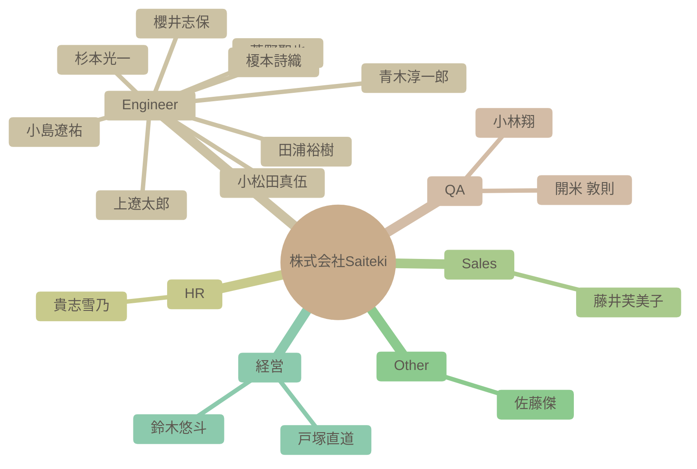

# チーム構成図

自動生成された組織図です。IssueおよびSlack連携による高度なAI分析結果が反映されます。

### 📊 関連リソース
- [🌐 インタラクティブ・ナレッジグラフ (Web版)](https://saitekiinc-com.github.io/saiteki-employee-management/)
- [📝 ナレッジグラフ分析レポート (Markdown)](./KNOWLEDGE_GRAPH.md)

### 組織マップ

```mermaid
%%{init: {'theme': 'base', 'themeVariables': {'primaryColor': '#F2EBE3', 'primaryTextColor': '#5D574F', 'primaryBorderColor': '#D9CFC1', 'lineColor': '#BEB3A5', 'secondaryColor': '#FAF9F6', 'tertiaryColor': '#FDFCFB', 'nodeBorder': '1px'}}}%%
mindmap
  root((株式会社Saiteki))
    Engineer
      杉本光一
      青木淳一郎
      櫻井志保
      田浦裕樹
      上遼太郎
      小松田真伍
      小島遼祐
      菅野聖也
      榎本詩織
    QA
      小林翔
      開米 敦則
    HR
      貴志雪乃
    Sales
      藤井芙美子
    Other
      佐藤傑
    経営
      鈴木悠斗
      戸塚直道
```

## 社員一覧サマリー

| 名前 | 職種 | 性格傾向 (概略) | 現在の状態 |
| --- | --- | --- | --- |
| [杉本光一](#%E6%9D%89%E6%9C%AC%E5%85%89%E4%B8%80) | Engineer | 技術トレンドへの深い洞察力と、それを組織全体へ浸透させる推進力を持つ。自身の働き方と組織貢献を両立させ、常に丁寧かつポジティブなコミュニケーションを心がける。責任感が強く、計画的にタスクを遂行し、周囲の意見を尊重する協調性も兼ね備えている。 | 直近では、AI駆動開発による組織・人材の変化への深い洞察を共有し、AI時代の組織適応をリードしている。自身のワークライフバランス調整のために非同期コミュニケーションへの移行を提案・実行し、組織全体への柔軟な働き方を促している。同時に、社内でのAI活用推進の一環としてSlack情報活用プロジェクトやナレッジベース構築プロジェクトを強力に推進し、具体的な仕組みの提案・設計・運用管理に精力的に取り組んでいる。 |
| [青木淳一郎](#%E9%9D%92%E6%9C%A8%E6%B7%B3%E4%B8%80%E9%83%8E) | Engineer | 協調性が非常に高く、新しい知識や経験に対し前向きに挑戦する。社交的で周囲との交流を深め、高い責任感を持って業務に取り組む楽観的な性格。 | 年末年始を通してSaitekiメンバーとの出会いに深く感謝し、2026年を「飛躍の年」と意気込んでいる。12月上旬には業務負荷が高い様子が伺えたが、それを乗り越え、現在は非常に前向きな精神状態にある。 |
| [小林翔](#%E5%B0%8F%E6%9E%97%E7%BF%94) | QA | 開放性と協調性が特に高く、新しい経験や人との交流を楽しみ、チームワークを重視する傾向がある。責任感も強く、ポジティブな姿勢を保ちながら、自身の経験や関心を積極的に共有し、自己開示を厭わない。詳細への注意と観察力も顕著。 | 入社初期段階であり、非常に前向きで期待に満ちた状態。積極的に自己開示し、様々な趣味や経験を通じて周囲との共通点を見つけることで、良好な人間関係を築こうと行動している。特にプライベートな興味や体験を詳細に共有することで、チームメンバーとの心理的距離を縮めようとしている。 |
| [櫻井志保](#%E6%AB%BB%E4%BA%95%E5%BF%97%E4%BF%9D) | Engineer | 自己認識が高く、協調性があり、学習意欲も高い。新しい環境への適応力も期待でき、謙虚で丁寧な印象を与えます。 | 1月からの入社を控えており、新しい環境に対する高い期待感と意欲に満ち溢れています。自身のスキルを活かしつつ、さらなる専門性向上とチームへの貢献を目指しています。 |
| [田浦裕樹](#%E7%94%B0%E6%B5%A6%E8%A3%95%E6%A8%B9) | Engineer | 非常に協調性が高く、誠実で、周囲への配慮を忘れない。新しい知識や経験への探求心が旺盛で、ユーモアを交えながら積極的に他者と関わる。自身の業務状況を正直に伝え、同僚の活動をサポートするなど、ポジティブな関係構築を重視する。 | 自身のプロジェクト進捗に遅れがあることを正直に報告しつつも、会社のビジョンへの強い共感と責任感を持って業務の立て直しと推進にコミットしている。同僚への配慮と感謝も忘れず、引き続きポジティブな姿勢で業務に取り組んでいる。 |
| [開米 敦則](#%E9%96%8B%E7%B1%B3%20%E6%95%A6%E5%89%87) | QA | 学習意欲が旺盛で新しい技術に積極的。責任感が強く、計画的に業務を進める。協調性があり、丁寧なコミュニケーションを心がける。 | 現在、QAにおけるAI協働作業の概念化と初期段階の成果物作成に取り組んでいる。特にテスト計画フェーズの最適化と汎用テスト観点の修正に注力し、業務プロセスの戦略的な改善を進めている段階。関係者との情報共有と意見交換にも積極的。 |
| [貴志雪乃](#%E8%B2%B4%E5%BF%97%E9%9B%AA%E4%B9%83) | HR | 組織への貢献と周囲への配慮が非常に高く、自ら課題解決に取り組み、周囲を巻き込む力に長けています。新しい知識や経験だけでなく、会社の事業戦略、社員の心身の健康、そして社員間の交流への探求心も旺盛で、感情表現も豊かでバランスが取れています。 | 直近のログ（3月半ば）では、会社の重要な成長戦略（M&A）に関するnoteを精力的に共有し、社員への理解促進に貢献している。常にポジティブで意欲的な姿勢を維持し、社員のウェルビーイング、交流、学習機会、そして会社の成長戦略の理解促進に多岐にわたって貢献し続けている。 |
| [上遼太郎](#%E4%B8%8A%E9%81%BC%E5%A4%AA%E9%83%8E) | Engineer | 新しい知識や経験への関心が深く、自己の成長のために深く物事を理解しようと努めます。責任感が非常に強く、計画的かつ体系的に業務を進めます。周囲への配慮を忘れず、困難な状況でも冷静かつ正直に対応し、協調的な姿勢で仕事に取り組みます。 | SMAR-APPの基本設計・詳細設計ドキュメントを完成させ、自身の理解プロセスを重視しつつ、タスクを計画的に管理し、詳細な進捗を積極的に共有しています。実装フェーズでは一部のタスクについて自身の能力不足を認め、責任を持って他者への依頼を行っており、プロジェクト全体のスムーズな進行に貢献しようとしています。 |
| [小松田真伍](#%E5%B0%8F%E6%9D%BE%E7%94%B0%E7%9C%9F%E4%BC%8D) | Engineer | 新しい技術や知識の習得、改善提案に極めて積極的で、それを組織に還元しようとする意識が非常に高い。周囲とのコミュニケーションを円滑に行い、場を和ませる能力も持つ。自身の経験に基づいた問題意識を持ち、解決のための行動を厭わない。特に、社会や組織全体、そしてチームメンバーをより良くしようとする貢献意欲が顕著であり、活動的でチームを鼓舞する傾向がさらに強まっている。 | AI駆動ナレッジマネジメントシステムの開発とアーキテクチャ設計に深く携わっており、ナレッジグラフ形式の入力項目調整、自動化されたライフサイクル管理、そして検索機能のプロトタイピングに精力的に取り組んでいる。複数のプルリクエストを迅速に作成し、技術的な選択肢を詳細に比較検討しながら、スケーラブルでユーザーフレンドリーなシステムの実現に向けて具体的な行動を重ねている。 |
| [小島遼祐](#%E5%B0%8F%E5%B3%B6%E9%81%BC%E7%A5%90) | Engineer | 新しい知識や経験に対する強い好奇心と探求心を持ち、周囲の意見を尊重し、積極的に関係を深めようとする。責任感も強く、常に前向きな姿勢を保ち、人とのつながりを重視する。新しい挑戦には多少の不安を感じるものの、それをきっかけに他者とのコミュニケーションを深め、乗り越えようとする。 | 新しい職場環境への適応に非常に意欲的で、持ち前の社交性と学習意欲を最大限に活かし、周囲との良好な関係を積極的に築いている。具体的な営業業務においても、担当者との連携を楽しみながら前向きに取り組んでいる様子が伺える。新しい経験への興味も尽きず、情報収集に余念がない。 |
| [藤井芙美子](#%E8%97%A4%E4%BA%95%E8%8A%99%E7%BE%8E%E5%AD%90) | Sales | 非常に社交的で共感力が高く、新しい同僚に対しても積極的に歩み寄る姿勢を見せる。責任感が強く、事務処理の正確性と円滑な運用に細心の注意を払う一方で、ユーモアを交えた自己開示で周囲との距離を縮める。 | 総務として、社労士連携のための情報共有フォルダの運用、経費精算ルール（補助金上限）の明確化、月次報告のリマインドといった重要な事務業務を遂行している。その一方で、新しい同僚の歓迎や、個人の趣味に関する話題（植物、野球）、子どもの卒園祝いなど、社内の人間関係構築にも積極的に関与し、多忙ながらも充実した日々を送っている。 |
| [菅野聖也](#%E8%8F%85%E9%87%8E%E8%81%96%E4%B9%9F) | Engineer | 新しい技術や知識の吸収に意欲的で、協調性と社交性を持ち合わせる。自身の強みをユーモアを交えて表現し、感情も安定している。 | 入社直後で、開発者としての復帰とチームとの協働に非常に前向きである。AI技術への関心は非常に高く、読書を通じて多様な知識を吸収し、それを業務やコミュニケーションに活かそうとしている。人との交流も積極的に楽しみ、新しい環境での活躍を強く望んでいる。 |
| [佐藤傑](#%E4%BD%90%E8%97%A4%E5%82%91) | Other | 非常に開放的で誠実、外向的で協調性も高い。常に前向きで、新しい挑戦や学びを楽しみ、実践と情報共有を通じて貢献しようとする探求心と行動力を兼ね備えている。 | 海外での活動を継続しており、現在はUAEに滞在し、その後ASEAN中台韓を巡り、来年には帰国予定。国際的なチーム開発やハッカソンに積極的に参加し、最新のAI技術（特に小型高性能AIモデルのMac環境での実用性）に高い関心を持ち、M4 MaxでのGPTsossの動作を検証・共有するなど、その情報共有を通じて実践的な活用を模索している。質問歓迎の姿勢で、コミュニティへの貢献も意識している。 |
| [鈴木悠斗](#%E9%88%B4%E6%9C%A8%E6%82%A0%E6%96%97) | 経営 | 社交的で協調性が高く、責任感と向上心を併せ持つ。私生活での困難な状況でもユーモアを忘れず、周囲を巻き込むポジティブなエネルギーがある。家族を深く愛し、その出来事を共有することで親近感を深める。 | 直近では長男の卒園や次男の看病といった家族のイベント・状況と業務が重なりつつも、全体的にはポジティブな姿勢を保っている。新しいメンバーとの交流や同僚への気遣い、業務連絡への対応を通じて、チームへの貢献意欲と責任感を示している。 |
| [戸塚直道](#%E6%88%B8%E5%A1%9A%E7%9B%B4%E9%81%93) | 経営 | 非常に外向的で協調性が高く、誠実かつ開放的な人物。組織の戦略的成長とメンバーの成功に深くコミットし、困難な状況にも持ち前の分析力と前向きさで対処する。特にM&A戦略、AI、顧客志向の組織開発に対する深い洞察と、それを自身の事業に落とし込む粘り強さが顕著。 | M&A戦略の着実な推進と、AIを活用した受託開発の戦略的転換に注力し、組織の質的向上と事業拡大を同時に図っている。毎週の「Letter of T」で詳細な情報を共有し、活発なコミュニケーションを通じてメンバーを巻き込みながら、変革期を力強くリードしている。 |
| [榎本詩織](#%E6%A6%8E%E6%9C%AC%E8%A9%A9%E7%B9%94) | Engineer | 非常に開放的で協調性があり、新しい知識や経験を積極的に取り入れようとする。親しみやすく、ユーモアのセンスも持ち合わせながら、自己を客観視できるバランスの取れた性格。 | 6月～7月の入社を間近に控え、期待と意欲に満ち溢れている。積極的にコミュニケーションを取り、周囲との関係構築に努めており、社内での新しい経験と学習を楽しみにしている。 |

---

## 詳細プロフィール

各社員の詳細な分析結果です。クリックして展開できます。

### 杉本光一 (Engineer)

> **総合サマリー**: AI技術の探求と実践に加え、AI時代の組織変革と個人の柔軟な働き方をリードする技術リーダー。組織全体の生産性向上と自律的な課題解決を促す協調性と実行力に優れた人物。

<b>🛠 性格傾向</b>

**要約**: 技術トレンドへの深い洞察力と、それを組織全体へ浸透させる推進力を持つ。自身の働き方と組織貢献を両立させ、常に丁寧かつポジティブなコミュニケーションを心がける。責任感が強く、計画的にタスクを遂行し、周囲の意見を尊重する協調性も兼ね備えている。

| 項目 | スコア | 根拠・エピソード |
| --- | --- | --- |
| 開放性 | 9/10 | AI駆動開発による働き方の変化や、AIと法といった未来を見据えた話題を積極的に共有する。ナレッジベースの構築において、Slack情報を活用したチームビルディングやPJアサインの可能性を動画で提示したり、Neo4jのようなグラフデータベースの適用を検討するなど、新しい技術やアイデアを柔軟に取り入れ、その応用可能性を探求する。 |
| 誠実性 | 9/10 | 子供の保育所入園に伴う働き方の変更に際し、単なるMTG中止ではなく、Notionを活用した1on1ページやテンプレート、チェックポイントを具体的に設定し、コミュニケーションの継続性を担保する。プロジェクトの進捗をこまめに確認し、必要に応じてリマインドや詳細な指示、具体的な資料提示を行うなど、責任感と計画性を持ってタスクとチームの管理を行う。 |
| 外向性 | 9/10 | AI活用プロジェクトの現状や、AI駆動開発による組織の変化に関する自身の見解を動画やメッセージで積極的に共有する。初対面の同僚には笑顔で自己紹介し、同僚のライフイベントを祝福するなど、オープンで親しみやすいコミュニケーションを心がける。 |
| 協調性 | 9/10 | 自身の提案が承認された際に喜びを表現し、MTG変更の提案時には相手の意見や懸念を求め、具体的な代替案を提示する。同僚の努力や成果に感謝を伝え、遅い時間の対応にも労いと感謝を示すなど、他者への配慮と尊重が見られる。不明点があればいつでも聞くよう促すなど、サポートする姿勢も持ち合わせる。 |
| 神経症的傾向 | 3/10 | ワークライフバランスの変化に伴う働き方の調整を、感情的ではなく具体的な解決策と丁寧な説明を伴って提示し、周囲の理解を求める。業務の進捗確認やリマインドも、常に穏やかで建設的な口調で行うなど、精神的な安定性と落ち着きを保って対応する。 |

<b>💪 仕事スタイルと強み</b>

**要約**: AI技術への深い知見と戦略的思考で、組織内の課題解決だけでなく、自身のワークライフバランスと組織貢献を両立させるための柔軟な働き方を実践する。AI時代の組織変革、情報共有とナレッジマネジメントの仕組み化を強力に推進し、実行力、迅速な問題解決能力、そして技術選定における実用性・コスト意識を兼ね備えたリーダー。

**問題解決スタイル**: AI駆動開発による組織や人材の変化を予見し、自律的な課題解決を促すメッセージを発信する。組織内のナレッジ共有やコミュニケーションの課題に対し、Slack情報の有効活用やNotionを活用した非同期コミュニケーションの仕組みなど、具体的なソリューションを自ら提案・構築する。技術的な問題に対しては、Neo4jのような代替案を提示し、そのメリットを多角的に説明することで最適な解決策を模索する。

**主要な強み**: AI技術の深い知見と実践的な応用力, AI時代における組織・人材戦略への深い洞察, 情報共有とナレッジマネジメントの推進と仕組み化, 実行力と迅速な問題解決能力, 丁寧で建設的なコミュニケーションとチームガイダンス, ワークライフバランスを考慮した柔軟な働き方の提案と実践, 戦略的かつ実用的な技術選定能力

**証拠エピソード**:
- AI駆動開発の現状と、それに伴い求められるエンジニアの役割変化（自律的な課題発見・解決）について、現場からの知見として積極的に共有した。
- 子供の保育所入園に伴う生活リズムの変化に合わせ、20時からの定例MTGを一旦取りやめ、Notionを活用した非同期1on1の仕組みを提案し、具体的なページと運用ルール（チェックポイント、週間ログ）を設定した。
- 社内でのAI活用推進の一環として、Slack情報の有効活用を目的としたプロジェクトについて、NotebookLMで動画を作成し、PJアサインやチームビルディングへの応用可能性を提示した。
- AI活用に関するドキュメントの運用方法を動画で作成し、チーム全体の知識共有・蓄積を促し、AIによる活用機会損失をなくす目的を明確に伝えた。
- 「AIと法 実務大全」という書籍を紹介し、AI生成が前提となる開発においてエンジニアも法的観点を持つ必要性を提言するなど、未来を見据えた学習と情報共有の重要性を説いた。
- ナレッジベースの構造化において、具体的なカテゴリ例（AI技術、開発実践知、導入実績など）と、RAGを活用した情報検索の具体的なユースケース（Cursorの活用事例）を提示し、ナレッジの有効活用を促す設計を行った。
- ナレッジ検索の効率化とデータ構造の柔軟性を考慮し、JSONだけでなくNeo4jのようなグラフデータベースの活用可能性にも言及し、そのメリット（エッジの意味付け、クエリの扱いやすさ）を具体的に説明した。
- チームメンバーのプロジェクト進捗（詳細設計、基本設計）をNotionやSlackでこまめに確認し、期日のリマインドや、具体的な実装資料の共有、不明点があればいつでも相談に乗る姿勢を示すことで、プロジェクトの円滑な進行を支援した。

<b>💎 価値観とモチベーター</b>

**要約**: 最新AI技術への深い探求心と、それが組織やチームの具体的な課題解決に繋がり、さらに組織全体の文化や働き方を変革することに大きな喜びを見出す。自身のワークライフバランスを重視しつつも、組織への貢献意欲が高く、自ら手を動かして新しい仕組みを構築し、その効果を最大化することに情熱を燃やす。特に、AI時代における自律的な行動と役割の拡張を重視する。

**コアバリュー**: 技術革新と探求 (特にAIと知識グラフ、ベクトル検索、AI駆動開発), 組織・チームへの貢献 (ナレッジ共有、業務効率化、コミュニケーション改善), 自律的な行動と役割の拡張, AI時代における組織の適応と成長, 未来を見据えた継続的な学習と洞察 (特にAIと法), 実践を通じた技術検証と実装, オープンな情報共有と透明性, ワークライフバランスの重視と、それによる持続可能な貢献

**モチベーショントリガー**: AI技術が組織の文化や働き方を良い方向に変革すること, 自身のアイデアや知見を活かして具体的な仕組みを構築し、その効果を実感すること, チームのナレッジ蓄積や情報活用の効率化に貢献すること, メンバーが自律的に課題を見つけ解決する組織風土を醸成すること, 技術的な問題を迅速に解決し、システムを安定稼働させること, 新たな技術や社会の変化に関する知識を深く学び、それを周囲と共有すること, チームや組織の生産性が向上すること

**証拠エピソード**:
- AI駆動開発の現場での知見を共有し、受動的な働き方から能動的な役割拡張へと組織文化が変化する必要性を訴えることで、組織の適応と成長への強い意識を示した。
- AIと法の専門書を推奨することで、エンジニアが技術だけでなく、社会や法律といった多角的な視点を持つことの重要性を強調し、未来を見据えた学習への価値観を示した。
- ナレッジベースのカテゴリ分けやRAGの具体的な利用例を提示することで、AIを活用した情報共有が組織の課題解決と成長に直結するとの信念を示し、その実現に尽力している。
- 自身のライフイベントに合わせ、既存の定例を非同期コミュニケーションに移行し、そのための具体的な仕組みを提案・構築することで、柔軟な働き方と組織貢献の両立を自ら実践し、その重要性を組織に提示した。
- Slack情報活用プロジェクトの目的を、PJアサインやチームビルディングに繋げることと明確にすることで、技術が組織全体の最適化に貢献することへのモチベーションを示した。

<b>📈 現在の状態</b>

**要約**: 直近では、AI駆動開発による組織・人材の変化への深い洞察を共有し、AI時代の組織適応をリードしている。自身のワークライフバランス調整のために非同期コミュニケーションへの移行を提案・実行し、組織全体への柔軟な働き方を促している。同時に、社内でのAI活用推進の一環としてSlack情報活用プロジェクトやナレッジベース構築プロジェクトを強力に推進し、具体的な仕組みの提案・設計・運用管理に精力的に取り組んでいる。

- **感情レベル**: positive
- **業務負荷状況**: 自身のライフイベントに伴う働き方の調整を積極的に行いつつも、AI技術の探求、組織変革への提言、ナレッジベースの構築、チームメンバーのタスク管理と指導といった複数のプロジェクトを精力的に推進しており、高い負荷がかかっている様子が伺える。しかし、その中でも前向きかつ計画的にタスクを推進し、周囲への配慮も怠らない。
- **最近の関心トピック**: AI駆動開発と、それに伴うエンジニアの役割の変化, AIと法務に関する知見の習得, Slack情報活用によるPJアサイン・チームビルディング, Notionを活用した非同期1on1の仕組み化と運用, ナレッジベースのカテゴリ設計とRAGを活用した具体的な情報検索の仕組み, Neo4jなどのグラフデータベースを活用した検索ソリューションの検討, AI活用に関するドキュメントの運用とチームの知識共有促進

---

### 青木淳一郎 (Engineer)

> **総合サマリー**: AWS基盤の専門性を持ち、未経験技術の習得にも意欲的。福岡在住で家族を大切にし、高い責任感と協調性でSaitekiへの貢献とメンバーとの交流を積極的に図る人物。

<b>🛠 性格傾向</b>

**要約**: 協調性が非常に高く、新しい知識や経験に対し前向きに挑戦する。社交的で周囲との交流を深め、高い責任感を持って業務に取り組む楽観的な性格。

| 項目 | スコア | 根拠・エピソード |
| --- | --- | --- |
| 開放性 | 8/10 | AWS基盤の経験がある中で、AzureやGoogle Cloud、AIといったクラウド技術への強い関心を示す。未経験のBIツールに苦戦しながらも、それをスキルの幅を広げるチャンスと捉え、前向きに知識と経験の習得に努めている。 |
| 誠実性 | 7/10 | 業務の納期を最優先し、興味のある社内イベントであっても納品が近いことを理由に参加を見送る判断をするなど、強い責任感を持つ。未経験のBIツールでの苦労も、粘り強く習得に努める機会と捉えている。 |
| 外向性 | 8/10 | 入社時に詳細な自己紹介を行い、共通の趣味（Youtube、パパ）を持つメンバーには積極的に交流を呼びかけ「パパ会」を提案。地域を越えた「西日本勢」の盛り上げにも意欲を見せるなど、社内でのコミュニケーションや親睦を重視する姿勢が強い。 |
| 協調性 | 9/10 | メンバーの投稿に対し共感や感謝を積極的に示し、共通点を見つけて親睦を深めようとする。他者のnoteを読み感動を伝えるなど、周囲の人々の気持ちや経験を尊重し、良好な関係性を築くことに非常に長けている。 |
| 神経症的傾向 | 3/10 | ネガティブな感情の表出は非常に少なく、近所のサル出没に驚きと恐怖を感じたという発言程度。未経験のBIツールでの苦戦や多忙な業務状況下でも、常に前向きな姿勢を保ち、状況を好転させる機会と捉える傾向がある。 |

<b>💪 仕事スタイルと強み</b>

**要約**: AWS基盤のインフラ設計・構築に高い専門性を持ちつつ、未経験技術への学習意欲が極めて高い。責任感が強く、チームワークと自己成長を重視して業務に取り組む。

**問題解決スタイル**: 未経験の技術や困難に直面しても、それをスキルアップの好機と捉え、前向きな姿勢で学びと経験を積み重ね、解決策を模索する。

**主要な強み**: インフラ設計・構築スキル, 学習意欲, コミュニケーション能力, 責任感

**証拠エピソード**:
- 入社時の自己紹介でAWS基盤のインフラ設計・構築に携わってきたことを明確に述べている。
- Azure、Google Cloud、AIへの関心や、未経験のBIツール（QuickSuite）に苦戦しつつも「スキルの幅を広げるチャンス」と捉え積極的に取り組む姿勢を見せている。
- 興味のある社内イベントであっても、納品が近いことを理由に不参加を表明し、業務を最優先する強い責任感を見せている。
- 「Saitekiの輪をどんどん広げていけたら」と発言し、オンラインでの積極的なコミュニケーションや「パパ会」の提案を通じてメンバーとの関係構築に努めている。

<b>💎 価値観とモチベーター</b>

**要約**: 家族との時間を大切にし、仕事では新しい技術の習得と自己成長を追求。組織への貢献意欲とSaitekiの一員であることへの誇り、メンバーとの交流を非常に重視している。

**コアバリュー**: 家族, 成長, 貢献, 責任

**モチベーショントリガー**: 新しい技術の習得, チームへの貢献, 自己成長, 人との交流

**証拠エピソード**:
- 自己紹介で「家族とドライブに行ったり、子どもと遊んだり、妻をガチャガチャ屋さんに連れて行ったり」と休日の過ごし方を共有し、家族との時間を大切にしている様子が伺える。
- AWS以外のAzure、Google Cloud、AIといった技術への学習意欲や、未経験のBIツールでの苦戦も「スキルの幅を広げるチャンス」と捉え、知識と経験を得ることに意欲的である。
- 入社時に「Saitekiの輪をどんどん広げていけたら」と組織への貢献意欲を示し、年末には2025年を「最高の年」と振り返り、2026年を「さらに飛躍の年にしていきましょう！」と語るなど、強い責任感と組織への帰属意識が見られる。
- オンラインでのコミュニケーションを重視し、「パパ会」や「西日本勢盛り上げていきましょー」とメンバー間の交流を積極的に促進しようとしている。
- 他者のnoteを読んで「グッときました！」と感動を伝え、メンバーの入社経緯への関心を示している。

<b>📈 現在の状態</b>

**要約**: 年末年始を通してSaitekiメンバーとの出会いに深く感謝し、2026年を「飛躍の年」と意気込んでいる。12月上旬には業務負荷が高い様子が伺えたが、それを乗り越え、現在は非常に前向きな精神状態にある。

- **感情レベル**: positive
- **業務負荷状況**: 12月上旬には納品が近く、帰りが遅くなるほどの業務負荷があったが、それを乗り越え、年末年始は達成感と来年への意欲を見せている。
- **最近の関心トピック**: Saitekiメンバーの入社経緯, 京都旅行, 2025年の振り返りと2026年への期待, BIツールの知識習得

---

### 小林翔 (QA)

> **総合サマリー**: 協調性が高く、新しい環境への適応力に優れる人物。多岐にわたる趣味と経験を詳細かつ情熱的に共有することで、周囲との関係を深め、共に成長することを重視する。社交的な交流を楽しみ、自ら情報を発信することで場を活性化させる。

<b>🛠 性格傾向</b>

**要約**: 開放性と協調性が特に高く、新しい経験や人との交流を楽しみ、チームワークを重視する傾向がある。責任感も強く、ポジティブな姿勢を保ちながら、自身の経験や関心を積極的に共有し、自己開示を厭わない。詳細への注意と観察力も顕著。

| 項目 | スコア | 根拠・エピソード |
| --- | --- | --- |
| 開放性 | 9/10 | 出張先や趣味の旅行で知った美味しい飲食店（京都のうどん、沼津の餃子）を詳細に紹介し、地域特有の文化や食への深い興味と探求心を示す。自身の声が入ったライブ動画を共有するなど、アニメやアイドルといったポップカルチャーへの関心も非常に高く、多様な趣味を持つ。沼津の餃子の製法について言及するなど、物事の本質や背景にも関心を持つ。 |
| 誠実性 | 8/10 | 紹介する飲食店の情報（つゆのタイプ、麺の食感、天ぷらのサクサク感、餃子の製法、行列状況）が非常に詳細で具体的であることから、物事を注意深く観察し、記憶・整理する能力が高いことがうかがえる。自身のライブ体験の細部まで覚えている点も同様である。出張中に特定のうどん屋を何度もリピートするなど、気に入ったものには繰り返し関わる几帳面さも見られる。 |
| 外向性 | 9/10 | 飲み会後に自身の趣味に関する情報や動画を積極的に共有し、交流を深めようとする姿勢が明確に見られる。社交的なイベントへの参加に「わくわく」と絵文字を添えて意欲を示し、自身のライブでのエピソードをユーモアを交えて語るなど、自己開示を積極的に行うことで周囲との関係性を構築しようとする。参加後のお礼と情報提供も積極的な交流を示す。 |
| 協調性 | 9/10 | 飲み会後の感謝の言葉や、美味しいお店の情報を共有する行為自体が、周囲への配慮と貢献意識の表れである。自身の動画を共有する際に「何万分の一ですが…」と謙遜する姿勢や、ライブの思い出を共有することで親しみやすさを醸し出すなど、友好的で協調的なコミュニケーションを心がけている。 |
| 神経症的傾向 | 3/10 | 自身の声が入った動画の共有に際しても、ユーモラスな表現を使い、ライブでの失敗談を明るく語るなど、ポジティブな自己開示が見られる。ストレスや不安を感じやすい様子はなく、社交的な場面を心から楽しんでいる。 |

<b>💪 仕事スタイルと強み</b>

**要約**: 長年の経験に裏打ちされた細部への注意と、高いコミュニケーション能力が強み。新しい情報や知識の吸収にも積極的で、協調性を持ちながら業務に取り組む。状況把握と情報共有に長け、自身の経験を活かした具体的な提案も期待できる。

**問題解決スタイル**: 13年間のテスター経験を通じて培われた、細部に目を配り潜在的な問題点を見つけ出す能力を持つ。自身の経験や知識を活用し、論理的に課題を整理する傾向がある。具体的な情報収集と提供の側面が強化され、事実に基づいた提案を行う。

**主要な強み**: テスト・品質管理経験, コミュニケーション能力, 情報収集力, 情報提供力, 状況説明能力, 協調性, 詳細観察力

**証拠エピソード**:
- 飲み会後に、参加者へのお礼と共に、自身の趣味の動画と具体的なグルメ情報を詳細に共有する。
- 出張先や旅行で訪れた飲食店の特徴（麺の食感、天ぷらの状態、餃子の製法、行列状況）を細かく記憶し、他者に分かりやすく伝える。
- 社交的なイベントへの参加に強い意欲と喜びを示し、積極的に交流の機会を設ける。

<b>💎 価値観とモチベーター</b>

**要約**: 成長、繋がり、楽しさ、探求、そして経験を重視する。新しい知識やスキルの習得、他人との良好な関係構築、充実した楽しい経験、そして自身の情熱を共有することがモチベーションの源泉となる。

**コアバリュー**: 成長, 協調, 楽しさ, 探求, 繋がり, 経験の共有

**モチベーショントリガー**: 新しい知識やスキルの習得, チームへの貢献と協業, 楽しい経験や趣味の追求, 共通の興味を持つ人々との交流, 興味を持ったことの詳細な情報共有, 自己開示を通じた人間関係の深化

**証拠エピソード**:
- 飲み会の後に、自らの趣味や出張先での発見を詳細に共有することで、仲間との繋がりを深めようとする。
- 旅行や出張先での新しい発見（美味しいお店や地域文化）を積極的に楽しみ、それを他者と共有することに喜びを感じている。
- 社交的なイベントへの参加に「わくわく」と感情を表現し、楽しい経験を重視する姿勢が見られる。

<b>📈 現在の状態</b>

**要約**: 入社初期段階であり、非常に前向きで期待に満ちた状態。積極的に自己開示し、様々な趣味や経験を通じて周囲との共通点を見つけることで、良好な人間関係を築こうと行動している。特にプライベートな興味や体験を詳細に共有することで、チームメンバーとの心理的距離を縮めようとしている。

- **感情レベル**: positive
- **業務負荷状況**: 業務外の交流を活発に行っている段階であり、業務負荷はまだ限定的または、業務とプライベートのバランスをうまく取っている状況。
- **最近の関心トピック**: 美味しいグルメ（京都のうどん、沼津の地域特産餃子など）, 旅行・出張での体験と詳細な情報共有, アニメ・アイドルライブ（特にラブライブ!関連の思い出話）, 社交的なイベントへの参加と交流, 自身の趣味や経験を詳細に共有すること

---

### 櫻井志保 (Engineer)

> **総合サマリー**: 櫻井志保さんは、データ分析スキルと高い学習意欲を持ち、協調性をもってチームに貢献しようと意欲的な人物です。

<b>🛠 性格傾向</b>

**要約**: 自己認識が高く、協調性があり、学習意欲も高い。新しい環境への適応力も期待でき、謙虚で丁寧な印象を与えます。

| 項目 | スコア | 根拠・エピソード |
| --- | --- | --- |
| 開放性 | 8/10 | Power BIを用いたデータ分析・加工の経験があり、資格取得を目指しデータベース構築といったより専門的な分野への挑戦意欲を明確に示しています。 |
| 誠実性 | 7/10 | 自己紹介で自身の業務経験、スキル、今後の展望を詳細かつ明確に記述しており、責任感と計画性が伺えます。趣味を通じて業務のリフレッシュを図る自己管理能力も持ち合わせています。 |
| 外向性 | 6/10 | 「Slack等を通じて積極的にコミュニケーションを取っていければ」と、自ら進んで他者との交流を求める姿勢が見られます。ただし、直接会う機会が少ないことへの言及もあり、バランスの取れた交流を好むと推測されます。 |
| 協調性 | 9/10 | 「今後ともよろしくお願いいたします」「まだまだ至らない点も多いかと思いますが、何卒よろしくお願いいたします」といった謙虚で丁寧な言葉遣いから、協調性や相手への配慮が強く感じられます。 |
| 神経症的傾向 | 3/10 | 自己紹介の内容全体から、新しい環境への期待感と前向きな姿勢が感じられ、不安や心配を示唆する要素は見当たりません。 |

<b>💪 仕事スタイルと強み</b>

**要約**: データに基づいた分析力と高い学習意欲を持ち、自ら専門性を深めようと努力します。チームでのコミュニケーションを重視し、協調的に仕事を進めるタイプです。

**問題解決スタイル**: データ分析スキルを活かし、論理的な思考で現状を把握し問題解決に取り組むアプローチを取ります。

**主要な強み**: データ分析, 学習意欲, コミュニケーション

**証拠エピソード**:
- Power BIを用いたデータ分析・加工の経験があると述べています。
- 資格取得を目指し、データベース構築などより専門的な分野への挑戦を考えていると表明しています。
- Slack等を通じて積極的にコミュニケーションを取りたいと意欲を示しています。

<b>💎 価値観とモチベーター</b>

**要約**: 自身の成長と専門性向上を重視し、新しい知識やスキルを習得することに喜びを感じる人物です。チームワークを大切にし、周囲との良好な関係を築きながら貢献することにモチベーションを感じます。

**コアバリュー**: 成長, 貢献, 協調性, 専門性

**モチベーショントリガー**: 新しい知識やスキルの習得, 専門性の向上, チームへの貢献, 自己管理を通じたパフォーマンス維持

**証拠エピソード**:
- 資格取得やデータベース構築といった専門分野への挑戦意欲を表明しています。
- Slack等を通じて積極的にコミュニケーションを取りたいと述べています。
- 趣味をリフレッシュに活用し、業務パフォーマンス維持に努めていることを示唆しています。

<b>📈 現在の状態</b>

**要約**: 1月からの入社を控えており、新しい環境に対する高い期待感と意欲に満ち溢れています。自身のスキルを活かしつつ、さらなる専門性向上とチームへの貢献を目指しています。

- **感情レベル**: positive
- **業務負荷状況**: 新規入社予定のため、現在の業務負荷は不明ですが、趣味をリフレッシュに活用していることから自己管理ができていると推測されます。
- **最近の関心トピック**: データ分析, データベース構築, 資格取得, Slackを通じたコミュニケーション

---

### 田浦裕樹 (Engineer)

> **総合サマリー**: Saitekiのビジョンと顧客への貢献に深く共感し、困難な状況でも諦めずに解決策を模索する強い推進力を持つ。自身の進捗を正直に開示しつつ責任感を持って業務に取り組み、同僚への感謝と配慮を忘れない誠実で協調性の高い人物。

<b>🛠 性格傾向</b>

**要約**: 非常に協調性が高く、誠実で、周囲への配慮を忘れない。新しい知識や経験への探求心が旺盛で、ユーモアを交えながら積極的に他者と関わる。自身の業務状況を正直に伝え、同僚の活動をサポートするなど、ポジティブな関係構築を重視する。

| 項目 | スコア | 根拠・エピソード |
| --- | --- | --- |
| 開放性 | 10/10 | AI技術の学習に深くコミットし、自身でRAG構築を目標に高性能PCを導入。ゴッホ展を深く鑑賞し、原田マハの関連書籍を即座に購入するなど芸術への知的好奇心が非常に高い。長年の憧れだったチェロを始め、羊文学のライブには毎年参戦するほどの情熱を持つ。日本酒、ビール、ワインを好み、特に黒龍、作、酔鯨、浜福鶴といった銘柄を挙げる。ロイズの生チョコとアイラウイスキーの組み合わせを絶賛するなど、グルメへの探求心とこだわりも深い。新しいメンバーには自身の好きなお酒の銘柄を具体的に挙げて共有している。また、広木大地氏の言葉を引用し、自身の哲学を共有するとともに、プレゼンや資料が仮説に基づいて設計されており、その検証のためのフィードバックを重視する点で、知的好奇心と分析的な思考の深さが伺える。「ホントにワクワクします」とSaitekiの目指す独自のポジションに強い期待と探求心を示す。社長の「正しい提案でも顧客が求めていないなら変える」という方針を会社としての考え方として高く評価する。 |
| 誠実性 | 9/10 | PoCの立ち上げフェーズでタスク分解、優先順位付け、計画策定を詳細に行い、進捗を具体的なポイントと共に共有する。AI駆動開発の標準化に向けたワークフローやガイドライン作成にも継続的に取り組む。家庭の事情（子供のインフルエンザ罹患や荒天による急遽テレワーク）が生じた際も、業務への影響を考慮し速やかに連絡を行い、柔軟に対応するなど、責任感と計画性が非常に高い。顧客に「自信を持って即答」するためには徹底した準備が必要であると認識し、実践する。自身の進捗がないことを正直に報告し、会議のスキップを提案するなど、責任感と効率性を重視する。プロジェクトの遅延を認めつつも、時間をやりくりして対応する意思を示す。資料やプレゼンは仮説を持って設計し、フィードバックを通じて検証することで、より良いものを提供しようと努める。他のコミットメントに対しては、時間を割くことが難しい状況を正直かつ明確に伝えるなど、自身の業務状況やキャパシティ管理を適切に行い、関係者への配慮を欠かさない。自身の進捗が遅れていることを正直に報告しつつも、「なんとか時間をやりくりしたいと思います」と責任感を持って業務完遂への意欲を示す。「まだ試合終了してません」と困難な状況でも諦めずに解決策を探求する姿勢。 |
| 外向性 | 8/10 | 新メンバーには積極的に自己紹介し、自身のプライベートな情報（出身地、家族、趣味、グルメ情報、PC購入の経緯）をオープンに共有することで親近感を醸成する。絵文字を非常に多用し、勉強会では活発に発言や改善提案を行うなど、他者との交流を積極的に楽しむ。戸塚氏とのライブ参加を積極的に提案する他、社内レターや商談共有にも感謝を伝え、積極的にコメントを残すなど、関係構築にも意欲的。新しい同僚にお酒の好みや関西在住であることを共有し、共通点を探すことで距離を縮めようとする。グルメに関する話題でも、ユーモアを交えながら活発にコミュニケーションを取り、他者にも試すよう勧める。感謝や喜びの感情を豊富な絵文字とともに頻繁に表現し、他者の発言に対して「めちゃくちゃ嬉しい」と素直に伝えることで、周囲とのポジティブな関係構築を重視する。同僚が参加するマラソンイベントに対して、積極的に応援メッセージを送り、共感とサポートを示す。感謝や意欲を豊富な絵文字（感嘆符、お辞儀、顔文字など）を用いて表現し、感情を豊かに伝える。同僚の努力に感謝を述べるなど、積極的にポジティブな交流を図る。 |
| 協調性 | 9/10 | 他者の意見を尊重し、感謝の意を頻繁に伝える。「素晴らしいレターをありがとうございました」「そう言って頂けてめっちゃ嬉しいです」「シェアありがとうございます」「お心遣いありがとうございます」「めちゃくちゃ嬉しいコメントありがとうございます」といった感謝の言葉が多い。荒天時のメンバーの安否を気遣い、周囲への配慮や思いやりが非常に強い。顧客を安心させることを商談の最優先事項と捉え、具体的なヒアリングで実践する。勉強会へのフィードバックも、リモート参加者への配慮を含め建設的に行う。家庭と仕事の両立に奮闘する同僚に深い感謝と労いの言葉をかけ、その努力を認識する。自身の進捗が芳しくない中でも、他の参加者の時間を尊重し、会議の開催について配慮を示す。チームメンバーへの協力を惜しまない姿勢を示す。同僚の体調を気遣う言葉をかけ、自身の経験から顧客への「安心と信頼」提供の重要性を語り、後輩には「普段の業務の中で何度も繰り返しやると、うまくなりますよ」と具体的にアドバイスする。他者の意見やフィードバックに対して「めちゃくちゃ嬉しい」と素直に感謝の意を表明し、後輩に対しては「普段の業務の中で何度も繰り返しやると、うまくなりますよ」と具体的に育成的なアドバイスを送る。同僚が参加するマラソンイベントに対し、積極的にエールを送ることで、チームへの帰属意識とサポート精神を発揮する。また、自身の時間的制約についても、相手に配慮しつつ正直に伝えることができる。「素晴らしいLetterをありがとうございました」と感謝を伝え、リーダーシップの判断とメッセージを尊重する。同僚が家庭と仕事を両立しながらプロジェクトを推進していることに対し、深く感謝し労いの言葉をかける。 |
| 神経症的傾向 | 3/10 | 子供の体調不良（インフルエンザ）や急なテレワークにも冷静かつ柔軟に対応し、業務を調整する。週例MTGへの参加可否も状況を考慮しつつ事前に連絡するなど、精神的な安定性とストレス耐性が高く、業務への影響を最小限に抑えようと努める。荒天でバスが運休し急遽テレワークになった際も、焦りを見せず業務に対応している。突然の予定変更（夕食準備の時間がない、21時で早退）に対しても冷静に対応し、状況を関係者に速やかに連絡できる。自身のプロジェクト進捗が滞っていることを冷静かつ率直に報告し、状況を過度に悲観せず、前向きに対応策を検討する姿勢を見せる。定例の廃止といった変化にも落ち着いて対応する。他のタスクへのコミットが難しい状況であっても、感情的にならず、客観的に現状を伝えることができる。定例の廃止を冷静に受け入れ、自身の業務進捗の遅れを認めつつも、その解決策として「なんとか時間をやりくりしたい」と前向きな姿勢を示す。 |

<b>💪 仕事スタイルと強み</b>

**要約**: AI技術を核とした開発プロセスの深い知見を持ち、アジャイルの本質であるリスクコントロールを重視する。Saitekiの独自の顧客貢献ビジョンに深く共感し、困難な状況でも諦めずに解決策を模索する強い推進力と責任感を持って業務に取り組む。自身の進捗を正直に開示し周囲への配慮を怠らず、効率的な業務遂行を心がける。

**問題解決スタイル**: PoCにおいては、最初に全てを決め切らず、仮説を立て、クライアントとの密なすり合わせを通じて要件や計画を段階的にアップデートしていくアジャイルなアプローチを重視する。アジャイルの真髄を「不確実性を分解し、リスクをコントロール可能な形に変えていくこと」と定義し、これを商談やエンジニアリングの本質と捉えている。レクター代表の広木大地氏の「エンジニアリングの本質は、曖昧で分からない状態から、具体的ではっきりとした状態に変えていく行為だ」という思想に共感し、これを商談にも適用する。表面的な「速く作る」「ドキュメントを書かない」アジャイルを批判しつつも、リスクを限定できる場合は設計を固めず実装に入る柔軟な姿勢も持つ。問題解決に際しては、AIを積極的に活用し、自身の経験と組み合わせることで具体的なワークフローやガイドラインの標準化を目指す。商談においては「お客様を安心させる」ことを最優先事項と捉え、的確なヒアリングで目的を明確にし、そのために「自信を持って即答」できるだけの徹底した準備を重視する。自身のプレゼンや資料も「仮説を持って設計」し、フィードバックを通じて仮説検証と改善を行うことで、より質の高い問題解決を目指す。困難な状況においても「まだ試合終了してません」と諦めず、リーダーの戦略や思考に深く共感し、それに合わせて「再度勝ち筋に乗る」ことを模索する戦略的かつ適応的な問題解決アプローチを取る。顧客との「泥臭い対話」の重要性を強調し、本質的な顧客課題の解決を目指す姿勢。

**主要な強み**: 開発プロセス全体（要件定義〜実装）への深い知見と標準化への貢献, アジャイル開発の本質的な理解と実践（特にリスクコントロールと不確実性分解）, AI駆動開発の実践と知識共有（特に標準化・ガイドライン作成）, 顧客視点での課題解決と安心感の提供のための徹底した準備と自信ある回答, チーム立ち上げ・品質改善（レビューを通じた貢献）, ビジネスモデルへの深い洞察と分析力, システム開発最上流工程への深い理解と重視, 仮説検証に基づくプレゼン・資料設計と改善, 自身の時間管理と周囲への明確な伝達, 自身の業務状況を正直かつ建設的に報告する能力, 会議の効率化を提案する配慮, 困難な状況における諦めない姿勢と解決策模索能力, リーダーシップのビジョンへの深い共感と戦略的アラインメント, Saitekiの独自の顧客貢献アプローチへの理解と推進, 顧客との「泥臭い対話」を重視する姿勢

**証拠エピソード**:
- PoCの進捗状況を詳細に共有し、仮説検証と段階的アップデートの重要性を解説することで、チーム全体のレベルアップに貢献しようとしている。
- IPAの要件定義ガイドラインやAIエージェントによる開発フローのテンプレートを共有し、開発プロセスの基礎知識やAI活用のベストプラクティスを惜しみなく共有する。
- ChatGPTを用いて飲食店の利益設計を分析し、そのビジネスモデルを技術開発のプロセスと関連付けて考察するなど、技術を実生活やビジネスに応用する高い洞察力と好奇心を持つ。
- 自身の経験から「お客様を安心させる」ことを商談の最優先事項と考え、具体的なヒアリングでの認識合わせを通じて実践していると発言。
- 勉強会への建設的なフィードバックを通じて、より質の高い学習機会を創出しようと働きかけ、QAと開発の連携に関する深掘り議論を提案する。
- AI駆動開発のスタンダード作りのため、作業ログテンプレートやワークフローのドキュメント化に積極的に取り組む。
- 「システム開発の最上流を知っていると、開発に取り組むときの視野が格段に広がると思います」と述べ、商談内容の社内共有を奨励。
- 「もう今は自分が書く時はリカバリーの時だけで、普段はレビューばかりですが…」と自身の役割がレビュー中心であることを示唆し、品質向上に貢献している様子がうかがえる。
- 「エンジニアリングの本質は、曖昧で分からない状態から、具体的ではっきりとした状態に変えていく行為だ」という思想を商談に適用し、ハチドリソーラーへの提案内容にも反映させている。
- アジャイルの真髄を「不確実性を分解し、リスクをコントロール可能な形に変えていくこと」と明確に定義し、安易なアジャイル解釈を批判する。
- 顧客を安心させるためには「自信を持って即答」することが重要であり、そのためには徹底した準備が必要であると述べ、自身の仕事のスタンスを明らかにしている。
- エンジニアリングの本質を「曖昧な状態を具体的ではっきりとした状態に変える行為」と定義し、これが商談やアジャイルの真髄であると説明する。
- アジャイルを「不確実性を分解し、リスクをコントロール可能な形に変えていくこと」と明確に定義し、安易な「速く作る」「ドキュメントを書かない」アジャイル解釈を批判する。
- 顧客への提案において「動揺を見せることなく、自信を持って回答する」ことが安心と信頼を作るために重要であり、そのための徹底した準備を重視すると語る。
- 自身の資料やプレゼンは「仮説を持って設計」されており、他者からのフィードバックを通じてその仮説を検証し、改善に繋げていることを明かす。
- 同僚のマラソン参加に対し、積極的に応援のメッセージを送ることで、チーム内の連帯感を高めようとする。
- 他のタスクへの時間的コミットが難しい状況を、絵文字を交えつつ正直かつ簡潔に伝えることで、関係者間の認識の齟齬を防ぎ、信頼性を保つ。
- 自身の進捗がないことを率直に伝え、他の参加者の時間を配慮し、進捗報告のない会議のスキップを提案する。
- 他者の仕事と家庭の両立をねぎらい、その上で自身の遅延を認めつつも、時間をやりくりして業務を進める意欲を表明する。
- 「素晴らしいLetterをありがとうございました」と経営層からのメッセージを深く理解し、その重要性を高く評価する。
- 「我々は「正しい提案」をした でもそれをお客様が求めていない だから提案を変える」という経営判断を、会社としての考え方がはっきりと示されたものとして支持する。
- プロジェクトが難航している状況でも「まだ試合終了してません」と述べ、諦めずに「再度勝ち筋に乗る」ための戦略的思考を展開する。
- Saitekiが目指す「顧客のシステム開発部門」としての姿や「プロとしての『守り』を、いかに顧客の『攻め』のスピードに馴染ませるか」という難問への挑戦に「ホントにワクワクします」と強い共感と意欲を示す。
- 自身の進捗が遅れていることを正直に報告しつつも、「なんとか時間をやりくりしたいと思いますので、引き続きよろしくお願いします」と責任感を持って業務完遂へのコミットメントを示す。
- 定例の廃止を承知し、同僚の仕事と家庭の両立への努力に感謝を述べるなど、周囲への配慮と協力的な姿勢を維持する。

<b>💎 価値観とモチベーター</b>

**要約**: Saitekiのビジョンと顧客への貢献に強い信頼とコミットメントを持ち、自身の経験と知識を活かして組織全体の成長と顧客の成功に貢献することに大きな価値を見出す。困難な状況でも諦めずに解決策を模索し、責任感を持って業務を推進することにモチベーションを感じる。家族との時間や芸術・文化的な趣味の充実も重視する。

**コアバリュー**: チームワーク, 継続的な学習と技術革新（特にAIの探求と標準化、アジャイルの本質的な実践）, 顧客満足と貢献（特に顧客への安心感提供と信頼構築）, 誠実さ, 知識共有と後進育成, リスクコントロールと不確実性の管理, 家族, SaitekiのMVVへの共感, 多様な専門性を持つメンバー間のシナジー, 組織文化の形成と改善, 同僚への配慮とサポート, 責任ある情報開示, チームの効率性, Saitekiのユニークなポジションへの貢献, 困難克服への挑戦, 顧客との泥臭い対話

**モチベーショントリガー**: チームメンバーからの感謝と成長の実感, 自身の知識共有がチームや後進の成長に貢献できたという実感, 新しい技術（特にAI）の習得と実践、そしてその標準化への挑戦, 自身の専門性が組織の共通認識や文化として定着し、会社全体の成長に貢献すること, 顧客からの肯定的なフィードバックとプロジェクトの成功、顧客から信頼を得ること, SaitekiのMVVへの共感と貢献, 芸術や文化、グルメに触れること、家族との充実した時間, 社内の情報共有文化の促進, 同僚の活動を応援し、チームの一体感を高めること, 自身の率直なコミュニケーションがチームの円滑な運営に貢献すること, 同僚の努力が報われることへの共感, Saitekiが目指す独自の顧客貢献アプローチへの共感, 困難な課題を解決し「勝ち筋に乗る」こと, 経営層の明確な哲学とリーダーシップ

**証拠エピソード**:
- 「この人のために汗をかきたい」という強い想いからSaitekiへの参画を決めるなど、戸塚氏への信頼と会社への貢献意欲が非常に高い。
- 勉強会のフィードバックに「胸アツ」と反応し、自身の知識や経験がチームに貢献できたことを喜び、さらに共有を続けると表明している。
- 「僕の大事な役割だと自覚しているので、やっていきます！！」と、自身の経験値を社内にシェアすることへの強いコミットメントを示す。若手エンジニアには自身の若い頃のような悩みをさせたくないという思いも原動力。
- 子供の行事に参加したり、家族で旅行や外食を楽しんだりするなど、家族との時間を非常に大切にし、プライベートの充実も重視している。
- 長年の憧れだったチェロを始めたり、羊文学のライブに毎年参加したり、ゴッホ展を深く鑑賞したりと、自身の知的好奇心や芸術への情熱を追求する。
- 「商談の様子をどんどん社内に共有する取り組み、すごくありがたいですね」と発言し、情報共有を積極的に支持。
- 「ビジネス・営業の戦闘力は備えているボードメンバーと、技術のプロである皆さんが商談に出ていったら百人力だな、と！」「お客様側から見ても、心強いと思うんですよ。なのでこれからもどんどん頼って下さい」と述べ、異なる専門性を持つメンバー間の協業とシナジーを重視する姿勢を示す。
- 「エンジニアリングの本質」を商談やアジャイルの真髄と結びつけ、「会社の型として皆さんと一緒に磨いていけたら最高」と発言し、組織文化への貢献意欲を示す。
- 顧客への提案において「動揺を見せることなく、自信を持って回答する」ことを心がけ、それが「安心と信頼を作る」と語る。
- エンジニアリングの本質やアジャイルの真髄に関する自身の思想を「会社の型として皆さんと一緒に磨いていけたら最高」と述べ、組織全体のレベルアップと文化醸成への強い意欲を示す。
- 後輩からの賞賛に「めちゃくちゃ嬉しい」と素直に喜び、自身の知識共有やアドバイスが他者の成長に繋がることをモチベーションとしている。
- 同僚のマラソン参加に対して「楽しんできてください」とエールを送り、ポジティブなチームの雰囲気を醸成しようとする。
- 家庭と両立しながらプロジェクトを推進する同僚への深い感謝と尊敬の念を示す。
- 自身の進捗が滞っている際にも、正直にそれを開示し、他のメンバーの時間を無駄にしないよう配慮する。
- 「素晴らしいLetterをありがとうございました」と経営層の判断とメッセージを高く評価し、会社の方針に深く共感している。
- Saitekiが目指す「既存のSIerにも、コンサルティングファームにもできない、日本にはほぼ存在しないポジション」に対して「ホントにワクワクします」と述べ、その挑戦に強くモチベートされている。
- 困難な状況でも「まだ試合終了してません」と述べ、諦めずに「勝ち筋に乗る」ことを追求する姿勢を示す。
- 自身の進捗の遅れを認めつつも、「なんとか時間をやりくりしたいと思います」と責任感を持って業務にコミットする。

<b>📈 現在の状態</b>

**要約**: 自身のプロジェクト進捗に遅れがあることを正直に報告しつつも、会社のビジョンへの強い共感と責任感を持って業務の立て直しと推進にコミットしている。同僚への配慮と感謝も忘れず、引き続きポジティブな姿勢で業務に取り組んでいる。

- **感情レベル**: positive
- **業務負荷状況**: 複数の業務やプロジェクトで進捗が滞る場面も見られるが、それを正直に開示し、時間をやりくりして対応しようとする姿勢が見受けられる。全体的な負荷は高めであるものの、適切に状況を管理し、関係者への影響を最小限に抑えようと努めている。
- **最近の関心トピック**: アジャイル開発の本質とリスクコントロール, エンジニアリングの本質と商談への応用（ハチドリソーラーへの提案）, 顧客への安心感提供と信頼構築と、そのための準備, プレゼンや資料設計における仮説検証とフィードバックの活用, プライベートなグルメ（巨プリン）, 同僚のマラソン参加などのプライベートな活動, 自身の時間管理と優先順位付け, 自身の業務進捗管理と報告, チームミーティングの効率化, 同僚の仕事と家庭の両立への配慮, Saitekiの経営戦略と独自のポジション（顧客のシステム開発部門、攻めと守りのバランス）, 顧客との「泥臭い対話」の重要性, 困難なプロジェクトにおける「勝ち筋」の模索, 自身の業務進捗の管理と立て直し, チームの定例会議の効率化（廃止の受容）, 同僚の仕事と家庭の両立への感謝

---

### 開米 敦則 (QA)

> **総合サマリー**: QAエンジニアとしてAI活用の探求とプロセス改善に意欲的。協調性が高く、計画的かつ誠実に業務に取り組む人物。

<b>🛠 性格傾向</b>

**要約**: 学習意欲が旺盛で新しい技術に積極的。責任感が強く、計画的に業務を進める。協調性があり、丁寧なコミュニケーションを心がける。

| 項目 | スコア | 根拠・エピソード |
| --- | --- | --- |
| 開放性 | 9/10 | 「テスト計画フェーズの方の感じにしていきたいです。汎用テスト観点の方は後で修正したいと思っています」と、既存のプロセス改善に意欲を示す。また、「AI協働作業の書き出しが完了」し、「人とAIとが作業分担しながら成果物を完成させていくようなイメージができた」と報告するなど、新しい働き方や技術（AI）の探求と実践に積極的である。既存の分析でも、AI活用へのチャレンジや幅広い趣味が指摘されている。 |
| 誠実性 | 9/10 | 「ひとまずAI協働作業の書き出しが完了しました」と進捗を明確に報告し、「引き続き見直しはしておきます」と継続的な品質向上への意識が高い。「テスト計画フェーズの方の感じにしていきたい」「汎用テスト観点の方は後で修正したい」と具体的な改善計画と意図を表明し、責任感と計画性を持って業務に取り組む姿勢が見られる。既存の分析で示された、作業履歴ページの作成やフィードバックを求める姿勢とも一貫している。 |
| 外向性 | 6/10 | 「一度お話しさせていただければと思います」と、状況が確定次第、情報共有や議論の場を設けることを提案しており、他者との連携に前向きである。既存の分析に見られる、趣味を通じて交流を促す積極性も健在である。 |
| 協調性 | 9/10 | 発言の冒頭に「お疲れ様です」と挨拶し、相手の認識に対して「はい。ご認識通りです」と肯定的な返答をするなど、丁寧で協調的なコミュニケーションを心がけている。既存の分析でも、感謝の言葉や他者への配慮が強調されており、一貫した特性が見られる。 |
| 神経症的傾向 | 4/10 | 「まだまだ見直しが必要かと思いますが」と課題を認識しつつも、落ち着いて現状と今後の見通しを共有しており、不安や焦燥感は見られない。勤務形態が未確定な中でも、先を見越して話し合いを提案するなど、冷静かつ計画的に対応している。既存の分析で示された、トラブル時にも冷静に対応する姿勢と合致する。 |

<b>💪 仕事スタイルと強み</b>

**要約**: QAエンジニアとしての経験に基づき、AI技術を積極的に業務プロセスに取り入れ、効率的かつ戦略的な改善を推進する。情報共有を重視し、自律的にタスクを遂行しながら常に最適化を追求する。

**問題解決スタイル**: 既存のテストプロセス（汎用テスト観点）を現状維持ではなく、より効果的な「テスト計画フェーズ」へと戦略的にシフトさせようとする。AIを活用した協働作業を具体的に「書き出し」て概念化するなど、新しい技術を実践的に取り入れ、人とAIの最適な役割分担を模索することで、効率的かつ本質的な問題解決を目指す。

**主要な強み**: QAエンジニアリングの専門知識と長年の経験, AI技術の業務適用能力と実践力, テストプロセスの戦略的改善提案と実行力, 人とAIの協働作業の概念化と推進, 情報共有と進捗報告の明確さ, 自律的なタスク管理と品質追求

**証拠エピソード**:
- 「テスト計画フェーズの方の感じにしていきたいです。汎用テスト観点の方は後で修正したいと思っています」と、具体的な改善計画と目的意識を示している。
- 「ひとまずAI協働作業の書き出しが完了しました」と、AI活用に関する具体的な成果物を報告している。
- 「人とAIとが作業分担しながら成果物を完成させていくようなイメージができたかなと思います」と、新しい働き方の概念化に成功したことを示唆している。
- Notionなどのツールを活用して情報共有を行うことで、関係者との連携を円滑にしようとしている。
- 「引き続き見直しはしておきます」と、一度の成果で満足せず、継続的な改善を約束している。

<b>💎 価値観とモチベーター</b>

**要約**: 新しい技術（AI）の積極的な探求と業務への適用、プロセス全体の効率化と品質向上に強い意欲を持つ。チームへの貢献意識も高く、情報共有や意見交換を通じて成果を最大化しようとする。

**コアバリュー**: 探求心, 効率性, 品質改善, 貢献, 協調性, 戦略的思考

**モチベーショントリガー**: 新しい技術の導入と実践（特にAI）, 業務プロセスの抜本的な改善と最適化, 具体的な成果物の完成と品質向上, 人との協働を通じた課題解決と新しい働き方の創出, 自身の計画を実行し、目標を達成すること

**証拠エピソード**:
- 「テスト計画フェーズの方の感じにしていきたいです」と、テストプロセスの本質的な改善への意欲を示している。
- 「汎用テスト観点の方は後で修正したいと思っています」と、具体的な品質改善目標を持っている。
- 「ひとまずAI協働作業の書き出しが完了しました」と、新しい技術を用いた具体的な成果を出すことにモチベーションを感じている。
- 「人とAIとが作業分担しながら成果物を完成させていくようなイメージができたかなと思います」と、人との協働と効率的な作業分担に価値を見出している。
- 「来週の勤務形態はまだ確定しておりませんが、決まり次第、一度お話しさせていただければと思います」と、チームとの連携や情報共有を通じて業務を進めることを重視している。

<b>📈 現在の状態</b>

**要約**: 現在、QAにおけるAI協働作業の概念化と初期段階の成果物作成に取り組んでいる。特にテスト計画フェーズの最適化と汎用テスト観点の修正に注力し、業務プロセスの戦略的な改善を進めている段階。関係者との情報共有と意見交換にも積極的。

- **感情レベル**: positive
- **業務負荷状況**: AIを活用した新しい業務プロセスの定義と初期成果物の作成、既存プロセスの改善計画立案など、複雑で戦略的なタスクに積極的に取り組んでいる。自律的に進捗を管理し、継続的な見直しを計画しており、業務負荷は高いものの、意欲的にこなしている。
- **最近の関心トピック**: QAにおけるAI協働作業の定義と実践, 人とAIの役割分担と成果物の作成, テスト計画フェーズの最適化, 汎用テスト観点の修正と改善, Notion等を用いた情報共有とドキュメンテーション

---

### 貴志雪乃 (HR)

> **総合サマリー**: 会社の成長戦略への深い理解を持ち、その浸透に尽力。ウェルビーイング向上、コミュニティ活性化、知的な情報共有を通じ、事業拡大に幅広く貢献する高い組織貢献意欲と協調性を持つ。

<b>🛠 性格傾向</b>

**要約**: 組織への貢献と周囲への配慮が非常に高く、自ら課題解決に取り組み、周囲を巻き込む力に長けています。新しい知識や経験だけでなく、会社の事業戦略、社員の心身の健康、そして社員間の交流への探求心も旺盛で、感情表現も豊かでバランスが取れています。

| 項目 | スコア | 根拠・エピソード |
| --- | --- | --- |
| 開放性 | 9/10 | 社員の心身のコンディションを整えるセルフマネジメントプログラムを導入し、その活用を促している。会社の最新事業戦略であるM&Aに関するnoteを共有し、成長への関心と理解を示す。また、外部専門家による最新AIニュースレポートを共有するなど、新しい知識や技術、会社の方向性への探求心が旺盛である。 |
| 誠実性 | 9/10 | 福利厚生プログラムの導入にあたり、その目的、利用方法、補足事項、概要動画まで詳細に説明している。オンライン飲み会の告知においても、日時、内容（食事提供）、途中参加・退出の可否、参加方法まで詳細に計画し、明確に告知している。メール未達者へのフォローアップも明示しており、計画性と実行力、丁寧な配慮が見られる。 |
| 外向性 | 8/10 | 全社チャンネルで福利厚生プログラム、会社の事業戦略（M&Aに関するnote）、AIニュース、オンライン飲み会開催を積極的に告知し、社員の関心や参加を促している。新入社員へは人事を担当していることを明かし、歓迎の意を伝え、イベント参加者へ個別に感謝を伝えるなど、対人交流にも積極的である。 |
| 協調性 | 9/10 | 「高年収の実現」だけでなく「長期的に活躍し続けられるコンディションづくりも大切にしています」と社員の健康と成長を気遣う姿勢を示している。オンライン飲み会の参加者に食事費用を提供する配慮を見せ、途中参加・退出も歓迎するなど、社員の参加しやすさや快適さに心を配る。福利厚生プログラムの案内でメールが届かない社員に対し、自身の経験を共有しつつ親身にサポートし、イベント参加者へ感謝の意を伝えるなど、細やかな気配りができ、協調性が高い。 |
| 神経症的傾向 | 3/10 | 迷惑メールで案内を見つけた経験を「あさって発見しました…:joy:」とユーモアを交えて共有し、会社の成長戦略に関するnote共有では絵文字を活用して明るく親しみやすい雰囲気を醸し出すなど、ログ全体を通してポジティブで建設的な発言に終始しており、感情の起伏は安定している。 |

<b>💪 仕事スタイルと強み</b>

**要約**: 社員のウェルビーイング向上、コミュニティ活性化、組織全体の知識レベル向上に加え、会社の事業戦略の共有と浸透にも貢献。福利厚生プログラムの導入・推進、オンラインイベントの企画・運営、有益な情報キュレーションを主導している。

**問題解決スタイル**: 社員のコンディション向上という課題に対し、外部プログラム導入や具体的なサポートで対応。社員の交流促進にはオンラインイベントを企画し、参加ハードルを下げる工夫（食事提供、途中参加OK）を凝らす。情報共有は常に明確で構造化されており、メリットや具体的なアクションが分かりやすい。

**主要な強み**: 福利厚生プログラムの企画・導入・推進, コミュニティイベント企画・運営, 社員のウェルビーイング支援, 情報キュレーション・共有, 他者貢献・協調性, 計画・実行力, 新入社員オンボーディング・歓迎, 明瞭な情報発信力, 事業戦略の共有・浸透

**証拠エピソード**:
- 福利厚生としてセルフマネジメントプログラム「MELON」を全社に導入・告知し、活用を推奨している。
- 「MELON」の登録完了メールが届かない社員に対し、自身の経験を共有しつつ、具体的なサポートを促している。
- オンライン飲み会第二弾を企画・開催し、参加者に食事の手配をするなど、社員の交流促進と満足度向上に努めている。
- 社外の専門家からの最新AIニュースレポートを全社に共有し、社員の知的好奇心や学習意欲を刺激している。
- 会社の成長戦略として取り組むM&Aに関する最新noteを全社に共有し、会社の成長方向性への理解を促している。

<b>💎 価値観とモチベーター</b>

**要約**: 組織への多角的な貢献、知的好奇心の追求、社員の心身の健康と長期的な活躍を重視するウェルビーイングの推進に加え、会社の成長と事業発展、その戦略の社員への浸透、社内コミュニティの活性化と知識共有に高い価値を置く。新メンバーの円滑な組織への統合も重視し、感謝と協調性を重んじる。

**コアバリュー**: 貢献, ウェルビーイング, 長期的な活躍, 社員の健康, コミュニティ形成, 情報共有, 学習機会の提供, 協調, チームワーク, 感謝, 成長, 歓迎, オンボーディング, 事業発展

**モチベーショントリガー**: 社員の健康やコンディションが向上するプログラムの導入, 組織全体のパフォーマンス向上への貢献, 社員間の交流が促進されること, 新しい知識や情報の共有による貢献, 新メンバーの組織への円滑な統合, 周囲からの感謝やポジティブな反応, 企画した取り組みが成功し、参加者や利用者に価値を提供できた時, 会社の事業発展に貢献できること

**証拠エピソード**:
- 福利厚生としてセルフマネジメントプログラム「MELON」を導入し、「長期的に活躍し続けられるコンディションづくりも大切にしています」と、社員の健康と持続的なパフォーマンスへの重視を表明している。
- オンライン飲み会第二弾を企画し、社員間の交流と社内コミュニティの活性化を促進しようとしている。
- AIニュースレポートを共有することで、全社の知的好奇心や学習機会の提供に貢献しようとしている。
- 会社の成長戦略（M&A）に関する最新noteを共有し、会社の成長戦略への貢献と全社への情報浸透を図っている。

<b>📈 現在の状態</b>

**要約**: 直近のログ（3月半ば）では、会社の重要な成長戦略（M&A）に関するnoteを精力的に共有し、社員への理解促進に貢献している。常にポジティブで意欲的な姿勢を維持し、社員のウェルビーイング、交流、学習機会、そして会社の成長戦略の理解促進に多岐にわたって貢献し続けている。

- **感情レベル**: positive
- **業務負荷状況**: 福利厚生プログラムの導入・推進と問い合わせ対応、採用活動、新入社員のオンボーディングに加え、オンライン飲み会のような社内イベントの企画運営、外部情報のキュレーションと共有、さらには会社の事業戦略に関する情報発信と、業務範囲が継続的に拡大している。直近では重要なM&A戦略の社内広報も担っており、業務負荷は非常に高い状態にあると推測されるが、それを極めて前向きかつ積極的に遂行している。
- **最近の関心トピック**: セルフマネジメントプログラムMELONの導入・推進, 社員の心身の健康とウェルビーイング, 福利厚生プログラムの効果的な活用促進, 新入社員オンボーディング・歓迎, AI・最新テクノロジーの動向, 社内コミュニティの活性化, 社員間の交流促進, 会社の事業戦略（M&A）の浸透と理解促進, 企業ブランディング・広報

---

### 上遼太郎 (Engineer)

> **総合サマリー**: 自らの業務を深く理解し、計画的に進めることに重点を置き、進捗状況を具体的かつ透明性高く共有します。自身の能力や状況を客観的に判断し、必要に応じて責任を持って他者に協力を依頼するなど、プロジェクト全体の最適化に貢献する姿勢が見られます。

<b>🛠 性格傾向</b>

**要約**: 新しい知識や経験への関心が深く、自己の成長のために深く物事を理解しようと努めます。責任感が非常に強く、計画的かつ体系的に業務を進めます。周囲への配慮を忘れず、困難な状況でも冷静かつ正直に対応し、協調的な姿勢で仕事に取り組みます。

| 項目 | スコア | 根拠・エピソード |
| --- | --- | --- |
| 開放性 | 8/10 | 業務において「自分の中で落とし込んでいるため、少し時間がかかってしまっています」と自身の理解プロセスに言及し、表面的な対応に留まらない探究心と内省的な姿勢が見られます。また、AIへのインプット方法について「このような記載方法で良いでしょうか？」と、より良い方法や正確性を求めて積極的に疑問を呈し、新しい知識や改善への意欲を示しています。 |
| 誠実性 | 9/10 | WBSやNotionを活用し、完了タスクと未完了タスクを明確にまとめるなど、極めて計画的かつ体系的に業務を進めます。ドキュメント作成の指示を承知し、期日内にチェックポイントを記載する約束を果たすなど、高い責任感と細部へのこだわりが見て取れます。自身の能力を見極め、実装作業を他者に依頼するなど、プロジェクト全体の完遂に向けた責任ある行動をとります。 |
| 外向性 | 7/10 | アプリの開発状況を自ら進んで具体的に共有し、自身の作業進捗や考えを積極的に開示します。また、自身のスキルセットや時間的な制約を正直に伝え、必要に応じて他者に協力を依頼するなど、円滑なプロジェクト推進のために積極的にコミュニケーションを図ります。 |
| 協調性 | 9/10 | 遅延の報告や自身の能力不足を素直に認め、「すみません」「申し訳ありません」と謝罪する姿勢が見られます。また、ドキュメントの更新内容について「記載した内容で大丈夫でしょうか？」と確認を求めるなど、他者の意見や承認を尊重し、協調性を重視する態度を示します。実装作業の依頼も丁寧に行い、チームメンバーへの配慮を欠かしません。 |
| 神経症的傾向 | 3/10 | 実装面のイメージが湧かないという課題や、連絡の遅れ、自身の作業の遅れを「すみません」「申し訳ありません」と冷静かつ客観的に説明しており、感情的な動揺は見られません。問題に対して率直に状況を共有し、解決策（例えば他者への依頼）を提案する建設的なアプローチを取ります。 |

<b>💪 仕事スタイルと強み</b>

**要約**: 自らの思考プロセスを重視し、業務を深く理解した上で計画的に遂行します。詳細な進捗管理と透明性の高い情報共有に加え、自身の限界を認識し、責任ある委任を行うことで、プロジェクトの確実な推進と品質維持に貢献します。

**問題解決スタイル**: 業務や課題に対し、まず「自分の中で落とし込む」ことを通じて深く理解することを重視し、その上でWBSやNotionといったツールを活用してタスクを体系的に管理・可視化します。また、自身の能力や状況を正確に判断し、適切なタイミングで協力を求めたり、タスクを委任したりすることで、プロジェクト全体の進行を最適化しようとします。

**主要な強み**: 深い理解力, 計画性, 体系的思考, 情報共有能力, 責任感, 細部への注意, 透明性, 自己管理, 自己認識力, 状況判断力, 責任ある委任, ドキュメント作成・整理能力

**証拠エピソード**:
- アプリ開発において「自分の中で落とし込んでいるため、少し時間がかかってしまっています」と、深い理解を得るためのプロセスを重視する姿勢を説明している。
- 完了しているタスクと未完了のタスクをWBSとNotionにまとめ、そのリンクを共有することで、具体的な進捗と作業内容を透明性高く報告している。
- DB基盤の技術スタックや実装済みの処理、まだ手をつけていない処理を具体的に列挙し、詳細な状況報告を行っている。
- 実装面のイメージが湧かず、時間的制約もあるため、他者に作成を依頼する責任ある委任を行っている。
- 「基本設計」「詳細設計」のドキュメントを新たに作成し、そのリンクを共有することで、ドキュメント作成能力と情報整理能力を示している。

<b>💎 価値観とモチベーター</b>

**要約**: 物事を深く理解し、自らの言葉で説明できるレベルまで落とし込むことに価値を見出します。体系的な情報管理と透明性の高い情報共有、そして自身の能力に応じた責任ある行動を通じて、確実なプロジェクト推進とチームへの貢献を目指します。

**コアバリュー**: 徹底的な理解, 計画性, 情報共有, 透明性, 責任感, 協調, 自己内省, 正直さ, 自己認識, 正確性, チームでの目標達成

**モチベーショントリガー**: タスクを深く理解し、納得感を得ること, 自身の思考プロセスや業務状況を明確に共有すること, WBSやNotionのようなツールを活用した体系的な情報管理, プロジェクトの具体的な進捗が可視化されること, 自身の能力や状況に応じた最適な役割分担を通じてチームに貢献すること, ドキュメントの正確な作成と合意形成

**証拠エピソード**:
- アプリ開発において「自分の中で落とし込んでいるため、少し時間がかかってしまっています」と発言し、業務の深い理解を自身のモチベーションの源泉としていることを示している。
- WBSとNotionを用いて完了・未完了タスクを明確にまとめ、共有することで、計画的な業務遂行と情報透明性への価値観を示している。
- 自身の能力不足を正直に認め、実装作業を他者に依頼することで、プロジェクト全体の目標達成への責任感とチームワークを重視している。
- 「新基本設計」「新詳細設計」を作成し共有するなど、ドキュメントを通じた情報共有とプロジェクトの確実な推進に貢献している。
- AIへのインプット方法について確認を求めることで、作業の正確性と品質を重視する姿勢を示している。

<b>📈 現在の状態</b>

**要約**: SMAR-APPの基本設計・詳細設計ドキュメントを完成させ、自身の理解プロセスを重視しつつ、タスクを計画的に管理し、詳細な進捗を積極的に共有しています。実装フェーズでは一部のタスクについて自身の能力不足を認め、責任を持って他者への依頼を行っており、プロジェクト全体のスムーズな進行に貢献しようとしています。

- **感情レベル**: neutral
- **業務負荷状況**: ドキュメント作成に注力し、成果を上げていますが、実装フェーズにおいて一部タスクの困難さや時間的制約を感じており、積極的に支援を求めています。全体としては、自己管理と他者との連携を通じて業務負荷を適切に調整している状態です。
- **最近の関心トピック**: 基本設計・詳細設計ドキュメントの作成, AIへのインプット方法に関する確認, SMAR-APP開発の進捗管理と詳細な状況報告（DB基盤、認証、チーム関連機能、未着手機能）, タスクの責任ある委任

---

### 小松田真伍 (Engineer)

> **総合サマリー**: 小松田真伍は、AI駆動開発とナレッジマネジメントの最先端技術を深く探求し実践する実行力に長けている。加えて、組織全体の貢献と効率化への意識が非常に高く、チームや会社をより良くしようとする強い貢献意欲と、周囲への細やかな配慮を併せ持つ。技術的な詳細検討と具体的な実装計画においてリーダーシップを発揮し、卓越した問題解決能力を示している。特に、ナレッジシステムの自動化、スケーラビリティ、ユーザー体験に注力している。

<b>🛠 性格傾向</b>

**要約**: 新しい技術や知識の習得、改善提案に極めて積極的で、それを組織に還元しようとする意識が非常に高い。周囲とのコミュニケーションを円滑に行い、場を和ませる能力も持つ。自身の経験に基づいた問題意識を持ち、解決のための行動を厭わない。特に、社会や組織全体、そしてチームメンバーをより良くしようとする貢献意欲が顕著であり、活動的でチームを鼓舞する傾向がさらに強まっている。

| 項目 | スコア | 根拠・エピソード |
| --- | --- | --- |
| 開放性 | 10/10 | ナレッジ検索精度向上という具体的な課題に対し、Cloudflare Workers、GitHub Actions、Neo4jを組み合わせた自動化されたナレッジライフサイクル管理を提案している。BM25、LLM検索、embedding、ナレッジグラフといった多様な検索技術オプションを比較検討し、AIツール（Claude Sonnet, Gemini pro）を壁打ちに活用するなど、既存の枠組みに捉われず、効率化と実用性を追求する姿勢が見られる。ナレッジグラフの導入や、将来的な類似ナレッジの紐付け・マージといった先進的な構想も示している。 |
| 誠実性 | 10/10 | 複数のレビュー依頼スレッドを立ち上げ、詳細なプルリクエスト（PR）を作成し、進捗を具体的なリンクと画像付きで共有している。自身の提案に対して「なぜ？(課題)が残ってた方がいいですね」と自ら改善点を指摘し、即座に修正版PRの作成を宣言するなど、高い自己規律と品質へのこだわりが見られる。ナレッジの自動的な陳腐化制御やアーカイブ、DBマイグレーションまで見越した詳細な運用計画を策定しており、計画性、責任感、そして実行力が非常に高い。 |
| 外向性 | 9/10 | ナレッジグラフ構築の認識合わせや、AIナレッジ投稿フローのレビュー依頼、検索イメージの壁打ちなど、具体的なテーマで積極的にスレッドを立て、周囲との協業を促している。他者の意見に対する強い同意（「内容全て同意です！！」）や感謝を積極的に表明し、「ツッコミポイントあれば、ぜひ突っ込んでいただきたく」とフィードバックを歓迎する姿勢を示す。絵文字を多用し、親しみやすさを保ちつつ議論を活発化させている。 |
| 協調性 | 10/10 | 複数のレビュー依頼で「お手数をおかけして恐縮ですが」「ご確認のほどよろしくお願い申し上げます」と非常に丁寧な言葉遣いを一貫して使用している。他者のフィードバックに対し「内容全て同意です！！」と強く肯定し、提案内容（AIモデル以外の追加項目除外）を速やかに受け入れて計画に反映している。自らの作業メモにも「ツッコミポイントあれば、ぜひ突っ込んでいただきたく」と述べ、建設的な議論を求める姿勢が顕著である。 |
| 神経症的傾向 | 4/10 | BM25検索の試行が「hitしなさそう」であったことを率直に記録し、すぐにLLM検索への切り替えを計画するなど、冷静かつ現実的な状況判断をしている。Cloudflare設定での「build失敗が起こる模様」を検知しつつも、「実挙動に影響はないので、Saiteki環境で起きたら調査いたします」と落ち着いて対応を約束しており、不測の事態に対しても冷静かつ建設的なアプローチを示している。 |

<b>💪 仕事スタイルと強み</b>

**要約**: 現状の問題点、特にAI技術の活用におけるナレッジの蓄積と検索精度向上に深く取り組み、既存の枠組みにとらわれずに変革的な改善策を提案・実行する。チームや組織全体をより良くしようとする意識が非常に高く、新しい技術を積極的に試し、効率化と品質向上、そしてスケーラビリティに繋げようとする。加えて、チーム内の活発な交流と情報共有を促進することにも尽力する。

**問題解決スタイル**: ナレッジの検索効率向上という課題に対し、GitHub Actionsベースでのミニマム構築から始め、データ増加時のDBやナレッジグラフによる耐肥大化構成、データ風化対策、承認フローまでを段階的かつ網羅的に検証する計画を提示する。ユーザーが「プロンプトにこだわらずにAIの活用知見を気軽に検索できる」といった具体的な目標設定に基づき、実用性と拡張性を考慮したアプローチを志向する。問題発生時には原因を自ら究明し、迅速に修正する。

**主要な強み**: 問題解決, 協調性, 貢献意欲, 学習意欲, 変革志向, 実行力, 情報共有, 戦略的思考, 効率化推進, 品質重視, 実験と検証, 好奇心, ユーザー視点, 計画性, 自律性, システム設計, 自動化推進, ユーザー中心設計, スケーラビリティ志向, 技術選定

**証拠エピソード**:
- ナレッジグラフ形式の入力項目調整のためプルリクエストを作成し、Slack投稿モーダル、PR形式、保管されるMarkdownの構造など、詳細な仕様を画像付きで提示した。
- ナレッジの投稿内容について、「今更感が満載ですが」と前置きしつつも、具体的な例を挙げて網羅性を確認しようと徹底した。
- 他者からのフィードバックを受けて、入力項目から「何をした」を「なぜ？」(背景/課題)に修正する具体的な提案を行い、修正版PR作成とグラフRAG構築の次ステップを即座に提示した。
- ナレッジの保管運用について、Cloudflare Workers、GitHub Actions、Neo4jを組み合わせた自動化構想（登録、古いナレッジ検知、アーカイブ、DBマイグレーション）を詳細に提示し、"人の手無しで"運用可能という目標を掲げた。
- 検索目標を「検索する人が"これに困っている"という疑問を投げかけるだけで関連するナレッジを引っ張ってくる仕組みづくり」と定義し、BM25やLLM検索、embedding、ナレッジグラフなどの初期構築オプションとそのメリット・デメリット（コスト、精度、件数）を比較検討した。
- ナレッジ件数が100件を超える前にembeddingやナレッジグラフへの移行を検討すべきというスケーラビリティへの見解を示した。
- 「実用性はslackからそのまま検索できる方が良い」と述べ、Slackをコミュニケーションと実用的なツールの両方に拡張する戦略的なビジョンを示した。
- プルリクエストのタイトルやメタデータの修正を自ら行い、品質と正確性を確保しようと努めた。

<b>💎 価値観とモチベーター</b>

**要約**: 組織への貢献意欲が非常に強く、自身の成長を通じて組織をより良くしたいと考えている。技術革新による効率化と品質向上を追求すると同時に、ユーザーが「気軽に」活用できる実用性や、ミニマムスタートによるコスト効率も重視する。新しい知見の探求と実践、そしてそれを周囲と共有し、具体的な成果に繋げることに強いモチベーションを感じる。

**コアバリュー**: 貢献, 成長, 変革, 効率化, 品質, 実用性, 実験と検証, 共創, 探求, チームワーク, ユーザー体験, 透明性, 自動化, スケーラビリティ, 継続的改善, 先見性

**モチベーショントリガー**: 組織の成長, 自己成長, 現状打破, 技術革新, 新しい技術の実践と検証, チームの活性化, 課題の発見と解決, ユーザーの利便性向上, 経営層への貢献, 具体的な成果の創出, 複雑な技術課題の解決, 自動化による効率向上, 長期的なシステム運用設計, プロジェクトの具現化

**証拠エピソード**:
- 「ナレッジグラフでの再構築方針で走る想定」と、フィードバックを受けて新しい技術アプローチへの切り替えを即座に決定した。
- ナレッジの運用について「基本は"人の手無しで"運用可能」という目標を掲げ、高度な自動化を目指す姿勢を示した。
- ナレッジの陳腐化対策を詳細に計画し、古いナレッジの検知、アーカイブ、DBからの削除といった運用プロセスまでを考慮した。
- 検索目標を「検索する人が"これに困っている"という疑問を投げかけるだけで関連するナレッジを引っ張ってくる仕組みづくり」と設定し、ユーザー体験を最重視する姿勢を示した。
- ナレッジ件数が増加した場合のスケーラビリティ（100件以上での対策）を初期段階から検討し、将来を見越した設計を重視している。
- 「実用性はslackからそのまま検索できる方が良い」と述べ、ツールの機能拡張とユーザーの利便性向上へのこだわりを見せた。

<b>📈 現在の状態</b>

**要約**: AI駆動ナレッジマネジメントシステムの開発とアーキテクチャ設計に深く携わっており、ナレッジグラフ形式の入力項目調整、自動化されたライフサイクル管理、そして検索機能のプロトタイピングに精力的に取り組んでいる。複数のプルリクエストを迅速に作成し、技術的な選択肢を詳細に比較検討しながら、スケーラブルでユーザーフレンドリーなシステムの実現に向けて具体的な行動を重ねている。

- **感情レベル**: positive
- **業務負荷状況**: 複数のプルリクエストの作成、詳細な技術構想の策定、フィードバックの迅速な反映、そして次ステップの明確な提示など、非常に高い密度でタスクを進行させている。技術的な実験と評価を並行して行い、自律的に進捗管理と情報共有を行っており、高負荷ながらも生産的な状態にある。
- **最近の関心トピック**: ナレッジグラフ構築と項目定義, AIナレッジ投稿フローのレビュー, Slack入力項目の調整とPR作成, Cloudflare WorkersとGitHub Actionsによる自動化, Neo4jへのノード・エッジ登録, ナレッジの陳腐化制御とライフサイクル管理, BM25、LLM、embedding、ナレッジグラフを用いた検索技術の比較検討, スケーラビリティと将来的なシステム拡張, Slackをハブとしたナレッジ投稿・検索システム

---

### 小島遼祐 (Engineer)

> **総合サマリー**: 極めて高い学習意欲と貢献意欲を持ち、社交的で協調性が高く、周囲との関係構築に積極的に取り組みながら、具体的な業務での連携も楽しむ人物。新しいことへの挑戦には一歩踏み出すまで躊躇することがあるが、すぐに情報収集やアドバイスを求め、前向きに行動に移す。

<b>🛠 性格傾向</b>

**要約**: 新しい知識や経験に対する強い好奇心と探求心を持ち、周囲の意見を尊重し、積極的に関係を深めようとする。責任感も強く、常に前向きな姿勢を保ち、人とのつながりを重視する。新しい挑戦には多少の不安を感じるものの、それをきっかけに他者とのコミュニケーションを深め、乗り越えようとする。

| 項目 | スコア | 根拠・エピソード |
| --- | --- | --- |
| 開放性 | 9/10 | 将棋、アニメ（特に葬送のフリーレンへの深い愛）、ポケモン（ゲーム、カード）、音楽（SEKAI NO OWARI）、読書（ビジネス書への関心）と多岐にわたる趣味を持つ。他者の趣味にも積極的に興味を示し、ビジネス書の推薦を具体的に求めるほか、マッサージ巡りといった新しい活動にも関心を示し、情報収集を試みるなど、新しい知識や情報への探求心が非常に高い。「初めて入るのが怖くてなかなか最初の一歩が踏み出せていません」と新しい経験に対するわずかな躊躇を認めつつも、すぐに「オススメのお店あれば教えてください！」と情報収集に動き出す。 |
| 誠実性 | 9/10 | 学生時代に一蘭で1年8ヶ月アルバイト責任者を務め、中学時代から代表委員長や部長、各種実行委員長を歴任。IT業界も社会人も未経験でありながら、「積極的に色々なことを学んでいきたい」「先輩方から学べることは全て学んで早く皆さんに追いつき、その先に進んでいけるように尽力いたします！」と強い責任感と自己成長へのコミットメントを繰り返し表明している。また、特定の同僚に対し『いい案件を提案できるよう頑張る』と具体的な業務での貢献を約束し、担当業務に前向きな姿勢を示している。「網倉さんの営業を担当できて良かったです！」と、自身の担当業務に対してポジティブな評価を示す。 |
| 外向性 | 9/10 | 非常に詳細な自己紹介で自身の情報を積極的に開示し、共通の話題（ラーメン、アニメ、ポケモン、出身地、大学、マッサージ巡りなど）を見つけては、積極的に相手に話しかけ、関係性を深めようと努力する。お昼ご飯を一緒に食べた同僚には、後日改めてメッセージを送り、「今度またお話ししてください」とさらに交流を深めようとするなど、非常に社交的で自ら機会を創出する。新しい担当者への挨拶でも、自身の担当業務へのポジティブな感情と、相手の趣味への関心を示し、具体的な情報提供を求めることで会話を促している。 |
| 協調性 | 9/10 | 「よろしくお願いします」「ありがとうございます」といった丁寧な言葉遣いを常に心がけ、相手の趣味や経験を「かっこいいです！」「親近感が湧きました！」と称賛する。初対面の相手に対しても、一蘭のギフトカードや優待券の提供を申し出るなど、他者への配慮と好意が非常に強く感じられる。また、相手の居住地が近いことや共通の出身地であることに「嬉しいです！」と共感を示し、担当業務や同僚との連携に感謝の意を表明する。新しい担当者への挨拶でも「あらためまして、よろしくお願いいたします」と丁寧な言葉で始まり、「網倉さんの営業を担当できて良かったです！」と相手に感謝を伝える姿勢が見られる。 |
| 神経症的傾向 | 3/10 | IT業界や社会人経験の不足を謙虚に認識しているものの、それを不安視する発言はなく、一貫して「積極的に学び、尽力する」という非常に前向きで意欲的な姿勢を保っている。新しい活動（マッサージ巡り）に一歩踏み出すことに「初めて入るのが怖くてなかなか最初の一歩が踏み出せていません:cry:」と若干の躊躇を見せるものの、すぐに相手に助言を求めるなど、その不安をポジティブな交流に転換する傾向がある。全体的に明るく、ユーモアを交えたトーンであり、精神的な安定性が高いと評価できる。 |

<b>💪 仕事スタイルと強み</b>

**要約**: 高い学習意欲と自己成長へのコミットメントを原動力に、周囲との良好な関係構築を通じてチームへの貢献を目指す。学生時代のリーダー経験から、意見をまとめ、調整する能力も高く、任された業務にも意欲的に取り組む。新しい挑戦には積極的だが、事前に情報収集やアドバイスを求める慎重さも持ち合わせる。

**問題解決スタイル**: IT未経験という状況から、まず「先輩方から学べることは全て学び」という姿勢で、経験豊富なメンバーからの知識吸収を最優先する。過去のリーダー経験から、多様な意見を統合し、調整しながら課題解決を進める傾向がある。新しい経験に対しても、いきなり飛び込むのではなく、他者から具体的な情報やアドバイスを求めることで、不安を解消し、着実に前進しようとするアプローチを取る。

**主要な強み**: 学習意欲, プロアクティブなコミュニケーション能力, 協調性, 貢献意欲, 責任感, 関係構築力, 前向きな業務遂行, 情報収集力

**証拠エピソード**:
- 入社時の自己紹介で自身の詳細なプロフィールを開示し、親近感を持たせようと努めている。
- 先輩社員に対し「学べることは全て学び、早く追いつき、その先に進めるように尽力する」と、強い成長意欲と貢献への決意を表明している。
- 特定の同僚に対し「いい案件提案できるよう頑張る」と、具体的な業務での貢献目標を掲げている。
- 共通の趣味や出身地を持つ社員に対し、積極的に話しかけ、個人的な話題を深掘りして関係を築こうとする。
- お昼ご飯を共にした同僚に対し、後日改めて挨拶し、読書やアニメといった共通の話題でさらに親睦を深めようとしている。
- 担当した営業業務について「担当できて良かったです！」とポジティブな感情を示し、継続的な連携を呼びかけている。
- 新しい活動であるマッサージ巡りへの興味を示しつつ、初めての経験へのためらいを認め、「オススメのお店あれば教えてください！」と積極的に情報提供を求めている。

<b>💎 価値観とモチベーター</b>

**要約**: 人間関係の調和と周囲への貢献を非常に重視し、そのために自身の成長と知識習得を強く志向する。チームの一員として認められ、役立つことや、担当業務で良好な関係を築くことに大きな喜びを感じる。新しい経験への挑戦意欲も高く、不安を感じてもそれを乗り越えるためのサポートを求めることに躊躇がない。

**コアバリュー**: 協調性, 成長, 貢献, 責任, 探究心, 良好な関係性, 挑戦

**モチベーショントリガー**: 周囲からの感謝や肯定的な反応, 新しい知識の習得とスキルの向上, チームへの貢献と成功, 共通の関心事を通じた良好な人間関係, 自己の成長実感, 担当業務の円滑な進行と成果, 新しい経験への挑戦と達成

**証拠エピソード**:
- 初対面のメンバーに対し、共通の趣味や出身地を通じて積極的に親近感を築き、関係性の構築を試みている。
- 「先輩方から学べることは全て学び、早く追いつき、その先に進んでいけるように尽力する」と、自己成長と組織貢献への強い意欲と責任感を表明している。
- 同僚に「読書が趣味なんですね。かっこいいです！オススメのビジネス本あったら教えて下さい！」と、具体的な知識習得への意欲と相手への尊敬を示している。
- お昼を共にした同僚に対し、後日改めて挨拶し、相手の趣味を称賛しつつ、共通の話題での関係構築を試みている。
- 特定の同僚に対し、『いい案件を提案できるよう頑張る』と、具体的な業務を通じた貢献意欲を示している。
- 特定の同僚との営業担当業務について「担当できて良かったです！」と述べ、業務における良好な関係性や成果を重視する姿勢が見られる。
- マッサージ巡りという新しい活動に興味を示し、「初めて入るのが怖くてなかなか最初の一歩が踏み出せていません」と正直な気持ちを伝えつつ、「オススメのお店あれば教えてください！」と具体的なアドバイスを求めることで、新たな挑戦への意欲と行動力を見せている。

<b>📈 現在の状態</b>

**要約**: 新しい職場環境への適応に非常に意欲的で、持ち前の社交性と学習意欲を最大限に活かし、周囲との良好な関係を積極的に築いている。具体的な営業業務においても、担当者との連携を楽しみながら前向きに取り組んでいる様子が伺える。新しい経験への興味も尽きず、情報収集に余念がない。

- **感情レベル**: positive
- **業務負荷状況**: IT業界や社会人経験が浅いため、新しい知識やスキルの習得、環境への適応に重点を置いている段階と推測される。しかし、積極的な学習と貢献への意欲が非常に高く、「いい案件提案できるよう頑張る」と具体的な目標設定もしており、任された営業業務に対してもポジティブな感情を示しており、前向きな姿勢で業務に取り組む準備は万全である。新しい趣味への情報収集も積極的に行っており、活動的である。
- **最近の関心トピック**: ビジネス書（特に推薦を求めるもの）, アニメ, 将棋, ポケモン（ゲーム・カード）, ラーメン, 同僚との共通の出身地や趣味, マッサージ巡り（特に具体的な店舗の推薦）

---

### 藤井芙美子 (Sales)

> **総合サマリー**: 社労士連携や経費申請ルールの明確化など、実務的な業務効率化と正確性向上に貢献。同時に、新しい同僚へ積極的に交流を図り、家族の話題も交えながら親近感を醸成する、人間性とプロ意識を兼ね備えた人物。

<b>🛠 性格傾向</b>

**要約**: 非常に社交的で共感力が高く、新しい同僚に対しても積極的に歩み寄る姿勢を見せる。責任感が強く、事務処理の正確性と円滑な運用に細心の注意を払う一方で、ユーモアを交えた自己開示で周囲との距離を縮める。

| 項目 | スコア | 根拠・エピソード |
| --- | --- | --- |
| 開放性 | 9/10 | 新しい同僚へ自ら野球の話題を振り、自身の家族（夫と長男）が巨人ファンであることや、直近のエピソード（長野選手のヒット）を共有するなど、パーソナルな情報をオープンに開示して親近感を醸成しようとする。植物の育て方について語りつつ、自身の失敗談をユーモラスに語ることで、人柄の魅力を示している。 |
| 誠実性 | 10/10 | 社労士共有フォルダの活用への感謝と、会社からの補助に関する詳細なルール（上限額）を明確に追記し、社員が迷わないよう確認先まで指示している。月次報告（勤怠、交通費、経費）のリマインドも行い、申請漏れを防ぐための積極的な働きかけが見られ、高い責任感と計画性が伺える。 |
| 外向性 | 9/10 | 新しい同僚へ積極的に挨拶し、相手の趣味（野球）に関心を示して共通の話題で盛り上げようとする。同僚の子どもの卒園を祝い、その喜びを分かち合うなど、社交的な場面で率先してポジティブな交流を深めている。 |
| 協調性 | 9/10 | 同僚の子どもの卒園を心から祝い、新しい同僚へ丁寧に自己紹介し、相手の趣味への理解を示す。植物の知識を共有する際も、自身の失敗談を交えながら親しみやすさを醸成し、他者への配慮と共感的な姿勢が顕著である。 |
| 神経症的傾向 | 3/10 | サボテンを枯らした経験を「私はサボテンを枯らした女なので」とユーモアを交えて表現しており、自身の弱点や失敗に対しても客観的かつ建設的に向き合い、感情を前向きに処理する傾向が強い。 |

<b>💪 仕事スタイルと強み</b>

**要約**: 事務処理の正確性と円滑化に注力し、組織全体の業務効率向上に貢献。同時に、新しい環境や人間関係への適応を支援する役割も担う。先見性と情報整理能力、そして新入社員のオンボーディングへの配慮が際立つ。

**問題解決スタイル**: 既存のプロセスをより明確にし、社員が迷わないように詳細な情報提供を行うことで、未然に問題を防ぐことを重視する。また、締め切りが迫っている業務については、リマインドを徹底し、全体の業務フローが滞りなく進むよう働きかける。

**主要な強み**: 実務遂行力, 責任感, 情報共有の徹底, プロセス改善, 新入社員のオンボーディング支援, 人間関係構築力, 先見性, 情報整理能力, ユーモア

**証拠エピソード**:
- 会社からの補助（健康診断費用、書籍購入費用）の上限額に関する詳細なルールを追記し、社員が経費精算で誤解しないように明確化する。
- 月次報告（稼働表、交通費、経費）の提出期限が迫っていることをリマインドし、申請漏れがないよう注意喚起する。
- 新しい同僚に対し、自ら「総務の藤井」と名乗り挨拶し、共通の話題（野球）を提供して親近感を醸成する。
- 植物の育て方について具体的なアドバイスを共有しつつ、自身の失敗談で親しみやすさを演出する。

<b>💎 価値観とモチベーター</b>

**要約**: 組織全体の円滑な運営と社員のサポートを重視し、業務の正確性と効率化を追求する。同時に、温かい人間関係と家族との絆を大切にし、これらによってモチベーションが引き出される。

**コアバリュー**: 正確性, 効率性, 秩序, 貢献, 協調性, 家族, 人間関係, 親しみやすさ

**モチベーショントリガー**: 業務の円滑化, 問題解決による効率向上, 他者との共感・交流, 組織への貢献実感, 情報整理と共有

**証拠エピソード**:
- 会社からの補助に関する規約を明確にし、社員の混乱を防ごうとすることで、組織運営の円滑化への貢献意欲を示す。
- 月次報告のリマインドを徹底し、社労士へのパスがスムーズに行われるよう配慮することで、業務の正確性と効率性を重視する姿勢が見られる。
- 新しい同僚に積極的に声をかけ、家族の話題を共有するなど、良好な人間関係構築と他者との交流を重視する。
- 子どもの卒園を祝うメッセージから、他者の喜びを分かち合う共感性が伺える。

<b>📈 現在の状態</b>

**要約**: 総務として、社労士連携のための情報共有フォルダの運用、経費精算ルール（補助金上限）の明確化、月次報告のリマインドといった重要な事務業務を遂行している。その一方で、新しい同僚の歓迎や、個人の趣味に関する話題（植物、野球）、子どもの卒園祝いなど、社内の人間関係構築にも積極的に関与し、多忙ながらも充実した日々を送っている。

- **感情レベル**: positive
- **業務負荷状況**: 月次の締め業務とそれに伴う情報共有・リマインド、さらには新入社員へのオンボーディング支援といった継続的な事務作業を担っており、高い集中力とマルチタスク処理能力が求められる多忙な状況にあると推測される。しかし、その中でも社交性を発揮し、前向きに業務に取り組んでいる。
- **最近の関心トピック**: 社労士連携および共有フォルダの運用, 会社からの補助金制度と経費精算ルール, 月次報告（勤怠、交通費、経費）のリマインドと促進, 新入社員への挨拶とオンボーディング, 植物の育て方, 子どもの卒園, 野球（特に巨人）

---

### 菅野聖也 (Engineer)

> **総合サマリー**: 協調性と知的好奇心が高く、AI活用や読書を通じて常に学習し、自身の成長とチームへの貢献を目指す技術者。丁寧なコミュニケーションとユーモアを兼ね備え、新しい環境への適応力と前向きな姿勢が際立つ。

<b>🛠 性格傾向</b>

**要約**: 新しい技術や知識の吸収に意欲的で、協調性と社交性を持ち合わせる。自身の強みをユーモアを交えて表現し、感情も安定している。

| 項目 | スコア | 根拠・エピソード |
| --- | --- | --- |
| 開放性 | 9/10 | 「AIさんに何でも質問すること」を挙げ、旅行計画、献立、コード生成に活用している。ビジネス書に加え「コーヒーの化学」や「君は戦略を立てることができるか」を読むなど、幅広い分野への知的好奇心が高く、テーマはバラバラだが面白いと思った本をよく読むと述べている。 |
| 誠実性 | 7/10 | 自ら「丁寧の菅野」と称し、業務への丁寧さや責任感が見られる。「これからもご期待に添えられるよう精進してまいります！」「速度のAI。丁寧の菅野。としてコーディングしていきたい」と貢献意欲とプロ意識を示している。 |
| 外向性 | 8/10 | 他者から「初対面でも話しやすくて嬉しかった」と評価されていることを認識し、「次お会いした時はまたお話しましょう！」と再会を望む。面接後にサプライズでランチを共にするなど、社交性があり、他者との交流を積極的に楽しむ姿勢がある。 |
| 協調性 | 8/10 | 挨拶から一貫して丁寧な言葉遣いをし、「あらためてよろしくお願いします！」「嬉しい限りです」「ご返信ありがとうございます！」など感謝や協調の意を頻繁に表している。相手のメッセージに対しポジティブに応答し、薦められた本をすぐに購入するなど、友好的な関係構築を重視していることが伺える。 |
| 神経症的傾向 | 4/10 | 「現場を離れていた期間が長い」ことを認識しつつも、「開発者としてのカンを取り戻しつつ、皆様とシステム開発をする日を楽しみにしています」と前向きに捉えている。読書が「心の安定」をもたらすと語っており、自己肯定感が高く感情の安定が見られる。 |

<b>💪 仕事スタイルと強み</b>

**要約**: システム開発、品質管理の経験に加え、AI技術活用と応用力に長ける。工夫を凝らしたコーディングを好み、多角的な視点から問題解決に取り組む。

**問題解決スタイル**: IT企業でのシステム開発経験から論理的思考力を持ち、AIに質問することで多角的な視点や効率的な解決策を模索する。読書で得た多様な知識（例: コーヒーの化学、戦略論）を業務や会話に応用しようとする姿勢も見られる。

**主要な強み**: 技術的なスキル（VB.Net, JAVA）, 品質管理の経験と視点, AI活用スキルと探求心, 旺盛な学習意欲と知識応用力, 工夫を凝らすコーディングへの興味, チームとの協働を重視する姿勢

**証拠エピソード**:
- 情報系の専門学校を卒業後、VB.NetやJAVAを用いたシステム開発、機能追加、改修の経験を積んでいると詳細に説明している。
- 倉庫業での品質管理の仕事やデータ入力の経験があり、着実な業務遂行能力を持つ。
- AIを旅行計画や献立、コード生成に活用し、その便利さを実感していると積極的に紹介している。
- 「工夫してコードを書くの面白いですよね」と発言し、能動的に課題に取り組む姿勢がある。
- 「開発者としてのカンを取り戻しつつ」と意欲を示し、自身の成長にコミットしている。
- 紹介された本をすぐに購入し、「コーヒーの話になった時にスパイスを加えられる話」を得るなど、知識の活用にも意欲的。

<b>💎 価値観とモチベーター</b>

**要約**: 新しい技術の習得と自身の成長を強く志向し、AI技術の可能性を信じてその活用を推進する。チームの一員として貢献することに価値を見出し、知的探求と人との交流を大切にする。

**コアバリュー**: 技術的成長とスキル向上, チームワークと貢献, 新しい知識の探求と学習, AI技術の積極的活用, 人とのつながり、交流

**モチベーショントリガー**: 開発者としての能力回復と向上, チームメンバーとの協働によるシステム開発, AIを活用した新しい働き方や効率化の実現, 読書などによる知的好奇心の充足と知識の獲得, 積極的に人々と交流し、関係を深めること

**証拠エピソード**:
- 「開発者としてのカンを取り戻しつつ、皆様とシステム開発をする日を楽しみにしています」と発言し、自身の成長とチーム貢献への意欲を示している。
- 「これからもご期待に添えられるよう精進してまいります！」と周囲への貢献意欲を表明している。
- 「AIと共にいき、AIと共に死ぬ時代が来たのかもしれません」とAI技術への深い関心と未来への期待を示している。
- 「読書は新しい発見や心の安定を得られたり、とてもよい影響を受けてきました」と読書の価値を語り、今後も続けると述べている。
- 「初対面でも話しやすくて嬉しかった」と交流を喜び、サプライズランチの機会も楽しんでいる。

<b>📈 現在の状態</b>

**要約**: 入社直後で、開発者としての復帰とチームとの協働に非常に前向きである。AI技術への関心は非常に高く、読書を通じて多様な知識を吸収し、それを業務やコミュニケーションに活かそうとしている。人との交流も積極的に楽しみ、新しい環境での活躍を強く望んでいる。

- **感情レベル**: positive
- **業務負荷状況**: 入社直後であり、実際の業務負荷はまだ低いと推測されるが、積極的に情報収集や自己研鑽に励み、業務開始への準備を進めている。小島さんからの案件紹介を「楽しみに待っている」と意欲を示している。
- **最近の関心トピック**: AI技術の活用（旅行計画、献立作成、コード生成）, 読書（「コーヒーの化学」、「君は戦略を立てることができるか」など幅広いジャンル）, コードの書き方や工夫, チームメンバーとの交流と協力, 新しい案件やプロジェクトへの参加

---

### 佐藤傑 (Other)

> **総合サマリー**: グローバルな視点と実践的なAI知識を兼ね備え、起業家精神と旺盛な行動力で共創を推進する。最新技術への強い探求心と実践力を持ち、アウトプットを重視する人物。

<b>🛠 性格傾向</b>

**要約**: 非常に開放的で誠実、外向的で協調性も高い。常に前向きで、新しい挑戦や学びを楽しみ、実践と情報共有を通じて貢献しようとする探求心と行動力を兼ね備えている。

| 項目 | スコア | 根拠・エピソード |
| --- | --- | --- |
| 開放性 | 10/10 | 半年間にわたる海外滞在でヨーロッパ13カ国を巡り、現在UAEに滞在しており、今後もASEAN中台韓を巡る予定がある。現地の人との会話を積極的に楽しみ、ウクライナ、イタリア、トルコなど多様な国籍のメンバーとの国際的なチーム開発に参加している。DeepSeek4などの最新の小型高性能AIモデルの動向に強い関心を示し、自身のMac M4 Max環境でGPTsossを実際に動かすなど、新しい技術を積極的に試している。 |
| 誠実性 | 9/10 | 2024年に株式会社Uravationを創業し、生成AI研修、AI顧問、海外AIスタートアップとの連携事業など複数の事業を計画的に推進している。ChatGPT研究所の運営や早稲田AI研究会の立ち上げなど、AIコミュニティとビジネスの両面で活動してきた。ハッカソンへの積極的な参加を好み、「アウトプットが増えるほどテンションが上がる」と発言するなど、具体的な成果創出への強い意欲と実行力を持つ。自身のMac環境でのAI動作検証や、追加コストなしで諸々動かせる「お得感」に言及するなど、実践的な視点と効率性を考慮する。 |
| 外向性 | 9/10 | 海外滞在中に現地の人との会話を楽しむことを「ハマっている」と表現し、多様な国籍のメンバーとのチーム開発にも積極的に参加している。チームメンバーの役割（陽キャでPM的）を的確に観察し、自らも「質問なども受け付けてますのでお気軽にお願いします」とコミュニケーションを促すオープンな姿勢を見せている。自身のMac環境でのAI利用経験を積極的に共有し、他者の質問を歓迎し、Mac Studioでの動作可能性についても具体的な見解を述べるなど、積極的に他者と関わろうとする姿勢が伺える。 |
| 協調性 | 8/10 | SaitekiメンバーとのAI実装の成功事例を「どんどん共創していきたい」「一緒に形にしましょう」と呼びかけ、自身の知見を共有しつつ、他者からの質問を積極的に受け付けるなど、協力的な姿勢が明確である。他者の「シェア」に対し感謝を述べ、質問を促し、Mac StudioのAI利用について自身の経験と観察から助言を提供するなど、協調的で親しみやすい態度を示す。 |
| 神経症的傾向 | 3/10 | 海外での多忙な活動や複数の事業推進、国際的なチーム開発、最新技術の検証にもかかわらず、発言からはネガティブな感情やストレスは見受けられず、常に前向きで楽しんでいる様子が伺える。「AIを触っています！笑」といったユーモアも見られる。新たな技術や環境への適応力が高く、困難を前向きに捉える傾向がある。 |

<b>💪 仕事スタイルと強み</b>

**要約**: グローバルな視点と実践的なAI知識を強みとし、起業家精神と行動力で事業を推進する。最新技術を自ら積極的に検証し、その知見を共有しながら、多様なチームとの共創を通じて具体的な成果を最大化する。

**問題解決スタイル**: 最新のAI技術（特に小型高性能モデル）を深く理解し、自身のMac M4 Max環境でのGPTsoss動作検証など実践的な活用方法を模索・提案することで、現場の課題解決に貢献する。「現場で使い倒せるAIを一緒に形にしましょう」と、共創を通じて具体的なアウトプットを生み出すことに注力する。コストパフォーマンスも考慮し、実践的なアドバイスを提供する。

**主要な強み**: 起業家精神, 実践的なAI活用能力, グローバルな視点, アウトプット志向, 実行力, 協調的リーダーシップ, 最新技術の探求と検証

**証拠エピソード**:
- 株式会社Uravationを創業し、生成AI研修やAI顧問、海外AIスタートアップとの連携事業などを推進している。
- ChatGPT研究所の運営や早稲田AI研究会の立ち上げを通じて、AIコミュニティとビジネスの両面で活動してきた。
- 海外のハッカソン（ポーランドなど）に積極的に参加し、ドバイでの参加にも意欲を見せ、「アウトプットが増えるほどテンションが上がる」と発言している。
- ウクライナ、イタリア、トルコなど多様な国籍のメンバーとの国際的なチーム開発を経験し、その面白さやチームメンバーの特性を語っている。
- 自身のMac M4 Max環境でGPTsossが問題なく動作することを具体的に検証し、その経験を共有している。
- DeepSeek4などの小型高性能モデルの動向に注目し、追加コストなしで利用できるメリットを強調、Mac StudioでのAI利用についても過去の事例を挙げて肯定的な見解を示している。

<b>💎 価値観とモチベーター</b>

**要約**: 新しい技術の探求とその実践的な活用を通じて社会に貢献することに価値を見出す。アウトプットと共創を重視し、常に自己成長と具体的な成果を追求する。異文化交流や旅、効率性も重要な要素。

**コアバリュー**: 成長, 貢献, 共創, アウトプット, 実践, 探求, 効率性

**モチベーショントリガー**: 新しい技術の習得と実践, 海外での多様な経験と異文化交流, チームとの共創と具体的な成果創出, ハッカソンでのアウトプット創出, コスト効率の良い技術活用

**証拠エピソード**:
- 半年間海外に滞在し、現地の人との会話やローカル飯の食べ歩きを通じて多様な文化に触れることを楽しむ。
- ハッカソンの参加を好み、『アウトプットが増えるほどテンションが上がります』と発言し、具体的な成果創出が大きなモチベーション源。
- SaitekiのメンバーとのAI実装の成功事例を共創し、現場で役立つAIの形を共に追求しようと呼びかける。
- Mac M4 MaxでのGPTsoss動作やDeepSeek4など小型高性能AIモデルの動向に注目し、自身の環境での実践に意欲的である。
- 「追加コストかからずに諸々動かせるのは結構お得かんありますね」と発言し、実践的な視点とコスト効率への価値観を示している。

<b>📈 現在の状態</b>

**要約**: 海外での活動を継続しており、現在はUAEに滞在し、その後ASEAN中台韓を巡り、来年には帰国予定。国際的なチーム開発やハッカソンに積極的に参加し、最新のAI技術（特に小型高性能AIモデルのMac環境での実用性）に高い関心を持ち、M4 MaxでのGPTsossの動作を検証・共有するなど、その情報共有を通じて実践的な活用を模索している。質問歓迎の姿勢で、コミュニティへの貢献も意識している。

- **感情レベル**: positive
- **業務負荷状況**: 株式会社Uravationの事業推進、海外での長期滞在と多国籍チーム開発、ハッカソンへの継続的な参加、最新AI技術の情報収集と検証など、非常に多忙な状況にあると推測される。しかし、高いモチベーションを維持し、常に積極的に活動している。
- **最近の関心トピック**: 小型高性能AIモデルの動向と実用性（DeepSeek4を含む）, Mac環境でのAI活用（M4 Max、GPTsoss、Mac Studioでの動作可能性）, 海外AIスタートアップとの連携, 国際的なチーム開発, ハッカソンでのアウトプット創出, コスト効率の良いAIソリューション

---

### 鈴木悠斗 (経営)

> **総合サマリー**: 家族を大切にし、子育てと仕事を両立しながらも、ポジティブな姿勢で組織目標達成とチームの士気向上に貢献するリーダー。親しみやすく、チームメンバーの状況に配慮し、積極的に交流を促進する。

<b>🛠 性格傾向</b>

**要約**: 社交的で協調性が高く、責任感と向上心を併せ持つ。私生活での困難な状況でもユーモアを忘れず、周囲を巻き込むポジティブなエネルギーがある。家族を深く愛し、その出来事を共有することで親近感を深める。

| 項目 | スコア | 根拠・エピソード |
| --- | --- | --- |
| 開放性 | 9/10 | 自身の家族の状況（長男の卒園、次男の看病）を積極的に共有し、感情を包み隠さず表現する。職場の環境変化（緑化）にも気づき、他者の趣味（お子さんのヒップホップ）に強い関心を示し、そこから自身の行動（マッサージ店の開拓）に繋げようとする柔軟性がある。 |
| 誠実性 | 9/10 | 業務連絡（定例廃止）を速やかに承知し、自身の業務遂行における可能性のある遅延を事前に伝えつつも、進め方には問題がないことを明言するなど、責任感と計画性を持って業務に取り組んでいる。 |
| 外向性 | 9/10 | 新しいメンバーに対し積極的に「改めてよろしくお願いします」と協力の意を示し、同僚のプライベートな話題（お子さんの趣味）にも関心を示すことで、交流を深めようと努力する。チーム全体の士気を高める言動が散見される。 |
| 協調性 | 9/10 | 同僚の保育所の決定を心から祝福し、子育てをしながら業務を推進する同僚への感謝とねぎらいの言葉を伝える。自身の家族の出来事に対しても、コメントしてくれた同僚に感謝を示し、常に友好的で他者への配慮を忘れない。 |
| 神経症的傾向 | 3/10 | 次男の看病という困難な状況にあっても、それをユーモアを交えて共有し（「入学式でたくさん泣いてきます！笑」）、自身の業務遂行に前向きな姿勢を保っている。感情の安定性が非常に高い。 |

<b>💪 仕事スタイルと強み</b>

**要約**: チームの士気を高め、円滑な協力関係を築きながら業務を推進するリーダー。メンバーのモチベーション向上と個人の状況への配慮を重視し、組織全体のパフォーマンス向上に貢献すると共に、自身のワークライフバランスも適切に管理する。

**問題解決スタイル**: 自身の家庭状況を正直に共有しつつも、業務遂行に支障がないことを明確に伝え、チームに安心感を与える。潜在的な問題を未然に防ぎ、協調的な業務遂行を促すことで、結果的にチーム全体の生産性向上に貢献する。

**主要な強み**: チームの士気とモチベーション向上, ポジティブな職場文化の醸成, メンバーの個人的な状況への配慮と祝福, 組織目標達成への強いコミットメント, 協調的な業務推進と柔軟な対応, 新メンバーのオンボーディング支援, 自身の状況を透明に伝え、業務進行に配慮する能力

**証拠エピソード**:
- 同僚の保育所の決定を心から祝福し、子育てをしながらAIプロジェクトを推進する同僚への感謝とねぎらいの言葉を伝えた。
- 定例会議の廃止を承知し、自身の業務状況（週によっては対応が遅れる可能性）を正直に伝えつつも、業務の進め方には問題がないことを明言した。
- 新しいメンバーに対し、改めて協力の意を示し、相手のプライベートな話題（お子さんの趣味）にも関心を示して親睦を深めようとした。
- 長男の卒園という個人的な出来事や次男の看病で参加できなかった状況を共有しつつも、困難な状況をユーモラスに表現し、感情の安定性を示した。

<b>💎 価値観とモチベーター</b>

**要約**: チームの結束と士気を最重視し、組織の目標達成への貢献を強く望む。メンバー一人ひとりの幸福とプライベートの充実を尊重し、ポジティブで協力的な職場環境の実現が行動の原動力となっている。家族との調和とワークライフバランスも大切な価値観である。

**コアバリュー**: チームの結束と高い士気, 組織の成長と目標達成, メンバーの幸福とプライベートの充実, 協力と感謝の文化, オープンなコミュニケーションと自己開示, 家族との調和と愛情, ワークライフバランスの尊重

**モチベーショントリガー**: チームの一体感とシナジーの創出, メンバーが困難な状況を乗り越え、成果を出すこと, 組織のビジョン実現への貢献, 新メンバーが円滑にチームに溶け込み活躍すること, ポジティブで協力的な職場環境の維持

**証拠エピソード**:
- 長男の卒園を報告し、次男の看病による自身の不在を正直に共有するなど、家族との時間を大切にしている姿勢を示した。
- 同僚の保育所の決定を祝福し、子育てと業務を両立する同僚を労うことで、メンバー個人の幸福と貢献を深く尊重していることを示した。
- 自身の業務の進捗状況について、家庭の事情を鑑みて正直に伝えつつも、業務遂行に支障がないことを明確にすることで、チームへの責任感と協調性を示した。

<b>📈 現在の状態</b>

**要約**: 直近では長男の卒園や次男の看病といった家族のイベント・状況と業務が重なりつつも、全体的にはポジティブな姿勢を保っている。新しいメンバーとの交流や同僚への気遣い、業務連絡への対応を通じて、チームへの貢献意欲と責任感を示している。

- **感情レベル**: positive
- **業務負荷状況**: 家庭での次男の看病と長男の卒園・入学準備が重なり多忙な状況ではあるが、自身の業務遂行に問題がないことを明確に伝え、責任感と高い自己管理能力を示している。
- **最近の関心トピック**: 家族のライフイベント（長男の卒園、入学、次男の看病）, 職場環境の改善（緑化）, 新しいメンバーとの交流と協力体制の構築, 業務上の連絡事項（定例廃止、Notion確認）, 同僚のプライベートな出来事（保育所の決定、お子さんの趣味）

---

### 戸塚直道 (経営)

> **総合サマリー**: SES事業と受託開発の戦略的転換、M&Aによる事業拡大、AI駆動型ビジネスモデルの推進に情熱を注ぐ起業家。顧客の本質的なニーズを深く理解し、自律的な人材を育成することで、組織の成長と変革を牽引する。

<b>🛠 性格傾向</b>

**要約**: 非常に外向的で協調性が高く、誠実かつ開放的な人物。組織の戦略的成長とメンバーの成功に深くコミットし、困難な状況にも持ち前の分析力と前向きさで対処する。特にM&A戦略、AI、顧客志向の組織開発に対する深い洞察と、それを自身の事業に落とし込む粘り強さが顕著。

| 項目 | スコア | 根拠・エピソード |
| --- | --- | --- |
| 開放性 | 9/10 | M&A戦略の「裏側」やキャリアの「点と線」が繋がる経緯を詳細に開示し、自身の思考プロセスを共有する。受託開発における「正論」と顧客の「本音」のズレを認識し、提案スタイルの抜本的変更を試みるなど、常に新しい視点やアプローチを受け入れる。外部のビジネス書やnoteを積極的に紹介・購入し、知識獲得への意欲が高い。観葉植物の育て方についても自ら学び、実践しようとする姿勢が見られる。 |
| 誠実性 | 9/10 | 毎週「Letter of T」を継続的に発行し、M&A戦略の狙いや資金・リソース配分、受託開発における戦略転換など、詳細な経営情報を体系的に共有する。M&Aが長期戦であることを明確に伝え、着実な計画に基づき実行する姿勢を示す。「顧客の開発部門」としての仕事を目指すため、採用基準に「ビジネスパーソンとして自律している方」を置くなど、高いプロ意識と長期的な視点で組織を構築しようとしている。 |
| 外向性 | 10/10 | 新しく入社したメンバーを具体的な貢献への期待を込めて歓迎し、個人的な共通の話題（野球）で関係を構築する。同僚の個人的な良いニュース（出産など）に対して、親身な言葉をかける。自身の考えや戦略を積極的に発信し、感想や質問を歓迎することで、活発なコミュニケーションを促す。 |
| 協調性 | 9/10 | 贈られた観葉植物への感謝を伝え、贈った側の心遣いを評価する言葉を述べる。田浦さんによるAI分析や貴志さんによる情報共有に対し、具体的に「おかげさまでビジネスの幅が広がっています」や「シェアしていただきありがとうございます」と感謝を伝える。新入社員を歓迎し、その入社を「心強い」と表現するなど、他者への配慮と尊重の姿勢が強い。 |
| 神経症的傾向 | 4/10 | 受託開発における顧客との「正論」と「本音」のズレを冷静に分析し、抜本的な提案スタイルの変更という大きな決断を戦略的に行う。M&Aが長期戦であると明言し、焦らず着実に進める姿勢を示すなど、困難な状況に対しても客観的かつ計画的に対処しようとする。 |

<b>💪 仕事スタイルと強み</b>

**要約**: M&Aを主軸とした事業拡大と、顧客志向かつAIを活用した受託開発戦略の転換を同時に推進。緻密な情報共有と「プロの目利き」としての専門性で組織を牽引し、自律的な人材育成を通じて組織の質的向上を図る。

**問題解決スタイル**: 受託開発において「正論」と顧客の「本音」のズレを特定し、AIを駆使した「顧客の思考プロファイリング」を取り入れることで、抜本的な提案スタイルの変更を決断するなど、データに基づき既存の枠にとらわれない解決策を追求する。M&Aにおいても自身の「プロの目利き」としてリスクを最小化し機会を最大化する戦略的アプローチを明示している。

**主要な強み**: リーダーシップ, 戦略的思考, 問題解決能力, 組織牽引力, 実行力, 採用力, 学習促進, 先見性, AI活用, 顧客志向, 組織開発, M&A戦略, リスクマネジメント, 専門的知見の活用, 適応力

**証拠エピソード**:
- 「ハチドリソーラー案件」を例に、顧客の「本音」を深く理解するための課題を抽出し、AIを駆使した「顧客の思考プロファイリング」を通じて提案スタイルを抜本的に変更する戦略を発表した。
- M&A戦略を「第二創業期」の柱の一つとして位置づけ、「プロの目利き」としての知見を活かしリスクを抑え機会を最大化すると明言。M&Aは実現まで1年を要する長期戦であると明確に伝えている。
- 「顧客の開発部門」として仕事をすることを目指し、単なるSESとしてのエンジニア採用ではなく「ビジネスパーソンとして自律している方」を採用する方針を明示し、採用戦略と事業戦略の連動を図っている。
- ビジネス書を推奨し、自らも購入するなど、社員の学習を促し、組織全体の知見を高めようとする。
- 新入社員の網倉さんの入社を「とても心強い」と表現し、具体的な業務効率化への期待を伝えることで、メンバーの能力と貢献を高く評価し、適材適所での活躍を促す。

<b>💎 価値観とモチベーター</b>

**要約**: M&Aによる事業拡大、顧客の本質的なニーズに応える受託開発の進化、そしてAI活用を組織成長の核と捉え、Mission達成のために自身の時間と覚悟をすべて投じる。自律的なプロフェッショナル人材の育成と、そのための環境づくり、透明性の高い情報共有に価値を置く。実践的で合理的なアプローチを好む。

**コアバリュー**: M&Aによる事業拡大, 顧客志向, AI活用によるビジネス深化, 自律したプロフェッショナル人材の育成, Mission達成へのコミットメント, 組織の成長と変革, 透明性, 学習と実践, 合理性, 責任感, 専門的知見の活用, 長期的な視点

**モチベーショントリガー**: M&A戦略の着実な実行と成功, 顧客の『本音』を捉えた提案スタイルの確立と成果, AIを駆使した新しいビジネスモデルや分析手法の導入, 『顧客の開発部門』として信頼される企業となること, 自律的なビジネスパーソンを採用し、その成長をバックアップすること, 自身のプロの目利きとしての能力を発揮し、リスクを最小化し機会を最大化すること, メンバーからの積極的なフィードバックや質問

**証拠エピソード**:
- 「M&A戦略の裏側と『勝てる根拠』」というテーマで、事業拡大におけるM&Aの重要性と自身のプロとしてのコミットメントを強調し、実現まで1年を要する長期戦であることを明言した。
- 「ハチドリソーラー案件で見えた、私たちの『正論』と顧客の『本音』のズレ」を深く分析し、AIを駆使した「顧客の思考プロファイリング」による抜本的な提案スタイル変更を決断するなど、顧客志向の徹底を追求している。
- 田浦さんのAI活用による貢献に対し、「おかげさまでビジネスの幅が広がっています！」と具体的に評価し、新しい技術や手法を取り入れることへの高いモチベーションを示す。
- 「ただのSESとしてエンジニアの採用をしておらず、『ビジネスパーソンとして自律している方』を採用させていただこうとしています」と述べ、人材採用の軸に明確な価値観を置いている。
- 経営者の大先輩からの贈り物を素直に喜び、感謝を伝えつつ、その植物の育て方を学び実践しようとする姿勢から、周囲への感謝と自己成長への意欲が見て取れる。

<b>📈 現在の状態</b>

**要約**: M&A戦略の着実な推進と、AIを活用した受託開発の戦略的転換に注力し、組織の質的向上と事業拡大を同時に図っている。毎週の「Letter of T」で詳細な情報を共有し、活発なコミュニケーションを通じてメンバーを巻き込みながら、変革期を力強くリードしている。

- **感情レベル**: positive
- **業務負荷状況**: 非常に高い。毎週「Letter of T」での詳細な経営情報共有に加え、M&A戦略の策定・推進、受託開発の提案スタイル抜本的変更、AIのビジネス活用、新メンバーの歓迎と個別コミュニケーション、オフィス環境整備など、多岐にわたる活動を精力的にこなしている。多忙な中でも、周囲への感謝や学習意欲を失わず、戦略的な視点を保っている。
- **最近の関心トピック**: M&A戦略の策定と実行、およびその背景にある自身のキャリアと専門的知見, 受託開発における顧客の「本音」理解と提案スタイルの抜本的変更, AI（特に顧客の思考プロファイリング）のビジネスへの活用と深化, 自律したビジネスパーソンの採用と育成、及び組織への統合, 外部のビジネス書やnoteからの知見獲得と共有, 社内のコミュニケーション活性化とフィードバック文化の促進, オフィス環境の充実と、贈られた観葉植物の育成

---

### 榎本詩織 (Engineer)

> **総合サマリー**: 多様な経験と高い学習意欲を持ち、コミュニケーション能力に優れた人物。ユーモアを交えながら積極的にチームと交流し、自己成長と組織への貢献を追求する。

<b>🛠 性格傾向</b>

**要約**: 非常に開放的で協調性があり、新しい知識や経験を積極的に取り入れようとする。親しみやすく、ユーモアのセンスも持ち合わせながら、自己を客観視できるバランスの取れた性格。

| 項目 | スコア | 根拠・エピソード |
| --- | --- | --- |
| 開放性 | 9/10 | 自身の多様な職務経験や趣味を詳細に自己開示し、新しい日本酒の銘柄（楽器政宗、浜福鶴）や未視聴の映画（飛んで埼玉）にも積極的に興味を示し試そうとする意欲がある。 |
| 誠実性 | 7/10 | 高校で調理師免許を取得後、事務、飲食業、ネットワーク監視・運用保守など多岐にわたる職務経験があり、経験が浅い点を自覚しながらも「積極的に色々なことを学んでいきたい」と明確に表明しており、真面目で向上心が高い。 |
| 外向性 | 8/10 | Slackでの活発なコミュニケーションに魅力を感じると明言し、オンライン飲み部への参加意欲を示し、複数の相手に積極的に返信することで交流を楽しんでいる様子が伺える。お酒好き仲間がいることを「嬉しい」と表現する。 |
| 協調性 | 9/10 | 他者への返信では常に丁寧な言葉遣いと感謝の意を伝え、相手の趣味や意見に「いいですよね！」「私も好きです」と共感を示しつつ、謙虚な姿勢で交流を図ることで良好な人間関係を築こうと努めている。 |
| 神経症的傾向 | 4/10 | 自身の経験が浅い点を認識しつつもそれを学習意欲に繋げており、熱中しすぎるクレーンゲームを「ゴトン病」とユーモラスに表現しつつ「最近は自重しています」と自己制御の姿勢も見せる。「笑いのツボが浅い」と自己開示する一面もある。 |

<b>💪 仕事スタイルと強み</b>

**要約**: 多様な経験を活かし、変化への柔軟な対応力と極めて高い学習意欲で業務に取り組む。コミュニケーション能力も高く、チームワークを重視した協調的な働き方を志向する。

**問題解決スタイル**: 自身の多様な経験を基盤としつつ、未知の分野や課題に対しては「積極的に色々なことを学んでいきたい」と表明するように、周囲との連携を図りながら知識を吸収し解決策を見出すアプローチを取る。

**主要な強み**: 学習意欲, コミュニケーション能力, 適応力, 協調性, 多様な経験

**証拠エピソード**:
- 高校で調理師免許を取得後、事務、飲食業、ネットワーク監視・運用保守など多岐にわたる職務経験を持ち、環境変化への高い適応力と柔軟性を持っている。
- 「積極的に色々なことを学んでいきたい」と明言し、未経験分野への学習意欲が非常に高い。
- Slackでの活発なコミュニケーションに魅力を感じ、入社前から積極的に他者との交流を図り、チームワークを重視する傾向が見られる。
- 新しい日本酒の銘柄に興味を持ち、「見かけたら呑んでみます」と即座に試してみようとするなど、知的好奇心の高さが伺える。

<b>💎 価値観とモチベーター</b>

**要約**: チームワークと自己成長を強く重視し、新しい知識やスキルを積極的に習得することに意欲的。特に社内のつながりを大切にし、共に働くことを楽しみにしている。

**コアバリュー**: チームワーク, 自己成長, 社内のつながり, 多様な経験, 好奇心

**モチベーショントリガー**: 新しい知識やスキルを習得すること, チームに貢献すること, 社内の人々と交流し、共に働くこと, 自身の成長を実感できること, 新しい経験をすること

**証拠エピソード**:
- 「SESだけどちゃんと社内のつながりがあるっていいなと感じました」という発言から、組織内の一体感や連携を非常に重視していることが伺える。
- 「積極的に色々なことを学んでいきたい」という言葉や、多岐にわたる職務経験から、自己成長と新しいスキルの習得が大きなモチベーションとなっている。
- オンライン飲み会への参加意欲や、お酒好き仲間がいることへの喜びを表明するなど、社内の交流を大切にし、共に働くことを楽しみにしている様子がうかがえる。
- 未経験の日本酒を試したり、未視聴の映画を見ようとするなど、新しい体験への意欲が高い。

<b>📈 現在の状態</b>

**要約**: 6月～7月の入社を間近に控え、期待と意欲に満ち溢れている。積極的にコミュニケーションを取り、周囲との関係構築に努めており、社内での新しい経験と学習を楽しみにしている。

- **感情レベル**: positive
- **業務負荷状況**: 不明（入社前）
- **最近の関心トピック**: 社内コミュニケーション, チームワーク, 日本酒（特に楽器政宗、浜福鶴、酔鯨）, クレーンゲーム（ゴトン病）, ポケモン, 映画（飛んで埼玉）, オンライン飲み部, 良い文化（会社への期待）

---

