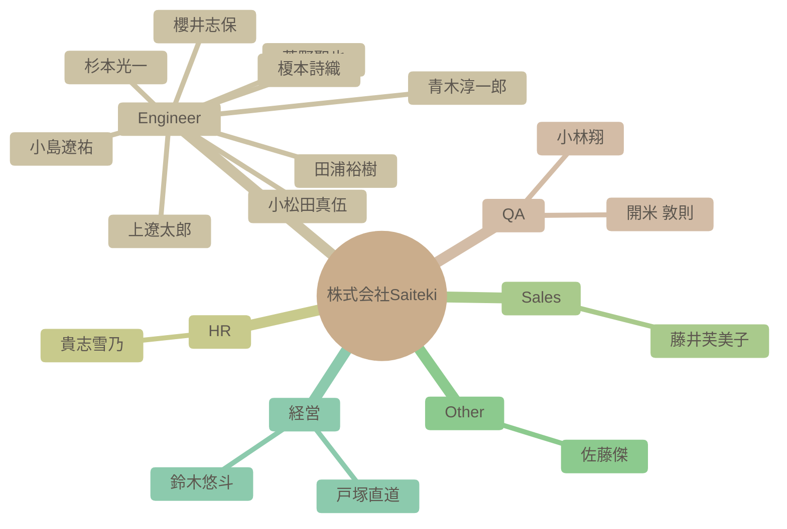

# チーム構成図

自動生成された組織図です。IssueおよびSlack連携による高度なAI分析結果が反映されます。

### 📊 関連リソース
- [🌐 インタラクティブ・ナレッジグラフ (Web版)](https://saitekiinc-com.github.io/saiteki-employee-management/)
- [📝 ナレッジグラフ分析レポート (Markdown)](./KNOWLEDGE_GRAPH.md)

### 組織マップ

```mermaid
%%{init: {'theme': 'base', 'themeVariables': {'primaryColor': '#F2EBE3', 'primaryTextColor': '#5D574F', 'primaryBorderColor': '#D9CFC1', 'lineColor': '#BEB3A5', 'secondaryColor': '#FAF9F6', 'tertiaryColor': '#FDFCFB', 'nodeBorder': '1px'}}}%%
mindmap
  root((株式会社Saiteki))
    Engineer
      杉本光一
      青木淳一郎
      櫻井志保
      田浦裕樹
      上遼太郎
      小松田真伍
      小島遼祐
      菅野聖也
      榎本詩織
    QA
      小林翔
      開米 敦則
    HR
      貴志雪乃
    Sales
      藤井芙美子
    Other
      佐藤傑
    経営
      鈴木悠斗
      戸塚直道
```

## 社員一覧サマリー

| 名前 | 職種 | 性格傾向 (概略) | 現在の状態 |
| --- | --- | --- | --- |
| [杉本光一](#%E6%9D%89%E6%9C%AC%E5%85%89%E4%B8%80) | Engineer | 技術トレンドへの深い洞察力と推進力を持つ一方で、自身の働き方を柔軟に調整し、常に丁寧かつポジティブなコミュニケーションを心がける。特に、知識の体系化と共有、そしてAI活用の本質的な側面に対する強い関心が見られ、社交的で新しいメンバーを積極的に受け入れる協調性も際立つ。 | 全社的なAI活用ガイドライン『Saiteki AI Standard』を通じてAI時代の組織変革をリードしつつ、直近では育児による稼働時間制約に対応するため、早朝の時間を活用する働き方を実践している。社内コミュニケーションにおいては、新入社員の歓迎やカジュアルな交流にも積極的に参加し、組織のエンゲージメント向上に貢献している。 |
| [青木淳一郎](#%E9%9D%92%E6%9C%A8%E6%B7%B3%E4%B8%80%E9%83%8E) | Engineer | 協調性が非常に高く、新しい知識や経験に対し前向きに挑戦する。社交的で周囲との交流を深め、高い責任感を持って業務に取り組む楽観的な性格。 | 年末年始を通してSaitekiメンバーとの出会いに深く感謝し、2026年を「飛躍の年」と意気込んでいる。12月上旬には業務負荷が高い様子が伺えたが、それを乗り越え、現在は非常に前向きな精神状態にある。 |
| [小林翔](#%E5%B0%8F%E6%9E%97%E7%BF%94) | QA | 開放性と協調性が特に高く、新しい経験や人との交流を楽しみ、チームワークを重視する傾向がある。責任感も強く、ポジティブな姿勢を保ちながら、自身の経験や関心を積極的に共有し、自己開示を厭わない。新しい環境での変化にも敏感に気づき、観察力も高い。 | 東京での一人暮らしへの移行を完了し、引っ越しに伴う主要なタスク（荷解き、ネット開通、在宅勤務環境の確認）を計画通りに解消したことで、精神的・肉体的な負荷が軽減されている。新しい生活への期待と、残りの連休を楽しむ意欲に満ちた、非常にポジティブで安定した状態にある。 |
| [櫻井志保](#%E6%AB%BB%E4%BA%95%E5%BF%97%E4%BF%9D) | Engineer | 自己認識が高く、協調性があり、学習意欲も高い。新しい環境への適応力も期待でき、謙虚で丁寧な印象を与えます。 | 1月からの入社を控えており、新しい環境に対する高い期待感と意欲に満ち溢れています。自身のスキルを活かしつつ、さらなる専門性向上とチームへの貢献を目指しています。 |
| [田浦裕樹](#%E7%94%B0%E6%B5%A6%E8%A3%95%E6%A8%B9) | Engineer | 非常に協調性が高く、誠実で、周囲への配慮を忘れない。新しい知識や経験への探求心が旺盛で、ユーモアを交えながら積極的に他者と関わる。自身の業務状況を正直に伝え、同僚の活動をサポートするなど、ポジティブな関係構築を重視する。特に、顧客理解と会社の戦略的優位性への探求が深化しており、組織のビジョンへの共感が極めて深い。 | 同僚が執筆したnoteの内容に深く感動し、Saitekiのビジョン実現と業界課題解決への自身のコミットメントを再確認している。新しいメンバーの参加を心から歓迎し、彼が組織に合うことを見抜いていたことを伝え、今後のプロジェクトでの協業を楽しみにする、非常にポジティブな状態にある。 |
| [開米 敦則](#%E9%96%8B%E7%B1%B3%20%E6%95%A6%E5%89%87) | QA | 学習意欲が旺盛で新しい技術に積極的。責任感が強く、計画的に業務を進める。協調性があり、丁寧なコミュニケーションを心がける。 | 現在、QAにおけるAI協働作業の概念化と初期段階の成果物作成に取り組んでいる。特にテスト計画フェーズの最適化と汎用テスト観点の修正に注力し、業務プロセスの戦略的な改善を進めている段階。関係者との情報共有と意見交換にも積極的。 |
| [貴志雪乃](#%E8%B2%B4%E5%BF%97%E9%9B%AA%E4%B9%83) | HR | 組織への貢献意欲と周囲への配慮が非常に高く、課題解決に積極的。新しい知識や経験、会社の事業戦略、社員の心身の健康、社員間の交流、そして人材獲得に加え、外部へのビジネス知見共有への探求心が旺盛で、感情表現も豊かでバランスが取れている。特に情報発信においては、細部にまで気を配り、視聴者・読者が内容を理解しやすいよう工夫を凝らす几帳面さが見られる。 | 直近のログでは、会社のYouTubeチャンネルを通じた外部への情報発信と、社員への最先端ビジネス・テクノロジー知見の提供に注力している。特に、DX戦略やアナログ・トランスフォーメーション (AX)、AI駆動開発といった先進的なテーマに関心が高く、これらの情報を構造的かつ魅力的に共有することで、社員の学習意欲を刺激し、企業のブランド価値向上と技術力強化に貢献しようとしている。引き続き、明るくポジティブな感情表現が見られる。 |
| [上遼太郎](#%E4%B8%8A%E9%81%BC%E5%A4%AA%E9%83%8E) | Engineer | 責任感が非常に強く、物事を深く理解しようとする探究心、知的好奇心があります。計画的かつ体系的に業務を進める一方、非常に社交的で、困難な状況でも冷静さを保ち、正直かつ協調的な態度で問題解決やチームとの交流に取り組みます。 | 直近では、理想の組織像について考察し期待を表明する一方、個人的な活動（ラーメン、サウナ）やビジネスモデルに関する観察眼を共有しています。自身の健康にも配慮し、食生活の改善を検討するなど、自己管理意識も高い状態です。 |
| [小松田真伍](#%E5%B0%8F%E6%9D%BE%E7%94%B0%E7%9C%9F%E4%BC%8D) | Engineer | 新しい技術や知識の習得、改善提案に極めて積極的で、それを組織に還元しようとする意識が非常に高い点は変わらない。技術的な探求心に加え、ビジネスの側面、特にインフラのアーキテクチャ、自動化、コスト最適化といった実務的な課題への深い洞察を示す。周囲とのコミュニケーションでは感謝と共感を示し、建設的な議論を重視する。社会や組織全体、そしてチームメンバーをより良くしようとする貢献意欲がより具体的に、戦略的な視点で強化されている。多様な働き方も自ら率先して実践し、その効果を積極的に共有することで、組織全体の変革を促す。 | 自身の業務改善や知見を深めるために勉強会へ積極的に参加し、アーキテクチャの合意形成、自動化、コスト最適化といった実践的なインフラ技術とビジネス戦略の融合について集中的に学習している。自身の知見を組織に還元しようとする高い意欲が伺え、現在のSESとしての経験を活かしつつ、より上位のレイヤーでの貢献を目指している。 |
| [小島遼祐](#%E5%B0%8F%E5%B3%B6%E9%81%BC%E7%A5%90) | Engineer | 新しい知識や経験に対する強い好奇心と探求心を持ち、周囲の意見を尊重し、積極的に関係を深めようとする。入社3ヶ月目の新人として、自己成長と周囲との協働に意欲を燃やす。責任感も強く、常に前向きな姿勢を保ち、人とのつながりを重視する。不明な点があっても、それを成長の機会と捉え、粘り強く理解に努める。 | 入社3ヶ月目の新入社員として、新しい環境への適応と人間関係の構築に積極的に取り組んでいる。自己開示と共通の話題を通じて周囲との親近感を深めつつ、自身の成長とチームへの貢献意欲を高く持っている。専門的な学習だけでなく、趣味を通じた交流にも意欲的である。 |
| [藤井芙美子](#%E8%97%A4%E4%BA%95%E8%8A%99%E7%BE%8E%E5%AD%90) | Sales | 極めて高い責任感と細部へのこだわりで組織運営の正確性を追求しつつ、新入社員の個性や趣味に深い関心を示し、個人的な体験やユーモアを交えながら積極的に交流する。親しみやすく、共感的で、新しいメンバーが安心して組織に溶け込めるよう心を配る。 | 5月半ばにおいて、同僚の誕生日を祝い、個人的なユーモラスな体験を共有するなど、非常に活発な社会的な交流を行っている。自身の感情を遊び心ある表現で伝え、周囲との親近感を深めることに注力している。既存の管理業務と新入社員へのオンボーディング支援に加え、対人関係の円滑化と職場の雰囲気向上に貢献しており、依然として高いコミットメントとポジティブな姿勢が見られる。 |
| [菅野聖也](#%E8%8F%85%E9%87%8E%E8%81%96%E4%B9%9F) | Engineer | 新しい技術や知識の吸収に意欲的で、協調性と社交性を持ち合わせる。自身の強みをユーモアを交えて表現し、感情も安定している。 | 入社直後で、開発者としての復帰とチームとの協働に非常に前向きである。AI技術への関心は非常に高く、読書を通じて多様な知識を吸収し、それを業務やコミュニケーションに活かそうとしている。人との交流も積極的に楽しみ、新しい環境での活躍を強く望んでいる。 |
| [佐藤傑](#%E4%BD%90%E8%97%A4%E5%82%91) | Other | 非常に開放的で誠実、外向的で協調性も高い。常に前向きで、新しい挑戦や学びを楽しみ、実践と情報共有を通じて貢献しようとする探求心と行動力を兼ね備えている。 | 海外での活動を継続しており、現在はUAEに滞在し、その後ASEAN中台韓を巡り、来年には帰国予定。国際的なチーム開発やハッカソンに積極的に参加し、最新のAI技術（特に小型高性能AIモデルのMac環境での実用性）に高い関心を持ち、M4 MaxでのGPTsossの動作を検証・共有するなど、その情報共有を通じて実践的な活用を模索している。質問歓迎の姿勢で、コミュニティへの貢献も意識している。 |
| [鈴木悠斗](#%E9%88%B4%E6%9C%A8%E6%82%A0%E6%96%97) | 経営 | 社交性が高く、責任感と共感力に優れる。自身の多様な側面（仕事の経験、趣味、家族との関わり）をオープンに共有し、相手との共通点を見つけることに長けている。自虐的なユーモアを交えることで親近感を生み出し、困難な状況でも感情が安定しており、周囲を巻き込むポジティブなエネルギーを持つ。情報収集にも積極的で、他者の疑問解決にも貢献する。 | 家族との時間を積極的に楽しみ、その喜びやエピソード（GWの過ごし方、けん玉チャレンジ）をチームと共有する。社内では積極的にコミュニケーションを取り、他者の話にも共感を示す。また、AIを情報収集に活用するなど、新しいツールへの適応力と貢献意欲も高い。 |
| [戸塚直道](#%E6%88%B8%E5%A1%9A%E7%9B%B4%E9%81%93) | 経営 | 非常に外向的で協調性が高く、誠実かつ開放的な人物。社会課題解決への強い意欲を持ち、最新技術や経営戦略を深く探求し、具体的なプロジェクトや組織運営に活かす。徹底した準備とプロ意識を持ち、組織の成長とメンバーのエンゲージメントを深く追求。積極的なコミュニケーションと細やかな配慮で信頼関係を築き、自身の経験や学びをオープンに共有する。自己成長への高い意識と健全な危機感を持ち、常に高みを目指す。 | 「準備が9割」という哲学を掲げ、徹底した準備と戦略的思考で上場SIer社長との協業機会を創出するなど、営業面で大きな成果を上げている。社会課題解決プロジェクトも推進しつつ、社員交流会や本社懇親会、勉強会を活発に企画・運営。採用活動も順調に進み、新たなメンバーを迎え入れている。多忙な中でも、自身の学びと哲学を「Letter of T」で精力的に共有し、会社の成長への強いコミットメントと健全な危機感を示している。 |
| [榎本詩織](#%E6%A6%8E%E6%9C%AC%E8%A9%A9%E7%B9%94) | Engineer | 非常に開放的で協調性があり、新しい知識や経験を積極的に取り入れようとする。親しみやすく、ユーモアのセンスも持ち合わせながら、自己を客観視できるバランスの取れた性格。自己規律性も高い。 | 入社後も継続して自己成長への意欲が高く、新たな個人的な挑戦を始めている。周囲への気配りや応援も忘れず、社内でのポジティブな存在として期待される。 |

---

## 詳細プロフィール

各社員の詳細な分析結果です。クリックして展開できます。

### 杉本光一 (Engineer)

> **総合サマリー**: 最先端AI技術の探求に加え、新しい才能の歓迎やカジュアルな交流にも積極的に参加し、組織のエンゲージメントを高める技術リーダー。

<b>🛠 性格傾向</b>

**要約**: 技術トレンドへの深い洞察力と推進力を持つ一方で、自身の働き方を柔軟に調整し、常に丁寧かつポジティブなコミュニケーションを心がける。特に、知識の体系化と共有、そしてAI活用の本質的な側面に対する強い関心が見られ、社交的で新しいメンバーを積極的に受け入れる協調性も際立つ。

| 項目 | スコア | 根拠・エピソード |
| --- | --- | --- |
| 開放性 | 9/10 | 新しいAI技術（Letter of T）を使ったS級人材モデル構築の可能性を探求し、課題と視点からペアデータによるチューニング、毎週更新という具体的なアイデアを出すなど、技術トレンドへの深い洞察と革新的な発想力を持つ。また、新入社員が「仕組みを作るための準備と手探り感のある仕事が好き」と語った際に、深く共感し、ゴールは設定されても何も決まっていない状態から形にしていく過程を楽しむ自身の性質を表明するなど、新しいことへの探求心と柔軟な思考を強く持っている。 |
| 誠実性 | 9/10 | 全社的なAI活用ガイドライン『Saiteki AI Standard』を策定し公開するなど、組織全体の課題解決に対する強い責任感と、それを具体化するための計画性、実行力を持つ。表面的な効率化だけでなく、本質的な価値創造につながるよう具体的な提言を行う。育児による稼働時間の制約で連絡が遅れたことに対し謝罪し、具体的な解決策として早朝の稼働時間を確保する旨を提案。連絡のラグを認識しつつも改善していく意向を示すなど、自身の状況変化に対し責任感を持って対応策を講じ、周囲への影響を最小限に抑えようと努める姿勢が見られる。AIを使った人材モデルの「毎週更新」というアイデアも、継続的な改善と運用を見据えた計画性を示している。 |
| 外向性 | 10/10 | 新入社員の自己紹介に積極的に挨拶し、その人数の多さに驚きと喜びを示す。また、初対面の同僚に対しても自ら「はじめまして！」と挨拶し、相手の仕事に対する価値観に「めちゃくちゃ共感です！」と熱烈な共感を示して、さらに話を聞きたいと積極的に交流を促す。カフェの話題で個人的な経験を共有するなど、オープンで社交的な側面が非常に強く現れている。 |
| 協調性 | 10/10 | 自己紹介チャンネルで新入社員12人全員に挨拶する労力をいとわず、新しいメンバーを積極的に歓迎する。カフェの話題では「またいきたくなる」と共感を示し、友人の好みを推測するなど、他者への配慮が見られる。初対面の同僚の仕事のスタイルに「めちゃくちゃ共感です！」と強く同調し、今後の交流を望むなど、非常に協調性が高く、他者との良好な関係構築を重視する。自身が過去に訪れたカフェの話題で個人的な経験を共有し、共感と親しみやすさを生み出している。 |
| 神経症的傾向 | 3/10 | AI活用における懸念点を具体的に指摘しつつも、それを解決するための具体的な指針と、AIがもたらすポジティブな未来像を論理的かつ冷静に提示する。感情的になることなく、組織全体を前向きな方向に導こうとする安定した姿勢が見られる。育児による稼働時間の制約から連絡の遅延が生じたことを冷静に報告し、具体的な解決策として朝型勤務の導入を提案。感情的にならずに状況を説明し、周囲の理解を求めながら、精神的な安定性と落ち着きを保って対応する。新しい技術的なアイデアを「思いつき」と表現しつつも、その実現可能性を冷静に分析している。 |

<b>💪 仕事スタイルと強み</b>

**要約**: AI技術への深い知見と、その本質的な価値を追求する戦略的思考で、組織の課題解決と文化変革をリードする。特にゼロからシステムを構築し、探求するプロセスを楽しみ、新しい才能の歓迎を通じて組織のエンゲージメント向上にも貢献する。人間中心のAI活用を提唱し、本質的な価値創造とチーム内の深い議論を促進する。

**問題解決スタイル**: AI活用における「なんとなく必要」といった表面的なアプローチに警鐘を鳴らし、「なぜ」を深く掘り下げることで本質的な課題解決を促す。例えば「画面の動きが重い」という表層的な問題に対し、「操作の順番が直感に合わず何度も行き来する」というUI設計の課題である可能性を指摘し、本当の問題を掘り起こすことの重要性を説く。個人の状況変化（育児による稼働制約）が業務に与える影響を認識し、その解決策として早朝の稼働時間を確保することを自ら提案するなど、個人レベルでの問題に対しても責任感と計画性を持って対処する。このアプローチは、組織全体の課題解決においても、現状を分析し具体的な行動計画を立てる彼の姿勢と一貫している。AIをあくまで道具と捉え、人間が判断の主体として価値を出し続けることの重要性を説く。新しいAI技術（Letter of T）を使ったS級人材モデル構築の可能性を探り、「課題とそれに対する視点があるので、ペアデータにしたらいいチューニングができるかも」と具体的なアプローチを構想するなど、論理的かつ実践的に問題解決にあたる。ゼロから仕組みを作り上げていく過程を楽しむタイプであり、既存の枠にとらわれずに最適な解決策を試行錯誤しながら構築するアプローチを好む。

**主要な強み**: AI技術の深い知見と実践的な応用力, AI時代における組織・人材戦略への深い洞察, 情報共有とナレッジマネジメントの推進と仕組み化, 実行力と迅速な問題解決能力, 丁寧で建設的なコミュニケーションとチームガイダンス, ワークライフバランスを考慮した柔軟な働き方の提案と実践, 自己管理能力と状況適応力, 戦略的かつ実用的な技術選定能力, 高度な知識管理と情報活用戦略の立案・実行, 人間中心のAI活用哲学の提唱と浸透, 組織文化変革へのリーダーシップ, 本質的な価値創造への深い洞察と提言力, 深い議論と対話を促すファシリテーション能力, 新しい仕組みの探求と構築を楽しむ姿勢, 組織の成長と新しい才能の歓迎

**証拠エピソード**:
- 『Saiteki AI Standard』を策定・公開し、AI活用における組織全体の思考様式と行動規範を具体的に提示した。
- 「なんとなく必要そうだから」で作業が始まることへの懸念を表明し、AI活用の本質的な目的と「なぜ」を深く問う重要性を全社に提示した。
- AIに依存するのではなく、『なぜ』を問い、人間が判断の主体であるべきというAI活用の本質的な哲学を組織全体に発信した。
- AIによって生まれた時間をチーム内の深い議論や対話に費やすべきだと提言し、問題が本当に解決するまで会話し続けるスタイルを促した。
- S級人材モデルをAI（Letter of T, カスタムチューニング）で実現可能か思案し、課題と視点からペアデータによるチューニング、毎週更新という具体的な運用イメージを構想するなど、未来志向で具体的なAI活用アイデアを創出する。
- 新入社員の自己紹介チャンネルで12人もの新メンバーに積極的に挨拶し、組織への歓迎と一体感を醸成する姿勢を示した。
- 新入社員の「仕組みを作るための準備と手探り感のある仕事が好き」という発言に対し、強く共感し、自身もゴール設定から形にしていく過程を楽しむタイプであることを表明するなど、ゼロから価値を創造する過程を重視する。

<b>💎 価値観とモチベーター</b>

**要約**: 最新AI技術への探求心に加えて、その本質的な意味と人間社会・組織への影響を深く考察し、人間中心の価値創造と組織文化の変革に最大の喜びを見出す。特に、ゼロから新しい仕組みやシステムを開拓し、形にしていくプロセスに強いモチベーションを感じる。全社的なAI活用ガイドライン『Saiteki AI Standard』の策定を通じて、AI時代における「なぜ」を追求する知的好奇心と、チーム内の深い対話を通じた課題解決、そして組織全体の知の活用と成長を強く志向する。新しい才能の導入と育成にも積極的で、自律的な行動と貢献を重視し、ワークライフバランスを考慮した持続可能な働き方を自ら構築する情熱を持つ。

**コアバリュー**: 技術革新と探求 (特にAIと知識グラフ、ベクトル検索、AI駆動開発), 組織・チームへの貢献 (ナレッジ共有、業務効率化、コミュニケーション改善), 自律的な行動と役割の拡張, AI時代における組織の適応と成長, 未来を見据えた継続的な学習と洞察 (特にAIと法), 実践を通じた技術検証と実装, オープンな情報共有と透明性, ワークライフバランスの重視と、それによる持続可能な貢献, 体系的な知識共有と活用, 人間中心のAI活用と価値創造, 本質的な問い（Why）の追求, チーム内の深い対話と協調, 組織文化の変革と進化, 新しいシステムや仕組みの開拓, 組織への新しい才能の導入と育成

**モチベーショントリガー**: AI技術が組織の文化や働き方を良い方向に変革すること, 自身のアイデアや知見を活かして具体的な仕組みを構築し、その効果を実感すること, チームのナレッジ蓄積や情報活用の効率化に貢献すること, メンバーが自律的に課題を見つけ解決する組織風土を醸成すること, 技術的な問題を迅速に解決し、システムを安定稼働させること, 新たな技術や社会の変化に関する知識を深く学び、それを周囲と共有すること, 知識共有の仕組みを構築し、組織全体の知の活用を促進すること, チームや組織の生産性が向上すること, AIが単なる効率化ツールでなく、より本質的な思考と深い議論を促進するきっかけとなること, 組織全体がAI時代に合わせた思考様式と働き方に変革していく過程, 自身の策定したガイドラインが組織全体に浸透し、具体的な行動変容に繋がること, ワークライフバランスを保ちつつ、自身の能力を最大限に発揮し、組織に貢献すること, ゼロからアイデアを形にしていくプロセス, 新しい技術を活用した人材育成の可能性を探求すること

**証拠エピソード**:
- 『Saiteki AI Standard』を策定し、AI活用における安易な依存ではなく、『なぜ』を問い、人間が判断の主体であるべきという強い信念と価値観を全社に示した。
- AIによって生まれる時間をチーム内の深い議論や対話、本質的な課題解決に充てるべきだと提唱することで、組織の文化変革への強い意欲を示した。
- 『どう作るか』ではなく『何を作るか・なぜ作るか』を考える時間を増やすことをゴールと設定し、AIをそのための道具と位置づけることで、本質的な価値創造への強いコミットメントを示した。
- Letter of Tを用いたS級人材モデル構築の可能性に言及し、これを「直道の分身！？」と表現するなど、AIによる革新的な人材育成・組織強化に強い関心と遊び心を持って取り組んでいる。
- 新入社員が「仕組みを作るための準備と手探り感のある仕事が好き」と述べた際に、「めちゃくちゃ共感です！ゴールは設定したけどあとはなにも決まっていない状態から、ひとつずつ形になっていく感じが自分も好きです！」と語り、ゼロから創造していくプロセスと、それが具体化していくことに強い喜びとモチベーションを感じていることを示している。
- 自己紹介チャンネルで新入社員12人全員に挨拶するなど、組織への新しい才能の導入を積極的に歓迎し、交流を深めようとする姿勢。

<b>📈 現在の状態</b>

**要約**: 全社的なAI活用ガイドライン『Saiteki AI Standard』を通じてAI時代の組織変革をリードしつつ、直近では育児による稼働時間制約に対応するため、早朝の時間を活用する働き方を実践している。社内コミュニケーションにおいては、新入社員の歓迎やカジュアルな交流にも積極的に参加し、組織のエンゲージメント向上に貢献している。

- **感情レベル**: positive
- **業務負荷状況**: 全社的なAIガイドラインの策定・公開という大きな成果を出しつつ、育児による稼働時間の制約に直面している状況。これに対し、早朝の時間を活用する具体的な対応策を講じ、連絡のラグを認めつつも改善意向を示すことで、精神的な安定と高いモチベーションを保ちながら業務負荷とワークライフバランスを積極的に管理しようと努めている。新しい技術アイデアの探求や新入社員への積極的な関わりは、業務に前向きに取り組む姿勢を示している。
- **最近の関心トピック**: Saiteki AI Standardの策定と公開、およびAI活用の本質的な哲学, AI駆動開発と、それに伴うエンジニアの役割の変化, AIと法務に関する知見の習得, AI活用ドキュメントの運用とチームの知識共有促進, ナレッジベースのカテゴリ設計とRAGを活用した具体的な情報検索の仕組み, Neo4jなどのグラフデータベースを活用した検索ソリューションの検討, AIによるS級人材モデル構築（Letter of T、カスタムチューニング、ペアデータ、毎週更新）, 新入社員の歓迎と社内交流, ゼロからのシステム構築と探求

---

### 青木淳一郎 (Engineer)

> **総合サマリー**: AWS基盤の専門性を持ち、未経験技術の習得にも意欲的。福岡在住で家族を大切にし、高い責任感と協調性でSaitekiへの貢献とメンバーとの交流を積極的に図る人物。

<b>🛠 性格傾向</b>

**要約**: 協調性が非常に高く、新しい知識や経験に対し前向きに挑戦する。社交的で周囲との交流を深め、高い責任感を持って業務に取り組む楽観的な性格。

| 項目 | スコア | 根拠・エピソード |
| --- | --- | --- |
| 開放性 | 8/10 | AWS基盤の経験がある中で、AzureやGoogle Cloud、AIといったクラウド技術への強い関心を示す。未経験のBIツールに苦戦しながらも、それをスキルの幅を広げるチャンスと捉え、前向きに知識と経験の習得に努めている。 |
| 誠実性 | 7/10 | 業務の納期を最優先し、興味のある社内イベントであっても納品が近いことを理由に参加を見送る判断をするなど、強い責任感を持つ。未経験のBIツールでの苦労も、粘り強く習得に努める機会と捉えている。 |
| 外向性 | 8/10 | 入社時に詳細な自己紹介を行い、共通の趣味（Youtube、パパ）を持つメンバーには積極的に交流を呼びかけ「パパ会」を提案。地域を越えた「西日本勢」の盛り上げにも意欲を見せるなど、社内でのコミュニケーションや親睦を重視する姿勢が強い。 |
| 協調性 | 9/10 | メンバーの投稿に対し共感や感謝を積極的に示し、共通点を見つけて親睦を深めようとする。他者のnoteを読み感動を伝えるなど、周囲の人々の気持ちや経験を尊重し、良好な関係性を築くことに非常に長けている。 |
| 神経症的傾向 | 3/10 | ネガティブな感情の表出は非常に少なく、近所のサル出没に驚きと恐怖を感じたという発言程度。未経験のBIツールでの苦戦や多忙な業務状況下でも、常に前向きな姿勢を保ち、状況を好転させる機会と捉える傾向がある。 |

<b>💪 仕事スタイルと強み</b>

**要約**: AWS基盤のインフラ設計・構築に高い専門性を持ちつつ、未経験技術への学習意欲が極めて高い。責任感が強く、チームワークと自己成長を重視して業務に取り組む。

**問題解決スタイル**: 未経験の技術や困難に直面しても、それをスキルアップの好機と捉え、前向きな姿勢で学びと経験を積み重ね、解決策を模索する。

**主要な強み**: インフラ設計・構築スキル, 学習意欲, コミュニケーション能力, 責任感

**証拠エピソード**:
- 入社時の自己紹介でAWS基盤のインフラ設計・構築に携わってきたことを明確に述べている。
- Azure、Google Cloud、AIへの関心や、未経験のBIツール（QuickSuite）に苦戦しつつも「スキルの幅を広げるチャンス」と捉え積極的に取り組む姿勢を見せている。
- 興味のある社内イベントであっても、納品が近いことを理由に不参加を表明し、業務を最優先する強い責任感を見せている。
- 「Saitekiの輪をどんどん広げていけたら」と発言し、オンラインでの積極的なコミュニケーションや「パパ会」の提案を通じてメンバーとの関係構築に努めている。

<b>💎 価値観とモチベーター</b>

**要約**: 家族との時間を大切にし、仕事では新しい技術の習得と自己成長を追求。組織への貢献意欲とSaitekiの一員であることへの誇り、メンバーとの交流を非常に重視している。

**コアバリュー**: 家族, 成長, 貢献, 責任

**モチベーショントリガー**: 新しい技術の習得, チームへの貢献, 自己成長, 人との交流

**証拠エピソード**:
- 自己紹介で「家族とドライブに行ったり、子どもと遊んだり、妻をガチャガチャ屋さんに連れて行ったり」と休日の過ごし方を共有し、家族との時間を大切にしている様子が伺える。
- AWS以外のAzure、Google Cloud、AIといった技術への学習意欲や、未経験のBIツールでの苦戦も「スキルの幅を広げるチャンス」と捉え、知識と経験を得ることに意欲的である。
- 入社時に「Saitekiの輪をどんどん広げていけたら」と組織への貢献意欲を示し、年末には2025年を「最高の年」と振り返り、2026年を「さらに飛躍の年にしていきましょう！」と語るなど、強い責任感と組織への帰属意識が見られる。
- オンラインでのコミュニケーションを重視し、「パパ会」や「西日本勢盛り上げていきましょー」とメンバー間の交流を積極的に促進しようとしている。
- 他者のnoteを読んで「グッときました！」と感動を伝え、メンバーの入社経緯への関心を示している。

<b>📈 現在の状態</b>

**要約**: 年末年始を通してSaitekiメンバーとの出会いに深く感謝し、2026年を「飛躍の年」と意気込んでいる。12月上旬には業務負荷が高い様子が伺えたが、それを乗り越え、現在は非常に前向きな精神状態にある。

- **感情レベル**: positive
- **業務負荷状況**: 12月上旬には納品が近く、帰りが遅くなるほどの業務負荷があったが、それを乗り越え、年末年始は達成感と来年への意欲を見せている。
- **最近の関心トピック**: Saitekiメンバーの入社経緯, 京都旅行, 2025年の振り返りと2026年への期待, BIツールの知識習得

---

### 小林翔 (QA)

> **総合サマリー**: 新しい環境への高い適応力と計画性を持ち、自身の生活の変化も積極的に共有する社交的な人物。目標達成に向けた実行力があり、ポジティブに挑戦を楽しむ。

<b>🛠 性格傾向</b>

**要約**: 開放性と協調性が特に高く、新しい経験や人との交流を楽しみ、チームワークを重視する傾向がある。責任感も強く、ポジティブな姿勢を保ちながら、自身の経験や関心を積極的に共有し、自己開示を厭わない。新しい環境での変化にも敏感に気づき、観察力も高い。

| 項目 | スコア | 根拠・エピソード |
| --- | --- | --- |
| 開放性 | 9/10 | 新しい一人暮らしの環境でネット回線速度が大幅に向上したことに驚きを示しており、日常の新しい発見や変化に対しても好奇心と敏感さを持つ。また、新しい生活や連休を楽しむ意欲も高い。 |
| 誠実性 | 8/10 | 引っ越し完了後、荷解き、ネット開通、在宅勤務環境の疎通確認といった必要なタスクを計画的にこなし、「懸念がほぼ払拭できた」と報告。物事を確実に実行し、責任感を持って完遂する能力が高い。 |
| 外向性 | 9/10 | 東京での一人暮らし開始というプライベートな一大イベントを、社内チャットで自ら進んで共有する。これは、自身の状況を周囲に開示することで交流を促し、新しい環境での繋がりを求める社交性の表れである。 |
| 協調性 | 9/10 | 自身の近況を共有することで、周囲との関係性をオープンに保ち、親近感を醸成しようとする。新しい生活と連休を「楽しんでまいります」とポジティブに語ることで、周囲にも良い影響を与えようとする配慮が見える。 |
| 神経症的傾向 | 3/10 | 一人暮らし開始に伴う懸念事項を自ら解消し、「懸念がほぼ払拭できた」と報告することで、自己管理能力の高さと安定感を保つ能力を示す。ネット回線速度の向上に「ビビッてます」と表現するのは驚きであり、不安を示すものではない。 |

<b>💪 仕事スタイルと強み</b>

**要約**: 長年の経験に裏打ちされた細部への注意と、高いコミュニケーション能力が強み。新しい情報や知識の吸収にも積極的で、協調性を持ちながら業務に取り組む。状況把握と情報共有に長け、自身の経験を活かした具体的な提案も期待できる。計画性、実行力、そして適応力に優れる。

**問題解決スタイル**: 環境移行時において、懸念事項を事前に洗い出し、荷解き、ネット開通、在宅勤務環境の確認といったタスクを計画的にこなすことで問題を解決し、安心を確保する論理的かつ実践的なアプローチをとる。

**主要な強み**: テスト・品質管理経験, コミュニケーション能力, 情報収集力, 情報提供力, 状況説明能力, 協調性, 詳細観察力, 計画性, 実行力, 適応力

**証拠エピソード**:
- 飲み会後に、参加者へのお礼と共に、自身の趣味の動画と具体的なグルメ情報を詳細に共有する。
- 出張先や旅行で訪れた飲食店の特徴（麺の食感、天ぷらの状態、餃子の製法、行列状況）を細かく記憶し、他者に分かりやすく伝える。
- 社交的なイベントへの参加に強い意欲と喜びを示し、積極的に交流の機会を設ける。
- 引っ越し後の荷解き、ネット開通、在宅勤務環境の確認といったタスクを計画的にこなし、懸念を払拭したことを報告する。

<b>💎 価値観とモチベーター</b>

**要約**: 成長、繋がり、楽しさ、探求、そして経験を重視する。新しい挑戦や安定した環境の確立、自律性を重んじ、自身の情熱を共有することがモチベーションの源泉となる。

**コアバリュー**: 成長, 協調, 楽しさ, 探求, 繋がり, 経験の共有, 新しい挑戦, 安定, 自律性

**モチベーショントリガー**: 新しい知識やスキルの習得, チームへの貢献と協業, 楽しい経験や趣味の追求, 共通の興味を持つ人々との交流, 興味を持ったことの詳細な情報共有, 自己開示を通じた人間関係の深化, 新しい環境での生活の確立, 計画の実行と達成

**証拠エピソード**:
- 飲み会の後に、自らの趣味や出張先での発見を詳細に共有することで、仲間との繋がりを深めようとする。
- 旅行や出張先での新しい発見（美味しいお店や地域文化）を積極的に楽しみ、それを他者と共有することに喜びを感じている。
- 社交的なイベントへの参加に「わくわく」と感情を表現し、楽しい経験を重視する姿勢が見られる。
- 一人暮らしの開始という新しい挑戦をポジティブに捉え、連休を楽しむ意欲を見せる。
- 引っ越し後の諸タスクを計画的に実行し、懸念を解消することで、新しい生活基盤の確立に意欲的に取り組む。

<b>📈 現在の状態</b>

**要約**: 東京での一人暮らしへの移行を完了し、引っ越しに伴う主要なタスク（荷解き、ネット開通、在宅勤務環境の確認）を計画通りに解消したことで、精神的・肉体的な負荷が軽減されている。新しい生活への期待と、残りの連休を楽しむ意欲に満ちた、非常にポジティブで安定した状態にある。

- **感情レベル**: positive
- **業務負荷状況**: プライベートでの大きな環境変化に伴うタスクが一段落したため、今後は業務への集中力も高まっていくと推測される。自己管理能力が高く、業務とプライベートのバランスをうまく取るタイプ。
- **最近の関心トピック**: 新しい一人暮らしの生活, 引っ越し後の環境整備（荷解き、ネット開通）, 在宅勤務環境の確認, 連休の過ごし方, ネット回線速度の改善

---

### 櫻井志保 (Engineer)

> **総合サマリー**: 櫻井志保さんは、データ分析スキルと高い学習意欲を持ち、協調性をもってチームに貢献しようと意欲的な人物です。

<b>🛠 性格傾向</b>

**要約**: 自己認識が高く、協調性があり、学習意欲も高い。新しい環境への適応力も期待でき、謙虚で丁寧な印象を与えます。

| 項目 | スコア | 根拠・エピソード |
| --- | --- | --- |
| 開放性 | 8/10 | Power BIを用いたデータ分析・加工の経験があり、資格取得を目指しデータベース構築といったより専門的な分野への挑戦意欲を明確に示しています。 |
| 誠実性 | 7/10 | 自己紹介で自身の業務経験、スキル、今後の展望を詳細かつ明確に記述しており、責任感と計画性が伺えます。趣味を通じて業務のリフレッシュを図る自己管理能力も持ち合わせています。 |
| 外向性 | 6/10 | 「Slack等を通じて積極的にコミュニケーションを取っていければ」と、自ら進んで他者との交流を求める姿勢が見られます。ただし、直接会う機会が少ないことへの言及もあり、バランスの取れた交流を好むと推測されます。 |
| 協調性 | 9/10 | 「今後ともよろしくお願いいたします」「まだまだ至らない点も多いかと思いますが、何卒よろしくお願いいたします」といった謙虚で丁寧な言葉遣いから、協調性や相手への配慮が強く感じられます。 |
| 神経症的傾向 | 3/10 | 自己紹介の内容全体から、新しい環境への期待感と前向きな姿勢が感じられ、不安や心配を示唆する要素は見当たりません。 |

<b>💪 仕事スタイルと強み</b>

**要約**: データに基づいた分析力と高い学習意欲を持ち、自ら専門性を深めようと努力します。チームでのコミュニケーションを重視し、協調的に仕事を進めるタイプです。

**問題解決スタイル**: データ分析スキルを活かし、論理的な思考で現状を把握し問題解決に取り組むアプローチを取ります。

**主要な強み**: データ分析, 学習意欲, コミュニケーション

**証拠エピソード**:
- Power BIを用いたデータ分析・加工の経験があると述べています。
- 資格取得を目指し、データベース構築などより専門的な分野への挑戦を考えていると表明しています。
- Slack等を通じて積極的にコミュニケーションを取りたいと意欲を示しています。

<b>💎 価値観とモチベーター</b>

**要約**: 自身の成長と専門性向上を重視し、新しい知識やスキルを習得することに喜びを感じる人物です。チームワークを大切にし、周囲との良好な関係を築きながら貢献することにモチベーションを感じます。

**コアバリュー**: 成長, 貢献, 協調性, 専門性

**モチベーショントリガー**: 新しい知識やスキルの習得, 専門性の向上, チームへの貢献, 自己管理を通じたパフォーマンス維持

**証拠エピソード**:
- 資格取得やデータベース構築といった専門分野への挑戦意欲を表明しています。
- Slack等を通じて積極的にコミュニケーションを取りたいと述べています。
- 趣味をリフレッシュに活用し、業務パフォーマンス維持に努めていることを示唆しています。

<b>📈 現在の状態</b>

**要約**: 1月からの入社を控えており、新しい環境に対する高い期待感と意欲に満ち溢れています。自身のスキルを活かしつつ、さらなる専門性向上とチームへの貢献を目指しています。

- **感情レベル**: positive
- **業務負荷状況**: 新規入社予定のため、現在の業務負荷は不明ですが、趣味をリフレッシュに活用していることから自己管理ができていると推測されます。
- **最近の関心トピック**: データ分析, データベース構築, 資格取得, Slackを通じたコミュニケーション

---

### 田浦裕樹 (Engineer)

> **総合サマリー**: Saitekiのビジョンと顧客貢献に深く共感し、困難でも諦めず解決策を模索する推進力を持つ。戦略的機動力と柔軟性で会社の独自ポジション確立に貢献する誠実で協調性の高い人物。組織のビジョン達成に強くコミットし、新しい仲間との協業を心から楽しむポジティブな特性が際立つ。

<b>🛠 性格傾向</b>

**要約**: 非常に協調性が高く、誠実で、周囲への配慮を忘れない。新しい知識や経験への探求心が旺盛で、ユーモアを交えながら積極的に他者と関わる。自身の業務状況を正直に伝え、同僚の活動をサポートするなど、ポジティブな関係構築を重視する。特に、顧客理解と会社の戦略的優位性への探求が深化しており、組織のビジョンへの共感が極めて深い。

| 項目 | スコア | 根拠・エピソード |
| --- | --- | --- |
| 開放性 | 10/10 | AI技術の学習に深くコミットし、自身でRAG構築を目標に高性能PCを導入。ゴッホ展を深く鑑賞し、原田マハの関連書籍を即座に購入するなど芸術への知的好奇心が非常に高い。長年の憧れだったチェロを始め、羊文学のライブには毎年参戦するほどの情熱を持つ。日本酒、ビール、ワインを好み、特に黒龍、作、酔鯨、浜福鶴といった銘柄を挙げる。ロイズの生チョコとアイラウイスキーの組み合わせを絶賛するなど、グルメへの探求心とこだわりも深い。新しいメンバーには自身の好きなお酒の銘柄を具体的に挙げて共有している。また、広木大地氏の言葉を引用し、自身の哲学を共有するとともに、プレゼンや資料が仮説に基づいて設計されており、その検証のためのフィードバックを重視する点で、知的好奇心と分析的な思考の深さが伺える。「ホントにワクワクします」とSaitekiの目指す独自のポジションに強い期待と探求心を示す。社長の「正しい提案でも顧客が求めていないなら変える」という方針を会社としての考え方として高く評価する。商談を通じて「正しい提案」だけでなく「顧客の意思決定の文脈に乗せる」ことの重要性を痛感し、それをSaitekiの強みとして捉えている。SIerやコンサルティングファームの主戦場を明確に区別し、Saitekiが担う独自の領域を戦略的に言語化している。さらに、Saitekiのビジョン実現と業界課題の解決、そしてその道のりにある大成功という結果に自身も貢献したいと強く表明しており、会社の目指す新しい境地への探求心と期待が高い。 |
| 誠実性 | 9/10 | PoCの立ち上げフェーズでタスク分解、優先順位付け、計画策定を詳細に行い、進捗を具体的なポイントと共に共有する。AI駆動開発の標準化に向けたワークフローやガイドライン作成にも継続的に取り組む。家庭の事情が生じた際も、業務への影響を考慮し速やかに連絡を行い、柔軟に対応するなど、責任感と計画性が非常に高い。顧客に「自信を持って即答」するためには徹底した準備が必要であると認識し、実践する。自身の進捗がないことを正直に報告し、会議のスキップを提案するなど、責任感と効率性を重視する。プロジェクトの遅延を認めつつも、時間をやりくりして対応する意思を示す。資料やプレゼンは仮説を持って設計し、フィードバックを通じて検証することで、より良いものを提供しようと努める。他のコミットメントに対しては、時間を割くことが難しい状況を正直かつ明確に伝えるなど、自身の業務状況やキャパシティ管理を適切に行い、関係者への配慮を欠かさない。自身の進捗が遅れていることを正直に報告しつつも、「なんとか時間をやりくりしたいと思います」と責任感を持って業務完遂への意欲を示す。「まだ試合終了してません」と困難な状況でも諦めずに解決策を探求する姿勢。商談で得た学びを即座にハチドリ案件の提案修正に活かし、「早期にプロト開発」「同時にリスク制御」で受注を目指すなど、実行力と目標達成へのコミットメントが高い。全社に向けて提案資料へのアクセス権を速やかに共有し、不明点があれば個別にサポートを申し出るなど、責任感を持って情報共有を進める。加えて、同僚のnoteを拝見し、Saitekiのビジョン実現と業界課題解決への貢献に改めて身が引き締まる思いを表明するなど、会社の目標達成への強い責任感とコミットメントを持つ。 |
| 外向性 | 8/10 | 新メンバーには積極的に自己紹介し、自身のプライベートな情報をオープンに共有することで親近感を醸成する。絵文字を非常に多用し、勉強会では活発に発言や改善提案を行うなど、他者との交流を積極的に楽しむ。戸塚氏とのライブ参加を積極的に提案する他、社内レターや商談共有にも感謝を伝え、積極的にコメントを残すなど、関係構築にも意欲的。新しい同僚にお酒の好みや関西在住であることを共有し、共通点を探すことで距離を縮めようとする。グルメに関する話題でも、ユーモアを交えながら活発にコミュニケーションを取り、他者にも試すよう勧める。感謝や喜びの感情を豊富な絵文字とともに頻繁に表現し、他者の発言に対して「めちゃくちゃ嬉しい」と素直に伝えることで、周囲とのポジティブな関係構築を重視する。同僚が参加するマラソンイベントに対して、積極的に応援メッセージを送り、共感とサポートを示す。感謝や意欲を豊富な絵文字を用いて表現し、感情を豊かに伝える。同僚の努力に感謝を述べるなど、積極的にポジティブな交流を図る。多くのメンバーへの感謝のコメントを送り、自身の発言への返信を後ほど行うことを明言するなど、積極的なコミュニケーションとエンゲージメントを示す。全社に向けての資料共有も、他者への働きかけを伴う行動である。さらに、絵文字を多用し、同僚のnoteへの感動を率直に表現する。新しいメンバーを歓迎し、彼がSaitekiに合うと確信していたことを伝え、共に働くことへの感謝と今後の協業への期待を表明するなど、人との積極的な交流を重視し、ポジティブな関係構築に貢献する。 |
| 協調性 | 9/10 | 他者の意見を尊重し、感謝の意を頻繁に伝える。「素晴らしいレターをありがとうございました」「そう言って頂けてめっちゃ嬉しいです」「シェアありがとうございます」「お心遣いありがとうございます」「めちゃくちゃ嬉しいコメントありがとうございます」といった感謝の言葉が多い。荒天時のメンバーの安否を気遣い、周囲への配慮や思いやりが非常に強い。顧客を安心させることを商談の最優先事項と捉え、具体的なヒアリングで実践する。勉強会へのフィードバックも、リモート参加者への配慮を含め建設的に行う。家庭と仕事の両立に奮闘する同僚に深い感謝と労いの言葉をかけ、その努力を認識する。自身の進捗が芳しくない中でも、他の参加者の時間を尊重し、会議の開催について配慮を示す。チームメンバーへの協力を惜しまない姿勢を示す。同僚の体調を気遣う言葉をかけ、自身の経験から顧客への「安心と信頼」提供の重要性を語り、後輩には「普段の業務の中で何度も繰り返しやると、うまくなりますよ」と具体的にアドバイスする。他者の意見やフィードバックに対して「めちゃくちゃ嬉しい」と素直に感謝の意を表明し、後輩に対しては育成的なアドバイスを送る。同僚が参加するマラソンイベントに対し、積極的にエールを送ることで、チーム内の連帯感とサポート精神を発揮する。自身の時間的制約についても、相手に配慮しつつ正直に伝えることができる。「素晴らしいLetterをありがとうございました」と感謝を伝え、リーダーシップの判断とメッセージを尊重する。同僚が家庭と仕事を両立しながらプロジェクトを推進していることに対し、深く感謝し労いの言葉をかける。社長の「顧客が求めていないなら提案を変える」という判断を会社としての考え方がはっきり示されたものとして尊重し、自身の思考をリーダーの頭に合わせる姿勢を示す。提案資料へのアクセスで困るメンバーには個別のサポートを申し出るなど、細やかな配慮も忘れない。加えて、同僚が執筆したnoteの内容に深く感動し、共感と感謝を表明する。新しいメンバーを温かく迎え入れ、彼が会社に合うと確信していたことを伝え、共に働けることに心から感謝するとともに、今後の協業を楽しみにする姿勢から、他者への配慮と共感性の高さが伺える。 |
| 神経症的傾向 | 3/10 | 子供の体調不良や急なテレワークにも冷静かつ柔軟に対応し、業務を調整する。週例MTGへの参加可否も状況を考慮しつつ事前に連絡するなど、精神的な安定性とストレス耐性が高く、業務への影響を最小限に抑えようと努める。荒天でバスが運休し急遽テレワークになった際も、焦りを見せず業務に対応している。突然の予定変更に対しても冷静に対応し、状況を関係者に速やかに連絡できる。自身のプロジェクト進捗が滞っていることを冷静かつ率直に報告し、状況を過度に悲観せず、前向きに対応策を検討する姿勢を見せる。定例の廃止といった変化にも落ち着いて対応する。他のタスクへのコミットが難しい状況であっても、感情的にならず、客観的に現状を伝えることができる。定例の廃止を冷静に受け入れ、自身の業務進捗の遅れを認めつつも、その解決策として「なんとか時間をやりくりしたい」と前向きな姿勢を示す。プロジェクトが「あまりうまく行きませんでしたが」という状況を認めつつも、すぐに「まだ試合終了してません」「再度勝ち筋に乗る」と立て直しへの意欲と戦略的思考に転換する冷静さと強さを持つ。直近のログでも、感動や感謝といったポジティブな感情は豊かに表現するものの、不安や焦り、ネガティブな感情の兆候は見られない。 |

<b>💪 仕事スタイルと強み</b>

**要約**: AI技術を核とした開発プロセスの深い知見を持ち、アジャイルの本質であるリスクコントロールを重視する。Saitekiの独自の顧客貢献ビジョンに深く共感し、特に「顧客の意思決定の文脈に乗せる」機動力と柔軟性を重視。困難な状況でも諦めずに解決策を模索し、会社のユニークなポジション確立を推進する強い推進力と責任感を持って業務に取り組む。組織のビジョン達成への強いコミットメントと、適切な人材を見抜きチームへの貢献を促す視点を持つ。

**問題解決スタイル**: PoCにおいては、最初に全てを決め切らず、仮説を立て、クライアントとの密なすり合わせを通じて要件や計画を段階的にアップデートしていくアジャイルなアプローチを重視する。アジャイルの真髄を「不確実性を分解し、リスクをコントロール可能な形に変えていくこと」と定義し、これを商談やエンジニアリングの本質と捉えている。レクター代表の広木大地氏の「エンジニアリングの本質は、曖昧で分からない状態から、具体的ではっきりとした状態に変えていく行為だ」という思想に共感し、これを商談にも適用する。表面的な「速く作る」「ドキュメントを書かない」アジャイルを批判しつつも、リスクを限定できる場合は設計を固めず実装に入る柔軟な姿勢も持つ。問題解決に際しては、AIを積極的に活用し、自身の経験と組み合わせることで具体的なワークフローやガイドラインの標準化を目指す。商談においては「お客様を安心させる」ことを最優先事項と捉え、的確なヒアリングで目的を明確にし、そのために「自信を持って即答」できるだけの徹底した準備を重視する。自身のプレゼンや資料も「仮説を持って設計」し、フィードバックを通じて仮説検証と改善を行うことで、より質の高い問題解決を目指す。困難な状況においても「まだ試合終了してません」と諦めず、リーダーの戦略や思考に深く共感し、それに合わせて「再度勝ち筋に乗る」ことを模索する戦略的かつ適応的な問題解決アプローチを取る。顧客との「泥臭い対話」の重要性を強調し、本質的な顧客課題の解決を目指す姿勢。今回の商談の学びから「正しい提案」だけでなく「顧客の意思決定の文脈に乗せる」必要性を痛感し、その機動力と柔軟性でハチドリ案件の提案を「早期プロト開発」と「リスク制御」を両立する形に修正するなど、学んだことを即座に具体的な行動計画に落とし込む。また、SIerとコンサルティングファームの領域を明確に区別し、Saitekiが「リスクを除去しながら開発を前に進める」「開発プロセス自体を設計する」「事業の意思決定を支援する」という独自のポジションを担うべきだと戦略的に提言している。

**主要な強み**: 開発プロセス全体（要件定義〜実装）への深い知見と標準化への貢献, アジャイル開発の本質的な理解と実践（特にリスクコントロールと不確実性分解）, AI駆動開発の実践と知識共有（特に標準化・ガイドライン作成）, 顧客視点での課題解決と安心感の提供のための徹底した準備と自信ある回答, チーム立ち上げ・品質改善（レビューを通じた貢献）, ビジネスモデルへの深い洞察と分析力, システム開発最上流工程への深い理解と重視, 仮説検証に基づくプレゼン・資料設計と改善, 自身の時間管理と周囲への明確な伝達, 自身の業務状況を正直かつ建設的に報告する能力, 会議の効率化を提案する配慮, 困難な状況における諦めない姿勢と解決策模索能力, リーダーシップのビジョンへの深い共感と戦略的アラインメント, Saitekiの独自の顧客貢献アプローチへの理解と推進, 顧客との「泥臭い対話」を重視する姿勢, 顧客の意思決定の文脈を理解し、提案を調整する柔軟性と機動力, SIerやコンサルティングファームとの差別化ポイントを明確に言語化する戦略的思考, リスク制御と早期開発を両立する実践的な提案力, 顧客のシステム部門を担うというSaitekiのビジョン実現への強いコミットメント, 実績を通じて会社のポジションを確立しようとする能動性, Saitekiのビジョン達成への強いコミットメント, 人材を見極め、チームへの適応を促す視点

**証拠エピソード**:
- PoCの進捗状況を詳細に共有し、仮説検証と段階的アップデートの重要性を解説することで、チーム全体のレベルアップに貢献しようとしている。
- IPAの要件定義ガイドラインやAIエージェントによる開発フローのテンプレートを共有し、開発プロセスの基礎知識やAI活用のベストプラクティスを惜しみなく共有する。
- ChatGPTを用いて飲食店の利益設計を分析し、そのビジネスモデルを技術開発のプロセスと関連付けて考察するなど、技術を実生活やビジネスに応用する高い洞察力と好奇心を持つ。
- 自身の経験から「お客様を安心させる」ことを商談の最優先事項と考え、具体的なヒアリングでの認識合わせを通じて実践していると発言。
- 勉強会への建設的なフィードバックを通じて、より質の高い学習機会を創出しようと働きかけ、QAと開発の連携に関する深掘り議論を提案する。
- AI駆動開発のスタンダード作りのため、作業ログテンプレートやワークフローのドキュメント化に積極的に取り組む。
- 「システム開発の最上流を知っていると、開発に取り組むときの視野が格段に広がると思います」と述べ、商談内容の社内共有を奨励。
- 「もう今は自分が書く時はリカバリーの時だけで、普段はレビューばかりですが…」と自身の役割がレビュー中心であることを示唆し、品質向上に貢献している様子がうかがえる。
- 「エンジニアリングの本質は、曖昧で分からない状態から、具体的ではっきりとした状態に変えていく行為だ」という思想を商談に適用し、ハチドリソーラーへの提案内容にも反映させている。
- アジャイルの真髄を「不確実性を分解し、リスクをコントロール可能な形に変えていくこと」と明確に定義し、安易なアジャイル解釈を批判する。
- 顧客を安心させるためには「自信を持って即答」することが重要であり、そのためには徹底した準備が必要であると述べ、自身の仕事のスタンスを明らかにしている。
- エンジニアリングの本質を「曖昧な状態を具体的ではっきりとした状態に変える行為」と定義し、これが商談やアジャイルの真髄であると説明する。
- アジャイルを「不確実性を分解し、リスクをコントロール可能な形に変えていくこと」と明確に定義し、安易な「速く作る」「ドキュメントを書かない」アジャイル解釈を批判する。
- 顧客への提案において「動揺を見せることなく、自信を持って回答する」ことが安心と信頼を作るために重要であり、そのための徹底した準備を重視すると語る。
- 自身の資料やプレゼンは「仮説を持って設計」されており、他者からのフィードバックを通じてその仮説を検証し、改善に繋げていることを明かす。
- 同僚のマラソン参加に対し、積極的に応援のメッセージを送ることで、チーム内の連帯感を高めようとする。
- 他のタスクへの時間的コミットが難しい状況を、絵文字を交えつつ正直かつ簡潔に伝えることで、関係者間の認識の齟齬を防ぎ、信頼性を保つ。
- 自身の進捗がないことを率直に伝え、他の参加者の時間を配慮し、進捗報告のない会議のスキップを提案する。
- 他者の仕事と家庭の両立をねぎらい、その上で自身の遅延を認めつつも、時間をやりくりして業務を進める意欲を表明する。
- 「素晴らしいLetterをありがとうございました」と経営層からのメッセージを深く理解し、その重要性を高く評価する。
- 「我々は「正しい提案」をした でもそれをお客様が求めていない だから提案を変える」という経営判断を、会社としての考え方がはっきりと示されたものとして支持する。
- プロジェクトが難航している状況でも「まだ試合終了してません」と述べ、諦めずに「再度勝ち筋に乗る」ための戦略的思考を展開する。
- Saitekiが目指す「顧客のシステム開発部門」としての姿や「プロとしての『守り』を、いかに顧客の『攻め』のスピードに馴染ませるか」という難問への挑戦に「ホントにワクワクします」と強い共感と意欲を示す。
- 自身の進捗が遅れていることを正直に報告しつつも、「なんとか時間をやりくりしたいと思いますので、引き続きよろしくお願いします」と責任感を持って業務完遂へのコミットメントを示す。
- 定例の廃止を承知し、同僚の仕事と家庭の両立への努力に感謝を述べるなど、周囲への配慮と協力的な姿勢を維持する。
- 商談を通じて『正しい提案』だけでなく『顧客の意思決定の文脈に乗せる』ことの重要性を痛感し、その上で個別ニーズに合わせて提案を変える機動力と柔軟性がSaitekiの強みであると捉えていると発言。
- ハチドリ案件の次回提案では、『早期にプロト開発』と『同時にリスク制御』を組み合わせ、意思決定スピードを落とさずにリスクを潰す提案で受注を目指すと具体的に計画を修正。
- Saitekiが取り組む領域を『リスクを除去しながら開発を前に進める』『開発プロセス自体を設計する』『事業の意思決定を支援する』顧客のシステム部門を担うものと定義し、SIerやコンサルティングファームにはできない独自のポジションであると明言。
- AIで作れるものと品質の高いプロダクトのギャップが広がるという見解に賛同し、会社として取り組むべき役割であると強調。自身の経験から再設計・リファクタリングが顧客信頼とビジネス拡大に繋がると語る。
- ハチドリ案件での実績が会社のポジション確立に繋がると考え、まずは受注活動をやり切ると意欲を示す。
- 社長の『正しい提案でも顧客が求めていないなら変える』という判断を、会社としての考え方が明確に示されたものとして高く評価。
- プロジェクトの難航を認めつつも『まだ試合終了してません』と述べ、リーダーの戦略と自身の思考を同期させることで『再度勝ち筋に乗る』ことを目指す姿勢を示す。
- Saitekiが目指す『既存のSIerにもコンサルティングファームにもできない、日本にはほぼ存在しないポジション』に本気で向き合うことに『ホントにワクワクします』と強い共感と意欲を表明。
- 経営層のLetterで紹介された提案資料へのアクセス権を全社に公開し、アクセスが難しいメンバーには個別のサポートすることを申し出るなど、情報共有とサポートに積極的。
- 同僚からのコメントに対し、『めちゃくちゃ濃いコメントありがとうございました』と感謝を伝え、後ほど返信すると約束するなど、積極的に交流を図る。
- 同僚のnoteを読み、Saitekiのビジョン実現と業界課題の解決、そして会社の成功に自身も貢献していきたいと強い決意を表明する。
- 新しいメンバーについて、SNSでの情報からSaitekiへの適合性を見抜き、オンラインでの会話でそれを確信したことを伝え、共に働けることへの感謝と今後の協業への期待を示す。

<b>💎 価値観とモチベーター</b>

**要約**: Saitekiのビジョンと顧客への貢献に強い信頼とコミットメントを持ち、自身の経験と知識を活かして組織全体の成長と顧客の成功に貢献することに大きな価値を見出す。特に、顧客の意思決定の文脈を理解し、Saiteki独自の市場ポジションを確立することに強い意欲とモチベーションを感じる。困難な状況でも諦めずに解決策を模索し、責任感を持って業務を推進することにモチベーションを感じる。会社のビジョン実現と業界課題の解決への貢献に強い喜びと使命感を感じ、新しい仲間との協業を心から楽しみにする。

**コアバリュー**: チームワーク, 継続的な学習と技術革新（特にAIの探求と標準化、アジャイルの本質的な実践）, 顧客満足と貢献（特に顧客への安心感提供と信頼構築）, 誠実さ, 知識共有と後進育成, リスクコントロールと不確実性の管理, 家族, SaitekiのMVVへの共感, 多様な専門性を持つメンバー間のシナジー, 組織文化の形成と改善, 同僚への配慮とサポート, 責任ある情報開示, チームの効率性, Saitekiのユニークなポジションへの貢献, 困難克服への挑戦, 顧客との泥臭い対話, 顧客の意思決定の文脈尊重, 市場での差別化と独自のポジション確立, プロトタイプとリスク制御による実践的なアジャイル, Saitekiのビジョン実現と業界課題の解決への貢献

**モチベーショントリガー**: チームメンバーからの感謝と成長の実感, 自身の知識共有がチームや後進の成長に貢献できたという実感, 新しい技術（特にAI）の習得と実践、そしてその標準化への挑戦, 自身の専門性が組織の共通認識や文化として定着し、会社全体の成長に貢献すること, 顧客からの肯定的なフィードバックとプロジェクトの成功、顧客から信頼を得ること, Saitekiのビジョン実現と業界課題の解決に貢献できる実感, 新しいメンバーと共に働くことへの期待と喜び

**証拠エピソード**:
- 同僚が執筆したnoteの内容に深く感動し、自身の生い立ちからSaitekiへのジョインまでが一本の線で繋がっていると感じ、Saitekiのビジョン実現と業界課題解決、そして会社の成功に自身も貢献していきたいと強く表明する。
- 新しいメンバーを歓迎し、彼が会社に合うと確信していたことを伝える。共に働けることへの感謝と今後のプロジェクトでの協業への期待を表明することで、チームの一員としての貢献と協調を重視する。

<b>📈 現在の状態</b>

**要約**: 同僚が執筆したnoteの内容に深く感動し、Saitekiのビジョン実現と業界課題解決への自身のコミットメントを再確認している。新しいメンバーの参加を心から歓迎し、彼が組織に合うことを見抜いていたことを伝え、今後のプロジェクトでの協業を楽しみにする、非常にポジティブな状態にある。

- **感情レベル**: positive
- **業務負荷状況**: 直近のログからは業務負荷に関する具体的な言及はないものの、ポジティブな言動から良好な精神状態が伺える。
- **最近の関心トピック**: Saitekiのビジョンと業界課題の解決, 新しいメンバーの歓迎と今後の協業

---

### 開米 敦則 (QA)

> **総合サマリー**: QAエンジニアとしてAI活用の探求とプロセス改善に意欲的。協調性が高く、計画的かつ誠実に業務に取り組む人物。

<b>🛠 性格傾向</b>

**要約**: 学習意欲が旺盛で新しい技術に積極的。責任感が強く、計画的に業務を進める。協調性があり、丁寧なコミュニケーションを心がける。

| 項目 | スコア | 根拠・エピソード |
| --- | --- | --- |
| 開放性 | 9/10 | 「テスト計画フェーズの方の感じにしていきたいです。汎用テスト観点の方は後で修正したいと思っています」と、既存のプロセス改善に意欲を示す。また、「AI協働作業の書き出しが完了」し、「人とAIとが作業分担しながら成果物を完成させていくようなイメージができた」と報告するなど、新しい働き方や技術（AI）の探求と実践に積極的である。既存の分析でも、AI活用へのチャレンジや幅広い趣味が指摘されている。 |
| 誠実性 | 9/10 | 「ひとまずAI協働作業の書き出しが完了しました」と進捗を明確に報告し、「引き続き見直しはしておきます」と継続的な品質向上への意識が高い。「テスト計画フェーズの方の感じにしていきたい」「汎用テスト観点の方は後で修正したい」と具体的な改善計画と意図を表明し、責任感と計画性を持って業務に取り組む姿勢が見られる。既存の分析で示された、作業履歴ページの作成やフィードバックを求める姿勢とも一貫している。 |
| 外向性 | 6/10 | 「一度お話しさせていただければと思います」と、状況が確定次第、情報共有や議論の場を設けることを提案しており、他者との連携に前向きである。既存の分析に見られる、趣味を通じて交流を促す積極性も健在である。 |
| 協調性 | 9/10 | 発言の冒頭に「お疲れ様です」と挨拶し、相手の認識に対して「はい。ご認識通りです」と肯定的な返答をするなど、丁寧で協調的なコミュニケーションを心がけている。既存の分析でも、感謝の言葉や他者への配慮が強調されており、一貫した特性が見られる。 |
| 神経症的傾向 | 4/10 | 「まだまだ見直しが必要かと思いますが」と課題を認識しつつも、落ち着いて現状と今後の見通しを共有しており、不安や焦燥感は見られない。勤務形態が未確定な中でも、先を見越して話し合いを提案するなど、冷静かつ計画的に対応している。既存の分析で示された、トラブル時にも冷静に対応する姿勢と合致する。 |

<b>💪 仕事スタイルと強み</b>

**要約**: QAエンジニアとしての経験に基づき、AI技術を積極的に業務プロセスに取り入れ、効率的かつ戦略的な改善を推進する。情報共有を重視し、自律的にタスクを遂行しながら常に最適化を追求する。

**問題解決スタイル**: 既存のテストプロセス（汎用テスト観点）を現状維持ではなく、より効果的な「テスト計画フェーズ」へと戦略的にシフトさせようとする。AIを活用した協働作業を具体的に「書き出し」て概念化するなど、新しい技術を実践的に取り入れ、人とAIの最適な役割分担を模索することで、効率的かつ本質的な問題解決を目指す。

**主要な強み**: QAエンジニアリングの専門知識と長年の経験, AI技術の業務適用能力と実践力, テストプロセスの戦略的改善提案と実行力, 人とAIの協働作業の概念化と推進, 情報共有と進捗報告の明確さ, 自律的なタスク管理と品質追求

**証拠エピソード**:
- 「テスト計画フェーズの方の感じにしていきたいです。汎用テスト観点の方は後で修正したいと思っています」と、具体的な改善計画と目的意識を示している。
- 「ひとまずAI協働作業の書き出しが完了しました」と、AI活用に関する具体的な成果物を報告している。
- 「人とAIとが作業分担しながら成果物を完成させていくようなイメージができたかなと思います」と、新しい働き方の概念化に成功したことを示唆している。
- Notionなどのツールを活用して情報共有を行うことで、関係者との連携を円滑にしようとしている。
- 「引き続き見直しはしておきます」と、一度の成果で満足せず、継続的な改善を約束している。

<b>💎 価値観とモチベーター</b>

**要約**: 新しい技術（AI）の積極的な探求と業務への適用、プロセス全体の効率化と品質向上に強い意欲を持つ。チームへの貢献意識も高く、情報共有や意見交換を通じて成果を最大化しようとする。

**コアバリュー**: 探求心, 効率性, 品質改善, 貢献, 協調性, 戦略的思考

**モチベーショントリガー**: 新しい技術の導入と実践（特にAI）, 業務プロセスの抜本的な改善と最適化, 具体的な成果物の完成と品質向上, 人との協働を通じた課題解決と新しい働き方の創出, 自身の計画を実行し、目標を達成すること

**証拠エピソード**:
- 「テスト計画フェーズの方の感じにしていきたいです」と、テストプロセスの本質的な改善への意欲を示している。
- 「汎用テスト観点の方は後で修正したいと思っています」と、具体的な品質改善目標を持っている。
- 「ひとまずAI協働作業の書き出しが完了しました」と、新しい技術を用いた具体的な成果を出すことにモチベーションを感じている。
- 「人とAIとが作業分担しながら成果物を完成させていくようなイメージができたかなと思います」と、人との協働と効率的な作業分担に価値を見出している。
- 「来週の勤務形態はまだ確定しておりませんが、決まり次第、一度お話しさせていただければと思います」と、チームとの連携や情報共有を通じて業務を進めることを重視している。

<b>📈 現在の状態</b>

**要約**: 現在、QAにおけるAI協働作業の概念化と初期段階の成果物作成に取り組んでいる。特にテスト計画フェーズの最適化と汎用テスト観点の修正に注力し、業務プロセスの戦略的な改善を進めている段階。関係者との情報共有と意見交換にも積極的。

- **感情レベル**: positive
- **業務負荷状況**: AIを活用した新しい業務プロセスの定義と初期成果物の作成、既存プロセスの改善計画立案など、複雑で戦略的なタスクに積極的に取り組んでいる。自律的に進捗を管理し、継続的な見直しを計画しており、業務負荷は高いものの、意欲的にこなしている。
- **最近の関心トピック**: QAにおけるAI協働作業の定義と実践, 人とAIの役割分担と成果物の作成, テスト計画フェーズの最適化, 汎用テスト観点の修正と改善, Notion等を用いた情報共有とドキュメンテーション

---

### 貴志雪乃 (HR)

> **総合サマリー**: 外部への情報発信とブランド価値向上、社員への最新技術・ビジネス知見提供に積極的に貢献。YouTubeチャンネルのコンテンツ企画・プロモーションや最先端のDX・AI技術情報の共有を通じ、企業の成長を多角的に支援している。

<b>🛠 性格傾向</b>

**要約**: 組織への貢献意欲と周囲への配慮が非常に高く、課題解決に積極的。新しい知識や経験、会社の事業戦略、社員の心身の健康、社員間の交流、そして人材獲得に加え、外部へのビジネス知見共有への探求心が旺盛で、感情表現も豊かでバランスが取れている。特に情報発信においては、細部にまで気を配り、視聴者・読者が内容を理解しやすいよう工夫を凝らす几帳面さが見られる。

| 項目 | スコア | 根拠・エピソード |
| --- | --- | --- |
| 開放性 | 9/10 | 従業員の心身の健康を重視し、セルフマネジメントプログラムを推奨するだけでなく、会社のYouTubeチャンネルを通じて外部のビジネスリーダーの知見や新しい事業戦略を積極的に共有・推奨している。直近のログでも、ポスティング業界の「DX戦略」や「アナログをAXで進化させる」という新しい概念、AI駆動開発といった最先端の技術動向に強い関心を示し、具体的な情報を共有している。 |
| 誠実性 | 9/10 | YouTubeチャンネルのコンテンツ紹介においても、見どころを明確に構造的に提示し、具体的な論点を列挙している。AIニュースレポートの共有でも、興味を持つであろうトピックを厳選して明示するなど、受信者が内容を理解しやすく、スムーズに情報にアクセスできるよう配慮と工夫を凝らしている。 |
| 外向性 | 8/10 | 全社チャンネル向けに福利厚生プログラム、リファラル採用、オンライン飲み部、そして会社のYouTubeチャンネルへの参加・視聴を呼びかけ、絵文字を多用しつつ明るく積極的に社員の関心を惹きつけ、参加を促している。直近のYouTube動画やAIニュースレポートの共有においても、感嘆符と絵文字を多用しポジティブな感情を表現し、情報発信を積極的に推進している。 |
| 協調性 | 9/10 | リファラル紹介者への感謝を述べ、インセンティブ制度の詳細を明確に伝えることで貢献を評価し支援する姿勢を示す。オンライン飲み部では、入退室の自由や飲食しながらの交流推奨、自己紹介中のリアクション奨励、質問の促し、参加経験の有無による自己紹介シートの記入配慮、匿名アンケートによる意見収集など、徹底したインクルーシブな配慮と参加者へのきめ細やかなサポートを通じて、社員間の交流を促進し、温かい社内環境づくりに貢献している。直近の情報共有においても、社員にとって有益な情報を提供しようとする配慮がうかがえる。 |
| 神経症的傾向 | 3/10 | 福利厚生プログラムやリファラル採用、社内イベント、さらにはYouTubeチャンネルの紹介全体が非常にポジティブで、多くの絵文字と感嘆符を使い、明るく親しみやすい雰囲気を維持しており、感情の安定性が際立っている。直近のYouTube動画やAIニュースレポートの案内においても、有益な情報を提供しようとするポジティブな姿勢が終始見られる。 |

<b>💪 仕事スタイルと強み</b>

**要約**: 社員のウェルビーイング向上、会社成長のための人材獲得、社内コミュニティの活性化に加え、外部への情報発信を通じたブランド価値向上と社員の学習機会提供を優先課題の一つとし、プログラム導入・推進、イベント企画、コンテンツ共有に尽力している。明確で構造化された情報発信を通じて、社員の積極的な参加と理解を促す能力に加え、細部にまで配慮したコンテンツ選定・提示を通じて、質の高い学習と情報共有の場を創出する能力に長けている。

**問題解決スタイル**: 社員のコンディション向上という課題に対し、外部プログラム導入や具体的なサポートで対応。人材獲得という課題には、明確なインセンティブ制度を設けて社内からの紹介を促す。社内交流の希薄化という課題には、参加ハードルの低いイベントを企画し、顔出し有無や途中参加、入社前のメンバーも歓迎するなどインクルーシブな呼びかけで解決を図る。企業ブランディングや外部への知見共有、社員の学習機会提供においては、YouTubeチャンネルを活用し、具体的な見どころを提示することで視聴を促している。また、AIに関する最新トレンドを共有することで、社員のスキルアップや情報格差解消にも貢献している。

**主要な強み**: 福利厚生プログラムの企画・導入・推進, 社員のウェルビーイング支援, 明瞭な情報発信力, 他者貢献・協調性, 人材獲得・リファラル採用推進, 計画・実行力, 社内コミュニティ活性化, インクルージョン推進, イベント企画・運営, ファシリテーション能力, 継続的改善志向, 外部コンテンツプロモーション, ビジネス知見共有, 学習機会の提供, コンテンツキュレーション, 企業ブランディング強化, DX推進, AI技術トレンドのキャッチアップ・共有

**証拠エピソード**:
- 福利厚生としてセルフマネジメントプログラムのチラシを案内し、そのサービス特徴やマインドフルネスの効果を分かりやすく説明することで、活用を推奨している。
- リファラル採用で紹介があったことに感謝を述べ、全社向けにリファラル採用のインセンティブ制度の対象と内容を具体的に案内し、積極的な協力を促している。
- オンライン飲み会の企画・運営において、参加者が円滑に交流し、イベントを楽しめるよう詳細なスケジュール、ルール、ブレイクアウトルームの進行方法、自己紹介内容、ルームリーダーの割り当て、各種リンクといった必要なリソースを極めて緻密に提示している。
- 自社のYouTubeチャンネル「成功のソースコード」で、ポスティング業界最大手のDX戦略に関する新着動画を全社に共有し、動画の主要な見どころ（現場の見える化、GPS×AIによる配布品質管理、データ分析、内製開発体制など）を箇条書きで分かりやすく提示することで、視聴を促進している。
- 自社AI顧問による「AIニュースレポート」を全社に共有し、特にAI駆動開発関連のトピック（Claude Code / Cursorの動向、MCP・AIエージェント活用、SDD × AI駆動開発フローなど）を具体的に挙げることで、社員の最先端技術への関心を高め、学習を促している。

<b>💎 価値観とモチベーター</b>

**要約**: 組織への多角的な貢献、社員の心身の健康と長期的な活躍を重視するウェルビーイングの推進に加え、会社の成長を支える優秀な人材の獲得、社員間のインクルーシブな交流を通じたコミュニティ形成、そして外部へのビジネス知見共有、学習機会の提供、ブランド向上にも高い価値を置く。特に、質の高い情報を提供することで社員の成長を促し、企業文化とブランド価値を高めることに強いモチベーションを持っている。

**コアバリュー**: 貢献, ウェルビーイング, 長期的な活躍, 社員の健康, 人材獲得, 企業成長, コミュニティ形成, 情報共有, 学習機会の提供, 協調, チームワーク, 成長, 事業発展, インクルージョン, イベントの質向上, 参加者満足度向上, 外部知見共有, ブランド価値, 革新, DX, AI活用

**モチベーショントリガー**: 社員の健康やコンディションが向上するプログラムの導入, 組織全体のパフォーマンス向上への貢献, 優秀な人材獲得による組織力向上, 社員間の交流が促進されること, 社員が安心して参加できる居場所が作られること, 新しい知識や情報の共有による貢献, 企画した取り組みが成功し、参加者や利用者に価値を提供できた時, 会社の事業発展に貢献できること, イベントの企画・運営を通じて社内の一体感が高まること, 参加者からの良いフィードバックやイベントの成功, 外部への情報発信が成功し、企業ブランド価値が向上した時, 有益な情報の共有によって社員の学習・成長を促すこと, 最先端の技術やビジネスモデルを探求し、共有すること

**証拠エピソード**:
- 福利厚生プログラムのチラシを案内し、社員の健康と持続的なパフォーマンスへの深い配慮と価値観を表明している。
- リファラル採用のインセンティブ制度を明確に案内し、優秀な人材獲得と企業成長への強い意欲を示している。
- オンライン飲み部への参加を広く呼びかけ、入社前のメンバーも歓迎するだけでなく、詳細な運営計画、円滑な交流のためのルール設定、そして匿名アンケートによる改善提案の機会を提供することで、社員間の交流促進とインクルーシブなコミュニティ形成、さらにはイベントの質の向上に積極的に取り組んでいることが伺える。
- 自社YouTubeチャンネルで、ポスティング業界最大手のDX戦略を特集した動画を共有し、「アナログをAXで進化させる」といった先進的なビジネスモデルやDX戦略に関心を促し、社員の学習機会提供と企業ブランド価値向上に貢献しようとしている。
- 自社AI顧問からの「AIニュースレポート」の主要トピックを抽出して共有することで、社員のAI駆動開発といった最先端技術への関心を刺激し、学習と成長を促すことに高い価値を置いている。

<b>📈 現在の状態</b>

**要約**: 直近のログでは、会社のYouTubeチャンネルを通じた外部への情報発信と、社員への最先端ビジネス・テクノロジー知見の提供に注力している。特に、DX戦略やアナログ・トランスフォーメーション (AX)、AI駆動開発といった先進的なテーマに関心が高く、これらの情報を構造的かつ魅力的に共有することで、社員の学習意欲を刺激し、企業のブランド価値向上と技術力強化に貢献しようとしている。引き続き、明るくポジティブな感情表現が見られる。

- **感情レベル**: positive
- **業務負荷状況**: 福利厚生プログラムの導入・推進と継続的な利用促進、問い合わせ対応に加え、リファラル採用の推進活動、オンライン交流イベントの企画・準備・運営・改善に非常に詳細なレベルで関わっている。さらに、会社のYouTubeチャンネルのコンテンツプロモーションとコンテンツキュレーション、外部からの有益な情報の選定と共有という業務も加わっており、多岐にわたる業務を高いモチベーションで遂行している。直近のログからは、YouTube動画の「見どころ」を緻密に分析・提示し、AIニュースレポートの要点を整理するなど、情報発信の質を高めるためにかなりの時間と労力を費やしていることが推測され、業務負荷は依然として非常に高い状態にある。
- **最近の関心トピック**: セルフマネジメントプログラムの導入・推進, 社員の心身の健康とウェルビーイング, 福利厚生プログラムの効果的な活用促進, 長期的なキャリア形成とコンディション維持, リファラル採用の推進, 優秀な人材獲得, 組織全体のパフォーマンス向上, 社内コミュニティ活性化, 従業員エンゲージメント向上, インクルージョン, オンライン交流イベントの企画・運営・改善, 外部ビジネス戦略・知見, アナログトランスフォーメーション (AX), YouTubeコンテンツプロモーション, 企業ブランディング, DX戦略, AI駆動開発 (AI-driven development), Claude Code / Cursor, MCP・AIエージェント活用, SDD × AI駆動開発フロー, ポスティング業界のビジネスモデルとイノベーション

---

### 上遼太郎 (Engineer)

> **総合サマリー**: 社内イベントやカジュアルな交流を積極的に推進し、チーム活性化に貢献。業務では深い理解と計画性、責任感を重視し、透明性ある情報共有を心がけるとともに、組織の未来やビジネスモデルへの知的好奇心も旺盛で、自身の健康にも配慮する人物。

<b>🛠 性格傾向</b>

**要約**: 責任感が非常に強く、物事を深く理解しようとする探究心、知的好奇心があります。計画的かつ体系的に業務を進める一方、非常に社交的で、困難な状況でも冷静さを保ち、正直かつ協調的な態度で問題解決やチームとの交流に取り組みます。

| 項目 | スコア | 根拠・エピソード |
| --- | --- | --- |
| 開放性 | 9/10 | 「S級人材が増えてどんな組織になるのかワクワクします」と未来の組織像に想像を巡らせ、「山岡家」のビジネスモデルについて考察し、その気づきを共有するなど、知的好奇心と探究心が非常に旺盛です。自身の食の好みについて語り、特定の食事（ヴィーガン系）を試そうと考えるなど、多様な経験や新しいアイデアへの開放性を示しています。既存の分析でも、親しみやすい挨拶とともに自己紹介を行い、個人的な体験をオープンに共有したり、AIへのインプット方法について「このような記載方法で良いでしょうか？」とより良い方法や正確性を求めて積極的に疑問を呈しており、内省的な姿勢が見られます。 |
| 誠実性 | 9/10 | 「いつも次の日胃もたれしてるので」という自己認識から、翌日の体調を考慮し「ヴィーガン系の体に負担が大きくないもの食べないといけない」と自ら行動を改めようとするなど、自己管理意識と計画性が見られます。既存の分析では、個人的な運動不足を認めつつ「鍛え直します！」と自ら改善を宣言する点や、参加できなかったイベントに対し「次回こそは必ず参加します！！」と強い意欲を示す点から、責任感と自己管理能力の高さが伺えます。ドキュメント作成の指示に対し即座にコミットし、期日通りに完成させるなど、プロジェクト全体の進捗に対する高い責任感も有しています。 |
| 外向性 | 9/10 | 「S級人材が増えてどんな組織になるのか。。。ワクワクします」と、自身の興奮や期待をオープンに共有し、周囲にポジティブな感情を伝播させます。若者の間で流行しているラーメン店への訪問を具体的なエピソードと共に共有し、他者への推奨（「是非行ってみてください‼︎」）や、サウナ後の立ち寄り場所を提案するなど、積極的に交流を深めようとします。既存の分析でも「みなさんおはようございます！」と親しみやすい挨拶から会話を始め、個人的な体験をオープンに共有し、以前の企画を挙げつつ「次の皇居ランの企画あったら是非一緒に走りましょう」と積極的に同僚を誘うなど、非常に社交的です。 |
| 協調性 | 9/10 | 他者の問いかけに対し「光一さんお久しぶりです！」と親しみを込めて返答し、ラーメンの感想についても「中毒性があるらしいです」「家系好きな人には合うのかも」と、相手の好みにも配慮した表現を用いています。自身の好みも伝えつつも、相手の意見を尊重する姿勢が見られます。また、相手への配慮からラーメン店の推奨や、サウナ後の立ち寄り場所を提案するなど、協調的で親切です。既存の分析でも、絵文字を多用し、親しみやすいコミュニケーションを心がけ、他者の投稿に肯定的に反応し、自身の状況をオープンに共有することで共感と親近感を示しています。 |
| 神経症的傾向 | 3/10 | ラーメンを食べた後の「胃もたれ」について語る際も、「笑笑」や「:skull_and_crossbones:」といった絵文字を使い、ユーモアを交えて軽やかに表現しており、ネガティブな状況を深刻に捉えすぎない傾向があります。また、自己認識に基づいて食生活の改善を計画するなど、課題に対し建設的に対処します。既存の分析でも、個人的な運動不足を認めつつも、ポジティブに改善や参加を誓うなど、自身の課題に対し動揺せず、前向きに対処する傾向が見られます。 |

<b>💪 仕事スタイルと強み</b>

**要約**: 物事を深く理解することを重視し、計画的かつ体系的に業務を進めます。加えて、組織の未来やビジネスモデルへの知的好奇心も強く、社交的な交流を通じてチームの活性化に貢献します。自身の能力や状況を正確に判断し、責任ある行動や自己改善を行うことで、プロジェクトの確実な推進と組織全体のエンゲージメント向上に寄与します。

**問題解決スタイル**: 業務や課題に対し、まず深く理解することを重視し、その上で必要な情報を整理します。新しいログでは、ラーメン店の「ビジネスモデル」に言及し、都心で見ない理由を考察するなど、表面的な現象の裏にある構造や理由を理解しようとする思考が見られます。自身の体調管理においても、過去の経験（胃もたれ）から原因を特定し、将来的な対策（ヴィーガン系）を講じるなど、計画的かつ課題解決志向です。個人的な活動においても、事前に計画を立てたり（例：暑くなる前に実施）、自己の課題（運動不足）を認め、改善策を講じるなど、計画的かつ前向きなアプローチが見られます。

**主要な強み**: 深い理解力, 計画性, 体系的思考, 情報共有能力, 責任感, 社交性, 行動力, チームエンゲージメント, 自己管理, 自己認識力, 状況判断力, 責任ある委任, ドキュメント作成・整理能力, proactiveなコミュニケーション, 自己改善意欲, コミュニティ形成能力, 親しみやすいコミュニケーション, 共感力, 好奇心, 観察力, ビジネスモデルへの洞察

**証拠エピソード**:
- 「S級人材が増えて戸塚さんが理想としている人物像の社員が100人いたらどんな組織になるのか。。。ワクワクします」と、理想の組織像に対する関心と期待を表現している。
- 若者の間で流行しているラーメン店「山岡家」について、学生時代からの変化や、店舗の立地から推測される「都心から離れて車でくる人たちをターゲットにしてるビジネスモデル」に気づきを得たことを共有し、物事の背景を深く考察する姿勢を示している。
- ラーメンの食後、「いつも次の日胃もたれしてるので」という経験から「ヴィーガン系の体に負担が大きくないもの食べないといけない」と自らの食生活を改善しようと計画している。
- サウナの話題に触れ、特定のラーメン店が「帰り道にあるのでちょうどいいかもです」と具体的な提案をするなど、相手への配慮と情報提供を行っている。
- 「すごい‼︎すごく重そうに見えます笑パフォーマンスですかね」と視覚的な問題に対し原因を推測し、解決のヒントを探ろうとする姿勢を見せている。
- 既存の分析では、皇居ランの企画について「次の皇居ランの企画あったら是非一緒に走りましょう」と積極的に同僚を誘い、さらに「暑くなる前にやりましょう」と具体的な時期を提案するなど、社交性と行動力を示している。
- 既存の分析では、実装部分の作成について「どうやって作るかイメージがわきませんでした」と正直に課題を共有し、時間的制約も踏まえて「作製をお願いしてもよいですか？」と責任を持ってタスクを委任している。
- 既存の分析では、ドキュメント作成の指示を「承知しました！チェックポイントも今日中に記載します！」と即座に受け入れ、期日を設けてコミットしている。

<b>💎 価値観とモチベーター</b>

**要約**: 物事を深く理解し、自らの言葉で説明できるレベルまで落とし込むことに価値を見出します。また、体系的な情報管理と透明性の高い情報共有、そして自身の能力に応じた責任ある行動を通じて、確実なプロジェクト推進とチームへの貢献を目指します。同時に、組織の未来に対するポジティブなビジョン、社内での社交的な交流やコミュニティ活動、自身の健康と自己改善を非常に重視し、チーム全体のエンゲージメントと活気を高めることに喜びを感じます。

**コアバリュー**: 徹底的な理解, 計画性, 情報共有, 透明性, 責任感, 協調, 自己内省, 正直さ, 自己認識, 正確性, チームでの目標達成, 品質向上, 社交性, コミュニティ, 健康意識, チームエンゲージメント, 親睦, 共感, 好奇心, 組織の未来への貢献, ビジネスへの洞察

**モチベーショントリガー**: タスクを深く理解し、納得感を得ること, 自身の思考プロセスや業務状況を明確に共有すること, WBSやNotionのようなツールを活用した体系的な情報管理, プロジェクトの具体的な進捗が可視化されること, 自身の能力や状況に応じた最適な役割分担を通じてチームに貢献すること, ドキュメントの正確な作成と合意形成, 作業の品質や最適な方法を追求すること, 社内イベントへの参加や企画を通じた同僚との交流, 健康的な活動を通じてリフレッシュし、自己改善に取り組むこと, 他者とのカジュアルな交流を通じて関係性を深めること, 興味を持った事柄について理解を深めること（ビジネスモデルなど）, 理想の組織像について考え、実現に向けて貢献すること

**証拠エピソード**:
- 「S級人材が増えてどんな組織になるのか。。。ワクワクします」と発言し、組織の成長や理想的な未来像に強い関心とモチベーションを感じている。
- 若者の間で流行っているラーメン店を訪れ、そのビジネスモデルについて考察し、「気づきがありました」と共有するなど、日常の出来事からも学びを得て、それを共有することに喜びを感じている。
- ラーメンを食べた後の「胃もたれ」という自身の経験から、翌日の体調を考え「ヴィーガン系の体に負担が大きくないもの食べないといけない」と自らの健康管理に対する意識と実行力を示している。
- 他者に対してラーメン店の推奨やサウナ後の立ち寄り場所を具体的に提案するなど、役立つ情報を提供し、交流を深めることに積極的である。
- 既存の分析では「みなさんおはようございます！」と親しみやすい挨拶から会話を始め、自身が4月入社であることをオープンに共有し、既存メンバーとの交流を促している。
- 既存の分析では、個人的な体験である皇居ランニングについて共有し、「次の皇居ランの企画あったら是非一緒に走りましょう」と積極的に社内イベントを呼びかけ、チームの交流を促進しようとしている。
- 既存の分析では、AIへのインプット方法について「このような記載方法で良いでしょうか？」と質問し、作業の正確性と品質への高い意識を示している。

<b>📈 現在の状態</b>

**要約**: 直近では、理想の組織像について考察し期待を表明する一方、個人的な活動（ラーメン、サウナ）やビジネスモデルに関する観察眼を共有しています。自身の健康にも配慮し、食生活の改善を検討するなど、自己管理意識も高い状態です。

- **感情レベル**: positive
- **業務負荷状況**: 今回のログはプライベートな話題が多く、業務負荷を直接的に示す情報はありませんが、様々なトピックに興味を持ち、活発に発言していることから、精神的に余裕があり、ワークライフバランスを保っていると推測されます。食生活の自己改善を意識するコメントは、自己管理への意欲の現れと見られます。
- **最近の関心トピック**: 理想の組織像・組織の成長, 流行の食文化（ラーメン）とビジネスモデル, 健康的な食生活と自己管理, サウナ, 視覚的なパフォーマンスや技術的な側面

---

### 小松田真伍 (Engineer)

> **総合サマリー**: AI駆動開発を推進しつつ、技術的専門性とビジネス視点を融合させ、アーキテクチャ合意形成やコスト最適化を主導する戦略的エンジニア。高度な学習意欲と貢献意識で、多様な働き方も実践する。

<b>🛠 性格傾向</b>

**要約**: 新しい技術や知識の習得、改善提案に極めて積極的で、それを組織に還元しようとする意識が非常に高い点は変わらない。技術的な探求心に加え、ビジネスの側面、特にインフラのアーキテクチャ、自動化、コスト最適化といった実務的な課題への深い洞察を示す。周囲とのコミュニケーションでは感謝と共感を示し、建設的な議論を重視する。社会や組織全体、そしてチームメンバーをより良くしようとする貢献意欲がより具体的に、戦略的な視点で強化されている。多様な働き方も自ら率先して実践し、その効果を積極的に共有することで、組織全体の変革を促す。

| 項目 | スコア | 根拠・エピソード |
| --- | --- | --- |
| 開放性 | 10/10 | 勉強会で、アーキテクチャの合意形成術、自動化の必要性、コスト最適化の主導権といった実践的なテーマについて詳細なメモを取り、深い洞察と多数の疑問点を書き出すことで、新しい知識への飽くなき探求心を示している。特に『上のレイヤーでどういう動きが/考えが存在するのか』という高次の視点への強い関心が伺える。 |
| 誠実性 | 10/10 | 勉強会の内容を詳細かつ構造的にメモし、自身の理解度を深めるだけでなく、他者への情報共有も意識した体裁で記録している。自身の関心事や疑問点を具体的に言語化する几帳面さ、そして物事を深く理解しようとする責任感が非常に高い。 |
| 外向性 | 9/10 | 勉強会の場で積極的にメモを取り、講師への感謝を述べ、自身の学びを共有することで、場への積極的な参加と貢献意欲を示している。自身の学びや気づきをオープンに表現し、他者への共感も示す。 |
| 協調性 | 10/10 | 他者の発言や共有された知識に対して「本当に勉強になります」「腑に落ちます」「誠にありがとうございます」と感謝と共感を示し、自身の学びを素直に表現する。また、協力して物事を進める「話し合って進めていくのが最適」という協調的な姿勢を尊重する。 |
| 神経症的傾向 | 4/10 | インフラ運用における現場の制約や自動化の難しさ、コスト最適化におけるリスクなどを客観的に把握し、それらをどう解決していくべきかという視点で情報を受け止めている。不確実性や課題に対して冷静かつ建設的に対処しようとする姿勢が伺える。 |

<b>💪 仕事スタイルと強み</b>

**要約**: AI駆動開発の推進に加え、アーキテクチャの合意形成、自動化、コスト最適化といったインフラ領域の深い知見とビジネス視点を融合させ、戦略的な意思決定に貢献しようとする。複雑な情報を構造化し、実践的な課題解決を追求する。リモートワークという新しい働き方を自ら率先して実践し、その有効性を組織に示そうとする意欲も継続している。

**問題解決スタイル**: 技術的な課題解決において、Well-Architectedの理想と納期や予算といった「現場の制約」を考慮し、ヒアリングを重視して最適な判断を導き出す現実的なアプローチを取る。自動化やコスト最適化についても、短期的な視点だけでなく長期的な影響や全体像を捉え、エンジニアが主導権を持つべきという戦略的思考で課題に取り組む。

**主要な強み**: 問題解決, 協調性, 貢献意欲, 学習意欲, 変革志向, 実行力, 情報共有, 戦略的思考, 効率化推進, 品質重視, 実験と検証, 好奇心, ユーザー視点, 計画性, 自律性, システム設計, 自動化推進, ユーザー中心設計, スケーラビリティ志向, 技術選定, ビジネス洞察, 迅速な意思決定, リスク管理, アーキテクチャ設計, 運用設計, 検証能力, データモデリング, 語彙統制, 運用管理, デバッグ/診断, 比較分析, 改善提案, 長期的視点, 自己管理, AI駆動開発, 属人化排除, ドキュメント整備, 構造化思考, ビジョナリー, 合意形成, リモートワーク推進, 柔軟な働き方実践, リスク識別, 課題特定, システム実装, ドキュメント化, 感謝, 適応力, 率先垂範, 技術的洞察, ビジネス戦略理解, コスト最適化, インフラ知識, ヒアリング力, 現実的判断, 情報整理, 疑問形成力, コンテキスト理解

**証拠エピソード**:
- 勉強会にて、アーキテクチャの合意形成術、自動化の必要性、コスト最適化の主導権といったテーマに対して、講師の言葉を詳細にメモし、自身の学びや疑問点を整理した。
- 「上のレイヤーでどういう動きが/考えが存在するのか」について学び、自身の立ち回りに活かそうとする向上心を示した。
- エンジニアが「コスト最適化の主導権」を持ち、「意見持つの大事！」「判断を『丸投げ』しない。」と主張する姿勢に共感し、ビジネス貢献への強い意識を示した。
- 「Well-Architectedの理想 vs 納期」や「現場の制約」を理解し、ベストプラクティスを単純に適用するのではなく、状況に応じた最適な解を見つける重要性を認識している。
- 自動化のメリット（工数・人的ミス削減）と課題（初期導入の難しさ）を理解し、「自動化を判断する3つの観点」など、具体的な判断軸に関心を示した。
- 『AIの線含めて更に人に翻訳して渡す部分が重要になる』と発言し、技術を実社会や他者に分かりやすく適用することへの意欲を示した。
- 勉強会のメモを「メモ兼質問事項記載」として公開し、自身の学びを積極的に共有する姿勢を見せた。

<b>💎 価値観とモチベーター</b>

**要約**: 技術的な探求心に加え、アーキテクチャ設計、自動化、コスト最適化といったインフラ領域がビジネス戦略に与える影響を深く理解し、エンジニアがその主導権を持つべきだと考えている。現場の制約を考慮した実用性と、組織への貢献、自身の成長に強いモチベーションを感じる。技術を「人に翻訳して渡す」ことで、より広範な価値創出を目指す。

**コアバリュー**: 貢献, 成長, 変革, 効率化, 品質, 実用性, 実験と検証, 共創, 探求, チームワーク, ユーザー体験, 透明性, 自動化, スケーラビリティ, 継続的改善, 先見性, 費用対効果, ビジネス戦略, リスク管理, 標準化, 適応, 成長意欲, AI活用, 属人化排除, 情報統制, 合意形成, 持続可能性, 柔軟な働き方, 挑戦, 感謝, 率先垂範, 多様な働き方, 戦略的思考, ビジネス価値, 現場理解, エンジニアの責任

**モチベーショントリガー**: 組織の成長, 自己成長, 現状打破, 技術革新, 新しい技術の実践と検証, チームの活性化, 課題の発見と解決, ユーザーの利便性向上, 経営層への貢献, 具体的な成果の創出, 複雑な技術課題の解決, 自動化による効率向上, 長期的なシステム運用設計, プロジェクトの具現化, ビジネス価値の創出, 戦略的課題の解決, 組織変革への貢献, ユーザーの使いやすさの実現, AI駆動開発の推進, ドキュメント整備と標準化, 知識の体系化, 属人化の解消, 新しい働き方の確立, リモートワークの可能性実証, 同僚への貢献と感謝の還元, 技術とビジネスの融合, 戦略的な意思決定への貢献, エンジニアの影響力拡大, 複雑な技術課題の実践的解決

**証拠エピソード**:
- 『上のレイヤーでどういう動きが/考えが存在するのか』に強い関心を示し、自身の役割を超えた全体最適視点での貢献を目指す姿勢が伺える。
- 「エンジニアがコスト最適化の主導権を持つべき」という考えに共感し、技術者がビジネスにおける重要な意思決定に関わるべきだという強い信念を持っている。
- 「AIの線含めて更に人に翻訳して渡す部分が重要になる」と発言し、技術を実社会や他者に分かりやすく適用することに価値を見出している。
- 「同等の成果出せるように頑張りたい」と、自己成長と高みを目指す意欲を示した。
- 他者の情報発信に対して「リアルを知ることができる」と評価し、実践的な知識の獲得に価値を見出す。
- ご多忙な中発信された情報に対し「誠にありがとうございます」と深く感謝を伝え、他者の努力を尊重する姿勢を示した。

<b>📈 現在の状態</b>

**要約**: 自身の業務改善や知見を深めるために勉強会へ積極的に参加し、アーキテクチャの合意形成、自動化、コスト最適化といった実践的なインフラ技術とビジネス戦略の融合について集中的に学習している。自身の知見を組織に還元しようとする高い意欲が伺え、現在のSESとしての経験を活かしつつ、より上位のレイヤーでの貢献を目指している。

- **感情レベル**: positive
- **業務負荷状況**: 業務に加えて、自身の専門性を高めるための学習に積極的に時間を投じており、その過程で深い洞察を得ている。知的好奇心と向上心に満ちた状態で、新たな知識を吸収している段階。
- **最近の関心トピック**: アーキテクチャの合意形成術, インフラ自動化の最適判断, クラウドコスト最適化におけるエンジニアの主導権, ビジネス戦略と技術的判断の融合, AIを活用した情報翻訳と伝達, 上位レイヤーの戦略的思考, SESから見た事業全体の視点, 継続可能性（サスティナビリティ）

---

### 小島遼祐 (Engineer)

> **総合サマリー**: 積極的に自己開示し、共通の話題を通じて周囲との親密な関係構築に努める。入社3ヶ月目の新人として高い成長意欲と協調性を持ち、学習と貢献に前向きに取り組む。

<b>🛠 性格傾向</b>

**要約**: 新しい知識や経験に対する強い好奇心と探求心を持ち、周囲の意見を尊重し、積極的に関係を深めようとする。入社3ヶ月目の新人として、自己成長と周囲との協働に意欲を燃やす。責任感も強く、常に前向きな姿勢を保ち、人とのつながりを重視する。不明な点があっても、それを成長の機会と捉え、粘り強く理解に努める。

| 項目 | スコア | 根拠・エピソード |
| --- | --- | --- |
| 開放性 | 9/10 | 将棋、アニメ（特に葬送のフリーレンへの深い愛）、「私もディズニープラス見るの好きで、ついこの間まで放送されていた葬送のフリーレンが一番好きです」と具体的に言及する。ポケモン（ゲーム、カード）、音楽（SEKAI NO OWARI）、読書（ビジネス書への関心）と多岐にわたる趣味を持つ。他者の趣味にも積極的に興味を示し、ビジネス書の推薦を具体的に求めるほか、マッサージ巡りといった新しい活動にも関心を示し、情報収集を試みるなど、新しい知識や情報への探求心が非常に高い。「インドア派なので休日時間があるときは、アニメやYoutubeで動画視聴しています」と自身の過ごし方を具体的に語る。特に「歴史の勉強では自分も古代史が一番好きです。ロマンもありますよね！」と古代史への深い興味を示し、自身のインドアな趣味についても具体的に語る。また、「教科書の最初の方はしっかりやっていたんですが、近世あたりになってくるとだんだんやる気が英語や理数に吸われてしまって」とユーモアを交えつつ学習への偏りを自己開示する。「初めて入るのが怖くてなかなか最初の一歩が踏み出せていません」と新しい経験に対するわずかな躊躇を認めつつも、すぐに「オススメのお店あれば教えてください！」と情報収集に動き出す。専門的な内容のレターで「1回目Letterを読んだ時はあまりピンときていませんでしたが、もう一回その視点を持って読んでみます！」と、一度で理解できなくても諦めず、異なる視点から再学習を試みる姿勢は、知的好奇心の強さと探求心の深さを示す。 |
| 誠実性 | 9/10 | 学生時代に一蘭で1年8ヶ月アルバイト責任者を務め、中学時代から代表委員長や部長、各種実行委員長を歴任。IT業界も社会人も未経験でありながら、「積極的に色々なことを学んでいきたい」「先輩方から学べることは全て学んで早く皆さんに追いつき、その先に進んでいけるように尽力いたします！」と強い責任感と自己成長へのコミットメントを繰り返し表明している。特に「自分はまだ業界3ヶ月目の新人なので、これから一緒に成長させていただきたいです」と、自身の立場を認識しつつ、更なる成長への意欲と責任感を示している。また、特定の同僚に対し『いい案件を提案できるよう頑張る』と具体的な業務での貢献を約束し、担当業務に前向きな姿勢を示している。「網倉さんの営業を担当できて良かったです！」と、自身の担当業務に対してポジティブな評価を示す。専門的なレターの内容を一度では理解しきれなかった際も、「もう一回その視点を持って読んでみます！」と、自ら進んで再学習に取り組む勤勉さが見られる。 |
| 外向性 | 9/10 | 「営業の小島です！23歳です！」と自身の役割と年齢を積極的に自己開示し、共通の話題（ラーメン、アニメ、ポケモン、出身地、大学、マッサージ巡りなど）を見つけては、積極的に相手に話しかけ、関係性を深めようと努力する。特に「山田さん、改めてよろしくお願いします！」と個人名を挙げて挨拶し、自身の好きなアニメ（葬送のフリーレン）を共有した上で、「私もディズニープラス見るの好きで、ついこの間まで放送されていた葬送のフリーレンが一番好きです」と具体的コンテンツに言及する。さらに「山田さんの好きな作品も教えてください！」と具体的に相手に質問を投げかけることで、会話を促し関係構築を試みている。「はじめまして。2月よりSaitekiに入社した営業の小島と申します！」と丁寧に自己紹介し、「自分もインドア派なので休日時間があるときは、アニメやYoutubeで動画視聴しています」と自身のライフスタイルを共有する。お昼ご飯を一緒に食べた同僚には、後日改めてメッセージを送り、「今度またお話ししてください」とさらに交流を深めようとするなど、非常に社交的で自ら機会を創出する。また、「歴史の勉強では自分も古代史が一番好きです。ロマンもありますよね！」と相手に問いかける形で話題を広げる。新しい担当者への挨拶でも、自身の担当業務へのポジティブな感情と、相手の趣味への関心を示し、具体的な情報提供を求めることで会話を促している。過去の「食事会の帰り道」での会話内容を明確に記憶しており、それを業務上の議論に紐付けて言及するなど、ソーシャルな場での情報収集にも長けている。 |
| 協調性 | 9/10 | 「よろしくお願いします」「ありがとうございます」といった丁寧な言葉遣いを常に心がけ、相手の趣味や経験を「かっこいいです！」「親近感が湧きました！」と称賛する。初対面の相手に対しても、一蘭のギフトカードや優待券の提供を申し出るなど、他者への配慮と好意が非常に強く感じられる。特に「山田さん、改めてよろしくお願いします！」と個人名を挙げて丁寧な挨拶を欠かさず、自身の好きなものやインドア派であること、歴史の好みなどを共有することで、相手との共通点を見出し、親近感を築こうとする。相手の好きな作品を尋ねることで対話を促す。また、「自分はまだ業界3ヶ月目の新人なので、これから一緒に成長させていただきたいです」と、協働の姿勢を明確に示している。「今後ともよろしくお願いします！」と繰り返し挨拶することで、良好な関係継続の意思を伝える。相手の居住地が近いことや共通の出身地であることに「嬉しいです！」と共感を示し、担当業務や同僚との連携に感謝の意を表明する。過去の会話内容を覚えており、それを相手に確認する形で話を進めるなど、相手への配慮と対話を重視する。 |
| 神経症的傾向 | 3/10 | IT業界や社会人経験の不足を謙虚に認識しているものの、それを不安視する発言はなく、一貫して「積極的に学び、尽力する」という非常に前向きで意欲的な姿勢を保っている。「自分はまだ業界3ヶ月目の新人なので、これから一緒に成長させていただきたいです」と、自身の立場を認めつつも、成長への前向きな姿勢に繋げている。歴史の勉強において「教科書の最初の方はしっかりやっていたんですが、近世あたりになってくるとだんだんやる気が英語や理数に吸われてしまって、理解度でいうと古代史が一番高いので好きな感じです」とユーモラスに自己開示し、特定の分野への偏りを正直に認めるものの、それをネガティブに捉えるのではなく、むしろ親しみやすさに繋げている。新しい活動（マッサージ巡り）に一歩踏み出すことに「初めて入るのが怖くてなかなか最初の一歩が踏み出せていません:cry:」と若干の躊躇を見せるものの、すぐに相手に助言を求めるなど、その不安をポジティブな交流に転換する傾向がある。専門的なレターの内容を一度では理解できなかった際も、「あまりピンときていませんでしたが」と正直に認めつつ、すぐに「もう一回その視点を持って読んでみます！」と前向きな行動に繋げており、困難な状況を克服しようとする適応能力と精神的な安定性が高いと評価できる。全体的に明るく、ユーモアを交えたトーンである。 |

<b>💪 仕事スタイルと強み</b>

**要約**: 入社3ヶ月目の新人として、積極的に自己開示とコミュニケーションを図り、周囲との良好な関係構築を最優先に進める。高い学習意欲と成長へのコミットメントを持ち、自身の知識や経験を活かしつつ、チームへの貢献を目指す。未経験分野にも前向きに取り組み、周囲からの学びを積極的に取り入れながら、着実に業務を遂行しようとする。

**問題解決スタイル**: IT未経験という状況から、まず「先輩方から学べることは全て学び」という姿勢で、経験豊富なメンバーからの知識吸収を最優先する点は変わらず、特に新入社員として周囲からのインプットを重視する。過去のリーダー経験から、多様な意見を統合し、調整しながら課題解決を進める傾向がある。新しい経験に対しても、いきなり飛び込むのではなく、他者から具体的な情報やアドバイスを求めることで、不安を解消し、着実に前進しようとするアプローチを取る。一度で理解できない課題に対しても、立ち止まることなく「もう一回その視点を持って」再考・再学習を試みる、粘り強く内省的な学習アプローチをとる。

**主要な強み**: 学習意欲, プロアクティブなコミュニケーション能力, 協調性, 貢献意欲, 責任感, 関係構築力, 前向きな業務遂行, 情報収集力, 学習の粘り強さ, 内省的学習, 自己開示力, 共感力, 協働意欲

**証拠エピソード**:
- 入社時の自己紹介で自身の詳細なプロフィールを開示し、親近感を持たせようと努めている。
- 「営業の小島です！23歳です！」と自身の役割と年齢を明確に自己紹介し、相手に働きかけている。
- 「山田さん、改めてよろしくお願いします！」と個人名を挙げて丁寧に挨拶し、関係構築への意欲を示している。
- 「私もディズニープラス見るの好きで、ついこの間まで放送されていた葬送のフリーレンが一番好きです」と自身の趣味を具体的に開示し、相手の「好きな作品も教えてください！」と尋ねて共通の話題を探している。
- 「2月よりSaitekiに入社した営業の小島と申します！」と入社時期と自身の役割を伝え、丁寧な自己紹介を行っている。
- 「自分はまだ業界3ヶ月目の新人なので、これから一緒に成長させていただきたいです」と、自身の成長とチームとの協働への強い意欲と謙虚な姿勢を表明している。
- 「先輩方から学べることは全て学び、早く追いつき、その先に進めるように尽力する」と、強い成長意欲と貢献への決意を表明している。
- 特定の同僚に対し、自身の好きなアニメやインドア派であることなどを共有し、相手の趣味にも積極的に興味を示して質問している。
- 特定の同僚に対し『いい案件を提案できるよう頑張る』と、具体的な業務での貢献目標を掲げている。
- 共通の趣味や出身地を持つ社員に対し、積極的に話しかけ、個人的な話題を深掘りして関係を築こうとする。
- お昼ご飯を共にした同僚に対し、後日改めて挨拶し、読書やアニメといった共通の話題でさらに親睦を深めようとしている。
- 担当した営業業務について「担当できて良かったです！」とポジティブな感情を示し、継続的な連携を呼びかけている。
- 新しい活動であるマッサージ巡りへの興味を示しつつ、初めての経験へのためらいを認め、「オススメのお店あれば教えてください！」と積極的に情報提供を求めている。
- 「Slerとコンサルティングファームができないポジション」に関する過去の会話を記憶しており、専門的なレターの内容を一度では理解できなかった際も、「もう一回その視点を持って読んでみます！」と自ら再学習に取り組む姿勢を見せた。
- 「自分もインドア派なので休日時間があるときは、アニメやYoutubeで動画視聴しています」と自身のライフスタイルを共有し、親近感を醸成している。
- 「歴史の勉強では自分も古代史が一番好きです。ロマンもありますよね！」と知的な興味を共有しつつ、相手との共感点を求める姿勢。
- 「教科書の最初の方はしっかりやっていたんですが、近世あたりになってくるとだんだんやる気が英語や理数に吸われてしまって」と自身の学習履歴をユーモラスに自己開示している。
- 「今後ともよろしくお願いします！」と繰り返し丁寧な挨拶をすることで、継続的な良好関係の意思を示している。

<b>💎 価値観とモチベーター</b>

**要約**: 人間関係の調和と周囲への貢献、特に、入社3ヶ月目の新人としての自己成長とチームとの協働を非常に重視する。チームの一員として認められ、役立つことや、共通の関心事を通じて良好な関係を築くことに大きな喜びを感じる。新しい知識の習得や深い理解に価値を置き、それを楽しむ傾向がある。

**コアバリュー**: 協調性, 成長, 貢献, 責任, 探究心, 良好な関係性, 挑戦, 粘り強い学習, 協働, 親密性

**モチベーショントリガー**: 周囲からの感謝や肯定的な反応, 新しい知識の習得とスキルの向上, チームへの貢献と成功, 共通の関心事を通じた良好な人間関係, 自己の成長実感, 担当業務の円滑な進行と成果, 新しい経験への挑戦と達成, 複雑な概念の深い理解, 共通の話題による親近感, 相互理解と協働の機会

**証拠エピソード**:
- 初対面のメンバーに対し、共通の趣味や出身地を通じて積極的に親近感を築き、関係性の構築を試みている。
- 「営業の小島です！23歳です！ 山田さん、改めてよろしくお願いします！」と明確に自己開示し、個人名を挙げて丁寧な挨拶をすることで、円滑な人間関係構築を重視している。
- 「私もディズニープラス見るの好きで、ついこの間まで放送されていた葬送のフリーレンが一番好きです」と共通の趣味を積極的に共有し、「山田さんの好きな作品も教えてください！」と尋ねることで、共通の話題を通じた親密な関係形成を求めている。
- 「2月よりSaitekiに入社した営業の小島と申します！」と自己紹介し、「自分はまだ業界3ヶ月目の新人なので、これから一緒に成長させていただきたいです」と、自己成長とチームへの協働・貢献を強く志向している。
- 「歴史の勉強では自分も古代史が一番好きです。ロマンもありますよね！」と、自身の知的好奇心を共有し、相手に共感を促すことで、相互理解を深めようとしている。
- 年齢や趣味（アニメ、インドア派）を積極的に自己開示し、相手の趣味にも興味を示すことで、共通の話題を通じた人間関係の構築を重視している。
- 「先輩方から学べることは全て学び、早く追いつき、その先に進んでいけるように尽力する」と、自己成長と組織貢献への強い意欲と責任感を表明している。
- 同僚に「読書が趣味なんですね。かっこいいです！オススメのビジネス本あったら教えて下さい！」と、具体的な知識習得への意欲と相手への尊敬を示している。
- お昼を共にした同僚に対し、後日改めて挨拶し、相手の趣味を称賛しつつ、共通の話題での関係構築を試みている。
- 特定の同僚に対し、『いい案件を提案できるよう頑張る』と、具体的な業務を通じた貢献意欲を示している。
- 特定の同僚との営業担当業務について「担当できて良かったです！」と述べ、業務における良好な関係性や成果を重視する姿勢が見られる。
- マッサージ巡りという新しい活動に興味を示し、「初めて入るのが怖くてなかなか最初の一歩が踏み出せていません」と正直な気持ちを伝えつつ、「オススメのお店あれば教えてください！」と具体的なアドバイスを求めることで、新たな挑戦への意欲と行動力を見せている。
- 「Slerとコンサルティングファームができないポジション」について、過去の会話内容を正確に記憶し、専門的なレターを一度で理解できなかった際にも、「もう一回その視点を持って読んでみます！」と、深く理解しようとする探求心と粘り強い学習意欲を示した。
- 特に好きなアニメや歴史の分野について語り、自身の興味や知識を共有することを楽しんでいる。
- 「今後ともよろしくお願いします！」と繰り返し丁寧な挨拶をすることで、長期的な良好な人間関係を築こうとする姿勢が見られる。

<b>📈 現在の状態</b>

**要約**: 入社3ヶ月目の新入社員として、新しい環境への適応と人間関係の構築に積極的に取り組んでいる。自己開示と共通の話題を通じて周囲との親近感を深めつつ、自身の成長とチームへの貢献意欲を高く持っている。専門的な学習だけでなく、趣味を通じた交流にも意欲的である。

- **感情レベル**: positive
- **業務負荷状況**: 入社3ヶ月目の新入社員として、業務知識の習得と組織への適応、そして人間関係の構築に重点を置いている段階。特に営業職として、積極的なコミュニケーションと自己開示を通じて、社内外での円滑な連携基盤を築こうとしている。自身の成長へのコミットメントが非常に高く、学習意欲も旺盛であるため、多少の学習負荷はポジティブに受け入れていると推測される。
- **最近の関心トピック**: 葬送のフリーレン, ディズニープラス, アニメ, Youtubeでの動画視聴, 歴史（特に古代史と、英語や理数に学習意欲が吸われたこと）, 自身の年齢（23歳）, 新入社員としての成長と協働, 新しい同僚（山田さん）との関係構築, ビジネス書, 将棋, ポケモン（ゲーム・カード）, ラーメン, 同僚との共通の出身地や趣味, マッサージ巡り, Slerとコンサルティングファームのポジション, 専門的なレターの内容（深い理解）

---

### 藤井芙美子 (Sales)

> **総合サマリー**: 組織の人間関係構築に積極的で、業務に遊び心とユーモアを取り入れ、新入社員への温かい配慮を継続。個人的な体験を共有し、ポジティブで親しみやすい職場環境の醸成に貢献している。

<b>🛠 性格傾向</b>

**要約**: 極めて高い責任感と細部へのこだわりで組織運営の正確性を追求しつつ、新入社員の個性や趣味に深い関心を示し、個人的な体験やユーモアを交えながら積極的に交流する。親しみやすく、共感的で、新しいメンバーが安心して組織に溶け込めるよう心を配る。

| 項目 | スコア | 根拠・エピソード |
| --- | --- | --- |
| 開放性 | 9/10 | 「オオサンショウウオみたかったですー！次回は参加したいです」と未経験のイベントへの興味を表明。また、ユーモアを交えつつ「小4の長男が、友達3人連れてきたら全員足が臭い」と個人的な体験を共有しており、自己開示に対する抵抗の低さを示している。 |
| 誠実性 | 10/10 | 4/24のオンライン飲み会参加者への経費精算に関する具体的な手続きと注意喚起、宛名の明確な指示など、正確な処理を徹底している。 |
| 外向性 | 10/10 | 「Happy Birthday」と積極的に同僚の誕生日を祝い、また「破壊力あり過ぎて、マジで死ぬかと思いました」と他者の発言にユーモラスに反応。さらに「小4の長男が、友達3人連れてきたら全員足が臭い」と個人的な出来事を共有することで、周囲との交流を深め、自身の存在感を積極的に示している。 |
| 協調性 | 10/10 | 「Happy Birthday」とポジティブなメッセージで同僚を祝福し、親しみを込めて「破壊力あり過ぎて、マジで死ぬかと思いました」と他者の発言に反応している。また、私的な体験をユーモアを交えて共有する中で、相手への共感や肯定的な関係性を築こうとする姿勢が見られる。 |
| 神経症的傾向 | 3/10 | 「私、窒息死するかもしれません・・・」と私的な困難をユーモラスに表現し、絵文字を用いることで、ストレスや不快な状況に対しても感情的にならず、遊び心を忘れずに対応する姿勢を示している。 |

<b>💪 仕事スタイルと強み</b>

**要約**: 管理業務における正確性と透明性を追求しつつ、個人の個性や関心に合わせたコミュニケーションを重視。ユーモアを交え、私的な体験も共有することで、メンバー間の親近感を高め、ポジティブで包容力のある職場環境の醸成に貢献する。

**問題解決スタイル**: 問題の発生を未然に防ぐため、情報共有の不足や曖昧さを早期に特定し、迅速かつ詳細な情報修正・補足を行う。重要事項については具体的な例やルールを明示することで、社員の理解を深め、適切な行動を促す。新入社員に対しては、個別の不安や特性を理解し、安心できる環境と具体的な行動を促すための助言を提供することで、問題の予防と適応を支援する。

**主要な強み**: 実務遂行力, 責任感, 情報共有の徹底, 正確性へのこだわり, リスク管理, 人間関係構築力, 情報整理能力, 透明性の確保, 新入社員オンボーディング支援, コンプライアンス遵守, 個別への配慮, 共感力, ユーモア, 状況対応力, コミュニケーション促進, 心理的安全性確保, 親近感の醸成

**証拠エピソード**:
- オンライン飲み会の領収書提出に関して、期日や具体的な格納場所、宛名などの詳細な指示を改めて行い、正確な経費精算を促した。
- 複数の新入社員に対して、それぞれ異なる趣味や個性（ゲーム、野菜嫌い、会話の特技、洋服の柄）に言及しながら個別の歓迎メッセージを送り、会社への不安を和らげ、積極的に交流を促した。
- 同僚の誕生日を積極的に祝い、ポジティブなメッセージで祝福した。
- 個人的な、やや困難な状況（子どもの友達の足の匂い）をユーモラスな表現と絵文字を交えて共有し、周囲との親近感を深めた。
- 他者の発言に対し、「破壊力あり過ぎて、マジで死ぬかと思いました」と遊び心のある反応を示し、会話を盛り上げた。

<b>💎 価値観とモチベーター</b>

**要約**: 組織における業務の正確性と公正な運用を重視しつつも、個人の個性や背景を尊重し、温かい人間関係と親近感を築くことに大きな価値を見出す。個人的な体験やユーモアを共有することで、日々の業務や交流に楽しさや遊び心を見出し、ポジティブな職場環境の醸成に貢献している。

**コアバリュー**: 正確性, 効率性, 秩序, 貢献, 協調性, 公正性, 透明性, 人間関係, 親しみやすさ, 情報公開, 受容, コンプライアンス, 個別への配慮, 共感, 好奇心, 多様性の尊重, 楽しさ, 遊び心, 包容力, 一体感, 家族, 繋がり

**モチベーショントリガー**: 業務プロセスの改善と明確化, 情報共有の徹底による混乱防止, 社員からの信頼獲得とサポートへの貢献, 他者との共感・交流, 制度理解の促進, 新しいメンバーの組織への定着支援, 個人の興味や好奇心の追求, 個人の能力や経験の尊重, 職場の雰囲気向上, チームのモチベーション向上, 新しいメンバーの円滑な職場適応, 心理的安全性のある職場環境の創造, 個人的な体験や感情の共有

**証拠エピソード**:
- オンライン飲み会の領収書提出に関する詳細な指示により、経費精算プロセスの正確性とコンプライアンスを重視する姿勢を示した。
- 複数の新入社員に対して、それぞれの個性や趣味に合わせた歓迎メッセージを送り、安心感を醸成することで、新メンバーの円滑な組織への適応と心理的安全性確保に尽力している。
- 「オオサンショウウオみたかったですー！次回は参加したいです」と発言し、職場のイベントへの積極的な参加意欲と、社内の一体感を重視する姿勢を見せている。
- 同僚の誕生日を祝福し、個人的な関心と配慮を示した。
- 自身の私的な出来事（子どもの友達の足の匂い）をユーモラスに共有することで、周囲との心理的距離を縮め、親近感を高めた。
- 他者の発言に対して遊び心のある反応を示し、ポジティブなコミュニケーションを促進した。

<b>📈 現在の状態</b>

**要約**: 5月半ばにおいて、同僚の誕生日を祝い、個人的なユーモラスな体験を共有するなど、非常に活発な社会的な交流を行っている。自身の感情を遊び心ある表現で伝え、周囲との親近感を深めることに注力している。既存の管理業務と新入社員へのオンボーディング支援に加え、対人関係の円滑化と職場の雰囲気向上に貢献しており、依然として高いコミットメントとポジティブな姿勢が見られる。

- **感情レベル**: positive
- **業務負荷状況**: 直近のログからは明確な業務負荷は読み取れないものの、同僚の誕生日を祝う、個人的な体験を共有するなど、社会的な交流に積極的に時間を割いている。既存の業務と新入社員へのサポートに加えて活発な対人関係の構築にも精力的に取り組んでおり、高いコミットメントと業務量、そして対人関係への投資が継続していると推測される。
- **最近の関心トピック**: 同僚の誕生日, 社内イベントへの参加意欲, 私的なユーモラスな日常（子どもの友達の足の匂い）, 他者の発言への遊び心のある反応

---

### 菅野聖也 (Engineer)

> **総合サマリー**: 協調性と知的好奇心が高く、AI活用や読書を通じて常に学習し、自身の成長とチームへの貢献を目指す技術者。丁寧なコミュニケーションとユーモアを兼ね備え、新しい環境への適応力と前向きな姿勢が際立つ。

<b>🛠 性格傾向</b>

**要約**: 新しい技術や知識の吸収に意欲的で、協調性と社交性を持ち合わせる。自身の強みをユーモアを交えて表現し、感情も安定している。

| 項目 | スコア | 根拠・エピソード |
| --- | --- | --- |
| 開放性 | 9/10 | 「AIさんに何でも質問すること」を挙げ、旅行計画、献立、コード生成に活用している。ビジネス書に加え「コーヒーの化学」や「君は戦略を立てることができるか」を読むなど、幅広い分野への知的好奇心が高く、テーマはバラバラだが面白いと思った本をよく読むと述べている。 |
| 誠実性 | 7/10 | 自ら「丁寧の菅野」と称し、業務への丁寧さや責任感が見られる。「これからもご期待に添えられるよう精進してまいります！」「速度のAI。丁寧の菅野。としてコーディングしていきたい」と貢献意欲とプロ意識を示している。 |
| 外向性 | 8/10 | 他者から「初対面でも話しやすくて嬉しかった」と評価されていることを認識し、「次お会いした時はまたお話しましょう！」と再会を望む。面接後にサプライズでランチを共にするなど、社交性があり、他者との交流を積極的に楽しむ姿勢がある。 |
| 協調性 | 8/10 | 挨拶から一貫して丁寧な言葉遣いをし、「あらためてよろしくお願いします！」「嬉しい限りです」「ご返信ありがとうございます！」など感謝や協調の意を頻繁に表している。相手のメッセージに対しポジティブに応答し、薦められた本をすぐに購入するなど、友好的な関係構築を重視していることが伺える。 |
| 神経症的傾向 | 4/10 | 「現場を離れていた期間が長い」ことを認識しつつも、「開発者としてのカンを取り戻しつつ、皆様とシステム開発をする日を楽しみにしています」と前向きに捉えている。読書が「心の安定」をもたらすと語っており、自己肯定感が高く感情の安定が見られる。 |

<b>💪 仕事スタイルと強み</b>

**要約**: システム開発、品質管理の経験に加え、AI技術活用と応用力に長ける。工夫を凝らしたコーディングを好み、多角的な視点から問題解決に取り組む。

**問題解決スタイル**: IT企業でのシステム開発経験から論理的思考力を持ち、AIに質問することで多角的な視点や効率的な解決策を模索する。読書で得た多様な知識（例: コーヒーの化学、戦略論）を業務や会話に応用しようとする姿勢も見られる。

**主要な強み**: 技術的なスキル（VB.Net, JAVA）, 品質管理の経験と視点, AI活用スキルと探求心, 旺盛な学習意欲と知識応用力, 工夫を凝らすコーディングへの興味, チームとの協働を重視する姿勢

**証拠エピソード**:
- 情報系の専門学校を卒業後、VB.NetやJAVAを用いたシステム開発、機能追加、改修の経験を積んでいると詳細に説明している。
- 倉庫業での品質管理の仕事やデータ入力の経験があり、着実な業務遂行能力を持つ。
- AIを旅行計画や献立、コード生成に活用し、その便利さを実感していると積極的に紹介している。
- 「工夫してコードを書くの面白いですよね」と発言し、能動的に課題に取り組む姿勢がある。
- 「開発者としてのカンを取り戻しつつ」と意欲を示し、自身の成長にコミットしている。
- 紹介された本をすぐに購入し、「コーヒーの話になった時にスパイスを加えられる話」を得るなど、知識の活用にも意欲的。

<b>💎 価値観とモチベーター</b>

**要約**: 新しい技術の習得と自身の成長を強く志向し、AI技術の可能性を信じてその活用を推進する。チームの一員として貢献することに価値を見出し、知的探求と人との交流を大切にする。

**コアバリュー**: 技術的成長とスキル向上, チームワークと貢献, 新しい知識の探求と学習, AI技術の積極的活用, 人とのつながり、交流

**モチベーショントリガー**: 開発者としての能力回復と向上, チームメンバーとの協働によるシステム開発, AIを活用した新しい働き方や効率化の実現, 読書などによる知的好奇心の充足と知識の獲得, 積極的に人々と交流し、関係を深めること

**証拠エピソード**:
- 「開発者としてのカンを取り戻しつつ、皆様とシステム開発をする日を楽しみにしています」と発言し、自身の成長とチーム貢献への意欲を示している。
- 「これからもご期待に添えられるよう精進してまいります！」と周囲への貢献意欲を表明している。
- 「AIと共にいき、AIと共に死ぬ時代が来たのかもしれません」とAI技術への深い関心と未来への期待を示している。
- 「読書は新しい発見や心の安定を得られたり、とてもよい影響を受けてきました」と読書の価値を語り、今後も続けると述べている。
- 「初対面でも話しやすくて嬉しかった」と交流を喜び、サプライズランチの機会も楽しんでいる。

<b>📈 現在の状態</b>

**要約**: 入社直後で、開発者としての復帰とチームとの協働に非常に前向きである。AI技術への関心は非常に高く、読書を通じて多様な知識を吸収し、それを業務やコミュニケーションに活かそうとしている。人との交流も積極的に楽しみ、新しい環境での活躍を強く望んでいる。

- **感情レベル**: positive
- **業務負荷状況**: 入社直後であり、実際の業務負荷はまだ低いと推測されるが、積極的に情報収集や自己研鑽に励み、業務開始への準備を進めている。小島さんからの案件紹介を「楽しみに待っている」と意欲を示している。
- **最近の関心トピック**: AI技術の活用（旅行計画、献立作成、コード生成）, 読書（「コーヒーの化学」、「君は戦略を立てることができるか」など幅広いジャンル）, コードの書き方や工夫, チームメンバーとの交流と協力, 新しい案件やプロジェクトへの参加

---

### 佐藤傑 (Other)

> **総合サマリー**: グローバルな視点と実践的なAI知識を兼ね備え、起業家精神と旺盛な行動力で共創を推進する。最新技術への強い探求心と実践力を持ち、アウトプットを重視する人物。

<b>🛠 性格傾向</b>

**要約**: 非常に開放的で誠実、外向的で協調性も高い。常に前向きで、新しい挑戦や学びを楽しみ、実践と情報共有を通じて貢献しようとする探求心と行動力を兼ね備えている。

| 項目 | スコア | 根拠・エピソード |
| --- | --- | --- |
| 開放性 | 10/10 | 半年間にわたる海外滞在でヨーロッパ13カ国を巡り、現在UAEに滞在しており、今後もASEAN中台韓を巡る予定がある。現地の人との会話を積極的に楽しみ、ウクライナ、イタリア、トルコなど多様な国籍のメンバーとの国際的なチーム開発に参加している。DeepSeek4などの最新の小型高性能AIモデルの動向に強い関心を示し、自身のMac M4 Max環境でGPTsossを実際に動かすなど、新しい技術を積極的に試している。 |
| 誠実性 | 9/10 | 2024年に株式会社Uravationを創業し、生成AI研修、AI顧問、海外AIスタートアップとの連携事業など複数の事業を計画的に推進している。ChatGPT研究所の運営や早稲田AI研究会の立ち上げなど、AIコミュニティとビジネスの両面で活動してきた。ハッカソンへの積極的な参加を好み、「アウトプットが増えるほどテンションが上がる」と発言するなど、具体的な成果創出への強い意欲と実行力を持つ。自身のMac環境でのAI動作検証や、追加コストなしで諸々動かせる「お得感」に言及するなど、実践的な視点と効率性を考慮する。 |
| 外向性 | 9/10 | 海外滞在中に現地の人との会話を楽しむことを「ハマっている」と表現し、多様な国籍のメンバーとのチーム開発にも積極的に参加している。チームメンバーの役割（陽キャでPM的）を的確に観察し、自らも「質問なども受け付けてますのでお気軽にお願いします」とコミュニケーションを促すオープンな姿勢を見せている。自身のMac環境でのAI利用経験を積極的に共有し、他者の質問を歓迎し、Mac Studioでの動作可能性についても具体的な見解を述べるなど、積極的に他者と関わろうとする姿勢が伺える。 |
| 協調性 | 8/10 | SaitekiメンバーとのAI実装の成功事例を「どんどん共創していきたい」「一緒に形にしましょう」と呼びかけ、自身の知見を共有しつつ、他者からの質問を積極的に受け付けるなど、協力的な姿勢が明確である。他者の「シェア」に対し感謝を述べ、質問を促し、Mac StudioのAI利用について自身の経験と観察から助言を提供するなど、協調的で親しみやすい態度を示す。 |
| 神経症的傾向 | 3/10 | 海外での多忙な活動や複数の事業推進、国際的なチーム開発、最新技術の検証にもかかわらず、発言からはネガティブな感情やストレスは見受けられず、常に前向きで楽しんでいる様子が伺える。「AIを触っています！笑」といったユーモアも見られる。新たな技術や環境への適応力が高く、困難を前向きに捉える傾向がある。 |

<b>💪 仕事スタイルと強み</b>

**要約**: グローバルな視点と実践的なAI知識を強みとし、起業家精神と行動力で事業を推進する。最新技術を自ら積極的に検証し、その知見を共有しながら、多様なチームとの共創を通じて具体的な成果を最大化する。

**問題解決スタイル**: 最新のAI技術（特に小型高性能モデル）を深く理解し、自身のMac M4 Max環境でのGPTsoss動作検証など実践的な活用方法を模索・提案することで、現場の課題解決に貢献する。「現場で使い倒せるAIを一緒に形にしましょう」と、共創を通じて具体的なアウトプットを生み出すことに注力する。コストパフォーマンスも考慮し、実践的なアドバイスを提供する。

**主要な強み**: 起業家精神, 実践的なAI活用能力, グローバルな視点, アウトプット志向, 実行力, 協調的リーダーシップ, 最新技術の探求と検証

**証拠エピソード**:
- 株式会社Uravationを創業し、生成AI研修やAI顧問、海外AIスタートアップとの連携事業などを推進している。
- ChatGPT研究所の運営や早稲田AI研究会の立ち上げを通じて、AIコミュニティとビジネスの両面で活動してきた。
- 海外のハッカソン（ポーランドなど）に積極的に参加し、ドバイでの参加にも意欲を見せ、「アウトプットが増えるほどテンションが上がる」と発言している。
- ウクライナ、イタリア、トルコなど多様な国籍のメンバーとの国際的なチーム開発を経験し、その面白さやチームメンバーの特性を語っている。
- 自身のMac M4 Max環境でGPTsossが問題なく動作することを具体的に検証し、その経験を共有している。
- DeepSeek4などの小型高性能モデルの動向に注目し、追加コストなしで利用できるメリットを強調、Mac StudioでのAI利用についても過去の事例を挙げて肯定的な見解を示している。

<b>💎 価値観とモチベーター</b>

**要約**: 新しい技術の探求とその実践的な活用を通じて社会に貢献することに価値を見出す。アウトプットと共創を重視し、常に自己成長と具体的な成果を追求する。異文化交流や旅、効率性も重要な要素。

**コアバリュー**: 成長, 貢献, 共創, アウトプット, 実践, 探求, 効率性

**モチベーショントリガー**: 新しい技術の習得と実践, 海外での多様な経験と異文化交流, チームとの共創と具体的な成果創出, ハッカソンでのアウトプット創出, コスト効率の良い技術活用

**証拠エピソード**:
- 半年間海外に滞在し、現地の人との会話やローカル飯の食べ歩きを通じて多様な文化に触れることを楽しむ。
- ハッカソンの参加を好み、『アウトプットが増えるほどテンションが上がります』と発言し、具体的な成果創出が大きなモチベーション源。
- SaitekiのメンバーとのAI実装の成功事例を共創し、現場で役立つAIの形を共に追求しようと呼びかける。
- Mac M4 MaxでのGPTsoss動作やDeepSeek4など小型高性能AIモデルの動向に注目し、自身の環境での実践に意欲的である。
- 「追加コストかからずに諸々動かせるのは結構お得かんありますね」と発言し、実践的な視点とコスト効率への価値観を示している。

<b>📈 現在の状態</b>

**要約**: 海外での活動を継続しており、現在はUAEに滞在し、その後ASEAN中台韓を巡り、来年には帰国予定。国際的なチーム開発やハッカソンに積極的に参加し、最新のAI技術（特に小型高性能AIモデルのMac環境での実用性）に高い関心を持ち、M4 MaxでのGPTsossの動作を検証・共有するなど、その情報共有を通じて実践的な活用を模索している。質問歓迎の姿勢で、コミュニティへの貢献も意識している。

- **感情レベル**: positive
- **業務負荷状況**: 株式会社Uravationの事業推進、海外での長期滞在と多国籍チーム開発、ハッカソンへの継続的な参加、最新AI技術の情報収集と検証など、非常に多忙な状況にあると推測される。しかし、高いモチベーションを維持し、常に積極的に活動している。
- **最近の関心トピック**: 小型高性能AIモデルの動向と実用性（DeepSeek4を含む）, Mac環境でのAI活用（M4 Max、GPTsoss、Mac Studioでの動作可能性）, 海外AIスタートアップとの連携, 国際的なチーム開発, ハッカソンでのアウトプット創出, コスト効率の良いAIソリューション

---

### 鈴木悠斗 (経営)

> **総合サマリー**: 家族との時間を大切にし、その喜びや経験をチームに開示することでポジティブな一体感を醸成。他者の興味や疑問にも積極的に耳を傾け、情報提供や共感を示すことでチーム内の交流と協力を促進する。

<b>🛠 性格傾向</b>

**要約**: 社交性が高く、責任感と共感力に優れる。自身の多様な側面（仕事の経験、趣味、家族との関わり）をオープンに共有し、相手との共通点を見つけることに長けている。自虐的なユーモアを交えることで親近感を生み出し、困難な状況でも感情が安定しており、周囲を巻き込むポジティブなエネルギーを持つ。情報収集にも積極的で、他者の疑問解決にも貢献する。

| 項目 | スコア | 根拠・エピソード |
| --- | --- | --- |
| 開放性 | 9/10 | GWの過ごし方や家族との「こどもの国」での体験、けん玉のパフォーマンス動画を撮ったことなどを躊躇なく共有する。他者のラーメン体験に「羨ましい」と率直な感情を表現し、自身の風貌に関するコメントにも「嫁にも言われた」とユーモアを交えて応じる。AIを活用して情報を得るなど、新しいツールや知識への関心も高い。 |
| 誠実性 | 9/10 | GW明けの業務開始時に「一緒に頑張りましょう」とチームへの配慮と責任感を示す。同僚の質問に対し、AIを用いて情報を調査し提供するなど、他者への貢献に積極的で、課題解決への実直な姿勢が見られる。 |
| 外向性 | 10/10 | GW明けの挨拶と共に自身の体験を積極的に共有し、同僚のGWの様子も気遣う。他者のラーメン体験談に対し、感情豊かな絵文字を交えながら「いいなー！羨ましい」と反応するなど、積極的に会話に参加し、自身の感情をオープンに表現する。 |
| 協調性 | 9/10 | チームの仲間に対し「一緒に頑張りましょう」と前向きなメッセージを送り、協調性を促す。他者のラーメン体験に共感と好意を示し、AIを使って同僚の疑問に答えるなど、常に他者への配慮と協力の姿勢を忘れない。自身の風貌に関するコメントもユーモアで受け流し、人間関係を円滑に保つ。 |
| 神経症的傾向 | 3/10 | 「嫁にも言われました、笑」と自身の風貌に関する他者からのコメントをユーモアを交えて自己開示する発言はあるものの、全体として感情の起伏は少なく、ポジティブで安定したトーンを保っている。自己開示は親近感を生むためのものであり、ストレスや不安の表れではない。 |

<b>💪 仕事スタイルと強み</b>

**要約**: 自身のビジョンと情熱を明確に伝え、チームの士気を高めながら組織目標達成に貢献するリーダーシップを発揮する。特に、個人的な交流を通じてメンバーの一体感を醸成し、他者の成果を積極的に称賛し協力することで、新しいメンバーの円滑なオンボーディングとチームへの統合に尽力する。情報収集能力も高く、他者の疑問に対しAIを積極的に活用して貢献する。

**問題解決スタイル**: 仕事上の調整や協力においては、他者の成果を尊重しつつ、自身のサポート体制を明確に提示することで、円滑な連携と問題解決を促進する。また、情報が必要な際にはAIなどのツールを積極的に活用し、迅速かつ効率的に解決策や情報を提供する。

**主要な強み**: ビジョナリーリーダーシップと文化醸成, プロアクティブなコミュニケーションと関係構築, 自己開示による信頼関係の構築, 新メンバーのオンボーディング支援と統合促進, コミュニティビルディングと一体感の醸成, 相手の関心事を引き出す傾聴力, 他者への敬意と称賛を通じたモチベーション向上, 新メンバーのスキルや興味の積極的な探求, 情報収集力と活用（AIの積極的利用）

**証拠エピソード**:
- GW明けの業務開始時に、チームメンバーへ労いと励ましのメッセージを送った。
- こどもの日に家族で「こどもの国」に行き、けん玉パフォーマンスを鑑賞・動画撮影したエピソードをチームに共有した。
- 同僚のラーメン店体験について「いいなー！まだ行った事ないから羨ましい」と共感を示し、自身の興味を表現した。
- AIを用いて同僚の疑問に迅速に答え、情報提供を行った。

<b>💎 価値観とモチベーター</b>

**要約**: 自身の想いをチームと共有し、組織のビジョン実現に向けて一丸となることに大きな価値を見出す。メンバー個々人との深い人間関係と、ポジティブでオープンな職場文化、他者への称賛と協力、新しいメンバーの円滑な統合、そして共に困難を乗り越える経験が行動の原動力となっている。家族との調和も依然として重要な価値観であり、仕事とプライベートのバランスを大切にする。新しい情報を積極的に活用し、他者の疑問を解決することにも喜びを感じる。

**コアバリュー**: 自己開示と透明性, 組織のビジョンと成長への貢献, チームの結束と高い士気, 深い人間関係の構築と共感, ポジティブな職場文化の醸成, 家族との調和, 共有された挑戦と達成感, 新メンバーの円滑な統合と支援, 共通の興味や経験を通じた関係構築, 他者への敬意と成果の承認, 新メンバーの多様なスキルや興味への尊重と探求心, 情報収集と共有による貢献

**モチベーショントリガー**: 自身の想いをチームと共有し、共感を得ること, 組織が掲げる「大成功」の実現に向けて貢献すること, 新しいメンバーが円滑にチームに溶け込み、安心して活躍すること, チームの一体感とシナジーの創出, ポジティブで協力的な職場環境の維持, 仲間と共に個人的な挑戦を乗り越えること, メンバーが積極的にイベントに参加し、楽しんでいる姿を見ること, 共通の話題や趣味を通じてメンバーと絆を深めること, 他者の努力や成果を認め、称賛すること, 新メンバーのユニークなスキルや趣味について学ぶこと, 他者の疑問や困りごとを情報提供によって解決すること

**証拠エピソード**:
- GW明けに「今日から業務の方は一緒に頑張りましょう！」とチームに呼びかけ、協調性を促した。
- こどもの日に家族で「こどもの国」に行った経験を共有し、仕事とプライベートの調和を重視していることを示した。
- 同僚のラーメン店体験に「いいなー！羨ましい」と共感を示し、チーム内の交流を促進した。
- AIを活用して同僚の質問に答え、積極的に情報共有を行った。

<b>📈 現在の状態</b>

**要約**: 家族との時間を積極的に楽しみ、その喜びやエピソード（GWの過ごし方、けん玉チャレンジ）をチームと共有する。社内では積極的にコミュニケーションを取り、他者の話にも共感を示す。また、AIを情報収集に活用するなど、新しいツールへの適応力と貢献意欲も高い。

- **感情レベル**: positive
- **業務負荷状況**: GW明けから積極的に社内コミュニケーションや情報共有、他者への貢献に注力しており、高いエンゲージメントを示している。業務負荷は引き続き高めと推測されるが、前向きに取り組んでいる。
- **最近の関心トピック**: 家族との交流や子育て（GWの過ごし方、こどもの国、けん玉）, グルメ（山岡家などのラーメン店）やリラックス体験（サウナ）, AIを活用した情報収集や知識共有

---

### 戸塚直道 (経営)

> **総合サマリー**: 「準備が9割」という哲学のもと、戦略的な営業活動とAI戦略で「新しいSIer」としての成長を加速。社会課題解決や社内文化醸成にも尽力し、自身の学びと哲学をオープンに共有しながら、人間性とプロ意識高く組織を牽引するリーダー。

<b>🛠 性格傾向</b>

**要約**: 非常に外向的で協調性が高く、誠実かつ開放的な人物。社会課題解決への強い意欲を持ち、最新技術や経営戦略を深く探求し、具体的なプロジェクトや組織運営に活かす。徹底した準備とプロ意識を持ち、組織の成長とメンバーのエンゲージメントを深く追求。積極的なコミュニケーションと細やかな配慮で信頼関係を築き、自身の経験や学びをオープンに共有する。自己成長への高い意識と健全な危機感を持ち、常に高みを目指す。

| 項目 | スコア | 根拠・エピソード |
| --- | --- | --- |
| 開放性 | 10/10 | 「Letter of T」で上場SIer社長から学んだAI戦略、営業ハック、仕事としてのゴルフ、ホスピタリティなど経営の深淵を言語化し、詳細に共有する。高岡市の「個別避難計画」という深刻な社会課題に対し、「見守りDX」という技術で解決を試みる姿勢を継続的に示す。新しい知識や未知の領域への探求心が非常に強い。 |
| 誠実性 | 9/10 | 「準備が9割」という自身の哲学を掲げ、上場SIer社長とのゴルフコンペで協業に繋がる関係を築くために早朝300球の練習、コース予習、パター練習など徹底した準備を行う。社員交流会での写真撮影について、掲載NGの参加者への事前配慮とDMでの個別対応を促す。毎週の「Letter of T」を継続的に発行し、経営の具体的な戦略や自身の哲学を詳細に言語化して共有する。社内勉強会の開催告知、登壇者・参加者への感謝、動画共有の手配など、イベント運営や学習機会の提供において高い計画性と責任感を発揮する。 |
| 外向性 | 10/10 | 社員交流会、本社懇親会、BBQなど大規模な社内イベントを積極的に企画・実行し、多くの参加者を集め、活発な交流の場を創出する。新規の内定承諾者が出たことを全体に喜びと共に共有し、歓迎のメッセージを送る。社内勉強会の開催を告知し、登壇者や参加者、質問者、レポート作成者に具体的に感謝を伝えるなど、積極的にコミュニケーションを図り、周囲を巻き込む力がある。 |
| 協調性 | 9/10 | 社員交流会での写真撮影について、求人媒体への掲載がNGな参加者への配慮を呼びかけ、DMでの個別対応を促す。BBQで参加者一人ひとりとよく会話できたことを喜び、本社懇親会の準備（ピザ、軽食、酒類）で参加者へ細やかな配慮をする。社内勉強会の登壇者や質問者、レポートをあげてくれた社員に具体的に感謝を述べる。新入社員の関根さんに趣味の幅の広さに触れ「お話し聞けるのが楽しみ」と個性を尊重し歓迎する。 |
| 神経症的傾向 | 6/10 | ゴルフコンペで代表として恥ずかしいスコアを出せないという責任感から、「気合いで準備した」という強い執念を見せる。また「僕も会社の成長に振り落とされないようにしがみついてないと、、」という発言は、現状に満足せず常に高みを目指す健全な向上心と自己成長へのプレッシャーを示しており、情緒不安定さとは異なる、ポジティブな自己調整能力が伺える。 |

<b>💪 仕事スタイルと強み</b>

**要約**: 圧倒的な「準備力」を基盤に、戦略的な営業活動、AIを含む最新技術の活用、社会課題解決への挑戦を推進。経営哲学と実戦経験を社内外に積極的に共有し、多様な人材の獲得と社内コミュニケーションの活性化を通じて、組織全体のパフォーマンス向上と持続的な成長を力強く牽引する。

**問題解決スタイル**: 「準備が9割」という自身の哲学に基づき、綿密な計画と徹底的な事前準備によって困難な目標を達成する。上場SIer社長とのゴルフでの協業機会創出や、商談における「資料に語らせる」戦略はその具体例。表面的な営業力だけでなく、顧客への深い理解と質の高いアウトプットで信頼を築く。社会課題解決においても、技術部長や営業部長、人事部長など多角的な視点とリソースを動員してアプローチする。

**主要な強み**: リーダーシップ, 社会課題解決志向, 戦略的思考, 組織牽引力, 実行力, 採用力, 多様性推進, チームビルディング, エンゲージメント促進, 学習促進, 先見性, 企業文化構築, 人材育成サポート, 個人への配慮, 透明性, AI技術導入推進, 健康管理意識, 内部プロセス改善, イベント企画・運営, 行動変容促進, 自己挑戦, 準備力, 戦略的営業, プロ意識, 経営哲学の共有, ホスピタリティ

**証拠エピソード**:
- 「Letter of T」で富山県の実証実験プロジェクト「Digi-PoC TOYAMA」へのエントリーと、高岡市の「個別避難計画」という社会課題への挑戦を共有した。
- 「Letter of T」で上場SIer社長から学んだAI戦略、営業ハック、仕事としてのゴルフへの哲学を詳細に共有し、自身の意思決定基準と執着心を示した。
- 上場SIer社長とのゴルフコンペで、協業に繋がる関係を築くために早朝300球の練習など徹底した準備を行った。
- 商談において「準備が9割」であるという自身の哲学を語り、実績のないベンチャーがVCから資金調達や大型案件獲得に至った成功例を挙げた。
- 社員交流会での写真撮影について、掲載NGの参加者への配慮を呼びかけ、DMでの個別対応を促した。
- 社内勉強会を定期的に開催し、登壇者や参加者への感謝を述べ、動画共有の手配をするなど、学びの機会を積極的に提供・サポートした。
- 新規の内定承諾者が出たことを全体に共有し、採用活動の成功を喜んだ。

<b>💎 価値観とモチベーター</b>

**要約**: 「準備が9割」という徹底したプロフェッショナリズムと、経営者としての執念や責任感を核とする。社会課題解決を技術で実現すること、AI戦略による「新しいSIer」としての競争力強化、そして社内での学びや交流を深め、強いチームと文化を築くことに高い価値を見出す。自身の経験や学びを惜しみなく共有し、組織全体の成長を促すことをモチベーションの源泉とする。

**コアバリュー**: MVVの追求と実践, 社会課題解決, 新しいSIer像の追求, AI駆動型組織への変革, 戦略的投資と意思決定, 組織文化の醸成, チームエンゲージメント, 人材の成長とサポート, 多様性, 透明性, 信頼関係の構築, 共有体験の創出, 人とのつながり, 責任感, 健康管理, 効率化と生産性向上 (AIによる), 自己成長と組織貢献の連動, 挑戦と限界突破, 準備の徹底, プロ意識, 経営的執念, ホスピタリティ, 経験と学びの共有

**モチベーショントリガー**: MVVが組織全体に深く理解され、行動の指針となること, 社会課題（例：個別避難計画）を技術で解決し、誰かの幸せに直結すること, 「新しいSIer」として組織が進化し、市場で独自の価値を確立すること, AI技術の組織への導入が進み、「AI駆動型組織」が実現すること, 徹底した準備が商談やゴルフといった場での成功に繋がり、協業や資金調達といった具体的な成果を生み出すこと, 上場SIer社長のような一流の経営者から学び、その知見を組織に還元できること, 「Letter of T」を通じて自身の哲学や経験がメンバーに伝わり、組織の成長に貢献すること, 社員とその家族、友人を含むメンバーのエンゲージメント向上と交流の活性化, 優秀な人材の獲得と新たな仲間が増えること、特に多様性のある人材が増えること, 新規入社者が組織に溶け込み、その成長をサポートできること, 自身の企画や発信がメンバーの行動や意識に良い影響を与えること, 組織の一体感やポジティブな雰囲気が高まること, 自身の健康を維持し、持続的に貢献できること、それを「経営責任」と捉えること, 困難な個人的な挑戦を成功させ、「できない」を「できる」に変えることを証明すること

**証拠エピソード**:
- 上場SIer社長とのゴルフで、徹底的な準備によって「接待ゴルフうまいねぇ!!」と高評価を得て協業の話に繋がったことを共有した。
- 商談における「準備が9割」という自身の哲学を明かし、その具体的な成功例（資金調達、案件獲得）を挙げた。
- 「Letter of T」で、情報戦略テクノロジー・高井代表との交流から得た経営と営業の真髄を詳細に言語化し、社内外に共有した。
- 「Letter of T」にて、富山県の実証実験プロジェクト「Digi-PoC TOYAMA」へのエントリーと、高岡市の社会課題解決への取り組みを共有した。
- 社員交流会で写真掲載NGの参加者への配慮を促し、組織文化における個人の尊重を示した。
- 定期的な社内勉強会の開催を通じて、メンバーの学習と成長を積極的に支援している。
- 新規の内定承諾者を喜びと共に全体に共有し、組織拡大へのモチベーションを示した。

<b>📈 現在の状態</b>

**要約**: 「準備が9割」という哲学を掲げ、徹底した準備と戦略的思考で上場SIer社長との協業機会を創出するなど、営業面で大きな成果を上げている。社会課題解決プロジェクトも推進しつつ、社員交流会や本社懇親会、勉強会を活発に企画・運営。採用活動も順調に進み、新たなメンバーを迎え入れている。多忙な中でも、自身の学びと哲学を「Letter of T」で精力的に共有し、会社の成長への強いコミットメントと健全な危機感を示している。

- **感情レベル**: positive
- **業務負荷状況**: 非常に高い。複数の社内イベント企画・実行、毎週のLetter of T作成、上場SIer社長とのゴルフや商談のための徹底した準備、社会課題解決プロジェクト推進、新規採用活動、社内勉強会企画など、多岐にわたる活動を精力的にこなしている。
- **最近の関心トピック**: 上場SIer社長との交流とそこから得られた経営・営業戦略（AI戦略、営業ハック、ホスピタリティ、準備の重要性）, 高岡市の「個別避難計画」を通じた「見守りDX」といった社会課題解決への技術的挑戦, 社員交流会や本社懇親会といった社内イベントの企画・運営と参加者への配慮, 新規内定承諾者の獲得と採用活動の成功, 社内勉強会の開催と学びの機会提供, 「準備が9割」という自身の営業哲学

---

### 榎本詩織 (Engineer)

> **総合サマリー**: 継続的な自己成長と目標達成への意欲を持ち、周囲を気遣う協調性も兼ね備えた人物。新しい挑戦を前向きに捉え、着実に実践する。

<b>🛠 性格傾向</b>

**要約**: 非常に開放的で協調性があり、新しい知識や経験を積極的に取り入れようとする。親しみやすく、ユーモアのセンスも持ち合わせながら、自己を客観視できるバランスの取れた性格。自己規律性も高い。

| 項目 | スコア | 根拠・エピソード |
| --- | --- | --- |
| 開放性 | 9/10 | 自身の多様な職務経験や趣味を詳細に自己開示し、新しい日本酒の銘柄や未視聴の映画にも積極的に興味を示し試そうとする意欲がある。さらに、週1回のランニングを新たに始めるなど、新しい経験や挑戦に常に前向きである。 |
| 誠実性 | 8/10 | 高校での調理師免許取得や多岐にわたる職務経験があり、経験が浅い点を自覚しながらも「積極的に色々なことを学んでいきたい」と明確に表明している。加えて、週1回のランニングを習慣化し、将来の長距離イベント参加という目標を掲げるなど、自己規律と目標達成への強い意欲を持つ。 |
| 外向性 | 8/10 | Slackでの活発なコミュニケーションに魅力を感じると明言し、オンライン飲み部への参加意欲を示し、複数の相手に積極的に返信することで交流を楽しんでいる様子が伺える。他者の活動に対し「応援してます」と積極的に声援を送るなど、周囲への関心も高い。 |
| 協調性 | 9/10 | 他者への返信では常に丁寧な言葉遣いと感謝の意を伝え、相手の趣味や意見に「いいですよね！」「私も好きです」と共感を示す。新しい挑戦をする他者に対しても「応援してます」と積極的に支持を表明するなど、良好な人間関係構築を重視する姿勢が見られる。 |
| 神経症的傾向 | 4/10 | 自身の経験が浅い点を認識しつつもそれを学習意欲に繋げており、熱中しすぎるクレーンゲームを「ゴトン病」とユーモラスに表現しつつ「最近は自重しています」と自己制御の姿勢も見せる。始めたばかりのランニングについても「まだまだ長距離は走れない」と現状を冷静に自己認識しつつ、将来の目標を持つなど、現実的で安定した精神状態を保っている。 |

<b>💪 仕事スタイルと強み</b>

**要約**: 多様な経験と高い学習意欲に加え、自己規律を持って目標達成に取り組む。コミュニケーション能力も高く、周囲を支援しながら協調的に働くことを志向する。

**問題解決スタイル**: 自身の多様な経験を基盤としつつ、未知の分野や課題に対しては「積極的に色々なことを学んでいきたい」と表明するように、周囲との連携を図りながら知識を吸収し解決策を見出すアプローチを取る。個人的な目標に対しても、現状を認識しつつ着実にステップを踏む現実的な計画性を持つ。

**主要な強み**: 学習意欲, コミュニケーション能力, 適応力, 協調性, 自己規律, 目標達成志向

**証拠エピソード**:
- 高校で調理師免許を取得後、事務、飲食業、ネットワーク監視・運用保守など多岐にわたる職務経験を持ち、環境変化への高い適応力と柔軟性を持っている。
- 「積極的に色々なことを学んでいきたい」と明言し、未経験分野への学習意欲が非常に高い。
- 週1でランニングを始め、長距離イベントへの参加を目標に掲げていることから、目標設定と自己鍛錬への意欲が高い。
- Slackでの活発なコミュニケーションに魅力を感じ、入社前から積極的に他者との交流を図り、チームワークを重視する傾向が見られる。

<b>💎 価値観とモチベーター</b>

**要約**: チームワークと自己成長を強く重視し、新しい経験やスキルを積極的に習得することに意欲的。目標に向かって努力する過程自体を楽しんでいる。また、社内のつながりや他者への貢献も大切にする。

**コアバリュー**: チームワーク, 自己成長, 社内のつながり, 多様な経験, 好奇心, 自己鍛錬

**モチベーショントリガー**: 新しい知識やスキルを習得すること, 自身の成長を実感できること, 新しい経験をすること, 目標を達成すること, チームに貢献すること, 社内の人々と交流し、共に働くこと

**証拠エピソード**:
- 「SESだけどちゃんと社内のつながりがあるっていいなと感じました」という発言から、組織内の一体感や連携を非常に重視していることが伺える。
- 「積極的に色々なことを学んでいきたい」という言葉や、多岐にわたる職務経験、さらに週1回のランニングを始めるなど、自己成長と新しいスキルの習得が大きなモチベーションとなっている。
- オンライン飲み会への参加意欲や、お酒好き仲間がいることへの喜びを表明するなど、社内の交流を大切にし、共に働くことを楽しみにしている様子がうかがえる。
- 未経験の日本酒を試したり、未視聴の映画を見ようとするなど、新しい体験への意欲が高い。また、始めたばかりのランニングでも将来的な目標を具体的に設定し、着実な努力を重視する。

<b>📈 現在の状態</b>

**要約**: 入社後も継続して自己成長への意欲が高く、新たな個人的な挑戦を始めている。周囲への気配りや応援も忘れず、社内でのポジティブな存在として期待される。

- **感情レベル**: positive
- **業務負荷状況**: 不明（個人的な活動が見られるが、業務負荷については言及なし）
- **最近の関心トピック**: 社内コミュニケーション, チームワーク, 日本酒, クレーンゲーム, ポケモン, 映画, オンライン飲み部, ランニング, 健康維持, 自己鍛錬, 長距離イベント

---

